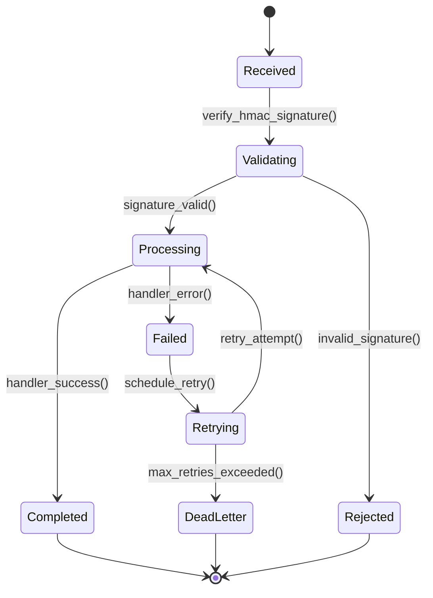
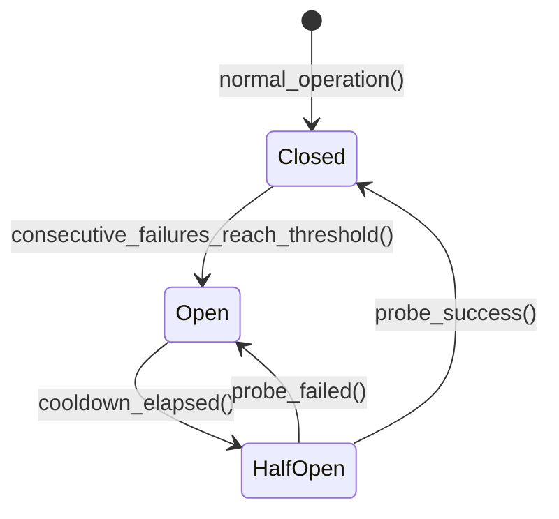
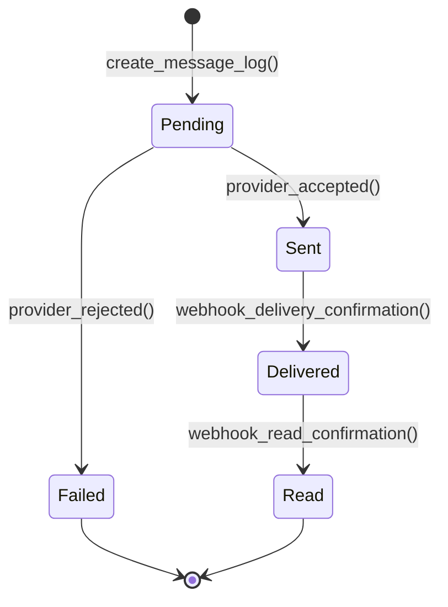
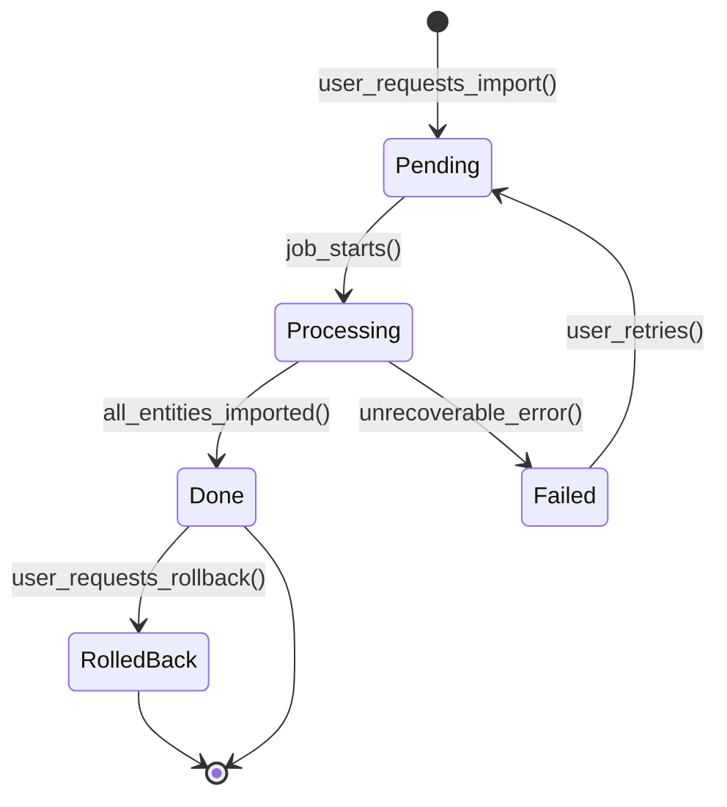
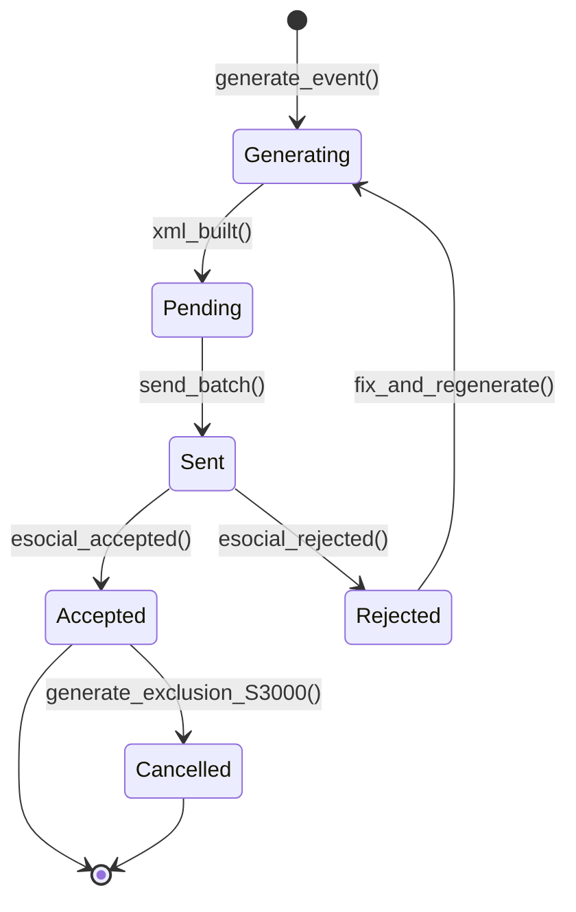
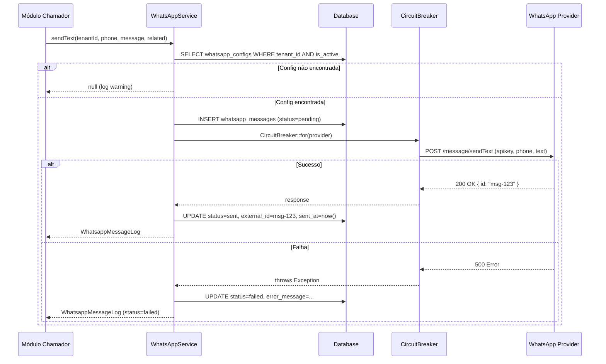
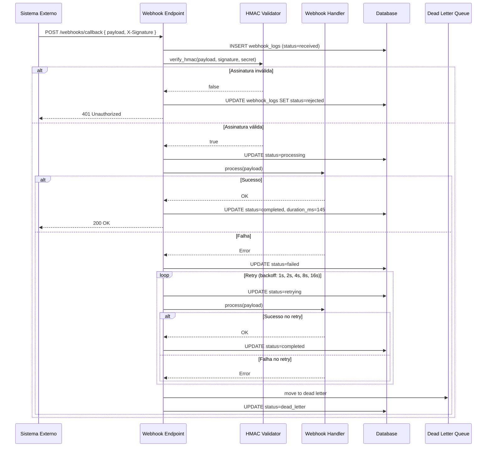
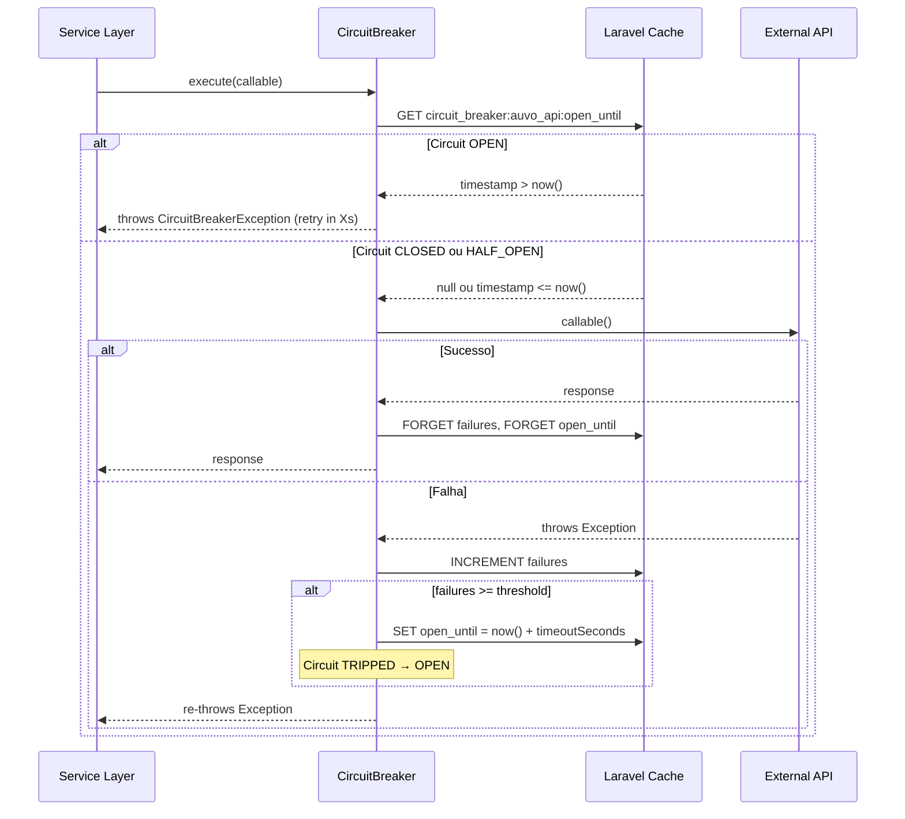

# Módulo: Integrações Externas

> **[AI_RULE]** Documentação oficial do módulo de Integrações. Centraliza TODA comunicação com APIs externas, webhooks, circuit breaker, retry policies e dead letter queues. Nenhum módulo do sistema deve chamar APIs externas diretamente — sempre via os services deste módulo com circuit breaker obrigatório.

---

## 1. Visão Geral

O módulo de Integrações é a camada de infraestrutura que abstrai e gerencia todas as conexões com serviços externos:

- **WhatsApp Business**: envio de mensagens, templates e documentos (Evolution API, Z-API, Meta)
- **Google Calendar**: sincronização de agendas de técnicos
- **Auvo (Field Service)**: import/export bidirecional de OS, clientes, equipamentos
- **BrasilAPI / ViaCEP / IBGE**: consultas de CNPJ, CEP, municípios
- **SEFAZ (Fiscal)**: webhooks de NF-e via FocusNFe
- **eSocial**: eventos trabalhistas S-1000 a S-3000
- **INMETRO**: webhooks de lacres e certificações
- **Web Push**: notificações no navegador
- **Assinatura Digital**: assinatura eletrônica de documentos
- **Geocodificação**: reverse geocoding e validação de localização
- **SSO**: SAML e OIDC por tenant
- **Circuit Breaker**: proteção centralizada contra falhas de APIs externas
- **Health Monitoring**: dashboard de saúde de todas as integrações

---

## 2. Entidades (Models)

### Entidades Principais

| Model | Tabela | Descrição |
|-------|--------|-----------|
| `Webhook` | `webhooks` | Configuração de webhook de saída (com SoftDeletes) |
| `WebhookConfig` | `webhook_configs` | Configuração de webhook por tenant |
| `WebhookLog` | `webhook_logs` | Log de execução de webhooks |
| `WhatsappConfig` | `whatsapp_configs` | Configuração do provedor WhatsApp por tenant |
| `WhatsappMessageLog` | `whatsapp_messages` | Log de mensagens WhatsApp enviadas/recebidas |
| `SsoConfig` | `sso_configs` | Configuração SSO (SAML/OIDC) por tenant |
| `AuvoIdMapping` | `auvo_id_mappings` | Mapeamento de IDs Auvo ↔ IDs locais |
| `AuvoImport` | `auvo_imports` | Registro de importações do Auvo |
| `GeofenceLocation` | `geofence_locations` | Pontos de geofence para validação de localização |
| `FiscalWebhook` | `fiscal_webhooks` | Webhooks recebidos da SEFAZ |
| `InmetroWebhook` | `inmetro_webhooks` | Webhooks recebidos do INMETRO |
| `ESocialEvent` | `esocial_events` | Eventos eSocial gerados (XML) |

### Campos Chave — `Webhook` (tabela: `webhooks`)

```php
protected $fillable = [
    'tenant_id', 'name', 'url', 'events', 'secret',
    'is_active', 'failure_count', 'last_triggered_at',
];

protected $casts = [
    'events' => 'array',
    'is_active' => 'boolean',
    'failure_count' => 'integer',
    'last_triggered_at' => 'datetime',
];
```

| Campo | Tipo | Descrição |
|-------|------|-----------|
| `tenant_id` | bigint FK | Tenant (multi-tenant) |
| `name` | string | Nome identificador do webhook |
| `url` | string | URL de destino |
| `events` | json | Array de eventos que disparam o webhook |
| `secret` | string | Chave HMAC para assinatura |
| `is_active` | boolean | Se está ativo |
| `failure_count` | integer | Contador de falhas consecutivas |
| `last_triggered_at` | datetime | Último disparo |

- Usa `SoftDeletes` para manter histórico
- Relacionamento: `logs()` → `HasMany(WebhookLog::class)`

### Campos Chave — `WebhookConfig` (tabela: `webhook_configs`)

```php
protected $fillable = [
    'tenant_id', 'name', 'url', 'events', 'secret',
    'is_active', 'last_triggered_at', 'failure_count',
];

protected $casts = [
    'events' => 'array',
    'is_active' => 'boolean',
    'last_triggered_at' => 'datetime',
    'failure_count' => 'integer',
];

protected $hidden = ['secret'];
```

| Campo | Tipo | Descrição |
|-------|------|-----------|
| `tenant_id` | bigint FK | Tenant (multi-tenant) |
| `name` | string | Nome da configuração |
| `url` | string | URL de destino |
| `events` | json | Array de eventos assinados |
| `secret` | string (hidden) | Chave HMAC para verificação |
| `is_active` | boolean | Se está ativo |
| `last_triggered_at` | datetime | Último disparo |
| `failure_count` | integer | Contador de falhas consecutivas |

### Campos Chave — `WebhookLog` (tabela: `webhook_logs`)

```php
protected $fillable = [
    'webhook_id', 'event', 'payload', 'response_status',
    'response_body', 'duration_ms', 'status',
];

protected $casts = [
    'payload' => 'array',
    'response_status' => 'integer',
    'duration_ms' => 'integer',
];
```

| Campo | Tipo | Descrição |
|-------|------|-----------|
| `webhook_id` | bigint FK | Webhook que gerou o log |
| `event` | string | Nome do evento disparado |
| `payload` | json | Corpo enviado na requisição |
| `response_status` | integer | HTTP status code da resposta |
| `response_body` | text | Corpo da resposta |
| `duration_ms` | integer | Tempo de execução em milissegundos |
| `status` | string | Estado do processamento |

**Status possíveis:** `received`, `validating`, `processing`, `completed`, `failed`, `retrying`, `dead_letter`, `rejected`

### Campos Chave — `WhatsappConfig` (tabela: `whatsapp_configs`)

```php
protected $fillable = [
    'tenant_id', 'provider', 'api_url', 'api_key',
    'instance_name', 'phone_number', 'is_active', 'settings',
];

protected $casts = [
    'is_active' => 'boolean',
    'settings' => 'array',
    'api_key' => 'encrypted',  // CRÍTICO: sempre criptografado
];

protected $hidden = ['api_key'];
```

| Campo | Tipo | Descrição |
|-------|------|-----------|
| `tenant_id` | bigint FK | Tenant (multi-tenant) |
| `provider` | string | Provedor: `evolution`, `z-api`, `meta` |
| `api_url` | string | URL base da API do provedor |
| `api_key` | string (encrypted) | Chave de API (sempre criptografada) |
| `instance_name` | string | Nome da instância no provedor |
| `phone_number` | string | Número de telefone vinculado |
| `is_active` | boolean | Se está ativo |
| `settings` | json | Configurações adicionais do provedor |

**Provedores suportados:** `evolution`, `z-api`, `meta`

### Campos Chave — `WhatsappMessageLog` (tabela: `whatsapp_messages`)

```php
protected $fillable = [
    'tenant_id', 'direction', 'phone_to', 'phone_from', 'message',
    'message_type', 'template_name', 'template_params', 'status',
    'external_id', 'error_message', 'related_type', 'related_id',
    'sent_at', 'delivered_at', 'read_at',
];

protected $casts = [
    'template_params' => 'array',
    'sent_at' => 'datetime',
    'delivered_at' => 'datetime',
    'read_at' => 'datetime',
];
```

| Campo | Tipo | Descrição |
|-------|------|-----------|
| `tenant_id` | bigint FK | Tenant (multi-tenant) |
| `direction` | string | `inbound` (recebida) ou `outbound` (enviada) |
| `phone_to` | string | Número de destino |
| `phone_from` | string | Número de origem |
| `message` | text | Conteúdo da mensagem |
| `message_type` | string | `text`, `template`, `document` |
| `template_name` | string | Nome do template usado |
| `template_params` | json | Parâmetros do template |
| `status` | string | `pending`, `sent`, `delivered`, `read`, `failed` |
| `external_id` | string | ID externo no provedor |
| `error_message` | text | Mensagem de erro (se falhou) |
| `related_type` | string | Tipo da entidade relacionada (polimórfico) |
| `related_id` | bigint | ID da entidade relacionada (polimórfico) |
| `sent_at` | datetime | Data/hora de envio |
| `delivered_at` | datetime | Data/hora de entrega |
| `read_at` | datetime | Data/hora de leitura |

- Relacionamento polimórfico: `related()` → `MorphTo` (pode ser WorkOrder, Quote, etc.)

### Campos Chave — `AuvoIdMapping` (tabela: `auvo_id_mappings`)

```php
protected $fillable = [
    'tenant_id', 'entity_type', 'auvo_id', 'local_id', 'import_id',
];
```

| Campo | Tipo | Descrição |
|-------|------|-----------|
| `tenant_id` | bigint FK | Tenant (multi-tenant) |
| `entity_type` | string | Tipo da entidade mapeada (customers, equipments, etc.) |
| `auvo_id` | bigint | ID no sistema Auvo |
| `local_id` | bigint | ID local no Kalibrium |
| `import_id` | bigint FK | Referência à importação que criou o mapping |

**Métodos estáticos utilitários:**

- `findLocal(entity, auvoId, tenantId)` → `?int` — Busca ID local por Auvo ID
- `findAuvo(entity, localId, tenantId)` → `?int` — Busca Auvo ID por ID local
- `mapOrCreate(entity, auvoId, localId, tenantId)` → `self` — Cria ou atualiza mapping
- `isMapped(entity, auvoId, tenantId)` → `bool` — Verifica se já mapeado
- `getMappings(entity, tenantId)` → `array` — Todos mappings de uma entidade
- `deleteMappingsForLocalIds(entity, localIds, tenantId)` → `int` — Rollback

### Campos Chave — `AuvoImport` (tabela: `auvo_imports`)

```php
protected $fillable = [
    'tenant_id', 'user_id', 'entity_type', 'status', 'strategy',
    'total_fetched', 'total_imported', 'total_updated',
    'total_skipped', 'total_errors', 'error_log', 'imported_ids',
    'filters', 'started_at', 'completed_at', 'last_synced_at',
];
```

| Campo | Tipo | Descrição |
|-------|------|-----------|
| `tenant_id` | bigint FK | Tenant (multi-tenant) |
| `user_id` | bigint FK | Usuário que disparou a importação |
| `entity_type` | string | Tipo de entidade importada |
| `status` | string | `pending`, `processing`, `done`, `failed`, `rolled_back` |
| `strategy` | string | `skip` (pular existentes) ou `update` (atualizar) |
| `total_fetched` | integer | Total de registros buscados na API |
| `total_imported` | integer | Total de registros criados |
| `total_updated` | integer | Total de registros atualizados |
| `total_skipped` | integer | Total de registros ignorados |
| `total_errors` | integer | Total de erros |
| `error_log` | json | Log detalhado de erros |
| `imported_ids` | json | IDs importados (para rollback) |
| `filters` | json | Filtros aplicados na importação |
| `started_at` | datetime | Início da execução |
| `completed_at` | datetime | Fim da execução |
| `last_synced_at` | datetime | Última sincronização |

**Status:** `pending`, `processing`, `done`, `failed`, `rolled_back`
**Strategy:** `skip` (pular existentes) ou `update` (atualizar existentes)
**Entity types:** `customers`, `equipments`, `equipment_categories`, `products`, `product_categories`, `services`, `tasks`, `task_types`, `expenses`, `expense_types`, `quotations`, `tickets`, `users`, `teams`, `segments`, `customer_groups`, `keywords`

---

## 3. Services

### 3.1 Tabela de Services

| Service | Namespace | Propósito |
|---------|-----------|-----------|
| `WhatsAppService` | `App\Services` | Envio de mensagens WhatsApp (texto, template, documento) |
| `GoogleCalendarService` | `App\Services` | Sincronização de agendas com Google Calendar |
| `AuvoApiClient` | `App\Services\Auvo` | Client HTTP para API do Auvo |
| `AuvoImportService` | `App\Services\Auvo` | Importação de dados do Auvo |
| `AuvoExportService` | `App\Services\Auvo` | Exportação de dados para o Auvo |
| `AuvoFieldMapper` | `App\Services\Auvo` | Mapeamento de campos Auvo ↔ Kalibrium |
| `BrasilApiService` | `App\Services` | Consulta CNPJ, CEP via BrasilAPI |
| `ViaCepService` | `App\Services` | Autopreenchimento de endereço por CEP |
| `IbgeService` | `App\Services` | Dados de municípios e estados |
| `ESocialService` | `App\Services` | Geração de eventos eSocial (XML) |
| `ExternalApiService` | `App\Services` | Client HTTP genérico com circuit breaker |
| `CircuitBreaker` | `App\Services\Integration` | Implementação do padrão Circuit Breaker |
| `IntegrationHealthService` | `App\Services\Integration` | Monitoramento de saúde das integrações |
| `WebPushService` | `App\Services` | Notificações push no navegador |
| `DocumentSigningService` | `App\Services` | Assinatura eletrônica de documentos |
| `ReverseGeocodingService` | `App\Services` | Geocodificação reversa (lat/lng → endereço) |
| `LocationValidationService` | `App\Services` | Validação de localização GPS com geofence |
| `MessagingService` | `App\Services` | Abstração unificada de mensageria |
| `InmetroWebhookService` | `App\Services` | Processamento de webhooks INMETRO |
| `InmetroGeocodingService` | `App\Services` | Geocodificação específica INMETRO |
| `FiscalWebhookService` | `App\Services\Fiscal` | Processamento de webhooks SEFAZ |
| `FiscalWebhookCallbackService` | `App\Services\Fiscal` | Callbacks de webhooks fiscais |

---

## 4. Ciclos de Vida (State Machines)

### 4.1 Webhook Recebido



**Retry Policy (Backoff Exponencial):**

| Tentativa | Delay | Acumulado |
|-----------|-------|-----------|
| 1 | 1s | 1s |
| 2 | 2s | 3s |
| 3 | 4s | 7s |
| 4 | 8s | 15s |
| 5 | 16s | 31s |
| 6+ | — | Dead Letter Queue |

### 4.2 Circuit Breaker para APIs Externas



**Implementação real (`App\Services\Integration\CircuitBreaker`):**

| Estado | Comportamento |
|--------|---------------|
| `closed` | Requests passam normalmente; falhas são contadas |
| `open` | Requests são rejeitados imediatamente com `CircuitBreakerException`; dura `timeoutSeconds` |
| `half_open` | Um request de teste é permitido; sucesso → `closed`, falha → `open` |

**Parâmetros padrão:**

- `DEFAULT_THRESHOLD = 5` (falhas consecutivas para abrir)
- `DEFAULT_TIMEOUT = 120` (segundos de cooldown)

**Uso:**

```php
$result = CircuitBreaker::for('auvo_api')
    ->withThreshold(5)
    ->withTimeout(120)
    ->execute(fn () => $client->get('/endpoint'));

// Com fallback (não lança exceção):
$result = CircuitBreaker::for('brasilapi')
    ->executeOrFallback(fn () => $client->get('/cnpj'), null);
```

**Backend (Cache-based):**

- `circuit_breaker:{service}:failures` → contador de falhas
- `circuit_breaker:{service}:open_until` → timestamp de reabertura

### 4.3 Mensagem WhatsApp



### 4.4 Importação Auvo



**Ordem de importação (respeitando dependências):**
`segments` → `customer_groups` → `keywords` → `customers` → `equipment_categories` → `equipments` → `product_categories` → `products` → `services` → `task_types` → `tasks` → `expense_types` → `expenses` → `quotations` → `tickets` → `users` → `teams`

### 4.5 Evento eSocial



**Eventos eSocial suportados:**

| Evento | Descrição | Model Relacionado |
|--------|-----------|-------------------|
| `S-1000` | Empregador/Contribuinte | `Tenant` |
| `S-1010` | Tabela de Rubricas | `ESocialRubric` |
| `S-1200` | Remuneração | `Payroll` |
| `S-1210` | Pagamentos | `Payroll` |
| `S-2200` | Admissão de Trabalhador | `User` |
| `S-2205` | Alteração Cadastral | `User` |
| `S-2206` | Alteração Contratual | `User` |
| `S-2210` | CAT (Comunicação de Acidente) | — |
| `S-2220` | ASO (Atestado de Saúde) | — |
| `S-2230` | Afastamento Temporário | `LeaveRequest` |
| `S-2240` | Condições Ambientais de Trabalho | — |
| `S-2299` | Desligamento | `Rescission` |
| `S-3000` | Exclusão de Evento | `ESocialEvent` |

---

## 5. Integrações Ativas (Adapters)

### 5.1 Tabela Completa de Integrações

| Integração | Service | Propósito | Circuit Breaker Key | Crítica? |
|------------|---------|-----------|---------------------|----------|
| WhatsApp Business | `WhatsAppService` | Notificações, NPS, atendimento | (por provider) | Sim |
| Google Calendar | `GoogleCalendarService` | Sincronização de agendas | `google_calendar` | Não |
| Auvo (Field Service) | `AuvoApiClient` | Import/Export bidirecional | `auvo_api` | Não |
| FocusNFe (SEFAZ) | `FiscalWebhookService` | Emissão e webhooks de NF-e | `focusnfe` | Sim |
| BrasilAPI | `BrasilApiService` | CNPJ, CEP, dados cadastrais | `external_api:brasilapi.com.br` | Não |
| CNPJ.ws | `ExternalApiService` | Consulta CNPJ (fallback) | `external_api:publica.cnpj.ws` | Não |
| OpenCNPJ | `ExternalApiService` | Consulta CNPJ (fallback) | `external_api:open.cnpja.com` | Não |
| ViaCEP | `ViaCepService` | Autopreenchimento de endereço | `external_api:viacep.com.br` | Não |
| IBGE | `IbgeService` | Municípios e estados | `external_api:ibge.gov.br` | Não |
| eSocial | `ESocialService` | Eventos trabalhistas (XML/SOAP) | `esocial` | Sim |
| INMETRO | `InmetroWebhookService` | Webhooks de lacres/certificações | `inmetro` | Não |
| Web Push | `WebPushService` | Notificações push no navegador | — | Não |
| Assinatura Digital | `DocumentSigningService` | Assinatura eletrônica | — | Não |
| IMAP (Email) | — | Recebimento de emails | `imap_{accountId}` | Não |

### 5.2 WhatsApp — Provedores Suportados

| Provedor | Método de Envio | Autenticação | Endpoint Base |
|----------|----------------|--------------|---------------|
| **Evolution API** | `sendViaEvolution()` | Header `apikey` | `{api_url}/message/sendText/{instance_name}` |
| **Z-API** | `sendViaZApi()` | Header `Client-Token` | `{api_url}/send-text` |
| **Meta (Official)** | `sendViaMeta()` | Bearer Token | `{api_url}/messages` |

**Funcionalidades do WhatsAppService:**

- `sendText(tenantId, phone, message, ?related)` → Mensagem de texto simples
- `sendTemplate(tenantId, phone, templateName, params, ?related)` → Template parametrizado
- `sendDocument(tenantId, phone, filePath, fileName, caption, ?related)` → PDF/documento

### 5.3 Auvo — Entidades Importáveis

| Entidade | Constante | Label PT |
|----------|-----------|----------|
| `customers` | `ENTITY_CUSTOMERS` | Clientes |
| `equipments` | `ENTITY_EQUIPMENTS` | Equipamentos |
| `products` | `ENTITY_PRODUCTS` | Produtos |
| `services` | `ENTITY_SERVICES` | Serviços |
| `tasks` | `ENTITY_TASKS` | OS / Tasks |
| `expenses` | `ENTITY_EXPENSES` | Despesas |
| `quotations` | `ENTITY_QUOTATIONS` | Orçamentos |
| `tickets` | `ENTITY_TICKETS` | Chamados |
| `users` | `ENTITY_USERS` | Usuários |
| `teams` | `ENTITY_TEAMS` | Equipes |
| `segments` | `ENTITY_SEGMENTS` | Segmentos |
| `customer_groups` | `ENTITY_CUSTOMER_GROUPS` | Grupos de Cliente |
| `keywords` | `ENTITY_KEYWORDS` | Palavras-chave |

---

## 6. Guard Rails de Negócio `[AI_RULE]`

> **[AI_RULE_CRITICAL] Circuit Breaker Obrigatório**
> TODA chamada HTTP a APIs externas DEVE usar o `CircuitBreaker`. Após `threshold` falhas consecutivas (padrão: 5), o circuito abre e bloqueia chamadas por `timeoutSeconds` (padrão: 120s). Probe de teste a cada cooldown para verificar recuperação. A IA NUNCA deve implementar chamadas HTTP diretas a serviços externos sem circuit breaker. Usar `CircuitBreaker::for('service_key')->execute(...)`.

> **[AI_RULE_CRITICAL] Validação HMAC de Webhooks**
> Webhooks recebidos (`WebhookConfig`) DEVEM ter signature HMAC verificada antes do processamento. O `secret` é armazenado no `WebhookConfig` e usado para computar `hash_hmac('sha256', payload, secret)`. Webhooks sem assinatura válida são registrados em `WebhookLog` como `Rejected` e descartados. NUNCA processar payload não verificado.

> **[AI_RULE_CRITICAL] Tokens e Secrets Encrypted**
> Tokens de API, secrets e credenciais de integração armazenados no banco DEVEM ser criptografados (`'api_key' => 'encrypted'` cast no Eloquent). NUNCA armazenar plaintext. A `WhatsappConfig.api_key` já usa cast `encrypted`. `WebhookConfig.secret` e `Webhook.secret` ficam em `$hidden`. Chave de criptografia vem do `APP_KEY` no `.env`.

> **[AI_RULE_CRITICAL] Dead Letter Queue**
> Webhooks e mensagens que falharam após max retries (5 tentativas com backoff exponencial: 1s, 2s, 4s, 8s, 16s) DEVEM ir para Dead Letter Queue (`WebhookLog.status = 'dead_letter'`). Dead letters ficam disponíveis para reprocessamento manual pelo admin. NUNCA descartar payloads silenciosamente.

> **[AI_RULE] Retry com Backoff Exponencial**
> Fórmula: `delay = 2^(attempt-1)` segundos. Máximo de 5 tentativas. Após max retries → Dead Letter. Cada retry é registrado em `WebhookLog` com o número da tentativa. O retry é idempotente — verificar se já processado antes de reprocessar.

> **[AI_RULE] Health Check Centralizado**
> O `IntegrationHealthService` monitora status de todas as integrações via seus circuit breakers. Endpoint `/api/v1/integrations/health` retorna status de cada serviço: `healthy` (closed), `degraded` (half_open), `down` (open). Dashboard resume: `{ summary: { healthy: N, degraded: N, down: N }, overall: "healthy"|"warning"|"degraded" }`.

> **[AI_RULE] Import Auvo Idempotente**
> `AuvoImportService` usa `AuvoIdMapping` para mapear IDs externos → IDs internos. Imports são idempotentes: se o `auvo_id` já existe no mapping, strategy `update` faz UPDATE, strategy `skip` ignora. NUNCA duplicar registros. Rollback usa `deleteMappingsForLocalIds()` para desfazer importação.

> **[AI_RULE] WhatsApp Multi-Provider**
> `WhatsAppService` suporta múltiplos providers (Evolution, Z-API, Meta) via `WhatsappConfig.provider`. Cada tenant configura seu provider independentemente. O service resolve o provider via `match($config->provider)` e direciona para o método correto. Fallback não é automático entre providers — cada tenant usa um provider.

> **[AI_RULE] eSocial — Geração e Envio de Eventos**
> `ESocialService` gera XMLs conforme layout eSocial S-1.2. Eventos são armazenados em `ESocialEvent` com status `generating` → `pending` → `sent` → `accepted`/`rejected`. Batch ID agrupa eventos para envio. Evento `S-3000` permite exclusão de eventos aceitos. Ambiente (`production`/`restricted`) vem do config `esocial.environment`.

> **[AI_RULE] Webhook Sender (Saída)**
> Ao configurar `WebhookConfig`, o tenant define URL destino, eventos que disparam, e secret para HMAC. Quando um evento ocorre no sistema, o webhook sender computa HMAC do payload, envia POST para a URL, e registra resultado em `WebhookLog`. Se falhar, incrementa `failure_count` e agenda retry.

---

## 7. Comportamento Integrado (Cross-Domain)

| Direção | Módulo | Integração |
|---------|--------|------------|
| ↔ | **WorkOrders** | Sincronização bidirecional com Auvo (import/export de OS via `AuvoImportService`/`AuvoExportService`) |
| → | **CRM** | WhatsApp Messages vinculadas a `CrmActivity`; notificações de follow-up |
| ↔ | **HR** | Google Calendar sincronizado com agenda de técnicos; eSocial para eventos trabalhistas |
| → | **Portal** | Web Push para notificações do portal; WhatsApp para pesquisas de satisfação |
| ← | **Fiscal** | Webhooks de SEFAZ (FocusNFe) processados via `FiscalWebhookCallbackService` |
| ← | **Inmetro** | Webhooks INMETRO processados via `InmetroWebhookService` |
| → | **Finance** | Notificações WhatsApp de faturas vencidas/vencendo |
| ↔ | **Inventory** | Importação de produtos/equipamentos do Auvo; notificações de estoque baixo |
| → | **All Modules** | Circuit breaker protege todos os módulos que consomem APIs externas |

---

## 8. Contratos de API (JSON)

### 8.1 Health Check de Integrações

```http
GET /api/v1/integrations/health
Authorization: Bearer {admin-token}
```

**Response (200):**

```json
{
  "success": true,
  "data": {
    "integrations": [
      {
        "key": "auvo_api",
        "label": "Auvo API",
        "category": "field_service",
        "critical": false,
        "status": "healthy",
        "state": "closed",
        "failures": 0
      },
      {
        "key": "focusnfe",
        "label": "FocusNFe (Notas Fiscais)",
        "category": "fiscal",
        "critical": true,
        "status": "down",
        "state": "open",
        "failures": 5
      },
      {
        "key": "external_api:brasilapi.com.br",
        "label": "BrasilAPI (CNPJ)",
        "category": "data",
        "critical": false,
        "status": "degraded",
        "state": "half_open",
        "failures": 3
      }
    ],
    "summary": {
      "healthy": 5,
      "degraded": 1,
      "down": 1
    },
    "overall": "degraded",
    "checked_at": "2026-03-24T15:00:00Z"
  }
}
```

### 8.2 Webhook Config CRUD

```http
POST /api/v1/webhooks
Authorization: Bearer {admin-token}
Content-Type: application/json
```

**Request:**

```json
{
  "name": "Notificação de OS Completada",
  "url": "https://meu-sistema.com/webhooks/os-completed",
  "events": ["work_order.completed", "work_order.cancelled"],
  "secret": "meu-secret-hmac-256"
}
```

**Response (201):**

```json
{
  "success": true,
  "data": {
    "id": 12,
    "tenant_id": 1,
    "name": "Notificação de OS Completada",
    "url": "https://meu-sistema.com/webhooks/os-completed",
    "events": ["work_order.completed", "work_order.cancelled"],
    "is_active": true,
    "failure_count": 0,
    "last_triggered_at": null
  }
}
```

### 8.3 Logs de Webhook

```http
GET /api/v1/webhooks/{id}/logs
Authorization: Bearer {admin-token}
```

**Response (200):**

```json
{
  "success": true,
  "data": [
    {
      "id": 501,
      "webhook_id": 12,
      "event": "work_order.completed",
      "payload": { "work_order_id": 789, "status": "completed" },
      "response_status": 200,
      "response_body": "{\"ok\":true}",
      "duration_ms": 145,
      "status": "completed",
      "created_at": "2026-03-24T15:05:00Z"
    },
    {
      "id": 502,
      "webhook_id": 12,
      "event": "work_order.completed",
      "payload": { "work_order_id": 790, "status": "completed" },
      "response_status": 500,
      "response_body": "Internal Server Error",
      "duration_ms": 30120,
      "status": "dead_letter",
      "created_at": "2026-03-24T15:10:00Z"
    }
  ]
}
```

### 8.4 WhatsApp — Envio de Mensagem (Interno)

```php
// Uso programático (não é endpoint público)
$whatsapp = app(WhatsAppService::class);

// Texto simples
$log = $whatsapp->sendText(
    tenantId: 1,
    phone: '11999887766',
    message: 'Sua OS #12345 foi concluída.',
    related: $workOrder
);

// Template parametrizado
$log = $whatsapp->sendTemplate(
    tenantId: 1,
    phone: '11999887766',
    templateName: 'os_completed',
    params: ['os_number' => '12345', 'date' => '24/03/2026'],
    related: $workOrder
);

// Documento (PDF)
$log = $whatsapp->sendDocument(
    tenantId: 1,
    phone: '11999887766',
    filePath: '/storage/certificates/cert-001.pdf',
    fileName: 'Certificado_Calibracao.pdf',
    caption: 'Certificado de calibração do equipamento XYZ',
    related: $certificate
);
```

### 8.5 WhatsApp Webhooks (Recebimento)

```http
POST /api/v1/webhooks/whatsapp/status
Content-Type: application/json
```

**Payload (delivery status):**

```json
{
  "instance": "kalibrium-prod",
  "data": {
    "id": "msg-abc123",
    "status": "delivered",
    "timestamp": 1711292700
  }
}
```

```http
POST /api/v1/webhooks/whatsapp/messages
Content-Type: application/json
```

**Payload (incoming message):**

```json
{
  "instance": "kalibrium-prod",
  "data": {
    "from": "5511999887766",
    "message": "Qual o status da minha OS?",
    "timestamp": 1711292800
  }
}
```

### 8.6 Google Calendar

```http
GET /api/v1/integrations/google-calendar/status
Authorization: Bearer {admin-token}
```

**Response (200):**

```json
{
  "success": true,
  "data": {
    "connected": true,
    "email": "tecnico@empresa.com",
    "last_sync": "2026-03-24T14:00:00Z",
    "events_synced": 42
  }
}
```

```http
POST /api/v1/integrations/google-calendar/sync
Authorization: Bearer {admin-token}
```

### 8.7 eSocial — Geração de Evento

```php
// Uso programático
$esocial = app(ESocialService::class);

// Gerar evento de admissão
$event = $esocial->generateEvent('S-2200', $user, $tenantId);
// → ESocialEvent { status: 'generating', xml_content: '<eSocial>...' }

// Enviar batch
$batchId = $esocial->sendBatch([$event->id]);
// → 'BATCH-20260324150000-abc123'

// Verificar status do batch
$status = $esocial->checkBatchStatus($batchId);
// → { batch_id, total, sent, accepted, rejected, events: [...] }

// Excluir evento aceito
$exclusion = $esocial->generateExclusionEvent($event->id, 'Dados incorretos');
// → ESocialEvent { event_type: 'S-3000', status: 'pending' }
```

---

## 9. Permissões (RBAC)

| Permissão | Descrição | Usado em |
|-----------|-----------|----------|
| `platform.settings.view` | Visualizar webhooks, API keys, swagger | InfraIntegrationController |
| `platform.settings.manage` | CRUD de webhooks, API keys | InfraIntegrationController |
| `admin.settings.view` | Visualizar canais de notificação | IntegrationController |

---

## 10. Rotas da API

### Webhooks (Admin)

| Método | Rota | Controller | Ação |
|--------|------|------------|------|
| `GET` | `/api/v1/webhooks` | `InfraIntegrationController@webhookConfigs` | Listar webhooks |
| `POST` | `/api/v1/webhooks` | `InfraIntegrationController@storeWebhook` | Criar webhook |
| `PUT` | `/api/v1/webhooks/{id}` | `InfraIntegrationController@updateWebhook` | Atualizar webhook |
| `DELETE` | `/api/v1/webhooks/{id}` | `InfraIntegrationController@deleteWebhook` | Excluir webhook |
| `POST` | `/api/v1/webhooks/{id}/test` | `InfraIntegrationController@testWebhook` | Testar webhook |
| `GET` | `/api/v1/webhooks/{id}/logs` | `InfraIntegrationController@webhookLogs` | Logs do webhook |

### API Keys (Admin)

| Método | Rota | Controller | Ação |
|--------|------|------------|------|
| `GET` | `/api/v1/api-keys` | `InfraIntegrationController@apiKeys` | Listar API keys |
| `POST` | `/api/v1/api-keys` | `InfraIntegrationController@createApiKey` | Criar API key |

### Google Calendar

| Método | Rota | Controller | Ação |
|--------|------|------------|------|
| `GET` | `/api/v1/integrations/google-calendar/status` | `GoogleCalendarController@status` | Status da conexão |
| `GET` | `/api/v1/integrations/google-calendar/auth-url` | `GoogleCalendarController@authUrl` | URL de autorização |
| `POST` | `/api/v1/integrations/google-calendar/callback` | `GoogleCalendarController@callback` | Callback OAuth |
| `POST` | `/api/v1/integrations/google-calendar/disconnect` | `GoogleCalendarController@disconnect` | Desconectar |
| `POST` | `/api/v1/integrations/google-calendar/sync` | `GoogleCalendarController@sync` | Sincronizar agendas |

### WhatsApp Webhooks (Público — `throttle:120,1`)

| Método | Rota | Controller | Ação |
|--------|------|------------|------|
| `POST` | `/api/v1/webhooks/whatsapp/status` | `WhatsAppWebhookController@handleStatus` | Callback de status |
| `POST` | `/api/v1/webhooks/whatsapp/messages` | `WhatsAppWebhookController@handleMessage` | Mensagem recebida |

### Infraestrutura

| Método | Rota | Controller | Ação |
|--------|------|------------|------|
| `GET` | `/api/v1/swagger` | `InfraIntegrationController@swaggerSpec` | Especificação OpenAPI |

---

## 11. Diagramas de Sequência

### 11.1 Envio de Mensagem WhatsApp



### 11.2 Recebimento e Processamento de Webhook



### 11.3 Circuit Breaker em Ação



---

## 12. Testes Requeridos (BDD)

### 12.1 Circuit Breaker

```gherkin
Funcionalidade: Circuit Breaker

  Cenário: Circuito abre após threshold de falhas
    Dado um CircuitBreaker para "test_service" com threshold=3
    Quando 3 chamadas consecutivas falham
    Então o circuito transiciona para "open"
    E chamadas subsequentes lançam CircuitBreakerException

  Cenário: Circuito fecha após probe bem-sucedido
    Dado um circuito em estado "open"
    E o cooldown expirou
    Quando uma chamada é bem-sucedida (probe)
    Então o circuito transiciona para "closed"
    E o contador de falhas é resetado

  Cenário: Fallback quando circuito está aberto
    Dado um circuito em estado "open"
    Quando uso executeOrFallback com fallback=null
    Então recebo null sem exceção
```

### 12.2 WhatsApp

```gherkin
Funcionalidade: WhatsApp Service

  Cenário: Envio de texto com sucesso
    Dado uma WhatsappConfig ativa para o tenant
    Quando envio sendText com phone e message
    Então um WhatsappMessageLog é criado com status "sent"
    E external_id é preenchido
    E sent_at é preenchido

  Cenário: Envio falha — log registra erro
    Dado uma WhatsappConfig ativa
    E o provider retorna erro 500
    Quando envio sendText
    Então o log é atualizado com status "failed"
    E error_message contém a mensagem de erro

  Cenário: Sem config ativa retorna null
    Dado que não existe WhatsappConfig ativa para o tenant
    Quando envio sendText
    Então retorna null sem exceção
```

### 12.3 Webhooks

```gherkin
Funcionalidade: Processamento de Webhooks

  Cenário: Webhook com HMAC válido é processado
    Dado um WebhookConfig com secret definido
    Quando recebo POST com X-Signature correto
    Então o webhook é processado com status "completed"

  Cenário: Webhook com HMAC inválido é rejeitado
    Quando recebo POST com X-Signature incorreto
    Então o WebhookLog registra status "rejected"
    E o payload NÃO é processado

  Cenário: Dead letter após max retries
    Dado um webhook que falha no processamento
    Quando 5 retries com backoff exponencial falharam
    Então o status final é "dead_letter"
    E o payload está disponível para reprocessamento manual
```

### 12.4 Auvo Import

```gherkin
Funcionalidade: Importação Auvo

  Cenário: Import idempotente (strategy=skip)
    Dado que já existe mapping para auvo_id=100 → local_id=50
    E strategy é "skip"
    Quando importo novamente o registro auvo_id=100
    Então o registro NÃO é duplicado
    E total_skipped incrementa

  Cenário: Import com update (strategy=update)
    Dado que já existe mapping para auvo_id=100 → local_id=50
    E strategy é "update"
    Quando importo novamente com dados atualizados
    Então o registro local_id=50 é atualizado
    E total_updated incrementa

  Cenário: Rollback de importação
    Dado uma importação concluída com 10 registros
    Quando solicito rollback
    Então os 10 registros são removidos
    E os mappings são deletados via deleteMappingsForLocalIds
    E o status muda para "rolled_back"
```

### 12.5 Health Check

```gherkin
Funcionalidade: Health Check de Integrações

  Cenário: Todas as integrações saudáveis
    Dado que todos os circuit breakers estão "closed"
    Quando consulto /integrations/health
    Então overall é "healthy"
    E todas as integrações têm status "healthy"

  Cenário: Integração crítica down
    Dado que o circuit breaker "focusnfe" está "open"
    Quando consulto /integrations/health
    Então overall é "degraded"
    E focusnfe tem status "down"
    E summary.down >= 1
```

---

## Circuit Breaker Test Specifications

### BDD Scenarios

Scenario 1: Circuit opens after threshold failures
  Given circuit breaker threshold is 5 failures
  And integration endpoint fails 5 consecutive times
  When next request is attempted
  Then circuit state is 'open'
  And fallback response is returned

Scenario 2: Circuit transitions to half-open after cooldown
  Given circuit is 'open'
  And cooldown period (60s) has elapsed
  When next request is attempted
  Then circuit state is 'half-open'
  And ONE probe request is sent

Scenario 3: Circuit closes on successful probe
  Given circuit is 'half-open'
  And probe request succeeds
  Then circuit state is 'closed'
  And normal request flow resumes

Scenario 4: Circuit stays open on failed probe
  Given circuit is 'half-open'
  And probe request fails
  Then circuit state is 'open'
  And cooldown timer resets

Scenario 5: Fallback provides cached data
  Given circuit is 'open'
  And cached data exists (age < 1 hour)
  When client requests data
  Then cached data is returned with header X-Circuit-Breaker: open

---

## 13. Migrations Relacionadas

| Migration | Descrição |
|-----------|-----------|
| `2026_02_14_000001_create_auvo_imports_tables` | Tabelas `auvo_imports` e `auvo_id_mappings` |
| `2026_02_14_000002_add_auvo_import_permissions` | Permissões de importação Auvo |
| `2026_02_14_015000_create_stock_integration_tables` | Integrações de estoque |
| `2026_02_14_060000_create_portal_integration_security_tables` | Segurança de integrações do portal |

---

## 14. Observabilidade e Métricas

### Métricas Chave

| Métrica | Descrição | Alerta |
|---------|-----------|--------|
| `integrations.health.overall` | Status geral das integrações | `degraded` → alerta ops |
| `integrations.circuit_breaker.open` | Circuitos abertos atualmente | > 0 para `critical=true` → alerta |
| `integrations.webhook.failure_rate` | Taxa de falha de webhooks enviados | > 10% → investigar |
| `integrations.webhook.dead_letter_count` | Webhooks em dead letter | > 0 → reprocessar |
| `integrations.whatsapp.sent_per_hour` | Mensagens WhatsApp enviadas/hora | > 1000 → possível loop |
| `integrations.whatsapp.failure_rate` | Taxa de falha WhatsApp | > 20% → verificar provider |
| `integrations.auvo.import_duration` | Duração de importação Auvo | > 30min → otimizar |
| `integrations.esocial.rejected_count` | Eventos eSocial rejeitados | > 0 → corrigir XML |
| `integrations.api.avg_response_time` | Tempo médio de resposta de APIs | > 5s → degradação |

### Logs Estruturados

```
[Integration] circuit_breaker_tripped service=auvo_api threshold=5 timeout=120s
[Integration] circuit_breaker_closed service=auvo_api previous_state=half_open
[Integration] webhook_sent webhook_id=12 event=work_order.completed status=200 duration=145ms
[Integration] webhook_failed webhook_id=12 event=work_order.completed status=500 retry=3/5
[Integration] webhook_dead_letter webhook_id=12 event=work_order.completed attempts=5
[Integration] whatsapp_sent tenant_id=1 phone=11999887766 type=text external_id=msg-123
[Integration] whatsapp_failed tenant_id=1 phone=11999887766 error="Evolution API error: 429"
[Integration] auvo_import_started tenant_id=1 entity=customers strategy=update
[Integration] auvo_import_completed tenant_id=1 entity=customers imported=50 updated=12 skipped=3 errors=0
[Integration] esocial_event_generated tenant_id=1 type=S-2200 user_id=100
[Integration] esocial_batch_sent batch_id=BATCH-20260324-abc count=5
[Integration] health_check overall=degraded down=1 degraded=1 healthy=5
```

---

## WhatsApp Integration

> **[AI_RULE]** Configuracao WhatsApp e por tenant. Toda mensagem enviada gera `WhatsappMessageLog`. Service `WhatsAppService` abstrai o provider (Evolution API, Z-API, Meta).

### Entidades

#### `WhatsappConfig`

Configuracao do WhatsApp por tenant.

| Campo | Tipo | Descricao |
|---|---|---|
| `tenant_id` | bigint | Tenant (unique) |
| `provider` | string | Provider (`evolution`, `z-api`, `meta`) |
| `api_url` | string | URL da API |
| `api_key` | string | Chave de autenticacao |
| `instance_name` | string | Nome da instancia |
| `enabled` | boolean | Integracao habilitada |
| `webhook_url` | string | URL de webhook para recebimento |

#### `WhatsappMessageLog`

Log de mensagens enviadas/recebidas.

| Campo | Tipo | Descricao |
|---|---|---|
| `tenant_id` | bigint | Tenant |
| `phone` | string | Numero de telefone |
| `content` | text | Conteudo da mensagem |
| `direction` | string | `outbound`, `inbound` |
| `status` | string | `sent`, `delivered`, `read`, `failed` |
| `external_id` | string | ID da mensagem no provider |
| `error_message` | text | Mensagem de erro (se falhou) |
| `created_at` | datetime | Data de envio/recebimento |

### Endpoints — WhatsApp

| Metodo | Rota | Controller | Descricao |
|---|---|---|---|
| `GET` | `/api/v1/whatsapp/config` | `WhatsappController@getWhatsappConfig` | Obter configuracao WhatsApp do tenant |
| `POST` | `/api/v1/whatsapp/config` | `WhatsappController@saveWhatsappConfig` | Salvar/atualizar configuracao WhatsApp |
| `POST` | `/api/v1/whatsapp/test` | `WhatsappController@testWhatsapp` | Enviar mensagem de teste para validar conexao |
| `POST` | `/api/v1/whatsapp/send` | `WhatsappController@sendWhatsapp` | Enviar mensagem WhatsApp (phone + message) |
| `GET` | `/api/v1/whatsapp/logs` | `WhatsappController@whatsappLogs` | Listar logs de mensagens (filtro por search, status, limite 200) |

### Service

- **`WhatsAppService`**: abstrai provider, expoe `sendText($tenantId, $phone, $message)`. Retorna `WhatsappMessageLog` com status.

---

## Fluxos Relacionados

| Fluxo | Descrição |
|-------|-----------|
| [Integrações Externas](file:///c:/PROJETOS/sistema/docs/fluxos/INTEGRACOES-EXTERNAS.md) | Processo documentado em `docs/fluxos/INTEGRACOES-EXTERNAS.md` |

---

## Inventario Completo do Codigo

### Models

| Arquivo | Model |
|---------|-------|
| `backend/app/Models/AuvoIdMapping.php` | AuvoIdMapping |
| `backend/app/Models/AuvoImport.php` | AuvoImport |

### Controllers

| Arquivo | Controller |
|---------|------------|
| `backend/app/Http/Controllers/Api/V1/AuvoImportController.php` | AuvoImportController |
| `backend/app/Http/Controllers/Api/V1/AuvoExportController.php` | AuvoExportController |
| `backend/app/Http/Controllers/Api/V1/IntegrationController.php` | IntegrationController |
| `backend/app/Http/Controllers/Api/V1/IntegrationHealthController.php` | IntegrationHealthController |
| `backend/app/Http/Controllers/Api/V1/InfraIntegrationController.php` | InfraIntegrationController (webhooks config) |
| `backend/app/Http/Controllers/Api/V1/StockIntegrationController.php` | StockIntegrationController |
| `backend/app/Http/Controllers/Api/V1/FiscalWebhookCallbackController.php` | FiscalWebhookCallbackController |
| `backend/app/Http/Controllers/Api/V1/Webhook/WhatsAppWebhookController.php` | WhatsAppWebhookController |
| `backend/app/Http/Controllers/Api/V1/Integration/GoogleCalendarController.php` | GoogleCalendarController |
| `backend/app/Http/Controllers/Api/V1/WhatsappController.php` | WhatsappController |

### Services

| Arquivo | Service |
|---------|---------|
| `backend/app/Services/Auvo/AuvoApiClient.php` | AuvoApiClient — HTTP client para API Auvo v2 |
| `backend/app/Services/Auvo/AuvoExportService.php` | AuvoExportService — exporta clientes/produtos para Auvo |
| `backend/app/Services/Auvo/AuvoFieldMapper.php` | AuvoFieldMapper — mapeamento de campos Kalibrium ↔ Auvo |
| `backend/app/Services/Auvo/AuvoImportService.php` | AuvoImportService — importa entidades do Auvo |
| `backend/app/Services/Integration/CircuitBreaker.php` | CircuitBreaker — protecao contra falhas de APIs externas |
| `backend/app/Services/Integration/IntegrationHealthService.php` | IntegrationHealthService — monitoramento de saude |
| `backend/app/Services/DocumentSigningService.php` | DocumentSigningService — assinatura digital de documentos |
| `backend/app/Services/WhatsAppService.php` | WhatsAppService — abstrai provider WhatsApp |
| `backend/app/Services/TwilioSmsProvider.php` | TwilioSmsProvider — provider SMS via Twilio |
| `backend/app/Services/LogSmsProvider.php` | LogSmsProvider — provider SMS para dev/test (log only) |
| `backend/app/Services/Fiscal/FiscalWebhookService.php` | FiscalWebhookService — webhooks SEFAZ |
| `backend/app/Services/Fiscal/FiscalWebhookCallbackService.php` | FiscalWebhookCallbackService — callbacks SEFAZ |
| `backend/app/Services/InmetroWebhookService.php` | InmetroWebhookService — webhooks INMETRO |

### Jobs

| Arquivo | Job |
|---------|-----|
| `backend/app/Jobs/DispatchWebhookJob.php` | DispatchWebhookJob — dispara webhooks configurados |

### FormRequests

| Arquivo | FormRequest |
|---------|-------------|
| `backend/app/Http/Requests/Integration/StoreNotificationChannelRequest.php` | StoreNotificationChannelRequest |

### Frontend Hooks

| Arquivo | Hook |
|---------|------|
| `frontend/src/hooks/useAuvoExport.ts` | useAuvoExport |
| `frontend/src/hooks/useAuvoImport.ts` | useAuvoImport |

### Frontend Pages

| Arquivo | Pagina |
|---------|--------|
| `frontend/src/pages/integracao/AuvoImportPage.tsx` | AuvoImportPage |
| `frontend/src/pages/estoque/StockIntegrationPage.tsx` | StockIntegrationPage |
| `frontend/src/pages/inmetro/InmetroWebhooksPage.tsx` | InmetroWebhooksPage |

### Rotas Auvo (extraidas de `routes/api/financial.php`)

| Metodo | Rota | Controller | Permissao |
|--------|------|------------|-----------|
| `GET` | `/api/v1/auvo/status` | `AuvoImportController@testConnection` | `auvo.import.view` |
| `GET` | `/api/v1/auvo/sync-status` | `AuvoImportController@syncStatus` | `auvo.import.view` |
| `GET` | `/api/v1/auvo/preview/{entity}` | `AuvoImportController@preview` | `auvo.import.view` |
| `GET` | `/api/v1/auvo/history` | `AuvoImportController@history` | `auvo.import.view` |
| `GET` | `/api/v1/auvo/mappings` | `AuvoImportController@mappings` | `auvo.import.view` |
| `GET` | `/api/v1/auvo/config` | `AuvoImportController@getConfig` | `auvo.import.view` |
| `POST` | `/api/v1/auvo/import/{entity}` | `AuvoImportController@import` | `auvo.import.execute` |
| `POST` | `/api/v1/auvo/import-all` | `AuvoImportController@importAll` | `auvo.import.execute` |
| `PUT` | `/api/v1/auvo/config` | `AuvoImportController@config` | `auvo.import.execute` |
| `POST` | `/api/v1/auvo/rollback/{id}` | `AuvoImportController@rollback` | `auvo.import.delete` |
| `DELETE` | `/api/v1/auvo/history/{id}` | `AuvoImportController@destroy` | `auvo.import.delete` |
| `POST` | `/api/v1/auvo/export/customer/{customer}` | `AuvoExportController@exportCustomer` | `auvo.export.execute` |
| `POST` | `/api/v1/auvo/export/product/{product}` | `AuvoExportController@exportProduct` | `auvo.export.execute` |

### Rotas Webhook Config (extraidas de `routes/api/advanced-lots.php`)

| Metodo | Rota | Controller | Permissao |
|--------|------|------------|-----------|
| `GET` | `/api/v1/webhooks` | `InfraIntegrationController@webhookConfigs` | `platform.settings.view` |
| `POST` | `/api/v1/webhooks` | `InfraIntegrationController@storeWebhook` | `platform.settings.manage` |
| `PUT` | `/api/v1/webhooks/{id}` | `InfraIntegrationController@updateWebhook` | `platform.settings.manage` |

### Rotas Google Calendar (extraidas de `routes/api/advanced-features.php`)

| Metodo | Rota | Controller | Permissao |
|--------|------|------------|-----------|
| `GET` | `/api/v1/integrations/google-calendar/status` | `GoogleCalendarController@status` | `platform.settings.view` |
| `GET` | `/api/v1/integrations/google-calendar/auth-url` | `GoogleCalendarController@authUrl` | `platform.settings.view` |
| `POST` | `/api/v1/integrations/google-calendar/callback` | `GoogleCalendarController@callback` | `platform.settings.manage` |
| `POST` | `/api/v1/integrations/google-calendar/disconnect` | `GoogleCalendarController@disconnect` | `platform.settings.manage` |
| `POST` | `/api/v1/integrations/google-calendar/sync` | `GoogleCalendarController@sync` | `platform.settings.manage` |

### Route Files

| Arquivo | Escopo |
|---------|--------|
| `backend/routes/api/financial.php` | Rotas Auvo (import/export) |
| `backend/routes/api/advanced-lots.php` | Rotas Webhook Config |
| `backend/routes/api/advanced-features.php` | Rotas Google Calendar |
| `backend/routes/api/analytics-features.php` | Rotas WhatsApp |
| `backend/routes/api.php` | Rotas publicas de webhooks (WhatsApp status/messages) |

---

## Edge Cases e Tratamento de Erros `[AI_RULE_CRITICAL]`

> **[AI_RULE_CRITICAL]** Ao implementar o módulo **Integrations**, a IA DEVE tratar interrupções externas com robustez (Circuit Breaker) e prevenir Dead Letter queues infinitas, garantindo a atomicidade de transações multi-sistema (ex: CRM -> Auvo -> Kalibrium).

| Cenário de Borda | Tratamento Obrigatório (Guard Rail) | Código / Validação Esperada |
|-----------------|--------------------------------------|---------------------------|
| **Webhook HMAC Timing Attack** | Atacante forja o payload do webhook (ex: WhatsApp, Sefaz) tentando inferir a chave. | `InfraIntegrationController` / `WhatsAppWebhookController` DEVEM usar `hash_equals()` nativo do PHP e não `==` na validação de segredo. |
| **Circuit Breaker Flapping** | API Externa sofre lentidão de 30s. O Circuit breaker abre e fecha intermitentemente. | Tempo limite do `open` state DEVE ter _jitter/backoff_ (aumentar escalando para evitar avalanches na retomada). |
| **Diferenças de Fuso Horário (Auvo Sync)** | Sincronia de tarefas do Auvo (UTC-3) joga datas localmente incorretas por falta de flag. | O `AuvoImportService` DEVE forçar cast com `Carbon::parse($date)->setTimezone('UTC')` explicitamente. |
| **Dead Letter Storming** | Serviço X fica offline. Webhooks locais retentam milhões de vezes estourando o banco de logs. | Número máximo padronizado de retries (ex: 5). Após o limite, o `status` vira implacavelmente `dead_letter` e não é processado sem intervenção manual. |
| **Importação Duplicada Idempotente** | Request para AuvoImport é submetido 3x seguidas pelo frontend. | O Controller deve possuir lock de cache baseado em `auth()->id() . md5($payload)` ou transaction-id unique por fila. |

---

## Checklist de Implementação

### Backend
- [ ] Models com `BelongsToTenant`, `$fillable`, `$casts`, relationships
- [ ] Migrations com `tenant_id`, indexes, foreign keys
- [ ] Controllers seguem padrão Resource (index/store/show/update/destroy)
- [ ] FormRequests com validação completa (required, tipos, exists)
- [ ] Services encapsulam lógica de negócio e transições de estado
- [ ] Policies com permissões Spatie registradas
- [ ] Routes registradas em `routes/api/`
- [ ] Events/Listeners para integrações cross-domain
- [ ] CircuitBreakerService com estados (closed, open, half-open) e backoff exponencial com jitter
- [ ] WhatsApp integration (Evolution API, Z-API, Meta) com envio de mensagens, templates e documentos
- [ ] Google Calendar sync bidirecional com OAuth2 flow completo
- [ ] Auvo import/export bidirecional (OS, clientes, equipamentos) com idempotência
- [ ] BrasilAPI / ViaCEP / IBGE para consultas de CNPJ, CEP, municípios
- [ ] Webhook configs com validação HMAC via `hash_equals()` (timing-attack safe)
- [ ] Dead Letter Queue com máximo de 5 retries antes de status `dead_letter`
- [ ] IntegrationHealthService com dashboard de saúde de todas as integrações
- [ ] SSO (SAML e OIDC) configurável por tenant

### Frontend
- [ ] Páginas de listagem, criação, edição
- [ ] Tipos TypeScript espelhando response da API
- [ ] Componentes seguem Design System (tokens, componentes)
- [ ] Dashboard de saúde das integrações com status em tempo real
- [ ] Configuração de webhooks com teste de conectividade
- [ ] Fluxo OAuth2 para Google Calendar com feedback visual

### Testes
- [ ] Feature tests para cada endpoint (happy path + error + validation + auth)
- [ ] Unit tests para Services (lógica de negócio, state machine)
- [ ] Tenant isolation verificado em todos os endpoints
- [ ] Testes de CircuitBreaker (abertura após falhas, half-open, fechamento)
- [ ] Testes de webhook HMAC validation (timing-attack prevention)
- [ ] Testes de Dead Letter Queue (retry limit, status transition)
- [ ] Testes de idempotência na importação Auvo

### Qualidade
- [ ] Zero `TODO` / `FIXME` no código
- [ ] Guard Rails `[AI_RULE]` implementados e testados
- [ ] Cross-domain integrations conectadas e funcionais (CRM ↔ Auvo ↔ WhatsApp ↔ Fiscal)
