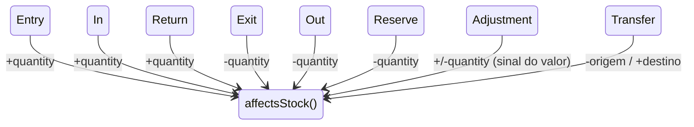
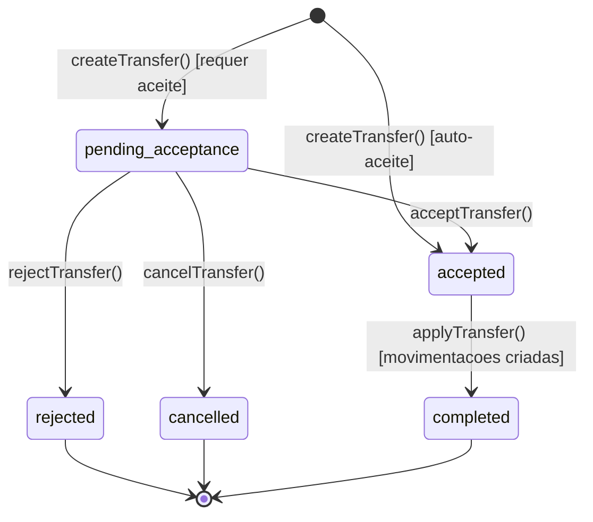
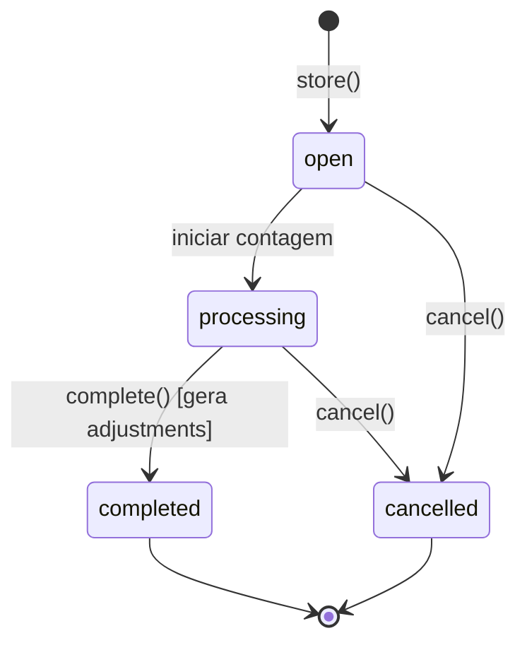
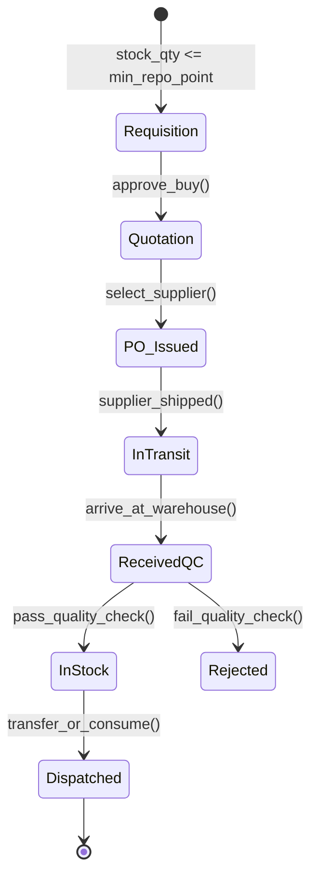
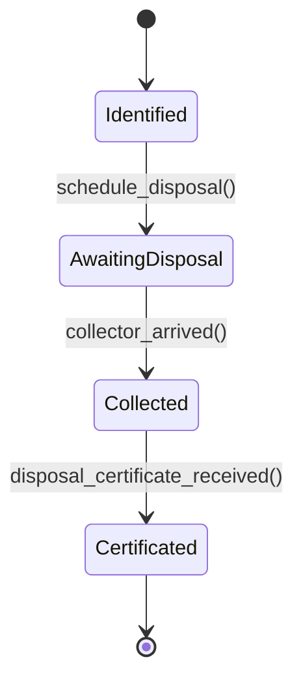
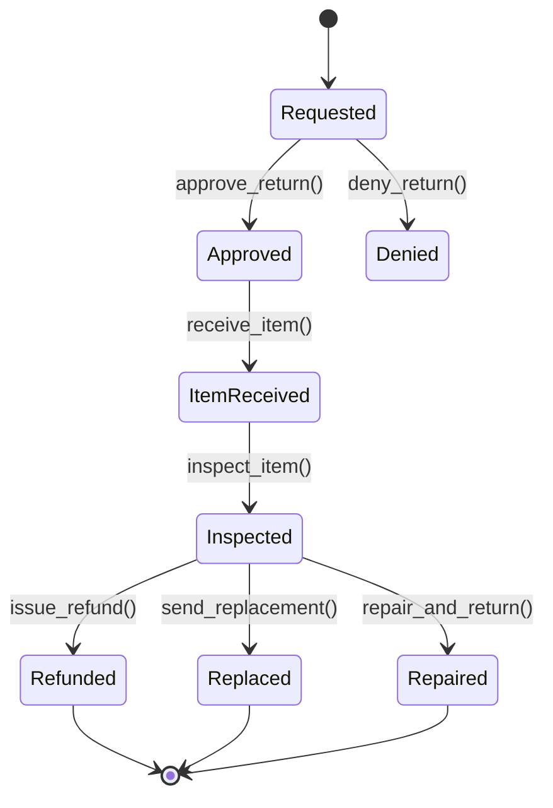
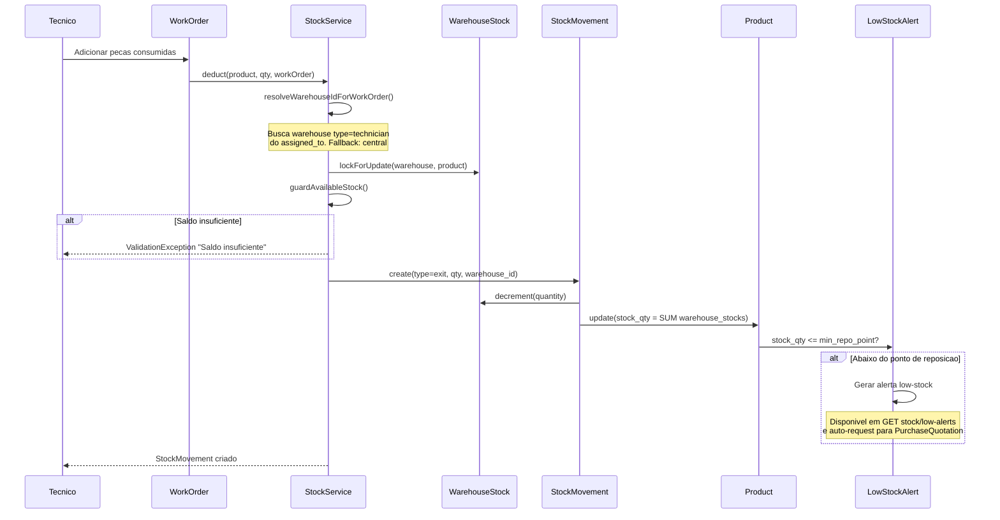
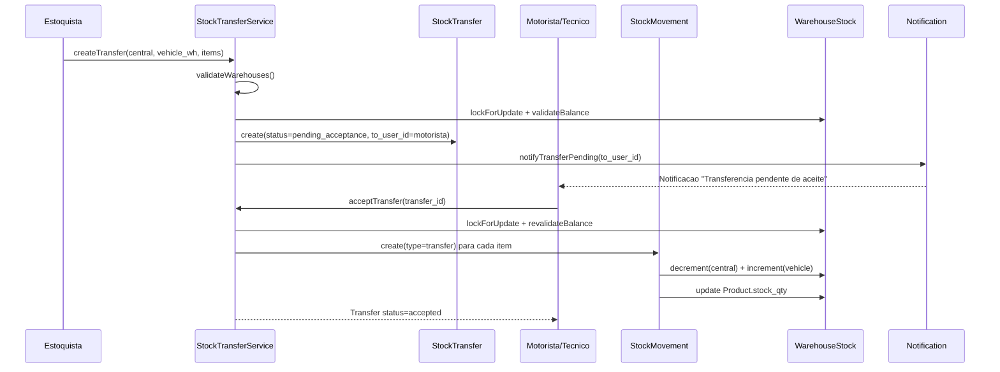
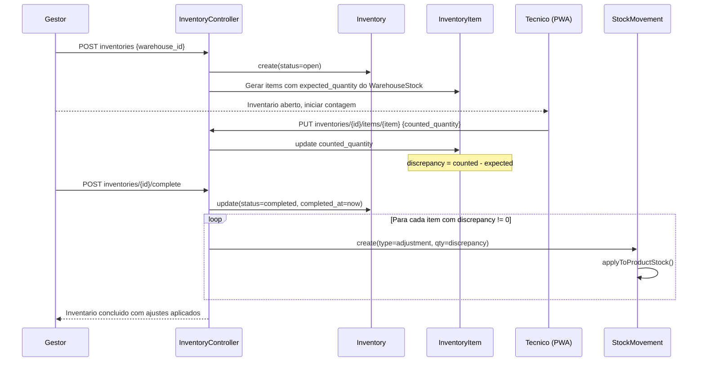

# Modulo: Inventory & Estoque

> **[AI_RULE]** Documento Level C Maximum — especificacao completa do dominio de estoque, incluindo entidades, campos, maquinas de estado, contratos JSON, validacoes, permissoes, diagramas de sequencia, codigo de referencia, cenarios BDD e checklist de implementacao.

---

## 1. Visao Geral do Dominio

O modulo Inventory gerencia todo o ciclo de vida de produtos e materiais: cadastro, entrada (compra/NF-e), armazenamento multi-local (armazem central, veiculo, tecnico), consumo via OS, transferencias, inventario cego, rastreabilidade por lote/serial, descarte ecologico, RMA, ferramentas calibradas e inteligencia de estoque (curva ABC, giro, ponto de reposicao).

### Entidades (Models)

| Model | Tabela | Descricao |
|---|---|---|
| `Product` | `products` | Cadastro de produto/material |
| `ProductCategory` | `product_categories` | Categorias de produto |
| `ProductKit` | `product_kits` | Composicao de kits (pai/filho) |
| `ProductSerial` | `product_serials` | Numeros de serie por produto |
| `SerialNumber` | `serial_numbers` | Serial alternativo com lote |
| `Batch` | `batches` | Lotes com validade e custo |
| `Warehouse` | `warehouses` | Armazens (fixed, vehicle, technician) |
| `WarehouseStock` | `warehouse_stocks` | Saldo por armazem/produto/lote |
| `StockMovement` | `stock_movements` | Movimentacoes de estoque |
| `StockTransfer` | `stock_transfers` | Transferencias entre armazens |
| `StockTransferItem` | `stock_transfer_items` | Itens da transferencia |
| `StockDisposal` | `stock_disposals` | Descarte de material |
| `StockDisposalItem` | `stock_disposal_items` | Itens do descarte |
| `EcologicalDisposal` | `ecological_disposals` | Descarte ecologico certificado |
| `Inventory` | `inventories` | Contagem de inventario (cego) |
| `InventoryItem` | `inventory_items` | Itens contados no inventario |
| `MaterialRequest` | `material_requests` | Solicitacao de material para OS |
| `MaterialRequestItem` | `material_request_items` | Itens da solicitacao |
| `PurchaseQuotation` | `purchase_quotations` | Cotacao de compra |
| `PurchaseQuotationItem` | `purchase_quotation_items` | Itens da cotacao |
| `PurchaseQuote` | `purchase_quotes` | Cotacao de fornecedor |
| `PurchaseQuoteItem` | `purchase_quote_items` | Itens da cotacao fornecedor |
| `PurchaseQuoteSupplier` | `purchase_quote_suppliers` | Fornecedores na cotacao |
| `Supplier` | `suppliers` | Cadastro de fornecedores |
| `SupplierContract` | `supplier_contracts` | Contratos de fornecimento |
| `AssetTag` | `asset_tags` | Etiquetas RFID/QR (morph) |
| `AssetTagScan` | `asset_tag_scans` | Leituras de etiqueta |
| `ToolInventory` | `tool_inventories` | Ferramentas de campo |
| `ToolCalibration` | `tool_calibrations` | Calibracoes de ferramentas |
| `UsedStockItem` | `used_stock_items` | Pecas usadas retiradas de OS |
| `ReturnedUsedItemDisposition` | `returned_used_item_dispositions` | Destino de peca usada |
| `RmaRequest` | `rma_requests` | Devolucao (RMA) |
| `RmaItem` | `rma_items` | Itens da devolucao |

### Services

| Service | Responsabilidade |
|---|---|
| `StockService` | Movimentacoes (entry/exit/reserve/return/adjustment/transfer), Kardex, explosao de kits, guard de saldo |
| `StockTransferService` | Transferencias com aceite, validacao de saldo com lock, notificacao |
| `LabelGeneratorService` | Geracao de etiquetas QR/barcode para impressao |

### Enums

| Enum | Valores |
|---|---|
| `StockMovementType` | `entry`, `exit`, `in`, `out`, `reserve`, `return`, `adjustment`, `transfer` |
| `StockTransferStatus` | `pending_acceptance`, `accepted`, `rejected`, `cancelled`, `completed` |
| `InventoryStatus` | `open`, `processing`, `completed`, `cancelled` |
| `UsedStockItemStatus` | `pending_return`, `pending_confirmation`, `returned`, `written_off_no_return` |

---

## 2. Esquema de Dados (Campos por Entidade)

### Product

| Campo | Tipo | Obrigatorio | Descricao |
|---|---|---|---|
| `id` | bigint PK | sim | |
| `tenant_id` | bigint FK | sim | Multi-tenant |
| `category_id` | bigint FK | nao | FK product_categories |
| `default_supplier_id` | bigint FK | nao | FK suppliers |
| `code` | string(50) | nao | SKU unico por tenant |
| `name` | string(255) | sim | Nome do produto |
| `description` | text | nao | Descricao |
| `unit` | string(10) | nao | UN, PC, KG, MT, LT |
| `cost_price` | decimal(10,2) | nao | Preco de custo |
| `sell_price` | decimal(10,2) | nao | Preco de venda |
| `stock_qty` | decimal(10,2) | nao | Saldo global (cache) |
| `stock_min` | decimal(10,2) | nao | Estoque minimo |
| `min_repo_point` | decimal(10,2) | nao | Ponto de reposicao |
| `max_stock` | decimal(10,2) | nao | Estoque maximo |
| `is_active` | boolean | sim | default true |
| `track_stock` | boolean | sim | Controla estoque? |
| `is_kit` | boolean | sim | E um kit composto? |
| `track_batch` | boolean | sim | Rastreia lotes? |
| `track_serial` | boolean | sim | Rastreia serial? |
| `manufacturer_code` | string(100) | nao | Codigo do fabricante |
| `storage_location` | string(100) | nao | Local padrao de armazenamento |
| `ncm` | string(10) | nao | NCM fiscal |
| `image_url` | url(500) | nao | Foto do produto |
| `barcode` | string(50) | nao | EAN/codigo de barras |
| `brand` | string(100) | nao | Marca |
| `weight` | decimal(10,3) | nao | Peso em kg |
| `width` | decimal(10,2) | nao | Largura cm |
| `height` | decimal(10,2) | nao | Altura cm |
| `depth` | decimal(10,2) | nao | Profundidade cm |
| `deleted_at` | timestamp | nao | SoftDelete |

**Computed:** `profit_margin` (%), `markup`, `volume` (cm3)
**Scope:** `scopeLowStock` — `is_active=true AND stock_qty <= stock_min`

### StockMovement

| Campo | Tipo | Obrigatorio | Descricao |
|---|---|---|---|
| `id` | bigint PK | sim | |
| `tenant_id` | bigint FK | sim | |
| `product_id` | bigint FK | sim | FK products |
| `work_order_id` | bigint FK | nao | FK work_orders (consumo OS) |
| `warehouse_id` | bigint FK | nao | Armazem de origem |
| `target_warehouse_id` | bigint FK | nao | Armazem destino (transfer) |
| `batch_id` | bigint FK | nao | FK batches |
| `product_serial_id` | bigint FK | nao | FK product_serials |
| `created_by` | bigint FK | nao | FK users |
| `type` | enum(StockMovementType) | sim | Tipo da movimentacao |
| `quantity` | decimal(10,2) | sim | Quantidade (sempre positiva exceto adjustment) |
| `unit_cost` | decimal(10,2) | nao | Custo unitario no momento |
| `reference` | string | nao | Referencia livre (ex: OS-123) |
| `notes` | string(500) | nao | Observacoes |
| `scanned_via_qr` | boolean | nao | Leitura via QR code? |
| `deleted_at` | timestamp | nao | SoftDelete |

**Boot event:** `created` -> `applyToProductStock()` atualiza `WarehouseStock` e `Product.stock_qty` automaticamente.

### Warehouse

| Campo | Tipo | Obrigatorio | Descricao |
|---|---|---|---|
| `id` | bigint PK | sim | |
| `tenant_id` | bigint FK | sim | |
| `name` | string | sim | Nome do armazem |
| `code` | string | nao | Codigo interno |
| `type` | enum | nao | `fixed`, `vehicle`, `technician` |
| `user_id` | bigint FK | nao | Tecnico dono (type=technician) |
| `vehicle_id` | bigint FK | nao | FK fleet_vehicles (type=vehicle) |
| `is_active` | boolean | sim | default true |

**Helpers:** `isTechnician()`, `isVehicle()`, `isCentral()` (fixed sem user e sem vehicle)

### WarehouseStock

| Campo | Tipo | Descricao |
|---|---|---|
| `warehouse_id` | bigint FK | |
| `product_id` | bigint FK | |
| `batch_id` | bigint FK nullable | |
| `quantity` | decimal(10,2) | Saldo atual neste local/lote |

### StockTransfer

| Campo | Tipo | Descricao |
|---|---|---|
| `id` | bigint PK | |
| `tenant_id` | bigint FK | |
| `from_warehouse_id` | bigint FK | Armazem origem |
| `to_warehouse_id` | bigint FK | Armazem destino |
| `status` | string | pending_acceptance, accepted, rejected, cancelled, completed |
| `notes` | text | |
| `created_by` | bigint FK | Criador |
| `to_user_id` | bigint FK | Usuario que deve aceitar |
| `accepted_at` | datetime | |
| `accepted_by` | bigint FK | |
| `rejected_at` | datetime | |
| `rejected_by` | bigint FK | |
| `rejection_reason` | text | |

### StockTransferItem

| Campo | Tipo | Descricao |
|---|---|---|
| `stock_transfer_id` | bigint FK | |
| `product_id` | bigint FK | |
| `quantity` | decimal(10,4) | |

### Batch

| Campo | Tipo | Descricao |
|---|---|---|
| `id` | bigint PK | |
| `tenant_id` | bigint FK | |
| `product_id` | bigint FK | |
| `code` | string | Codigo do lote |
| `cost_price` | decimal(10,2) | Custo de aquisicao do lote |
| `expires_at` | date | Data de validade |

### Inventory (Contagem Cega)

| Campo | Tipo | Descricao |
|---|---|---|
| `id` | bigint PK | |
| `tenant_id` | bigint FK | |
| `warehouse_id` | bigint FK | |
| `created_by` | bigint FK | |
| `reference` | string(100) | Referencia interna |
| `status` | string | open, processing, completed, cancelled |
| `completed_at` | datetime | |

### InventoryItem

| Campo | Tipo | Descricao |
|---|---|---|
| `inventory_id` | bigint FK | |
| `product_id` | bigint FK | |
| `batch_id` | bigint FK nullable | |
| `product_serial_id` | bigint FK nullable | |
| `expected_quantity` | decimal(10,4) | Saldo esperado do sistema |
| `counted_quantity` | decimal(10,4) | Quantidade contada |
| `adjustment_quantity` | decimal(10,4) | Ajuste gerado |
| `notes` | text | |

**Computed:** `discrepancy` = `counted_quantity - expected_quantity`

### MaterialRequest

| Campo | Tipo | Descricao |
|---|---|---|
| `id` | bigint PK | |
| `tenant_id` | bigint FK | |
| `reference` | string | Numero da solicitacao |
| `requester_id` | bigint FK | Tecnico solicitante |
| `work_order_id` | bigint FK | OS vinculada |
| `warehouse_id` | bigint FK | Armazem de retirada |
| `status` | string | pending, approved, rejected, fulfilled |
| `priority` | string | low, normal, high, urgent |
| `justification` | text | |
| `rejection_reason` | text | |
| `approved_by` | bigint FK | |
| `approved_at` | datetime | |

### AssetTag

| Campo | Tipo | Descricao |
|---|---|---|
| `id` | bigint PK | |
| `tenant_id` | bigint FK | |
| `tag_code` | string | Codigo unico QR/RFID |
| `tag_type` | string | qr, rfid, barcode |
| `taggable_type` | string | Morph (Product, ToolInventory, etc.) |
| `taggable_id` | bigint | Morph ID |
| `status` | string | active, inactive, lost |
| `location` | string | Ultima localizacao conhecida |
| `last_scanned_at` | datetime | |
| `last_scanned_by` | bigint FK | |
| `metadata` | json | Dados extras |

### ToolInventory

| Campo | Tipo | Descricao |
|---|---|---|
| `id` | bigint PK | |
| `tenant_id` | bigint FK | |
| `name` | string | Nome da ferramenta |
| `serial_number` | string | Serial unico |
| `category` | string | Categoria (medicao, teste, etc.) |
| `assigned_to` | bigint FK | Tecnico responsavel |
| `fleet_vehicle_id` | bigint FK | Veiculo onde esta |
| `calibration_due` | date | Proxima calibracao |
| `status` | string | active, maintenance, retired |
| `value` | decimal(10,2) | Valor do ativo |
| `notes` | text | |

**Computed:** `is_calibration_due` — true se calibracao vence dentro de 30 dias.

### UsedStockItem

| Campo | Tipo | Descricao |
|---|---|---|
| `id` | bigint PK | |
| `tenant_id` | bigint FK | |
| `work_order_id` | bigint FK | OS onde a peca foi retirada |
| `work_order_item_id` | bigint FK | Item especifico da OS |
| `product_id` | bigint FK | Produto retirado |
| `technician_warehouse_id` | bigint FK | Armazem do tecnico |
| `quantity` | decimal(10,4) | |
| `status` | string | pending_return, pending_confirmation, returned, written_off_no_return |
| `reported_by` | bigint FK | |
| `reported_at` | datetime | |
| `disposition_type` | string | reuse, disposal, return_to_customer |
| `disposition_notes` | text | |
| `confirmed_by` | bigint FK | |
| `confirmed_at` | datetime | |

---

## 3. Maquinas de Estado

### StockMovement — Efeito no Saldo



### StockTransfer — Ciclo de Vida



### Inventory (Contagem Cega)



### Procurement (Compras via Estoque Minimo)



### Descarte Ecologico



### RMA (Return Merchandise Authorization)



---

## 4. Guard Rails de Negocio `[AI_RULE]`

> **[AI_RULE_CRITICAL] Contabilidade FIFO (First-In, First-Out)**
> Todo `StockMovement` de saida DEVE buscar primeiro os lotes mais antigos (`Batch.created_at ASC`). Se o produto tem `track_serial=true`, o serial especifico deve ser informado. Custo de mercadoria vendida (COGS) calculado no momento do dispatch usando `unit_cost` do lote.

> **[AI_RULE_CRITICAL] Transferencia Transacional**
> `StockTransferService.applyTransfer()` usa `DB::transaction` + `lockForUpdate()`. Saida do armazem A e entrada no armazem B sao atomicas. Race conditions evitadas via `lockWarehouseStock()` que faz `firstOrCreate` + `lockForUpdate`.

> **[AI_RULE_CRITICAL] Guard de Saldo**
> `StockService.guardAvailableStock()` adquire lock exclusivo (`lockForUpdate`) antes de verificar saldo. Tipos que validam: `Exit`, `Reserve`, `Transfer`. Se saldo insuficiente, lanca `ValidationException` com mensagem detalhada.

> **[AI_RULE] Limites de Estoque e Compras Automaticas**
> Quando `WarehouseStock.quantity` cai abaixo de `Product.min_repo_point`, o sistema gera alerta e pode criar `PurchaseQuotation` automaticamente via endpoint `stock/intelligence/reorder-points/auto-request`.

> **[AI_RULE] QR Code / Asset Tag Scanning**
> `AssetTag` gera identificador unico (QR Code) por item/equipamento via morph. `AssetTagScan` registra local e timestamp de cada leitura. `LabelGeneratorService` produz etiquetas imprimiveis em multiplos formatos.

> **[AI_RULE] Serializacao e Rastreabilidade**
> Produtos com `track_serial=true` exigem `ProductSerial` unico por unidade. Saida de estoque deve registrar serial especifico. Entrada de NF-e (`StockEntryFromNF` event) cria seriais automaticamente.

> **[AI_RULE] Explosao de Kit**
> Ao movimentar um `Product.is_kit=true`, o `StockService.explodeKit()` cria movimentacoes filhas para cada componente (`ProductKit`). Recursao limitada a 5 niveis de profundidade. Quantidade filha = `kit_item.quantity * parent_quantity`.

> **[AI_RULE] Ferramentas e Calibracao**
> `ToolInventory` rastreia ferramentas de campo. `ToolCalibration` registra historico. Ferramenta com `calibration_due <= now()+30d` gera `is_calibration_due=true` e DEVE bloquear uso em OS.

> **[AI_RULE] Itens Usados**
> `UsedStockItem` rastreia pecas retiradas de equipamentos do cliente. `ReturnedUsedItemDisposition` define destino (reuse, disposal, return_to_customer). Fluxo: report -> confirm-return OU confirm-write-off.

---

## 5. Comportamento Integrado (Cross-Domain)

| Direcao | Dominio | Integracao |
|---|---|---|
| ← | **WorkOrders** | OS `completed` gera `StockMovement(exit)` para pecas consumidas. `StockService.deduct()` resolve warehouse pelo tecnico atribuido. `UsedStockItem` rastreia pecas retiradas. |
| → | **Procurement** | `Product.stock_qty <= min_repo_point` dispara alerta. `auto-request` endpoint cria `PurchaseQuotation` automaticamente. Cotacao aprovada gera `AccountPayable`. |
| ↔ | **Fleet** | `Warehouse.type=vehicle` vincula a `FleetVehicle`. Transferencia central→veiculo = abastecimento movel. Veiculo→central = devolucao com aceite do estoquista. |
| → | **Finance** | Movimentacao `exit` com `unit_cost` alimenta custo de material da OS. `PurchaseQuotation` aprovada gera `AccountPayable`. Descarte gera lancamento contabil. |
| ← | **Lab** | Ferramentas com calibracao vencida bloqueiam uso no Lab e em OS. `ToolCalibration` alimenta certificados de calibracao. |
| ← | **Fiscal** | Entrada de NF-e (`StockEntryFromNF` event) cria `StockMovement(entry)` + seriais automaticamente. NCM do produto usado na emissao fiscal. |
| → | **PWA** | `InventoryPwaController` permite contagem via dispositivo movel: listar armazens do tecnico, produtos por armazem, submeter contagens. |

### Fluxo Vehicle Stock (Estoque Movel) — Detalhado

1. **Cadastro**: Admin cria `Warehouse(type=vehicle, vehicle_id=X)` vinculado a `FleetVehicle`
2. **Abastecimento**: Estoquista cria `StockTransfer(from=central, to=vehicle_warehouse)`. Se veiculo tem motorista, `to_user_id` e preenchido e status inicia como `pending_acceptance`
3. **Aceite**: Motorista/tecnico aceita via `POST stock/transfers/{id}/accept`. `StockTransferService.applyTransfer()` cria `StockMovement(transfer)` atomico
4. **Consumo em campo**: Tecnico abre OS, consome material do `vehicle_warehouse`. `StockService.resolveWarehouseIdForWorkOrder()` resolve automaticamente pelo `assigned_to` da OS
5. **Devolucao**: Tecnico cria transferencia `vehicle→central`. Estoquista aceita no deposito. Pecas usadas sao registradas via `UsedStockItem`
6. **Recontagem**: Via PWA, tecnico faz inventario cego do veiculo (`InventoryPwaController.submitCounts`)

---

## 6. Contratos JSON (API)

### GET /api/v1/stock/dashboard/kpis

```json
{
  "response_200": {
    "data": {
      "total_inventory_value": 250000.00,
      "low_stock_alerts": 12,
      "pending_transfers": 5,
      "expiring_batches_30d": 3,
      "items_needing_calibration": 2,
      "recent_movements_today": 45
    }
  }
}
```

### POST /api/v1/stock/movements — Criar Movimentacao

```json
{
  "product_id": 42,
  "warehouse_id": 1,
  "type": "exit",
  "quantity": 5.00,
  "batch_id": null,
  "product_serial_id": null,
  "unit_cost": 12.50,
  "notes": "Consumo OS-1234"
}
```

**Response 201:**

```json
{
  "data": {
    "id": 789,
    "product_id": 42,
    "warehouse_id": 1,
    "type": "exit",
    "quantity": "5.00",
    "unit_cost": "12.50",
    "reference": "Saida manual",
    "created_by": 3,
    "created_at": "2026-03-24T10:00:00Z"
  }
}
```

### GET /api/v1/products — Listar Produtos

```
GET /api/v1/products?search=filtro&category_id=2&is_active=true&low_stock=true&page=1&per_page=15
```

**Response 200:**

```json
{
  "data": [
    {
      "id": 42,
      "code": "PRD-001",
      "name": "Sensor de temperatura",
      "unit": "PC",
      "cost_price": "12.50",
      "sell_price": "25.00",
      "stock_qty": "150.00",
      "stock_min": "20.00",
      "min_repo_point": "30.00",
      "is_active": true,
      "track_stock": true,
      "track_batch": false,
      "track_serial": true,
      "category": { "id": 2, "name": "Sensores" },
      "profit_margin": 50.0,
      "barcode": "7891234567890"
    }
  ],
  "meta": { "current_page": 1, "last_page": 5, "total": 73 }
}
```

### POST /api/v1/inventories — Criar Inventario Cego

```json
{
  "warehouse_id": 1,
  "reference": "INV-2026-03",
  "category_id": null
}
```

**Response 201:**

```json
{
  "data": {
    "id": 15,
    "warehouse_id": 1,
    "reference": "INV-2026-03",
    "status": "open",
    "created_by": 3,
    "items": [
      {
        "id": 101,
        "product_id": 42,
        "expected_quantity": "150.0000",
        "counted_quantity": null,
        "discrepancy": 0
      }
    ]
  }
}
```

### POST /api/v1/stock/transfers — Transferencia entre Armazens

```json
{
  "from_warehouse_id": 1,
  "to_warehouse_id": 5,
  "items": [
    { "product_id": 42, "quantity": 10 },
    { "product_id": 88, "quantity": 5 }
  ],
  "notes": "Abastecimento veiculo VAN-01"
}
```

**Response 201:**

```json
{
  "data": {
    "id": 33,
    "from_warehouse_id": 1,
    "to_warehouse_id": 5,
    "status": "pending_acceptance",
    "to_user_id": 7,
    "items": [
      { "product_id": 42, "quantity": "10.0000", "product": { "name": "Sensor" } },
      { "product_id": 88, "quantity": "5.0000", "product": { "name": "Cabo" } }
    ]
  }
}
```

### GET /api/v1/products/{id}/kardex — Kardex (Historico de Movimentacao)

```
GET /api/v1/products/42/kardex?warehouse_id=1&date_from=2026-01-01&date_to=2026-03-31
```

**Response 200:**

```json
{
  "data": [
    {
      "id": 780,
      "date": "2026-03-20 14:30:00",
      "type": "entry",
      "type_label": "Entrada",
      "quantity": 100.0,
      "batch": "LOTE-2026A",
      "serial": null,
      "notes": "NF-e 123456",
      "user": "Maria Silva",
      "balance": 250.0
    }
  ]
}
```

---

## 7. Regras de Validacao (FormRequests)

### StoreStockMovementRequest

```php
'product_id'        => ['required', Rule::exists('products','id')->where('tenant_id', $tid)],
'warehouse_id'      => ['required', Rule::exists('warehouses','id')->where('tenant_id', $tid)],
'batch_id'          => ['nullable', Rule::exists('batches','id')->where('tenant_id', $tid)],
'product_serial_id' => ['nullable', Rule::exists('product_serials','id')->where('tenant_id', $tid)],
'type'              => 'required|in:entry,exit,reserve,return,adjustment',
'quantity'          => ['required','numeric', type=='adjustment' ? 'not_in:0' : 'min:0.01'],
'unit_cost'         => 'nullable|numeric|min:0',
'notes'             => 'nullable|string|max:500',
```

### StoreStockTransferRequest

```php
'from_warehouse_id'    => ['required', Rule::exists('warehouses','id')->where('tenant_id', $tid)],
'to_warehouse_id'      => ['required', Rule::exists(...), 'different:from_warehouse_id'],
'items'                => 'required|array|min:1',
'items.*.product_id'   => ['required', Rule::exists('products','id')->where('tenant_id', $tid)],
'items.*.quantity'     => 'required|numeric|min:0.01',
'notes'                => 'nullable|string|max:500',
```

### StoreInventoryRequest

```php
'warehouse_id' => ['required', Rule::exists('warehouses','id')->where('tenant_id', $tid)],
'reference'    => 'nullable|string|max:100',
'category_id'  => 'nullable|integer',
```

### StoreProductRequest

```php
'name'                => 'required|string|max:255',
'code'                => ['nullable','string','max:50', Rule::unique('products','code')->where('tenant_id', $tid)->whereNull('deleted_at')],
'category_id'         => ['nullable', Rule::exists('product_categories','id')->where('tenant_id', $tid)],
'default_supplier_id' => ['nullable', Rule::exists('suppliers','id')->where('tenant_id', $tid)],
'unit'                => 'sometimes|string|max:10',
'cost_price'          => 'nullable|numeric|min:0',
'sell_price'          => 'nullable|numeric|min:0',
'stock_qty'           => 'nullable|numeric|min:0',
'stock_min'           => 'nullable|numeric|min:0',
'min_repo_point'      => 'nullable|numeric|min:0',
'max_stock'           => 'nullable|numeric|min:0',
'is_active'           => 'nullable|boolean',
'track_stock'         => 'nullable|boolean',
'is_kit'              => 'nullable|boolean',
'track_batch'         => 'nullable|boolean',
'track_serial'        => 'nullable|boolean',
'ncm'                 => 'nullable|string|max:10',
'barcode'             => 'nullable|string|max:50',
'brand'               => 'nullable|string|max:100',
'weight'              => 'nullable|numeric|min:0',
```

---

## 8. Permissoes e Papeis (RBAC)

| Permissao | admin | warehouse_manager | technician | coordinator |
|---|---|---|---|---|
| `estoque.view` | sim | sim | sim | sim |
| `estoque.movement.view` | sim | sim | sim (proprio) | sim |
| `estoque.movement.create` | sim | sim | sim (exit/return) | nao |
| `estoque.transfer.create` | sim | sim | sim (de/para proprio) | nao |
| `estoque.transfer.accept` | sim | sim | sim (se to_user_id) | nao |
| `estoque.inventory.view` | sim | sim | nao | sim |
| `estoque.inventory.create` | sim | sim | nao | nao |
| `estoque.warehouse.view` | sim | sim | sim (proprio) | sim |
| `estoque.warehouse.create` | sim | sim | nao | nao |
| `estoque.label.print` | sim | sim | sim | nao |
| `estoque.used_stock.view` | sim | sim | sim | sim |
| `estoque.used_stock.report` | sim | sim | sim | nao |
| `estoque.used_stock.confirm` | sim | sim | nao | nao |
| `cadastros.product.update` | sim | sim | nao | nao |

**Regras especiais:**

- Tecnico so cria movimentacoes `exit` e `return` no proprio armazem (`Warehouse.type=technician, user_id=auth_user`)
- Aceite de transferencia: apenas `to_user_id` ou usuario com role `estoquista` (para transferencias de veiculo)
- Rejeicao segue mesma regra de aceite

---

## 9. Diagramas de Sequencia

### Consumo de Material via OS



### Transferencia para Veiculo (Estoque Movel)



### Inventario Cego com Ajuste



---

## 10. Codigo de Referencia

### StockService — Metodos Principais (PHP)

```php
class StockService
{
    // Resolve armazem: technician_warehouse do assigned_to, fallback central
    public function resolveWarehouseIdForWorkOrder(WorkOrder $wo): ?int;

    // Saldo disponivel no armazem (soma warehouse_stocks)
    public function getAvailableQuantity(Product $product, int $warehouseId): float;

    // Reserva para OS (type=reserve)
    public function reserve(Product $p, float $qty, WorkOrder $wo, ?int $whId = null): StockMovement;

    // Deducao para OS (type=exit) — usado ao completar OS
    public function deduct(Product $p, float $qty, WorkOrder $wo, ?int $whId = null): StockMovement;

    // Devolucao (type=return) — usado ao cancelar OS
    public function returnStock(Product $p, float $qty, WorkOrder $wo, ?int $whId = null): StockMovement;

    // Entrada manual (type=entry) com custo unitario
    public function manualEntry(Product $p, float $qty, int $whId, ?int $batchId, ?int $serialId, float $unitCost, ?string $notes, ?User $user): StockMovement;

    // Saida manual (type=exit)
    public function manualExit(...): StockMovement;

    // Devolucao manual (type=return)
    public function manualReturn(...): StockMovement;

    // Reserva manual (type=reserve) — valida saldo com lock
    public function manualReserve(...): StockMovement;

    // Ajuste de inventario (type=adjustment) — quantidade pode ser negativa
    public function manualAdjustment(...): StockMovement;

    // Transferencia entre armazens (type=transfer) — atomica
    public function transfer(Product $p, float $qty, int $fromWhId, int $toWhId, ...): StockMovement;

    // Kardex com saldo progressivo (running balance)
    public function getKardex(int $productId, int $warehouseId, ?string $from, ?string $to): Collection;

    // Guard: valida saldo com lockForUpdate antes de exit/reserve/transfer
    private function guardAvailableStock(...): void;

    // Explosao de kit: cria movimentacoes para cada componente filho
    private function explodeKit(Product $kit, float $qty, int $whId, StockMovementType $type, ...): void;
}
```

### StockTransferService — Metodos Principais (PHP)

```php
class StockTransferService
{
    // Cria transferencia com validacao de saldo (lock), aceite automatico ou pendente
    public function createTransfer(int $fromWhId, int $toWhId, array $items, ?string $notes, ?int $createdBy): StockTransfer;

    // Aceita transferencia pendente (revalida saldo com lock)
    public function acceptTransfer(StockTransfer $transfer, int $acceptedBy): StockTransfer;

    // Rejeita transferencia pendente
    public function rejectTransfer(StockTransfer $transfer, int $rejectedBy, ?string $reason): StockTransfer;

    // Aplica movimentacoes de transferencia (StockMovement type=transfer para cada item)
    protected function applyTransfer(StockTransfer $transfer): void;

    // Resolve to_user_id para aceite: technician.user_id ou vehicle.assigned_user_id
    protected function resolveToUserId(Warehouse $to, Warehouse $from): ?int;

    // Notifica usuario destino e estoquistas
    protected function notifyTransferPending(StockTransfer $transfer, ...): void;
}
```

### Hook Frontend — useInventory (TypeScript)

```typescript
interface StockMovementPayload {
  product_id: number;
  warehouse_id: number;
  type: 'entry' | 'exit' | 'reserve' | 'return' | 'adjustment';
  quantity: number;
  batch_id?: number | null;
  product_serial_id?: number | null;
  unit_cost?: number | null;
  notes?: string | null;
}

interface StockTransferPayload {
  from_warehouse_id: number;
  to_warehouse_id: number;
  items: { product_id: number; quantity: number }[];
  notes?: string | null;
}

// useInventory hook
function useInventory() {
  const createMovement = (payload: StockMovementPayload) =>
    api.post('/stock/movements', payload);

  const createTransfer = (payload: StockTransferPayload) =>
    api.post('/stock/transfers', payload);

  const acceptTransfer = (id: number) =>
    api.post(`/stock/transfers/${id}/accept`);

  const rejectTransfer = (id: number, reason?: string) =>
    api.post(`/stock/transfers/${id}/reject`, { rejection_reason: reason });

  const getKardex = (productId: number, warehouseId: number, dateFrom?: string, dateTo?: string) =>
    api.get(`/products/${productId}/kardex`, { params: { warehouse_id: warehouseId, date_from: dateFrom, date_to: dateTo } });

  const getLowStockAlerts = () =>
    api.get('/stock/low-alerts');

  return { createMovement, createTransfer, acceptTransfer, rejectTransfer, getKardex, getLowStockAlerts };
}
```

---

### Endpoints Rest (Extraídos do Backend)

| Método | Rota | Controller | Ação |
|--------|------|------------|------|
| `GET` | `/api/inventories` | `InventoryController@index` | Listar |
| `GET` | `/api/inventories/{inventory}` | `InventoryController@show` | Detalhes |
| `GET` | `/api/warehouses` | `WarehouseController@index` | Listar |
| `POST` | `/api/inventories` | `InventoryController@store` | Criar |
| `PUT` | `/api/inventories/{inventory}/items/{item}` | `InventoryController@updateItem` | Atualizar |
| `POST` | `/api/inventories/{inventory}/complete` | `InventoryController@complete` | Criar |
| `POST` | `/api/inventories/{inventory}/cancel` | `InventoryController@cancel` | Criar |
| `GET` | `/api/products/{product}/kit` | `ProductKitController@index` | Listar |

## 11. Cenarios BDD

### Cenario 1: Consumo de Material via OS

```gherkin
Feature: Consumo de estoque em Ordem de Servico

  Scenario: Tecnico consome peca do proprio armazem
    Given o produto "Sensor PT100" tem 50 unidades no armazem "Tecnico-Joao"
    And existe uma OS #1234 atribuida ao tecnico "Joao"
    When o sistema executa deduct(product, 3, workOrder)
    Then um StockMovement type=exit quantity=3 e criado
    And o saldo no armazem "Tecnico-Joao" passa para 47
    And Product.stock_qty e recalculado como SUM de warehouse_stocks

  Scenario: Saldo insuficiente impede consumo
    Given o produto "Cabo RJ45" tem 2 unidades no armazem "Tecnico-Joao"
    When o sistema executa deduct(product, 5, workOrder)
    Then uma ValidationException e lancada com "Saldo insuficiente"
    And nenhum StockMovement e criado
```

### Cenario 2: Transferencia para Veiculo

```gherkin
Feature: Transferencia de estoque para veiculo

  Scenario: Transferencia com aceite do motorista
    Given o armazem "Central" tem 100 unidades de "Sensor PT100"
    And existe o armazem "VAN-01" tipo vehicle vinculado ao motorista "Carlos"
    When o estoquista cria transferencia central->VAN-01 de 20 unidades
    Then StockTransfer e criado com status=pending_acceptance e to_user_id=Carlos
    And Carlos recebe notificacao "Transferencia pendente de aceite"
    When Carlos aceita a transferencia
    Then StockMovement type=transfer e criado
    And saldo "Central" = 80, saldo "VAN-01" = 20

  Scenario: Rejeicao de transferencia
    Given transferencia #33 esta pending_acceptance para Carlos
    When Carlos rejeita com motivo "Itens errados"
    Then status muda para rejected
    And nenhum StockMovement e criado
    And saldo permanece inalterado
```

### Cenario 3: Alerta de Estoque Minimo

```gherkin
Feature: Alerta de estoque minimo e reposicao

  Scenario: Produto atinge ponto de reposicao
    Given o produto "Sensor PT100" tem min_repo_point=30 e stock_qty=35
    When uma saida de 10 unidades e registrada
    Then stock_qty passa para 25 (abaixo de min_repo_point)
    And o produto aparece em GET /stock/low-alerts
    When o gestor executa POST /stock/intelligence/reorder-points/auto-request
    Then uma PurchaseQuotation e criada automaticamente para o produto
```

### Cenario 4: Inventario Cego com Divergencia

```gherkin
Feature: Inventario cego (contagem)

  Scenario: Contagem com divergencia gera ajuste
    Given o armazem "Central" tem 100 unidades de "Sensor PT100" no sistema
    When o gestor cria inventario para o armazem "Central"
    Then Inventory e criado com status=open
    And InventoryItem e gerado com expected_quantity=100
    When o tecnico registra counted_quantity=95
    Then discrepancy = -5
    When o gestor completa o inventario
    Then StockMovement type=adjustment quantity=-5 e criado
    And saldo no armazem passa para 95
    And Inventory.status = completed
```

### Cenario 5: Enforcamento FIFO em Lotes

```gherkin
Feature: FIFO enforcement para lotes

  Scenario: Saida consome lote mais antigo primeiro
    Given o produto "Reagente X" com track_batch=true
    And lote "LOTE-2025A" (created_at=2025-01-01) com 50 unidades
    And lote "LOTE-2026A" (created_at=2026-01-01) com 30 unidades
    When uma saida de 60 unidades e registrada
    Then primeiro consome 50 do "LOTE-2025A" (esgota)
    And depois consome 10 do "LOTE-2026A"
    And dois StockMovements sao criados com batch_id correspondente
```

### Cenario 6: Explosao de Kit

```gherkin
Feature: Explosao automatica de kit

  Scenario: Saida de kit gera movimentacoes dos componentes
    Given o produto "Kit Manutencao" com is_kit=true
    And componentes: "Sensor PT100" qty=2, "Cabo RJ45" qty=5
    And armazem "Central" tem 100 Sensores e 200 Cabos
    When uma saida de 3 kits e registrada
    Then StockMovement exit para "Sensor PT100" qty=6 e criado
    And StockMovement exit para "Cabo RJ45" qty=15 e criado
    And notes contem "Automatico: Explosao do Kit Manutencao"
```

---

## 12. Checklist de Implementacao

### Backend

- [x] Model Product com todos os campos, casts, scopes e relationships
- [x] Model StockMovement com boot event `applyToProductStock()`
- [x] Model Warehouse com tipos fixed/vehicle/technician
- [x] Model WarehouseStock com saldo por armazem/produto/lote
- [x] Model StockTransfer com ciclo de vida completo
- [x] Model Batch com validade e custo
- [x] Model ProductSerial com rastreabilidade
- [x] Model Inventory + InventoryItem para contagem cega
- [x] Model MaterialRequest para solicitacao de material
- [x] Model AssetTag com morph para QR/RFID
- [x] Model ToolInventory com calibracao
- [x] Model UsedStockItem para pecas usadas
- [x] Model RmaRequest para devolucoes
- [x] Model StockDisposal para descarte
- [x] Enum StockMovementType com 8 tipos
- [x] Enum StockTransferStatus com 5 estados
- [x] Enum InventoryStatus com 4 estados
- [x] Enum UsedStockItemStatus com 4 estados
- [x] StockService com guard de saldo, explosao de kit, Kardex
- [x] StockTransferService com aceite/rejeicao e notificacao
- [x] LabelGeneratorService para etiquetas
- [x] FormRequest StoreStockMovementRequest
- [x] FormRequest StoreStockTransferRequest
- [x] FormRequest StoreInventoryRequest
- [x] FormRequest StoreProductRequest / UpdateProductRequest
- [x] Rotas: stock/movements, stock/transfers, inventories, warehouses
- [x] Rotas: purchase-quotes, material-requests, asset-tags, rma, stock-disposals
- [x] Rotas: Kardex, Inteligencia (ABC, turnover, reorder, expiring)
- [x] Rotas: PWA inventory (my-warehouses, warehouse-products, submit-counts)
- [x] Rotas: etiquetas (formats, preview, generate)
- [x] Rotas: serial-numbers, used-items, scan-qr
- [x] Permissoes RBAC por grupo (estoque.*, cadastros.product.*)
- [x] Multi-tenant via BelongsToTenant em todos os models
- [x] SoftDeletes em Product, StockMovement, Warehouse, Batch, Inventory
- [x] Auditable trait em Product, StockMovement, Warehouse, Batch, ProductSerial

### Frontend

- [ ] Pagina de listagem de produtos com filtros e low-stock highlight
- [ ] Pagina de movimentacoes com formulario por tipo
- [ ] Pagina de transferencias com fluxo de aceite/rejeicao
- [ ] Pagina de inventario cego com contagem por item
- [ ] Pagina de Kardex com saldo progressivo e graficos
- [ ] Dashboard de inteligencia (curva ABC, giro, reorder points)
- [ ] PWA para contagem movel (tecnico em campo)
- [ ] Componente de QR scan para movimentacao rapida
- [ ] TypeScript interfaces para todos os payloads
- [ ] Hook useInventory com todos os endpoints

### Integracao

- [ ] Listener: OS completed -> StockService.deduct() automatico
- [ ] Listener: NF-e importada -> StockMovement(entry) + seriais
- [ ] Job: Verificar min_repo_point diariamente e gerar alertas
- [ ] Job: Verificar ToolCalibration.calibration_due e bloquear ferramentas
- [ ] Event: stock_below_minimum -> criar PurchaseQuotation automatica

---

## 13. Observers (Cross-Domain Event Propagation) `[AI_RULE]`

> Observers garantem consistência entre o módulo Inventory e os domínios dependentes. Toda propagação é síncrona dentro de `DB::transaction`. Falhas de propagação DEVEM ser logadas via `Log::error()` e encaminhadas para Job de retry (`RetryFailedObserverJob`). Nenhum observer pode silenciar exceções.

### 13.1 StockMovementObserver

| Evento | Ação | Módulo Destino | Dados Propagados | Falha |
|--------|------|----------------|-----------------|-------|
| `created` (type=exit) | Atualizar custo de material da OS | **Finance** | `movement_id`, `product_id`, `quantity`, `unit_cost`, `work_order_id`, `total_cost` | Log + retry. OS mantém custo anterior até sync |
| `created` (type=exit) | Verificar ponto de reposição e gerar alerta | **Procurement** | `product_id`, `current_stock`, `min_repo_point`, `warehouse_id` | Log. Alerta criado como `pending` |
| `created` (type=exit, stock < min_repo_point) | Criar PurchaseQuotation automática | **Procurement** | `product_id`, `suggested_quantity`, `default_supplier_id`, `tenant_id` | Log + retry. Cotação criada como `draft` |
| `created` (type=entry, from NF-e) | Atualizar status da NF-e para `stock_processed` | **Fiscal** | `nfe_id`, `movement_id`, `products_received[]` | Log + retry |
| `created` (type=adjustment) | Registrar ajuste contábil (variação de inventário) | **Finance** | `movement_id`, `product_id`, `adjustment_qty`, `adjustment_value` | Log + retry |

> **[AI_RULE_CRITICAL]** Movimentação de saída (`type=exit`) com `work_order_id` DEVE propagar o custo total (`quantity * unit_cost`) para o campo `material_cost` da OS no módulo Finance. Este cálculo usa FIFO (`Batch.created_at ASC`) e é **obrigatório** para apuração correta de custos.

### 13.2 StockTransferObserver

| Evento | Ação | Módulo Destino | Dados Propagados | Falha |
|--------|------|----------------|-----------------|-------|
| `created` (status=pending_acceptance) | Notificar destinatário (push + email) | **Notifications** | `transfer_id`, `to_user_id`, `from_warehouse`, `to_warehouse`, `items[]` | Log + retry. Transferência criada mesmo sem notificação |
| `updated` (status → accepted) | Atualizar disponibilidade de estoque no veículo | **Fleet** | `transfer_id`, `vehicle_warehouse_id`, `items[]`, `new_balances[]` | Log + retry |
| `updated` (status → rejected) | Notificar remetente + liberar reserva | **Notifications**, **Inventory (interno)** | `transfer_id`, `rejection_reason`, `from_user_id` | Log + retry |
| `updated` (status → completed) | Gerar log de auditoria de movimentação | **Audit** | `transfer_id`, `from_warehouse_id`, `to_warehouse_id`, `items[]`, `applied_by` | Log. Auditoria é append-only |

> **[AI_RULE]** Transferências para `Warehouse.type=vehicle` DEVEM verificar que o `to_user_id` (motorista/técnico) tem CNH válida (`cnh_expiry > now()`). Se CNH expirada, o observer emite `DriverLicenseExpiredException` como warning (não bloqueia, mas registra alerta no Fleet).

---

## Fluxos Relacionados

| Fluxo | Descrição |
|-------|-----------|
| [Devolução de Equipamento](file:///c:/PROJETOS/sistema/docs/fluxos/DEVOLUCAO-EQUIPAMENTO.md) | Processo documentado em `docs/fluxos/DEVOLUCAO-EQUIPAMENTO.md` |
| [Estoque Móvel](file:///c:/PROJETOS/sistema/docs/fluxos/ESTOQUE-MOVEL.md) | Processo documentado em `docs/fluxos/ESTOQUE-MOVEL.md` |
| [Gestão de Frota](file:///c:/PROJETOS/sistema/docs/fluxos/GESTAO-FROTA.md) | Processo documentado em `docs/fluxos/GESTAO-FROTA.md` |
| [Integrações Externas](file:///c:/PROJETOS/sistema/docs/fluxos/INTEGRACOES-EXTERNAS.md) | Processo documentado em `docs/fluxos/INTEGRACOES-EXTERNAS.md` |
| [Operação Diária](file:///c:/PROJETOS/sistema/docs/fluxos/OPERACAO-DIARIA.md) | Processo documentado em `docs/fluxos/OPERACAO-DIARIA.md` |
| [Requisição de Compra](file:///c:/PROJETOS/sistema/docs/fluxos/REQUISICAO-COMPRA.md) | Processo documentado em `docs/fluxos/REQUISICAO-COMPRA.md` |
| [Técnico em Campo](file:///c:/PROJETOS/sistema/docs/fluxos/TECNICO-EM-CAMPO.md) | Processo documentado em `docs/fluxos/TECNICO-EM-CAMPO.md` |

---

## 14. Inventario Completo do Codigo

> Secao gerada por auditoria automatizada do codigo-fonte. Lista exaustiva de todos os artefatos backend e frontend que pertencem ao dominio Inventory.

### 14.1 Models (31 models)

| Model | Path |
|-------|------|
| `Product` | `backend/app/Models/Product.php` |
| `ProductSerial` | `backend/app/Models/ProductSerial.php` |
| `PartsKit` | `backend/app/Models/PartsKit.php` |
| `PartsKitItem` | `backend/app/Models/PartsKitItem.php` |
| `Batch` | `backend/app/Models/Batch.php` |
| `Warehouse` | `backend/app/Models/Warehouse.php` |
| `WarehouseStock` | `backend/app/Models/WarehouseStock.php` |
| `StockMovement` | `backend/app/Models/StockMovement.php` |
| `StockTransfer` | `backend/app/Models/StockTransfer.php` |
| `StockTransferItem` | `backend/app/Models/StockTransferItem.php` |
| `StockDisposal` | `backend/app/Models/StockDisposal.php` |
| `StockDisposalItem` | `backend/app/Models/StockDisposalItem.php` |
| `Inventory` | `backend/app/Models/Inventory.php` |
| `InventoryItem` | `backend/app/Models/InventoryItem.php` |
| `MaterialRequest` | `backend/app/Models/MaterialRequest.php` |
| `MaterialRequestItem` | `backend/app/Models/MaterialRequestItem.php` |
| `PurchaseQuotation` | `backend/app/Models/PurchaseQuotation.php` |
| `PurchaseQuotationItem` | `backend/app/Models/PurchaseQuotationItem.php` |
| `PurchaseQuote` | `backend/app/Models/PurchaseQuote.php` |
| `PurchaseQuoteItem` | `backend/app/Models/PurchaseQuoteItem.php` |
| `PurchaseQuoteSupplier` | `backend/app/Models/PurchaseQuoteSupplier.php` |
| `RmaRequest` | `backend/app/Models/RmaRequest.php` |
| `UsedStockItem` | `backend/app/Models/UsedStockItem.php` |
| `ReturnedUsedItemDisposition` | `backend/app/Models/ReturnedUsedItemDisposition.php` |
| `ToolInventory` | `backend/app/Models/ToolInventory.php` |
| `ToolCalibration` | `backend/app/Models/ToolCalibration.php` |
| `StandardWeight` | `backend/app/Models/StandardWeight.php` |
| `Supplier` | `backend/app/Models/Supplier.php` |
| `SupplierContract` | `backend/app/Models/SupplierContract.php` |
| `FundTransfer` | `backend/app/Models/FundTransfer.php` |
| `Branch` | `backend/app/Models/Branch.php` |

### 14.2 Controllers (14 controllers)

| Controller | Path | Metodos |
|------------|------|---------|
| `StockController` | `backend/app/Http/Controllers/Api/V1/StockController.php` | `movements`, `summary`, `store`, `lowStockAlerts` |
| `StockAdvancedController` | `backend/app/Http/Controllers/Api/V1/StockAdvancedController.php` | `transfers`, `storeTransfer`, `showTransfer`, `acceptTransfer`, `rejectTransfer`, `disposals`, `showDisposal`, `storeDisposal`, `updateDisposal`, `assetTags`, `showAssetTag`, `storeAssetTag`, `updateAssetTag`, `scanAssetTag`, `rmaIndex`, `showRma`, `storeRma`, `updateRma`, `serialNumbers`, `storeSerialNumber` |
| `StockIntegrationController` | `backend/app/Http/Controllers/Api/V1/StockIntegrationController.php` | `purchaseQuoteIndex`, `purchaseQuoteShow`, `purchaseQuoteStore`, `purchaseQuoteUpdate`, `purchaseQuoteDestroy`, `materialRequestIndex`, `materialRequestShow`, `materialRequestStore`, `materialRequestUpdate`, `materialRequestApprove`, `materialRequestReject`, `assetTagIndex`, `assetTagShow`, `assetTagStore`, `assetTagUpdate`, `assetTagScan`, `rmaIndex`, `rmaShow`, `rmaStore`, `rmaUpdate`, `disposalIndex`, `disposalShow`, `disposalStore`, `disposalUpdate`, `usedStockItemIndex`, `usedStockItemStore`, `usedStockItemShow`, `usedStockItemUpdateStatus`, `usedStockItemDispositions`, `stockAutoRequest`, `comparePurchaseQuotes` |
| `StockTransferController` | `backend/app/Http/Controllers/Api/V1/StockTransferController.php` | `index`, `show`, `store`, `accept`, `reject` |
| `InventoryController` | `backend/app/Http/Controllers/Api/V1/InventoryController.php` | `index`, `store`, `show`, `updateItem`, `complete`, `cancel` |
| `InventoryPwaController` | `backend/app/Http/Controllers/Api/V1/InventoryPwaController.php` | `myWarehouses`, `warehouseProducts`, `submitCounts` |
| `KardexController` | `backend/app/Http/Controllers/Api/V1/KardexController.php` | `show` |
| `StockIntelligenceController` | `backend/app/Http/Controllers/Api/V1/StockIntelligenceController.php` | `abcCurve`, `turnover`, `demandForecast`, `stockValuation`, `coverageDays`, `deadStock`, `monthlyMovements`, `topConsumedProducts`, `reorderSuggestions`, `warehouseOccupancy` |
| `WarehouseController` | `backend/app/Http/Controllers/Api/V1/WarehouseController.php` | `index`, `show`, `store`, `update`, `destroy` |
| `WarehouseStockController` | `backend/app/Http/Controllers/Api/V1/WarehouseStockController.php` | `index`, `byWarehouse`, `byProduct` |
| `BatchController` | `backend/app/Http/Controllers/Api/V1/BatchController.php` | `index`, `show`, `store`, `update`, `destroy` |
| `ProductKitController` | `backend/app/Http/Controllers/Api/V1/ProductKitController.php` | `index`, `store`, `destroy` |
| `Stock\QrCodeInventoryController` | `backend/app/Http/Controllers/Api/V1/Stock/QrCodeInventoryController.php` | `scan` |
| `XmlImportController` | `backend/app/Http/Controllers/Api/V1/XmlImportController.php` | `import` |

### 14.3 Services (2 services)

| Service | Path |
|---------|------|
| `StockService` | `backend/app/Services/StockService.php` |
| `StockTransferService` | `backend/app/Services/StockTransferService.php` |

### 14.4 Observers (1 observer)

| Observer | Path | Eventos | Descricao |
|----------|------|---------|-----------|
| `StockMovementObserver` | `backend/app/Observers/StockMovementObserver.php` | `created` | Ao criar StockMovement do tipo `Entry` com `unit_cost > 0`, gera automaticamente um `AccountPayable` com lock de concorrencia e idempotencia |

### 14.5 Events (1 event)

| Event | Path | Descricao |
|-------|------|-----------|
| `StockEntryFromNF` | `backend/app/Events/StockEntryFromNF.php` | Disparado quando entrada de estoque vem de NF-e |

### 14.6 Listeners (3 listeners)

| Listener | Path | Descricao |
|----------|------|-----------|
| `GenerateAccountPayableFromStockEntry` | `backend/app/Listeners/GenerateAccountPayableFromStockEntry.php` | Gera conta a pagar a partir de entrada de estoque |
| `HandleWorkOrderCancellation` | `backend/app/Listeners/HandleWorkOrderCancellation.php` | Estorna movimentacoes de estoque ao cancelar OS |
| `HandleWorkOrderInvoicing` | `backend/app/Listeners/HandleWorkOrderInvoicing.php` | Processa estoque ao faturar OS |

### 14.7 Jobs (1 job)

| Job | Path | Descricao |
|-----|------|-----------|
| `StockMinimumAlertJob` | `backend/app/Jobs/StockMinimumAlertJob.php` | Verifica produtos abaixo do estoque minimo e gera alertas |

### 14.8 FormRequests (37 requests)

| FormRequest | Path |
|-------------|------|
| `StoreStockMovementRequest` | `backend/app/Http/Requests/Stock/StoreStockMovementRequest.php` |
| `StoreStockTransferRequest` | `backend/app/Http/Requests/Stock/StoreStockTransferRequest.php` |
| `RejectTransferRequest` | `backend/app/Http/Requests/Stock/RejectTransferRequest.php` |
| `StoreInventoryRequest` | `backend/app/Http/Requests/Stock/StoreInventoryRequest.php` |
| `UpdateInventoryItemRequest` | `backend/app/Http/Requests/Stock/UpdateInventoryItemRequest.php` |
| `StartInventoryCountRequest` | `backend/app/Http/Requests/Stock/StartInventoryCountRequest.php` |
| `SubmitCountRequest` | `backend/app/Http/Requests/Stock/SubmitCountRequest.php` |
| `SubmitCountPwaRequest` | `backend/app/Http/Requests/Stock/SubmitCountPwaRequest.php` |
| `StoreMaterialRequestRequest` | `backend/app/Http/Requests/Stock/StoreMaterialRequestRequest.php` |
| `UpdateMaterialRequestRequest` | `backend/app/Http/Requests/Stock/UpdateMaterialRequestRequest.php` |
| `StorePurchaseQuoteRequest` | `backend/app/Http/Requests/Stock/StorePurchaseQuoteRequest.php` |
| `UpdatePurchaseQuoteRequest` | `backend/app/Http/Requests/Stock/UpdatePurchaseQuoteRequest.php` |
| `ComparePurchaseQuotesRequest` | `backend/app/Http/Requests/Stock/ComparePurchaseQuotesRequest.php` |
| `StorePurchaseOrderRequest` | `backend/app/Http/Requests/Stock/StorePurchaseOrderRequest.php` |
| `StoreDisposalRequest` | `backend/app/Http/Requests/Stock/StoreDisposalRequest.php` |
| `UpdateDisposalRequest` | `backend/app/Http/Requests/Stock/UpdateDisposalRequest.php` |
| `StoreRmaRequest` | `backend/app/Http/Requests/Stock/StoreRmaRequest.php` |
| `UpdateRmaRequest` | `backend/app/Http/Requests/Stock/UpdateRmaRequest.php` |
| `StoreWarehouseRequest` | `backend/app/Http/Requests/Stock/StoreWarehouseRequest.php` |
| `StoreBatchRequest` | `backend/app/Http/Requests/Stock/StoreBatchRequest.php` |
| `UpdateBatchRequest` | `backend/app/Http/Requests/Stock/UpdateBatchRequest.php` |
| `ShowKardexRequest` | `backend/app/Http/Requests/Stock/ShowKardexRequest.php` |
| `StoreProductSerialRequest` | `backend/app/Http/Requests/Stock/StoreProductSerialRequest.php` |
| `StoreAssetTagRequest` | `backend/app/Http/Requests/Stock/StoreAssetTagRequest.php` |
| `UpdateAssetTagRequest` | `backend/app/Http/Requests/Stock/UpdateAssetTagRequest.php` |
| `AssetTagScanRequest` | `backend/app/Http/Requests/Stock/AssetTagScanRequest.php` |
| `StoreToolInventoryRequest` | `backend/app/Http/Requests/Stock/StoreToolInventoryRequest.php` |
| `UpdateToolInventoryRequest` | `backend/app/Http/Requests/Stock/UpdateToolInventoryRequest.php` |
| `StoreToolCalibrationRequest` | `backend/app/Http/Requests/Stock/StoreToolCalibrationRequest.php` |
| `UpdateToolCalibrationRequest` | `backend/app/Http/Requests/Stock/UpdateToolCalibrationRequest.php` |
| `ReportUsedStockItemRequest` | `backend/app/Http/Requests/Stock/ReportUsedStockItemRequest.php` |
| `ScanQrRequest` | `backend/app/Http/Requests/Stock/ScanQrRequest.php` |
| `GenerateLabelRequest` | `backend/app/Http/Requests/Stock/GenerateLabelRequest.php` |
| `PreviewLabelRequest` | `backend/app/Http/Requests/Stock/PreviewLabelRequest.php` |
| `StockAutoRequestRequest` | `backend/app/Http/Requests/Stock/StockAutoRequestRequest.php` |
| `StockIntelligenceMonthsRequest` | `backend/app/Http/Requests/Stock/StockIntelligenceMonthsRequest.php` |
| `StockReportRequest` | `backend/app/Http/Requests/Report/StockReportRequest.php` |

### 14.9 Rotas

| Arquivo de Rotas | Total de Route:: | Descricao |
|------------------|------------------|-----------|
| `backend/routes/api/stock.php` | **128 rotas** | Estoque, Armazens, Transferencias, Inventario, Cotacoes, Material Requests, RMA, Descarte, Tags RFID/QR, Lotes, Kardex, Inteligencia, Serial Numbers, Ferramentas, PWA |

### 14.10 Resumo Quantitativo

| Artefato | Quantidade |
|----------|-----------|
| Models | 31 |
| Controllers | 14 |
| Services | 2 |
| Observers | 1 |
| Events | 1 |
| Listeners | 3 |
| Jobs | 1 |
| FormRequests | 37 |
| Arquivos de Rotas | 1 (128 rotas) |
| **Total de artefatos** | **91** |

---

## Edge Cases e Tratamento de Erros

> **[AI_RULE]** Todo Controller e Service de estoque DEVE implementar os tratamentos abaixo. Movimentações de estoque são IRREVERSÍVEIS após confirmação.

### Movimentação de Estoque

| Cenário | Tratamento | Código Esperado |
|---------|-----------|-----------------|
| Saída de produto com estoque insuficiente | `ValidationException`: `'Insufficient stock: available X, requested Y'`. Se `allow_negative: false` no tenant | 422 |
| Estoque negativo permitido (configuração do tenant) | Aceitar movimento + disparar `StockNegativeAlert` event para gestor | 200 + alert |
| Movimentação de produto inativo/descontinuado | Bloquear saída: `'Product is inactive'`. Permitir entrada (recebimento de devolução) | 422 (saída) / 200 (entrada) |
| Race condition em movimentação concorrente | `lockForUpdate()` no `warehouse_stocks` + transação DB. NUNCA atualizar saldo sem lock | N/A |
| Estoque de produto kit (composto) | Verificar estoque de TODOS os componentes. Se qualquer componente insuficiente: bloquear | 422 |
| Ajuste de estoque sem justificativa | `ValidationException`: `'reason is required for stock adjustments'` | 422 |

### Transferências entre Armazéns

| Cenário | Tratamento | Código Esperado |
|---------|-----------|-----------------|
| Transferência para o mesmo armazém (origem = destino) | Bloquear: `'Source and destination warehouse must be different'` | 422 |
| Transferência de produto não existente no armazém de origem | `ValidationException`: `'Product does not exist in source warehouse'` | 422 |
| Transferência parcial (quantidade < solicitada) | Permitir com flag `partial_transfer: true`. Criar nova transferência para o restante | 200 |
| Armazém de destino inativo ou em inventário | Bloquear: `'Destination warehouse is locked (inventory in progress or inactive)'` | 422 |

### Inventário (Contagem)

| Cenário | Tratamento | Código Esperado |
|---------|-----------|-----------------|
| Inventário em andamento bloqueia movimentações | Lock do armazém: `warehouse.inventory_locked = true`. Todas as movimentações retornam 423 | 423 |
| Diferença de contagem > 10% do saldo teórico | Flag `high_variance: true` + exigir recontagem (inventário cego) | N/A |
| Contagem PWA offline (sync posterior) | Aceitar dados com `synced_at: null`. Validar no sync: se conflito, priorizar contagem mais recente | N/A |
| Inventário finalizado sem aprovação do gestor | Bloquear ajuste: `'Inventory count requires manager approval'` | 403 |
| Produto encontrado na contagem mas não existe no cadastro | Criar entrada pendente: `'Unknown product scanned. SKU: X. Requires registration.'` | 202 |

### Lotes e Validade

| Cenário | Tratamento | Código Esperado |
|---------|-----------|-----------------|
| Produto com lote vencido usado em OS | Bloquear: `'Batch expired on date X. Cannot use in work orders.'` | 422 |
| Lote próximo ao vencimento (< 30 dias) | Alerta automático via `BatchExpirationAlert` Job diário. Mover para quarentena se configurado | N/A |
| Saída de produto sem informar lote (quando produto requer rastreabilidade) | `ValidationException`: `'Batch number is required for traceable products'` | 422 |
| Lote com quantidade zerada | Manter registro (histórico). Flag `exhausted: true`. Não deletar | N/A |

### FIFO/LIFO e Custo Médio

| Cenário | Tratamento | Código Esperado |
|---------|-----------|-----------------|
| Custo médio com divisão por zero (primeiro lançamento sem custo) | Usar `purchase_price` como fallback. Se null: `'Product has no cost defined. Set purchase price first.'` | 422 |
| Recalcular custo médio para > 50.000 movimentações | Job assíncrono `RecalculateCostJob` com chunking. Retornar 202 | 202 |
| FIFO com lotes sem data de entrada | Usar `created_at` do registro como fallback para ordenação | N/A |

### Material Requests e Compras

| Cenário | Tratamento | Código Esperado |
|---------|-----------|-----------------|
| Produto abaixo do ponto de reposição sem requisição automática | Job `StockAutoRequestJob` detecta e cria `MaterialRequest` automaticamente | N/A |
| Cotação de compra com fornecedor inativo | `ValidationException`: `'Supplier X is inactive'` | 422 |
| Ordem de compra duplicada (mesmo fornecedor, mesmos itens, mesmo período) | Warning ao operador + exigir confirmação `force_duplicate: true` | 422 (sem force) |
| Recebimento com quantidade divergente do pedido | Aceitar parcialmente com flag `partial_receipt: true`. Registrar diferença | 200 |

### Descarte e RMA

| Cenário | Tratamento | Código Esperado |
|---------|-----------|-----------------|
| Descarte sem laudo técnico (quando exigido pelo tenant) | `ValidationException`: `'Technical report is required for disposal'` | 422 |
| RMA sem defeito comprovado | Aceitar com flag `defect_unconfirmed: true`. Requer validação na triagem | 200 |
| Descarte de produto com valor residual > R$1.000 | Exigir aprovação gerencial: `'Disposal of high-value item requires manager approval'` | 403 |
