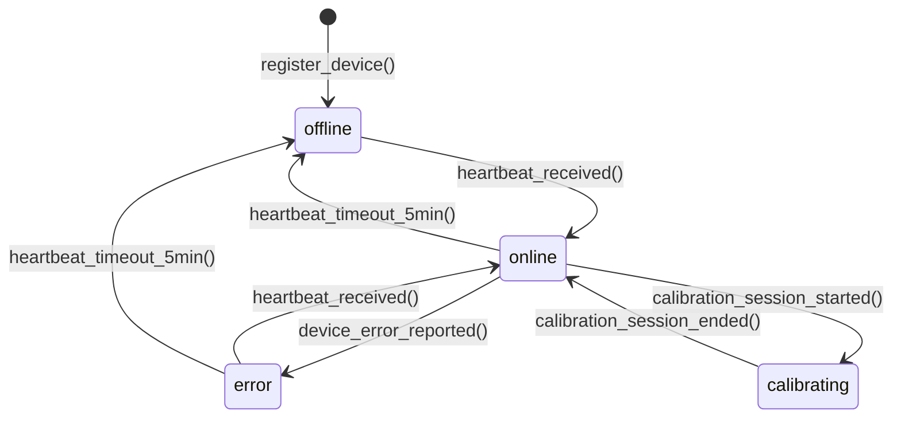
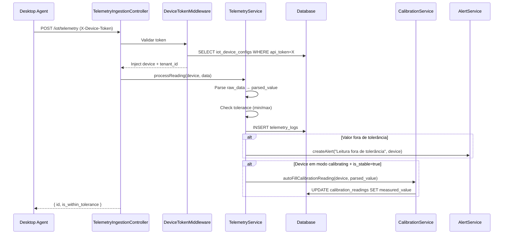

# Modulo: IoT & Telemetry (Captura Serial Contínua)

> **Status de Implementação:** ⚠️ ESPECIFICAÇÃO — Este módulo está 100% documentado mas ainda não possui código backend (zero models, controllers, migrations). Implementação planejada para fases futuras.

> **[AI_RULE]** Especificações arquiteturais da fase de Expansão. Módulo IoT_Telemetry.

---

## 1. Visão Geral

Infraestrutura de integração hardware-software (Client Desktop/Agent via Node/Python) para leitura de portas COM (RS-232, TCP/IP) em balanças e outros equipamentos sensíveis do laboratório. O objetivo é transmitir os dados via API diretamente para calibração, eliminando erro humano na digitação.

**Escopo Funcional:**

- Cadastro e configuração de dispositivos IoT (balanças, termômetros, sensores)
- Captura de leituras em tempo real via agente local (Desktop Agent)
- Ingestão de dados via API REST e/ou WebSocket
- Histórico completo de telemetria por dispositivo
- Vinculação automática de leituras a `CalibrationReading` (ISO 17025)
- Monitoramento de saúde dos dispositivos (heartbeat, status online/offline)
- Alertas automáticos para valores fora de tolerância

---

## 2. Entidades (Models)

### 2.1 IotDeviceConfig

| Campo | Tipo | Regra |
|-------|------|-------|
| `id` | bigint (PK) | Auto-increment |
| `tenant_id` | bigint (FK) | Obrigatório, isolamento multi-tenant |
| `name` | string(255) | Nome do dispositivo (ex: "Balança Mettler XR-500 Lab 2") |
| `device_type` | enum | `scale`, `thermometer`, `hygrometer`, `pressure_gauge`, `generic_sensor` |
| `serial_number` | string(100) null | Número de série do equipamento |
| `connection_type` | enum | `serial_rs232`, `tcp_ip`, `usb`, `bluetooth` |
| `port_config` | json | Config de conexão: `{"port":"COM3","baud_rate":9600,"data_bits":8,"stop_bits":1,"parity":"none"}` ou `{"host":"192.168.1.50","port":4001}` |
| `data_parser` | enum | `raw_numeric`, `mettler_mt_sics`, `ohaus_spx`, `custom_regex` |
| `parser_config` | json null | Config do parser customizado: `{"regex":"([\\d.]+)\\s*(g|kg)","value_group":1,"unit_group":2}` |
| `unit_of_measure` | string(20) | Unidade de saída: `g`, `kg`, `°C`, `%RH`, `Pa` |
| `tolerance_min` | decimal(15,6) null | Valor mínimo aceitável |
| `tolerance_max` | decimal(15,6) null | Valor máximo aceitável |
| `equipment_id` | bigint (FK → equipment) null | Vínculo com equipamento cadastrado |
| `location` | string(255) null | Localização no laboratório |
| `is_active` | boolean | Default true |
| `last_heartbeat_at` | timestamp null | Último sinal de vida do agente |
| `status` | enum | `online`, `offline`, `error`, `calibrating` |
| `api_token` | string(64) | Token único para autenticação do agente |
| `created_at` | timestamp | — |
| `updated_at` | timestamp | — |

### 2.2 TelemetryLog

| Campo | Tipo | Regra |
|-------|------|-------|
| `id` | bigint (PK) | Auto-increment |
| `tenant_id` | bigint (FK) | Obrigatório |
| `iot_device_config_id` | bigint (FK) | Dispositivo que gerou a leitura |
| `raw_data` | text | Dado bruto recebido do dispositivo |
| `parsed_value` | decimal(15,6) null | Valor numérico parseado |
| `unit` | string(20) null | Unidade da medição |
| `is_stable` | boolean | Se a leitura é estável (flag do equipamento) |
| `is_within_tolerance` | boolean | Se o valor está dentro de tolerance_min/max |
| `calibration_reading_id` | bigint (FK → calibration_readings) null | Vínculo com leitura de calibração ISO |
| `work_order_id` | bigint (FK → work_orders) null | OS sendo executada no momento |
| `captured_at` | timestamp | Momento exato da captura no dispositivo |
| `received_at` | timestamp | Momento de recepção pela API |
| `agent_version` | string(20) null | Versão do Desktop Agent |
| `metadata` | json null | Dados extras: `{"temperature_ambient":22.5,"humidity":45}` |
| `created_at` | timestamp | — |

### 2.3 DeviceHeartbeat

| Campo | Tipo | Regra |
|-------|------|-------|
| `id` | bigint (PK) | Auto-increment |
| `tenant_id` | bigint (FK) | Obrigatório |
| `iot_device_config_id` | bigint (FK) | Dispositivo |
| `status` | enum | `online`, `offline`, `error` |
| `agent_version` | string(20) null | Versão do agente |
| `cpu_usage` | decimal(5,2) null | % de uso de CPU da máquina |
| `memory_usage` | decimal(5,2) null | % de uso de memória |
| `error_message` | text null | Mensagem de erro se status=error |
| `created_at` | timestamp | — |

---

## 3. Ciclos de Vida (State Machines)

### 3.1 Status do Dispositivo



| De | Para | Trigger | Efeito |
|----|------|---------|--------|
| `offline` | `online` | `heartbeat_received()` | Atualiza `last_heartbeat_at`, limpa erros |
| `online` | `offline` | Sem heartbeat por 5min | Job `CheckDeviceHealth` marca como offline, alerta admin |
| `online` | `error` | `device_error_reported()` | Registra erro, notifica responsável |
| `online` | `calibrating` | Sessão de calibração inicia | Leituras são vinculadas ao `CalibrationReading` |

---

## 4. Guard Rails de Negócio `[AI_RULE]`

> **[AI_RULE_CRITICAL] Autenticação do Agente**
> Cada dispositivo tem um `api_token` único (64 chars, gerado via `Str::random(64)`). O Desktop Agent envia esse token no header `X-Device-Token`. O `DeviceTokenMiddleware` valida o token e injeta o `IotDeviceConfig` no request. Tokens são gerados na criação do device e podem ser rotacionados.

> **[AI_RULE_CRITICAL] Validação de Tolerância**
> Se o `parsed_value` estiver fora de `tolerance_min`/`tolerance_max`, o `TelemetryLog` é salvo com `is_within_tolerance = false` e um `Alert` é disparado automaticamente para o responsável da área.

> **[AI_RULE_CRITICAL] Isolamento de Dados**
> `TelemetryLog` sempre recebe `tenant_id` do `IotDeviceConfig`. O agente externo NÃO especifica tenant — ele é derivado do token.

> **[AI_RULE] Estabilidade de Leitura**
> Leituras com `is_stable = false` NÃO devem ser usadas para preenchimento automático de `CalibrationReading`. Apenas leituras estáveis são candidatas para auto-fill.

> **[AI_RULE] Retenção de Dados**
> `TelemetryLog` com mais de 90 dias PODE ser arquivado (movido para tabela `telemetry_logs_archive`). `DeviceHeartbeat` com mais de 30 dias é purgado pelo Job `PurgeTelemetryHistory`.

> **[AI_RULE] Rate Limiting**
> Endpoint de ingestão aceita no máximo 10 leituras/segundo por dispositivo. Acima disso, retorna 429 Too Many Requests.

---

## 5. Comportamento Integrado (Cross-Domain)

| Direção | Módulo | Integração |
|---------|--------|------------|
| → | **Lab / Quality** | Preenchimento automático do `CalibrationReading` com valores estáveis |
| → | **WorkOrders** | Vinculação de leituras a OS em execução no momento da captura |
| → | **Alerts** | Alertas automáticos para valores fora de tolerância ou dispositivos offline |
| ← | **Quality** | Sessões de calibração ativam modo `calibrating` no dispositivo |

---

## 6. Contratos de API (JSON)

### 6.1 Registrar Dispositivo

```http
POST /api/v1/iot/devices
Authorization: Bearer {admin-token}
Content-Type: application/json
```

**Request:**

```json
{
  "name": "Balança Mettler XR-500 Lab 2",
  "device_type": "scale",
  "connection_type": "serial_rs232",
  "port_config": {"port": "COM3", "baud_rate": 9600, "data_bits": 8, "stop_bits": 1, "parity": "none"},
  "data_parser": "mettler_mt_sics",
  "unit_of_measure": "g",
  "tolerance_min": -0.001,
  "tolerance_max": 500.000,
  "equipment_id": 123,
  "location": "Laboratório 2 - Bancada 5"
}
```

**Response (201):**

```json
{
  "success": true,
  "data": {
    "id": 8,
    "name": "Balança Mettler XR-500 Lab 2",
    "api_token": "dXk9...token_64_chars...aZ3q",
    "status": "offline",
    "is_active": true
  }
}
```

### 6.2 Ingestão de Telemetria (Agente → API)

```http
POST /api/v1/iot/telemetry
X-Device-Token: {device-api-token}
Content-Type: application/json
```

**Request:**

```json
{
  "raw_data": "S S     125.4583 g",
  "parsed_value": 125.4583,
  "unit": "g",
  "is_stable": true,
  "captured_at": "2026-03-25T14:30:05.123Z",
  "metadata": {"temperature_ambient": 22.5, "humidity": 45.2}
}
```

**Response (201):**

```json
{
  "success": true,
  "data": {
    "id": 45021,
    "is_within_tolerance": true,
    "calibration_reading_id": null
  }
}
```

### 6.3 Heartbeat (Agente → API)

```http
POST /api/v1/iot/heartbeat
X-Device-Token: {device-api-token}
Content-Type: application/json
```

**Request:**

```json
{
  "agent_version": "1.2.0",
  "cpu_usage": 15.3,
  "memory_usage": 42.1
}
```

### 6.4 Listar Dispositivos (Admin)

```http
GET /api/v1/iot/devices?status=online&device_type=scale&per_page=20
Authorization: Bearer {admin-token}
```

### 6.5 Histórico de Telemetria

```http
GET /api/v1/iot/devices/{id}/telemetry?date_from=2026-03-01&date_to=2026-03-25&per_page=100
Authorization: Bearer {admin-token}
```

### 6.6 Dashboard de Saúde

```http
GET /api/v1/iot/dashboard
Authorization: Bearer {admin-token}
```

**Response (200):**

```json
{
  "success": true,
  "data": {
    "total_devices": 15,
    "online": 12,
    "offline": 2,
    "error": 1,
    "readings_today": 4523,
    "out_of_tolerance_today": 3,
    "devices": [
      {"id": 8, "name": "Balança XR-500", "status": "online", "last_reading": 125.4583, "last_heartbeat_at": "2026-03-25T14:30:00Z"}
    ]
  }
}
```

---

## 7. Permissões (RBAC)

| Permissão | Descrição |
|-----------|-----------|
| `iot.device.view` | Visualizar dispositivos e status |
| `iot.device.manage` | Criar, editar, excluir dispositivos |
| `iot.device.rotate_token` | Rotacionar api_token de dispositivo |
| `iot.telemetry.view` | Visualizar leituras de telemetria |
| `iot.dashboard.view` | Dashboard de saúde IoT |

---

## 8. Rotas da API

### Dispositivos (Admin — `auth:sanctum` + `check.tenant`)

| Método | Rota | Controller | Ação |
|--------|------|------------|------|
| `GET` | `/api/v1/iot/devices` | `IotDeviceController@index` | Listar dispositivos |
| `POST` | `/api/v1/iot/devices` | `IotDeviceController@store` | Registrar dispositivo |
| `GET` | `/api/v1/iot/devices/{id}` | `IotDeviceController@show` | Detalhes |
| `PUT` | `/api/v1/iot/devices/{id}` | `IotDeviceController@update` | Atualizar config |
| `DELETE` | `/api/v1/iot/devices/{id}` | `IotDeviceController@destroy` | Remover dispositivo |
| `POST` | `/api/v1/iot/devices/{id}/rotate-token` | `IotDeviceController@rotateToken` | Rotacionar API token |
| `GET` | `/api/v1/iot/devices/{id}/telemetry` | `IotDeviceController@telemetry` | Histórico do dispositivo |
| `GET` | `/api/v1/iot/dashboard` | `IotDeviceController@dashboard` | Dashboard de saúde |

### Ingestão (Device Agent — `device.token` middleware)

| Método | Rota | Controller | Ação |
|--------|------|------------|------|
| `POST` | `/api/v1/iot/telemetry` | `TelemetryIngestionController@store` | Receber leitura |
| `POST` | `/api/v1/iot/telemetry/batch` | `TelemetryIngestionController@storeBatch` | Receber lote |
| `POST` | `/api/v1/iot/heartbeat` | `TelemetryIngestionController@heartbeat` | Heartbeat do agente |

---

## 9. Form Requests (Validação de Entrada)

> **[AI_RULE]** Todo endpoint de criação/atualização DEVE usar Form Request.

### 9.1 StoreIotDeviceRequest

**Classe**: `App\Http\Requests\IoT\StoreIotDeviceRequest`

```php
public function rules(): array
{
    return [
        'name'            => ['required', 'string', 'max:255'],
        'device_type'     => ['required', 'string', 'in:scale,thermometer,hygrometer,pressure_gauge,generic_sensor'],
        'connection_type' => ['required', 'string', 'in:serial_rs232,tcp_ip,usb,bluetooth'],
        'port_config'     => ['required', 'array'],
        'data_parser'     => ['required', 'string', 'in:raw_numeric,mettler_mt_sics,ohaus_spx,custom_regex'],
        'parser_config'   => ['nullable', 'array', 'required_if:data_parser,custom_regex'],
        'unit_of_measure' => ['required', 'string', 'max:20'],
        'tolerance_min'   => ['nullable', 'numeric'],
        'tolerance_max'   => ['nullable', 'numeric', 'gt:tolerance_min'],
        'equipment_id'    => ['nullable', 'integer', 'exists:equipment,id'],
        'location'        => ['nullable', 'string', 'max:255'],
    ];
}
```

### 9.2 StoreTelemetryRequest

**Classe**: `App\Http\Requests\IoT\StoreTelemetryRequest`

```php
public function rules(): array
{
    return [
        'raw_data'     => ['required', 'string', 'max:1000'],
        'parsed_value' => ['nullable', 'numeric'],
        'unit'         => ['nullable', 'string', 'max:20'],
        'is_stable'    => ['required', 'boolean'],
        'captured_at'  => ['required', 'date'],
        'metadata'     => ['nullable', 'array'],
    ];
}
```

---

## 10. Diagramas de Sequência

### 10.1 Fluxo: Captura de Leitura com Auto-Fill de Calibração



---

## 11. Testes Requeridos (BDD)

```gherkin
Funcionalidade: IoT & Telemetry

  Cenário: Registrar dispositivo com token gerado
    Quando envio POST /iot/devices com name e port_config
    Então o dispositivo é criado com api_token de 64 caracteres
    E status é "offline"

  Cenário: Ingestão de telemetria com token válido
    Dado que existe dispositivo com api_token conhecido
    Quando envio POST /iot/telemetry com X-Device-Token válido
    Então a leitura é salva com tenant_id do device
    E is_within_tolerance é calculado

  Cenário: Token inválido rejeita leitura
    Quando envio POST /iot/telemetry com X-Device-Token inválido
    Então recebo status 401

  Cenário: Alerta para valor fora de tolerância
    Dado que o dispositivo tem tolerance_max=500
    Quando envio leitura com parsed_value=501
    Então is_within_tolerance=false
    E um Alert é criado

  Cenário: Heartbeat atualiza status para online
    Dado que o dispositivo está offline
    Quando envio POST /iot/heartbeat
    Então status muda para "online"
    E last_heartbeat_at é atualizado

  Cenário: Dispositivo fica offline após 5min sem heartbeat
    Dado que o dispositivo está online com last_heartbeat_at há 6 minutos
    Quando Job CheckDeviceHealth executa
    Então status muda para "offline"
    E alerta é gerado para admin

  Cenário: Auto-fill de calibração com leitura estável
    Dado que o dispositivo está em modo "calibrating"
    E existe CalibrationReading pendente
    Quando envio leitura com is_stable=true
    Então o CalibrationReading é preenchido automaticamente

  Cenário: Rate limiting por dispositivo
    Quando envio mais de 10 leituras em 1 segundo para o mesmo device
    Então recebo status 429 nas requisições excedentes
```

---

## 12. Inventário Completo do Código

> **[AI_RULE]** Todos os artefatos listados DEVEM ser criados.

### Controllers (2 — namespace `App\Http\Controllers\Api\V1`)

| Controller | Arquivo | Métodos Públicos |
|------------|---------|-----------------|
| **IotDeviceController** | `IoT/IotDeviceController.php` | `index`, `store`, `show`, `update`, `destroy`, `rotateToken`, `telemetry`, `dashboard` |
| **TelemetryIngestionController** | `IoT/TelemetryIngestionController.php` | `store`, `storeBatch`, `heartbeat` |

### Models (3 — namespace `App\Models`)

| Model | Tabela | Descrição |
|-------|--------|-----------|
| `IotDeviceConfig` | `iot_device_configs` | Configuração de dispositivo IoT |
| `TelemetryLog` | `telemetry_logs` | Registro de leitura de telemetria |
| `DeviceHeartbeat` | `device_heartbeats` | Sinais de vida do agente |

### Services (2 — namespace `App\Services`)

| Service | Métodos Públicos |
|---------|-----------------|
| `TelemetryService` | `processReading(IotDeviceConfig, data)`, `checkTolerance()`, `parseRawData()` |
| `DeviceHealthService` | `checkAllDevices(tenantId)`, `markOffline()`, `getDeviceDashboard()` |

### Middleware (1)

| Middleware | Descrição |
|------------|-----------|
| `DeviceTokenMiddleware` | Valida `X-Device-Token`, injeta device e tenant no request |

### Jobs (2 — namespace `App\Jobs`)

| Job | Descrição |
|-----|-----------|
| `CheckDeviceHealth` | A cada 5min, marca devices sem heartbeat como offline |
| `PurgeTelemetryHistory` | Diário, purga heartbeats >30d, arquiva logs >90d |

### Form Requests (3 — namespace `App\Http\Requests\IoT`)

| FormRequest | Endpoint |
|-------------|----------|
| `StoreIotDeviceRequest` | `POST /iot/devices` |
| `UpdateIotDeviceRequest` | `PUT /iot/devices/{id}` |
| `StoreTelemetryRequest` | `POST /iot/telemetry` |

---

## 13. Edge Cases e Tratamento de Erros

| Cenário | Comportamento Esperado | Regra |
| --------- | ---------------------- | ------- |
| **Token do Device Revogado** | Se o Admin rotacionar o `api_token` do device `Balança Lab 2` (via `/rotate-token`), a próxima requisição do Desktop Agent retorna `401 Unauthorized`. O agente local deve ter lógica de "sleep and retry auth" ou alertar na tela local, enquanto o servidor ignora as payloads para proteger o banco de injeções indevidas. | `[AI_RULE_CRITICAL]` |
| **Spike de Leituras Falsas (Ruído)** | Um sensor descalibrado envia 50 valores oscilantes por segundo com `is_stable=true` falsamente. A API intercepta via Throttle (max 10 req/s). As excedentes recebem HTTP 429. O limite protege a base de dados contra volumetria inútil (DDoS acidental). | `[AI_RULE]` |
| **Parser não reconhece a string** | O equipamento envia "ERROR_02" em vez de "125.4 g". O `regex` falha ao dar parse. A API aceita o log salvando o `raw_data=ERROR_02` na íntegra para troubleshooting, mas `parsed_value` fica `null` e um Alert é gerado marcando o status do device como `error`. | `[AI_RULE]` |
| **Dispositivo sem Heartbeat (Corte de Energia)** | A máquina quebra ou a rede cai. O endpoint de `/heartbeat` para de ser chamado. Em até 5 minutos, o Job `CheckDeviceHealth` detecta o atraso em `last_heartbeat_at` e troca o status de `online` para `offline`, notificando o canal do laboratório. | `[AI_RULE_CRITICAL]` |
| **Auto-Fill de Calibração com Valor Fora de Tolerância** | Durante uma sessão de calibração ativa, a balança estabiliza, mas a medição cai fora dos limites do padrão (`tolerance_min`/`max`). A telemetria NÃO rejeita o dado (salva `is_within_tolerance=false`). O Auto-Fill acontece no `CalibrationReading` marcando o ponto como "Reprovado", alertando visualmente o metrologista da não conformidade do equipamento sob teste. | `[AI_RULE]` |

---

## 14. Checklist de Implementação

- [ ] Migration `create_iot_device_configs_table` com campos completos e tenant_id (FK)
- [ ] Migration `create_telemetry_logs_table` com índices em (iot_device_config_id, captured_at)
- [ ] Migration `create_device_heartbeats_table`
- [ ] Model `IotDeviceConfig` com fillable, casts (json), hidden (api_token), relationships
- [ ] Model `TelemetryLog` com fillable, casts, relationships
- [ ] Model `DeviceHeartbeat` com fillable, relationships
- [ ] `DeviceTokenMiddleware` para autenticação do agente externo
- [ ] `TelemetryService` com parsing, validação de tolerância e auto-fill de calibração
- [ ] `DeviceHealthService` para monitoramento de saúde
- [ ] Job `CheckDeviceHealth` — agendado a cada 5 minutos
- [ ] Job `PurgeTelemetryHistory` — agendado diariamente
- [ ] `IotDeviceController` com CRUD + rotateToken + telemetry + dashboard
- [ ] `TelemetryIngestionController` com store + storeBatch + heartbeat
- [ ] 3 Form Requests conforme especificação
- [ ] Rate Limiting configurado no RouteServiceProvider (10 req/s por token)
- [ ] Rotas em `routes/api.php` com middlewares adequados
- [ ] Permissões RBAC no seeder
- [ ] Testes Feature: CRUD devices, ingestão, heartbeat, tolerance, rate limiting, isolamento
- [ ] Frontend React: Cadastro de devices, dashboard de saúde, timeline de leituras
