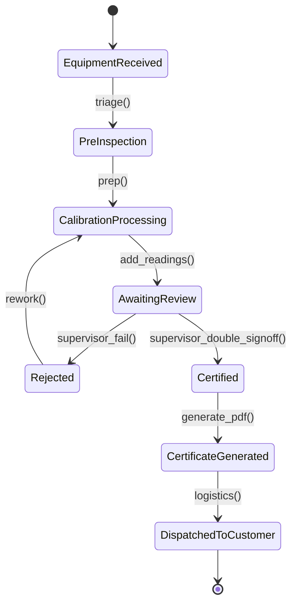
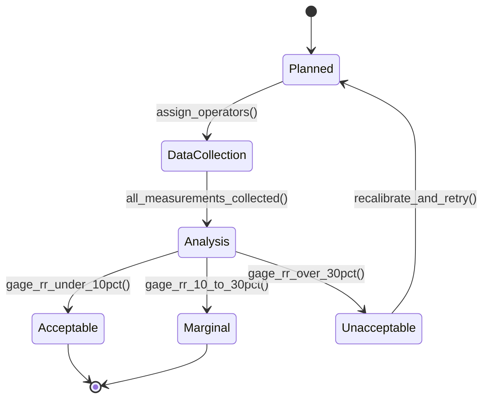
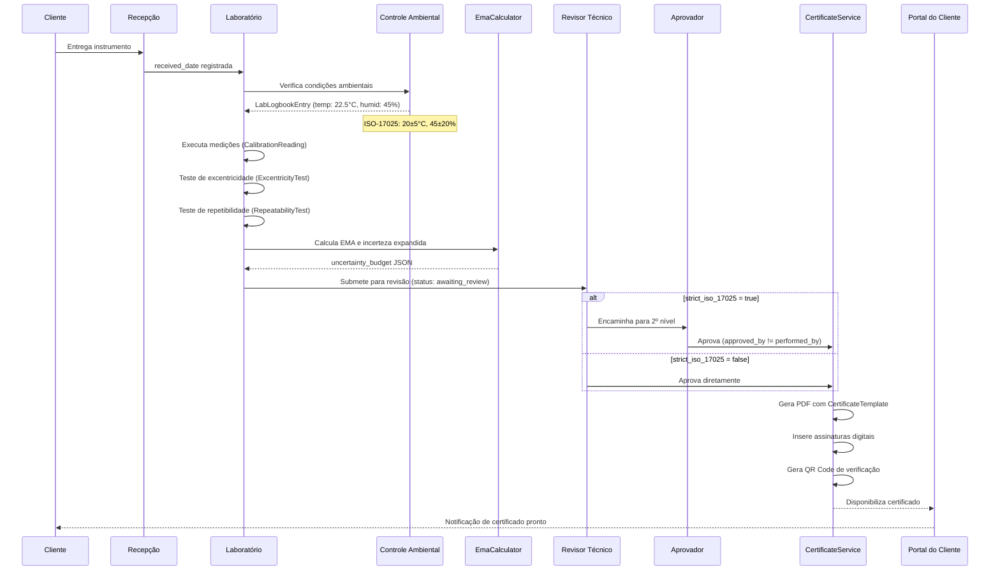

# Módulo: Lab & Metrologia

> **[AI_RULE]** Lista oficial de entidades (Models) associadas a este domínio no Laravel.
> **[COMPLIANCE]** Ver documentação de conformidade legal: [ISO-17025](../compliance/ISO-17025.md)

---

## 1. Visão Geral

O módulo Lab é o coração técnico do sistema, responsável por todo o ciclo de calibração de instrumentos de medição. Abrange desde o recebimento do instrumento até a emissão do certificado de calibração com conformidade ISO-17025:2017. Inclui gestão de padrões de referência (pesos padrão), controle ambiental do laboratório, cálculos de incerteza expandida, testes de excentricidade e repetibilidade, estudos R&R (Reprodutibilidade e Repetibilidade), amostras de retenção e predição de desgaste de padrões.

### Princípios Fundamentais

- **Rastreabilidade metrológica**: toda medição rastreável a padrões nacionais/internacionais
- **Imutabilidade de registros**: `LabLogbookEntry` é append-only (ISO-17025 seção 7.5)
- **Double sign-off condicional**: se `strict_iso_17025 = true`, exige dupla assinatura
- **Incerteza declarada**: todo certificado DEVE conter incerteza expandida (U) com fator k

---

## 2. Entidades (Models) — Campos Completos

### 2.1 `EquipmentCalibration`

Entidade principal que representa uma calibração executada.

| Campo | Tipo | Descrição |
|---|---|---|
| `tenant_id` | bigint | Tenant (multi-tenant) |
| `equipment_id` | bigint FK | Equipamento/instrumento calibrado |
| `calibration_date` | date | Data da calibração |
| `next_due_date` | date | Próxima data de vencimento |
| `calibration_type` | string | Tipo de calibração (lookup `CalibrationType`) |
| `result` | string | Resultado: `approved`, `rejected`, `adjusted` |
| `laboratory` | string | Laboratório executor |
| `certificate_number` | string | Número do certificado emitido |
| `certificate_file` | string | Caminho do arquivo original |
| `certificate_pdf_path` | string | Caminho do PDF gerado |
| `standard_used` | string | Padrão utilizado (descrição) |
| `error_found` | decimal:4 | Erro encontrado principal |
| `uncertainty` | decimal:4 | Incerteza expandida (U) |
| `errors_found` | json/array | Array de erros encontrados por ponto |
| `technician_notes` | text | Observações do técnico |
| `corrections_applied` | text | Correções aplicadas |
| `performed_by` | bigint FK | Técnico metrologista executor |
| `approved_by` | bigint FK | Aprovador (revisor técnico) |
| `cost` | decimal:2 | Custo da calibração |
| `work_order_id` | bigint FK | OS vinculada |
| `notes` | text | Notas gerais |
| `eccentricity_data` | json | Dados de excentricidade embutidos |
| `certificate_template_id` | bigint FK | Template do certificado |
| `conformity_declaration` | string | Declaração de conformidade |
| `max_permissible_error` | decimal:4 | Erro máximo admissível (EMA) |
| `max_error_found` | decimal:4 | Maior erro encontrado |
| `mass_unit` | string | Unidade de massa (`kg`, `g`, `mg`) |
| `calibration_method` | string | Método de calibração aplicado |
| `received_date` | date | Data de recebimento do instrumento |
| `issued_date` | date | Data de emissão do certificado |
| `calibration_location` | string | Local da calibração |
| `calibration_location_type` | string | Tipo: `laboratory`, `field` |
| `before_adjustment_data` | json | Dados antes do ajuste |
| `after_adjustment_data` | json | Dados após o ajuste |
| `verification_type` | string | Tipo de verificação |
| `verification_division_e` | string | Divisão de verificação (e) |
| `prefilled_from_id` | bigint FK | Calibração anterior (prefill) |
| `gravity_acceleration` | decimal:6 | Aceleração da gravidade local |
| `decision_rule` | string | Regra de decisão aplicada |
| `uncertainty_budget` | json | Balanço de incerteza completo |
| `laboratory_address` | string | Endereço do laboratório |
| `scope_declaration` | string | Declaração de escopo |
| `precision_class` | string | Classe de precisão (OIML) |

**Relacionamentos:**

- `belongsTo` Equipment, User (performed_by), User (approved_by), WorkOrder, CertificateTemplate
- `belongsToMany` StandardWeight (pivot: `calibration_standard_weight`)
- `hasMany` CalibrationReading, ExcentricityTest, RepeatabilityTest

### 2.2 `CalibrationReading`

Leitura individual de calibração (ponto de medição).

| Campo | Tipo | Descrição |
|---|---|---|
| `tenant_id` | bigint | Tenant |
| `equipment_calibration_id` | bigint FK | Calibração pai |
| `reference_value` | decimal:4 | Valor de referência (padrão) |
| `indication_increasing` | decimal:4 | Indicação na carga crescente |
| `indication_decreasing` | decimal:4 | Indicação na carga decrescente |
| `error` | decimal:4 | Erro = indicação - referência |
| `expanded_uncertainty` | decimal:4 | Incerteza expandida (U) do ponto |
| `k_factor` | decimal:2 | Fator de abrangência (k) |
| `correction` | decimal:4 | Correção = -erro |
| `reading_order` | integer | Ordem da leitura |
| `repetition` | integer | Número da repetição |
| `unit` | string | Unidade de medida |

**Métodos:**

- `calculateError()` — calcula erro e correção automaticamente

### 2.3 `StandardWeight`

Peso padrão de referência metrológica.

| Campo | Tipo | Descrição |
|---|---|---|
| `tenant_id` | bigint | Tenant |
| `code` | string | Código único (ex: `PP-0001`) |
| `nominal_value` | decimal:4 | Valor nominal |
| `unit` | string | Unidade: `kg`, `g`, `mg` |
| `serial_number` | string | Número de série do fabricante |
| `manufacturer` | string | Fabricante |
| `precision_class` | string | Classe OIML: `E1`, `E2`, `F1`, `F2`, `M1`, `M2`, `M3` |
| `material` | string | Material (inox, latão, ferro fundido) |
| `shape` | string | Formato: `cilindrico`, `retangular`, `disco`, `paralelepipedo`, `outro` |
| `certificate_number` | string | Número do certificado de calibração |
| `certificate_date` | date | Data do certificado |
| `certificate_expiry` | date | Data de vencimento do certificado |
| `certificate_file` | string | Arquivo do certificado |
| `laboratory` | string | Laboratório que calibrou o padrão |
| `status` | string | `active`, `in_calibration`, `out_of_service`, `discarded` |
| `notes` | text | Observações |
| `wear_rate_percentage` | decimal:2 | Taxa de desgaste (%) |
| `expected_failure_date` | date | Data prevista de falha (predição) |

**Accessors:**

- `certificate_status` — retorna `em_dia`, `vence_em_breve`, `vencido`, `sem_data`
- `display_name` — retorna `"PP-0001 — 10.0000 kg"`

**Scopes:** `active()`, `expiringSoon()`

### 2.4 `ExcentricityTest`

Teste de excentricidade para balanças e instrumentos de pesagem.

| Campo | Tipo | Descrição |
|---|---|---|
| `tenant_id` | bigint | Tenant |
| `equipment_calibration_id` | bigint FK | Calibração pai |
| `load_value` | decimal:4 | Carga aplicada |
| `unit` | string | Unidade |
| `position_center` | decimal:4 | Indicação no centro |
| `position_front` | decimal:4 | Indicação frontal |
| `position_back` | decimal:4 | Indicação traseira |
| `position_left` | decimal:4 | Indicação esquerda |
| `position_right` | decimal:4 | Indicação direita |
| `max_difference` | decimal:4 | Maior diferença encontrada |
| `max_permissible_error` | decimal:4 | EMA para excentricidade |
| `passed` | boolean | Aprovado/reprovado |

### 2.5 `RepeatabilityTest`

Teste de repetibilidade (até 10 medições no mesmo ponto de carga).

| Campo | Tipo | Descrição |
|---|---|---|
| `tenant_id` | bigint | Tenant |
| `equipment_calibration_id` | bigint FK | Calibração pai |
| `load_value` | decimal:4 | Carga aplicada |
| `unit` | string | Unidade |
| `measurement_1` a `measurement_10` | decimal:4 | Medições individuais (até 10) |
| `mean` | decimal:4 | Média calculada |
| `std_deviation` | decimal:6 | Desvio padrão experimental |
| `uncertainty_type_a` | decimal:6 | Incerteza Tipo A (s/√n) |

**Métodos:**

- `getMeasurements()` — retorna array de medições não-nulas
- `calculateStatistics()` — calcula média, desvio padrão e incerteza Tipo A

### 2.6 `LabLogbookEntry`

Registro do livro de bordo do laboratório (IMUTÁVEL — append-only por ISO-17025).

| Campo | Tipo | Descrição |
|---|---|---|
| `tenant_id` | bigint | Tenant |
| `user_id` | bigint FK | Usuário que registrou |
| `type` | string | Tipo de entrada |
| `description` | text | Descrição do registro |
| `temperature` | decimal:2 | Temperatura ambiente (°C) |
| `humidity` | decimal:2 | Umidade relativa (%) |
| `entry_date` | date | Data da entrada |

> **[AI_RULE_CRITICAL]** Somente operações `CREATE` são permitidas. Correções geram novo registro vinculado ao original.

### 2.7 `CertificateTemplate`

Template para geração de certificados PDF.

| Campo | Tipo | Descrição |
|---|---|---|
| `tenant_id` | bigint | Tenant |
| `name` | string | Nome do template |
| `type` | string | Tipo de certificado |
| `header_html` | text | HTML do cabeçalho |
| `footer_html` | text | HTML do rodapé |
| `logo_path` | string | Caminho do logotipo |
| `signature_image_path` | string | Imagem da assinatura |
| `signatory_name` | string | Nome do signatário |
| `signatory_title` | string | Título/cargo |
| `signatory_registration` | string | Registro profissional (CRM, CREA) |
| `custom_fields` | json/array | Campos customizáveis |
| `is_default` | boolean | Template padrão |

### 2.8 `RrStudy`

Estudo de Reprodutibilidade e Repetibilidade (Gage R&R).

| Campo | Tipo | Descrição |
|---|---|---|
| `tenant_id` | bigint | Tenant |
| `title` | string | Título do estudo |
| `instrument_id` | bigint FK | Instrumento avaliado |
| `parameter` | string | Parâmetro medido |
| `operators` | json/array | Lista de operadores |
| `repetitions` | integer | Número de repetições |
| `status` | string | Status do estudo |
| `results` | json/array | Resultados completos |
| `conclusion` | text | Conclusão |
| `created_by` | bigint FK | Criador do estudo |

### 2.9 `RetentionSample`

Amostra de retenção com prazo de guarda obrigatório.

| Campo | Tipo | Descrição |
|---|---|---|
| `tenant_id` | bigint | Tenant |
| `work_order_id` | bigint FK | OS vinculada |
| `sample_code` | string | Código da amostra |
| `description` | text | Descrição |
| `location` | string | Local de armazenamento |
| `retention_days` | integer | Prazo de retenção em dias |
| `expires_at` | date | Data de expiração |
| `status` | string | Status da amostra |
| `stored_at` | datetime | Data/hora de armazenamento |
| `notes` | text | Observações |

### 2.10 `ToolInventory`

Inventário de ferramentas do laboratório.

| Campo | Tipo | Descrição |
|---|---|---|
| `tenant_id` | bigint | Tenant |
| `name` | string | Nome da ferramenta |
| `serial_number` | string | Número de série |
| `category` | string | Categoria |
| `assigned_to` | bigint FK | Atribuído a (User) |
| `fleet_vehicle_id` | bigint FK | Veículo (para campo) |
| `calibration_due` | date | Vencimento da calibração |
| `status` | string | Status |
| `value` | decimal:2 | Valor (R$) |
| `notes` | text | Observações |

### 2.11 `ToolCalibration`

Registro de calibração de ferramentas.

### 2.12 `WeightAssignment`

Atribuição de pesos padrão a técnicos ou veículos.

| Campo | Tipo | Descrição |
|---|---|---|
| `tenant_id` | bigint | Tenant |
| `standard_weight_id` | bigint FK | Peso padrão |
| `assigned_to_user_id` | bigint FK | Técnico |
| `assigned_to_vehicle_id` | bigint FK | Veículo |
| `assignment_type` | string | Tipo de atribuição |
| `assigned_at` | datetime | Data/hora da atribuição |
| `returned_at` | datetime | Data/hora da devolução |
| `assigned_by` | bigint FK | Responsável pela atribuição |
| `notes` | text | Observações |

### 2.13 `EquipmentDocument`

Documentos associados a equipamentos.

| Campo | Tipo | Descrição |
|---|---|---|
| `tenant_id` | bigint | Tenant |
| `equipment_id` | bigint FK | Equipamento |
| `type` | string | Tipo de documento |
| `name` | string | Nome do arquivo |
| `file_path` | string | Caminho no storage |
| `expires_at` | date | Validade |
| `uploaded_by` | bigint FK | Usuário que fez upload |

---

## 3. Services

### `CalibrationWizardService`

Orquestra o fluxo completo de calibração passo a passo (wizard):

- Recebimento do instrumento
- Verificação de condições ambientais
- Execução das medições
- Cálculo de incerteza e EMA
- Revisão técnica e aprovação
- Geração do certificado

### `CalibrationCertificateService`

Gera certificados PDF usando `CertificateTemplate`:

- Renderiza dados de `CalibrationReading` no template
- Insere assinaturas digitais (double sign-off se `strict_iso_17025`)
- Gera QR Code de verificação (endpoint público `v1/verify-certificate/{code}`)
- Armazena PDF em `certificate_pdf_path`

### `EmaCalculator` e Matemática Metrológica (GUM)

Responsável pelos cálculos críticos prescritos pela ISO-17025 e Portarias do INMETRO (ex: Portaria 236/94 para balanças).

**Equação 1: Erro de Indicação (E)**
`E = I - L_0`
Onde: `I` = Indicação (carga crescente ou decrescente), `L_0` = Valor nominal do padrão. Alimentando `error` em `CalibrationReading`.

**Equação 2: Correção de Erro (E_c)**
Para eliminar o erro de arredondamento digital: `E_c = E + (0.5 * e) - \Delta L`
Onde `e` é a divisão de verificação e `\Delta L` é a carga adicional para provocar a transição de indicação.

**Equação 3: Erro Máximo Admissível (EMA)**
O EMA depende da classe de exatidão (I, II, III, IIII) e da carga expressa no número de divisões de verificação (`n = m / e`).
- Exemplo Classe III (OIML R76):
  - `0 <= m <= 500e` -> `EMA = ± 1.0 e`
  - `500e < m <= 2000e` -> `EMA = ± 2.0 e`
  - `2000e < m <= 10000e` -> `EMA = ± 3.0 e`

**Equação 4: Incerteza Padrão Combinada (u_c) - Guia GUM**
Composição das fontes de incerteza (Tipo A e Tipo B):
`u_c = \sqrt{ u_A^2 + u_{B1}^2 + u_{B2}^2 + ... }`
- `u_A` (Repetibilidade, Tipo A): `s / \sqrt{n}` (s = desvio padrão, n = número de repetições).
- `u_B1` (Resolução, Tipo B): `(d/2) / \sqrt{3}` (Distribuição retangular).
- `u_B2` (Padrão, Tipo B): `U_{padrao} / k_{padrao}` (Certeza extraída do certificado do peso padrão).
- `u_B3` (Excentricidade, Tipo B): `(E_{max} / (2 * \sqrt{3}))` ou modelo específico.

**Equação 5: Incerteza Expandida (U)**
`U = k * u_c`
O fator de abrangência `k` (normalmente `k = 2` para ~95% de confiança) é determinado pelos graus de liberdade efetivos usando a fórmula de Welch-Satterthwaite. Alimenta o campo `uncertainty`.

### `WeightWearPredictorService`

Predição de desgaste de pesos padrão:

- Regressão linear sobre medições históricas de massa convencional.
- Calcula `wear_rate_percentage` e `expected_failure_date`.
- Alerta preemptivo: Se a predição apontar que o peso sairá do erro admissível (EMA) de sua classe OIML (ex: F1) em menos de 6 meses, emite flag de aviso no inventário.

---

## 3.1 Events

### `CalibrationCompleted`

**Classe:** `App\Events\CalibrationCompleted`
Disparado quando uma calibração é concluída. Carrega `WorkOrder` e `equipmentId`.

### `CalibrationExpiring`

**Classe:** `App\Events\CalibrationExpiring`
Disparado quando uma calibração está próxima do vencimento. Carrega `EquipmentCalibration` e `daysUntilExpiry`.

---

## 3.2 Listeners

### `CreateAgendaItemOnCalibration`

**Classe:** `App\Listeners\CreateAgendaItemOnCalibration` (implements `ShouldQueue`)
**Escuta:** `CalibrationExpiring`
Cria automaticamente um `AgendaItem` para o técnico responsável quando a calibração de um equipamento está vencendo. Define prioridade baseada nos dias restantes.

### `GenerateCorrectiveQuoteOnCalibrationFailure`

**Classe:** `App\Listeners\GenerateCorrectiveQuoteOnCalibrationFailure`
**Escuta:** `CalibrationCompleted`
Se a calibração mais recente tem resultado `reprovado` (failed), gera automaticamente um `Quote` (orçamento corretivo) para o cliente. Integra módulos Lab e CRM.

### `HandleCalibrationExpiring`

**Classe:** `App\Listeners\HandleCalibrationExpiring` (implements `ShouldQueue`)
**Escuta:** `CalibrationExpiring`
Envia notificação ao cliente sobre calibração vencendo. Cria `CrmActivity` de follow-up. Utiliza `CalibrationExpiryNotification` e `DispatchesPushNotification`.

---

## 3.3 Jobs

### `DetectCalibrationFraudulentPatterns`

**Classe:** `App\Jobs\DetectCalibrationFraudulentPatterns` (implements `ShouldQueue`)
**Fila:** `quality`
**Timeout:** 300s | **Tentativas:** 2 | **Backoff:** 60s
Analisa padrões suspeitos em calibrações (ex: leituras idênticas repetidas, variância zero, padrões estatisticamente improváveis). Roda por tenant ou para todos os tenants se `tenantId` for null.

---

## 4. Enums

### `CalibrationType`

Tipos de calibração disponíveis no sistema (lookup table `calibration_types`).

---

## 5. Fluxo Metrológico / Calibração



### 5.1 Workflow de Execução de Ensaio (Passo-a-Passo Tático)

> **[AI_RULE_CRITICAL]** Esta seção detalha o fluxo interno do estado `CalibrationProcessing` — o core da operação laboratorial. Cada etapa corresponde a ações do `CalibrationWizardService`.

**Etapa 1: Preparação do Ambiente**

- Técnico registra condição ambiental via `POST /api/v1/environmental-readings` (`LabLogbookEntry`)
- Sistema valida temperatura (20±5°C) e umidade (45±20%) — fora dos limites bloqueia a calibração
- `CalibrationWizardService::validateEnvironment()` retorna 422 se condições inadequadas

**Etapa 2: Seleção de Padrões**

- Técnico seleciona pesos padrão via `standard_weight_ids` no payload de calibração
- Sistema valida: padrão com certificado vencido (`certificate_expiry < today`) é rejeitado
- Classe do padrão deve ser ≥ 1 nível acima da classe do instrumento (ex: padrão F1 para instrumento M1)

**Etapa 3: Execução das Medições**

- Para cada ponto de referência (definido pelo range do instrumento):
  1. Registrar indicação na carga **crescente** (`indication_increasing`)
  2. Registrar indicação na carga **decrescente** (`indication_decreasing`)
  3. Sistema calcula `error = indication - reference_value` e `correction = -error`
- Mínimo de leituras: definido pela norma (ex: OIML R76 exige 5 pontos para balanças)
- Dados salvos em `CalibrationReading` com `reading_order` e `repetition`

**Etapa 4: Testes Complementares**

- **Excentricidade** (`ExcentricityTest`): carga posicionada em centro, frente, trás, esquerda, direita. `max_difference` calculado. `passed = max_difference <= max_permissible_error`
- **Repetibilidade** (`RepeatabilityTest`): até 10 medições no mesmo ponto. `calculateStatistics()` computa média, desvio padrão e incerteza Tipo A (`s/√n`)

**Etapa 5: Cálculo de Incerteza (EmaCalculator)**

- `EmaCalculator::computeUncertaintyBudget()` é chamado com readings + repeatability + padrões
- Gera `uncertainty_budget` JSON: `{ "u_A": 0.0001, "u_B_resolution": 0.0003, "u_B_standard": 0.0001, "u_combined": 0.0003, "U_expanded": 0.0006, "k_factor": 2.0 }`
- `max_error_found` = max absoluto dos erros de todos os readings
- `result` determinado: se `|max_error_found| + U <= EMA` → `approved`, senão → `rejected`

**Etapa 6: Revisão e Aprovação**

- Status muda para `AwaitingReview`
- Se `strict_iso_17025 = true`: revisor (supervisor) valida leituras → encaminha para aprovador (gerente)
- Se `strict_iso_17025 = false`: revisor aprova diretamente
- Regra inviolável: `performed_by != approved_by` (quando strict mode)

**Etapa 7: Emissão de Certificado**

- `CalibrationCertificateService::generate()` renderiza PDF com template, readings, incerteza, QR Code
- Certificado salvo em `certificate_pdf_path`, número gerado em `certificate_number` (formato `CAL-YYYY-XXXX`)
- `CalibrationCompleted` event disparado → listeners criam agenda item, geram orçamento corretivo se reprovado

## 5.1 R&R Study (Reproducibility & Repeatability)



---

## 6. Contratos JSON (API Endpoints)

### `POST /api/v1/equipment-calibrations`

Cria nova calibração (via wizard ou direta).

```json
{
  "equipment_id": 42,
  "calibration_date": "2026-03-20",
  "calibration_type": "mass",
  "calibration_location_type": "laboratory",
  "received_date": "2026-03-18",
  "performed_by": 7,
  "certificate_template_id": 1,
  "precision_class": "F1",
  "gravity_acceleration": 9.7862,
  "decision_rule": "simple_acceptance",
  "readings": [
    {
      "reference_value": 10.0000,
      "indication_increasing": 10.0002,
      "indication_decreasing": 10.0001,
      "k_factor": 2.00,
      "unit": "kg",
      "reading_order": 1,
      "repetition": 1
    }
  ],
  "repeatability_tests": [
    {
      "load_value": 10.0000,
      "unit": "kg",
      "measurement_1": 10.0002,
      "measurement_2": 10.0001,
      "measurement_3": 10.0003,
      "measurement_4": 10.0002,
      "measurement_5": 10.0001
    }
  ],
  "eccentricity_tests": [
    {
      "load_value": 10.0000,
      "unit": "kg",
      "position_center": 10.0000,
      "position_front": 10.0001,
      "position_back": 9.9999,
      "position_left": 10.0001,
      "position_right": 10.0000
    }
  ],
  "standard_weight_ids": [1, 2, 3]
}
```

**Resposta:** `201 Created`

```json
{
  "data": {
    "id": 155,
    "certificate_number": "CAL-2026-0155",
    "result": "approved",
    "uncertainty": 0.0003,
    "max_error_found": 0.0002,
    "certificate_pdf_path": "/storage/certificates/CAL-2026-0155.pdf"
  }
}
```

### `GET /api/v1/instruments?status=active&calibration_due_before=2026-06-01`

Lista instrumentos com filtros.

```json
{
  "data": [
    {
      "id": 42,
      "name": "Balança Semi-Analítica",
      "serial_number": "BAL-2024-001",
      "calibration_due": "2026-05-15",
      "status": "active",
      "last_calibration": {
        "id": 150,
        "date": "2025-05-15",
        "result": "approved",
        "certificate_number": "CAL-2025-0150"
      }
    }
  ],
  "meta": { "total": 1, "per_page": 15 }
}
```

### `POST /api/v1/environmental-readings`

Registra condição ambiental do laboratório (LabLogbookEntry).

```json
{
  "type": "environmental",
  "temperature": 22.5,
  "humidity": 45.0,
  "description": "Condições ambientais verificadas antes da calibração",
  "entry_date": "2026-03-20"
}
```

### `GET /api/v1/verify-certificate/{code}`

Endpoint público para verificação de autenticidade de certificado.

```json
{
  "valid": true,
  "certificate_number": "CAL-2026-0155",
  "issued_date": "2026-03-20",
  "equipment": "Balança Semi-Analítica BAL-2024-001",
  "laboratory": "Kalibrium Metrologia",
  "result": "approved"
}
```

---

## 7. Form Requests (Validacao de Entrada)

> **[AI_RULE]** Todo endpoint de criacao/atualizacao DEVE usar Form Request. Validacao inline em controllers e PROIBIDA.

### 7.1 StoreEquipmentCalibrationRequest

**Classe**: `App\Http\Requests\Lab\StoreEquipmentCalibrationRequest`
**Endpoint**: `POST /api/v1/equipment-calibrations`

```php
public function authorize(): bool
{
    return $this->user()->can('calibrations.create');
}

public function rules(): array
{
    return [
        'equipment_id'                       => ['required', 'integer', 'exists:equipment,id'],
        'calibration_date'                   => ['required', 'date', 'before_or_equal:today'],
        'calibration_type'                   => ['required', 'string'],
        'performed_by'                       => ['required', 'integer', 'exists:users,id'],
        'certificate_template_id'            => ['nullable', 'integer', 'exists:certificate_templates,id'],
        'precision_class'                    => ['nullable', 'string', 'in:E1,E2,F1,F2,M1,M2,M3'],
        'gravity_acceleration'               => ['nullable', 'numeric', 'between:9.70,9.85'],
        'decision_rule'                      => ['nullable', 'string', 'in:simple_acceptance,guard_banded'],
        'calibration_location_type'          => ['nullable', 'string', 'in:laboratory,field'],
        'readings'                           => ['required', 'array', 'min:1'],
        'readings.*.reference_value'         => ['required', 'numeric'],
        'readings.*.indication_increasing'   => ['required', 'numeric'],
        'readings.*.indication_decreasing'   => ['nullable', 'numeric'],
        'readings.*.k_factor'                => ['nullable', 'numeric', 'min:1', 'max:4'],
        'readings.*.unit'                    => ['required', 'string', 'in:kg,g,mg'],
        'readings.*.reading_order'           => ['required', 'integer', 'min:1'],
        'readings.*.repetition'              => ['required', 'integer', 'min:1'],
        'repeatability_tests'                => ['nullable', 'array'],
        'repeatability_tests.*.load_value'   => ['required', 'numeric'],
        'repeatability_tests.*.unit'         => ['required', 'string', 'in:kg,g,mg'],
        'eccentricity_tests'                 => ['nullable', 'array'],
        'eccentricity_tests.*.load_value'    => ['required', 'numeric'],
        'eccentricity_tests.*.unit'          => ['required', 'string', 'in:kg,g,mg'],
        'eccentricity_tests.*.position_center' => ['required', 'numeric'],
        'eccentricity_tests.*.position_front'  => ['required', 'numeric'],
        'eccentricity_tests.*.position_back'   => ['required', 'numeric'],
        'eccentricity_tests.*.position_left'   => ['required', 'numeric'],
        'eccentricity_tests.*.position_right'  => ['required', 'numeric'],
        'standard_weight_ids'                => ['nullable', 'array'],
        'standard_weight_ids.*'              => ['integer', 'exists:standard_weights,id'],
    ];
}
```

> **[AI_RULE]** Se `strict_iso_17025 = true`, `performed_by` != `approved_by` (double sign-off). O controller DEVE validar que nenhum peso padrao em `standard_weight_ids` tem certificado vencido.

### 7.2 StoreEnvironmentalReadingRequest

**Classe**: `App\Http\Requests\Lab\StoreEnvironmentalReadingRequest`
**Endpoint**: `POST /api/v1/environmental-readings`

```php
public function rules(): array
{
    return [
        'type'        => ['required', 'string'],
        'description' => ['required', 'string', 'min:10'],
        'temperature' => ['required', 'numeric', 'between:15,30'],
        'humidity'    => ['required', 'numeric', 'between:20,80'],
        'entry_date'  => ['required', 'date', 'before_or_equal:today'],
    ];
}
```

> **[AI_RULE]** Registro ambiental e append-only (ISO-17025 secao 7.5). NUNCA implementar UPDATE. Correcoes geram novo registro vinculado ao original.

### 7.3 StoreStandardWeightRequest

**Classe**: `App\Http\Requests\Lab\StoreStandardWeightRequest`
**Endpoint**: `POST /api/v1/standard-weights`

```php
public function authorize(): bool
{
    return $this->user()->can('standard-weights.manage');
}

public function rules(): array
{
    return [
        'code'             => ['required', 'string', 'unique:standard_weights,code'],
        'nominal_value'    => ['required', 'numeric', 'min:0.0001'],
        'unit'             => ['required', 'string', 'in:kg,g,mg'],
        'serial_number'    => ['nullable', 'string', 'max:100'],
        'manufacturer'     => ['nullable', 'string', 'max:255'],
        'precision_class'  => ['required', 'string', 'in:E1,E2,F1,F2,M1,M2,M3'],
        'material'         => ['nullable', 'string', 'max:100'],
        'shape'            => ['nullable', 'string', 'in:cilindrico,retangular,disco,paralelepipedo,outro'],
        'certificate_number' => ['nullable', 'string', 'max:100'],
        'certificate_date'   => ['nullable', 'date', 'before_or_equal:today'],
        'certificate_expiry' => ['nullable', 'date', 'after:certificate_date'],
        'laboratory'         => ['nullable', 'string', 'max:255'],
    ];
}
```

---

## 8. Regras de Validação

### `EquipmentCalibration`

```php
'equipment_id'           => 'required|exists:equipment,id',
'calibration_date'       => 'required|date|before_or_equal:today',
'calibration_type'       => 'required|string',
'performed_by'           => 'required|exists:users,id',
'readings'               => 'required|array|min:1',
'readings.*.reference_value'       => 'required|numeric',
'readings.*.indication_increasing' => 'required|numeric',
'readings.*.k_factor'              => 'nullable|numeric|min:1|max:4',
'readings.*.unit'                  => 'required|string|in:kg,g,mg',
'precision_class'        => 'nullable|string|in:E1,E2,F1,F2,M1,M2,M3',
'gravity_acceleration'   => 'nullable|numeric|between:9.70,9.85',
```

### `LabLogbookEntry`

```php
'type'         => 'required|string',
'description'  => 'required|string|min:10',
'temperature'  => 'required|numeric|between:15,30',   // ISO-17025: 20±5°C
'humidity'     => 'required|numeric|between:20,80',    // ISO-17025: 45±20%
'entry_date'   => 'required|date|before_or_equal:today',
```

### `StandardWeight`

```php
'code'             => 'required|string|unique:standard_weights,code,{id},id,tenant_id,{tenant_id}',
'nominal_value'    => 'required|numeric|min:0.0001',
'unit'             => 'required|in:kg,g,mg',
'precision_class'  => 'required|in:E1,E2,F1,F2,M1,M2,M3',
'certificate_date' => 'nullable|date|before_or_equal:today',
```

---

## 9. Permissões (RBAC)

| Permissão | Descrição | Perfis |
|---|---|---|
| `calibrations.create` | Criar calibração / adicionar leituras | Metrologista, Técnico |
| `calibrations.review` | Revisar calibração (1º nível) | Supervisor Técnico |
| `calibrations.approve` | Aprovar e emitir certificado (2º nível) | Gerente de Qualidade |
| `calibrations.view` | Visualizar calibrações e certificados | Todos autenticados |
| `certificates.download` | Baixar certificado PDF | Técnico, Cliente |
| `certificates.verify` | Verificar autenticidade (público) | Público (sem auth) |
| `standard-weights.manage` | CRUD de pesos padrão | Metrologista, Supervisor |
| `standard-weights.assign` | Atribuir peso a técnico/veículo | Supervisor |
| `lab-logbook.create` | Registrar no livro de bordo | Metrologista, Técnico |
| `lab-logbook.view` | Visualizar livro de bordo | Supervisor, Auditor |
| `rr-studies.manage` | Gerenciar estudos R&R | Metrologista |
| `retention-samples.manage` | Gerenciar amostras de retenção | Metrologista |
| `tools.manage` | CRUD de ferramentas | Supervisor |

> **[AI_RULE]** Se `strict_iso_17025 = true`, `performed_by` != `approved_by` (double sign-off obrigatório). O sistema DEVE validar essa regra no backend.

---

## 10. Diagrama de Sequência — Fluxo Completo de Calibração



---

## 11. Código de Referência

### PHP — `CalibrationCertificateService` (resumo)

```php
class CalibrationCertificateService
{
    public function generate(EquipmentCalibration $calibration): string
    {
        $template = $calibration->certificateTemplate
            ?? CertificateTemplate::default()->first();

        $readings = $calibration->readings()->orderBy('reading_order')->get();
        $repeatability = $calibration->repeatabilityTests;
        $eccentricity = $calibration->excentricityTests;

        // Renderiza PDF com dados metrológicos
        $pdf = PDF::loadView('certificates.calibration', [
            'calibration' => $calibration,
            'template' => $template,
            'readings' => $readings,
            'repeatability' => $repeatability,
            'eccentricity' => $eccentricity,
            'qr_code' => $this->generateVerificationQR($calibration),
        ]);

        $path = "certificates/{$calibration->certificate_number}.pdf";
        Storage::put($path, $pdf->output());
        $calibration->update(['certificate_pdf_path' => $path]);

        return $path;
    }
}
```

### React Hook — `useCalibration` (referência)

```typescript
interface CalibrationReading {
  reference_value: number;
  indication_increasing: number;
  indication_decreasing: number | null;
  error: number;
  expanded_uncertainty: number;
  k_factor: number;
  correction: number;
  reading_order: number;
  repetition: number;
  unit: 'kg' | 'g' | 'mg';
}

interface EquipmentCalibration {
  id: number;
  equipment_id: number;
  calibration_date: string;
  result: 'approved' | 'rejected' | 'adjusted';
  certificate_number: string;
  precision_class: 'E1' | 'E2' | 'F1' | 'F2' | 'M1' | 'M2' | 'M3';
  uncertainty: number;
  max_error_found: number;
  readings: CalibrationReading[];
}

function useCalibration(calibrationId: number) {
  const { data, isLoading, error } = useQuery<EquipmentCalibration>(
    ['calibration', calibrationId],
    () => api.get(`/equipment-calibrations/${calibrationId}`).then(r => r.data.data)
  );
  return { calibration: data, isLoading, error };
}
```

---

### Endpoints Rest (Extraídos do Backend)

| Método | Rota | Controller | Ação |
|--------|------|------------|------|
| `POST` | `/api/v1/lab/rr-study` | `LabAdvancedController@rrStudy` | Executar estudo R&R |
| `GET` | `/api/v1/lab/sensor-readings` | `LabAdvancedController@sensorReadings` | Listar leituras de sensores |
| `POST` | `/api/v1/lab/sensor-readings` | `LabAdvancedController@storeSensorReading` | Registrar leitura de sensor |
| `POST` | `/api/v1/lab/sign-certificate` | `LabAdvancedController@signCertificate` | Assinar certificado digitalmente |
| `GET` | `/api/v1/lab/retention-samples` | `LabAdvancedController@retentionSamples` | Listar amostras de retenção |
| `POST` | `/api/v1/lab/retention-samples` | `LabAdvancedController@storeRetentionSample` | Registrar amostra de retenção |
| `GET` | `/api/v1/lab/logbook` | `LabAdvancedController@labLogbook` | Listar livro de bordo |
| `POST` | `/api/v1/lab/logbook` | `LabAdvancedController@storeLogbookEntry` | Registrar entrada no livro de bordo |
| `PUT` | `/api/v1/lab/logbook/{id}` | `LabAdvancedController@updateLogbookEntry` | Atualizar entrada (correção) |
| `DELETE` | `/api/v1/lab/logbook/{id}` | `LabAdvancedController@destroyLogbookEntry` | Remover entrada |
| `GET` | `/api/v1/lab/raw-data-backups` | `LabAdvancedController@rawDataBackups` | Listar backups de dados brutos |
| `POST` | `/api/v1/lab/raw-data-backups` | `LabAdvancedController@triggerRawDataBackup` | Disparar backup de dados brutos |
| `GET` | `/api/v1/lab/scale-readings` | `LabAdvancedController@scaleReadings` | Listar leituras de balanças |
| `POST` | `/api/v1/lab/scale-readings` | `LabAdvancedController@storeScaleReading` | Registrar leitura de balança |
| `GET` | `/api/v1/calibration-control-chart` | `CalibrationControlChartController@index` | Gráfico de controle de calibrações |
| `GET` | `/api/v1/verify-certificate/{code}` | `MetrologyQualityController@verifyCertificate` | Verificar certificado (público) |

## 12. Cenários BDD (ISO-17025)

### Cenário 1: Dupla assinatura obrigatória

```gherkin
Funcionalidade: Double Sign-Off ISO-17025
  Dado que o tenant tem strict_iso_17025 = true
  E existe uma calibração com status "awaiting_review"
  E o técnico executor é o usuário "João" (performed_by = 7)

  Cenário: Aprovação por pessoa diferente do executor
    Quando o usuário "Maria" (id = 12) aprova a calibração
    Então a calibração muda para status "certified"
    E approved_by = 12 (diferente de performed_by = 7)
    E o certificado PDF é gerado automaticamente

  Cenário: Tentativa de auto-aprovação
    Quando o usuário "João" (id = 7) tenta aprovar a calibração
    Então o sistema retorna erro 422
    E a mensagem contém "O aprovador deve ser diferente do executor"
```

### Cenário 2: Cadeia de rastreabilidade

```gherkin
Funcionalidade: Rastreabilidade Metrológica
  Dado que existe uma calibração para a balança "BAL-001"
  E foram utilizados os pesos padrão PP-0001, PP-0002, PP-0003

  Cenário: Certificado inclui rastreabilidade dos padrões
    Quando o certificado PDF é gerado
    Então o certificado contém a seção "Padrões Utilizados"
    E lista os certificados de calibração dos pesos padrão
    E cada peso tem número de certificado e laboratório acreditado
    E nenhum peso padrão tem certificado vencido

  Cenário: Peso padrão com certificado vencido
    Dado que o peso PP-0003 tem certificate_expiry < hoje
    Quando se tenta criar uma calibração usando PP-0003
    Então o sistema retorna erro 422
    E a mensagem contém "Peso padrão PP-0003 com certificado vencido"
```

### Cenário 3: Condições ambientais obrigatórias

```gherkin
Funcionalidade: Controle Ambiental ISO-17025
  Dado que a calibração será executada no laboratório

  Cenário: Temperatura fora do intervalo
    Quando se registra LabLogbookEntry com temperature = 32.0
    Então o sistema retorna erro 422
    E a mensagem contém "Temperatura fora do intervalo permitido (15-30°C)"

  Cenário: Calibração sem registro ambiental
    Dado que não existe LabLogbookEntry para a data de hoje
    Quando se tenta finalizar uma calibração
    Então o sistema retorna erro 422
    E a mensagem contém "Registro ambiental obrigatório antes da calibração"
```

### Cenário 4: Imutabilidade do Livro de Bordo

```gherkin
Funcionalidade: Append-Only LabLogbookEntry
  Dado que existe uma entrada no livro de bordo com id = 50

  Cenário: Tentativa de edição
    Quando se tenta fazer PUT /lab-logbook-entries/50
    Então o sistema retorna erro 405 (Method Not Allowed)

  Cenário: Correção via novo registro
    Quando se cria novo LabLogbookEntry com description "Correção ref. entrada #50: ..."
    Então o novo registro é criado com sucesso
    E o registro original #50 permanece inalterado
```

---

## 13. Guard Rails de Negócio (ISO-17025) `[AI_RULE]`

> **[AI_RULE_CRITICAL] Normativa de Double Sign-Off (Condicional)**
> Se a Flag do Tenant `strict_iso_17025` for *true*, laudos e `CalibrationReading` exigem assinatura de 2 níveis (Técnico Solicitante != Revisor Técnico). Se for *false*, o fluxo é flexibilizado em 1 passo. É proibido à IA criar controllers rígidos sem verificar esta condicional global.

> **[AI_RULE_CRITICAL] Imutabilidade de Medições**
> O Model `LabLogbookEntry` só aceita operações `CREATE`. Uma vez inserida a massa no DB, modificações ou correções de digitação devem ser feitas como novos registros atrelados à mesma Entrada Base, para trilha cega e auditoria da ISO.

> **[AI_RULE] Integração Inmetro**
> Lacres quebrarem (`InmetroSeal`) ou falharem disparam webhook para o órgão e barram imediatamente o equipamento usando `QualityProcedure`.

> **[AI_RULE] Testes de Excentricidade e Repetibilidade**
> `ExcentricityTest` e `RepeatabilityTest` são subsidiários da calibração. São obrigatórios para balanças e instrumentos de pesagem. Resultados alimentam `EmaCalculator` para calcular Erro Máximo Admissível.

> **[AI_RULE] Amostras de Retenção**
> `RetentionSample` tem prazo de guarda configurado por tipo de calibração. Sistema DEVE alertar 30 dias antes do vencimento e bloquear descarte antes do prazo.

> **[AI_RULE] Predição de Desgaste de Pesos Padrão**
> `WeightWearPredictorService` analisa histórico de `StandardWeight` para prever quando o peso padrão precisará ser recalibrado. Algoritmo baseado em regressão linear de medições históricas.

> **[AI_RULE] Templates de Certificado**
> `CertificateTemplate` define o layout do PDF de certificado. `CalibrationCertificateService` renderiza o PDF com dados do `CalibrationReading` e assinaturas digitais. Templates são versionados e não editáveis em produção.

---

## 14. Comportamento Integrado (Cross-Domain)

- `Quality` → Calibração reprovada (`Rejected`) cria `CapaRecord` automaticamente.
- `Inmetro` → Instrumento calibrado atualiza validade do selo INMETRO.
- `Inventory` → Ferramentas com calibração vencida geram alerta no estoque.
- `Compliance` → Todas as operações respeitam ISO-17025 se configurado no tenant.
- `WorkOrders` → OS de calibração criada automaticamente para equipamentos com vencimento próximo.

---

## Edge Cases e Tratamento de Erros

> **[AI_RULE_CRITICAL]** Todo cenário abaixo DEVE ser implementado. A IA não pode ignorar ou postergar nenhum tratamento.

| Cenário | Tratamento | Código Esperado |
|---------|------------|-----------------|
| Temperatura fora do intervalo ISO (20±5°C) ao iniciar calibração | `CalibrationWizardService::validateEnvironment()` retorna 422 com limites exatos. Bloqueia criação de `CalibrationReading` até novo `LabLogbookEntry` válido | `422 Unprocessable` |
| Peso padrão com certificado vencido (`certificate_expiry < today`) selecionado em `standard_weight_ids` | Controller valida cada peso antes de prosseguir. Rejeita calibração inteira — não permite parcial | `422 Unprocessable` |
| Técnico tenta aprovar própria calibração (`performed_by == approved_by`) com `strict_iso_17025 = true` | Backend valida no `CalibrationWizardRequest` e no Controller. Retorna erro explícito com mensagem i18n | `422 Unprocessable` |
| `EmaCalculator` recebe readings insuficientes (menos que mínimo normativo por tipo de instrumento) | Validação no `StoreEquipmentCalibrationRequest` com `min:N` dinâmico por `calibration_type`. Se não configurado, mínimo = 5 | `422 Unprocessable` |
| Amostra de retenção (`RetentionSample`) com prazo vencido — tentativa de descarte antes do prazo | Sistema bloqueia descarte. Job diário `CheckRetentionSampleExpiryJob` alerta 30 dias antes. Descarte antes do prazo exige aprovação gerencial | `403 Forbidden` |
| Predição de desgaste (`WeightWearPredictorService`) sem dados históricos suficientes (< 3 medições) | Service retorna `null` para `expected_failure_date` e `wear_rate_percentage = 0`. Frontend exibe "Dados insuficientes para predição" | `200 OK` (com flag) |
| Tentativa de UPDATE em `LabLogbookEntry` existente (ISO-17025 append-only) | Rota PUT/PATCH retorna 405 Method Not Allowed. Correções DEVEM criar novo registro vinculado ao original via `corrects_entry_id` | `405 Method Not Allowed` |
| Backup de dados brutos falha (`triggerRawDataBackup`) | Job dispara retry com backoff exponencial (30s, 60s, 120s). Após 3 falhas, cria `SystemAlert` para administrador. Dados originais permanecem intactos | `500 → retry` |
| QR Code público (`/verify-certificate/{code}`) com código inexistente ou adulterado | Retorna JSON `{ "valid": false }` sem revelar informações internas. Rate limit 120/min para prevenir enumeração | `404 Not Found` |
| Calibração em campo (`calibration_location_type = 'field'`) sem GPS do técnico | Sistema aceita calibração mas registra flag `missing_field_gps = true`. Alerta para supervisor revisar rastreabilidade | `201 Created` (com warning) |
| Classe do padrão inferior à do instrumento (ex: padrão M1 para instrumento F1) | `CalibrationWizardService` valida hierarquia OIML (E1 > E2 > F1 > F2 > M1 > M2 > M3). Rejeita com mensagem descritiva | `422 Unprocessable` |

## 15. Checklist de Implementação

- [ ] `EquipmentCalibration` CRUD completo com wizard steps
- [ ] `CalibrationReading` — cálculo automático de erro e correção
- [ ] `ExcentricityTest` — obrigatório para balanças
- [ ] `RepeatabilityTest` — cálculo de incerteza Tipo A
- [ ] `EmaCalculator` — cálculo de EMA por classe OIML
- [ ] `CalibrationCertificateService` — geração PDF com QR Code
- [ ] `CertificateTemplate` — CRUD e versionamento
- [ ] `LabLogbookEntry` — append-only, validação ambiental
- [ ] `StandardWeight` — CRUD com controle de validade
- [ ] `WeightWearPredictorService` — predição de desgaste
- [ ] `WeightAssignment` — atribuição a técnicos/veículos
- [ ] `RrStudy` — estudo R&R completo
- [ ] `RetentionSample` — alertas 30 dias antes do vencimento
- [ ] Double sign-off condicional (`strict_iso_17025`)
- [ ] Endpoint público de verificação de certificado
- [ ] Testes automatizados para todos os cenários BDD
- [ ] Integração cross-domain com Quality, Inmetro, WorkOrders

---

## Fluxos Relacionados

| Fluxo | Descrição |
|-------|-----------|
| [Chamado de Emergência](file:///c:/PROJETOS/sistema/docs/fluxos/CHAMADO-EMERGENCIA.md) | Processo documentado em `docs/fluxos/CHAMADO-EMERGENCIA.md` |
| [Cobrança e Renegociação](file:///c:/PROJETOS/sistema/docs/fluxos/COBRANCA-RENEGOCIACAO.md) | Processo documentado em `docs/fluxos/COBRANCA-RENEGOCIACAO.md` |
| [Despacho e Atribuição](file:///c:/PROJETOS/sistema/docs/fluxos/DESPACHO-ATRIBUICAO.md) | Processo documentado em `docs/fluxos/DESPACHO-ATRIBUICAO.md` |
| [Devolução de Equipamento](file:///c:/PROJETOS/sistema/docs/fluxos/DEVOLUCAO-EQUIPAMENTO.md) | Processo documentado em `docs/fluxos/DEVOLUCAO-EQUIPAMENTO.md` |
| [Estoque Móvel](file:///c:/PROJETOS/sistema/docs/fluxos/ESTOQUE-MOVEL.md) | Processo documentado em `docs/fluxos/ESTOQUE-MOVEL.md` |
| [Falha de Calibração](file:///c:/PROJETOS/sistema/docs/fluxos/FALHA-CALIBRACAO.md) | Processo documentado em `docs/fluxos/FALHA-CALIBRACAO.md` |
| [Fechamento Mensal](file:///c:/PROJETOS/sistema/docs/fluxos/FECHAMENTO-MENSAL.md) | Processo documentado em `docs/fluxos/FECHAMENTO-MENSAL.md` |
| [Garantia](file:///c:/PROJETOS/sistema/docs/fluxos/GARANTIA.md) | Processo documentado em `docs/fluxos/GARANTIA.md` |
| [Integrações Externas](file:///c:/PROJETOS/sistema/docs/fluxos/INTEGRACOES-EXTERNAS.md) | Processo documentado em `docs/fluxos/INTEGRACOES-EXTERNAS.md` |
| [Manutenção Preventiva](file:///c:/PROJETOS/sistema/docs/fluxos/MANUTENCAO-PREVENTIVA.md) | Processo documentado em `docs/fluxos/MANUTENCAO-PREVENTIVA.md` |
| [Onboarding de Cliente](file:///c:/PROJETOS/sistema/docs/fluxos/ONBOARDING-CLIENTE.md) | Processo documentado em `docs/fluxos/ONBOARDING-CLIENTE.md` |
| [Operação Diária](file:///c:/PROJETOS/sistema/docs/fluxos/OPERACAO-DIARIA.md) | Processo documentado em `docs/fluxos/OPERACAO-DIARIA.md` |
| [Portal do Cliente](file:///c:/PROJETOS/sistema/docs/fluxos/PORTAL-CLIENTE.md) | Processo documentado em `docs/fluxos/PORTAL-CLIENTE.md` |
| [Relatórios Gerenciais](file:///c:/PROJETOS/sistema/docs/fluxos/RELATORIOS-GERENCIAIS.md) | Processo documentado em `docs/fluxos/RELATORIOS-GERENCIAIS.md` |
| [SLA e Escalonamento](file:///c:/PROJETOS/sistema/docs/fluxos/SLA-ESCALONAMENTO.md) | Processo documentado em `docs/fluxos/SLA-ESCALONAMENTO.md` |
| [Técnico Indisponível](file:///c:/PROJETOS/sistema/docs/fluxos/TECNICO-INDISPONIVEL.md) | Processo documentado em `docs/fluxos/TECNICO-INDISPONIVEL.md` |
| [Técnico em Campo](file:///c:/PROJETOS/sistema/docs/fluxos/TECNICO-EM-CAMPO.md) | Processo documentado em `docs/fluxos/TECNICO-EM-CAMPO.md` |

---

## 17. Inventário Completo do Código

### Models

| Model | Arquivo |
|-------|---------|
| `EquipmentCalibration` | `backend/app/Models/EquipmentCalibration.php` |
| `CalibrationReading` | `backend/app/Models/CalibrationReading.php` |
| `StandardWeight` | `backend/app/Models/StandardWeight.php` |
| `WeightAssignment` | `backend/app/Models/WeightAssignment.php` |
| `ExcentricityTest` | `backend/app/Models/ExcentricityTest.php` |
| `RepeatabilityTest` | `backend/app/Models/RepeatabilityTest.php` |
| `RrStudy` | `backend/app/Models/RrStudy.php` |
| `CertificateTemplate` | `backend/app/Models/CertificateTemplate.php` |
| `ToolInventory` | `backend/app/Models/ToolInventory.php` |
| `ToolCalibration` | `backend/app/Models/ToolCalibration.php` |
| `EquipmentDocument` | `backend/app/Models/EquipmentDocument.php` |
| `Equipment` | `backend/app/Models/Equipment.php` |
| `Lookups\CalibrationType` | `backend/app/Models/Lookups/CalibrationType.php` |

### Services

| Service | Arquivo |
|---------|---------|
| `CalibrationWizardService` | `backend/app/Services/Calibration/CalibrationWizardService.php` |
| `EmaCalculator` | `backend/app/Services/Calibration/EmaCalculator.php` |
| `CalibrationCertificateService` | `backend/app/Services/CalibrationCertificateService.php` |
| `WeightWearPredictorService` | `backend/app/Services/Metrology/WeightWearPredictorService.php` |

### Controllers

| Controller | Arquivo |
|------------|---------|
| `LabAdvancedController` | `backend/app/Http/Controllers/Api/V1/LabAdvancedController.php` |
| `CalibrationControlChartController` | `backend/app/Http/Controllers/Api/V1/CalibrationControlChartController.php` |
| `MetrologyQualityController` | `backend/app/Http/Controllers/Api/V1/MetrologyQualityController.php` |
| `StandardWeightController` | `backend/app/Http/Controllers/Api/V1/StandardWeightController.php` |
| `StandardWeightWearController` | `backend/app/Http/Controllers/Api/V1/Metrology/StandardWeightWearController.php` |
| `WeightAssignmentController` | `backend/app/Http/Controllers/Api/V1/Equipment/WeightAssignmentController.php` |
| `WeightToolController` | `backend/app/Http/Controllers/Api/V1/WeightToolController.php` |

### Events

| Event | Arquivo |
|-------|---------|
| `CalibrationCompleted` | `backend/app/Events/CalibrationCompleted.php` |
| `CalibrationExpiring` | `backend/app/Events/CalibrationExpiring.php` |

### Listeners

| Listener | Arquivo |
|----------|---------|
| `CreateAgendaItemOnCalibration` | `backend/app/Listeners/CreateAgendaItemOnCalibration.php` |
| `GenerateCorrectiveQuoteOnCalibrationFailure` | `backend/app/Listeners/GenerateCorrectiveQuoteOnCalibrationFailure.php` |
| `HandleCalibrationExpiring` | `backend/app/Listeners/HandleCalibrationExpiring.php` |

### Jobs

| Job | Arquivo |
|-----|---------|
| `DetectCalibrationFraudulentPatterns` | `backend/app/Jobs/DetectCalibrationFraudulentPatterns.php` |

### Form Requests

| FormRequest | Arquivo |
|-------------|---------|
| `CalibrationWizardRequest` | `backend/app/Http/Requests/Api/V1/CalibrationWizardRequest.php` |
| `AddCalibrationRequest` | `backend/app/Http/Requests/Equipment/AddCalibrationRequest.php` |
| `CreateCalibrationDraftRequest` | `backend/app/Http/Requests/Features/CreateCalibrationDraftRequest.php` |
| `UpdateCalibrationWizardRequest` | `backend/app/Http/Requests/Features/UpdateCalibrationWizardRequest.php` |
| `StoreCalibrationReadingsRequest` | `backend/app/Http/Requests/Features/StoreCalibrationReadingsRequest.php` |
| `SendCalibrationCertificateRequest` | `backend/app/Http/Requests/Features/SendCalibrationCertificateRequest.php` |
| `StoreCertificateTemplateRequest` | `backend/app/Http/Requests/Features/StoreCertificateTemplateRequest.php` |
| `UpdateCertificateTemplateRequest` | `backend/app/Http/Requests/Features/UpdateCertificateTemplateRequest.php` |
| `SyncCalibrationWeightsRequest` | `backend/app/Http/Requests/Features/SyncCalibrationWeightsRequest.php` |
| `StoreStandardWeightRequest` | `backend/app/Http/Requests/Equipment/StoreStandardWeightRequest.php` |
| `UpdateStandardWeightRequest` | `backend/app/Http/Requests/Equipment/UpdateStandardWeightRequest.php` |
| `RrStudyRequest` | `backend/app/Http/Requests/Lab/RrStudyRequest.php` |
| `SignCertificateRequest` | `backend/app/Http/Requests/Lab/SignCertificateRequest.php` |
| `StoreLogbookEntryRequest` | `backend/app/Http/Requests/Lab/StoreLogbookEntryRequest.php` |
| `UpdateLogbookEntryRequest` | `backend/app/Http/Requests/Lab/UpdateLogbookEntryRequest.php` |
| `StoreRetentionSampleRequest` | `backend/app/Http/Requests/Lab/StoreRetentionSampleRequest.php` |
| `StoreSensorReadingRequest` | `backend/app/Http/Requests/Lab/StoreSensorReadingRequest.php` |
| `StoreScaleReadingRequest` | `backend/app/Http/Requests/Lab/StoreScaleReadingRequest.php` |
| `TriggerRawDataBackupRequest` | `backend/app/Http/Requests/Lab/TriggerRawDataBackupRequest.php` |

### Frontend

| Arquivo | Descrição |
|---------|-----------|
| `frontend/src/lib/standard-weight-utils.ts` | Utilitários de pesos padrão (normalização, status labels) |
| `frontend/src/lib/standard-weight-utils.test.ts` | Testes unitários dos utilitários |
| `frontend/src/pages/equipamentos/StandardWeightsPage.tsx` | Página de gestão de pesos padrão |
| `frontend/src/pages/equipamentos/WeightAssignmentsPage.tsx` | Página de atribuições de pesos |

---

## Conformidade ISO 17025 + ISO 9001 — Atualização 2026-03-26

> **Referência completa:** [Gap Analysis](../auditoria/GAP-ANALYSIS-ISO-17025-9001.md)

### Wizard de Calibração — 10 Steps Guiados (ISO 17025 §7.1–§7.8)

O wizard foi redesenhado para INDUZIR o técnico ao acerto. Fluxo completo documentado em [CERTIFICADO-CALIBRACAO.md](../fluxos/CERTIFICADO-CALIBRACAO.md).

| Step | Nome | ISO | Bloqueio |
|------|------|-----|----------|
| 1 | Pre-Flight Check | §7.1 | ❌ se qualquer pré-requisito falhar |
| 2 | Dados do Cliente e Equipamento | §7.8.2 | ❌ se campos obrigatórios vazios |
| 3 | Seleção de Método e Padrões | §7.2, §6.5 | ❌ se padrão vencido |
| 4 | Condições Ambientais | §6.3 | ❌ se T/U/P fora da faixa |
| 5 | Leituras e Medições | §7.5 | ❌ se leituras incompletas |
| 6 | Ajuste (opcional) | §7.8 | — |
| 7 | Cálculo de Incerteza (GUM) | §7.6 | Automático |
| 8 | Avaliação de Conformidade | §7.8.3 | ❌ se não-conforme sem ação registrada |
| 9 | Revisão Final (Checklist) | §7.8.2 | ❌ se checklist incompleto |
| 10 | Assinatura e Aprovação | §4.1 | ❌ se executor = aprovador |

### Controle de Padrões de Referência (ISO 17025 §6.4–§6.5)

Lifecycle completo documentado em [CONTROLE-PADROES-REFERENCIA.md](../fluxos/CONTROLE-PADROES-REFERENCIA.md).

- **Bloqueio hard:** Padrão vencido = impossível usar em calibração
- **Alertas:** 30/15/7/1 dia antes do vencimento
- **Cascade de falha:** Padrão falha → suspende certificados → notifica clientes → CAPA
- **Rastreabilidade:** Cadeia completa até lab RBC/Cgcre → INMETRO → BIPM
- **Usage log:** Registro de cada uso com condições ambientais

### Competência de Pessoal (ISO 17025 §6.2)

Fluxo completo em [COMPETENCIA-PESSOAL-METROLOGIA.md](../fluxos/COMPETENCIA-PESSOAL-METROLOGIA.md).

- **Model:** `UserCompetency` com calibration_type, valid_until, evidence, assessed_by
- **Bloqueio:** Técnico sem competência ativa = não pode calibrar
- **Trainee:** Requer supervisão obrigatória (co-assinatura)
- **Skill matrix:** Visualização gerencial de competências por técnico/tipo

### Integração com Ordem de Serviço

- FK `work_order_id` no `EquipmentCalibration` vincula certificado à OS
- Auto-preenchimento do wizard via dados da OS
- Eventos: `CertificateIssued` → OS completa → Faturamento → Pesquisa satisfação

### Models e Services a Criar

| Artefato | Tipo | ISO |
|----------|------|-----|
| `UserCompetency` | Model + Migration | §6.2 |
| `CalibrationMethod` | Model + Migration | §7.2 |
| `StandardWeightUsageLog` | Model + Migration | §6.4 |
| `ConformityAssessmentService` | Service | §7.8.3 |
| `PreFlightCheckService` | Service | §7.1 |
| `StandardWeightLifecycleService` | Service | §6.4/§6.5 |
