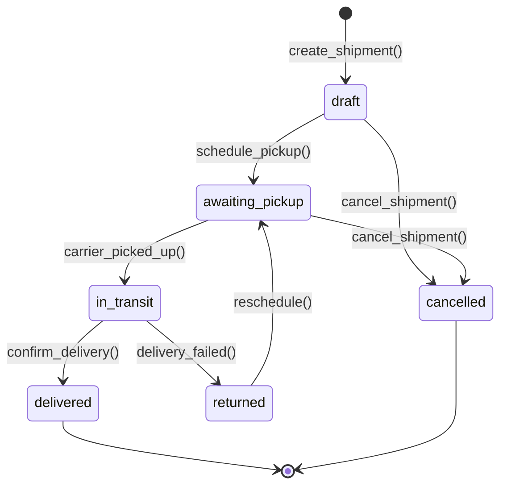
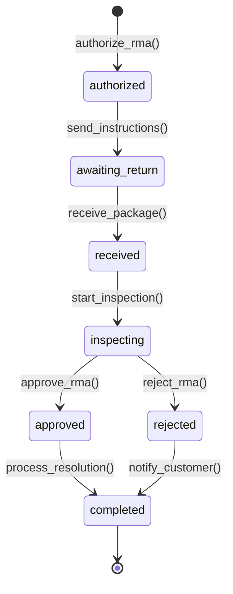
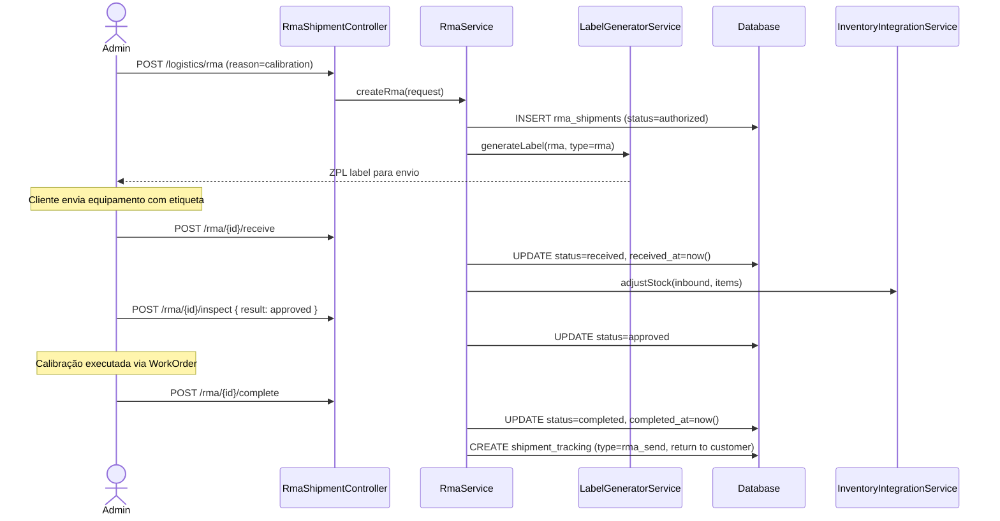

# Modulo: Logistics (WMS/TMS Leve & Logística Reversa)

> **[AI_RULE]** Especificações arquiteturais da fase de Expansão. Módulo Logistics.

---

## 1. Visão Geral

Controle avançado de movimentação de mercadorias. Inclui impressão de Etiquetas ZPL/Zebra para Inbound/Outbound e geração de códigos de rastreamento de transportadoras ou Correios para instrumentos no processo de Calibração (RMA shipment).

**Escopo Funcional:**

- Gestão de remessas (Shipments) de entrada e saída
- Controle de RMA (Return Merchandise Authorization) para logística reversa
- Geração e impressão de etiquetas ZPL/Zebra
- Integração com transportadoras (Correios, Jadlog, etc.) para rastreamento
- Picking e packing otimizados para kits de instrumentos
- Dashboard logístico com volume de movimentações e SLA de entrega

---

## 2. Entidades (Models)

### 2.1 ShipmentTracking

| Campo | Tipo | Regra |
|-------|------|-------|
| `id` | bigint (PK) | Auto-increment |
| `tenant_id` | bigint (FK) | Obrigatório, isolamento multi-tenant |
| `code` | string(50) | Código único por tenant, prefixo `SH-`, padding 5 |
| `type` | enum | `inbound`, `outbound`, `rma_return`, `rma_send` |
| `status` | enum | `draft`, `awaiting_pickup`, `in_transit`, `delivered`, `returned`, `cancelled` |
| `carrier` | enum null | `correios`, `jadlog`, `azul_cargo`, `transportadora_propria`, `retirada_balcao`, `other` |
| `tracking_code` | string(100) null | Código de rastreio da transportadora |
| `awb_number` | string(50) null | Número do Air Waybill (carga aérea) |
| `origin_address` | json | Endereço de origem |
| `destination_address` | json | Endereço de destino |
| `contact_id` | bigint (FK → contacts) null | Cliente ou fornecedor |
| `work_order_id` | bigint (FK → work_orders) null | OS vinculada |
| `rma_shipment_id` | bigint (FK → rma_shipments) null | RMA vinculado |
| `weight_kg` | decimal(10,3) null | Peso total |
| `dimensions` | json null | `{"length_cm":30,"width_cm":20,"height_cm":15}` |
| `items_count` | integer | Número de itens |
| `estimated_delivery_at` | date null | Previsão de entrega |
| `shipped_at` | timestamp null | Data de envio |
| `delivered_at` | timestamp null | Data de entrega efetiva |
| `delivery_proof` | json null | Comprovante: `{"signed_by":"João","photo_url":"..."}` |
| `notes` | text null | Observações |
| `created_by` | bigint (FK → users) | Criador |
| `created_at` | timestamp | — |
| `updated_at` | timestamp | — |

### 2.2 LogisticsLabel

| Campo | Tipo | Regra |
|-------|------|-------|
| `id` | bigint (PK) | Auto-increment |
| `tenant_id` | bigint (FK) | Obrigatório |
| `shipment_tracking_id` | bigint (FK) | Remessa vinculada |
| `label_type` | enum | `shipping`, `inbound_receiving`, `item_identification`, `rma` |
| `format` | enum | `zpl`, `pdf`, `png` |
| `content` | text | Conteúdo ZPL ou path do arquivo |
| `barcode_data` | string(255) | Dados do código de barras/QR Code |
| `printed_at` | timestamp null | Data/hora de impressão |
| `printer_name` | string(100) null | Impressora utilizada |
| `created_at` | timestamp | — |

### 2.3 RmaShipment

| Campo | Tipo | Regra |
|-------|------|-------|
| `id` | bigint (PK) | Auto-increment |
| `tenant_id` | bigint (FK) | Obrigatório |
| `code` | string(50) | Código único, prefixo `RMA-`, padding 5 |
| `status` | enum | `authorized`, `awaiting_return`, `received`, `inspecting`, `approved`, `rejected`, `completed` |
| `contact_id` | bigint (FK → contacts) | Cliente solicitante |
| `work_order_id` | bigint (FK → work_orders) null | OS de origem |
| `reason` | enum | `calibration`, `repair`, `warranty`, `exchange`, `return` |
| `items` | json | `[{"equipment_id":5,"serial":"SN001","description":"Balança 500g"}]` |
| `return_tracking_code` | string(100) null | Rastreio do retorno ao cliente |
| `send_tracking_code` | string(100) null | Rastreio do envio pelo cliente |
| `authorized_by` | bigint (FK → users) | Quem autorizou o RMA |
| `inspection_notes` | text null | Notas da inspeção |
| `authorized_at` | timestamp | Data da autorização |
| `received_at` | timestamp null | Data do recebimento |
| `completed_at` | timestamp null | Data de conclusão |
| `created_at` | timestamp | — |
| `updated_at` | timestamp | — |

---

## 3. Ciclos de Vida (State Machines)

### 3.1 Ciclo da Remessa (ShipmentTracking)



### 3.2 Ciclo do RMA



---

## 4. Guard Rails de Negócio `[AI_RULE]`

> **[AI_RULE_CRITICAL] RMA Requer Autorização**
> Nenhum RMA pode ser aberto sem `authorized_by`. A autorização valida se o item está no prazo de garantia, se há OS vinculada e se o motivo é compatível com o tipo de equipamento.

> **[AI_RULE_CRITICAL] Rastreamento Obrigatório**
> Toda remessa com `type=outbound` ou `type=rma_send` que usa transportadora (não `retirada_balcao`) DEVE ter `tracking_code` preenchido antes de transicionar para `in_transit`.

> **[AI_RULE] Geração ZPL**
> O `LabelGeneratorService` recebe o `ShipmentTracking` e gera o ZPL com: dados do remetente, destinatário, código de barras do tracking_code, peso e dimensões. Templates ZPL são configuráveis por tenant em `LogisticsLabel.format=zpl`.

> **[AI_RULE] Integração com Inventory**
> Ao confirmar `delivered` de uma remessa `inbound`, o `InventoryIntegrationService` ajusta o saldo de estoque (entrada). Ao confirmar envio `outbound`, baixa o saldo (saída via picking).

> **[AI_RULE] Numeração Sequencial**
> `ShipmentTracking` usa prefixo `SH-` e `RmaShipment` usa prefixo `RMA-`, ambos via `NumberingSequence` por tenant.

---

## 5. Comportamento Integrado (Cross-Domain)

| Direção | Módulo | Integração |
|---------|--------|------------|
| ← | **Quality** | Envio/recebimento atrelado à Calibração e RMA |
| → | **Inventory** | Baixa de saldo em picking/packing e entrada em receiving |
| ← | **WorkOrders** | OS gera remessa outbound de devolutiva ao cliente |
| → | **Fiscal** | Emissão de CTE para transporte quando aplicável |
| → | **Portal** | Cliente rastreia remessas pelo portal |

---

## 6. Contratos de API (JSON)

### 6.1 Criar Remessa

```http
POST /api/v1/logistics/shipments
Authorization: Bearer {admin-token}
Content-Type: application/json
```

**Request:**

```json
{
  "type": "outbound",
  "carrier": "correios",
  "contact_id": 42,
  "work_order_id": 150,
  "destination_address": {"street": "Rua das Flores, 123", "city": "São Paulo", "state": "SP", "zip": "01001-000"},
  "weight_kg": 2.5,
  "dimensions": {"length_cm": 30, "width_cm": 20, "height_cm": 15},
  "items_count": 2,
  "notes": "Instrumentos calibrados — retorno ao cliente"
}
```

### 6.2 Criar RMA

```http
POST /api/v1/logistics/rma
Authorization: Bearer {admin-token}
Content-Type: application/json
```

**Request:**

```json
{
  "contact_id": 42,
  "work_order_id": 150,
  "reason": "calibration",
  "items": [{"equipment_id": 5, "serial": "SN-0042", "description": "Balança Mettler 500g"}]
}
```

### 6.3 Imprimir Etiqueta

```http
POST /api/v1/logistics/shipments/{id}/label
Authorization: Bearer {admin-token}
Content-Type: application/json
```

**Request:**

```json
{
  "format": "zpl",
  "label_type": "shipping"
}
```

### 6.4 Dashboard Logístico

```http
GET /api/v1/logistics/dashboard
Authorization: Bearer {admin-token}
```

---

## 7. Permissões (RBAC)

| Permissão | Descrição |
|-----------|-----------|
| `logistics.shipment.view` | Visualizar remessas |
| `logistics.shipment.create` | Criar remessas |
| `logistics.shipment.update` | Atualizar status de remessa |
| `logistics.rma.view` | Visualizar RMAs |
| `logistics.rma.create` | Criar/autorizar RMA |
| `logistics.rma.inspect` | Inspecionar e aprovar/rejeitar RMA |
| `logistics.label.print` | Imprimir etiquetas |
| `logistics.dashboard.view` | Dashboard logístico |

---

## 8. Rotas da API

### Shipments (`auth:sanctum` + `check.tenant`)

| Método | Rota | Controller | Ação |
|--------|------|------------|------|
| `GET` | `/api/v1/logistics/shipments` | `ShipmentTrackingController@index` | Listar remessas |
| `POST` | `/api/v1/logistics/shipments` | `ShipmentTrackingController@store` | Criar remessa |
| `GET` | `/api/v1/logistics/shipments/{id}` | `ShipmentTrackingController@show` | Detalhes |
| `PUT` | `/api/v1/logistics/shipments/{id}` | `ShipmentTrackingController@update` | Atualizar |
| `POST` | `/api/v1/logistics/shipments/{id}/transition` | `ShipmentTrackingController@transition` | Transição de status |
| `POST` | `/api/v1/logistics/shipments/{id}/label` | `ShipmentTrackingController@generateLabel` | Gerar etiqueta |

### RMA (`auth:sanctum` + `check.tenant`)

| Método | Rota | Controller | Ação |
|--------|------|------------|------|
| `GET` | `/api/v1/logistics/rma` | `RmaShipmentController@index` | Listar RMAs |
| `POST` | `/api/v1/logistics/rma` | `RmaShipmentController@store` | Criar RMA |
| `GET` | `/api/v1/logistics/rma/{id}` | `RmaShipmentController@show` | Detalhes |
| `POST` | `/api/v1/logistics/rma/{id}/receive` | `RmaShipmentController@receive` | Registrar recebimento |
| `POST` | `/api/v1/logistics/rma/{id}/inspect` | `RmaShipmentController@inspect` | Resultado da inspeção |
| `POST` | `/api/v1/logistics/rma/{id}/complete` | `RmaShipmentController@complete` | Concluir RMA |

### Dashboard

| Método | Rota | Controller | Ação |
|--------|------|------------|------|
| `GET` | `/api/v1/logistics/dashboard` | `ShipmentTrackingController@dashboard` | Dashboard logístico |

---

## 9. Form Requests (Validação de Entrada)

### 9.1 StoreShipmentRequest

**Classe**: `App\Http\Requests\Logistics\StoreShipmentRequest`

```php
public function rules(): array
{
    return [
        'type'                => ['required', 'string', 'in:inbound,outbound,rma_return,rma_send'],
        'carrier'             => ['nullable', 'string', 'in:correios,jadlog,azul_cargo,transportadora_propria,retirada_balcao,other'],
        'contact_id'          => ['nullable', 'integer', 'exists:contacts,id'],
        'work_order_id'       => ['nullable', 'integer', 'exists:work_orders,id'],
        'destination_address' => ['required', 'array'],
        'weight_kg'           => ['nullable', 'numeric', 'min:0.001'],
        'dimensions'          => ['nullable', 'array'],
        'items_count'         => ['required', 'integer', 'min:1'],
        'notes'               => ['nullable', 'string', 'max:2000'],
    ];
}
```

### 9.2 StoreRmaShipmentRequest

**Classe**: `App\Http\Requests\Logistics\StoreRmaShipmentRequest`

```php
public function rules(): array
{
    return [
        'contact_id'    => ['required', 'integer', 'exists:contacts,id'],
        'work_order_id' => ['nullable', 'integer', 'exists:work_orders,id'],
        'reason'        => ['required', 'string', 'in:calibration,repair,warranty,exchange,return'],
        'items'         => ['required', 'array', 'min:1'],
        'items.*.equipment_id' => ['required', 'integer', 'exists:equipment,id'],
        'items.*.serial'       => ['nullable', 'string', 'max:100'],
        'items.*.description'  => ['required', 'string', 'max:255'],
    ];
}
```

---

## 10. Diagramas de Sequência

### 10.1 Fluxo: RMA de Calibração (Ida e Volta)



---

## 11. Testes Requeridos (BDD)

```gherkin
Funcionalidade: Logística e RMA

  Cenário: Criar remessa outbound com sucesso
    Quando envio POST /logistics/shipments com type=outbound e carrier=correios
    Então a remessa é criada com status "draft" e código "SH-XXXXX"

  Cenário: Tracking obrigatório para transição in_transit
    Dado que tenho remessa outbound com carrier=correios
    Quando envio transição para "in_transit" sem tracking_code
    Então recebo status 422

  Cenário: Criar e processar RMA de calibração
    Quando envio POST /logistics/rma com reason=calibration e items
    Então RMA é autorizado com status "authorized"
    Quando recebo o pacote e inspecciono
    Então status progride para "inspecting" → "approved" → "completed"

  Cenário: Geração de etiqueta ZPL
    Dado que tenho uma remessa criada
    Quando envio POST /shipments/{id}/label com format=zpl
    Então recebo LogisticsLabel com conteúdo ZPL válido

  Cenário: Integração com estoque na entrega inbound
    Dado que tenho remessa inbound com items
    Quando confirmo delivery
    Então saldo do estoque é ajustado (entrada)

  Cenário: Isolamento multi-tenant
    Dado que existem remessas do tenant_id=1 e tenant_id=2
    Quando admin do tenant_id=1 lista remessas
    Então recebe apenas remessas do tenant_id=1
```

---

## 12. Inventário Completo do Código

> **[AI_RULE]** Todos os artefatos listados DEVEM ser criados.

### Controllers (2 — namespace `App\Http\Controllers\Api\V1`)

| Controller | Arquivo | Métodos Públicos |
|------------|---------|-----------------|
| **ShipmentTrackingController** | `Logistics/ShipmentTrackingController.php` | `index`, `store`, `show`, `update`, `transition`, `generateLabel`, `dashboard` |
| **RmaShipmentController** | `Logistics/RmaShipmentController.php` | `index`, `store`, `show`, `receive`, `inspect`, `complete` |

### Models (3 — namespace `App\Models`)

| Model | Tabela | Descrição |
|-------|--------|-----------|
| `ShipmentTracking` | `shipment_trackings` | Controle de remessas |
| `LogisticsLabel` | `logistics_labels` | Etiquetas ZPL/PDF |
| `RmaShipment` | `rma_shipments` | RMA de logística reversa |

### Services (3 — namespace `App\Services`)

| Service | Métodos Públicos |
|---------|-----------------|
| `RmaService` | `createRma()`, `receive()`, `inspect()`, `complete()` |
| `LabelGeneratorService` | `generateZpl(ShipmentTracking)`, `generatePdf()` |
| `InventoryIntegrationService` | `adjustStock(type, items)` |

### Form Requests (4 — namespace `App\Http\Requests\Logistics`)

| FormRequest | Endpoint |
|-------------|----------|
| `StoreShipmentRequest` | `POST /logistics/shipments` |
| `UpdateShipmentRequest` | `PUT /logistics/shipments/{id}` |
| `TransitionShipmentRequest` | `POST /logistics/shipments/{id}/transition` |
| `StoreRmaShipmentRequest` | `POST /logistics/rma` |

---

---

## Edge Cases e Tratamento de Erros

| Cenário | Comportamento Esperado | Regra |
| --------- | ---------------------- | ------- |
| **Rota circular** (ponto A → B → A no mesmo planejamento) | Validar no `FormRequest` ao criar rota. Detectar duplicatas de endereço na sequência. Se circular: alertar com warning (não bloquear — pode ser intencional para coleta/retorno). Logar `circular_route_detected`. | `[AI_RULE]` |
| **Veículo indisponível** (veículo atribuído entra em manutenção durante rota) | Marcar rota como `vehicle_unavailable`. Sugerir veículos alternativos com capacidade compatível. Notificar coordenador de logística. Não cancelar automaticamente — aguardar decisão humana. | `[AI_RULE]` |
| **Entrega parcial** (cliente recusa parte dos itens) | Registrar `partial_delivery` com lista de itens recusados e motivo. Gerar `ReturnOrder` automático para itens recusados. Atualizar estoque somente para itens aceitos. Recalcular fatura. | `[AI_RULE_CRITICAL]` |
| **Endereço não localizado** (GPS não encontra coordenadas) | Marcar ponto como `geocoding_failed`. Permitir entrada manual de coordenadas. Se rota tem ponto sem coordenadas: alertar motorista mas não bloquear partida. Logar para correção posterior. | `[AI_RULE]` |
| **Capacidade excedida** (soma dos itens > capacidade do veículo) | Validar no planejamento de rota. Se exceder: retornar 422 `vehicle_capacity_exceeded` com diferença. Sugerir divisão em 2 rotas ou veículo maior. Nunca permitir partida com sobrecarga. | `[AI_RULE]` |
| **Janela de entrega expirada** (chegada após horário limite do cliente) | Registrar `delivery_window_missed` com delta de atraso. Notificar cliente automaticamente. Reagendar para próxima janela disponível. Não contabilizar como falha do motorista se atraso < 15min. | `[AI_RULE]` |

---

## Checklist de Implementação

- [ ] Migration `create_shipment_trackings_table` com campos completos e tenant_id
- [ ] Migration `create_logistics_labels_table`
- [ ] Migration `create_rma_shipments_table`
- [ ] Model `ShipmentTracking` com fillable, casts (json), relationships
- [ ] Model `LogisticsLabel` com fillable, relationships
- [ ] Model `RmaShipment` com fillable, casts (json), relationships
- [ ] `RmaService` com ciclo completo de autorização → recebimento → inspeção → conclusão
- [ ] `LabelGeneratorService` com geração ZPL e PDF
- [ ] `InventoryIntegrationService` com ajuste de estoque em inbound/outbound
- [ ] `ShipmentTrackingController` com CRUD + transições + label + dashboard
- [ ] `RmaShipmentController` com CRUD + receive + inspect + complete
- [ ] 4 Form Requests conforme especificação
- [ ] Rotas em `routes/api.php` com middleware
- [ ] Permissões RBAC no seeder
- [ ] Testes Feature: CRUD, transições, RMA lifecycle, ZPL, integração inventory, isolamento
- [ ] Frontend React: Lista de remessas, formulário de RMA, impressão de etiquetas, dashboard
