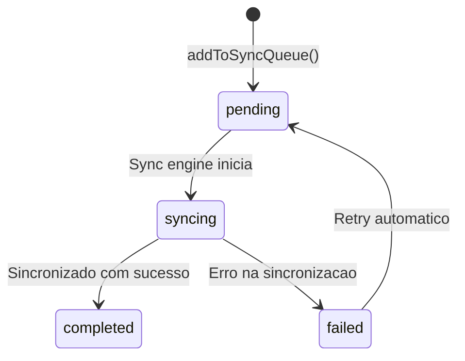

# Modulo: Mobile & PWA

> **[AI_RULE]** Documentacao oficial do modulo Mobile. Toda entidade, campo, estado e regra aqui descritos sao extraidos diretamente do codigo-fonte e devem ser respeitados por qualquer agente de IA.

---

## 1. Visao Geral

O modulo Mobile fornece a infraestrutura para o aplicativo PWA (Progressive Web App) e funcionalidades exclusivas de dispositivos moveis: preferencias do usuario, fila de sincronizacao offline, notificacoes interativas, leitura de codigo de barras, assinatura digital, impressao termica, relatorio por voz, configuracao biometrica, anotacoes em foto, leitura termica, modo quiosque e regioes de mapa offline.

### Principios Fundamentais

- **Offline-first**: fila de sincronizacao (`sync_queue`) garante operacao sem internet
- **Multi-modal**: suporta voz, foto, assinatura, biometria e leitura termica
- **Quiosque**: modo dedicado para terminais fixos com auto-logout e PIN
- **Cross-domain**: sync queue alimenta WorkOrders, HR (ponto) e Inventory

---

## 2. Entidades (Models) — Campos Completos

### 2.1 `UserPreference` (tabela: `user_preferences`)

Preferencias do usuario no app mobile.

| Campo | Tipo | Descricao |
|---|---|---|
| `user_id` | bigint FK | Usuario (unique) |
| `dark_mode` | boolean | Modo escuro |
| `language` | string | Idioma (ex: `pt_BR`) |
| `notifications` | boolean | Notificacoes habilitadas |
| `updated_at` | datetime | Ultima atualizacao |

### 2.2 `SyncQueueItem` (tabela: `sync_queue`)

Item na fila de sincronizacao offline.

| Campo | Tipo | Descricao |
|---|---|---|
| `tenant_id` | bigint | Tenant |
| `user_id` | bigint FK | Usuario |
| `entity_type` | string | Tipo da entidade (ex: `work_order`, `time_clock`) |
| `entity_id` | bigint | ID da entidade (nullable para criacao) |
| `action` | string | Acao (`create`, `update`, `delete`) |
| `payload` | json | Dados a sincronizar |
| `status` | string | `pending`, `syncing`, `completed`, `failed` |
| `created_at` | datetime | Data de criacao |

### 2.3 `MobileNotification` (tabela: `mobile_notifications`)

Notificacao interativa no app.

| Campo | Tipo | Descricao |
|---|---|---|
| `user_id` | bigint FK | Usuario destinatario |
| `title` | string | Titulo |
| `body` | text | Corpo da notificacao |
| `action_type` | string | Tipo de acao disponivel |
| `response_action` | string | Acao escolhida pelo usuario |
| `responded_at` | datetime | Data/hora da resposta |
| `created_at` | datetime | Data de criacao |

### 2.4 `DigitalSignature` (tabela: `digital_signatures`)

Assinatura digital capturada no app.

| Campo | Tipo | Descricao |
|---|---|---|
| `tenant_id` | bigint | Tenant |
| `work_order_id` | bigint FK | OS associada |
| `signature_data` | text | Dados da assinatura (base64/SVG) |
| `signer_name` | string | Nome do assinante |
| `signer_role` | string | Papel (`customer`, `technician`, etc.) |
| `signed_at` | datetime | Data/hora da assinatura |
| `ip_address` | string | IP do dispositivo |
| `created_at` | datetime | Data de criacao |

### 2.5 `PrintJob` (tabela: `print_jobs`)

Job de impressao (termica, etiqueta, etc).

| Campo | Tipo | Descricao |
|---|---|---|
| `tenant_id` | bigint | Tenant |
| `user_id` | bigint FK | Usuario |
| `document_type` | string | Tipo do documento |
| `document_id` | bigint | ID do documento |
| `printer_type` | string | Tipo de impressora |
| `copies` | integer | Numero de copias (default: 1) |
| `status` | string | `queued`, `printing`, `completed`, `failed` |
| `created_at` | datetime | Data de criacao |

### 2.6 `VoiceReport` (tabela: `voice_reports`)

Relatorio por voz com transcricao.

| Campo | Tipo | Descricao |
|---|---|---|
| `tenant_id` | bigint | Tenant |
| `user_id` | bigint FK | Usuario |
| `work_order_id` | bigint FK | OS associada |
| `transcription` | text | Transcricao do audio |
| `duration_seconds` | integer | Duracao em segundos |
| `language` | string | Idioma (default: `pt_BR`) |
| `created_at` | datetime | Data de criacao |

### 2.7 `BiometricConfig` (tabela: `biometric_configs`)

Configuracao biometrica do usuario.

| Campo | Tipo | Descricao |
|---|---|---|
| `user_id` | bigint FK | Usuario (unique) |
| `enabled` | boolean | Biometria habilitada |
| `type` | string | Tipo (`fingerprint`, `face`, etc.) |
| `updated_at` | datetime | Ultima atualizacao |

### 2.8 `PhotoAnnotation` (tabela: `photo_annotations`)

Anotacao sobre foto de campo.

| Campo | Tipo | Descricao |
|---|---|---|
| `tenant_id` | bigint | Tenant |
| `work_order_id` | bigint FK | OS associada |
| `user_id` | bigint FK | Usuario |
| `image_path` | string | Caminho da imagem |
| `annotations` | json | Dados das anotacoes (posicao, texto, cor) |
| `created_at` | datetime | Data de criacao |

### 2.9 `ThermalReading` (tabela: `thermal_readings`)

Leitura termica de equipamento em campo.

| Campo | Tipo | Descricao |
|---|---|---|
| `tenant_id` | bigint | Tenant |
| `work_order_id` | bigint FK | OS associada |
| `equipment_id` | bigint FK | Equipamento medido |
| `temperature` | decimal | Temperatura medida |
| `unit` | string | Unidade (`celsius`, `fahrenheit`) |
| `image_path` | string | Imagem termica (nullable) |
| `notes` | text | Observacoes |
| `latitude` | decimal | Latitude GPS |
| `longitude` | decimal | Longitude GPS |
| `measured_by` | bigint FK | Usuario que mediu |
| `measured_at` | datetime | Data/hora da medicao |
| `created_at` | datetime | Data de criacao |

### 2.10 `KioskConfig` (tabela: `kiosk_configs`)

Configuracao do modo quiosque por tenant.

| Campo | Tipo | Descricao |
|---|---|---|
| `tenant_id` | bigint | Tenant (unique) |
| `enabled` | boolean | Modo quiosque ativo |
| `allowed_pages` | json | Paginas permitidas (ex: `["dashboard", "work-orders"]`) |
| `idle_timeout_seconds` | integer | Tempo de inatividade (default: 300s) |
| `auto_logout` | boolean | Auto-logout habilitado |
| `show_header` | boolean | Mostrar cabecalho |
| `pin_code` | string | PIN de acesso (bcrypt hash) |
| `updated_at` | datetime | Ultima atualizacao |

### 2.11 `OfflineMapRegion` (tabela: `offline_map_regions`)

Regiao de mapa disponivel para download offline.

| Campo | Tipo | Descricao |
|---|---|---|
| `tenant_id` | bigint | Tenant |
| `name` | string | Nome da regiao |
| `bounds` | json | Limites geograficos (north, south, east, west) |
| `zoom_min` | integer | Zoom minimo |
| `zoom_max` | integer | Zoom maximo |
| `estimated_size_mb` | integer | Tamanho estimado em MB |
| `is_active` | boolean | Regiao ativa |
| `updated_at` | datetime | Ultima atualizacao |

---

## 3. Maquina de Estados — SyncQueue

> **[AI_RULE]** Status sempre em ingles lowercase. Itens `completed` sao filtrados da listagem.

| De | Para | Acao | Trigger |
|---|---|---|---|
| `pending` | `syncing` | Sync engine processa item | Automatico (conectividade) |
| `syncing` | `completed` | Dados persistidos no servidor | Sucesso |
| `syncing` | `failed` | Erro de rede/validacao | Falha |
| `failed` | `pending` | Re-enfileirado para retry | Automatico |

> **[AI_RULE_CRITICAL]** Offline sync DEVE resolver conflitos com estratégia "server wins" para dados de tenant. Client NUNCA sobrescreve dado mais recente do servidor.

> **[AI_RULE]** Dados offline DEVEM ser criptografados no device (AES-256). Chave derivada do token do usuário.

> **[AI_RULE]** Sync retry DEVE usar backoff exponencial: 1s, 2s, 4s, 8s, max 60s.

> **[AI_RULE]** Fila de sync DEVE ser processada na ordem FIFO. Itens falhados vão para fila de dead-letter após 5 tentativas.

---

## 4. Endpoints

> **[AI_RULE]** Todos os endpoints requerem autenticacao. Tenant isolado via `auth()->user()->current_tenant_id`.

### 4.1 Preferencias

| Metodo | Rota | Controller | Descricao |
|---|---|---|---|
| `GET` | `/api/v1/mobile/preferences` | `MobileController@userPreferences` | Obter preferencias do usuario |
| `PUT` | `/api/v1/mobile/preferences` | `MobileController@updatePreferences` | Atualizar preferencias |

### 4.2 Fila de Sincronizacao

| Metodo | Rota | Controller | Descricao |
|---|---|---|---|
| `GET` | `/api/v1/mobile/sync-queue` | `MobileController@syncQueue` | Listar itens pendentes/falhados na fila |
| `POST` | `/api/v1/mobile/sync-queue` | `MobileController@addToSyncQueue` | Adicionar item a fila de sincronizacao |

### 4.3 Notificacoes Interativas

| Metodo | Rota | Controller | Descricao |
|---|---|---|---|
| `GET` | `/api/v1/mobile/notifications` | `MobileController@interactiveNotifications` | Listar ultimas 50 notificacoes |
| `POST` | `/api/v1/mobile/notifications/{id}/respond` | `MobileController@respondToNotification` | Responder a notificacao (registrar acao) |

### 4.4 Codigo de Barras

| Metodo | Rota | Controller | Descricao |
|---|---|---|---|
| `GET` | `/api/v1/mobile/barcode-lookup` | `MobileController@barcodeLookup` | Buscar produto por barcode, SKU ou serial_number |

### 4.5 Assinatura Digital

| Metodo | Rota | Controller | Descricao |
|---|---|---|---|
| `POST` | `/api/v1/mobile/signature` | `MobileController@storeSignature` | Registrar assinatura digital (base64 + metadata) |

### 4.6 Impressao

| Metodo | Rota | Controller | Descricao |
|---|---|---|---|
| `GET` | `/api/v1/mobile/print-jobs` | `MobileController@printJobs` | Listar ultimos 20 jobs de impressao |
| `POST` | `/api/v1/mobile/print-jobs` | `MobileController@createPrintJob` | Criar job de impressao |

### 4.7 Relatorio por Voz

| Metodo | Rota | Controller | Descricao |
|---|---|---|---|
| `POST` | `/api/v1/mobile/voice-report` | `MobileController@storeVoiceReport` | Registrar relatorio por voz com transcricao |

### 4.8 Biometria

| Metodo | Rota | Controller | Descricao |
|---|---|---|---|
| `GET` | `/api/v1/mobile/biometric` | `MobileController@biometricConfig` | Obter configuracao biometrica |
| `PUT` | `/api/v1/mobile/biometric` | `MobileController@updateBiometricConfig` | Atualizar configuracao biometrica |

### 4.9 Foto com Anotacao

| Metodo | Rota | Controller | Descricao |
|---|---|---|---|
| `POST` | `/api/v1/mobile/photo-annotation` | `MobileController@storePhotoAnnotation` | Salvar foto com anotacoes |

### 4.10 Leitura Termica

| Metodo | Rota | Controller | Descricao |
|---|---|---|---|
| `POST` | `/api/v1/mobile/thermal-reading` | `MobileController@storeThermalReading` | Registrar leitura termica com geolocalizacao |

### 4.11 Modo Quiosque

| Metodo | Rota | Controller | Descricao |
|---|---|---|---|
| `GET` | `/api/v1/mobile/kiosk` | `MobileController@kioskConfig` | Obter configuracao do modo quiosque |
| `PUT` | `/api/v1/mobile/kiosk` | `MobileController@updateKioskConfig` | Atualizar configuracao do quiosque (PIN com bcrypt) |

### 4.12 Mapas Offline

| Metodo | Rota | Controller | Descricao |
|---|---|---|---|
| `GET` | `/api/v1/mobile/offline-maps` | `MobileController@offlineMapRegions` | Listar regioes de mapa disponíveis para download offline |

---

## 5. Regras Cross-Domain

> **[AI_RULE]** A fila de sincronizacao alimenta multiplos modulos. Assinaturas e fotos vinculam-se a WorkOrders.

| Modulo Destino | Integracao | Descricao |
|---|---|---|
| WorkOrders | sync_queue + signature + photo + voice | Criacao/atualizacao offline de OS, assinatura digital, fotos anotadas, relatorios por voz |
| HR | sync_queue (time_clock) | Registro de ponto offline sincronizado ao reconectar |
| Inventory | barcode_lookup + sync_queue | Leitura de codigo de barras para consumo de materiais |
| Lab | thermal_reading | Leituras termicas vinculadas a equipamentos calibrados |

---

## 6. Observabilidade

### Metricas

| Metrica | Descricao | Threshold |
|---|---|---|
| `mobile.sync_queue_pending` | Itens pendentes na fila | > 100 → verificar conectividade |
| `mobile.sync_queue_failed` | Itens com falha na fila | > 10 → investigar erros |
| `mobile.signature_count` | Assinaturas capturadas/dia | Metrica de adocao |
| `mobile.thermal_readings` | Leituras termicas/dia | Metrica de uso em campo |

---

## Fluxos Relacionados

| Fluxo | Descricao |
|-------|-----------|
| [PWA Offline Sync](file:///c:/PROJETOS/sistema/docs/fluxos/PWA-OFFLINE-SYNC.md) | Processo documentado em `docs/fluxos/PWA-OFFLINE-SYNC.md` |
| [Tecnico em Campo](file:///c:/PROJETOS/sistema/docs/fluxos/TECNICO-EM-CAMPO.md) | Processo documentado em `docs/fluxos/TECNICO-EM-CAMPO.md` |
| [Operacao Diaria](file:///c:/PROJETOS/sistema/docs/fluxos/OPERACAO-DIARIA.md) | Processo documentado em `docs/fluxos/OPERACAO-DIARIA.md` |

---

## Inventario Completo do Codigo

> **[AI_RULE]** Secao gerada automaticamente a partir do codigo-fonte. Lista todos os artefatos reais do modulo Mobile & PWA no repositorio.

### Backend Controller

**Arquivo:** `backend/app/Http/Controllers/Api/V1/MobileController.php`

| Metodo | Descricao |
|--------|-----------|
| `userPreferences` | Obter preferencias do usuario |
| `updatePreferences` | Atualizar preferencias |
| `syncQueue` | Listar itens pendentes/falhados na fila |
| `addToSyncQueue` | Adicionar item a fila de sincronizacao |
| `interactiveNotifications` | Listar ultimas 50 notificacoes |
| `respondToNotification` | Responder a notificacao |
| `barcodeLookup` | Buscar produto por barcode/SKU/serial |
| `storeSignature` | Registrar assinatura digital |
| `printJobs` | Listar jobs de impressao |
| `createPrintJob` | Criar job de impressao |
| `storeVoiceReport` | Registrar relatorio por voz |
| `biometricConfig` | Obter config biometrica |
| `updateBiometricConfig` | Atualizar config biometrica |
| `storePhotoAnnotation` | Salvar foto com anotacoes |
| `storeThermalReading` | Registrar leitura termica |
| `kioskConfig` | Obter config do quiosque |
| `updateKioskConfig` | Atualizar config do quiosque |
| `offlineMapRegions` | Listar regioes de mapa offline |

### Frontend — Hooks Completos (57 arquivos)

> Inventario categorizado de todos os hooks em `frontend/src/hooks/`.

#### Logica de Negocio (Business Logic)

| Hook | Arquivo | Descricao |
|------|---------|-----------|
| `useCalibrationCalculations` | `useCalibrationCalculations.ts` | Calculos de calibracao (incerteza, erro, etc.) |
| `useCalibrationPrefill` | `useCalibrationPrefill.ts` | Pre-preenchimento de dados de calibracao |
| `useCustomerPriceHistory` | `useCustomerPriceHistory.ts` | Historico de precos por cliente |
| `useExpenseCategories` | `useExpenseCategories.ts` | Categorias de despesas |
| `useFuelingLogs` | `useFuelingLogs.ts` | Logs de abastecimento de frota |
| `usePriceGate` | `usePriceGate.ts` | Controle de gate de preco |
| `useEmailAccounts` | `useEmailAccounts.ts` | CRUD de contas de email |
| `useEmailRules` | `useEmailRules.ts` | CRUD de regras de email |
| `useEmails` | `useEmails.ts` | Inbox, leitura, acoes de email |
| `useBenefits` | `useBenefits.ts` | Beneficios de RH |
| `useRecruitment` | `useRecruitment.ts` | Recrutamento e selecao |
| `useSkills` | `useSkills.ts` | Competencias e habilidades |
| `useTechAlerts` | `useTechAlerts.ts` | Alertas do tecnico |
| `useAuvoExport` | `useAuvoExport.ts` | Exportacao para Auvo |
| `useAuvoImport` | `useAuvoImport.ts` | Importacao do Auvo |
| `useInmetro` | `useInmetro.ts` | Integracao Inmetro |
| `useInmetroAdvanced` | `useInmetroAdvanced.ts` | Funcoes avancadas Inmetro |
| `useInmetroAutoSync` | `useInmetroAutoSync.ts` | Sync automatico Inmetro |

#### PWA & Infraestrutura

| Hook | Arquivo | Descricao |
|------|---------|-----------|
| `usePWA` | `usePWA.ts` | Instalacao PWA, update, beforeinstallprompt |
| `usePushNotifications` | `usePushNotifications.ts` | Web Push API — solicitar permissao e assinar |
| `usePushSubscription` | `usePushSubscription.ts` | Gerenciar subscription push |
| `useDarkMode` | `useDarkMode.ts` | Toggle modo escuro |
| `useCurrentTenant` | `useCurrentTenant.ts` | Tenant atual do usuario |
| `useOrganization` | `useOrganization.ts` | Dados da organizacao |
| `useDebounce` | `useDebounce.ts` | Debounce generico |
| `useWebSocket` | `useWebSocket.ts` | Conexao WebSocket (Laravel Echo) |
| `useAppMode` | `useAppMode.ts` | Modo do app (tech, admin, tv, portal) |

#### Offline & Sync

| Hook | Arquivo | Descricao |
|------|---------|-----------|
| `useOfflineCache` | `useOfflineCache.ts` | Cache offline com IndexedDB |
| `useOfflineMutation` | `useOfflineMutation.ts` | Mutations offline enfileiradas |
| `useOfflineStore` | `useOfflineStore.ts` | Zustand store para estado offline |
| `useSyncStatus` | `useSyncStatus.ts` | Status da sincronizacao (pending, syncing, error) |
| `useCrossTabSync` | `useCrossTabSync.ts` | Sync entre abas do navegador via BroadcastChannel |
| `usePrefetchCriticalData` | `usePrefetchCriticalData.ts` | Pre-fetch de dados criticos para offline |

#### Mobile Features

| Hook | Arquivo | Descricao |
|------|---------|-----------|
| `useBarcodeScanner` | `useBarcodeScanner.ts` | Leitura de codigo de barras via camera |
| `useBiometricAuth` | `useBiometricAuth.ts` | Autenticacao biometrica (WebAuthn) |
| `useBluetoothPrint` | `useBluetoothPrint.ts` | Impressao via Bluetooth |
| `useDisplacementTracking` | `useDisplacementTracking.ts` | Tracking de deslocamento GPS |
| `useKioskMode` | `useKioskMode.ts` | Modo quiosque (fullscreen, PIN, auto-logout) |
| `useLocationSharing` | `useLocationSharing.ts` | Compartilhamento de localizacao em tempo real |
| `useLowDataMode` | `useLowDataMode.ts` | Modo economia de dados |
| `useNetworkInfo` | `useNetworkInfo.ts` | Informacoes de rede (online/offline, tipo) |
| `usePhotoAnnotation` | `usePhotoAnnotation.ts` | Anotacoes em fotos de campo |
| `usePullToRefresh` | `usePullToRefresh.ts` | Pull-to-refresh nativo |
| `useSwipeGesture` | `useSwipeGesture.ts` | Gestos de swipe |
| `useThermalCamera` | `useThermalCamera.ts` | Leitura de camera termica |
| `useVoiceToText` | `useVoiceToText.ts` | Transcricao de voz (Web Speech API) |

#### Performance & Analytics

| Hook | Arquivo | Descricao |
|------|---------|-----------|
| `usePerformance` | `usePerformance.ts` | Metricas de performance (Core Web Vitals) |
| `useAIAnalytics` | `useAIAnalytics.ts` | Analytics com IA |

#### Integracao & Utilitarios

| Hook | Arquivo | Descricao |
|------|---------|-----------|
| `useCnpjLookup` | `useCnpjLookup.ts` | Consulta CNPJ via ReceitaWS |
| `useIbge` | `useIbge.ts` | Consulta API IBGE (estados, municipios) |
| `useViaCep` | `useViaCep.ts` | Consulta CEP via ViaCEP |
| `useChatStoreForward` | `useChatStoreForward.ts` | Forward de mensagens do chat |

#### TV Dashboard

| Hook | Arquivo | Descricao |
|------|---------|-----------|
| `useTvClock` | `useTvClock.ts` | Relogio para TV Dashboard |
| `useTvDashboard` | `useTvDashboard.ts` | Dados do dashboard TV |
| `useTvDesktopNotifications` | `useTvDesktopNotifications.ts` | Notificacoes desktop para TV |

### Frontend — Lib/API Client (41 arquivos em `frontend/src/lib/`)

#### Core

| Arquivo | Descricao |
|---------|-----------|
| `api.ts` | Cliente HTTP base (Axios) com interceptors, retry e refresh token |
| `api-health.ts` | Health check da API com fallback e retry |
| `constants.ts` | Constantes do sistema |
| `utils.ts` | Utilitarios gerais |
| `query-keys.ts` | Chaves do React Query centralizadas |
| `echo.ts` | Configuracao do Laravel Echo (WebSocket) |
| `sentry.ts` | Configuracao do Sentry (error tracking) |
| `notifications.ts` | Sistema de notificacoes |

#### Offline & Sync

| Arquivo | Descricao |
|---------|-----------|
| `syncEngine.ts` | Motor de sincronizacao offline — processa fila do IndexedDB, resolve conflitos (server-wins), backoff exponencial |
| `offlineDb.ts` | IndexedDB wrapper — armazena OS, checklist, catalogo para operacao offline |
| `cross-tab-sync.ts` | Sincronizacao entre abas via BroadcastChannel API |
| `compress-image.ts` | Compressao de imagens antes do upload (mobile) |

#### API Clients por Dominio

| Arquivo | Descricao |
|---------|-----------|
| `work-order-api.ts` | API client para Ordens de Servico |
| `work-order-create-schema.ts` | Schema de validacao para criacao de OS |
| `work-order-detail-utils.ts` | Utilitarios de detalhe da OS |
| `customer-api.ts` | API client para Clientes |
| `equipment-api.ts` | API client para Equipamentos |
| `equipment-display.ts` | Display helpers para equipamentos |
| `equipment-status.ts` | Status helpers para equipamentos |
| `equipment-utils.ts` | Utilitarios de equipamento |
| `financial-api.ts` | API client para Financeiro |
| `stock-api.ts` | API client para Estoque |
| `quote-api.ts` | API client para Orcamentos |
| `service-call-api.ts` | API client para Chamados |
| `service-call-normalizers.ts` | Normalizadores de chamados |
| `catalog-api.ts` | API client para Catalogo de produtos |
| `crm-api.ts` | API client para CRM |
| `crm-features-api.ts` | API client para features avancadas do CRM |
| `crm-field-api.ts` | API client para campos customizados do CRM |
| `hr-api.ts` | API client para RH |
| `mobile-api.ts` | API client para endpoints mobile |
| `ref-data-api.ts` | API client para dados de referencia |
| `calibration-utils.ts` | Utilitarios de calibracao |
| `standard-weight-utils.ts` | Utilitarios de pesos padrao |
| `cep-api.ts` | API client para CEP |
| `cep-utils.ts` | Utilitarios de CEP |
| `form-masks.ts` | Mascaras de formulario (CPF, CNPJ, telefone) |
| `form-utils.ts` | Utilitarios de formulario |
| `labelQr.ts` | Geracao de QR codes e etiquetas |
| `status-config.ts` | Configuracao de status (cores, labels) |
| `safe-array.ts` | Array helpers seguros (evitar undefined) |

### Frontend — Zustand Stores (5 arquivos)

| Arquivo | Store | Descricao |
|---------|-------|-----------|
| `frontend/src/stores/auth-store.ts` | `useAuthStore` | Autenticacao principal (token, user, tenant) |
| `frontend/src/stores/portal-auth-store.ts` | `usePortalAuthStore` | Autenticacao do portal do cliente |
| `frontend/src/stores/tech-timer-store.ts` | `useTechTimerStore` | Timer do tecnico em campo |
| `frontend/src/stores/tv-store.ts` | `useTvStore` | Estado do TV Dashboard |
| `frontend/src/stores/ui-store.ts` | `useUiStore` | Estado da UI (sidebar, theme, toast) |

### PWA Manifest

**Arquivo:** `frontend/public/manifest.json`

| Campo | Valor |
|-------|-------|
| `name` | Kalibrium Gestao |
| `short_name` | Kalibrium |
| `display` | standalone |
| `display_override` | window-controls-overlay, standalone, fullscreen |
| `theme_color` | #2563eb |
| `background_color` | #0f172a |
| `orientation` | any |
| `lang` | pt-BR |
| `categories` | business, productivity |
| `id` | kalibrium |

**Icons:** 48, 72, 96, 128, 144, 192, 256, 384, 512 (PNG) + 192/512 maskable + SVG

**Shortcuts (6):** Dashboard (`/`), OS (`/os`), CRM (`/crm`), Modo Tecnico (`/tech`), Calibracoes (`/calibracoes`), TV Dashboard (`/tv/dashboard`)

**Share Target:** `GET /share` com params `title`, `text`, `url`

### Push Notification Infrastructure

| Componente | Descricao |
|------------|-----------|
| `frontend/src/hooks/usePushNotifications.ts` | Solicita permissao e registra subscription via Web Push API |
| `frontend/src/hooks/usePushSubscription.ts` | Gerencia ciclo de vida da subscription (subscribe, unsubscribe, check) |
| `backend/app/Http/Requests/Portal/RegisterPushSubscriptionRequest.php` | FormRequest para registro de push subscription |
| `frontend/src/lib/notifications.ts` | Formatacao e despacho de notificacoes |

### Offline Architecture

| Componente | Arquivo | Descricao |
|------------|---------|-----------|
| Sync Engine | `frontend/src/lib/syncEngine.ts` | Processa fila offline, conflict resolution (server-wins), backoff exponencial (1s-60s), FIFO order, dead-letter apos 5 tentativas |
| Offline DB | `frontend/src/lib/offlineDb.ts` | IndexedDB wrapper para dados criticos (OS abertas, checklist, catalogo) |
| API Health | `frontend/src/lib/api-health.ts` | Detecta conectividade, fallback automatico para cache offline |
| Cross-Tab Sync | `frontend/src/lib/cross-tab-sync.ts` | BroadcastChannel para sincronizar estado entre abas |
| Image Compress | `frontend/src/lib/compress-image.ts` | Compressao de fotos antes de upload em rede lenta |

## Edge Cases e Tratamento de Erros

| Cenário | Comportamento Esperado | Regra |
| --------- | ---------------------- | ------- |
| **Conflito de Sync (Mesmo Registro Editado)** | OS editada offline e no servidor ao mesmo tempo. Ao reconectar, motor de sincronização usa "Server Wins" mitigado: substitui local com os dados do server se a versão do server for mais recente, e descarta o item da fila pendente gerando status `failed` = `conflict_resolved_server_wins`. | `[AI_RULE_CRITICAL]` |
| **Sessão do Quiosque Expirada com Modal Aberto** | Quiosque entra em `idle_timeout` enquanto um PIN modal está aberto (auto-logout). A tela é forçada para `Idle` e state reset é disparado globalmente limpando todos os dados preenchidos mas não salvos. | `[AI_RULE_CRITICAL]` |
| **Web Push sem Permissão** | Administrador agenda push mas o PWA do técnico está sem permissão. O payload é mantido em banco de dados; quando o usuário abrir o app e o fetch de `/notifications` ocorrer, os alertas não entregues via push são processados no foreground. | `[AI_RULE]` |
| **Imagem Térmica Gigante (Falha no Upload)** | Foto excede 10MB devido à alta resolução nativa. O hook `compress-image.ts` entra em ação ANTES de jogar na `sync_queue`, reduzindo para JPEG 80% qualidade <1MB e otimizando a bateria/rede em campo. | `[AI_RULE]` |
| **Desbloqueios de Kiosk Seguidos Incorretos** | Terceiro erro de PIN num Kiosk. Timer de 60s entra em ação. Quaisquer toques na tela recusam a interface até zerar para prevenir brute force na fábrica/chão de loja. | `[AI_RULE]` |

---

## Checklist de Implementação

### Backend
- [ ] Models com `BelongsToTenant`, `$fillable`, `$casts`, relationships
- [ ] Migrations com `tenant_id`, indexes, foreign keys
- [ ] Controllers seguem padrão Resource (index/store/show/update/destroy)
- [ ] FormRequests com validação completa (required, tipos, exists)
- [ ] Services encapsulam lógica de negócio e transições de estado
- [ ] Policies com permissões Spatie registradas
- [ ] Routes registradas em `routes/api/`
- [ ] Events/Listeners para integrações cross-domain
- [ ] Rotas `routes/api/mobile.php` com endpoints simplificados e payload menor (DTOs otimizados)
- [ ] Endpoints Offline-Sync com retorno de deltas (dados alterados desde `last_sync_at`)
- [ ] Upload Offline com sync assíncrono e resolução de conflitos UUID via batches
- [ ] Service Worker com cache strategies (network-first para API, cache-first para assets)
- [ ] Web Push subscription management (register, unsubscribe, check)
- [ ] SyncEngine com conflict resolution (server-wins), backoff exponencial, dead-letter após 5 tentativas
- [ ] PWA manifest com shortcuts, share target e maskable icons

### Frontend
- [ ] Páginas de listagem, criação, edição
- [ ] Tipos TypeScript espelhando response da API
- [ ] Componentes seguem Design System (tokens, componentes)
- [ ] IndexedDB wrapper para dados críticos offline (OS abertas, checklist, catálogo)
- [ ] Cross-tab sync via BroadcastChannel
- [ ] Compressão de imagens antes de upload em rede lenta
- [ ] API Health detection com fallback automático para cache offline
- [ ] Modo técnico mobile-first com interface otimizada para campo

### Testes
- [ ] Feature tests para cada endpoint (happy path + error + validation + auth)
- [ ] Unit tests para Services (lógica de negócio, state machine)
- [ ] Tenant isolation verificado em todos os endpoints
- [ ] Testes de sync engine (conflict resolution, retry, dead-letter)
- [ ] Testes de offline fallback (IndexedDB read/write, queue processing)
- [ ] Testes de push notification lifecycle (subscribe, receive, unsubscribe)

### Qualidade
- [ ] Zero `TODO` / `FIXME` no código
- [ ] Guard Rails `[AI_RULE]` implementados e testados
- [ ] Cross-domain integrations conectadas e funcionais (Mobile ↔ OS ↔ Push Notifications)
