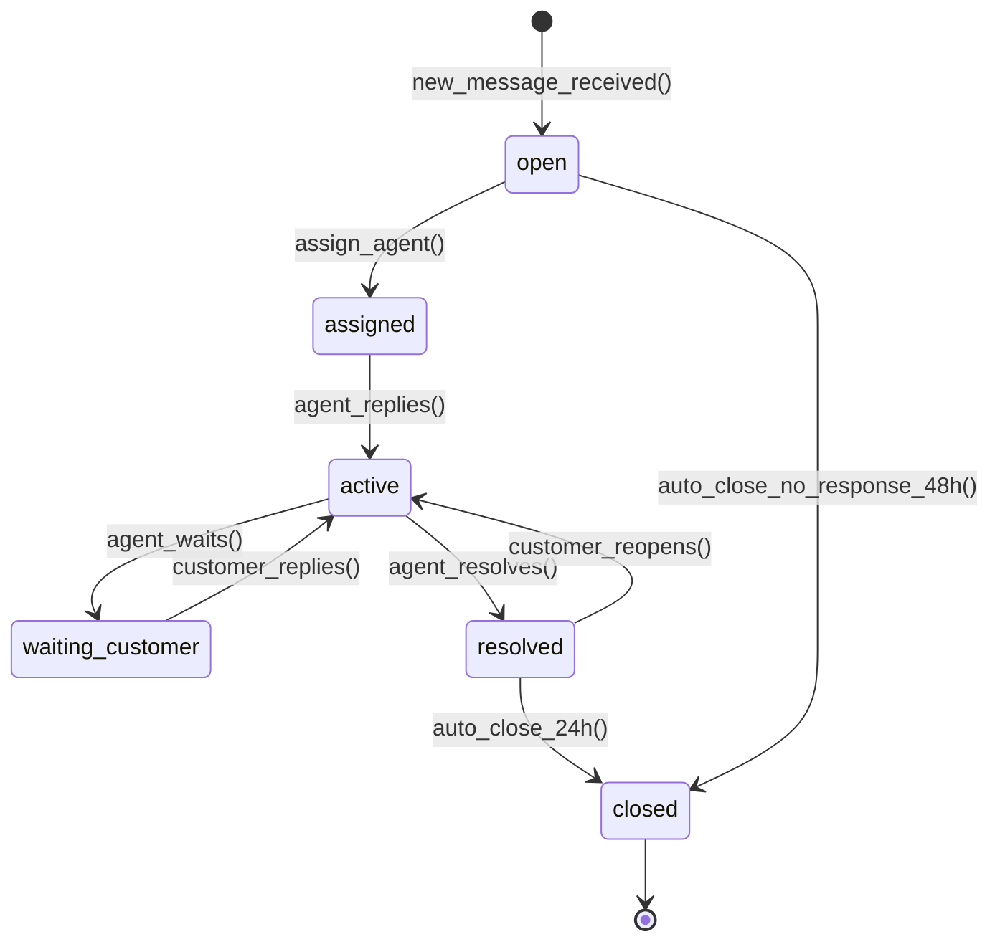
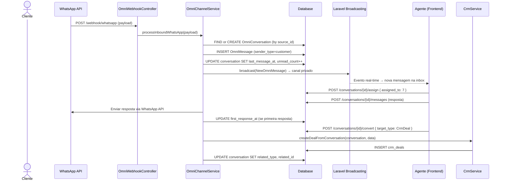

# Modulo: Omnichannel (Inbox Centralizada)

> **Status de Implementação:** ⚠️ ESPECIFICAÇÃO — Este módulo está 100% documentado mas ainda não possui código backend (zero models, controllers, migrations). Implementação planejada para fases futuras.

> **[AI_RULE]** Especificações arquiteturais da fase de Expansão. Módulo Omnichannel.

---

## 1. Visão Geral

Arquitetura para a "Inbox Universal". Utiliza WebSockets para chat em tempo real unificando Webhook do WhatsApp (Integrations), Respostas de E-mail (Email) e Mensagens nativas do Portal do Cliente.

**Escopo Funcional:**

- Inbox unificada com todas as conversas de todos os canais
- Chat em tempo real via Laravel Broadcasting (WebSocket/Pusher)
- Roteamento e atribuição de conversas a agentes
- Conversão de conversa em Deal (CRM), OS (WorkOrders) ou Chamado (Service-Calls)
- Mensagens automáticas (auto-reply) e templates pré-configurados
- Histórico completo com timeline unificada
- Métricas de atendimento (tempo de resposta, satisfação)

---

## 2. Entidades (Models)

### 2.1 OmniConversation

| Campo | Tipo | Regra |
|-------|------|-------|
| `id` | bigint (PK) | Auto-increment |
| `tenant_id` | bigint (FK) | Obrigatório, isolamento multi-tenant |
| `code` | string(50) | Código único, prefixo `CONV-`, padding 6 |
| `channel` | enum | `whatsapp`, `email`, `portal`, `internal_chat`, `sms` |
| `status` | enum | `open`, `assigned`, `active`, `waiting_customer`, `resolved`, `closed` |
| `contact_id` | bigint (FK → contacts) null | Cliente externo |
| `customer_id` | bigint (FK → customers) null | Cliente do portal |
| `assigned_to` | bigint (FK → users) null | Agente atribuído |
| `department` | string(100) null | Departamento/fila (ex: "comercial", "suporte", "laboratório") |
| `subject` | string(255) null | Assunto da conversa |
| `priority` | enum | `low`, `medium`, `high`, `urgent` |
| `source_id` | string(255) null | ID externo (ex: WhatsApp phone, email message-id) |
| `source_metadata` | json null | Metadados do canal de origem |
| `first_response_at` | timestamp null | Primeira resposta do agente |
| `resolved_at` | timestamp null | Data de resolução |
| `last_message_at` | timestamp null | Última mensagem (para ordenação) |
| `unread_count` | integer | Mensagens não lidas pelo agente (default 0) |
| `tags` | json null | Tags: `["vip","urgente","calibracao"]` |
| `related_type` | string null | Morph: `CrmDeal`, `WorkOrder`, `ServiceCall` |
| `related_id` | bigint null | ID do registro relacionado |
| `created_at` | timestamp | — |
| `updated_at` | timestamp | — |

### 2.2 OmniMessage

| Campo | Tipo | Regra |
|-------|------|-------|
| `id` | bigint (PK) | Auto-increment |
| `tenant_id` | bigint (FK) | Obrigatório |
| `omni_conversation_id` | bigint (FK) | Conversa pai |
| `sender_type` | enum | `agent`, `customer`, `system`, `bot` |
| `sender_id` | bigint null | user_id (agent) ou contact_id (customer) |
| `content` | text | Corpo da mensagem |
| `content_type` | enum | `text`, `image`, `audio`, `video`, `document`, `template`, `location` |
| `attachments` | json null | `[{"url":"...","mime":"image/png","size":1024}]` |
| `external_id` | string(255) null | ID da mensagem no canal externo (WhatsApp msg-id) |
| `delivery_status` | enum | `sending`, `sent`, `delivered`, `read`, `failed` |
| `is_internal` | boolean | Nota interna (visível apenas para agentes) |
| `template_id` | bigint (FK → omni_channel_configs) null | Template usado |
| `metadata` | json null | Dados extras do canal |
| `sent_at` | timestamp | Data de envio |
| `created_at` | timestamp | — |

### 2.3 OmniChannelConfig

| Campo | Tipo | Regra |
|-------|------|-------|
| `id` | bigint (PK) | Auto-increment |
| `tenant_id` | bigint (FK) | Obrigatório |
| `channel` | enum | `whatsapp`, `email`, `portal`, `sms` |
| `name` | string(255) | Nome da configuração (ex: "WhatsApp Comercial") |
| `credentials` | json | Criptografado: `{"api_key":"...","phone_number_id":"...","waba_id":"..."}` |
| `webhook_url` | string(500) null | URL de webhook recebida |
| `auto_reply_enabled` | boolean | Ativar resposta automática |
| `auto_reply_message` | text null | Mensagem de auto-reply |
| `business_hours` | json null | `{"mon":{"start":"08:00","end":"18:00"},...}` |
| `is_active` | boolean | Default true |
| `created_at` | timestamp | — |
| `updated_at` | timestamp | — |

### 2.4 OmniTemplate

| Campo | Tipo | Regra |
|-------|------|-------|
| `id` | bigint (PK) | Auto-increment |
| `tenant_id` | bigint (FK) | Obrigatório |
| `name` | string(255) | Nome do template |
| `channel` | enum | `whatsapp`, `email`, `sms`, `all` |
| `content` | text | Corpo com placeholders: `{{customer_name}}`, `{{work_order_code}}` |
| `category` | enum | `greeting`, `follow_up`, `resolution`, `notification`, `custom` |
| `is_active` | boolean | Default true |
| `created_at` | timestamp | — |
| `updated_at` | timestamp | — |

---

## 3. Ciclos de Vida (State Machines)

### 3.1 Ciclo da Conversa



| De | Para | Trigger | Efeito |
|----|------|---------|--------|
| `[*]` | `open` | Nova mensagem inbound (WhatsApp, email, portal) | Cria conversa, dispara broadcast para inbox |
| `open` | `assigned` | `assign_agent()` manual ou auto-routing | Define `assigned_to`, notifica agente |
| `assigned` | `active` | Agente envia primeira resposta | Registra `first_response_at` |
| `active` | `waiting_customer` | Agente indica que aguarda retorno | Pausa métricas de tempo de resposta |
| `active` | `resolved` | Agente marca como resolvido | Define `resolved_at` |
| `resolved` | `closed` | Sem nova mensagem em 24h | Auto-close via Job |

---

## 4. Guard Rails de Negócio `[AI_RULE]`

> **[AI_RULE_CRITICAL] Isolamento por Tenant e Canal**
> Conversas são sempre filtradas por `tenant_id`. Mensagens de WhatsApp de um tenant NUNCA podem aparecer na inbox de outro. O `OmniChannelConfig.credentials` é criptografado no banco usando `encrypt()`.

> **[AI_RULE_CRITICAL] Real-Time via Broadcasting**
> Toda nova `OmniMessage` DEVE disparar evento `NewOmniMessage` via Laravel Broadcasting (canal privado `omni.tenant.{tenant_id}`). O frontend React escuta via Pusher/Socket.io para atualização em tempo real.

> **[AI_RULE_CRITICAL] Notas Internas Invisíveis**
> Mensagens com `is_internal = true` NUNCA são enviadas ao canal externo (WhatsApp, email) e NUNCA são visíveis no portal do cliente. São apenas para comunicação interna entre agentes.

> **[AI_RULE] Auto-Routing**
> Se `OmniChannelConfig.business_hours` está configurado e a mensagem chega fora do horário, o auto-reply é enviado. Se dentro do horário, a conversa é roteada para o departamento configurado usando round-robin entre agentes online.

> **[AI_RULE] Conversão em Entidades**
> Agente pode converter conversa em: `CrmDeal` (via botão "Criar Oportunidade"), `WorkOrder` (via "Abrir OS"), `ServiceCall` (via "Abrir Chamado"). O campo morph `related_type`/`related_id` vincula a conversa ao registro criado.

> **[AI_RULE] Templates com Placeholders**
> `OmniTemplate` suporta placeholders dinâmicos: `{{customer_name}}`, `{{work_order_code}}`, `{{company_name}}`. O `TemplateRenderService` resolve os placeholders antes de enviar.

> **[AI_RULE] Métricas de Atendimento**
> Calcular automaticamente: First Response Time, Average Handle Time, Resolution Rate, Customer Satisfaction (pós-resolução). Armazenar em cache para dashboard.

---

## 5. Comportamento Integrado (Cross-Domain)

| Direção | Módulo | Integração |
|---------|--------|------------|
| ← | **Integrations** | Recebe webhooks do WhatsApp Business API (WABA) |
| ← | **Email** | Recebe inbound emails e converte em conversa |
| ← | **Portal** | Recebe mensagens do chat do portal do cliente |
| → | **CRM** | Converter conversa em `CrmDeal` |
| → | **WorkOrders** | Converter conversa em `WorkOrder` |
| → | **Service-Calls** | Converter conversa em `ServiceCall` |
| → | **Alerts** | Alerta para conversas sem resposta acima do SLA |

---

## 6. Contratos de API (JSON)

### 6.1 Listar Conversas (Inbox)

```http
GET /api/v1/omnichannel/conversations?status=open&channel=whatsapp&assigned_to=me&per_page=20
Authorization: Bearer {admin-token}
```

**Response (200):**

```json
{
  "success": true,
  "data": [
    {
      "id": 150,
      "code": "CONV-000150",
      "channel": "whatsapp",
      "status": "active",
      "contact": {"id": 42, "name": "João Silva", "phone": "+5511999999999"},
      "subject": "Consulta sobre calibração",
      "assigned_to": {"id": 7, "name": "Maria Admin"},
      "unread_count": 2,
      "last_message_at": "2026-03-25T14:30:00Z",
      "last_message_preview": "Gostaria de saber o prazo..."
    }
  ],
  "meta": { "current_page": 1, "per_page": 20, "total": 15 }
}
```

### 6.2 Enviar Mensagem

```http
POST /api/v1/omnichannel/conversations/{id}/messages
Authorization: Bearer {admin-token}
Content-Type: application/json
```

**Request:**

```json
{
  "content": "Olá João, o prazo para calibração é de 5 dias úteis.",
  "content_type": "text",
  "is_internal": false
}
```

### 6.3 Atribuir Conversa

```http
POST /api/v1/omnichannel/conversations/{id}/assign
Authorization: Bearer {admin-token}
Content-Type: application/json
```

**Request:**

```json
{
  "assigned_to": 7,
  "department": "laboratório"
}
```

### 6.4 Converter em CRM Deal

```http
POST /api/v1/omnichannel/conversations/{id}/convert
Authorization: Bearer {admin-token}
Content-Type: application/json
```

**Request:**

```json
{
  "target_type": "CrmDeal",
  "data": {
    "title": "Calibração 10 instrumentos",
    "estimated_value": 5000.00
  }
}
```

### 6.5 Dashboard Omnichannel

```http
GET /api/v1/omnichannel/dashboard
Authorization: Bearer {admin-token}
```

**Response (200):**

```json
{
  "success": true,
  "data": {
    "open_conversations": 15,
    "unassigned": 3,
    "avg_first_response_minutes": 8,
    "avg_resolution_minutes": 120,
    "by_channel": {"whatsapp": 8, "email": 5, "portal": 2},
    "by_status": {"open": 3, "assigned": 2, "active": 7, "waiting_customer": 3},
    "agents_online": 5,
    "satisfaction_avg": 4.2
  }
}
```

---

## 7. Permissões (RBAC)

| Permissão | Descrição |
|-----------|-----------|
| `omnichannel.conversation.view` | Visualizar conversas |
| `omnichannel.conversation.reply` | Responder mensagens |
| `omnichannel.conversation.assign` | Atribuir/reatribuir conversas |
| `omnichannel.conversation.convert` | Converter em Deal/OS/Chamado |
| `omnichannel.conversation.close` | Fechar/resolver conversas |
| `omnichannel.config.manage` | Gerenciar canais (WhatsApp, email, etc.) |
| `omnichannel.template.manage` | Gerenciar templates de mensagem |
| `omnichannel.dashboard.view` | Dashboard de atendimento |

---

## 8. Rotas da API

### Conversations (`auth:sanctum` + `check.tenant`)

| Método | Rota | Controller | Ação |
|--------|------|------------|------|
| `GET` | `/api/v1/omnichannel/conversations` | `OmniConversationController@index` | Listar (inbox) |
| `GET` | `/api/v1/omnichannel/conversations/{id}` | `OmniConversationController@show` | Detalhes + mensagens |
| `POST` | `/api/v1/omnichannel/conversations/{id}/messages` | `OmniConversationController@sendMessage` | Enviar mensagem |
| `POST` | `/api/v1/omnichannel/conversations/{id}/assign` | `OmniConversationController@assign` | Atribuir agente |
| `POST` | `/api/v1/omnichannel/conversations/{id}/resolve` | `OmniConversationController@resolve` | Resolver |
| `POST` | `/api/v1/omnichannel/conversations/{id}/close` | `OmniConversationController@close` | Fechar |
| `POST` | `/api/v1/omnichannel/conversations/{id}/convert` | `OmniConversationController@convert` | Converter em entidade |

### Configuration (`auth:sanctum` + `check.tenant`)

| Método | Rota | Controller | Ação |
|--------|------|------------|------|
| `GET` | `/api/v1/omnichannel/channels` | `OmniChannelConfigController@index` | Listar canais |
| `POST` | `/api/v1/omnichannel/channels` | `OmniChannelConfigController@store` | Configurar canal |
| `PUT` | `/api/v1/omnichannel/channels/{id}` | `OmniChannelConfigController@update` | Atualizar canal |
| `DELETE` | `/api/v1/omnichannel/channels/{id}` | `OmniChannelConfigController@destroy` | Remover canal |

### Templates (`auth:sanctum` + `check.tenant`)

| Método | Rota | Controller | Ação |
|--------|------|------------|------|
| `GET` | `/api/v1/omnichannel/templates` | `OmniTemplateController@index` | Listar templates |
| `POST` | `/api/v1/omnichannel/templates` | `OmniTemplateController@store` | Criar template |
| `PUT` | `/api/v1/omnichannel/templates/{id}` | `OmniTemplateController@update` | Atualizar |
| `DELETE` | `/api/v1/omnichannel/templates/{id}` | `OmniTemplateController@destroy` | Excluir |

### Webhooks (sem auth — validação por signature)

| Método | Rota | Controller | Ação |
|--------|------|------------|------|
| `POST` | `/api/v1/omnichannel/webhook/whatsapp` | `OmniWebhookController@whatsapp` | Receber webhook WhatsApp |
| `POST` | `/api/v1/omnichannel/webhook/email` | `OmniWebhookController@email` | Receber inbound email |

### Dashboard

| Método | Rota | Controller | Ação |
|--------|------|------------|------|
| `GET` | `/api/v1/omnichannel/dashboard` | `OmniConversationController@dashboard` | Métricas |

---

## 9. Form Requests (Validação de Entrada)

### 9.1 SendOmniMessageRequest

**Classe**: `App\Http\Requests\Omnichannel\SendOmniMessageRequest`

```php
public function rules(): array
{
    return [
        'content'      => ['required', 'string', 'max:5000'],
        'content_type' => ['required', 'string', 'in:text,image,audio,video,document,template'],
        'is_internal'  => ['sometimes', 'boolean'],
        'template_id'  => ['nullable', 'integer', 'exists:omni_templates,id', 'required_if:content_type,template'],
        'attachments'  => ['nullable', 'array'],
    ];
}
```

### 9.2 AssignConversationRequest

**Classe**: `App\Http\Requests\Omnichannel\AssignConversationRequest`

```php
public function rules(): array
{
    return [
        'assigned_to' => ['required', 'integer', 'exists:users,id'],
        'department'  => ['nullable', 'string', 'max:100'],
    ];
}
```

### 9.3 ConvertConversationRequest

**Classe**: `App\Http\Requests\Omnichannel\ConvertConversationRequest`

```php
public function rules(): array
{
    return [
        'target_type' => ['required', 'string', 'in:CrmDeal,WorkOrder,ServiceCall'],
        'data'        => ['required', 'array'],
    ];
}
```

### 9.4 StoreOmniChannelConfigRequest

**Classe**: `App\Http\Requests\Omnichannel\StoreOmniChannelConfigRequest`

```php
public function rules(): array
{
    return [
        'channel'            => ['required', 'string', 'in:whatsapp,email,portal,sms'],
        'name'               => ['required', 'string', 'max:255'],
        'credentials'        => ['required', 'array'],
        'auto_reply_enabled' => ['sometimes', 'boolean'],
        'auto_reply_message' => ['nullable', 'string', 'max:1000', 'required_if:auto_reply_enabled,true'],
        'business_hours'     => ['nullable', 'array'],
    ];
}
```

---

## 10. Diagramas de Sequência

### 10.1 Fluxo: Mensagem WhatsApp → Inbox → Resposta → Conversão em Deal



---

## 11. Testes Requeridos (BDD)

```gherkin
Funcionalidade: Omnichannel Inbox

  Cenário: Mensagem WhatsApp cria conversa
    Dado que existe OmniChannelConfig para WhatsApp
    Quando webhook recebe mensagem do número +5511999999999
    Então uma OmniConversation é criada com channel=whatsapp
    E uma OmniMessage é criada com sender_type=customer

  Cenário: Agente responde e mensagem vai ao canal
    Dado que tenho conversa WhatsApp ativa
    Quando envio POST /conversations/{id}/messages com content
    Então OmniMessage é criada com sender_type=agent
    E mensagem é enviada via WhatsApp API

  Cenário: Nota interna não vai ao canal externo
    Quando envio mensagem com is_internal=true
    Então OmniMessage é salva com is_internal=true
    E nenhuma chamada é feita à WhatsApp API

  Cenário: Broadcasting real-time
    Quando nova mensagem chega
    Então evento NewOmniMessage é disparado no canal privado do tenant

  Cenário: Converter conversa em CRM Deal
    Dado que tenho conversa ativa
    Quando envio POST /conversations/{id}/convert com target_type=CrmDeal
    Então um CrmDeal é criado
    E a conversa tem related_type=CrmDeal

  Cenário: Auto-reply fora do horário comercial
    Dado que OmniChannelConfig tem business_hours e auto_reply_enabled
    E a mensagem chega fora do horário
    Então auto_reply_message é enviada ao cliente

  Cenário: Isolamento multi-tenant
    Dado que existem conversas do tenant_id=1 e tenant_id=2
    Quando admin do tenant_id=1 lista conversas
    Então recebe apenas conversas do tenant_id=1
```

---

## 12. Inventário Completo do Código

> **[AI_RULE]** Todos os artefatos listados DEVEM ser criados.

### Controllers (4 — namespace `App\Http\Controllers\Api\V1`)

| Controller | Arquivo | Métodos Públicos |
|------------|---------|-----------------|
| **OmniConversationController** | `Omnichannel/OmniConversationController.php` | `index`, `show`, `sendMessage`, `assign`, `resolve`, `close`, `convert`, `dashboard` |
| **OmniChannelConfigController** | `Omnichannel/OmniChannelConfigController.php` | `index`, `store`, `update`, `destroy` |
| **OmniTemplateController** | `Omnichannel/OmniTemplateController.php` | `index`, `store`, `update`, `destroy` |
| **OmniWebhookController** | `Omnichannel/OmniWebhookController.php` | `whatsapp`, `email` |

### Models (4 — namespace `App\Models`)

| Model | Tabela | Descrição |
|-------|--------|-----------|
| `OmniConversation` | `omni_conversations` | Conversa unificada |
| `OmniMessage` | `omni_messages` | Mensagens da conversa |
| `OmniChannelConfig` | `omni_channel_configs` | Configuração de canal |
| `OmniTemplate` | `omni_templates` | Templates de mensagem |

### Services (3 — namespace `App\Services`)

| Service | Métodos Públicos |
|---------|-----------------|
| `OmniChannelService` | `processInbound(channel, payload)`, `sendOutbound(conversation, message)`, `assignConversation()`, `resolveConversation()` |
| `TemplateRenderService` | `render(OmniTemplate, context)` — resolve placeholders dinâmicos |
| `ConversationConverterService` | `convertToDeal()`, `convertToWorkOrder()`, `convertToServiceCall()` |

### Events (2 — namespace `App\Events`)

| Evento | Canal | Descrição |
|--------|-------|-----------|
| `NewOmniMessage` | `omni.tenant.{tenantId}` | Nova mensagem na conversa |
| `ConversationUpdated` | `omni.tenant.{tenantId}` | Status/atribuição mudou |

### Jobs (1 — namespace `App\Jobs`)

| Job | Descrição |
|-----|-----------|
| `AutoCloseResolvedConversations` | Fecha conversas resolvidas sem atividade por 24h |

### Form Requests (6 — namespace `App\Http\Requests\Omnichannel`)

| FormRequest | Endpoint |
|-------------|----------|
| `SendOmniMessageRequest` | `POST /conversations/{id}/messages` |
| `AssignConversationRequest` | `POST /conversations/{id}/assign` |
| `ConvertConversationRequest` | `POST /conversations/{id}/convert` |
| `StoreOmniChannelConfigRequest` | `POST /omnichannel/channels` |
| `UpdateOmniChannelConfigRequest` | `PUT /omnichannel/channels/{id}` |
| `StoreOmniTemplateRequest` | `POST /omnichannel/templates` |

---

---

## Edge Cases e Tratamento de Erros

| Cenário | Comportamento Esperado | Regra |
| --------- | ---------------------- | ------- |
| **Sessão expirada** (cliente retorna após timeout da sessão) | Se retorno em < 24h: reabrir sessão anterior com contexto preservado. Se > 24h: criar nova sessão com referência à anterior via `previous_session_id`. Nunca perder histórico. | `[AI_RULE]` |
| **Canal offline** (WhatsApp/Telegram API indisponível) | Marcar canal como `offline` no dashboard. Enfileirar mensagens para envio quando restaurar. Alertar operadores. Redirecionar novas conversas para canais ativos. Timeout de fila: 4h (após isso, notificar cliente por email se disponível). | `[AI_RULE_CRITICAL]` |
| **Rate limit de API** (excede limite de mensagens/minuto) | Implementar queue com throttling por canal. WhatsApp: max 80 msgs/min. Telegram: max 30 msgs/min. Se exceder: enfileirar com retry automático. Nunca dropar mensagem. Logar `rate_limit_hit` para dimensionamento. | `[AI_RULE]` |
| **Mensagem sem remetente identificado** (número/conta não cadastrada) | Criar `Contact` provisional com dados disponíveis (telefone/username). Marcar como `unidentified`. Permitir atendimento normal. Sugerir vinculação com cliente existente via fuzzy match de telefone/email. | `[AI_RULE]` |
| **Transferência para operador offline** (todos os operadores do departamento offline) | Manter na fila do departamento. Notificar supervisores. Se espera > 10min: enviar mensagem automática ao cliente com previsão. Nunca transferir para operador `offline` — manter em `waiting`. | `[AI_RULE]` |
| **Mídia não suportada** (cliente envia formato não processável) | Salvar arquivo original com `unsupported_media = true`. Exibir placeholder para operador. Responder ao cliente: "Formato não suportado, envie como PDF/JPG/PNG". Logar formato para análise de suporte futuro. | `[AI_RULE]` |

---

## Checklist de Implementação

- [ ] Migration `create_omni_conversations_table` com campos completos, morph relacionado, tenant_id
- [ ] Migration `create_omni_messages_table` com índice em (conversation_id, sent_at)
- [ ] Migration `create_omni_channel_configs_table` com credentials criptografado
- [ ] Migration `create_omni_templates_table`
- [ ] Model `OmniConversation` com fillable, casts (json), morphTo, relationships
- [ ] Model `OmniMessage` com fillable, casts, relationships
- [ ] Model `OmniChannelConfig` com casts (encrypted json para credentials)
- [ ] Model `OmniTemplate` com fillable, relationships
- [ ] `OmniChannelService` com processamento inbound (WhatsApp, email, portal) e outbound
- [ ] `TemplateRenderService` com resolução de placeholders
- [ ] `ConversationConverterService` com conversão para Deal/OS/Chamado
- [ ] Events `NewOmniMessage` e `ConversationUpdated` com Broadcasting configurado
- [ ] Job `AutoCloseResolvedConversations` diário
- [ ] `OmniConversationController` com inbox, mensagens, assign, resolve, convert, dashboard
- [ ] `OmniChannelConfigController` com CRUD
- [ ] `OmniTemplateController` com CRUD
- [ ] `OmniWebhookController` com validação de signature para WhatsApp e email
- [ ] 6 Form Requests conforme especificação
- [ ] Rotas em `routes/api.php` com middlewares adequados
- [ ] Permissões RBAC no seeder
- [ ] Testes Feature: webhook inbound, send message, assign, convert, auto-reply, broadcasting, isolamento
- [ ] Frontend React: Inbox unificada (lista + chat), configuração de canais, templates, dashboard
