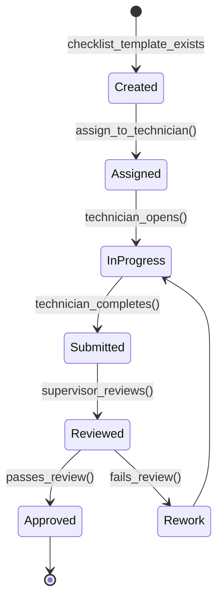
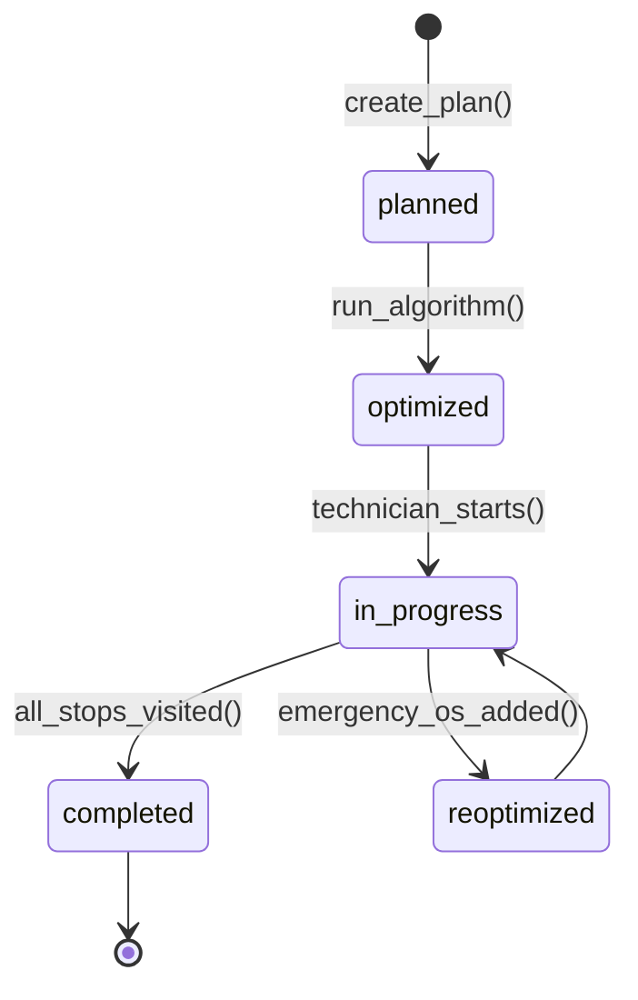
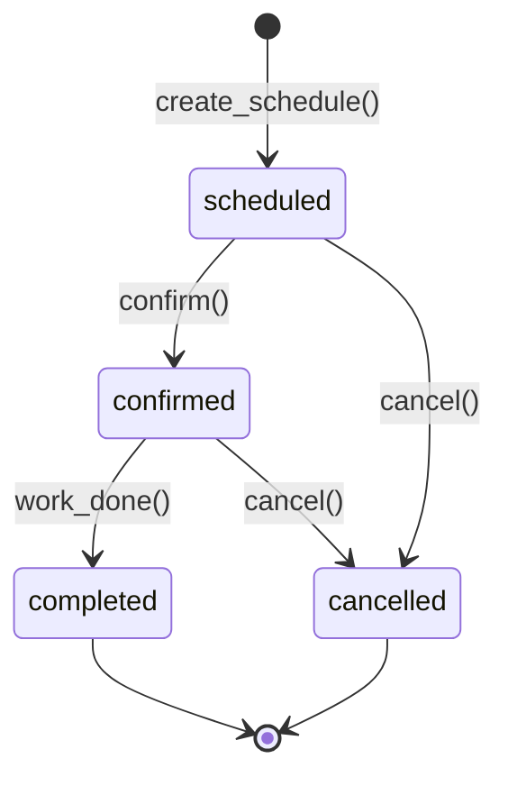
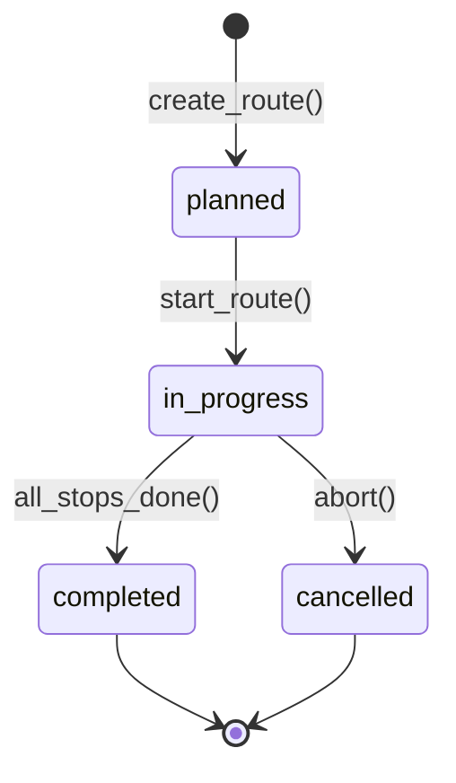
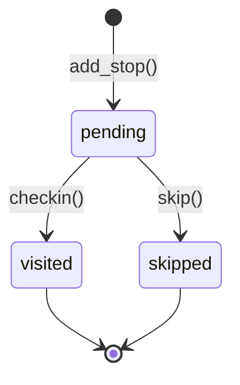
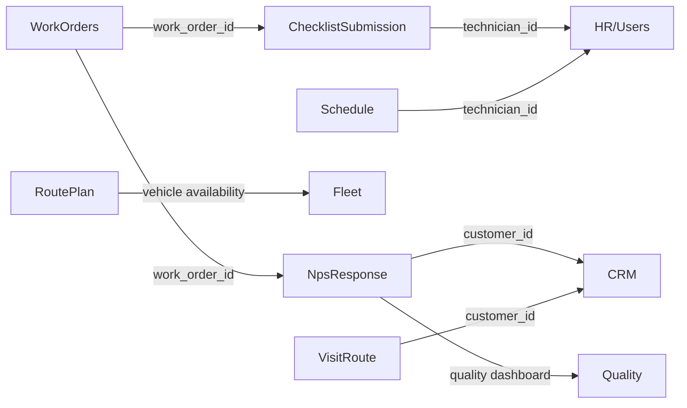
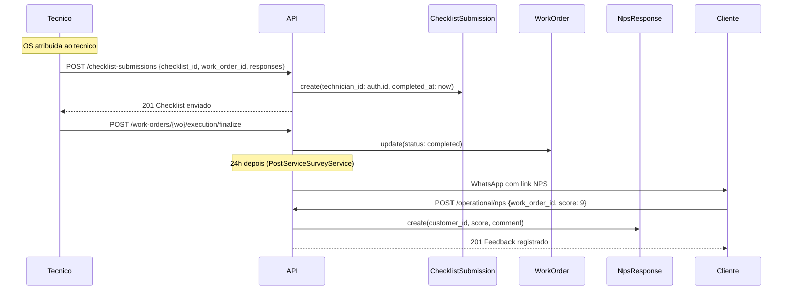
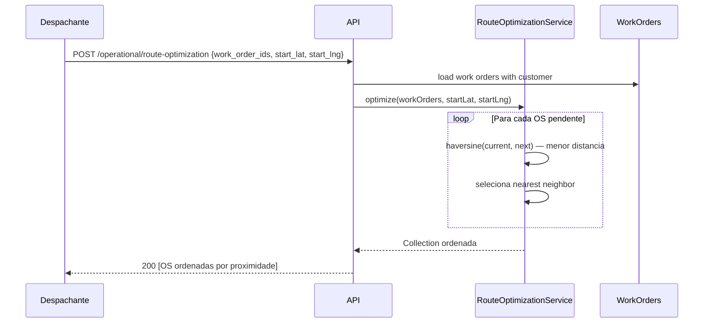
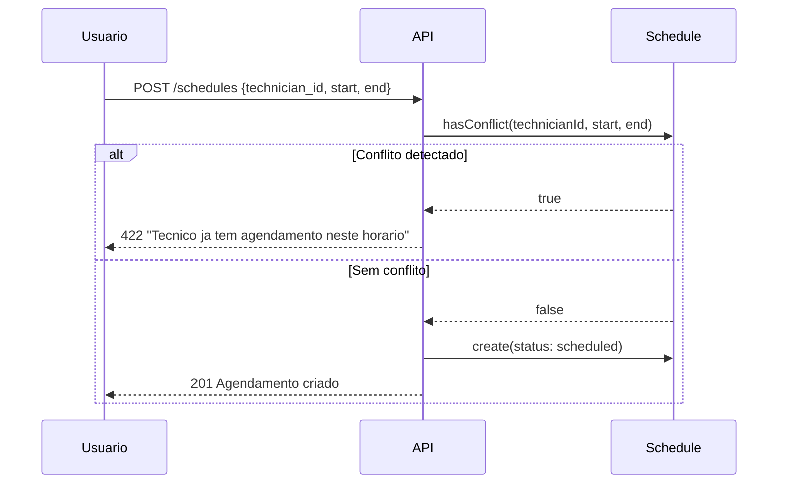

# Modulo: Operacional (Checklists, Rotas, NPS, Agendamentos)

> **[AI_RULE]** Documentacao Level C Maximum do dominio Operational. Todas as entidades, campos, regras de negocio, contratos JSON, permissoes, diagramas e BDD extraidos do codigo-fonte real.

---

## 1. Visao Geral

O modulo Operacional orquestra a execucao de campo: checklists de servico, submissoes de checklist por tecnicos, pesquisas NPS pos-atendimento, otimizacao de rotas, agendamentos de visitas, e rotas comerciais. E o elo entre a OS (WorkOrders) e a operacao real em campo — garantindo que checklists obrigatorios sejam preenchidos, rotas sejam otimizadas por menor distancia, e a satisfacao do cliente seja medida automaticamente.

### Arquivos-chave

| Camada | Arquivo |
|--------|---------|
| Models | `Checklist`, `ChecklistSubmission`, `NpsSurvey`, `NpsResponse`, `RoutePlan`, `Schedule`, `VisitRoute`, `VisitRouteStop`, `ServiceChecklist`, `ServiceChecklistItem`, `WorkOrderChecklistResponse` |
| Controllers | `Operational\ChecklistController`, `Operational\ChecklistSubmissionController`, `Operational\NpsController`, `Operational\RouteOptimizationController`, `Operational\ExpressWorkOrderController`, `ServiceChecklistController`, `WorkOrderChecklistResponseController`, `Technician\ScheduleController` |
| Services | `RouteOptimizationService`, `PostServiceSurveyService` |
| Requests | `Operational\StoreChecklistRequest`, `Operational\UpdateChecklistRequest`, `Operational\StoreChecklistSubmissionRequest`, `Operational\StoreNpsResponseRequest`, `Operational\OptimizeRouteRequest` |
| Enums | `ScheduleStatus` |
| Routes | `routes/api/work-orders.php` (checklists, NPS, route-optimization, schedules, service-checklists) |

---

## 2. Entidades (Models) e Campos

### 2.1 Checklist
>
> Template de checklist generico com itens armazenados em JSON.

| Campo | Tipo | Descricao |
|-------|------|-----------|
| `id` | bigint PK | Identificador |
| `tenant_id` | bigint FK | Tenant |
| `name` | string | Nome do checklist |
| `description` | text | Descricao |
| `items` | json/array | Lista de itens do checklist |
| `is_active` | boolean | Ativo/inativo |

**Relationships:** `submissions()` -> HasMany ChecklistSubmission

### 2.2 ChecklistSubmission
>
> Preenchimento de um checklist por um tecnico vinculado a uma OS.

| Campo | Tipo | Descricao |
|-------|------|-----------|
| `id` | bigint PK | Identificador |
| `tenant_id` | bigint FK | Tenant |
| `checklist_id` | bigint FK | Checklist template |
| `work_order_id` | bigint FK | OS vinculada |
| `technician_id` | bigint FK | Tecnico que preencheu |
| `responses` | json/array | Respostas do tecnico |
| `completed_at` | datetime | Quando completou |

**Relationships:**

- `checklist()` -> BelongsTo Checklist
- `workOrder()` -> BelongsTo WorkOrder
- `technician()` -> BelongsTo User

### 2.3 ServiceChecklist
>
> Checklist de servico estruturado com itens tipados.

| Campo | Tipo | Descricao |
|-------|------|-----------|
| `id` | bigint PK | Identificador |
| `tenant_id` | bigint FK | Tenant |
| `name` | string | Nome |
| `description` | text | Descricao |
| `is_active` | boolean | Ativo |

**Traits:** BelongsToTenant, Auditable
**Relationships:** `items()` -> HasMany ServiceChecklistItem (ordered by `order_index`)

### 2.4 ServiceChecklistItem
>
> Item individual dentro de um ServiceChecklist.

| Campo | Tipo | Descricao |
|-------|------|-----------|
| `id` | bigint PK | Identificador |
| `checklist_id` | bigint FK | ServiceChecklist pai |
| `description` | string | Descricao do item |
| `type` | string | Tipo: check, text, number, photo, yes_no |
| `is_required` | boolean | Obrigatorio |
| `order_index` | integer | Ordem de exibicao |

**Constantes de tipo:**

- `TYPE_CHECK = 'check'` — checkbox simples
- `TYPE_TEXT = 'text'` — campo texto livre
- `TYPE_NUMBER = 'number'` — campo numerico
- `TYPE_PHOTO = 'photo'` — upload de foto obrigatorio
- `TYPE_YES_NO = 'yes_no'` — sim/nao

### 2.5 WorkOrderChecklistResponse
>
> Resposta individual de um item de checklist vinculada a uma OS.

| Campo | Tipo | Descricao |
|-------|------|-----------|
| `id` | bigint PK | Identificador |
| `tenant_id` | bigint FK | Tenant |
| `work_order_id` | bigint FK | OS |
| `checklist_item_id` | bigint FK | Item do ServiceChecklist |
| `value` | string | Valor da resposta |
| `notes` | text | Observacoes |

**Relationships:**

- `workOrder()` -> BelongsTo WorkOrder
- `item()` -> BelongsTo ServiceChecklistItem

### 2.6 NpsSurvey
>
> Pesquisa NPS enviada ao cliente apos conclusao de OS.

| Campo | Tipo | Descricao |
|-------|------|-----------|
| `id` | bigint PK | Identificador |
| `tenant_id` | bigint FK | Tenant |
| `customer_id` | bigint FK | Cliente |
| `work_order_id` | bigint FK | OS |
| `score` | integer | Score 0-10 |
| `feedback` | text | Comentario livre |
| `category` | string | Categoria: `atendimento`, `pontualidade`, `qualidade_tecnica`, `comunicacao`, `custo_beneficio`, `geral` |
| `responded_at` | datetime | Quando respondeu |

**Relationships:**

- `customer()` -> BelongsTo Customer
- `workOrder()` -> BelongsTo WorkOrder

### 2.7 NpsResponse
>
> Resposta NPS simplificada (segundo model, usado pelo NpsController).

| Campo | Tipo | Descricao |
|-------|------|-----------|
| `id` | bigint PK | Identificador |
| `tenant_id` | bigint FK | Tenant |
| `work_order_id` | bigint FK | OS |
| `customer_id` | bigint FK | Cliente |
| `score` | integer | Score 0-10 |
| `comment` | text | Comentario |

**Relationships:**

- `workOrder()` -> BelongsTo WorkOrder
- `customer()` -> BelongsTo Customer

### 2.8 RoutePlan
>
> Plano de rota otimizado para um tecnico em um dia.

| Campo | Tipo | Descricao |
|-------|------|-----------|
| `id` | bigint PK | Identificador |
| `tenant_id` | bigint FK | Tenant |
| `technician_id` | bigint FK | Tecnico |
| `plan_date` | date | Data da rota |
| `stops` | json/array | Paradas ordenadas |
| `total_distance_km` | decimal(8,2) | Distancia total |
| `estimated_duration_min` | integer | Duracao estimada (min) |
| `status` | string | Status (planned, in_progress, completed) |

**Relationships:** `technician()` -> BelongsTo User

### 2.9 Schedule
>
> Agendamento de visita tecnica vinculado a OS e cliente. Suporta SoftDeletes.

| Campo | Tipo | Descricao |
|-------|------|-----------|
| `id` | bigint PK | Identificador |
| `tenant_id` | bigint FK | Tenant |
| `work_order_id` | bigint FK | OS |
| `customer_id` | bigint FK | Cliente |
| `technician_id` | bigint FK | Tecnico |
| `title` | string | Titulo do agendamento |
| `notes` | text | Observacoes |
| `scheduled_start` | datetime | Inicio agendado |
| `scheduled_end` | datetime | Fim agendado |
| `status` | string | scheduled, confirmed, completed, cancelled |
| `address` | string | Endereco |

**Constantes de status:**

- `STATUS_SCHEDULED = 'scheduled'` — Agendado
- `STATUS_CONFIRMED = 'confirmed'` — Confirmado
- `STATUS_COMPLETED = 'completed'` — Concluido
- `STATUS_CANCELLED = 'cancelled'` — Cancelado

**Metodo critico:** `hasConflict(technicianId, start, end, excludeId)` — verifica sobreposicao de horarios. Ignora agendamentos cancelados.

**Relationships:**

- `workOrder()` -> BelongsTo WorkOrder
- `customer()` -> BelongsTo Customer
- `technician()` -> BelongsTo User

### 2.10 VisitRoute
>
> Rota comercial de visitas (CRM/vendas).

| Campo | Tipo | Descricao |
|-------|------|-----------|
| `id` | bigint PK | Identificador |
| `tenant_id` | bigint FK | Tenant |
| `user_id` | bigint FK | Vendedor/representante |
| `route_date` | date | Data da rota |
| `name` | string | Nome da rota |
| `status` | string | planned, in_progress, completed, cancelled |
| `total_stops` | integer | Total de paradas |
| `completed_stops` | integer | Paradas concluidas |
| `total_distance_km` | float | Distancia total |
| `estimated_duration_minutes` | integer | Duracao estimada |
| `notes` | text | Observacoes |

**Scopes:** `scopePlanned`, `scopeToday`, `scopeByUser`
**Relationships:**

- `user()` -> BelongsTo User
- `stops()` -> HasMany VisitRouteStop (ordered by `stop_order`)

### 2.11 VisitRouteStop
>
> Parada individual dentro de uma VisitRoute.

| Campo | Tipo | Descricao |
|-------|------|-----------|
| `id` | bigint PK | Identificador |
| `visit_route_id` | bigint FK | Rota pai |
| `customer_id` | bigint FK | Cliente a visitar |
| `checkin_id` | bigint FK | Check-in vinculado |
| `stop_order` | integer | Ordem da parada |
| `status` | string | pending, visited, skipped |
| `estimated_duration_minutes` | integer | Duracao estimada |
| `objective` | string | Objetivo da visita |
| `notes` | text | Observacoes |

**Relationships:**

- `route()` -> BelongsTo VisitRoute
- `customer()` -> BelongsTo Customer
- `checkin()` -> BelongsTo VisitCheckin

---

## 3. Maquina de Estados

### 3.1 Checklist de Campo (ChecklistSubmission)



### 3.2 Otimizacao de Rotas (RoutePlan)



### 3.3 Agendamento (Schedule)



### 3.4 Rota Comercial (VisitRoute)



### 3.5 Parada da Rota (VisitRouteStop)



---

## 4. Regras de Negocio (Guard Rails) `[AI_RULE]`

> **[AI_RULE_CRITICAL] Checklist Obrigatorio por OS**
> Se a `WorkOrderTemplate` define checklists obrigatorios, a OS NAO pode transicionar para `Completed` sem `ChecklistSubmission` preenchido e vinculado. Isso garante conformidade de campo.

> **[AI_RULE] Otimizacao por Menor Distancia**
> O `RouteOptimizationService` calcula a rota otima usando algoritmo Nearest Neighbor com distancia Haversine (raio da Terra = 6371 km). Reotimizacao em tempo real quando novas OS emergenciais sao adicionadas. Work orders sem coordenadas de cliente sao adicionadas ao final da rota.

> **[AI_RULE] NPS Automatico 24h**
> `PostServiceSurveyService` dispara pesquisa de satisfacao automaticamente 24h apos `WorkOrder` atingir `Completed`. Envio via WhatsApp (preferencial) ou Email (fallback). Respostas alimentam `NpsResponse` com score 0-10.

> **[AI_RULE] Classificacao NPS**
> Score 9-10 = Promotor, Score 7-8 = Passivo, Score 0-6 = Detrator. NPS = ((promotores - detratores) / total) * 100.

> **[AI_RULE] Conflito de Horarios**
> `Schedule::hasConflict()` impede agendar um tecnico em dois locais simultaneamente. A verificacao ignora agendamentos com status `cancelled` e usa comparacao de intervalos: `scheduled_start < end AND scheduled_end > start`.

> **[AI_RULE] Tipos de Item de Checklist**
> O `ServiceChecklistItem` suporta 5 tipos: `check`, `text`, `number`, `photo`, `yes_no`. Itens com `type = 'photo'` requerem upload de imagem. Itens com `is_required = true` impedem finalizacao sem resposta.

> **[AI_RULE] Checklist Submission Auto-Timestamp**
> Ao criar `ChecklistSubmission`, `completed_at` e preenchido automaticamente com `now()` se nao fornecido. O `technician_id` vem do usuario autenticado.

---

## 5. Integracao Cross-Domain

| Direcao | Dominio | Integracao |
|---------|---------|------------|
| <- | **WorkOrders** | `ChecklistSubmission.work_order_id` — checklist obrigatorio por OS. `WorkOrderChecklistResponse` — respostas de checklist por item. |
| <- | **WorkOrders** | `NpsResponse.work_order_id` — NPS vinculado a OS concluida. |
| -> | **Fleet** | `RoutePlan` considera veiculos disponiveis e capacidade. `Schedule` vincula tecnico que tem veiculo atribuido. |
| -> | **HR** | `Schedule.technician_id` — horas por rota. Carga de trabalho do tecnico via `workloadSummary`. |
| -> | **CRM** | NPS score alimenta `CustomerRfmScore` no CRM. `VisitRoute`/`VisitRouteStop` sao rotas comerciais de visita a clientes. |
| -> | **Quality** | Resultados de checklist como evidencias de qualidade. NPS alimenta dashboard de qualidade. |
| -> | **Portal** | Resultado de NPS visivel no portal do cliente. |



---

## 6. Endpoints da API

### 6.1 Checklists (Templates)

| Metodo | Rota | Controller | Permissao |
|--------|------|-----------|-----------|
| GET | `/api/v1/checklists` | `ChecklistController@index` | `technicians.checklist.view` |
| GET | `/api/v1/checklists/{checklist}` | `ChecklistController@show` | `technicians.checklist.view` |
| POST | `/api/v1/checklists` | `ChecklistController@store` | `technicians.checklist.manage` |
| PUT | `/api/v1/checklists/{checklist}` | `ChecklistController@update` | `technicians.checklist.manage` |
| DELETE | `/api/v1/checklists/{checklist}` | `ChecklistController@destroy` | `technicians.checklist.manage` |

### 6.2 Checklist Submissions

| Metodo | Rota | Controller | Permissao |
|--------|------|-----------|-----------|
| GET | `/api/v1/checklist-submissions` | `ChecklistSubmissionController@index` | `technicians.checklist.view` |
| GET | `/api/v1/checklist-submissions/{sub}` | `ChecklistSubmissionController@show` | `technicians.checklist.view` |
| POST | `/api/v1/checklist-submissions` | `ChecklistSubmissionController@store` | `technicians.checklist.create` |

### 6.3 Service Checklists (Estruturados)

| Metodo | Rota | Controller | Permissao |
|--------|------|-----------|-----------|
| GET | `/api/v1/service-checklists` | `ServiceChecklistController@index` | `os.work_order.view` |
| GET | `/api/v1/service-checklists/{id}` | `ServiceChecklistController@show` | `os.work_order.view` |
| POST | `/api/v1/service-checklists` | `ServiceChecklistController@store` | `os.work_order.create` |
| PUT | `/api/v1/service-checklists/{id}` | `ServiceChecklistController@update` | `os.work_order.update` |
| DELETE | `/api/v1/service-checklists/{id}` | `ServiceChecklistController@destroy` | `os.work_order.delete` |

### 6.4 Checklist Responses (por OS)

| Metodo | Rota | Controller | Permissao |
|--------|------|-----------|-----------|
| GET | `/api/v1/work-orders/{wo}/checklist-responses` | `WorkOrderChecklistResponseController@index` | `os.work_order.view` |
| POST | `/api/v1/work-orders/{wo}/checklist-responses` | `WorkOrderChecklistResponseController@store` | `os.work_order.update` |

### 6.5 NPS

| Metodo | Rota | Controller | Permissao |
|--------|------|-----------|-----------|
| POST | `/api/v1/operational/nps` | `NpsController@store` | `os.work_order.create` |
| GET | `/api/v1/operational/nps/stats` | `NpsController@stats` | `os.work_order.view` |

### 6.6 Otimizacao de Rotas

| Metodo | Rota | Controller | Permissao |
|--------|------|-----------|-----------|
| POST | `/api/v1/operational/route-optimization` | `RouteOptimizationController@optimize` | `os.work_order.view` |

### 6.7 Agendamentos (Schedules)

| Metodo | Rota | Controller | Permissao |
|--------|------|-----------|-----------|
| GET | `/api/v1/schedules` | `ScheduleController@index` | `technicians.schedule.view` |
| GET | `/api/v1/schedules/{schedule}` | `ScheduleController@show` | `technicians.schedule.view` |
| GET | `/api/v1/schedules-unified` | `ScheduleController@unified` | `technicians.schedule.view` |
| GET | `/api/v1/schedules/conflicts` | `ScheduleController@conflicts` | `technicians.schedule.view` |
| GET | `/api/v1/schedules/workload` | `ScheduleController@workloadSummary` | `technicians.schedule.view` |
| GET | `/api/v1/schedules/suggest-routing` | `ScheduleController@suggestRouting` | `technicians.schedule.view` |
| POST | `/api/v1/schedules` | `ScheduleController@store` | `technicians.schedule.create` |
| PUT | `/api/v1/schedules/{schedule}` | `ScheduleController@update` | `technicians.schedule.update` |
| DELETE | `/api/v1/schedules/{schedule}` | `ScheduleController@destroy` | `technicians.schedule.delete` |

---

## 7. Contratos JSON

### 7.1 POST /api/v1/checklists — Criar Template de Checklist

```json
// Request
{
  "name": "Checklist Pre-Visita Calibracao",
  "description": "Verificacoes antes de iniciar calibracao",
  "items": [
    { "label": "EPI completo", "type": "check", "required": true },
    { "label": "Certificados em maos", "type": "check", "required": true },
    { "label": "Foto do equipamento", "type": "photo", "required": true },
    { "label": "Temperatura ambiente", "type": "number", "required": false },
    { "label": "Observacoes iniciais", "type": "text", "required": false }
  ],
  "is_active": true
}

// Response 201
{
  "data": {
    "id": 5,
    "name": "Checklist Pre-Visita Calibracao",
    "items": [...],
    "is_active": true,
    "created_at": "2026-03-24T10:00:00Z"
  },
  "message": "Checklist criado com sucesso"
}
```

### 7.2 POST /api/v1/checklist-submissions — Submeter Checklist

```json
// Request
{
  "checklist_id": 5,
  "work_order_id": 1234,
  "responses": {
    "epi_completo": true,
    "certificados_em_maos": true,
    "foto_equipamento": "photos/checklist/2026-03-24-abc.jpg",
    "temperatura_ambiente": 22.5,
    "observacoes_iniciais": "Equipamento em bom estado"
  }
}

// Response 201
{
  "data": {
    "id": 89,
    "checklist_id": 5,
    "work_order_id": 1234,
    "technician_id": 42,
    "completed_at": "2026-03-24T14:30:00Z",
    "responses": {...}
  },
  "message": "Checklist enviado com sucesso"
}
```

### 7.3 POST /api/v1/operational/nps — Registrar NPS

```json
// Request
{
  "work_order_id": 1234,
  "score": 9,
  "comment": "Excelente atendimento, tecnico muito profissional"
}

// Response 201
{
  "data": {
    "id": 45,
    "work_order_id": 1234,
    "customer_id": 100,
    "score": 9,
    "comment": "Excelente atendimento, tecnico muito profissional"
  },
  "message": "Feedback registrado com sucesso"
}
```

### 7.4 GET /api/v1/operational/nps/stats — Dashboard NPS

```json
// Response 200
{
  "data": {
    "nps": 72.5,
    "promoters_pct": 78.3,
    "passives_pct": 15.2,
    "detractors_pct": 6.5,
    "total": 230
  }
}
```

### 7.5 POST /api/v1/operational/route-optimization — Otimizar Rota

```json
// Request
{
  "work_order_ids": [101, 102, 103, 104, 105],
  "start_lat": -23.5505,
  "start_lng": -46.6333
}

// Response 200
{
  "data": [
    { "id": 103, "customer": { "name": "Cliente A", "latitude": -23.5510, "longitude": -46.6340 } },
    { "id": 101, "customer": { "name": "Cliente B", "latitude": -23.5600, "longitude": -46.6400 } },
    { "id": 105, "customer": { "name": "Cliente C", "latitude": -23.5700, "longitude": -46.6500 } },
    { "id": 102, "customer": { "name": "Cliente D", "latitude": -23.5900, "longitude": -46.6700 } },
    { "id": 104, "customer": { "name": "Cliente E", "latitude": -23.6100, "longitude": -46.7000 } }
  ]
}
```

### 7.6 POST /api/v1/work-orders/{wo}/checklist-responses

```json
// Request
{
  "checklist_item_id": 15,
  "value": "22.5",
  "notes": "Temperatura dentro do esperado"
}

// Response 201
{
  "data": {
    "id": 200,
    "work_order_id": 1234,
    "checklist_item_id": 15,
    "value": "22.5",
    "notes": "Temperatura dentro do esperado"
  }
}
```

---

## 8. Validacoes (FormRequests)

### StoreChecklistRequest

```php
'name'        => 'required|string|max:255',
'description' => 'nullable|string',
'items'       => 'required|array|min:1',
'items.*.label'    => 'required|string',
'items.*.type'     => 'required|in:check,text,number,photo,yes_no',
'items.*.required' => 'required|boolean',
'is_active'   => 'boolean',
```

### StoreChecklistSubmissionRequest

```php
'checklist_id'   => 'required|exists:checklists,id',
'work_order_id'  => 'required|exists:work_orders,id',
'responses'      => 'required|array',
'completed_at'   => 'nullable|date',
```

### StoreNpsResponseRequest

```php
'work_order_id' => 'required|exists:work_orders,id',
'score'         => 'required|integer|min:0|max:10',
'comment'       => 'nullable|string|max:1000',
```

### OptimizeRouteRequest

```php
'work_order_ids'   => 'required|array|min:1',
'work_order_ids.*' => 'exists:work_orders,id',
'start_lat'        => 'nullable|numeric|between:-90,90',
'start_lng'        => 'nullable|numeric|between:-180,180',
```

---

## 9. Permissoes e Papeis

### 9.1 Permissoes do Modulo Operational

| Permissao | Descricao |
|-----------|-----------|
| `technicians.checklist.view` | Visualizar checklists e submissions |
| `technicians.checklist.manage` | CRUD de templates de checklist |
| `technicians.checklist.create` | Criar checklist submissions (preenchimento) |
| `os.work_order.view` | Ver NPS stats, service checklists, otimizar rotas |
| `os.work_order.create` | Criar NPS response, service checklists |
| `os.work_order.update` | Enviar checklist responses por OS |
| `os.work_order.delete` | Remover service checklists |
| `technicians.schedule.view` | Ver agendamentos, conflitos, workload, routing |
| `technicians.schedule.create` | Criar agendamentos |
| `technicians.schedule.update` | Atualizar agendamentos |
| `technicians.schedule.delete` | Remover agendamentos |
| `customer.nps.view` | Ver dashboard NPS no modulo Quality |
| `customer.satisfaction.manage` | Gerenciar pesquisas de satisfacao |

### 9.2 Matriz de Papeis

| Acao | technician | dispatcher | manager | ops_admin | admin |
|------|-----------|------------|---------|-----------|-------|
| Ver templates de checklist | X | X | X | X | X |
| Criar/editar template checklist | - | - | - | X | X |
| Preencher checklist em campo | X | - | - | X | X |
| Ver agendamentos (proprios) | X | X | X | X | X |
| Ver agendamentos (todos) | - | X | X | X | X |
| Criar agendamento | - | X | X | X | X |
| Editar/cancelar agendamento | - | X | X | X | X |
| Remover agendamento | - | - | - | X | X |
| Ver sugestao de rota | - | X | X | X | X |
| Otimizar rotas | - | X | X | X | X |
| Registrar NPS (via link público) | - | - | - | - | - |
| Ver dashboard NPS | - | - | X | X | X |
| Gerenciar pesquisas satisfacao | - | - | - | X | X |
| Ver service checklists | X | X | X | X | X |
| Criar/editar service checklists | - | - | - | X | X |
| Ver workload de tecnicos | - | X | X | X | X |

> **[AI_RULE]** Tecnicos (`technician`) so podem visualizar seus proprios agendamentos via scope `Schedule::where('technician_id', auth()->id())`. Listagem completa exige papel `dispatcher` ou superior. NPS e registrado via link publico sem autenticacao — a permissao de escrita e irrelevante nesse fluxo.

---

## 10. Diagramas de Sequencia

### 10.1 Fluxo Completo: OS -> Checklist -> NPS



### 10.2 Otimizacao de Rota



### 10.3 Verificacao de Conflito de Agendamento



---

## 11. Exemplos de Codigo

### 11.1 RouteOptimizationService — Nearest Neighbor com Haversine

```php
public function optimize(Collection $workOrders, float $startLat, float $startLng): Collection
{
    $pending = $workOrders->keyBy('id');
    $sorted = new Collection();
    $currentLat = $startLat;
    $currentLng = $startLng;

    while ($pending->isNotEmpty()) {
        $nearestId = null;
        $minDist = PHP_FLOAT_MAX;

        foreach ($pending as $id => $order) {
            $targetLat = $order->customer->latitude ?? null;
            $targetLng = $order->customer->longitude ?? null;
            if ($targetLat === null) continue;

            $dist = $this->haversine($currentLat, $currentLng, $targetLat, $targetLng);
            if ($dist < $minDist) {
                $minDist = $dist;
                $nearestId = $id;
            }
        }

        if ($nearestId) {
            $next = $pending[$nearestId];
            $sorted->push($next);
            $pending->forget($nearestId);
            $currentLat = $next->customer->latitude;
            $currentLng = $next->customer->longitude;
        } else {
            foreach ($pending as $item) $sorted->push($item);
            break;
        }
    }
    return $sorted;
}
```

### 11.2 Schedule — Deteccao de Conflito

```php
public static function hasConflict(
    int $technicianId, string $start, string $end,
    ?int $excludeId = null, ?int $tenantId = null
): bool {
    return static::where('technician_id', $technicianId)
        ->when($tenantId, fn ($q) => $q->where('tenant_id', $tenantId))
        ->where('status', '!=', self::STATUS_CANCELLED)
        ->where('scheduled_start', '<', $end)
        ->where('scheduled_end', '>', $start)
        ->when($excludeId, fn ($q) => $q->where('id', '!=', $excludeId))
        ->exists();
}
```

### 11.3 NPS Calculation (NpsController)

```php
$promoters = $responses->where('score', '>=', 9)->count();
$detractors = $responses->where('score', '<=', 6)->count();
$passives = $total - $promoters - $detractors;
$nps = (($promoters - $detractors) / $total) * 100;
```

### 11.4 PostServiceSurveyService — Disparo Automatico

```php
// Busca OS concluidas ha 24h sem survey
$completedOrders = WorkOrder::where('status', 'completed')
    ->where('completed_at', '<=', now()->subHours(24))
    ->whereDoesntHave('satisfactionSurvey')
    ->get();

// Envia via WhatsApp (preferencial) ou Email (fallback)
foreach ($completedOrders as $order) {
    $this->whatsApp?->sendSurveyLink($order)
        ?? $this->notification?->sendSurveyEmail($order);
}
```

---

## 12. BDD (Behavior-Driven Development)

### Feature: Checklists Obrigatorios

```gherkin
Funcionalidade: Checklists de Campo Obrigatorios

  Cenario: Criar template de checklist
    Dado que estou autenticado com permissao "technicians.checklist.manage"
    Quando envio POST /api/v1/checklists com name e items validos
    Entao recebo status 201
    E o checklist aparece na listagem

  Cenario: Submeter checklist preenchido
    Dado que existe um checklist ativo com 3 itens obrigatorios
    E existe uma OS #1234 em andamento
    Quando o tecnico envia POST /api/v1/checklist-submissions com todas as respostas
    Entao recebo status 201
    E completed_at e preenchido automaticamente
    E technician_id e o usuario autenticado

  Cenario: OS nao pode finalizar sem checklist
    Dado que a OS #1234 exige checklist obrigatorio
    E nenhum ChecklistSubmission existe para esta OS
    Quando tento finalizar a OS
    Entao recebo status 422
    E a mensagem indica "checklist obrigatorio nao preenchido"
```

### Feature: NPS Automatico

```gherkin
Funcionalidade: Pesquisa NPS Pos-Atendimento

  Cenario: Registrar feedback do cliente
    Dado que a OS #1234 foi concluida
    Quando o cliente envia POST /api/v1/operational/nps com score 9
    Entao recebo status 201
    E o customer_id e preenchido automaticamente da OS

  Cenario: Dashboard NPS
    Dado que existem 100 respostas NPS no tenant
    Quando acesso GET /api/v1/operational/nps/stats
    Entao vejo nps, promoters_pct, passives_pct, detractors_pct e total

  Cenario: NPS disparado automaticamente 24h apos conclusao
    Dado que a OS #1234 foi concluida ha 25 horas
    E nao existe pesquisa de satisfacao para ela
    Quando o PostServiceSurveyService executa
    Entao uma mensagem WhatsApp e enviada ao cliente
```

### Feature: Otimizacao de Rotas

```gherkin
Funcionalidade: Otimizacao de Rota por Menor Distancia

  Cenario: Otimizar rota com 5 OS
    Dado que existem 5 OS com clientes geolocalizados
    Quando envio POST /api/v1/operational/route-optimization com os IDs e coordenada inicial
    Entao recebo as OS ordenadas por proximidade (nearest neighbor)

  Cenario: OS sem coordenadas vao ao final
    Dado que 3 OS tem coordenadas e 2 nao tem
    Quando otimizo a rota
    Entao as 3 com coordenadas vem primeiro, ordenadas
    E as 2 sem coordenadas sao adicionadas ao final
```

### Feature: Agendamentos com Conflito

```gherkin
Funcionalidade: Agendamento sem Sobreposicao

  Cenario: Criar agendamento valido
    Dado que o tecnico nao tem agendamento entre 14h e 16h
    Quando envio POST /api/v1/schedules para 14h-16h
    Entao recebo status 201 com status "scheduled"

  Cenario: Bloquear agendamento com conflito
    Dado que o tecnico tem agendamento de 14h a 16h
    Quando envio POST /api/v1/schedules para 15h-17h
    Entao recebo status 422
    E a mensagem indica conflito de horario

  Cenario: Agendamento cancelado nao gera conflito
    Dado que o tecnico tem agendamento cancelado de 14h a 16h
    Quando envio POST /api/v1/schedules para 14h-16h
    Entao recebo status 201 (sem conflito)
```

### Feature: Rota Comercial (VisitRoute)

```gherkin
Funcionalidade: Rotas de Visita Comercial

  Cenario: Criar rota com paradas
    Dado que existem 5 clientes para visitar
    Quando crio uma VisitRoute com 5 VisitRouteStops
    Entao as paradas sao ordenadas por stop_order
    E o status inicial e "planned"

  Cenario: Check-in em parada
    Dado que estou na rota em andamento
    Quando faco check-in na parada 2
    Entao o status da parada muda para "visited"
    E completed_stops incrementa
```

---

## 13. Observers (Cross-Domain Event Propagation) `[AI_RULE]`

> Observers garantem consistência entre o módulo Operational e os domínios dependentes. Toda propagação é síncrona dentro de `DB::transaction`. Falhas de propagação DEVEM ser logadas via `Log::error()` e encaminhadas para Job de retry (`RetryFailedObserverJob`). Nenhum observer pode silenciar exceções.

### 13.1 DispatchObserver

| Evento | Ação | Módulo Destino | Dados Propagados | Falha |
|--------|------|----------------|-----------------|-------|
| `created` (OS atribuída a técnico) | Reservar slot na Agenda do técnico | **Agenda** | `work_order_id`, `technician_id`, `scheduled_date`, `estimated_duration` | Log + retry. OS despachada mas slot fica `tentative` |
| `created` (OS atribuída a técnico com veículo) | Reservar veículo no Fleet | **Fleet** | `work_order_id`, `vehicle_id`, `scheduled_date`, `estimated_return` | Log + retry. OS despachada mas veículo sem reserva |
| `updated` (technician reassigned) | Liberar slot antigo + reservar novo slot | **Agenda** | `work_order_id`, `old_technician_id`, `new_technician_id`, `scheduled_date` | Log + retry. Slot antigo liberado é prioritário |
| `updated` (cancelled) | Liberar slot na Agenda + liberar veículo | **Agenda**, **Fleet** | `work_order_id`, `technician_id`, `vehicle_id` | Log + retry |

> **[AI_RULE]** O `DispatchObserver` DEVE verificar conflitos de agenda antes de reservar slot. Se o técnico já tem OS no mesmo horário, emite `AgendaConflictException` com sugestões de horários alternativos. A atribuição NÃO é bloqueada, mas o conflito é registrado como alerta.

### 13.2 RoutePlanObserver

| Evento | Ação | Módulo Destino | Dados Propagados | Falha |
|--------|------|----------------|-----------------|-------|
| `created` (rota planejada) | Vincular OS às paradas da rota | **WorkOrders** | `route_id`, `stop_ids[]`, `work_order_ids[]`, `planned_sequence` | Log + retry |
| `updated` (status → in_progress) | Notificar técnico com rota otimizada | **Notifications** | `route_id`, `technician_id`, `stops[]`, `estimated_times[]` | Log + retry. Rota inicia sem notificação se falhar |
| `updated` (status → completed) | Atualizar odometer_km do veículo | **Fleet** | `route_id`, `vehicle_id`, `total_km`, `final_odometer` | Log + retry |
| `updated` (stop checked_in) | Atualizar status da OS vinculada para `in_progress` | **WorkOrders** | `stop_id`, `work_order_id`, `checkin_time`, `gps_lat`, `gps_lng` | Log + retry |

> **[AI_RULE]** O `RoutePlanObserver` ao completar rota DEVE comparar o `total_km` real com o estimado. Se diferença > 20%, registra alerta de desvio de rota no Fleet para análise gerencial.

---

## Fluxos Relacionados

| Fluxo | Descrição |
|-------|-----------|
| [Chamado de Emergência](file:///c:/PROJETOS/sistema/docs/fluxos/CHAMADO-EMERGENCIA.md) | Processo documentado em `docs/fluxos/CHAMADO-EMERGENCIA.md` |
| [Ciclo de Ticket de Suporte](file:///c:/PROJETOS/sistema/docs/fluxos/CICLO-TICKET-SUPORTE.md) | Processo documentado em `docs/fluxos/CICLO-TICKET-SUPORTE.md` |
| [Gestão de Frota](file:///c:/PROJETOS/sistema/docs/fluxos/GESTAO-FROTA.md) | Processo documentado em `docs/fluxos/GESTAO-FROTA.md` |
| [Onboarding de Cliente](file:///c:/PROJETOS/sistema/docs/fluxos/ONBOARDING-CLIENTE.md) | Processo documentado em `docs/fluxos/ONBOARDING-CLIENTE.md` |
| [Operação Diária](file:///c:/PROJETOS/sistema/docs/fluxos/OPERACAO-DIARIA.md) | Processo documentado em `docs/fluxos/OPERACAO-DIARIA.md` |
| [Técnico Indisponível](file:///c:/PROJETOS/sistema/docs/fluxos/TECNICO-INDISPONIVEL.md) | Processo documentado em `docs/fluxos/TECNICO-INDISPONIVEL.md` |
| [Técnico em Campo](file:///c:/PROJETOS/sistema/docs/fluxos/TECNICO-EM-CAMPO.md) | Processo documentado em `docs/fluxos/TECNICO-EM-CAMPO.md` |

---

## Inventario Completo do Codigo

> **[AI_RULE]** Secao gerada a partir do codigo-fonte real. Toda referencia abaixo corresponde a arquivo existente no repositorio.

### Controllers Operacionais (5 — namespace `App\Http\Controllers\Api\V1\Operational`)

| Controller | Arquivo | Metodos Publicos |
|------------|---------|-----------------|
| **ChecklistController** | `Operational/ChecklistController.php` | `index`, `store`, `show`, `update`, `destroy` |
| **ChecklistSubmissionController** | `Operational/ChecklistSubmissionController.php` | `index`, `store`, `show` |
| **ExpressWorkOrderController** | `Operational/ExpressWorkOrderController.php` | `store` — cria OS expressa (fluxo simplificado para campo) |
| **NpsController** | `Operational/NpsController.php` | `store` (registrar resposta NPS), `stats` (metricas agregadas) |
| **RouteOptimizationController** | `Operational/RouteOptimizationController.php` | `optimize` — otimiza rota de OS por menor distancia |

### Controllers Technician (5 — namespace `App\Http\Controllers\Api\V1\Technician`)

| Controller | Arquivo | Metodos Publicos |
|------------|---------|-----------------|
| **ScheduleController** | `Technician/ScheduleController.php` | `index`, `store`, `show`, `update`, `destroy`, `unified` (agenda unificada OS+chamados+agendamentos), `conflicts` (deteccao de conflitos), `workloadSummary`, `suggestRouting` |
| **TimeEntryController** | `Technician/TimeEntryController.php` | `index`, `store`, `update`, `destroy`, `start` (iniciar cronometro), `stop` (parar cronometro), `summary` (resumo de horas) |
| **CustomerLocationController** | `Technician/CustomerLocationController.php` | `update` — atualizar coordenadas GPS do cliente em campo |
| **TechnicianRecommendationController** | `Technician/TechnicianRecommendationController.php` | `recommend` — recomendar tecnico ideal por skills/proximidade/carga |
| **TechQuickQuoteController** | `Technician/TechQuickQuoteController.php` | `store` — criar orcamento rapido pelo tecnico em campo |

### Services (3 — namespace `App\Services`)

| Service | Arquivo | Metodos Publicos |
|---------|---------|-----------------|
| **RoutingOptimizationService** | `Services/RoutingOptimizationService.php` | `optimizeDailyPlan(tenantId, techId, date)` — otimiza plano diario do tecnico por menor distancia entre OS |
| **RouteOptimizationService** | `Services/RouteOptimizationService.php` | `optimize(workOrders, startLat, startLng)` — ordena colecao de OS por nearest-neighbor; `haversinePublic()` — calculo de distancia |
| **TechnicianProductivityService** | `Services/TechnicianProductivityService.php` | Metricas de produtividade do tecnico (OS completadas, tempo medio, taxa de resolucao) |

**Metodos privados relevantes (RoutingOptimizationService):**

- `calculateDistance()` — distancia Haversine entre coordenadas
- `hasCustomerCoordinates()` — valida se OS tem GPS do cliente
- `buildOptimizedPath()` / `buildFallbackPath()` — constroi caminho otimizado ou fallback
- `buildPathEntry()` — monta entrada individual do caminho

### FormRequests — Operational (5 — namespace `App\Http\Requests\Operational`)

| FormRequest | Descricao |
|-------------|-----------|
| `StoreChecklistRequest` | Criar checklist operacional |
| `UpdateChecklistRequest` | Atualizar checklist operacional |
| `StoreChecklistSubmissionRequest` | Submeter preenchimento de checklist |
| `StoreNpsResponseRequest` | Registrar resposta NPS |
| `OptimizeRouteRequest` | Solicitar otimizacao de rota |

### FormRequests — Technician (14 — namespace `App\Http\Requests\Technician`)

| FormRequest | Descricao |
|-------------|-----------|
| `CheckScheduleConflictsRequest` | Verificar conflitos de agenda |
| `IndexTechnicianExpenseRequest` | Listar despesas do tecnico |
| `RecommendTechnicianRequest` | Solicitar recomendacao de tecnico |
| `RequestTechnicianFundsRequest` | Solicitar adiantamento de verba |
| `StartTimeEntryRequest` | Iniciar entrada de tempo |
| `StoreScheduleRequest` | Criar agendamento |
| `StoreTechnicianCashCreditRequest` | Registrar credito no caixa do tecnico |
| `StoreTechnicianCashDebitRequest` | Registrar debito no caixa do tecnico |
| `StoreTechQuickQuoteRequest` | Criar orcamento rapido em campo |
| `StoreTimeEntryRequest` | Registrar entrada de tempo manual |
| `UpdateCustomerLocationRequest` | Atualizar localizacao do cliente |
| `UpdateFundRequestStatusRequest` | Atualizar status de solicitacao de verba |
| `UpdateScheduleRequest` | Atualizar agendamento |
| `UpdateTimeEntryRequest` | Atualizar entrada de tempo |

### FormRequests — Os (relacionados a Operacional)

| FormRequest | Namespace | Descricao |
|-------------|-----------|-----------|
| `StoreExpressWorkOrderRequest` | Os | Criar OS expressa (campo) |
| `StoreServiceChecklistRequest` | Os | Criar checklist de servico |
| `UpdateServiceChecklistRequest` | Os | Atualizar checklist de servico |
| `StoreWorkOrderChecklistResponseRequest` | Os | Salvar resposta de checklist |
| `UploadChecklistPhotoRequest` | Os | Upload de foto de checklist |

---

## Edge Cases e Tratamento de Erros `[AI_RULE_CRITICAL]`

> **[AI_RULE_CRITICAL]** Ao implementar o módulo **Operational**, a IA DEVE testar cenários de roteamento dinâmico, submissões parciais de checklists de campo, e falhas de GPS.

| Cenário de Borda | Tratamento Obrigatório (Guard Rail) | Código / Validação Esperada |
|-----------------|--------------------------------------|---------------------------|
| **Fake GPS Check-in (Mock Location)** | Técnico faz check-in a 50km do cliente via mock de GPS ou proxy. | Coordenadas no checkin DEVEM ser validadas via Radius Haversine (< 500m do `Customer.location`). Se falhar, flagar auditoria. |
| **Checklist "Fat Finger"** | Técnico aperta "Complete" sem esperar upload da foto de evidência 3G. | O payload do `ChecklistSubmission` deve ser transacional. Arquivos devem estar salvos no S3/Storage *antes* de finalizar o record no BD. |
| **Route Planner Timeout** | Algoritmo Nearest Neighbor leva +10s para roteirizar 200 OS emergenciais. | Roteirizações em massa maiores que 50 pontos DEVEM ser passadas para um Job Background `OptimizeRoutePlanJob`. |
| **Agendamento Colisivo (Time Zone)** | Dispatcher afeta agendamento de técnico usando zonas diferentes. | Tabela `schedules` e as rotas de verificação DEVEM forçar fallback em UTC ou validar cast explicito no Request. |
| **NPS Spam Loop** | Webhook duplo faz sistema disparar pesquisa de satisfação 5 vezes ao cliente. | Validar no `PostServiceSurveyService` se `WorkOrder` já produziu um NPS link via tabela `satisfaction_surveys`. |

---

## Checklist de Implementacao

- [ ] Migration `create_op_checklists_table` com tenant_id, name, type, items (json), is_active
- [ ] Migration `create_op_checklist_submissions_table` com tenant_id, checklist_id, submitted_by, work_order_id, answers (json), submitted_at
- [ ] Migration `create_op_nps_surveys_table` com tenant_id, customer_id, work_order_id, score, comment, sent_at, responded_at
- [ ] Migration `create_op_route_plans_table` com tenant_id, date, technician_id, stops (json), optimized_distance, status
- [ ] Migration `create_op_schedules_table` com tenant_id, technician_id, date, start_time, end_time, type, status
- [ ] Services: ChecklistService, NpsSurveyService, RoutePlanService, ScheduleService
- [ ] WorkOrder State Machine: Validar firmemente que as transições das Ordens de Serviço (17 estados) sigam o contrato de aprovação (Gates de Auditoria 17025 no request).
- [ ] Certificados: Geração de PDF nativo via Controller usando Spatie Browsershot ou DOMPDF disparado por Jobs.
- [ ] Assinatura Digital: Middleware de coleta biométrica/assinatura em tela salvando base64 blindado e atrelado via Hash no BD.
