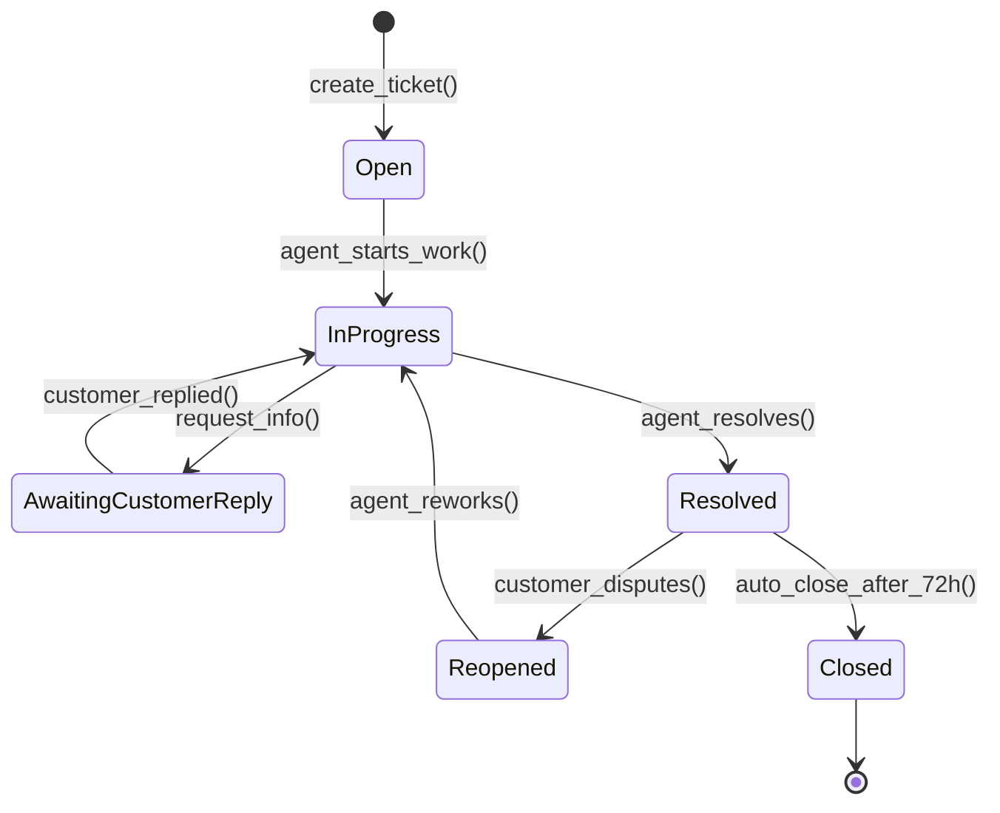
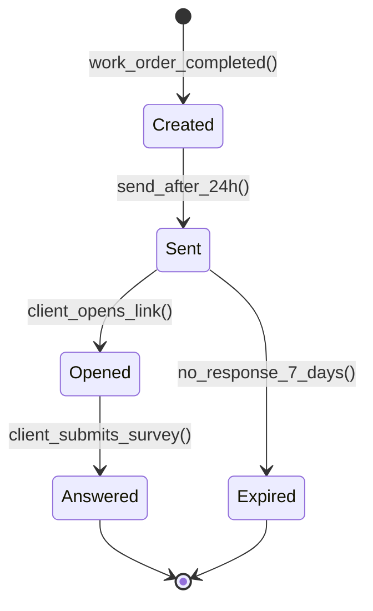
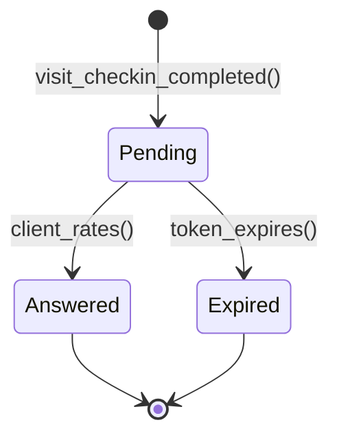
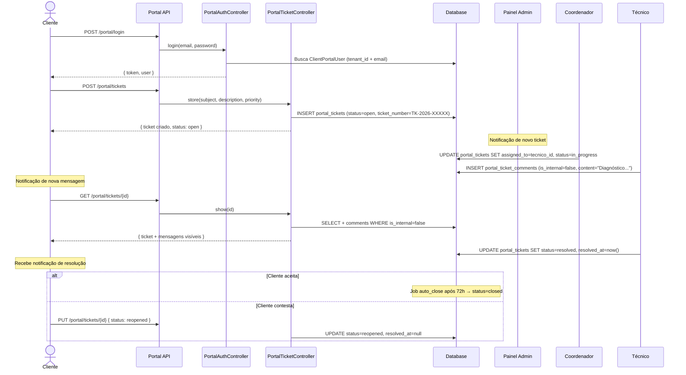
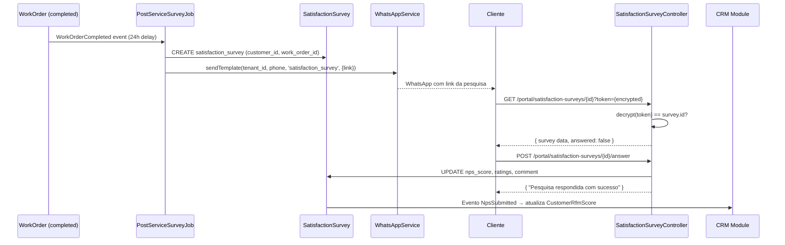

# Módulo: Portal do Cliente

> **[AI_RULE]** Documentação oficial do módulo Portal do Cliente. Este módulo provê uma interface externa (client-facing) para clientes acessarem informações de OS, orçamentos, certificados, financeiro e tickets de suporte. Autenticação completamente separada do painel administrativo.

---

## 1. Visão Geral

O Portal do Cliente é a camada de self-service que permite aos clientes da empresa interagirem com o sistema sem depender de atendentes. Funcionalidades incluem:

- **Acompanhamento de OS**: visualização de ordens de serviço, fotos e assinatura digital
- **Orçamentos**: visualização e aprovação/rejeição de orçamentos
- **Certificados de Calibração**: download de certificados com verificação de autenticidade
- **Financeiro**: visualização de faturas e status de pagamento
- **Tickets**: abertura e acompanhamento de chamados de suporte
- **Pesquisa de Satisfação**: NPS e avaliação pós-serviço
- **Equipamentos**: consulta de equipamentos cadastrados e histórico

---

## 2. Entidades (Models)

### Entidades Principais

| Model | Tabela | Descrição |
|-------|--------|-----------|
| `ClientPortalUser` | `client_portal_users` | Usuário do portal (autenticação separada de `User`) |
| `PortalTicket` | `portal_tickets` | Ticket/chamado aberto pelo cliente no portal |
| `PortalTicketComment` | `portal_ticket_comments` | Mensagem/comentário em um ticket do portal |
| `SatisfactionSurvey` | `satisfaction_surveys` | Pesquisa de satisfação externa (cliente via portal/email) |
| `NpsSurvey` | `nps_surveys` | Pesquisa NPS vinculada a OS |
| `NpsResponse` | `nps_responses` | Resposta individual de pesquisa NPS |
| `Survey` | `surveys` | Pesquisa genérica configurável pelo admin |
| `SurveyResponse` | `survey_responses` | Resposta de pesquisa genérica |
| `VisitSurvey` | `visit_surveys` | Pesquisa pós-visita técnica |

### Campos Chave — `ClientPortalUser`

```php
protected $fillable = [
    'tenant_id', 'customer_id', 'name', 'email',
    'password', 'is_active', 'last_login_at',
];

protected $casts = [
    'email_verified_at' => 'datetime',
    'password' => 'hashed',
    'last_login_at' => 'datetime',
    'is_active' => 'boolean',
];
```

- Estende `Authenticatable` (não `Model`)
- Usa traits: `HasApiTokens`, `Notifiable`, `BelongsToTenant`
- Relacionamento: `customer()` → `BelongsTo(Customer::class)`

### Campos Chave — `PortalTicket`

```php
protected $fillable = [
    'tenant_id', 'customer_id', 'created_by', 'equipment_id',
    'ticket_number', 'subject', 'description', 'priority', 'status',
    'category', 'source', 'assigned_to', 'resolved_at', 'qr_code',
];

protected $casts = [
    'resolved_at' => 'datetime',
];
```

- Relacionamentos: `customer()`, `assignee()` → `BelongsTo(User, 'assigned_to')`, `comments()` → `HasMany(PortalTicketComment)`

### Campos Chave — `PortalTicketComment`

```php
protected $fillable = [
    'tenant_id', 'portal_ticket_id', 'user_id', 'content', 'is_internal',
];

protected $casts = [
    'is_internal' => 'boolean',
];
```

- `is_internal = true`: comentário visível apenas para agentes internos
- `is_internal = false`: visível para o cliente no portal

### Campos Chave — `SatisfactionSurvey`

```php
protected $fillable = [
    'tenant_id', 'customer_id', 'work_order_id', 'nps_score',
    'service_rating', 'technician_rating', 'timeliness_rating',
    'comment', 'channel',
];

protected $casts = [
    'nps_score' => 'integer',        // 0-10 (NPS)
    'service_rating' => 'integer',    // 1-5 estrelas
    'technician_rating' => 'integer', // 1-5 estrelas
    'timeliness_rating' => 'integer', // 1-5 estrelas
];
```

- Atributo computado: `nps_category` → `promoter` (9-10), `passive` (7-8), `detractor` (0-6)
- Diferente de `WorkOrderRating` (avaliação interna feita pelo técnico/admin)

### Campos Chave — `NpsSurvey`

```php
protected $fillable = [
    'tenant_id', 'customer_id', 'work_order_id',
    'score', 'feedback', 'category', 'responded_at',
];
```

### Campos Chave — `VisitSurvey`

```php
protected $fillable = [
    'tenant_id', 'customer_id', 'checkin_id', 'user_id',
    'token', 'rating', 'comment', 'status',
    'sent_at', 'answered_at', 'expires_at',
];
```

- Status: `pending`, `answered`, `expired`
- Token gerado automaticamente via `Str::random(64)` no evento `creating`

---

## 3. Ciclos de Vida (State Machines)

### 3.1 Ciclo de Vida de Ticket do Portal



**Transições**:

- `open` → `in_progress`: Agente interno começa a trabalhar
- `in_progress` → `awaiting_customer_reply`: Agente solicita informação ao cliente
- `awaiting_customer_reply` → `in_progress`: Cliente respondeu
- `in_progress` → `resolved`: Agente resolve o ticket (preenche `resolved_at`)
- `resolved` → `reopened`: Cliente contesta a resolução
- `resolved` → `closed`: Auto-close após 72h sem atividade (Job idempotente)

### 3.2 Ciclo de Vida da Pesquisa de Satisfação



**Fluxo**:

1. `WorkOrder` atinge status `completed`
2. Após 24h, `PostServiceSurveyService` envia link por email/WhatsApp
3. Link contém token criptografado (`encrypt($survey->id)`)
4. Cliente acessa, preenche NPS (0-10) + ratings (1-5) + comentário
5. Sem resposta em 7 dias → expirada

### 3.3 Ciclo de Vida da Pesquisa de Visita



---

## 4. Guard Rails de Negócio `[AI_RULE]`

> **[AI_RULE_CRITICAL] Autenticação Separada (Token Scope)**
> O Portal do Cliente usa `PortalAuthController` com autenticação **completamente separada** do admin. `ClientPortalUser` é um model distinto de `User`, estende `Authenticatable` com `HasApiTokens`. Token Sanctum criado com scope `portal:access`. Middleware `portal.access` valida `$user->tokenCan('portal:access')`. A IA NUNCA deve reutilizar tokens ou sessões do painel administrativo no portal. Guard: `auth:sanctum` + verificação de instância `ClientPortalUser`.

> **[AI_RULE_CRITICAL] Isolamento por Customer (Não por Tenant)**
> Cliente do portal vê APENAS seus próprios dados, filtrados por `customer_id` (além do `tenant_id`). O scope de visibilidade é: `PortalTicket.where(customer_id: current_portal_user.customer_id, tenant_id: current_portal_user.tenant_id)`. Isso se aplica a tickets, OS, orçamentos, certificados e financeiro. A IA NUNCA deve retornar dados de outros customers do mesmo tenant.

> **[AI_RULE_CRITICAL] Verificação de Autenticidade de Certificados**
> Download de certificados de calibração pelo portal DEVE verificar autenticidade do documento. Endpoint `calibration-certificates/{certificate}/download` valida que o certificado pertence ao `customer_id` do portal user. Certificados são servidos como PDF com assinatura digital e QR code de verificação.

> **[AI_RULE_CRITICAL] Throttle de Login**
> Endpoint de login do portal tem throttle de 20 requests/minuto (`throttle:20,1`). Além disso, após 5 tentativas falhadas por IP+tenant+email, bloqueio de 15 minutos via Cache. Chave: `portal_login_attempts:{ip}:{tenant_id}:{email}`.

> **[AI_RULE] Aprovação de Orçamento via Portal**
> Quando o cliente aprova um orçamento no portal (`PortalQuickQuoteApprovalController`), o sistema DEVE disparar o evento `QuoteApproved` que transiciona o `Quote` para `Approved` no módulo Quotes e aciona faturamento. Endpoint: `POST portal/quotes/{quoteId}/approve`.

> **[AI_RULE] Pesquisa de Satisfação Automática (NPS Pós-Serviço)**
> `SatisfactionSurvey` é disparada automaticamente 24h após a `WorkOrder` atingir status `Completed`. O link é enviado por email/WhatsApp via `PostServiceSurveyService`. Token de acesso é `encrypt($survey->id)`, verificado via `decrypt()` no controller. Pesquisa já respondida retorna 422.

> **[AI_RULE] Auto-Close de Tickets**
> Tickets no estado `Resolved` são automaticamente fechados (`Closed`) após 72 horas sem atividade do cliente. Este Job DEVE ser idempotente — executar múltiplas vezes não deve causar efeitos colaterais.

> **[AI_RULE] Numeração Sequencial de Tickets**
> `ticket_number` é gerado sequencialmente por tenant: `TK-{YYYY}-{sequence}`. Usa `MAX(id)` em transaction para garantir unicidade. Formato: `TK-2026-000001`.

> **[AI_RULE] Comentários Internos vs Externos**
> `PortalTicketComment.is_internal` controla visibilidade. Comentários internos (`is_internal = true`) são visíveis APENAS para agentes do painel admin. O portal do cliente NUNCA deve retornar comentários internos na listagem.

> **[AI_RULE_CRITICAL]** Portal do cliente DEVE exibir APENAS dados do tenant do cliente logado. NUNCA cross-tenant.

> **[AI_RULE_CRITICAL]** Acesso de convidado (guest) DEVE ser via token temporário com TTL de 24h. Token expira após uso único.

> **[AI_RULE]** Dados sensíveis (valores de invoice, dados de contrato) DEVEM ser mascarados para roles com permissão limitada.

> **[AI_RULE_CRITICAL] Eternal Lead (CRM Feedback Loop)**
> Se uma Pesquisa de Satisfação (`SatisfactionSurvey` ou `VisitSurvey`) retornar CSAT baixo (ex: NPS Detrator 0-6) ou houver rejeição de orçamentos com recusa explícita de valor/concorrente, o sistema DEVE acionar o módulo CRM imediatamente. Um `CrmLead` focado em retenção (Customer Success) deve ser gerado. O feedback crítico direto do cliente no portal é um gatilho de Eternal Lead.

---

## 5. Comportamento Integrado (Cross-Domain)

| Direção | Módulo | Integração |
|---------|--------|------------|
| ← | **Service-Calls** | `PortalController::newServiceCall()` cria chamado técnico a partir do portal |
| ← | **Quotes** | Portal exibe orçamentos do cliente; aprovação transiciona `Quote` → `Approved` |
| ← | **Lab** | Certificados de calibração disponíveis para download com verificação de autenticidade |
| ← | **Finance** | Portal exibe faturas e status financeiro via `PortalController::financials()` |
| ← | **WorkOrders** | Portal exibe OS do cliente com fotos e permite assinatura digital |
| → | **CRM** | Respostas de NPS alimentam `CustomerRfmScore` para segmentação automática |
| → | **Helpdesk** | `PortalTicket` cria `ServiceCall` interno automaticamente com referência cruzada |
| ← | **Integrations** | Web Push para notificações do portal; WhatsApp para envio de pesquisas |
| ↔ | **WorkOrders** | OS completada dispara pesquisa de satisfação; cliente acompanha OS pelo portal |

---

## 6. Contratos de API (JSON)

### 6.1 Login no Portal

```http
POST /api/v1/portal/login
Content-Type: application/json
```

**Request:**

```json
{
  "tenant_id": 1,
  "email": "cliente@empresa.com",
  "password": "senhaSegura123"
}
```

**Response (200):**

```json
{
  "success": true,
  "data": {
    "token": "1|abc123...",
    "user": {
      "id": 42,
      "tenant_id": 1,
      "customer_id": 15,
      "name": "João Silva",
      "email": "cliente@empresa.com",
      "is_active": true,
      "last_login_at": "2026-03-24T10:30:00Z",
      "customer": {
        "id": 15,
        "name": "Empresa ABC Ltda",
        "document": "12.345.678/0001-90"
      }
    }
  }
}
```

### 6.2 Criação de Ticket

```http
POST /api/v1/portal/tickets
Authorization: Bearer {portal-token}
Content-Type: application/json
```

**Request:**

```json
{
  "subject": "Equipamento com defeito",
  "description": "Balança modelo XYZ apresentando erro de leitura após calibração.",
  "priority": "high",
  "category": "manutencao",
  "equipment_id": 789
}
```

**Response (201):**

```json
{
  "success": true,
  "data": {
    "id": 156,
    "ticket_number": "TK-2026-000042",
    "tenant_id": 1,
    "customer_id": 15,
    "subject": "Equipamento com defeito",
    "description": "Balança modelo XYZ apresentando erro de leitura após calibração.",
    "priority": "high",
    "status": "open",
    "category": "manutencao",
    "source": "portal",
    "created_by": 42,
    "assigned_to": null,
    "resolved_at": null,
    "created_at": "2026-03-24T10:35:00Z"
  }
}
```

### 6.3 Aprovação de Orçamento

```http
POST /api/v1/portal/quotes/{quoteId}/approve
Authorization: Bearer {portal-token}
```

**Response (200):**

```json
{
  "success": true,
  "message": "Orçamento aprovado com sucesso.",
  "data": {
    "quote_id": 88,
    "status": "approved",
    "approved_at": "2026-03-24T11:00:00Z",
    "approved_by_portal_user": 42
  }
}
```

### 6.4 Download de Certificado

```http
GET /api/v1/portal/certificates
Authorization: Bearer {portal-token}
```

**Response (200):**

```json
{
  "success": true,
  "data": [
    {
      "id": 301,
      "certificate_number": "CERT-2026-001234",
      "equipment_name": "Balança Analítica XYZ-500",
      "calibration_date": "2026-03-15",
      "next_calibration_date": "2027-03-15",
      "status": "valid",
      "download_url": "/api/v1/client-portal/calibration-certificates/301/download"
    }
  ]
}
```

### 6.5 Resposta de Pesquisa de Satisfação

```http
POST /api/v1/portal/satisfaction-surveys/{surveyId}/answer?token={encrypted_token}
Content-Type: application/json
```

**Request:**

```json
{
  "token": "eyJpdiI6Ik...",
  "nps_score": 9,
  "service_rating": 5,
  "technician_rating": 4,
  "timeliness_rating": 5,
  "comment": "Excelente atendimento, técnico muito profissional."
}
```

**Response (200):**

```json
{
  "success": true,
  "message": "Pesquisa respondida com sucesso.",
  "data": {
    "id": 77,
    "nps_score": 9,
    "nps_category": "promoter",
    "service_rating": 5,
    "technician_rating": 4,
    "timeliness_rating": 5,
    "comment": "Excelente atendimento, técnico muito profissional."
  }
}
```

---

## 7. Permissões (RBAC)

### 7.1 Permissoes do Modulo Portal

| Permissao | Descricao | Contexto |
|-----------|-----------|----------|
| `portal.client.view` | Visualizar dados do portal (OS, certificados, financeiro) | Admin |
| `portal.client.create` | Criar chamados via portal (admin side) | Admin |
| `quotes.quote.approve` | Aprovar orcamentos via portal | Admin / Portal |
| `service_calls.service_call.view` | Visualizar chamados tecnicos | Admin |
| `os.work_order.view` | Visualizar ordens de servico | Admin |
| `cadastros.customer.view` | Dashboard executivo do portal | Admin |

### 7.2 Matriz de Papeis

| Acao | portal_client | customer_admin | support | manager | admin |
|------|--------------|----------------|---------|---------|-------|
| Ver proprias OS e status | X | X | X | X | X |
| Ver certificados de calibracao | X | X | X | X | X |
| Ver faturas e boletos | X | X | X | X | X |
| Abrir chamado tecnico | X | X | X | X | X |
| Reabrir chamado | X | X | X | X | X |
| Aprovar orcamento | - | X | - | X | X |
| Recusar orcamento | - | X | - | X | X |
| Ver dashboard executivo | - | X | - | X | X |
| Criar chamado (admin side) | - | - | X | X | X |
| Ver todos os dados do portal (admin) | - | - | X | X | X |
| Gerenciar configuracoes do portal | - | - | - | - | X |

> **[AI_RULE]** O portal do cliente usa autenticacao Sanctum com scope `portal:access` e NAO usa o sistema de permissoes RBAC do admin. O papel `portal_client` e controlado pelo token Sanctum, enquanto `customer_admin` e um flag na tabela `portal_users`. O RBAC acima (support, manager, admin) se aplica exclusivamente a endpoints admin que interagem com dados do portal.

---

## 8. Rotas da API

### Portal Público (sem autenticação)

| Método | Rota | Controller | Ação |
|--------|------|------------|------|
| `POST` | `/api/v1/portal/login` | `PortalAuthController@login` | Login do cliente |
| `GET` | `/api/v1/portal/satisfaction-surveys/{survey}` | `SatisfactionSurveyController@show` | Ver pesquisa (via token) |
| `POST` | `/api/v1/portal/satisfaction-surveys/{survey}/answer` | `SatisfactionSurveyController@answer` | Responder pesquisa |

### Portal Autenticado (`auth:sanctum` + `portal.access`)

| Método | Rota | Controller | Ação |
|--------|------|------------|------|
| `POST` | `/api/v1/portal/logout` | `PortalAuthController@logout` | Logout |
| `GET` | `/api/v1/portal/me` | `PortalAuthController@me` | Dados do usuário logado |
| `GET` | `/api/v1/portal/work-orders` | `PortalController@workOrders` | Listar OS do cliente |
| `GET` | `/api/v1/portal/work-orders/{id}` | `PortalController@workOrderShow` | Detalhes da OS |
| `GET` | `/api/v1/portal/work-orders/{id}/photos` | `PortalController@workOrderPhotos` | Fotos da OS |
| `POST` | `/api/v1/portal/work-orders/{id}/signature` | `PortalController@submitSignature` | Assinatura digital |
| `GET` | `/api/v1/portal/quotes` | `PortalController@quotes` | Listar orçamentos |
| `POST/PUT` | `/api/v1/portal/quotes/{id}/status` | `PortalController@updateQuoteStatus` | Aprovar/rejeitar orçamento |
| `GET` | `/api/v1/portal/financials` | `PortalController@financials` | Faturas do cliente |
| `GET` | `/api/v1/portal/certificates` | `PortalController@certificates` | Certificados de calibração |
| `GET` | `/api/v1/portal/equipment` | `PortalController@equipment` | Equipamentos do cliente |
| `POST` | `/api/v1/portal/service-calls` | `PortalController@newServiceCall` | Abrir chamado técnico |
| `GET` | `/api/v1/portal/tickets` | `PortalTicketController@index` | Listar tickets |
| `POST` | `/api/v1/portal/tickets` | `PortalTicketController@store` | Criar ticket |
| `GET` | `/api/v1/portal/tickets/{id}` | `PortalTicketController@show` | Detalhes do ticket |
| `PUT` | `/api/v1/portal/tickets/{id}` | `PortalTicketController@update` | Atualizar ticket |
| `POST` | `/api/v1/portal/tickets/{id}/messages` | `PortalTicketController@addMessage` | Adicionar mensagem |

### Portal Admin (endpoints internos)

| Método | Rota | Controller | Ação |
|--------|------|------------|------|
| `POST` | `/api/v1/client-portal/service-calls` | `ClientPortalController@createServiceCallFromPortal` | Criar chamado (admin) |
| `GET` | `/api/v1/client-portal/work-orders/track` | `ClientPortalController@trackWorkOrders` | Rastrear OS |
| `GET` | `/api/v1/client-portal/service-calls/track` | `ClientPortalController@trackServiceCalls` | Rastrear chamados |
| `GET` | `/api/v1/client-portal/calibration-certificates` | `ClientPortalController@calibrationCertificates` | Listar certificados |
| `GET` | `/api/v1/client-portal/calibration-certificates/{id}/download` | `ClientPortalController@downloadCertificate` | Download PDF |
| `GET` | `/api/v1/portal/dashboard/{customerId}` | `PortalClienteController@executiveDashboard` | Dashboard executivo |
| `POST` | `/api/v1/portal/certificates/batch-download` | `PortalClienteController@batchCertificateDownload` | Download em lote |
| `POST` | `/api/v1/portal/tickets/qr-code` | `PortalClienteController@openTicketByQrCode` | Abrir ticket via QR |
| `POST` | `/api/v1/portal/quotes/{quoteId}/approve` | `PortalQuickQuoteApprovalController@approve` | Aprovação rápida |

---

## 9. Form Requests (Validacao de Entrada)

> **[AI_RULE]** Todo endpoint de criacao/atualizacao DEVE usar Form Request. Validacao inline em controllers e PROIBIDA. O Portal do Cliente usa `ClientPortalUser` — acesso via scope `portal:access`.

### 9.1 PortalLoginRequest

**Classe**: `App\Http\Requests\Portal\PortalLoginRequest`
**Endpoint**: `POST /api/v1/portal/login`

```php
public function rules(): array
{
    return [
        'tenant_id' => ['required', 'integer', 'exists:tenants,id'],
        'email'     => ['required', 'email', 'max:255'],
        'password'  => ['required', 'string', 'max:255'],
    ];
}
```

> **[AI_RULE]** Endpoint publico — `authorize()` retorna `true`. Rate limit: 20 req/min por IP + 5 tentativas por IP+tenant+email (bloqueio 15min via Cache).

### 9.2 StorePortalTicketRequest

**Classe**: `App\Http\Requests\Portal\StorePortalTicketRequest`
**Endpoint**: `POST /api/v1/portal/tickets`

```php
public function authorize(): bool
{
    return $this->user() instanceof \App\Models\ClientPortalUser;
}

public function rules(): array
{
    return [
        'subject'      => ['required', 'string', 'max:255'],
        'description'  => ['required', 'string', 'max:5000'],
        'priority'     => ['required', 'string', 'in:low,medium,high,critical'],
        'category'     => ['nullable', 'string', 'max:100'],
        'equipment_id' => ['nullable', 'integer', 'exists:equipment,id'],
    ];
}
```

> **[AI_RULE]** O `customer_id` e `source` sao preenchidos automaticamente pelo controller — NUNCA aceitar do body.

### 9.3 UpdatePortalTicketRequest

**Classe**: `App\Http\Requests\Portal\UpdatePortalTicketRequest`
**Endpoint**: `PUT /api/v1/portal/tickets/{id}`

```php
public function authorize(): bool
{
    $ticket = $this->route('ticket');
    return $this->user() instanceof \App\Models\ClientPortalUser
        && $ticket->customer_id === $this->user()->customer_id;
}

public function rules(): array
{
    return [
        'status' => ['sometimes', 'string', 'in:reopened'],
    ];
}
```

> **[AI_RULE]** Cliente so pode transicionar para `reopened` se o ticket estiver em `resolved`. Outros status sao gerenciados apenas por agentes internos.

### 9.4 AddTicketMessageRequest

**Classe**: `App\Http\Requests\Portal\AddTicketMessageRequest`
**Endpoint**: `POST /api/v1/portal/tickets/{id}/messages`

```php
public function authorize(): bool
{
    $ticket = $this->route('ticket');
    return $this->user() instanceof \App\Models\ClientPortalUser
        && $ticket->customer_id === $this->user()->customer_id;
}

public function rules(): array
{
    return [
        'content' => ['required', 'string', 'max:10000'],
    ];
}
```

> **[AI_RULE]** Mensagens do portal sao SEMPRE `is_internal = false`. O controller DEVE forcar este valor.

### 9.5 ApproveQuoteRequest

**Classe**: `App\Http\Requests\Portal\ApproveQuoteRequest`
**Endpoint**: `POST /api/v1/portal/quotes/{quoteId}/approve`

```php
public function authorize(): bool
{
    return $this->user() instanceof \App\Models\ClientPortalUser;
}

public function rules(): array
{
    return [];
}
```

> **[AI_RULE]** Controller DEVE verificar que o `Quote` pertence ao `customer_id` do portal user e que o status atual permite aprovacao (`sent` → `approved`).

### 9.6 UpdateQuoteStatusRequest

**Classe**: `App\Http\Requests\Portal\UpdateQuoteStatusRequest`
**Endpoint**: `POST/PUT /api/v1/portal/quotes/{id}/status`

```php
public function authorize(): bool
{
    return $this->user() instanceof \App\Models\ClientPortalUser;
}

public function rules(): array
{
    return [
        'status' => ['required', 'string', 'in:approved,rejected'],
        'reason' => ['required_if:status,rejected', 'string', 'max:1000'],
    ];
}
```

### 9.7 AnswerSurveyRequest

**Classe**: `App\Http\Requests\Portal\AnswerSurveyRequest`
**Endpoint**: `POST /api/v1/portal/satisfaction-surveys/{surveyId}/answer`

```php
public function authorize(): bool
{
    return true; // Acesso via token criptografado, verificado no controller
}

public function rules(): array
{
    return [
        'token'              => ['required', 'string'],
        'nps_score'          => ['required', 'integer', 'between:0,10'],
        'service_rating'     => ['required', 'integer', 'between:1,5'],
        'technician_rating'  => ['required', 'integer', 'between:1,5'],
        'timeliness_rating'  => ['required', 'integer', 'between:1,5'],
        'comment'            => ['nullable', 'string', 'max:2000'],
    ];
}
```

> **[AI_RULE]** Controller DEVE validar `decrypt(token) == survey->id`. Pesquisa ja respondida retorna 422.

### 9.8 SubmitSignatureRequest

**Classe**: `App\Http\Requests\Portal\SubmitSignatureRequest`
**Endpoint**: `POST /api/v1/portal/work-orders/{id}/signature`

```php
public function authorize(): bool
{
    return $this->user() instanceof \App\Models\ClientPortalUser;
}

public function rules(): array
{
    return [
        'signature' => ['required', 'string'], // Base64 PNG da assinatura
    ];
}
```

### 9.9 CreateServiceCallRequest

**Classe**: `App\Http\Requests\Portal\CreateServiceCallRequest`
**Endpoint**: `POST /api/v1/portal/service-calls`

```php
public function authorize(): bool
{
    return $this->user() instanceof \App\Models\ClientPortalUser;
}

public function rules(): array
{
    return [
        'description'  => ['required', 'string', 'max:5000'],
        'equipment_id' => ['nullable', 'integer', 'exists:equipment,id'],
        'priority'     => ['nullable', 'string', 'in:low,medium,high,critical'],
    ];
}
```

### 9.10 OpenTicketByQrCodeRequest

**Classe**: `App\Http\Requests\Portal\OpenTicketByQrCodeRequest`
**Endpoint**: `POST /api/v1/portal/tickets/qr-code`

```php
public function authorize(): bool
{
    return $this->user() instanceof \App\Models\ClientPortalUser
        || $this->user()->can('portal.client.create');
}

public function rules(): array
{
    return [
        'qr_code' => ['required', 'string', 'max:500'],
    ];
}
```

---

## 10. Diagramas de Sequência

### 10.1 Cliente Abre Ticket e Recebe Resolução



### 10.2 Pesquisa de Satisfação Pós-Serviço



---

## 11. Testes Requeridos (BDD)

### 11.1 Autenticação

```gherkin
Funcionalidade: Login no Portal do Cliente

  Cenário: Login com credenciais válidas
    Dado que existe um ClientPortalUser ativo com email "cliente@test.com"
    Quando envio POST /api/v1/portal/login com email e senha corretos
    Então recebo status 200
    E a resposta contém "token" com scope "portal:access"
    E a resposta contém dados do usuário com customer carregado

  Cenário: Login com senha incorreta
    Dado que existe um ClientPortalUser ativo
    Quando envio POST /api/v1/portal/login com senha incorreta
    Então recebo status 422
    E o contador de tentativas incrementa

  Cenário: Bloqueio após 5 tentativas falhadas
    Dado que já falhei 5 vezes com o mesmo IP+tenant+email
    Quando envio POST /api/v1/portal/login
    Então recebo status 429
    E a mensagem informa tempo restante de bloqueio

  Cenário: Login com conta inativa
    Dado que existe um ClientPortalUser com is_active=false
    Quando envio POST /api/v1/portal/login com credenciais corretas
    Então recebo status 422
    E a mensagem informa "Sua conta esta inativa"
```

### 11.2 Tickets

```gherkin
Funcionalidade: Gestão de Tickets no Portal

  Cenário: Criar ticket com sucesso
    Dado que estou autenticado como ClientPortalUser
    Quando envio POST /api/v1/portal/tickets com subject e description
    Então recebo status 201
    E o ticket tem status "open" e ticket_number sequencial
    E o customer_id é o do meu ClientPortalUser

  Cenário: Listar apenas meus tickets
    Dado que existem tickets de múltiplos customers no mesmo tenant
    Quando envio GET /api/v1/portal/tickets
    Então recebo apenas tickets onde customer_id = meu customer_id

  Cenário: Adicionar mensagem a ticket
    Dado que tenho um ticket aberto
    Quando envio POST /api/v1/portal/tickets/{id}/messages
    Então a mensagem é criada com is_internal=false
    E é visível no portal

  Cenário: Não ver comentários internos
    Dado que meu ticket tem comentários com is_internal=true
    Quando envio GET /api/v1/portal/tickets/{id}
    Então os comentários internos NÃO aparecem na resposta
```

### 11.3 Pesquisa de Satisfação

```gherkin
Funcionalidade: Pesquisa de Satisfação

  Cenário: Responder pesquisa com token válido
    Dado que existe uma SatisfactionSurvey não respondida
    E tenho o token criptografado correto
    Quando envio POST /answer com nps_score=9 e ratings
    Então recebo status 200
    E a pesquisa é atualizada com os valores

  Cenário: Tentar responder pesquisa já respondida
    Dado que a SatisfactionSurvey já tem nps_score preenchido
    Quando envio POST /answer
    Então recebo status 422 "Pesquisa já respondida"

  Cenário: Token inválido
    Dado que envio um token que não decripta para o survey.id
    Quando envio GET /show ou POST /answer
    Então recebo status 404 "Pesquisa não encontrada"
```

---

## 12. Migrations Relacionadas

| Migration | Descrição |
|-----------|-----------|
| `2026_02_09_500001_create_client_portal_tables` | Tabelas `client_portal_users`, base do portal |
| `2026_02_14_000000_create_nps_responses_table` | Tabela `nps_responses` |
| `2026_02_14_060000_create_portal_integration_security_tables` | Segurança e integrações do portal |
| `2026_02_18_100003_create_hr_contracts_portal_metrology_infra_features` | Features adicionais do portal |
| `2026_03_16_500000_create_portal_tickets_table` | Tabela `portal_tickets` |
| `2026_03_16_500001_create_portal_ticket_messages_table` | Tabela `portal_ticket_messages` |

---

## 13. Observabilidade e Métricas

### Métricas Chave

| Métrica | Descrição | Alerta |
|---------|-----------|--------|
| `portal.login.attempts` | Tentativas de login por minuto | > 50/min → possível brute force |
| `portal.login.failures` | Falhas de login por IP | > 5 em 15 min → bloqueio automático |
| `portal.tickets.created` | Tickets criados por dia | Tendência de alta → possível problema |
| `portal.tickets.resolution_time` | Tempo médio de resolução | > 48h → escalar |
| `portal.nps.score_avg` | NPS médio das pesquisas | < 7 → alerta para gestão |
| `portal.surveys.response_rate` | Taxa de resposta de pesquisas | < 20% → revisar canal de envio |
| `portal.certificates.downloads` | Downloads de certificados/dia | Monitoramento de uso |

### Logs Estruturados

```
[Portal] login_success user_id=42 tenant_id=1 ip=192.168.1.100
[Portal] login_failed email=x@y.com tenant_id=1 ip=192.168.1.100 attempts=3
[Portal] ticket_created ticket_id=156 customer_id=15 tenant_id=1
[Portal] quote_approved quote_id=88 portal_user_id=42 tenant_id=1
[Portal] survey_answered survey_id=77 nps_score=9 customer_id=15
[Portal] certificate_downloaded cert_id=301 customer_id=15 tenant_id=1
```

---

## Test Specifications

### Feature Tests

- [ ] Cliente logado vê apenas seus dados (multi-tenant isolation)
- [ ] Guest token expira após 24h
- [ ] Guest token de uso único não pode ser reutilizado
- [ ] Dados de outro tenant retornam 403
- [ ] Dados sensíveis mascarados para role 'viewer'

### Edge Cases

- [ ] Token expirado retorna 401 com mensagem adequada
- [ ] Tentativa de acessar recurso de outro tenant é auditada
- [ ] Portal funciona offline (cache de últimos dados)

---

## Fluxos Relacionados

| Fluxo | Descrição |
|-------|-----------|
| [Admissão de Funcionário](file:///c:/PROJETOS/sistema/docs/fluxos/ADMISSAO-FUNCIONARIO.md) | Processo documentado em `docs/fluxos/ADMISSAO-FUNCIONARIO.md` |
| [Ciclo de Ticket de Suporte](file:///c:/PROJETOS/sistema/docs/fluxos/CICLO-TICKET-SUPORTE.md) | Processo documentado em `docs/fluxos/CICLO-TICKET-SUPORTE.md` |
| [Cobrança e Renegociação](file:///c:/PROJETOS/sistema/docs/fluxos/COBRANCA-RENEGOCIACAO.md) | Processo documentado em `docs/fluxos/COBRANCA-RENEGOCIACAO.md` |
| [Contestação de Fatura](file:///c:/PROJETOS/sistema/docs/fluxos/CONTESTACAO-FATURA.md) | Processo documentado em `docs/fluxos/CONTESTACAO-FATURA.md` |
| [Despacho e Atribuição](file:///c:/PROJETOS/sistema/docs/fluxos/DESPACHO-ATRIBUICAO.md) | Processo documentado em `docs/fluxos/DESPACHO-ATRIBUICAO.md` |
| [Fechamento Mensal](file:///c:/PROJETOS/sistema/docs/fluxos/FECHAMENTO-MENSAL.md) | Processo documentado em `docs/fluxos/FECHAMENTO-MENSAL.md` |
| [Onboarding de Cliente](file:///c:/PROJETOS/sistema/docs/fluxos/ONBOARDING-CLIENTE.md) | Processo documentado em `docs/fluxos/ONBOARDING-CLIENTE.md` |
| [Portal do Cliente](file:///c:/PROJETOS/sistema/docs/fluxos/PORTAL-CLIENTE.md) | Processo documentado em `docs/fluxos/PORTAL-CLIENTE.md` |

---

## Inventario Completo do Codigo

> **[AI_RULE]** Secao gerada automaticamente a partir do codigo-fonte. Lista todos os artefatos reais do modulo Portal no repositorio.

### Controllers (5 arquivos no namespace Portal + 2 extras)

| Arquivo | Classe | Metodos |
|---------|--------|---------|
| `backend/app/Http/Controllers/Api/V1/Portal/PortalAuthController.php` | `PortalAuthController` | `login`, `me`, `logout` |
| `backend/app/Http/Controllers/Api/V1/Portal/PortalController.php` | `PortalController` | `workOrders`, `workOrderShow`, `quotes`, `updateQuoteStatus`, `financials`, `certificates`, `equipment`, `newServiceCall`, `workOrderPhotos`, `submitSignature` |
| `backend/app/Http/Controllers/Api/V1/Portal/PortalTicketController.php` | `PortalTicketController` | `index`, `store`, `show`, `update`, `addMessage` |
| `backend/app/Http/Controllers/Api/V1/Portal/PortalQuickQuoteApprovalController.php` | `PortalQuickQuoteApprovalController` | `approve` |
| `backend/app/Http/Controllers/Api/V1/Portal/SatisfactionSurveyController.php` | `SatisfactionSurveyController` | `show`, `answer` |
| `backend/app/Http/Controllers/Api/V1/ClientPortalController.php` | `ClientPortalController` | (controller legacy) |
| `backend/app/Http/Controllers/Api/V1/PortalClienteController.php` | `PortalClienteController` | (controller legacy pt-BR) |

### Magic Token Link System

O sistema de aprovacao publica de orcamentos usa magic tokens:

| Arquivo | Classe | Metodos | Descricao |
|---------|--------|---------|-----------|
| `backend/app/Http/Controllers/Api/V1/QuotePublicApprovalController.php` | `QuotePublicApprovalController` | `show`, `approve`, `reject` | Aprovacao/rejeicao de orcamento via link magico (sem auth) |

**Rotas publicas (sem autenticacao):**

- `GET /quotes/proposal/{magicToken}` — Visualizar orcamento via magic token
- `POST /quotes/proposal/{magicToken}/approve` — Aprovar orcamento via magic token
- `POST /quotes/proposal/{magicToken}/reject` — Rejeitar orcamento via magic token

### FormRequests (21 arquivos)

| Arquivo | Classe |
|---------|--------|
| `backend/app/Http/Requests/Portal/PortalLoginRequest.php` | `PortalLoginRequest` |
| `backend/app/Http/Requests/Portal/StorePortalTicketRequest.php` | `StorePortalTicketRequest` |
| `backend/app/Http/Requests/Portal/UpdatePortalTicketRequest.php` | `UpdatePortalTicketRequest` |
| `backend/app/Http/Requests/Portal/AddPortalTicketMessageRequest.php` | `AddPortalTicketMessageRequest` |
| `backend/app/Http/Requests/Portal/UpdateQuoteStatusRequest.php` | `UpdateQuoteStatusRequest` |
| `backend/app/Http/Requests/Portal/NewServiceCallRequest.php` | `NewServiceCallRequest` |
| `backend/app/Http/Requests/Portal/CreateServiceCallFromPortalRequest.php` | `CreateServiceCallFromPortalRequest` |
| `backend/app/Http/Requests/Portal/OpenTicketByQrCodeRequest.php` | `OpenTicketByQrCodeRequest` |
| `backend/app/Http/Requests/Portal/SubmitNpsRequest.php` | `SubmitNpsRequest` |
| `backend/app/Http/Requests/Portal/SubmitSatisfactionSurveyResponseRequest.php` | `SubmitSatisfactionSurveyResponseRequest` |
| `backend/app/Http/Requests/Portal/StoreWorkOrderSignatureRequest.php` | `StoreWorkOrderSignatureRequest` |
| `backend/app/Http/Requests/Portal/StoreCustomerLocationRequest.php` | `StoreCustomerLocationRequest` |
| `backend/app/Http/Requests/Portal/StoreKnowledgeBaseArticleRequest.php` | `StoreKnowledgeBaseArticleRequest` |
| `backend/app/Http/Requests/Portal/SendChatMessageRequest.php` | `SendChatMessageRequest` |
| `backend/app/Http/Requests/Portal/RegisterPushSubscriptionRequest.php` | `RegisterPushSubscriptionRequest` |
| `backend/app/Http/Requests/Portal/BatchCertificateDownloadRequest.php` | `BatchCertificateDownloadRequest` |
| `backend/app/Http/Requests/Portal/BiSelfServiceReportRequest.php` | `BiSelfServiceReportRequest` |
| `backend/app/Http/Requests/Portal/AvailableSlotsRequest.php` | `AvailableSlotsRequest` |
| `backend/app/Http/Requests/Portal/BookSlotRequest.php` | `BookSlotRequest` |
| `backend/app/Http/Requests/Portal/OneClickApprovalRequest.php` | `OneClickApprovalRequest` |
| `backend/app/Http/Requests/Portal/UpdateWhiteLabelConfigRequest.php` | `UpdateWhiteLabelConfigRequest` |

### Models (3 arquivos)

| Arquivo | Classe | Relacionamentos |
|---------|--------|----------------|
| `backend/app/Models/ClientPortalUser.php` | `ClientPortalUser` | `customer()` — BelongsTo Customer |
| `backend/app/Models/PortalTicket.php` | `PortalTicket` | `customer()`, `assignee()`, `comments()` |
| `backend/app/Models/PortalTicketComment.php` | `PortalTicketComment` | `ticket()`, `user()` |

### Rotas (arquivo: `backend/routes/api.php`)

| Metodo | Rota | Controller | Descricao |
|--------|------|------------|-----------|
| `POST` | `/api/v1/portal/login` | `PortalAuthController@login` | Login do cliente (throttle: 20/min) |
| `POST` | `/api/v1/portal/logout` | `PortalAuthController@logout` | Logout |
| `GET` | `/api/v1/portal/me` | `PortalAuthController@me` | Dados do cliente autenticado |
| `GET` | `/api/v1/portal/work-orders` | `PortalController@workOrders` | Listar OS do cliente |
| `GET` | `/api/v1/portal/work-orders/{wo}` | `PortalController@workOrderShow` | Detalhar OS |
| `GET` | `/api/v1/portal/quotes` | `PortalController@quotes` | Listar orcamentos |
| `POST/PUT` | `/api/v1/portal/quotes/{id}/status` | `PortalController@updateQuoteStatus` | Aprovar/rejeitar orcamento |
| `GET` | `/api/v1/portal/financials` | `PortalController@financials` | Listar faturas e pagamentos |
| `GET` | `/api/v1/portal/certificates` | `PortalController@certificates` | Listar certificados de calibracao |
| `GET` | `/api/v1/portal/equipment` | `PortalController@equipment` | Listar equipamentos do cliente |
| `POST` | `/api/v1/portal/service-calls` | `PortalController@newServiceCall` | Abrir chamado de servico |
| `GET` | `/api/v1/portal/work-orders/{wo}/photos` | `PortalController@workOrderPhotos` | Fotos da OS |
| `POST` | `/api/v1/portal/work-orders/{wo}/signature` | `PortalController@submitSignature` | Assinar OS digitalmente |
| `GET` | `/api/v1/portal/tickets` | `PortalTicketController@index` | Listar tickets |
| `POST` | `/api/v1/portal/tickets` | `PortalTicketController@store` | Criar ticket |
| `GET` | `/api/v1/portal/tickets/{id}` | `PortalTicketController@show` | Detalhar ticket |
| `PUT` | `/api/v1/portal/tickets/{id}` | `PortalTicketController@update` | Atualizar ticket |
| `POST` | `/api/v1/portal/tickets/{id}/messages` | `PortalTicketController@addMessage` | Adicionar mensagem ao ticket |

### Frontend — Paginas (10 arquivos)

| Arquivo | Descricao |
|---------|-----------|
| `frontend/src/pages/portal/PortalLoginPage.tsx` | Pagina de login do portal do cliente |
| `frontend/src/pages/portal/PortalDashboardPage.tsx` | Dashboard do cliente com resumo de OS, orcamentos e financeiro |
| `frontend/src/pages/portal/PortalWorkOrdersPage.tsx` | Lista de ordens de servico do cliente |
| `frontend/src/pages/portal/PortalWorkOrderDetailPage.tsx` | Detalhe da OS com fotos e assinatura |
| `frontend/src/pages/portal/PortalQuotesPage.tsx` | Lista de orcamentos com aprovacao/rejeicao |
| `frontend/src/pages/portal/PortalFinancialsPage.tsx` | Faturas, pagamentos e pendencias financeiras |
| `frontend/src/pages/portal/PortalCertificatesPage.tsx` | Certificados de calibracao para download |
| `frontend/src/pages/portal/PortalEquipmentPage.tsx` | Equipamentos do cliente com historico |
| `frontend/src/pages/portal/PortalServiceCallPage.tsx` | Abertura de chamado de servico |
| `frontend/src/pages/portal/PortalTicketsPage.tsx` | Tickets de suporte com mensagens |

### Frontend — Layout e Store

| Arquivo | Descricao |
|---------|-----------|
| `frontend/src/components/layout/PortalLayout.tsx` | Layout base do portal (header, sidebar, footer) |
| `frontend/src/stores/portal-auth-store.ts` | Zustand store para autenticacao do portal |
| `frontend/src/features/quotes/portal.ts` | Funcoes de aprovacao de orcamento no portal |

### Frontend — Testes

| Arquivo |
|---------|
| `frontend/src/__tests__/pages/PortalDashboardPage.test.tsx` |
| `frontend/src/__tests__/pages/PortalFinancialsPage.test.tsx` |
| `frontend/src/__tests__/pages/PortalQuotesPage.test.tsx` |
| `frontend/src/__tests__/pages/PortalTicketsPage.test.tsx` |
| `frontend/src/__tests__/pages/PortalWorkOrdersPage.test.tsx` |
| `frontend/src/__tests__/stores/portal-auth-store.test.ts` |
| `frontend/src/__tests__/features/quotes-portal.test.ts` |

## Checklist de Implementacao

- [ ] Rotas B2B: Separação de rotas `/api/b2b` ou escopo próprio `B2bAuthMiddleware`.
- [ ] Filtro Automático por Empresa do Usuário: Modelos de Escopo Global obrigando queries a terem `where('customer_id', user->customer_id)`.
- [ ] Extrato do Cliente: Endpoints read-only das Faturas (Módulo Finance) com autorização apenas das faturas próprias.
