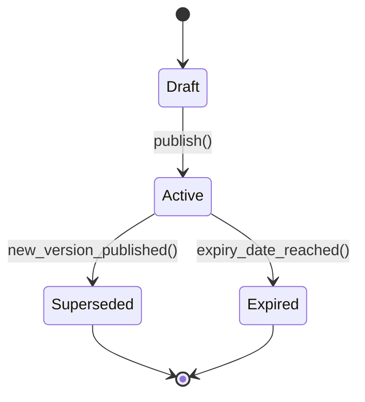
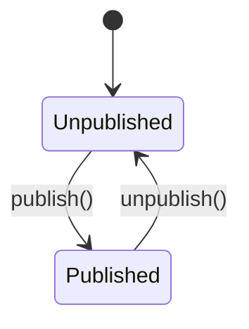

# Módulo: Pricing & Catálogo de Serviços

> **Status de Implementação:** ⚠️ PARCIAL — Este módulo possui apenas 2 endpoints fragmentados em outros controllers (AIAnalyticsController, InmetroAdvancedController). Não possui controller, model ou migration dedicados. Implementação completa planejada para fases futuras.

> **[AI_RULE]** Documentação Level C Maximum — referência canônica para IA e desenvolvedores.

---

## 1. Visão Geral

O módulo de Pricing centraliza toda a precificação do sistema. Gerencia tabelas de preços versionadas, catálogos de serviços publicáveis, histórico de alterações de preço, categorias de serviço, checklists operacionais e cálculo de custo de mão de obra (encargos CLT).

Componentes principais:

- **PriceTable**+**PriceTableItem** — tabelas de preço com items polimórficos (Product ou Service)
- **PriceHistory** — auditoria completa de alterações de preço (polimórfico)
- **ServiceCatalog**+**ServiceCatalogItem** — catálogo publicável com slug único para URL pública
- **Service**+**ServiceCategory** — cadastro de serviços com preço base, tempo estimado e skills
- **ServiceChecklist**+**ServiceChecklistItem** — checklists operacionais por serviço
- **Product** — produtos com cost_price, sell_price, markup calculado
- **CostCenter** — centros de custo hierárquicos
- **LaborCalculationService** — cálculo completo de encargos (INSS, IRRF, FGTS, férias, 13º, DSR, HE, adicional noturno)

---

## 2. Entidades (Models) — Campos Reais

### 2.1 `PriceTable`

| Campo | Tipo | Descrição |
|---|---|---|
| `id` | bigint PK | |
| `tenant_id` | bigint FK | Tenant |
| `name` | string | Nome da tabela |
| `region` | string, nullable | Região de aplicação |
| `customer_type` | string, nullable | Tipo de cliente (ex: government, private) |
| `multiplier` | decimal(10,4) | Multiplicador geral |
| `is_default` | boolean | Se é a tabela padrão do tenant |
| `is_active` | boolean | Se está ativa |
| `valid_from` | date, nullable | Início da validade |
| `valid_until` | date, nullable | Fim da validade |
| `created_at` / `updated_at` | timestamps | |
| `deleted_at` | timestamp, nullable | Soft delete |

**Traits:**`SoftDeletes`, `BelongsToTenant`**Relationships:**- `items()` → `HasMany(PriceTableItem)`**Accessor:**

- `getIsValidAttribute()` — retorna `true` se `valid_from <= now <= valid_until`

---

### 2.2 `PriceTableItem`

| Campo | Tipo | Descrição |
|---|---|---|
| `id` | bigint PK | |
| `price_table_id` | bigint FK | Tabela de preços pai |
| `priceable_type` | string | Tipo polimórfico (`App\Models\Product` ou `App\Models\Service`) |
| `priceable_id` | bigint | ID do Product ou Service |
| `price` | decimal(10,2) | Preço nesta tabela |

**Relationships:**

- `priceTable()` → `BelongsTo(PriceTable)`
- `priceable()` → `MorphTo` (Product ou Service)

---

### 2.3 `PriceHistory`

| Campo | Tipo | Descrição |
|---|---|---|
| `id` | bigint PK | |
| `tenant_id` | bigint FK | Tenant |
| `priceable_type` | string | Tipo polimórfico |
| `priceable_id` | bigint | ID do item |
| `old_cost_price` | decimal(10,2) | Preço de custo anterior |
| `new_cost_price` | decimal(10,2) | Novo preço de custo |
| `old_sell_price` | decimal(10,2) | Preço de venda anterior |
| `new_sell_price` | decimal(10,2) | Novo preço de venda |
| `change_percent` | decimal(10,2) | Percentual de variação |
| `reason` | string, nullable | Motivo da alteração |
| `changed_by` | bigint FK | Usuário que alterou |

**Traits:**`BelongsToTenant`**Relationships:**

- `priceable()` → `MorphTo`
- `changedByUser()` → `BelongsTo(User, 'changed_by')`

---

### 2.4 `Service`

| Campo | Tipo | Descrição |
|---|---|---|
| `id` | bigint PK | |
| `tenant_id` | bigint FK | Tenant |
| `category_id` | bigint FK, nullable | Categoria do serviço |
| `code` | string, nullable | Código interno |
| `name` | string | Nome do serviço |
| `description` | text, nullable | Descrição |
| `default_price` | decimal(10,2), nullable | Preço base padrão |
| `estimated_minutes` | integer, nullable | Tempo estimado de execução |
| `is_active` | boolean | Ativo |

**Traits:**`BelongsToTenant`, `SoftDeletes`, `Auditable`, `HasFactory`**Relationships:**

- `category()` → `BelongsTo(ServiceCategory, 'category_id')`
- `skills()` → `BelongsToMany(Skill)` via `service_skills` com pivot `required_level`
- `priceHistories()` → `MorphMany(PriceHistory, 'priceable')`

**Import Support:** `getImportFields()` retorna schema para importação CSV (code, name, default_price, category_name, description, estimated_minutes)

---

### 2.5 `ServiceCategory`

| Campo | Tipo | Descrição |
|---|---|---|
| `id` | bigint PK | |
| `tenant_id` | bigint FK | Tenant |
| `name` | string | Nome da categoria |
| `is_active` | boolean | Ativa |

**Traits:** `BelongsToTenant`, `HasFactory`

---

### 2.6 `ServiceCatalog`

| Campo | Tipo | Descrição |
|---|---|---|
| `id` | bigint PK | |
| `tenant_id` | bigint FK | Tenant |
| `name` | string | Nome do catálogo |
| `slug` | string, unique | Slug para URL pública |
| `subtitle` | string, nullable | Subtítulo |
| `header_description` | text, nullable | Descrição do cabeçalho |
| `is_published` | boolean | Se está publicado |

**Traits:**`BelongsToTenant`**Relationships:**

- `items()` → `HasMany(ServiceCatalogItem)` ordenado por `sort_order`
- `tenant()` → `BelongsTo(Tenant)`

**Métodos:**

- `generateSlug(string $name)` — gera slug único globalmente (sem global scopes)

---

### 2.7 `ServiceCatalogItem`

| Campo | Tipo | Descrição |
|---|---|---|
| `id` | bigint PK | |
| `service_catalog_id` | bigint FK | Catálogo pai |
| `service_id` | bigint FK, nullable | Serviço vinculado |
| `title` | string | Título do item no catálogo |
| `description` | text, nullable | Descrição |
| `image_path` | string, nullable | Caminho da imagem (Storage public) |
| `sort_order` | integer | Ordem de exibição |

**Relationships:**

- `catalog()` → `BelongsTo(ServiceCatalog)`
- `service()` → `BelongsTo(Service)`

**Accessor:**

- `getImageUrlAttribute()` — URL completa da imagem via `Storage::disk('public')`

---

### 2.8 `ServiceChecklist`

| Campo | Tipo | Descrição |
|---|---|---|
| `id` | bigint PK | |
| `tenant_id` | bigint FK | Tenant |
| `name` | string | Nome do checklist |
| `description` | text, nullable | Descrição |
| `is_active` | boolean | Ativo |

**Traits:**`BelongsToTenant`, `Auditable`**Relationships:**

- `items()` → `HasMany(ServiceChecklistItem, 'checklist_id')` ordenado por `order_index`

---

### 2.9 `ServiceChecklistItem`

| Campo | Tipo | Descrição |
|---|---|---|
| `id` | bigint PK | |
| `checklist_id` | bigint FK | Checklist pai |
| `description` | string | Texto do item de verificação |
| `type` | string | Tipo: `check`, `text`, `number`, `photo`, `yes_no` |
| `is_required` | boolean | Se é obrigatório |
| `order_index` | integer | Ordem de exibição |

**Constantes de tipo:**

- `TYPE_CHECK = 'check'`
- `TYPE_TEXT = 'text'`
- `TYPE_NUMBER = 'number'`
- `TYPE_PHOTO = 'photo'`
- `TYPE_YES_NO = 'yes_no'`

---

### 2.10 `Product` (campos relevantes para pricing)

| Campo | Tipo | Descrição |
|---|---|---|
| `cost_price` | decimal(10,2), nullable | Preço de custo |
| `sell_price` | decimal(10,2), nullable | Preço de venda |

**Accessors de Pricing:**

- `getProfitMarginAttribute()` — `((sell_price - cost_price) / sell_price) * 100`
- `getMarkupAttribute()` — `sell_price / cost_price`

**Relationships:**

- `priceHistories()` → `MorphMany(PriceHistory, 'priceable')`

---

### 2.11 `CostCenter`

| Campo | Tipo | Descrição |
|---|---|---|
| `id` | bigint PK | |
| `tenant_id` | bigint FK | Tenant |
| `name` | string | Nome do centro de custo |
| `code` | string, nullable | Código |
| `parent_id` | bigint FK, nullable | Centro de custo pai (hierárquico) |
| `is_active` | boolean | Ativo |

**Traits:**`SoftDeletes`, `BelongsToTenant`**Relationships:**

- `parent()` → `BelongsTo(CostCenter, 'parent_id')`
- `children()` → `HasMany(CostCenter, 'parent_id')`

---

## 3. Máquina de Estados

### 3.1 PriceTable (ciclo de vida)



**Status implícitos via flags:**

- `Draft`: `is_active = false` e sem `valid_from`
- `Active`: `is_active = true` e `isValid = true`
- `Superseded`: `is_active = false` (substituída por nova versão)
- `Expired`: `valid_until < now()`

### 3.2 ServiceCatalog (publicação)



Controlado por `is_published: boolean`.

---

## 4. Regras de Negócio `[AI_RULE]`

> **[AI_RULE_CRITICAL] Versionamento de Preços**
> `PriceTable` é versionada. Ao publicar uma nova tabela, a anterior muda para `Superseded` (`is_active = false`). A IA NUNCA deve sobrescrever preços numa tabela ativa — DEVE criar nova versão. `PriceHistory` registra todas as alterações de preço com timestamp e usuário.

> **[AI_RULE] Cascata de Prioridade de Preço**> A resolução de preço segue cascata:**contrato específico**>**tabela por cliente/região**>**tabela default**>**default_price do Service/sell_price do Product**. O sistema busca `PriceTableItem` da tabela mais específica ativa e válida.

> **[AI_RULE] Multiplicador de Tabela**
> `PriceTable.multiplier` é aplicado sobre o preço base do item. Permite ajuste regional ou por tipo de cliente sem alterar preços individuais.

> **[AI_RULE] Preços Mínimos por Categoria**
> Cada `ServiceCategory` pode definir `min_price`. O `QuoteItem` e o `PriceTableItem` DEVEM respeitar esse mínimo. Validação no `FormRequest` bloqueia preços abaixo do mínimo.

> **[AI_RULE] Catálogo de Serviços Público**
> `ServiceCatalog` com `is_published = true` é acessível via slug único na URL pública. `generateSlug()` garante unicidade global (sem scopes de tenant). Items ordenados por `sort_order` com imagem opcional via Storage public.

> **[AI_RULE] Cálculo de Custo de Mão de Obra**
> `LaborCalculationService` calcula custo hora-homem com base em salário + encargos CLT completos: INSS progressivo por faixa, IRRF com dependentes, FGTS 8%, férias com 1/3 constitucional + reflexos de HE/DSR/adicional noturno, 13º proporcional com reflexos. Usa tabelas do DB com fallback para valores default 2026.

> **[AI_RULE] Histórico de Preço Obrigatório**
> Toda alteração de `cost_price` ou `sell_price` em `Product` ou `Service` DEVE gerar registro em `PriceHistory` com `old_*_price`, `new_*_price`, `change_percent`, `reason` e `changed_by`.

> **[AI_RULE] Checklists de Serviço**
> `ServiceChecklist` define itens obrigatórios verificados durante execução de cada tipo de serviço. Tipos de item: `check` (boolean), `text` (texto livre), `number` (numérico), `photo` (upload), `yes_no` (sim/não). Flag `is_required` determina obrigatoriedade.

> **[AI_RULE] Markup e Margem**
> `Product.markup = sell_price / cost_price`. `Product.profit_margin = ((sell_price - cost_price) / sell_price) * 100`. Calculados como accessors. Preço de custo zero retorna margin 100% e markup null.

> **[AI_RULE] Skills de Serviço**
> `Service` vincula-se a `Skill` via pivot `service_skills` com `required_level`. Permite matching de técnicos qualificados para execução do serviço na OS.

---

## 5. Comportamento Integrado (Cross-Domain)

| Direção | Domínio | Integração |
|---|---|---|
| → | **Quotes** | Ao criar orçamento, preços são buscados da `PriceTable` ativa via `PriceTableItem.priceable`. Multiplicador da tabela aplicado. |
| → | **WorkOrders** | OS aplica tabela de preços para calcular valor dos serviços. `ServiceChecklist` define itens obrigatórios na execução. Skills do serviço usadas para routing. |
| → | **Contracts** | Contratos podem ter tabela de preço específica (prioridade máxima na cascata). |
| → | **Finance** | `CostCenter` hierárquico agrupa receitas e despesas por centro de custo para DRE. `LaborCalculationService` calcula encargos para folha de pagamento. |
| ← | **Products** | `Product.cost_price` / `sell_price` alimentam `PriceTableItem` e geram `PriceHistory`. |
| ← | **HR** | `LaborCalculationService` usa tabelas INSS/IRRF do DB para cálculo de encargos. |

---

## 6. Contratos de API (JSON)

### 6.1 Tabelas de Preço

**`GET /api/v1/price-tables`** — Permission: `commercial.price_table.view`

```jsonc
// Response 200
{
  "data": [
    {
      "id": 1,
      "name": "Tabela 2026 Q2",
      "region": "sudeste",
      "customer_type": "private",
      "multiplier": 1.0000,
      "is_default": true,
      "is_active": true,
      "valid_from": "2026-04-01",
      "valid_until": "2026-06-30",
      "is_valid": true,
      "items_count": 15,
      "created_at": "2026-03-20T10:00:00Z"
    }
  ]
}
```

**`POST /api/v1/price-tables`** — Permission: `commercial.price_table.manage`

```jsonc
// Request
{
  "name": "Tabela 2026 Q2",                // required, string, max:255
  "region": "sudeste",                      // nullable, string
  "customer_type": "private",               // nullable, string
  "multiplier": 1.15,                       // nullable, numeric, min:0 — default 1.0
  "is_default": true,                       // boolean — se true, desativa default anterior
  "is_active": true,                        // boolean
  "valid_from": "2026-04-01",              // nullable, date
  "valid_until": "2026-06-30",             // nullable, date, after_or_equal:valid_from
  "items": [                                // array de PriceTableItems
    {
      "priceable_type": "service",          // required, in: product, service
      "priceable_id": 12,                   // required, exists no tipo correspondente
      "price": 450.00                       // required, numeric, min:0
    },
    {
      "priceable_type": "product",
      "priceable_id": 8,
      "price": 120.50
    }
  ]
}
// Response 201
{
  "data": {
    "id": 5,
    "name": "Tabela 2026 Q2",
    "multiplier": 1.15,
    "is_default": true,
    "is_active": true,
    "valid_from": "2026-04-01",
    "valid_until": "2026-06-30",
    "is_valid": true,
    "items": [
      {
        "id": 31,
        "priceable_type": "App\\Models\\Service",
        "priceable_id": 12,
        "price": 450.00,
        "priceable": { "id": 12, "name": "Calibração OIML", "code": "SRV-012" }
      }
    ]
  }
}
```

**`PUT /api/v1/price-tables/{priceTable}`** — Permission: `commercial.price_table.manage`

```jsonc
// Request (campos parciais)
{
  "name": "Tabela 2026 Q2 - Revisada",
  "multiplier": 1.20,
  "items": [
    { "priceable_type": "service", "priceable_id": 12, "price": 480.00 }
  ]
}
// Response 200
{ "data": { /* PriceTable atualizada com items */ } }
```

**`DELETE /api/v1/price-tables/{priceTable}`** — Permission: `commercial.price_table.manage`

```jsonc
// Response 204 (sem body)
```

### 6.2 Histórico de Preços

**`GET /api/v1/master/price-history`**

```jsonc
// Request: GET /api/v1/master/price-history?priceable_type=product&priceable_id=8&date_from=2026-01-01&date_to=2026-03-31&per_page=25
// Response 200
{
  "data": [
    {
      "id": 44,
      "priceable_type": "App\\Models\\Product",
      "priceable_id": 8,
      "old_cost_price": 80.00,
      "new_cost_price": 90.00,
      "old_sell_price": 150.00,
      "new_sell_price": 175.00,
      "change_percent": 16.67,
      "reason": "Reajuste fornecedor Q2",
      "changed_by": 1,
      "changed_by_user": { "id": 1, "name": "Admin" },
      "created_at": "2026-03-15T14:30:00Z"
    }
  ],
  "meta": { "current_page": 1, "last_page": 2, "per_page": 25, "total": 44 }
}
```

**`GET /api/v1/master/products/{product}/price-history`**

```jsonc
// Response 200
{
  "data": [
    {
      "id": 44,
      "old_cost_price": 80.00,
      "new_cost_price": 90.00,
      "old_sell_price": 150.00,
      "new_sell_price": 175.00,
      "change_percent": 16.67,
      "reason": "Reajuste fornecedor Q2",
      "changed_by_user": { "id": 1, "name": "Admin" },
      "created_at": "2026-03-15T14:30:00Z"
    }
  ]
}
```

**`GET /api/v1/master/services/{service}/price-history`**

```jsonc
// Response 200 — mesmo formato de products/{product}/price-history
{ "data": [ /* PriceHistory[] filtrado por Service */ ] }
```

**`GET /api/v1/master/customers/{customer}/item-prices`**

```jsonc
// Request: GET /api/v1/master/customers/42/item-prices?type=service&reference_id=12
// Response 200
{
  "data": [
    {
      "type": "service",
      "reference_id": 12,
      "description": "Calibração OIML",
      "last_price": 500.00,
      "last_discount": 10.00,
      "last_os": "OS-00234",
      "last_date": "2026-03-10",
      "history": [
        { "unit_price": 500.00, "discount": 10.00, "os_number": "OS-00234", "date": "2026-03-10" },
        { "unit_price": 480.00, "discount": 0.00, "os_number": "OS-00198", "date": "2026-02-15" },
        { "unit_price": 450.00, "discount": 5.00, "os_number": "OS-00156", "date": "2026-01-20" }
      ]
    }
  ]
}
```

---

## 7. Validação

### PriceTable (esperado no FormRequest)

| Campo | Regras |
|---|---|
| `name` | required, string, max:255 |
| `region` | nullable, string |
| `customer_type` | nullable, string |
| `multiplier` | nullable, numeric, min:0 |
| `is_default` | boolean |
| `is_active` | boolean |
| `valid_from` | nullable, date |
| `valid_until` | nullable, date, after_or_equal:valid_from |
| `items` | array |
| `items.*.priceable_type` | required, string, in:product,service |
| `items.*.priceable_id` | required, integer, exists |
| `items.*.price` | required, numeric, min:0 |

### Service (via ServiceController)

| Campo | Regras |
|---|---|
| `code` | nullable, string, unique por tenant |
| `name` | required, string, max:255 |
| `category_id` | nullable, exists:service_categories,id |
| `default_price` | nullable, numeric, min:0 |
| `estimated_minutes` | nullable, integer, min:1 |
| `is_active` | boolean |

---

## 8. Permissões

| Recurso | View | Manage/Create | Update | Delete |
|---|---|---|---|---|
| PriceTable | `commercial.price_table.view` | `commercial.price_table.manage` | `commercial.price_table.manage` | `commercial.price_table.manage` |
| PriceHistory | (via master routes, autenticação padrão) | — | — | — |
| Service | `services.service.view` | `services.service.create` | `services.service.update` | `services.service.delete` |
| ServiceChecklist | `services.checklist.view` | `services.checklist.create` | `services.checklist.update` | `services.checklist.delete` |

---

## 9. Fluxo Sequencial

### 9.1 Fluxo de Precificação: Cadastro → Tabela → Orçamento → OS

```text
1. [Master] Cadastrar Service com code, name, default_price, category, estimated_minutes
       ↓
2. [Master] Cadastrar Product com cost_price, sell_price
       ↓
3. [Pricing] Criar PriceTable (draft) com items polimórficos (Product/Service)
       ↓
4. [Pricing] Publicar tabela (is_active=true) — tabela anterior vira Superseded
       ↓
5. [Quotes] Criar orçamento → sistema busca preço da PriceTable ativa
       ↓  (cascata: contrato > cliente/região > default > preço base)
6. [WorkOrders] OS criada → preços aplicados da tabela vigente
       ↓
7. [Finance] Faturamento com valores calculados
```

### 9.2 Fluxo de Alteração de Preço

```text
1. [Master] Alterar cost_price ou sell_price de Product/Service
2. [Sistema] PriceHistory criado automaticamente com old/new values + changed_by
3. [Pricing] Criar nova PriceTable com preços atualizados
4. [Sistema] Tabela anterior marcada como Superseded
```

### 9.3 Fluxo de Cálculo de Custo de MO

```text
1. [HR] Informar salário bruto do técnico
2. [LaborCalculationService] calculateINSS() → INSS progressivo por faixa
3. [LaborCalculationService] calculateIRRF() → IRRF com dedução de dependentes
4. [LaborCalculationService] calculateFGTS() → 8% fixo
5. [LaborCalculationService] getHourlyRate() → salário / 220h
6. [Pricing] Usar custo/hora como base para precificação de serviços técnicos
```

---

## 10. Implementação Interna

### 10.1 Controllers

| Controller | Responsabilidade |
|---|---|
| `AdvancedFeaturesController` | CRUD de `PriceTable` (index, show, store, update, destroy) |
| `PriceHistoryController` | Histórico de preços (geral, por produto, por serviço, por cliente) |
| `ServiceController` (Master) | CRUD de `Service` |
| `ServiceChecklistController` | CRUD de `ServiceChecklist` com items |

### 10.2 `LaborCalculationService` — Métodos

| Método | Descrição |
|---|---|
| `calculateINSS(float $grossSalary, ?int $year)` | INSS progressivo por faixa (7.5%, 9%, 12%, 14%). Tabelas do DB com fallback 2026. |
| `calculateIRRF(float $grossSalary, float $inssDeduction, int $dependentsCount, ?int $year)` | IRRF com dedução por dependente (R$ 189,59/dep). Tabelas do DB com fallback 2026. |
| `calculateFGTS(float $grossSalary)` | FGTS fixo 8%. |
| `calculateVacationPay(float $monthlySalary, int $days, int $soldDays, float $overtimeReflex, float $dsrReflex, float $nightShiftReflex)` | Férias CLT completas: salário/30 * dias + 1/3 constitucional + abono pecuniário + reflexos HE/DSR/noturno. |
| `calculateThirteenthSalary(float $monthlySalary, int $monthsWorked, bool $isSecondInstallment, float $overtimeAvg, float $dsrAvg, float $nightShiftAvg, float $commissionAvg)` | 13º proporcional com reflexos. 1ª parcela = 50% sem deduções. 2ª parcela = total - 1ª - INSS - IRRF. |
| `calculateDSR(float $overtimeTotal, float $commissionTotal, int $workDays, int $sundaysAndHolidays, float $nightShiftTotal, float $hazardPremium)` | DSR = (base / dias úteis) * domingos e feriados. Base inclui HE + comissões + noturno + periculosidade. |
| `calculateOvertimePay(float $hourlyRate, float $hours, float $percentage)` | HE = hourlyRate \* hours \* (1 + %/100). Default 50%. |
| `calculateNightShiftPay(float $hourlyRate, float $hours, float $percentage)` | Adicional noturno = hourlyRate \* hours \* %/100. Default 20%. |
| `getHourlyRate(float $monthlySalary, float $monthlyHours)` | Salário / horas mensais (default 220h). |

### 10.3 `PriceHistoryController` — Métodos

| Método | Descrição |
|---|---|
| `index(Request)` | Lista geral com filtros: priceable_type, priceable_id, date_from, date_to |
| `forProduct(Request, int $productId)` | Histórico específico de um produto |
| `forService(Request, int $serviceId)` | Histórico específico de um serviço |
| `customerItemPrices(Request, int $customerId)` | Últimos preços praticados por cliente via WorkOrderItems. Agrupa por item, retorna últimas 5 ocorrências com preço, desconto, OS e data. |

### 10.4 Frontend (esperado)

- `usePriceTables()` — hook para CRUD de tabelas de preço
- `usePriceHistory()` — hook para consulta de histórico
- `useServices()` — hook para CRUD de serviços
- `PriceTableEditor` — editor de tabela com items polimórficos
- `PriceHistoryTimeline` — timeline visual de alterações de preço
- `ServiceCatalogPublic` — página pública do catálogo via slug

---

### Endpoints Rest (Extraídos do Backend)

| Método | Rota | Controller | Ação |
|--------|------|------------|------|
| `GET` | `/api/v1/pricing` | `PricingController@index` | Listar |
| `GET` | `/api/v1/pricing/{id}` | `PricingController@show` | Detalhes |
| `POST` | `/api/v1/pricing` | `PricingController@store` | Criar |
| `PUT` | `/api/v1/pricing/{id}` | `PricingController@update` | Atualizar |
| `DELETE` | `/api/v1/pricing/{id}` | `PricingController@destroy` | Excluir |

## 11. Cenários BDD

### Cenário: Criar e publicar tabela de preços

```gherkin
Dado que existe um tenant com 5 Services e 10 Products cadastrados
Quando o usuário cria uma PriceTable com name "Tabela 2026 Q2"
  E adiciona 3 PriceTableItems (2 services + 1 product) com preços
  E define is_active=true e valid_from="2026-04-01"
Então a tabela é criada com status ativo
  E qualquer tabela anterior com is_default=true é desativada
```

### Cenário: Versionamento — nova tabela substitui anterior

```gherkin
Dado que existe uma PriceTable "V1" ativa com is_default=true
Quando o usuário cria PriceTable "V2" com is_default=true
Então "V1" tem is_active=false (Superseded)
  E "V2" é a tabela default ativa
```

### Cenário: Histórico de preço ao alterar produto

```gherkin
Dado que o Product "Filtro HEPA" tem sell_price=150.00
Quando o sell_price é alterado para 175.00 pelo usuário "admin"
Então um PriceHistory é criado com old_sell_price=150.00, new_sell_price=175.00
  E change_percent=16.67 e changed_by=admin.id
```

### Cenário: Buscar preço com cascata de prioridade

```gherkin
Dado que o Service "Calibração" tem default_price=500.00
  E existe PriceTable default com PriceTableItem para Calibração = 450.00
  E existe PriceTable do cliente "PETROBRAS" com PriceTableItem = 420.00
Quando o orçamento é criado para "PETROBRAS"
Então o preço aplicado é 420.00 (tabela do cliente > default > base)
```

### Cenário: Catálogo público via slug

```gherkin
Dado que existe ServiceCatalog "Serviços de Calibração" com is_published=true
  E slug "servicos-de-calibracao"
  E 3 ServiceCatalogItems ordenados por sort_order
Quando acessa URL /catalog/servicos-de-calibracao
Então retorna os 3 items com title, description, image_url, service.name
```

### Cenário: Cálculo de custo de mão de obra

```gherkin
Dado um técnico com salário bruto R$ 4.000,00
Quando LaborCalculationService.calculateINSS(4000) é chamado
Então INSS = R$ 350,82 (progressivo: 7.5% + 9% + 12%)
Quando calculateIRRF(4000, 350.82, dependents=1) é chamado
Então IRRF = R$ 73,95
Quando calculateFGTS(4000) é chamado
Então FGTS = R$ 320,00 (8%)
Quando getHourlyRate(4000) é chamado
Então hourlyRate = R$ 18,18 (4000/220)
```

### Cenário: Últimos preços praticados por cliente

```gherkin
Dado que o cliente "Empresa XYZ" tem 3 OS concluídas
  E cada OS inclui item "Calibração" com preços 500, 480, 450
Quando GET customers/{id}/item-prices?type=service
Então retorna last_price=500 (mais recente)
  E history com 3 registros ordenados por data
```

### Cenário: Checklist obrigatório em serviço

```gherkin
Dado que ServiceChecklist "Calibração Padrão" tem 5 items
  E 3 items com is_required=true (tipos: check, number, photo)
  E 2 items com is_required=false (tipos: text, yes_no)
Quando o técnico executa a OS
Então os 3 items obrigatórios devem ser preenchidos antes de concluir
```

---

---

## Edge Cases e Tratamento de Erros

| Cenário | Comportamento Esperado | Regra |
| --------- | ---------------------- | ------- |
| **Tabela expirada em uso** (orçamento referencia PriceTable com `valid_until < now()`) | Ao gerar orçamento: verificar `is_valid` da tabela. Se expirada, retornar 422 `price_table_expired` com sugestão da tabela ativa mais recente. Orçamentos já criados com tabela expirada mantêm preço original (snapshot). | `[AI_RULE]` |
| **Preço abaixo do mínimo** (`PriceTableItem.price < ServiceCategory.min_price`) | Bloquear no `FormRequest`. Retornar 422 com `price_below_minimum` e valor mínimo permitido. Não permitir override sem permissão `commercial.price_table.override_minimum`. | `[AI_RULE_CRITICAL]` |
| **Cost price zero ou null** (cálculo de markup e margin) | `cost_price = 0`: margin = 100%, markup = null. `cost_price = null`: margin = null, markup = null. Accessors devem tratar divisão por zero sem exception. | `[AI_RULE]` |
| **Multiplicador negativo ou zero** (`PriceTable.multiplier <= 0`) | Bloquear no `FormRequest`: `multiplier` deve ser `numeric, min:0.01`. Multiplicador zero anularia todos os preços. Multiplicador negativo não tem sentido de negócio. | `[AI_RULE]` |
| **Versionamento concorrente** (2 usuários publicam tabela default simultaneamente) | Usar `DB::transaction()` com lock pessimista na PriceTable default atual. Primeiro a commitar vence, segundo recebe 409 `default_table_changed` e deve recarregar. | `[AI_RULE]` |
| **Cascata de preço sem match** (nenhuma tabela ativa encontrada para item) | Fallback obrigatório: `Service.default_price` ou `Product.sell_price`. Se ambos null: retornar preço 0 com flag `price_not_found = true` no response. Logar `price_cascade_miss` para auditoria. | `[AI_RULE]` |
| **PriceHistory sem `changed_by`** (alteração via job/sistema) | Permitir `changed_by = null` para alterações automáticas (jobs, importações). Registrar `system_generated = true` no PriceHistory. Observer deve verificar `Auth::id()` e usar null se não autenticado. | `[AI_RULE]` |

---

## 12. Checklist de Implementação

- [x] Model `PriceTable` com SoftDeletes, BelongsToTenant, accessor isValid
- [x] Model `PriceTableItem` com MorphTo priceable (Product/Service)
- [x] Model `PriceHistory` com MorphTo priceable + changedByUser
- [x] Model `Service` com category, skills, priceHistories, import support
- [x] Model `ServiceCategory` com is_active
- [x] Model `ServiceCatalog` com slug único global e is_published
- [x] Model `ServiceCatalogItem` com image_url accessor
- [x] Model `ServiceChecklist` + `ServiceChecklistItem` com 5 tipos
- [x] Model `Product` com markup/profitMargin accessors e priceHistories
- [x] Model `CostCenter` hierárquico (parent/children)
- [x] `LaborCalculationService` — INSS progressivo, IRRF, FGTS, férias, 13º, DSR, HE, noturno
- [x] `PriceHistoryController` — index, forProduct, forService, customerItemPrices
- [x] CRUD PriceTable via `AdvancedFeaturesController`
- [x] Rotas price-tables em `advanced-features.php` com permissões
- [x] Rotas price-history em `master.php`
- [x] Lookup `PriceTableAdjustmentType`
- [ ] Frontend: editor de tabela de preços com items polimórficos
- [ ] Frontend: timeline de histórico de preços
- [ ] Frontend: página pública de catálogo
- [ ] Validação: preço mínimo por ServiceCategory no FormRequest
- [ ] Testes: PriceTable CRUD e versionamento
- [ ] Testes: PriceHistory criação automática em alteração
- [ ] Testes: LaborCalculationService cálculos (INSS, IRRF, férias, 13º)
- [ ] Testes: Cascata de prioridade de preço
- [ ] Testes: ServiceCatalog slug uniqueness
- [ ] Calculadora Dinamica JSON: Os Controllers devem suportar formulas json-based para variacoes complexas de custo de OS.
- [ ] Tabela de Precos Temporais: Migration deve suportar `valid_from` e `valid_until` nas listagens de taxas financeiras.
- [ ] Job de Atualizacao: Job noturno para inativar vigencias vencidas.

---

## 13. Inventario Completo do Codigo

> Secao gerada por auditoria automatizada do codigo-fonte. Lista exaustiva de todos os artefatos backend e frontend que pertencem ao dominio Pricing.

### 13.1 Models (10 models)

| Model | Path | Descricao |
|-------|------|-----------|
| `PriceTable` | `backend/app/Models/PriceTable.php` | Tabelas de preco versionadas com regiao, tipo de cliente e multiplicador |
| `PriceTableItem` | `backend/app/Models/PriceTableItem.php` | Itens polimorficos (Product/Service) da tabela de precos |
| `PriceHistory` | `backend/app/Models/PriceHistory.php` | Auditoria completa de alteracoes de preco (polimorfico, com change_percent) |
| `CommissionRule` | `backend/app/Models/CommissionRule.php` | Regras de comissao por vendedor/tipo |
| `CommissionEvent` | `backend/app/Models/CommissionEvent.php` | Eventos de comissao gerados por OS/venda |
| `CommissionSettlement` | `backend/app/Models/CommissionSettlement.php` | Fechamento e pagamento de comissoes |
| `CommissionCampaign` | `backend/app/Models/CommissionCampaign.php` | Campanhas de comissao com periodo e metas |
| `CommissionGoal` | `backend/app/Models/CommissionGoal.php` | Metas de comissao por vendedor |
| `CommissionDispute` | `backend/app/Models/CommissionDispute.php` | Contestacoes de comissao |

**Lookup:** `PriceTableAdjustmentType` — `backend/app/Models/Lookups/PriceTableAdjustmentType.php`

### 13.2 Controllers (4 controllers)

| Controller | Path | Metodos |
|------------|------|---------|
| `AdvancedFeaturesController` | `backend/app/Http/Controllers/Api/V1/AdvancedFeaturesController.php` | `indexPriceTables`, `storePriceTable`, `showPriceTable`, `updatePriceTable`, `destroyPriceTable` (5 metodos de pricing) |
| `Financial\CommissionController` | `backend/app/Http/Controllers/Api/V1/Financial/CommissionController.php` | `events`, `summary`, `settlements`, `generateForWorkOrder`, `batchGenerateForWorkOrders`, `simulate`, `updateEventStatus`, `closeSettlement`, `paySettlement` |
| `Financial\CommissionRuleController` | `backend/app/Http/Controllers/Api/V1/Financial/CommissionRuleController.php` | `rules`, `showRule`, `storeRule`, `updateRule`, `destroyRule`, `calculationTypes`, `users` |
| `PriceHistoryController` | (referenciado no doc, CRUD de historico de precos) | `index`, `forProduct`, `forService`, `customerItemPrices` |

### 13.3 Observers (1 observer)

| Observer | Path | Eventos | Descricao |
|----------|------|---------|-----------|
| `PriceTrackingObserver` | `backend/app/Observers/PriceTrackingObserver.php` | `updating` | Ao alterar `cost_price` ou `sell_price` (ou `default_price` para Service), cria automaticamente registro em `PriceHistory` com percentual de variacao. Usa `bcmath` para precisao. |

### 13.4 Services

| Service | Path | Descricao |
|---------|------|-----------|
| `CommissionService` | `backend/app/Services/CommissionService.php` | Calculo e geracao de comissoes |

### 13.5 FormRequests (2 requests)

| FormRequest | Path |
|-------------|------|
| `Advanced\StorePriceTableRequest` | `backend/app/Http/Requests/Advanced/StorePriceTableRequest.php` |
| `Advanced\UpdatePriceTableRequest` | `backend/app/Http/Requests/Advanced/UpdatePriceTableRequest.php` |

### 13.6 Rotas

| Arquivo de Rotas | Rotas do dominio | Descricao |
|------------------|------------------|-----------|
| `backend/routes/api/advanced-features.php` | 5 rotas | CRUD de Price Tables (`GET/POST/PUT/DELETE price-tables`) |
| `backend/routes/api/financial.php` | ~20 rotas | Commission rules, events, settlements, simulate, batch-generate |
| `backend/routes/api/master.php` | ~4 rotas | Price History (`price-history/*`) |

### 13.7 Frontend

| Artefato | Path | Descricao |
|----------|------|-----------|
| `usePriceGate` | `frontend/src/hooks/usePriceGate.ts` | Hook de controle de visibilidade de precos por role. Roles com acesso: `super_admin`, `admin`, `gerente`, `coordenador`, `financeiro`, `comercial`, `vendedor`, `tecnico_vendedor`, `atendimento`. Roles bloqueados: `tecnico`, `motorista`, `monitor`, `visualizador`, `estoquista`, `rh`, `qualidade`. |

### 13.8 Resumo Quantitativo

| Artefato | Quantidade |
|----------|-----------|
| Models | 10 (+1 Lookup) |
| Controllers | 4 |
| Services | 1 |
| Observers | 1 |
| Events / Listeners | 0 |
| Jobs | 0 |
| FormRequests | 2 |
| Arquivos de Rotas | 3 (~29 rotas) |
| Frontend (hooks) | 1 |
| **Total de artefatos**|**23** |
