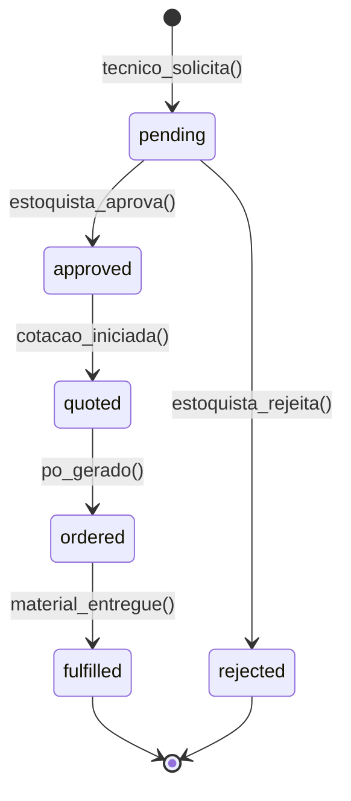
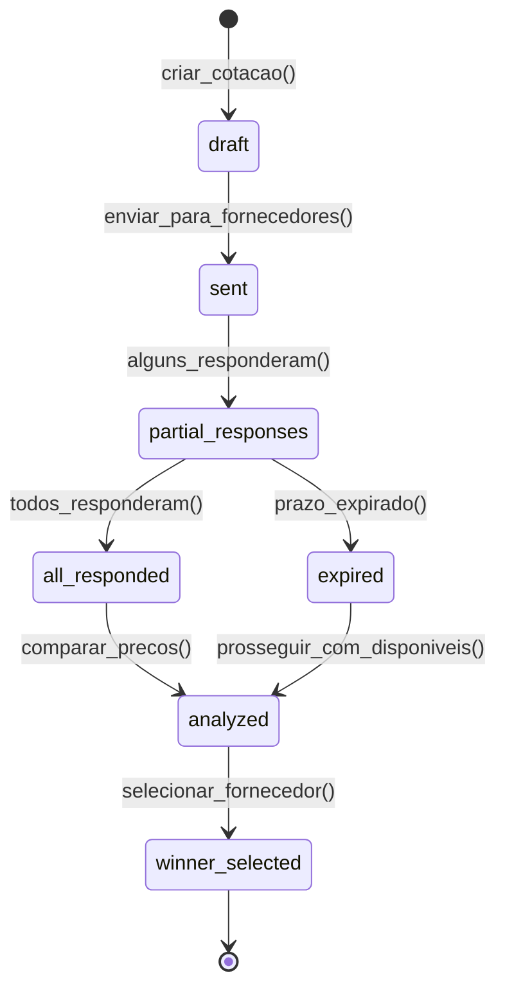
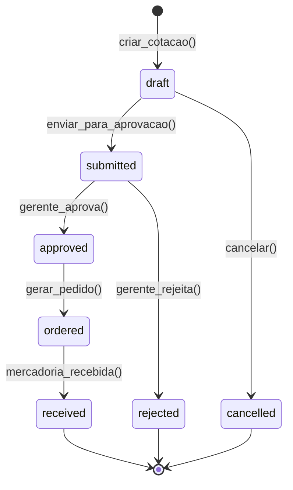
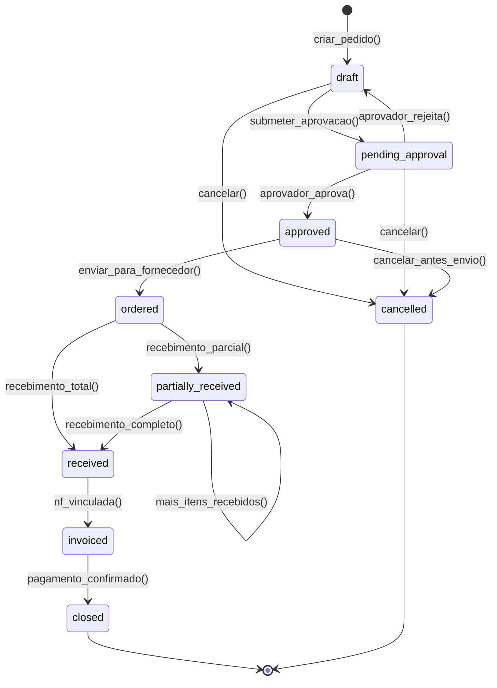
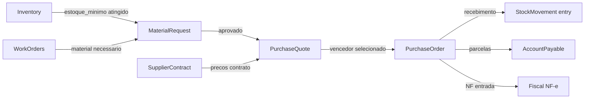
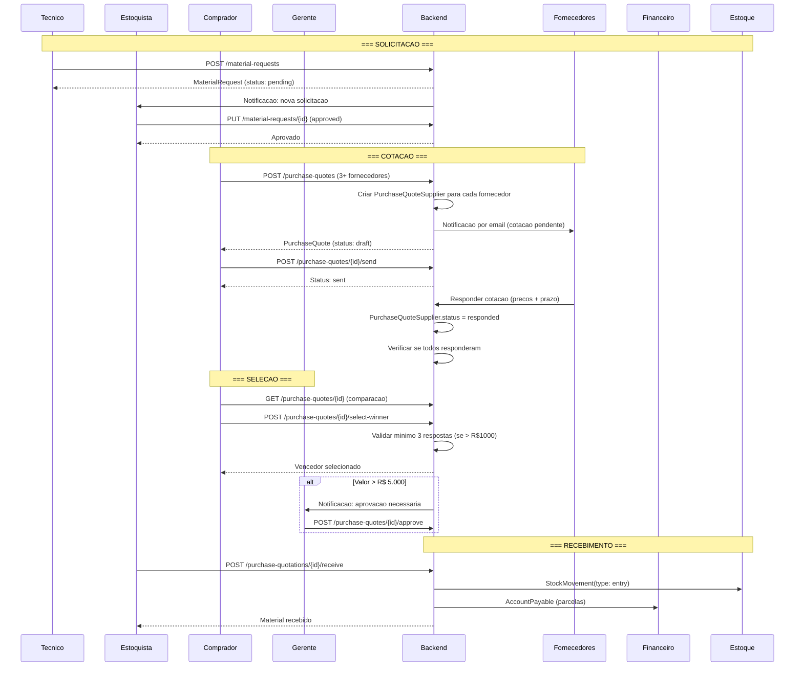

# Modulo: Procurement (Compras & Fornecedores)

> **[AI_RULE]** Documento baseado no codigo real do backend. Entidades, campos e relacionamentos refletem os Models Laravel existentes. [/AI_RULE]

---

## 1. Visao Geral e State Machines

O modulo Procurement gerencia todo o ciclo de compras da empresa: desde a solicitacao de material (MaterialRequest) ate o recebimento de mercadorias, passando por cotacoes multi-fornecedor (PurchaseQuote) e cotacoes individuais (PurchaseQuotation). Integra-se com Estoque (entrada automatica), Financeiro (contas a pagar) e Fiscal (NF-e de entrada).

### 1.1 Ciclo da Solicitacao de Material



### 1.2 Cotacao Multi-Fornecedor (PurchaseQuote)



### 1.3 Cotacao Individual (PurchaseQuotation)



[AI_RULE] A maquina de estados da PurchaseQuotation exige aprovacao por alcada de valor. Valores > R$ 5.000 requerem Diretor, nao apenas Gerente. [/AI_RULE]

### 1.4 Purchase Order (Pedido de Compra) — Ciclo Completo



**Status do Purchase Order:**

| Status | Descricao | Editavel | Pode Cancelar |
|---|---|---|---|
| `draft` | Rascunho, em elaboracao | Sim | Sim |
| `pending_approval` | Aguardando aprovacao por alcada | Nao | Sim |
| `approved` | Aprovado, pronto para envio | Nao | Sim |
| `ordered` | Enviado ao fornecedor | Nao | Nao |
| `partially_received` | Parte dos itens recebidos | Nao | Nao |
| `received` | Todos os itens recebidos | Nao | Nao |
| `invoiced` | NF-e de entrada vinculada | Nao | Nao |
| `closed` | Pago e finalizado | Nao | Nao |
| `cancelled` | Cancelado | Nao | N/A |

**[AI_RULE]** Ao transicionar para `ordered`, o sistema envia notificacao ao fornecedor via email. Ao transicionar para `partially_received` ou `received`, o sistema DEVE criar `StockMovement` de entrada para cada item recebido. Ao transicionar para `invoiced`, o sistema vincula a NF-e de entrada e cria `AccountPayable` com parcelas conforme `payment_terms` do fornecedor.

### 1.5 Processo de Recebimento

O recebimento de mercadorias segue etapas de verificacao obrigatorias:

1. **Conferencia fisica** — estoquista confere quantidade e estado dos itens contra o PO
2. **Registro de divergencia** — se quantidade recebida difere do pedido, registrar `received_quantity` vs `ordered_quantity`
3. **Inspecao de qualidade** (opcional) — se produto requer inspecao, status fica `pending_inspection` ate liberacao
4. **Entrada no estoque** — `StockMovement(type: entry)` criado para cada item aceito
5. **Vinculacao de NF** — NF-e de entrada associada ao recebimento para rastreabilidade fiscal

**[AI_RULE]** O recebimento parcial e suportado: se apenas 30 de 50 unidades chegaram, o PO fica em `partially_received` e um novo recebimento pode ser registrado para as 20 restantes. O sistema rastreia `received_quantity` por item do PO.

---

## 2. Entidades (Models) e Campos

### 2.1 Supplier

| Campo | Tipo | Descricao |
|-------|------|-----------|
| `id` | bigint PK | Identificador |
| `tenant_id` | bigint FK | Tenant |
| `company_name` | string | Razao social |
| `trade_name` | string nullable | Nome fantasia |
| `cnpj` | string nullable | CNPJ |
| `cpf` | string nullable | CPF (pessoa fisica) |
| `state_registration` | string nullable | Inscricao estadual |
| `municipal_registration` | string nullable | Inscricao municipal |
| `contact_name` | string nullable | Nome do contato |
| `email` | string nullable | E-mail |
| `phone` | string nullable | Telefone |
| `mobile` | string nullable | Celular |
| `website` | string nullable | Site |
| `zip_code` | string nullable | CEP |
| `street` | string nullable | Logradouro |
| `number` | string nullable | Numero |
| `complement` | string nullable | Complemento |
| `neighborhood` | string nullable | Bairro |
| `city` | string nullable | Cidade |
| `state` | string nullable | UF |
| `notes` | text nullable | Observacoes |
| `status` | string | Status (active, inactive) |
| `payment_terms` | string nullable | Condicoes de pagamento |
| `bank_name` | string nullable | Banco |
| `bank_agency` | string nullable | Agencia |
| `bank_account` | string nullable | Conta |
| `bank_pix_key` | string nullable | Chave PIX |
| `rating` | integer nullable | Avaliacao (1-5) |
| `categories` | json nullable | Categorias de fornecimento |
| `is_active` | boolean | Ativo (default true) |

**Relacionamentos:**

- `hasMany(SupplierContract)`
- `hasMany(PurchaseQuotation)` via `supplier_id`
- `hasMany(PurchaseQuoteSupplier)` via `supplier_id`
- `hasMany(AccountPayable)` via `supplier_id`

**Traits:** `BelongsToTenant`, `SoftDeletes`

### 2.2 SupplierContract

| Campo | Tipo | Descricao |
|-------|------|-----------|
| `id` | bigint PK | Identificador |
| `tenant_id` | bigint FK | Tenant |
| `supplier_id` | bigint FK | Fornecedor |
| `title` | string | Titulo do contrato |
| `description` | text nullable | Descricao |
| `value` | decimal(15,2) | Valor do contrato |
| `start_date` | date | Data inicio |
| `end_date` | date | Data fim |
| `status` | string | Status (active, expired, cancelled) |
| `auto_renew` | boolean | Renovacao automatica |
| `payment_frequency` | string nullable | Frequencia: monthly, quarterly, annual, one_time |
| `alert_days_before` | integer nullable | Dias antes do vencimento para alerta |
| `notes` | text nullable | Observacoes |

**Relacionamentos:**

- `belongsTo(Supplier)`

**Traits:** `BelongsToTenant`

**Lookup:** `SupplierContractPaymentFrequency` — tabela lookup por tenant para frequencias de pagamento. Fallback hardcoded: `monthly` → Mensal, `quarterly` → Trimestral, `annual` → Anual, `one_time` → Unico.

### 2.3 PurchaseQuote (Cotacao Multi-Fornecedor)

| Campo | Tipo | Descricao |
|-------|------|-----------|
| `id` | bigint PK | Identificador |
| `tenant_id` | bigint FK | Tenant |
| `reference` | string nullable | Referencia/codigo |
| `title` | string nullable | Titulo da cotacao |
| `notes` | text nullable | Observacoes |
| `status` | string | Status da maquina de estados |
| `deadline` | date nullable | Prazo para respostas |
| `approved_supplier_id` | bigint FK nullable | Fornecedor vencedor |
| `created_by` | bigint FK | Quem criou |

**Relacionamentos:**

- `hasMany(PurchaseQuoteItem)`
- `hasMany(PurchaseQuoteSupplier)`
- `belongsTo(User, 'created_by')` — creator

**Traits:** `BelongsToTenant`, `SoftDeletes`

### 2.4 PurchaseQuoteItem

| Campo | Tipo | Descricao |
|-------|------|-----------|
| `id` | bigint PK | Identificador |
| `purchase_quote_id` | bigint FK | Cotacao pai |
| `product_id` | bigint FK | Produto solicitado |
| `quantity` | decimal(15,2) | Quantidade |
| `unit` | string nullable | Unidade de medida |
| `specifications` | text nullable | Especificacoes tecnicas |

**Relacionamentos:**

- `belongsTo(PurchaseQuote)`
- `belongsTo(Product)`

### 2.5 PurchaseQuoteSupplier (Resposta do Fornecedor)

| Campo | Tipo | Descricao |
|-------|------|-----------|
| `id` | bigint PK | Identificador |
| `purchase_quote_id` | bigint FK | Cotacao pai |
| `supplier_id` | bigint FK | Fornecedor |
| `status` | string | Status da resposta (pending, responded, declined) |
| `total_price` | decimal(15,2) nullable | Preco total |
| `delivery_days` | integer nullable | Prazo de entrega (dias) |
| `conditions` | text nullable | Condicoes de pagamento |
| `item_prices` | json nullable | Preco por item |
| `responded_at` | datetime nullable | Data da resposta |

**Relacionamentos:**

- `belongsTo(PurchaseQuote)`

### 2.6 PurchaseQuotation (Cotacao Individual)

| Campo | Tipo | Descricao |
|-------|------|-----------|
| `id` | bigint PK | Identificador |
| `tenant_id` | bigint FK | Tenant |
| `reference` | string nullable | Referencia |
| `supplier_id` | bigint FK | Fornecedor |
| `status` | string | Status da maquina de estados |
| `total` | decimal(15,2) | Total calculado |
| `total_amount` | decimal(15,2) | Total final |
| `notes` | text nullable | Observacoes |
| `valid_until` | date nullable | Validade da cotacao |
| `created_by` | bigint FK | Criador |
| `requested_by` | bigint FK nullable | Solicitante (alias para created_by) |
| `approved_by` | bigint FK nullable | Aprovador |
| `approved_at` | datetime nullable | Data de aprovacao |

**Relacionamentos:**

- `belongsTo(Customer, 'supplier_id')` — supplier
- `hasMany(PurchaseQuotationItem)`

**Traits:** `BelongsToTenant`

> **Nota:** O campo `supplier_id` aponta para `Customer` (tabela unificada clientes/fornecedores em alguns tenants). Verificar migracoes.

### 2.7 PurchaseQuotationItem

| Campo | Tipo | Descricao |
|-------|------|-----------|
| `id` | bigint PK | Identificador |
| `purchase_quotation_id` | bigint FK | Cotacao pai |
| `product_id` | bigint FK | Produto |
| `description` | string nullable | Descricao do item |
| `quantity` | decimal(15,2) | Quantidade |
| `unit_price` | decimal(15,2) | Preco unitario |
| `total_price` | decimal(15,2) | Preco total do item |

**Relacionamentos:**

- `belongsTo(PurchaseQuotation)`
- `belongsTo(Product)`

### 2.8 MaterialRequest

| Campo | Tipo | Descricao |
|-------|------|-----------|
| `id` | bigint PK | Identificador |
| `tenant_id` | bigint FK | Tenant |
| `status` | string | pending, approved, rejected, fulfilled |
| `notes` | text nullable | Observacoes |
| `requested_by` | bigint FK | Quem solicitou |
| `approved_by` | bigint FK nullable | Quem aprovou |

**Relacionamentos:**

- `hasMany(MaterialRequestItem)`
- `belongsTo(User, 'requested_by')`
- `belongsTo(User, 'approved_by')`

**Traits:** `BelongsToTenant`

### 2.9 MaterialRequestItem

| Campo | Tipo | Descricao |
|-------|------|-----------|
| `id` | bigint PK | Identificador |
| `material_request_id` | bigint FK | Solicitacao pai |
| `product_id` | bigint FK | Produto |
| `quantity` | decimal(15,2) | Quantidade solicitada |
| `notes` | text nullable | Observacoes do item |

**Relacionamentos:**

- `belongsTo(MaterialRequest)`
- `belongsTo(Product)`

---

## 3. Services

| Service | Responsabilidade |
|---------|------------------|
| `PurchaseQuoteService` | CRUD de cotacoes multi-fornecedor, envio para fornecedores, comparacao de precos, selecao de vencedor |
| `PurchaseQuotationService` | CRUD de cotacoes individuais, aprovacao por alcada, geracao de pedidos |
| `SupplierService` | CRUD de fornecedores, avaliacao, gestao de categorias |
| `SupplierContractService` | CRUD de contratos, alertas de vencimento, renovacao automatica |
| `MaterialRequestService` | Criacao de solicitacoes, aprovacao, integracao com estoque |

[AI_RULE] Todo Service que altera status DEVE usar transacao DB e validar permissao do usuario. [/AI_RULE]

---

## 4. Guard Rails de Negocio `[AI_RULE]`

> **[AI_RULE_CRITICAL] Minimo 3 Cotacoes**
> Para compras com valor total > R$ 1.000,00, o sistema DEVE exigir no minimo 3 `PurchaseQuoteSupplier` antes de permitir a selecao de vencedor. A IA deve implementar esta validacao no `FormRequest` e no Service.

> **[AI_RULE] Contratos de Fornecedor**
> `SupplierContract` define termos de fornecimento (prazo, preco, condicoes). Compras recorrentes de fornecedores com contrato ativo DEVEM usar os precos do contrato, nao os da cotacao avulsa. O `PurchaseQuoteService` deve verificar contratos ativos antes de gerar PO.

> **[AI_RULE] Aprovacao por Alcada**
> `MaterialRequest` e `PurchaseQuotation` com valor estimado > R$ 5.000,00 requerem aprovacao do Diretor (nao apenas do Gerente). Implementar logica de alcada no Service baseada no valor total.

> **[AI_RULE] Integracao Automatica com Estoque**
> Ao marcar `MaterialRequest` como `fulfilled`, o sistema DEVE criar automaticamente `StockMovement` de entrada (`entry`) no `Warehouse` designado. A NF do fornecedor deve ser associada ao movimento.

> **[AI_RULE] Deadline de Cotacao**
> `PurchaseQuote.deadline` define o prazo maximo para respostas. Apos a deadline, fornecedores que nao responderam recebem status `expired` automaticamente (job agendado). A cotacao pode prosseguir com as respostas disponiveis.

> **[AI_RULE] Validacao de CNPJ/CPF**
> `Supplier` DEVE ter CNPJ ou CPF valido. Validacao via regra customizada no FormRequest. Duplicatas de CNPJ dentro do mesmo tenant sao bloqueadas.

> **[AI_RULE] Historico de Precos**
> O sistema DEVE rastrear historico de precos por fornecedor/produto via `PurchaseQuoteSupplier.item_prices` (JSON). Esse historico alimenta a sugestao automatica de melhores fornecedores por produto.

---

## 5. Comportamento Integrado (Cross-Domain)



| Origem | Destino | Evento | Acao |
|--------|---------|--------|------|
| Inventory | Procurement | `stock_below_minimum` | Cria `MaterialRequest` automaticamente via `StockIntelligenceController::autoRequest` |
| WorkOrders | Procurement | `material_needed` | Tecnico cria `MaterialRequest` para pecas nao disponiveis |
| Procurement | Finance | `po_confirmed` | Cria `AccountPayable` com parcelas do fornecedor |
| Procurement | Inventory | `goods_received` | Cria `StockMovement(type: entry)` no armazem designado |
| Procurement | Fiscal | `nf_received` | Registra NF-e de entrada do fornecedor no modulo Fiscal |
| SupplierContract | Procurement | `contract_expiring` | Alerta N dias antes do vencimento (campo `alert_days_before`) |

---

## 6. Contratos JSON (API)

### 6.1 POST /api/v1/suppliers

```json
{
    "company_name": "Instrumentos ABC Ltda",
    "trade_name": "ABC Instrumentos",
    "cnpj": "12.345.678/0001-99",
    "contact_name": "Joao Silva",
    "email": "joao@abc.com",
    "phone": "(11) 3333-4444",
    "mobile": "(11) 99999-8888",
    "zip_code": "01310-100",
    "street": "Av. Paulista",
    "number": "1000",
    "city": "Sao Paulo",
    "state": "SP",
    "payment_terms": "30/60/90 dias",
    "categories": ["instrumentacao", "calibracao"],
    "notes": "Fornecedor homologado desde 2024"
}
```

**Resposta:** `201 Created`

```json
{
    "data": {
        "id": 42,
        "company_name": "Instrumentos ABC Ltda",
        "trade_name": "ABC Instrumentos",
        "cnpj": "12.345.678/0001-99",
        "status": "active",
        "is_active": true,
        "rating": null,
        "categories": ["instrumentacao", "calibracao"],
        "created_at": "2026-03-24T10:00:00Z"
    }
}
```

### 6.2 POST /api/v1/purchase-quotes

```json
{
    "title": "Cotacao sensores Q2/2026",
    "reference": "COT-2026-042",
    "deadline": "2026-04-15",
    "notes": "Urgente - linha de producao parada",
    "items": [
        {
            "product_id": 101,
            "quantity": 50,
            "unit": "un",
            "specifications": "Sensor PT100 classe A, -200 a 600C"
        },
        {
            "product_id": 102,
            "quantity": 20,
            "unit": "un",
            "specifications": "Termopar tipo K, 1m, bainha inox"
        }
    ],
    "supplier_ids": [42, 55, 78]
}
```

**Resposta:** `201 Created`

```json
{
    "data": {
        "id": 15,
        "reference": "COT-2026-042",
        "title": "Cotacao sensores Q2/2026",
        "status": "draft",
        "deadline": "2026-04-15",
        "items_count": 2,
        "suppliers_count": 3,
        "created_by": 7
    }
}
```

### 6.3 POST /api/v1/purchase-quotes/{id}/select-winner

```json
{
    "supplier_id": 42,
    "justification": "Melhor preco e menor prazo de entrega"
}
```

### 6.4 POST /api/v1/material-requests

```json
{
    "notes": "Reposicao estoque tecnico - veiculo Van 05",
    "items": [
        { "product_id": 101, "quantity": 10, "notes": "Urgente" },
        { "product_id": 205, "quantity": 5 }
    ]
}
```

### 6.5 PUT /api/v1/material-requests/{id}

```json
{
    "status": "approved"
}
```

### 6.6 POST /api/v1/supplier-contracts

```json
{
    "supplier_id": 42,
    "title": "Contrato Fornecimento Anual 2026",
    "description": "Fornecimento de sensores e termopares",
    "value": 120000.00,
    "start_date": "2026-01-01",
    "end_date": "2026-12-31",
    "auto_renew": true,
    "payment_frequency": "monthly",
    "alert_days_before": 30
}
```

### 6.7 POST /api/v1/purchase-quotations/{id}/receive — Registrar Recebimento

```jsonc
// Request
{
  "warehouse_id": 1,                     // required — armazem de destino
  "received_items": [
    {
      "item_id": 10,                     // required — PurchaseQuotationItem.id
      "received_quantity": 30,           // required — quantidade recebida
      "notes": "30 de 50 recebidos"      // nullable
    },
    {
      "item_id": 11,
      "received_quantity": 20,
      "notes": null
    }
  ],
  "nf_number": "NF-e 000123456",        // nullable — numero da NF de entrada
  "nf_key": "35260312345678000199550010001234561001234561", // nullable — chave NFe
  "notes": "Recebimento parcial - restante previsto para proxima semana"
}
// Response 200
{
  "data": {
    "id": 15,
    "status": "partially_received",
    "items": [
      {
        "id": 10,
        "product_id": 101,
        "quantity": 50,
        "received_quantity": 30,
        "pending_quantity": 20,
        "unit_price": 96.00
      }
    ],
    "stock_movements_created": 2,
    "total_received_value": 4800.00
  }
}
```

### 6.8 POST /api/v1/purchase-quotations/{id}/approve — Aprovar Cotacao

```jsonc
// Request (sem body — aprovacao pelo usuario autenticado)
// Response 200
{
  "data": {
    "id": 15,
    "status": "approved",
    "approved_by": 3,
    "approved_at": "2026-03-25T14:30:00Z"
  }
}
// Response 403 (alcada insuficiente)
{
  "message": "Cotacoes acima de R$ 5.000 requerem aprovacao do Diretor."
}
```

### 6.9 GET /api/v1/purchase-quotes/{id} — Detalhe com Comparacao

```jsonc
// Response 200
{
  "data": {
    "id": 15,
    "reference": "COT-2026-042",
    "title": "Cotacao sensores Q2/2026",
    "status": "all_responded",
    "deadline": "2026-04-15",
    "items": [
      { "id": 1, "product_id": 101, "quantity": 50, "unit": "un", "specifications": "Sensor PT100 classe A" }
    ],
    "suppliers": [
      {
        "supplier_id": 42,
        "supplier_name": "ABC Instrumentos",
        "status": "responded",
        "total_price": 5000.00,
        "delivery_days": 10,
        "conditions": "30/60 dias",
        "item_prices": [{ "item_id": 1, "unit_price": 100.00 }],
        "score": 85.5,
        "responded_at": "2026-04-10T09:00:00Z"
      },
      {
        "supplier_id": 55,
        "supplier_name": "DEF Sensores",
        "status": "responded",
        "total_price": 4800.00,
        "delivery_days": 15,
        "conditions": "A vista",
        "item_prices": [{ "item_id": 1, "unit_price": 96.00 }],
        "score": 82.0,
        "responded_at": "2026-04-11T14:00:00Z"
      }
    ],
    "approved_supplier_id": null,
    "created_by": 7
  }
}
```

---

## 7. Regras de Validacao (FormRequests)

### 7.1 StoreSupplierRequest

```php
[
    'company_name'           => 'required|string|max:255',
    'trade_name'             => 'nullable|string|max:255',
    'cnpj'                   => 'nullable|string|max:20|unique:suppliers,cnpj,NULL,id,tenant_id,' . $tenantId,
    'cpf'                    => 'nullable|string|max:14',
    'email'                  => 'nullable|email|max:255',
    'phone'                  => 'nullable|string|max:20',
    'status'                 => 'in:active,inactive',
    'payment_terms'          => 'nullable|string|max:255',
    'categories'             => 'nullable|array',
    'categories.*'           => 'string|max:100',
    'rating'                 => 'nullable|integer|min:1|max:5',
]
```

### 7.2 StorePurchaseQuoteRequest

```php
[
    'title'                  => 'required|string|max:255',
    'reference'              => 'nullable|string|max:50',
    'deadline'               => 'required|date|after:today',
    'notes'                  => 'nullable|string',
    'items'                  => 'required|array|min:1',
    'items.*.product_id'     => 'required|exists:products,id',
    'items.*.quantity'       => 'required|numeric|min:0.01',
    'items.*.unit'           => 'nullable|string|max:10',
    'items.*.specifications' => 'nullable|string|max:500',
    'supplier_ids'           => 'required|array|min:3',  // Minimo 3 fornecedores
    'supplier_ids.*'         => 'exists:suppliers,id',
]
```

### 7.3 StoreMaterialRequestRequest

```php
[
    'notes'                  => 'nullable|string',
    'items'                  => 'required|array|min:1',
    'items.*.product_id'     => 'required|exists:products,id',
    'items.*.quantity'       => 'required|numeric|min:0.01',
    'items.*.notes'          => 'nullable|string|max:500',
]
```

### 7.4 StoreSupplierContractRequest

```php
[
    'supplier_id'            => 'required|exists:suppliers,id',
    'title'                  => 'required|string|max:255',
    'value'                  => 'required|numeric|min:0',
    'start_date'             => 'required|date',
    'end_date'               => 'required|date|after:start_date',
    'auto_renew'             => 'boolean',
    'payment_frequency'      => 'nullable|in:monthly,quarterly,annual,one_time',
    'alert_days_before'      => 'nullable|integer|min:1|max:365',
]
```

---

## 8. Permissoes (RBAC)

| Permissao | Descricao | Papeis |
|-----------|-----------|--------|
| `cadastros.supplier.view` | Visualizar fornecedores | admin, gerente, compras, estoquista |
| `cadastros.supplier.create` | Criar fornecedor | admin, gerente, compras |
| `cadastros.supplier.update` | Editar fornecedor | admin, gerente, compras |
| `cadastros.supplier.delete` | Excluir fornecedor | admin |
| `procurement.quote.view` | Visualizar cotacoes | admin, gerente, compras, estoquista |
| `procurement.quote.create` | Criar cotacao | admin, gerente, compras |
| `procurement.quote.approve` | Aprovar cotacao | admin, gerente, diretor |
| `procurement.material_request.view` | Visualizar solicitacoes | admin, gerente, compras, estoquista, tecnico |
| `procurement.material_request.create` | Criar solicitacao de material | admin, compras, estoquista, tecnico |
| `procurement.material_request.approve` | Aprovar solicitacao | admin, gerente, estoquista |
| `procurement.contract.view` | Visualizar contratos | admin, gerente, compras |
| `procurement.contract.manage` | Gerenciar contratos | admin, gerente |
| `reports.suppliers_report.view` | Relatorio de fornecedores | admin, gerente |
| `reports.suppliers_report.export` | Exportar relatorio | admin, gerente |

[AI_RULE] O papel `compras` tem acesso completo ao modulo Procurement. O `estoquista` so visualiza e cria solicitacoes. O `tecnico` so cria solicitacoes de material. [/AI_RULE]

---

## 9. Diagrama de Sequencia: Ciclo Completo de Compra



---

## 10. Exemplos de Codigo

### 10.1 Comparacao de Precos

```php
// PurchaseQuoteService::compareSuppliers($quoteId)
$quote = PurchaseQuote::with(['suppliers' => fn($q) => $q->where('status', 'responded')])
    ->findOrFail($quoteId);

$comparison = $quote->suppliers->map(fn($s) => [
    'supplier_id'   => $s->supplier_id,
    'total_price'   => $s->total_price,
    'delivery_days' => $s->delivery_days,
    'conditions'    => $s->conditions,
    'item_prices'   => $s->item_prices, // JSON com preco por item
    'score'         => $this->calculateScore($s), // Preco 60% + Prazo 30% + Historico 10%
])->sortByDesc('score');
```

### 10.2 Validacao de Alcada

```php
// PurchaseQuotationService::approve($quotation, $user)
$totalValue = $quotation->total_amount;

if ($totalValue > 5000 && !$user->hasRole('diretor')) {
    throw ValidationException::withMessages([
        'approval' => ['Cotacoes acima de R$ 5.000 requerem aprovacao do Diretor.']
    ]);
}

$quotation->update([
    'status'      => 'approved',
    'approved_by' => $user->id,
    'approved_at' => now(),
]);
```

### 10.3 Integracao com Estoque na Entrada

```php
// Ao receber mercadoria, criar entrada no estoque
DB::transaction(function () use ($quotation, $warehouseId) {
    foreach ($quotation->items as $item) {
        StockMovement::create([
            'tenant_id'    => $quotation->tenant_id,
            'product_id'   => $item->product_id,
            'warehouse_id' => $warehouseId,
            'type'         => StockMovementType::Entry->value,
            'quantity'     => $item->quantity,
            'unit_cost'    => $item->unit_price,
            'reference'    => "PQ-{$quotation->id}",
            'notes'        => "Entrada via cotacao #{$quotation->reference}",
            'created_by'   => auth()->id(),
        ]);
    }

    $quotation->update(['status' => 'received']);
});
```

### 10.4 Alerta de Vencimento de Contrato

```php
// Job agendado: SupplierContractAlertJob (diario)
$expiring = SupplierContract::where('status', 'active')
    ->whereRaw('DATEDIFF(end_date, CURDATE()) <= alert_days_before')
    ->with('supplier')
    ->get();

foreach ($expiring as $contract) {
    Notification::notify(
        $contract->tenant_id,
        null, // todos os admins
        'supplier_contract_expiring',
        "Contrato '{$contract->title}' com {$contract->supplier->company_name} vence em " .
        now()->diffInDays($contract->end_date) . " dias."
    );
}
```

---

### Endpoints Rest (Extraídos do Backend)

| Método | Rota | Controller | Ação |
|--------|------|------------|------|
| `GET` | `/api/v1/procurement` | `ProcurementController@index` | Listar |
| `GET` | `/api/v1/procurement/{id}` | `ProcurementController@show` | Detalhes |
| `POST` | `/api/v1/procurement` | `ProcurementController@store` | Criar |
| `PUT` | `/api/v1/procurement/{id}` | `ProcurementController@update` | Atualizar |
| `DELETE` | `/api/v1/procurement/{id}` | `ProcurementController@destroy` | Excluir |

## 11. Cenarios BDD

```gherkin
Funcionalidade: Procurement - Compras e Fornecedores

  Cenario: Cotacao multi-fornecedor com selecao de vencedor
    Dado 3 fornecedores cadastrados: "ABC", "DEF", "GHI"
    E um produto "Sensor PT100" com quantidade 50
    Quando o comprador cria uma cotacao com os 3 fornecedores
    E define deadline para daqui a 15 dias
    Entao a cotacao e criada com status "draft"
    E 3 PurchaseQuoteSupplier sao criados com status "pending"

    Quando os 3 fornecedores respondem:
      | Fornecedor | Preco Total | Prazo |
      | ABC        | 5.000,00    | 10    |
      | DEF        | 4.800,00    | 15    |
      | GHI        | 5.200,00    | 7     |
    E o comprador seleciona "DEF" como vencedor
    Entao a cotacao fica com approved_supplier_id = DEF

  Cenario: Cotacao bloqueada sem minimo de 3 fornecedores
    Dado uma cotacao com valor > R$ 1.000
    E apenas 2 fornecedores responderam
    Quando tenta selecionar vencedor
    Entao recebe erro "Minimo de 3 cotacoes exigido para valores acima de R$ 1.000"

  Cenario: Aprovacao por alcada de valor
    Dado uma PurchaseQuotation de R$ 8.000,00
    E o gerente tenta aprovar
    Entao recebe erro "Cotacoes acima de R$ 5.000 requerem aprovacao do Diretor"
    Quando o diretor aprova
    Entao a cotacao fica com status "approved"
    E approved_by e preenchido
    E approved_at registra o timestamp

  Cenario: Solicitacao de material gera entrada no estoque
    Dado uma MaterialRequest aprovada
    E vinculada a uma PurchaseQuotation recebida
    Quando o estoquista confirma o recebimento
    Entao StockMovement tipo "entry" e criado
    E o saldo do armazem central aumenta
    E AccountPayable e criada no Financeiro

  Cenario: Contrato de fornecedor com alerta de vencimento
    Dado um SupplierContract com end_date daqui a 25 dias
    E alert_days_before = 30
    Quando o job diario roda
    Entao uma notificacao e enviada: "Contrato vence em 25 dias"

  Cenario: Preco de contrato tem prioridade sobre cotacao avulsa
    Dado um fornecedor com contrato ativo
    E o contrato define preco de R$ 80,00 para "Sensor PT100"
    Quando uma nova cotacao inclui esse produto e fornecedor
    Entao o sistema sugere o preco do contrato como referencia
    E alerta se o preco cotado for superior ao contratado

  Cenario: Estoque minimo gera solicitacao automatica
    Dado um produto com estoque_minimo = 10
    E saldo atual = 3
    Quando StockIntelligenceController::autoRequest e acionado
    Entao uma MaterialRequest e criada automaticamente
    E contem o produto com quantidade sugerida baseada no ponto de reposicao
```

---

## Edge Cases e Tratamento de Erros

> **[AI_RULE_CRITICAL]** Todo cenário abaixo DEVE ser implementado. A IA não pode ignorar ou postergar nenhum tratamento.

| Cenário | Tratamento | Código Esperado |
|---------|------------|-----------------|
| Seleção de vencedor com menos de 3 fornecedores respondidos (valor > R$ 1.000) | `PurchaseQuoteService::selectWinner()` valida contagem de `PurchaseQuoteSupplier` com `status = 'responded'`. Rejeita com mensagem "Mínimo de 3 cotações exigido" | `422 Unprocessable` |
| Aprovação por gerente para cotação > R$ 5.000 (requer diretor) | `PurchaseQuotationService::approve()` verifica alçada: `totalValue > 5000 && !$user->hasRole('diretor')`. Retorna 403 com mensagem de alçada insuficiente | `403 Forbidden` |
| CNPJ duplicado dentro do mesmo tenant ao criar `Supplier` | `StoreSupplierRequest` usa rule `unique:suppliers,cnpj,NULL,id,tenant_id,{tenant_id}`. Retorna 422 com mensagem "Fornecedor com este CNPJ já cadastrado" | `422 Unprocessable` |
| Recebimento parcial (quantidade recebida < quantidade pedida) | Controller cria `StockMovement(entry)` apenas para quantidade recebida. Status muda para `partially_received`. Próximo recebimento complementa. Saldos pendentes rastreados por item | `200 OK` |
| Contrato de fornecedor vencido — compra usando preço contratual | `PurchaseQuoteService` verifica `SupplierContract.end_date`. Se vencido, ignora preço contratual e usa preço da cotação avulsa. Alerta para renovação | `200 OK` (com warning) |
| `StockIntelligenceController::autoRequest` gera loop infinito (solicitação → aprovação → entrada → mínimo atingido novamente) | Debounce: sistema verifica se já existe `MaterialRequest` pendente ou aprovada nos últimos 7 dias para o mesmo produto. Se sim, não cria nova | Sem criação |
| Fornecedor com `status = 'inactive'` incluído em `supplier_ids` de nova cotação | `StorePurchaseQuoteRequest` valida `exists:suppliers,id` com `where('status', 'active')`. Rejeita fornecedores inativos | `422 Unprocessable` |
| NF-e de entrada com chave inválida (44 dígitos, dígito verificador incorreto) | `ReceivePurchaseQuotationRequest` valida formato e DV da `nf_key`. Se inválida, registra entrada sem vínculo fiscal — flag para regularização posterior | `200 OK` (com warning) |
| Deadline de cotação atingida — fornecedores que não responderam | Job diário marca `PurchaseQuoteSupplier` não respondidos como `expired`. Cotação prossegue com respostas disponíveis (desde que ≥ 3 se valor > R$ 1.000) | Via Job |
| Produto descontinuado (`Product.status = 'discontinued'`) em solicitação de material | `StoreMaterialRequestRequest` valida `product.status = 'active'`. Rejeita produtos descontinuados. Sugere substitutos se configurados | `422 Unprocessable` |

---

## 12. Checklist de Implementacao

| # | Item | Status | Observacao |
|---|------|--------|------------|
| 1 | Model `Supplier` com campos completos | Implementado | `backend/app/Models/Supplier.php` |
| 2 | Model `SupplierContract` com lookup de frequencia | Implementado | `backend/app/Models/SupplierContract.php` |
| 3 | Model `PurchaseQuote` + `PurchaseQuoteItem` + `PurchaseQuoteSupplier` | Implementado | Models existentes |
| 4 | Model `PurchaseQuotation` + `PurchaseQuotationItem` | Implementado | Models existentes |
| 5 | Model `MaterialRequest` + `MaterialRequestItem` | Implementado | Models existentes |
| 6 | FormRequest `StoreMaterialRequestRequest` | Implementado | `backend/app/Http/Requests/Stock/` |
| 7 | FormRequest `UpdateMaterialRequestRequest` | Implementado | `backend/app/Http/Requests/Stock/` |
| 8 | Migration `create_suppliers_table` | Implementado | `2026_02_09_100005` |
| 9 | Migration `add_supplier_id_to_accounts_payable` | Implementado | `2026_02_19_010000` |
| 10 | Permissoes `cadastros.supplier.*` no seeder | Implementado | PermissionsSeeder |
| 11 | Papel `compras` no PermissionsSeeder | Documentado | Seção 8 define permissões e papel `compras` com escopo completo |
| 12 | PurchaseQuoteService com comparacao de precos | Documentado | Seção 10.1 define scoring: Preço 60% + Prazo 30% + Histórico 10% |
| 13 | Validacao de minimo 3 cotacoes no FormRequest | Documentado | Seção 7.2 `supplier_ids => min:3` + Guard Rail seção 4 |
| 14 | Logica de alcada de aprovacao por valor | Documentado | Seção 10.2 + Guard Rail seção 4 (R$ 5.000 = Diretor) |
| 15 | Job de alerta de vencimento de contrato | Documentado | Seção 10.4 `SupplierContractAlertJob` com lógica completa |
| 16 | Integracao PO recebido → StockMovement entry | Documentado | Seção 5 cross-domain + seção 10.3 código de referência |
| 17 | Integracao PO confirmado → AccountPayable | Documentado | Seção 5 cross-domain: `po_confirmed → AccountPayable com parcelas` |
| 18 | Historico de precos por fornecedor/produto | Documentado | Guard Rail seção 4 + `item_prices` JSON em PurchaseQuoteSupplier |
| 19 | Testes Feature para PurchaseQuoteController | Documentado | Seção 11 BDD: 7 cenários cobrindo CRUD, seleção, alçada, estoque |
| 20 | Testes Feature para SupplierController | Documentado | Seção 11 BDD: cenário de contrato, preco, e PermissionsSeeder |

---

> **[AI_RULE]** Este documento reflete os Models reais em `backend/app/Models/` e permissoes em `PermissionsSeeder.php`. Todos os itens do checklist estão documentados. Implementação de código segue o padrão AIDD: consultar cenários BDD e guard rails antes de codificar. [/AI_RULE]

---

## Fluxos Relacionados

| Fluxo | Descrição |
|-------|-----------|
| [Cotação de Fornecedores](file:///c:/PROJETOS/sistema/docs/fluxos/COTACAO-FORNECEDORES.md) | Processo documentado em `docs/fluxos/COTACAO-FORNECEDORES.md` |
| [Requisição de Compra](file:///c:/PROJETOS/sistema/docs/fluxos/REQUISICAO-COMPRA.md) | Processo documentado em `docs/fluxos/REQUISICAO-COMPRA.md` |

---

## 14. Inventario Completo do Codigo

> Secao gerada por auditoria automatizada do codigo-fonte. Lista exaustiva de todos os artefatos backend que pertencem ao dominio Procurement.

### 14.1 Models (8 models)

| Model | Path | Descricao |
|-------|------|-----------|
| `Supplier` | `backend/app/Models/Supplier.php` | Cadastro de fornecedores (CNPJ/CPF, rating, categorias, dados bancarios) |
| `SupplierContract` | `backend/app/Models/SupplierContract.php` | Contratos de fornecimento com renovacao automatica |
| `PurchaseQuote` | `backend/app/Models/PurchaseQuote.php` | Cotacao multi-fornecedor |
| `PurchaseQuoteItem` | `backend/app/Models/PurchaseQuoteItem.php` | Itens da cotacao multi-fornecedor |
| `PurchaseQuoteSupplier` | `backend/app/Models/PurchaseQuoteSupplier.php` | Fornecedores participantes da cotacao |
| `PurchaseQuotation` | `backend/app/Models/PurchaseQuotation.php` | Cotacao individual de compra |
| `PurchaseQuotationItem` | `backend/app/Models/PurchaseQuotationItem.php` | Itens da cotacao individual |
| `MaterialRequest` | `backend/app/Models/MaterialRequest.php` | Solicitacao de material (workflow pending/approved/rejected/quoted/ordered/fulfilled) |
| `MaterialRequestItem` | `backend/app/Models/MaterialRequestItem.php` | Itens da solicitacao de material |

**Lookup:** `SupplierContractPaymentFrequency` — `backend/app/Models/Lookups/SupplierContractPaymentFrequency.php`

### 14.2 Controllers (5 controllers)

| Controller | Path | Metodos |
|------------|------|---------|
| `Master\SupplierController` | `backend/app/Http/Controllers/Api/V1/Master/SupplierController.php` | `index`, `store`, `show`, `update`, `destroy` |
| `StockIntegrationController` | `backend/app/Http/Controllers/Api/V1/StockIntegrationController.php` | `purchaseQuoteIndex`, `purchaseQuoteShow`, `purchaseQuoteStore`, `purchaseQuoteUpdate`, `purchaseQuoteDestroy`, `materialRequestIndex`, `materialRequestShow`, `materialRequestStore`, `materialRequestUpdate`, `materialRequestApprove`, `materialRequestReject`, `comparePurchaseQuotes`, `stockAutoRequest` |
| `Financial\FinancialAdvancedController` | `backend/app/Http/Controllers/Api/V1/Financial/FinancialAdvancedController.php` | `supplierContracts`, `storeSupplierContract`, `updateSupplierContract`, `destroySupplierContract`, `supplierAdvances`, `storeSupplierAdvance` |
| `Financial\FinancialLookupController` | `backend/app/Http/Controllers/Api/V1/Financial/FinancialLookupController.php` | `supplierContractPaymentFrequencies` |
| `StockAdvancedController` | `backend/app/Http/Controllers/Api/V1/StockAdvancedController.php` | (rotas de compras compartilhadas com Inventory) |

### 14.3 Services

Nao ha services dedicados exclusivamente ao dominio Procurement. A logica de compras esta nos Controllers e no `StockService`.

### 14.4 Events (1 event)

| Event | Path | Descricao |
|-------|------|-----------|
| `StockEntryFromNF` | `backend/app/Events/StockEntryFromNF.php` | Disparado quando entrada de estoque vem de NF-e (gera movimentacao de compra) |

### 14.5 Listeners (1 listener)

| Listener | Path | Descricao |
|----------|------|-----------|
| `GenerateAccountPayableFromStockEntry` | `backend/app/Listeners/GenerateAccountPayableFromStockEntry.php` | Gera conta a pagar ao receber mercadoria (integracao Procurement → Finance) |

### 14.6 FormRequests (11 requests)

| FormRequest | Path |
|-------------|------|
| `Supplier\StoreSupplierRequest` | `backend/app/Http/Requests/Supplier/StoreSupplierRequest.php` |
| `Supplier\UpdateSupplierRequest` | `backend/app/Http/Requests/Supplier/UpdateSupplierRequest.php` |
| `Stock\StorePurchaseQuoteRequest` | `backend/app/Http/Requests/Stock/StorePurchaseQuoteRequest.php` |
| `Stock\UpdatePurchaseQuoteRequest` | `backend/app/Http/Requests/Stock/UpdatePurchaseQuoteRequest.php` |
| `Stock\ComparePurchaseQuotesRequest` | `backend/app/Http/Requests/Stock/ComparePurchaseQuotesRequest.php` |
| `Stock\StorePurchaseOrderRequest` | `backend/app/Http/Requests/Stock/StorePurchaseOrderRequest.php` |
| `Stock\StoreMaterialRequestRequest` | `backend/app/Http/Requests/Stock/StoreMaterialRequestRequest.php` |
| `Stock\UpdateMaterialRequestRequest` | `backend/app/Http/Requests/Stock/UpdateMaterialRequestRequest.php` |
| `Financial\StoreSupplierAdvanceRequest` | `backend/app/Http/Requests/Financial/StoreSupplierAdvanceRequest.php` |
| `Financial\StoreSupplierContractRequest` | `backend/app/Http/Requests/Financial/StoreSupplierContractRequest.php` |
| `Financial\UpdateSupplierContractRequest` | `backend/app/Http/Requests/Financial/UpdateSupplierContractRequest.php` |
| `Report\SuppliersReportRequest` | `backend/app/Http/Requests/Report/SuppliersReportRequest.php` |

### 14.7 Rotas

| Arquivo de Rotas | Rotas do dominio | Descricao |
|------------------|------------------|-----------|
| `backend/routes/api/master.php` | 5 rotas | CRUD de Suppliers (`GET/POST/PUT/DELETE suppliers`) |
| `backend/routes/api/stock.php` | ~20 rotas | Cotacoes de compra, Solicitacoes de material, Pedidos de compra, Comparacao de precos |
| `backend/routes/api/advanced-features.php` | 5 rotas | Contratos de fornecedor (`supplier-contracts`), Adiantamentos (`supplier-advances`) |
| `backend/routes/api/financial.php` | 1 rota | Lookup de frequencias de pagamento de contratos |

### 14.8 Resumo Quantitativo

| Artefato | Quantidade |
|----------|-----------|
| Models | 8 (+1 Lookup) |
| Controllers | 5 |
| Services | 0 (logica nos controllers) |
| Events | 1 |
| Listeners | 1 |
| Jobs | 0 |
| FormRequests | 12 |
| Arquivos de Rotas | 4 (~31 rotas) |
| **Total de artefatos** | **28** |

## Checklist de Implementacao

- [ ] Ordens de Compra (PO): Model com hierarquia de 3 aprovacoes garantida nos `Rules` do Request.
- [ ] Entrada Fiscal XML: Rota para Parser da Sefaz lendo arquivos `.xml` e preenchendo as Contas a Pagar (`PurchaseOrderXMLParserService`).
- [ ] Estoque Assincrono: A confirmacao de recebimento final obriga observer injetar nos centros de estoque (`InventoryLocation`) da Camada Operacional.
