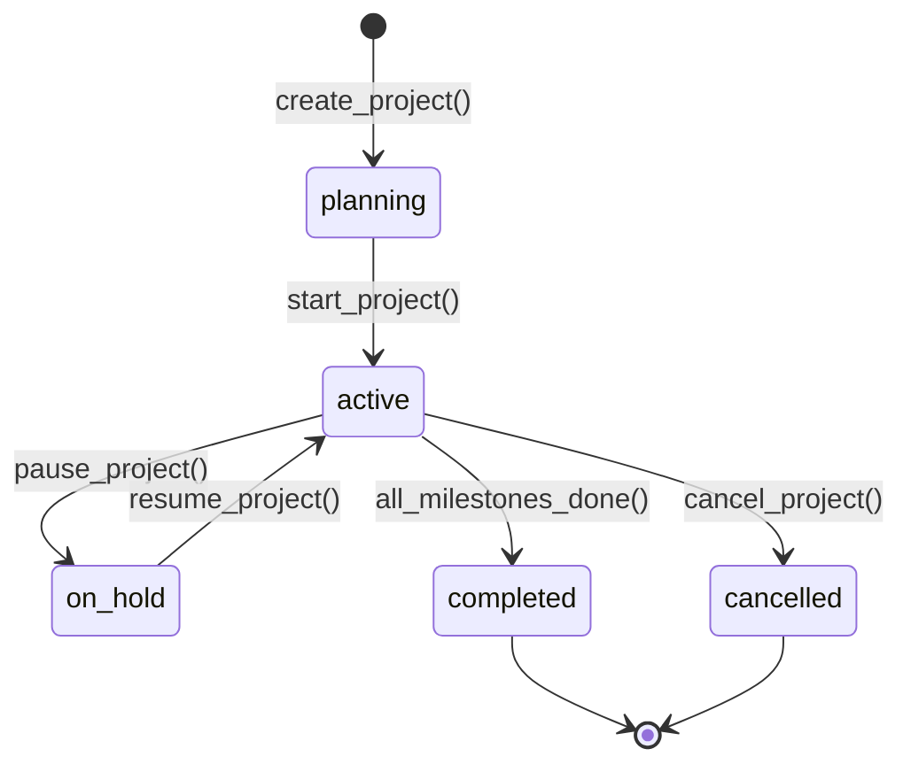
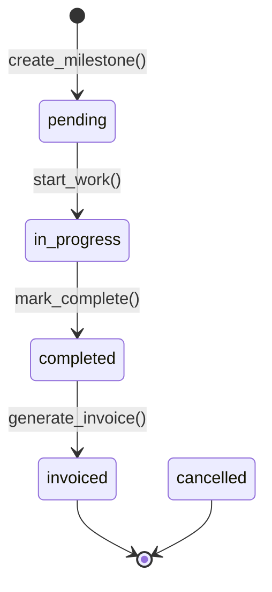

# Modulo: Projects (PPM - Project Portfolio Management)

> **[AI_RULE]** Especificações arquiteturais da fase de Expansão. Módulo Projects.

---

## 1. Visão Geral

Gestão avançada de projetos de longo prazo, controle de cronogramas, geração de gráficos de Gantt, alocação de técnicos ao longo do tempo e faturamento por etapas (Milestone Billing).

**Escopo Funcional:**

- Cadastro de projetos com timeline e orçamento
- Definição de marcos (Milestones) com datas e condições de faturamento
- Alocação e controle de horas de recursos (técnicos/consultores)
- Vinculação de OS (WorkOrders) como tarefas executáveis de um projeto
- Faturamento automático por milestone validado
- Dashboard de portfólio com saúde de projetos e Gantt

---

## 2. Entidades (Models)

### 2.1 Project

| Campo | Tipo | Regra |
|-------|------|-------|
| `id` | bigint (PK) | Auto-increment |
| `tenant_id` | bigint (FK) | Obrigatório |
| `code` | string(50) | Prefixo `PRJ-`, padding 5 |
| `name` | string(255) | Nome do projeto |
| `description` | text null | Descrição |
| `contact_id` | bigint (FK → contacts) | Cliente |
| `status` | enum | `planning`, `active`, `on_hold`, `completed`, `cancelled` |
| `priority` | enum | `low`, `medium`, `high`, `critical` |
| `manager_id` | bigint (FK → users) | Gerente |
| `start_date` | date | Início planejado |
| `end_date` | date | Término planejado |
| `actual_start_date` | date null | Início real |
| `actual_end_date` | date null | Término real |
| `budget` | decimal(15,2) null | Orçamento total |
| `spent` | decimal(15,2) | Gasto acumulado |
| `progress_percent` | decimal(5,2) | % progresso (média ponderada milestones) |
| `billing_type` | enum | `milestone`, `hourly`, `fixed_price` |
| `hourly_rate` | decimal(10,2) null | Valor/hora (se hourly) |
| `tags` | json null | Tags livres |
| `created_by` | bigint (FK → users) | Criador |
| `created_at` / `updated_at` | timestamp | — |

### 2.2 ProjectMilestone

| Campo | Tipo | Regra |
|-------|------|-------|
| `id` | bigint (PK) | Auto-increment |
| `tenant_id` | bigint (FK) | Obrigatório |
| `project_id` | bigint (FK) | Projeto pai |
| `name` | string(255) | Nome da etapa |
| `status` | enum | `pending`, `in_progress`, `completed`, `invoiced`, `cancelled` |
| `order` | integer | Ordem de execução |
| `planned_start` / `planned_end` | date null | Datas planejadas |
| `actual_start` / `actual_end` | date null | Datas reais |
| `billing_value` | decimal(15,2) null | Valor de faturamento |
| `billing_percent` | decimal(5,2) null | % do orçamento |
| `invoice_id` | bigint (FK → invoices) null | Fatura gerada |
| `weight` | decimal(5,2) | Peso para progresso (default 1.0) |
| `dependencies` | json null | IDs predecessores |
| `deliverables` | text null | Entregáveis |
| `completed_at` | timestamp null | — |
| `created_at` / `updated_at` | timestamp | — |

### 2.3 ProjectResource

| Campo | Tipo | Regra |
|-------|------|-------|
| `id` | bigint (PK) | Auto-increment |
| `tenant_id` / `project_id` / `user_id` | bigint (FK) | — |
| `role` | string(100) | Papel no projeto |
| `allocation_percent` | decimal(5,2) | % dedicação |
| `start_date` / `end_date` | date | Período de alocação |
| `hourly_rate` | decimal(10,2) null | Custo/hora |
| `total_hours_planned` | decimal(10,2) null | — |
| `total_hours_logged` | decimal(10,2) | Calculado |

### 2.4 ProjectTimeEntry

| Campo | Tipo | Regra |
|-------|------|-------|
| `id` | bigint (PK) | Auto-increment |
| `tenant_id` / `project_id` / `project_resource_id` | bigint (FK) | — |
| `milestone_id` | bigint (FK) null | Milestone associado |
| `work_order_id` | bigint (FK) null | OS associada |
| `date` | date | Data do trabalho |
| `hours` | decimal(5,2) | Horas trabalhadas |
| `description` | text null | — |
| `billable` | boolean | Se faturável |

---

## 3. State Machines

### 3.1 Ciclo do Projeto



### 3.2 Ciclo do Milestone



---

## 4. Guard Rails `[AI_RULE]`

> **[AI_RULE_CRITICAL] Milestone Billing** — Ao completar milestone, cria rascunho de `Invoice` no Finance. Milestone → `invoiced` somente após fatura confirmada. Invoice herda `contact_id` do projeto.

> **[AI_RULE_CRITICAL] Dependências** — Milestone com `dependencies` NÃO pode ir para `in_progress` se predecessores não estão `completed/invoiced`.

> **[AI_RULE] Progresso** — `progress_percent = SUM(weight * is_completed) / SUM(weight) * 100`. Recalculado a cada mudança de status de milestone.

> **[AI_RULE] Controle de Horas** — `ProjectTimeEntry` billable incrementa `project.spent` em `hours * resource.hourly_rate`.

> **[AI_RULE] Vinculação com OS** — `WorkOrder` como tarefa filha de milestone. `work_order_id` em TimeEntry rastreia horas de OS no projeto.

---

## 5. Cross-Domain

| Direção | Módulo | Integração |
|---------|--------|------------|
| → | **WorkOrders** | OS como tarefas filhas |
| → | **Finance** | Milestone Billing gera Invoice |
| ← | **HR** | Horas logadas alimentam banco de horas |
| ← | **CRM** | Deal convertido pode gerar projeto |

---

## 6. Contratos de API

### 6.1 POST /api/v1/projects — Criar Projeto

```json
{ "name": "Calibração Anual XPTO", "contact_id": 42, "manager_id": 7, "start_date": "2026-04-01", "end_date": "2026-06-30", "budget": 50000.00, "billing_type": "milestone", "priority": "high" }
```

### 6.2 POST /api/v1/projects/{id}/milestones — Criar Milestone

```json
{ "name": "Fase 1 — Pré-Inspeção", "planned_start": "2026-04-01", "planned_end": "2026-04-15", "billing_value": 15000.00, "weight": 1.0, "order": 1 }
```

### 6.3 POST /api/v1/projects/{id}/time-entries — Registrar Horas

```json
{ "project_resource_id": 5, "milestone_id": 12, "date": "2026-04-05", "hours": 6.5, "billable": true }
```

### 6.4 GET /api/v1/projects/{id}/gantt — Dados Gantt

### 6.5 GET /api/v1/projects/dashboard — Dashboard Portfólio

---

## 7. Permissões (RBAC)

| Permissão | Descrição |
|-----------|-----------|
| `projects.project.view/create/update/delete` | CRUD de projetos |
| `projects.milestone.manage/complete` | Gerenciar e completar milestones |
| `projects.resource.manage` | Alocar/desalocar recursos |
| `projects.time_entry.create/view` | Registrar e visualizar horas |
| `projects.dashboard.view` | Dashboard portfólio |
| `projects.invoice.generate` | Gerar fatura de milestone |

---

## 8. Rotas da API

| Método | Rota | Controller | Ação |
|--------|------|------------|------|
| `GET/POST` | `/api/v1/projects` | `ProjectController@index/store` | CRUD |
| `GET/PUT/DELETE` | `/api/v1/projects/{id}` | `ProjectController@show/update/destroy` | — |
| `POST` | `/api/v1/projects/{id}/start` | `ProjectController@start` | Iniciar |
| `POST` | `/api/v1/projects/{id}/pause` | `ProjectController@pause` | Pausar |
| `POST` | `/api/v1/projects/{id}/resume` | `ProjectController@resume` | Retomar |
| `POST` | `/api/v1/projects/{id}/complete` | `ProjectController@complete` | Finalizar |
| `GET` | `/api/v1/projects/{id}/gantt` | `ProjectController@gantt` | Gantt |
| `GET` | `/api/v1/projects/dashboard` | `ProjectController@dashboard` | Dashboard |
| `GET/POST` | `/api/v1/projects/{id}/milestones` | `ProjectMilestoneController@index/store` | — |
| `PUT/DELETE` | `/api/v1/projects/{id}/milestones/{mid}` | `ProjectMilestoneController@update/destroy` | — |
| `POST` | `/api/v1/projects/{id}/milestones/{mid}/complete` | `ProjectMilestoneController@complete` | Completar |
| `POST` | `/api/v1/projects/{id}/milestones/{mid}/invoice` | `ProjectMilestoneController@generateInvoice` | Faturar |
| `GET/POST` | `/api/v1/projects/{id}/resources` | `ProjectResourceController@index/store` | — |
| `PUT/DELETE` | `/api/v1/projects/{id}/resources/{rid}` | `ProjectResourceController@update/destroy` | — |
| `GET/POST` | `/api/v1/projects/{id}/time-entries` | `ProjectTimeEntryController@index/store` | — |
| `PUT/DELETE` | `/api/v1/projects/{id}/time-entries/{tid}` | `ProjectTimeEntryController@update/destroy` | — |

---

## 9. Form Requests

### StoreProjectRequest

```php
'name' => ['required','string','max:255'], 'contact_id' => ['required','integer','exists:contacts,id'],
'manager_id' => ['required','integer','exists:users,id'], 'start_date' => ['required','date'],
'end_date' => ['required','date','after:start_date'], 'budget' => ['nullable','numeric','min:0'],
'billing_type' => ['required','string','in:milestone,hourly,fixed_price'], 'priority' => ['required','string','in:low,medium,high,critical']
```

### StoreProjectMilestoneRequest

```php
'name' => ['required','string','max:255'], 'planned_start' => ['nullable','date'],
'planned_end' => ['nullable','date','after_or_equal:planned_start'], 'billing_value' => ['nullable','numeric','min:0'],
'weight' => ['sometimes','numeric','min:0.1'], 'order' => ['required','integer','min:1'],
'dependencies' => ['nullable','array'], 'dependencies.*' => ['integer','exists:project_milestones,id']
```

### StoreProjectTimeEntryRequest

```php
'project_resource_id' => ['required','integer','exists:project_resources,id'],
'date' => ['required','date'], 'hours' => ['required','numeric','min:0.25','max:24'], 'billable' => ['required','boolean']
```

---

## 10. Testes BDD

```gherkin
Funcionalidade: Gestão de Projetos

  Cenário: Criar projeto com milestones
    Quando POST /projects → status "planning" e código PRJ-XXXXX

  Cenário: Dependências bloqueiam início de milestone
    Dado milestone 2 depende de milestone 1 (pending)
    Quando tento completar milestone 2 → 422

  Cenário: Milestone billing gera invoice
    Dado milestone completed com billing_value=15000
    Quando POST /milestones/{id}/invoice → Invoice criada, milestone=invoiced, spent+=15000

  Cenário: Progresso por peso
    Dado 3 milestones (weights 1,2,1), 2 completados (weights 1,2)
    Então progress = 75%

  Cenário: Horas faturáveis incrementam spent
    Dado recurso com hourly_rate=100, 6.5h billable → spent += 650

  Cenário: Isolamento multi-tenant
```

---

## 11. Inventário do Código

### Controllers (4 — `App\Http\Controllers\Api\V1`)

| Controller | Métodos |
|------------|---------|
| `ProjectController` | index, store, show, update, destroy, start, pause, resume, complete, gantt, dashboard |
| `ProjectMilestoneController` | index, store, update, destroy, complete, generateInvoice |
| `ProjectResourceController` | index, store, update, destroy |
| `ProjectTimeEntryController` | index, store, update, destroy |

### Models (4): `Project`, `ProjectMilestone`, `ProjectResource`, `ProjectTimeEntry`

### Services (1): `ProjectService` — createProject, completeMilestone, generateMilestoneInvoice, recalculateProgress, getGanttData, getDashboard

### Form Requests (6): StoreProjectRequest, UpdateProjectRequest, StoreProjectMilestoneRequest, UpdateProjectMilestoneRequest, StoreProjectResourceRequest, StoreProjectTimeEntryRequest

---

---

## Edge Cases e Tratamento de Erros

| Cenário | Comportamento Esperado | Regra |
| --------- | ---------------------- | ------- |
| **Dependência circular** (Task A depende de B, B depende de A) | Validar no `FormRequest` ao definir dependências. Executar verificação de ciclo (DFS) no grafo de dependências. Se circular: retornar 422 `circular_dependency_detected` com o caminho do ciclo. Nunca permitir salvar. | `[AI_RULE_CRITICAL]` |
| **Milestone sem tasks** (milestone vazio) | Permitir criação de milestone vazio. Status permanece `pending`. Ao tentar marcar como `completed`: bloquear com 422 `milestone_has_no_tasks`. Milestone vazio não conta para cálculo de progresso do projeto. | `[AI_RULE]` |
| **Budget excedido** (soma das tasks > budget aprovado do projeto) | Ao adicionar/editar task com `estimated_cost`: verificar se soma total excede `project.budget`. Se exceder: alertar com warning (não bloquear). Registrar `budget_exceeded_at` com timestamp. Notificar gerente de projeto. | `[AI_RULE]` |
| **Membro removido com tasks atribuídas** | Ao remover membro do projeto: verificar se possui tasks com status `in_progress`. Se sim: retornar 422 `member_has_active_tasks` com lista de tasks. Exigir reatribuição antes da remoção. Tasks `pending` podem ser desatribuídas automaticamente. | `[AI_RULE]` |
| **Mudança de status retroativa** (completed → in_progress) | Permitir reabertura com registro obrigatório de motivo (`reopen_reason`). Recalcular progresso do projeto e milestone pai. Logar `project_reopened` no audit trail. Manter datas originais de conclusão como `originally_completed_at`. | `[AI_RULE]` |
| **Projeto arquivado com atividade pendente** | Ao arquivar projeto: verificar tasks `in_progress`. Se houver: retornar 422 `project_has_active_tasks`. Somente projetos com todas as tasks em `completed`, `cancelled` ou `pending` podem ser arquivados. | `[AI_RULE]` |

---

## Checklist de Implementação

- [ ] Migration `create_projects_table` com campos completos e tenant_id
- [ ] Migration `create_project_milestones_table` com FK projects e invoices
- [ ] Migration `create_project_resources_table` com FK projects e users
- [ ] Migration `create_project_time_entries_table` com FKs
- [ ] Models com fillable, casts (json), relationships completas
- [ ] `ProjectService` com lifecycle, milestone billing, progresso, Gantt
- [ ] Controllers com CRUD + transições + gantt + dashboard
- [ ] 6 Form Requests conforme especificação
- [ ] Rotas em `routes/api.php` com middleware
- [ ] Permissões RBAC no seeder
- [ ] Testes Feature: CRUD, milestone billing, dependências, progresso, horas, isolamento
- [ ] Frontend React: Lista de projetos, Gantt chart, milestone tracker, timesheet
