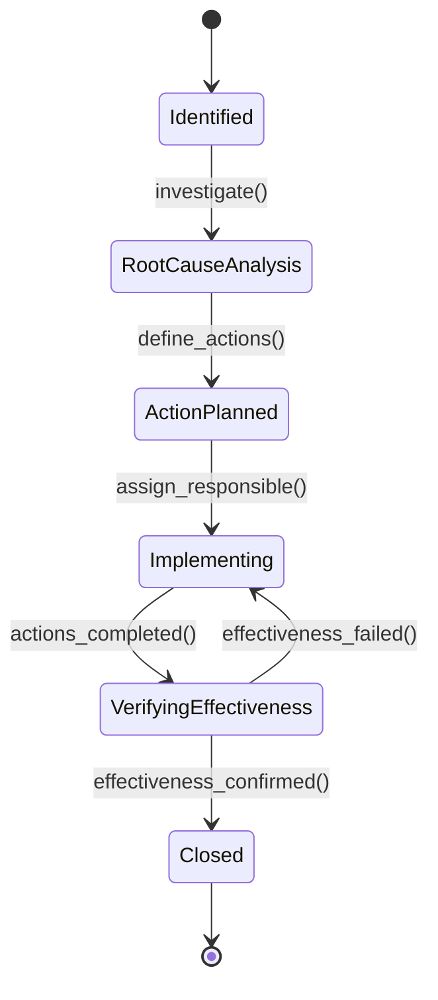
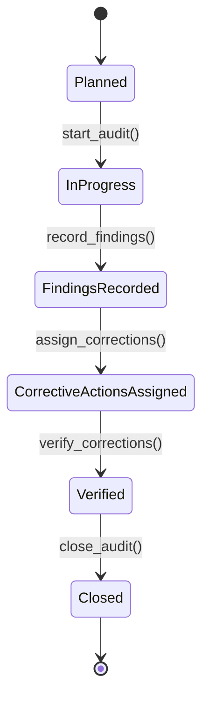
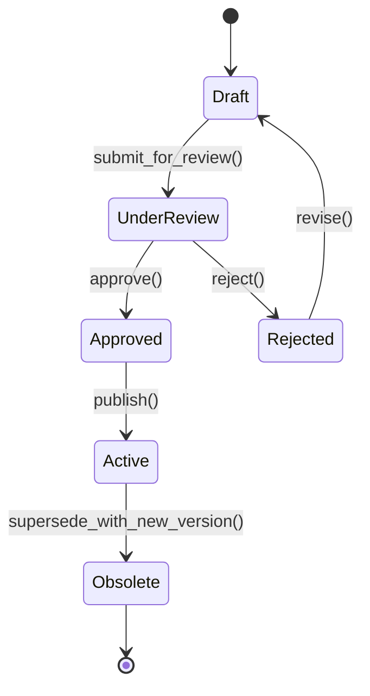
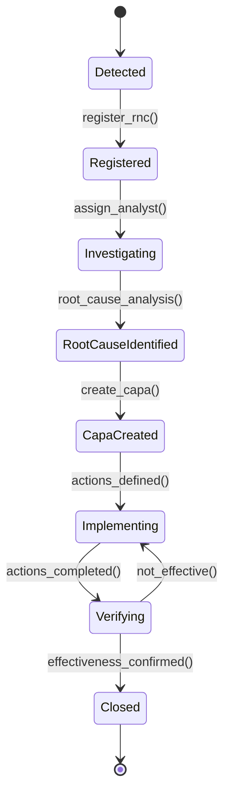
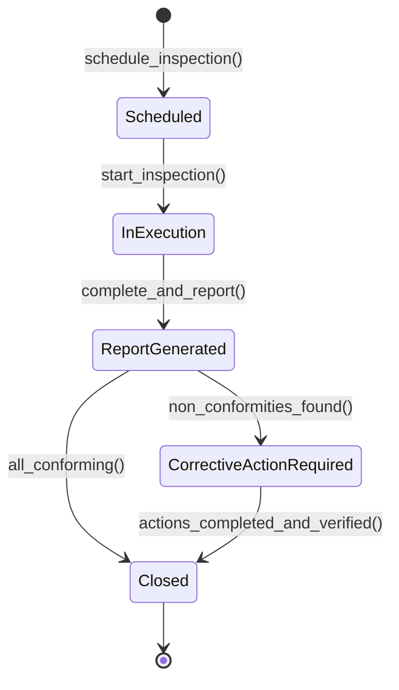
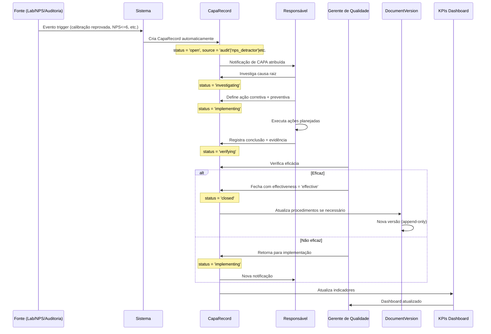

# Módulo: Qualidade & Gestão ISO

> **[AI_RULE]** Lista oficial de entidades (Models) associadas a este domínio no Laravel.
> **[COMPLIANCE]** Ver documentação de conformidade legal: [ISO-9001](../compliance/ISO-9001.md)

---

## 1. Visão Geral

O módulo Quality implementa o Sistema de Gestão da Qualidade (SGQ) conforme ISO-9001:2015 e requisitos complementares da ISO-17025:2017 para laboratórios. Abrange Não Conformidades (RNC), ações corretivas e preventivas (CAPA), auditorias internas, controle de documentos versionados, revisão gerencial (análise crítica pela direção), procedimentos operacionais e indicadores de qualidade (KPIs).

### Princípios Fundamentais

- **Documentos versionados são imutáveis**: `DocumentVersion` é append-only após publicação
- **CAPA exige evidência**: transição para `Closed` requer upload de evidência documental
- **Revisão gerencial automática**: se `strict_iso_17025 = true`, cria `ManagementReview` trimestral
- **Rastreabilidade completa**: toda ação gera `AuditLog` para trilha de auditoria
- **Feature flag condicional**: funcionalidades ISO ativadas por `TenantSetting.strict_iso_9001`

---

## 2. Entidades (Models) — Campos Completos

### 2.1 `QualityAudit`

Auditoria interna ou externa ISO.

| Campo | Tipo | Descrição |
|---|---|---|
| `tenant_id` | bigint | Tenant |
| `audit_number` | string | Número da auditoria |
| `title` | string | Título da auditoria |
| `type` | string | `internal`, `external`, `supplier` |
| `scope` | text | Escopo/processos auditados |
| `planned_date` | date | Data planejada |
| `executed_date` | date | Data de execução |
| `auditor_id` | bigint FK | Auditor responsável |
| `status` | string | `planned`, `in_progress`, `findings_recorded`, `corrections_assigned`, `verified`, `closed` |
| `summary` | text | Resumo/conclusões |
| `non_conformities_found` | integer | Qtd. não conformidades encontradas |
| `observations_found` | integer | Qtd. observações encontradas |

**Relacionamentos:**

- `belongsTo` User (auditor_id)
- `hasMany` QualityAuditItem, QualityCorrectiveAction

### 2.2 `QualityAuditItem`

Item/checklist individual de uma auditoria.

| Campo | Tipo | Descrição |
|---|---|---|
| `quality_audit_id` | bigint FK | Auditoria pai |
| `requirement` | string | Requisito normativo |
| `clause` | string | Cláusula ISO (ex: "7.5.1") |
| `question` | text | Pergunta/verificação |
| `result` | string | `conforming`, `non_conforming`, `observation`, `not_applicable` |
| `evidence` | text | Evidência coletada |
| `notes` | text | Observações |
| `item_order` | integer | Ordem do item |

### 2.3 `CapaRecord`

Registro de Ação Corretiva e Preventiva (CAPA).

| Campo | Tipo | Descrição |
|---|---|---|
| `tenant_id` | bigint | Tenant |
| `type` | string | `corrective` (Ação Corretiva), `preventive` (Ação Preventiva) |
| `source` | string | `nps_detractor`, `complaint`, `audit`, `rework`, `manual` |
| `source_id` | bigint | ID da entidade fonte |
| `title` | string | Título da CAPA |
| `description` | text | Descrição detalhada |
| `root_cause` | text | Análise de causa raiz |
| `corrective_action` | text | Ação corretiva planejada |
| `preventive_action` | text | Ação preventiva planejada |
| `verification` | text | Verificação de eficácia |
| `status` | string | `open`, `investigating`, `implementing`, `verifying`, `closed` |
| `assigned_to` | bigint FK | Responsável pela ação |
| `created_by` | bigint FK | Criador do registro |
| `due_date` | date | Prazo |
| `closed_at` | datetime | Data/hora de fechamento |
| `effectiveness` | string | `effective`, `partially_effective`, `not_effective` |

**Fontes automáticas:**

- NPS Detrator → cria CAPA automaticamente
- Reclamação de cliente → cria CAPA
- Auditoria com não conformidade → cria CAPA
- Calibração reprovada (Lab) → cria CAPA

**Scopes:** `open()`, `bySource($source)`

### 2.4 `QualityCorrectiveAction`

Ação corretiva vinculada a uma auditoria.

| Campo | Tipo | Descrição |
|---|---|---|
| `tenant_id` | bigint | Tenant |
| `quality_audit_id` | bigint FK | Auditoria |
| `quality_audit_item_id` | bigint FK | Item da auditoria |
| `description` | text | Descrição da ação |
| `root_cause` | text | Causa raiz identificada |
| `action_taken` | text | Ação tomada |
| `responsible_id` | bigint FK | Responsável |
| `due_date` | date | Prazo |
| `completed_at` | datetime | Data de conclusão |
| `verified_at` | datetime | Data de verificação |
| `status` | string | `open`, `in_progress`, `completed`, `verified` |
| `created_by` | bigint FK | Criador |

**Relacionamentos:**

- `belongsTo` QualityAudit, QualityAuditItem, User (responsible), User (created_by)

### 2.5 `CorrectiveAction`

Ação corretiva genérica (polimórfica, vinculada a qualquer entidade).

| Campo | Tipo | Descrição |
|---|---|---|
| `tenant_id` | bigint | Tenant |
| `type` | string | Tipo da ação |
| `source` | string | Fonte |
| `sourceable_type` | string | Tipo da entidade fonte (polimórfico) |
| `sourceable_id` | bigint | ID da entidade fonte |
| `nonconformity_description` | text | Descrição da não conformidade |
| `root_cause` | text | Causa raiz |
| `action_plan` | text | Plano de ação |
| `responsible_id` | bigint FK | Responsável |
| `deadline` | date | Prazo |
| `completed_at` | date | Data de conclusão |
| `status` | string | Status da ação |
| `verification_notes` | text | Notas de verificação |

**Accessor:** `is_overdue` — retorna `true` se prazo vencido e não concluída

### 2.6 `QualityProcedure`

Procedimento operacional controlado.

| Campo | Tipo | Descrição |
|---|---|---|
| `tenant_id` | bigint | Tenant |
| `code` | string | Código do procedimento (ex: "PQ-001") |
| `title` | string | Título |
| `description` | text | Descrição |
| `revision` | integer | Número da revisão |
| `category` | string | Categoria |
| `approved_by` | bigint FK | Aprovado por |
| `approved_at` | date | Data de aprovação |
| `next_review_date` | date | Data da próxima revisão |
| `status` | string | `draft`, `active`, `obsolete` |
| `content` | text | Conteúdo do procedimento |

**Relacionamentos:**

- `belongsTo` User (approved_by)
- `hasMany` CorrectiveAction (polimórfico via sourceable)

### 2.7 `DocumentVersion`

Versão controlada de documento do SGQ (append-only após publicação).

| Campo | Tipo | Descrição |
|---|---|---|
| `tenant_id` | bigint | Tenant |
| `document_code` | string | Código do documento |
| `title` | string | Título |
| `category` | string | `procedure`, `instruction`, `form`, `record`, `policy`, `manual` |
| `version` | integer | Número da versão |
| `description` | text | Descrição da versão |
| `file_path` | string | Caminho do arquivo |
| `status` | string | `draft`, `under_review`, `approved`, `active`, `obsolete` |
| `created_by` | bigint FK | Autor |
| `approved_by` | bigint FK | Aprovador |
| `approved_at` | datetime | Data/hora de aprovação |
| `effective_date` | date | Data de efetivação |
| `review_date` | date | Data de revisão |

> **[AI_RULE_CRITICAL]** Uma vez publicado (`active`), o conteúdo é congelado. Correções geram nova versão com link à anterior. NUNCA implementar UPDATE em versão ativa.

**Relacionamentos:**

- `belongsTo` User (created_by), User (approved_by)

### 2.8 `ManagementReview`

Análise crítica pela direção (reunião gerencial ISO).

| Campo | Tipo | Descrição |
|---|---|---|
| `tenant_id` | bigint | Tenant |
| `meeting_date` | date | Data da reunião |
| `title` | string | Título da reunião |
| `participants` | text | Participantes |
| `agenda` | text | Pauta |
| `decisions` | text | Decisões tomadas |
| `summary` | text | Resumo |
| `created_by` | bigint FK | Criador |

**Relacionamentos:**

- `belongsTo` User (created_by)
- `hasMany` ManagementReviewAction

### 2.9 `ManagementReviewAction`

Ação decorrente da análise crítica.

| Campo | Tipo | Descrição |
|---|---|---|
| `management_review_id` | bigint FK | Reunião pai |
| `description` | text | Descrição da ação |
| `responsible_id` | bigint FK | Responsável |
| `due_date` | date | Prazo |
| `status` | string | `pending`, `in_progress`, `completed` |
| `completed_at` | datetime | Data de conclusão |
| `notes` | text | Observações |

### 2.10 `RetentionSample`

Amostra de retenção (compartilhada com módulo Lab).

| Campo | Tipo | Descrição |
|---|---|---|
| `tenant_id` | bigint | Tenant |
| `work_order_id` | bigint FK | OS vinculada |
| `sample_code` | string | Código da amostra |
| `description` | text | Descrição |
| `location` | string | Local de armazenamento |
| `retention_days` | integer | Prazo de retenção (dias) |
| `expires_at` | date | Data de expiração |
| `status` | string | `stored`, `released`, `expired`, `discarded` |
| `stored_at` | datetime | Data/hora de armazenamento |
| `notes` | text | Observações |

---

## 3. Fluxo CAPA (Corrective and Preventive Action)



## 3.1 Auditoria Interna ISO



## 3.2 Controle de Documentos



---

## 4. Fluxo de Não Conformidade (RNC)



### Fontes Automáticas de RNC/CAPA

| Fonte | Trigger | Tipo CAPA |
|---|---|---|
| Calibração reprovada | `EquipmentCalibration.result = 'rejected'` | `corrective` |
| NPS Detrator | `NpsSurvey.score <= 6` | `corrective` |
| Reclamação de cliente | `Complaint.created` | `corrective` |
| Achado de auditoria | `QualityAuditItem.result = 'non_conforming'` | `corrective` |
| Selo INMETRO quebrado | `InmetroSeal.status = 'broken'` | `corrective` |
| Revisão gerencial | `ManagementReviewAction.created` | `preventive` |

---

## 4.1 Processo de Inspeção (Schedule → Execute → Report → Corrective Action)

O processo de inspeção de qualidade segue um fluxo estruturado de 4 etapas:



**Etapa 1 — Agendamento (Schedule):**

- Auditoria/inspeção criada via `POST /api/v1/quality-audits` com `planned_date`
- Auditor designado via `auditor_id`
- Itens de verificação (checklist) criados como `QualityAuditItem`
- Notificação enviada ao auditor com data e escopo
- Status: `planned`

**Etapa 2 — Execução (Execute):**

- Auditor inicia inspeção: status `planned` → `in_progress`
- Para cada `QualityAuditItem`, registra:
  - `result`: `conforming`, `non_conforming`, `observation`, `not_applicable`
  - `evidence`: texto descritivo da evidência coletada
  - `notes`: observações adicionais
- Auditor pode anexar fotos/documentos como evidência
- Status: `in_progress`

**Etapa 3 — Relatório (Report):**

- Ao finalizar, o sistema contabiliza automaticamente:
  - `non_conformities_found` = count(items WHERE result = 'non_conforming')
  - `observations_found` = count(items WHERE result = 'observation')
- Auditor preenche `summary` com conclusões gerais
- `executed_date` é definido como a data atual
- Status: `findings_recorded`
- Relatório PDF pode ser gerado via `GET /api/v1/quality-audits/{id}/report-pdf`

**Etapa 4 — Ação Corretiva (Corrective Action):**

- Para cada item `non_conforming`, o sistema cria `QualityCorrectiveAction`:
  - `description`: descrição da não conformidade
  - `root_cause`: análise de causa raiz (preenchida pelo responsável)
  - `action_taken`: ação corretiva implementada
  - `responsible_id`: responsável pela correção
  - `due_date`: prazo para correção
- Se CAPA é necessária (não conformidade grave), cria `CapaRecord` com `source = 'audit'`
- Todas as ações devem ser verificadas antes do fechamento da auditoria
- Status: `corrections_assigned` → `verified` → `closed`

**[AI_RULE]** Uma auditoria com status `findings_recorded` NAO pode ser fechada diretamente se `non_conformities_found > 0`. Primeiro, TODAS as `QualityCorrectiveAction` associadas devem ter status `verified`. Somente então o auditor pode fechar a auditoria.

### 4.2 Geração de Certificados de Qualidade

O módulo Quality suporta geração de certificados para diferentes finalidades:

| Tipo de Certificado | Entidade Fonte | Template | Dados |
|---|---|---|---|
| Certificado de Auditoria | `QualityAudit` (status: closed) | `CertificateTemplate` tipo `audit_report` | Escopo, achados, conclusões, assinatura do auditor |
| Certificado de Conformidade | `QualityProcedure` (status: active) | `CertificateTemplate` tipo `conformity` | Procedimento, revisão, aprovação, validade |
| Relatório CAPA | `CapaRecord` (status: closed) | `CertificateTemplate` tipo `capa_report` | NC, causa raiz, ações, eficácia, evidências |
| Ata de Revisão Gerencial | `ManagementReview` | `CertificateTemplate` tipo `management_review` | Pauta, decisões, ações, participantes |

**Processo de geração:**

1. Verificar que a entidade fonte está em status final (closed/active)
2. Buscar `CertificateTemplate` do tipo correspondente para o tenant
3. Popular template com dados da entidade (Blade ou DomPDF)
4. Incluir: logo do tenant, número do certificado, data, assinatura digital
5. Armazenar PDF em Storage com path rastreável
6. Registrar geração no `AuditLog`

**Endpoint:** `GET /api/v1/quality-audits/{id}/report-pdf`

```jsonc
// Response 200 (application/pdf)
// Headers: Content-Disposition: attachment; filename="AUD-2026-015-report.pdf"
```

**Endpoint:** `GET /api/v1/capa-records/{id}/report-pdf`

```jsonc
// Response 200 (application/pdf)
// Headers: Content-Disposition: attachment; filename="CAPA-2026-010-report.pdf"
```

**[AI_RULE]** Certificados de auditoria e relatórios CAPA DEVEM incluir: número do documento, data de emissão, assinatura do auditor/responsável, classificação (interno/confidencial), e referência à norma ISO aplicável (9001 ou 17025). Certificados são append-only — uma vez gerados, não podem ser alterados. Revisões geram novo documento com referência ao anterior.

---

## 5. Indicadores de Qualidade (KPIs)

| KPI | Fórmula | Meta |
|---|---|---|
| **Taxa de Conformidade** | (auditorias conforme / total) x 100 | >= 85% |
| **Tempo Médio de Resolução CAPA** | soma(closed_at - created_at) / total CAPAs | <= 30 dias |
| **CAPAs Abertas** | count(CapaRecord.status != 'closed') | <= 5 |
| **Eficácia de CAPAs** | (effective / total closed) x 100 | >= 90% |
| **RNCs por Período** | count(CapaRecord por mês) | Tendência decrescente |
| **Documentos Vencidos** | count(DocumentVersion.review_date < hoje) | 0 |
| **Auditorias Planejadas vs Executadas** | (executed / planned) x 100 | >= 95% |
| **Ações de Revisão Gerencial Pendentes** | count(ManagementReviewAction.status = 'pending') | <= 3 |
| **Amostras de Retenção Vencendo** | count(RetentionSample.expires_at < 30 dias) | Alerta automático |

---

## 6. Contratos JSON (API Endpoints)

### `POST /api/v1/quality-audits`

Cria nova auditoria interna.

```json
{
  "title": "Auditoria Interna ISO-17025 — Q1 2026",
  "type": "internal",
  "scope": "Processos de calibração de massa",
  "planned_date": "2026-04-15",
  "auditor_id": 12,
  "items": [
    {
      "requirement": "Competência técnica",
      "clause": "6.2",
      "question": "Os técnicos possuem registros de treinamento atualizados?",
      "item_order": 1
    },
    {
      "requirement": "Condições ambientais",
      "clause": "6.3",
      "question": "O laboratório mantém registros de temperatura e umidade?",
      "item_order": 2
    }
  ]
}
```

**Resposta:** `201 Created`

```json
{
  "data": {
    "id": 15,
    "audit_number": "AUD-2026-015",
    "status": "planned",
    "items_count": 2
  }
}
```

### `GET /api/v1/capa-records/kanban`

Retorna registros CAPA agrupados por status para exibição em board Kanban.

```json
{
  "response_200": {
    "data": {
      "open": [
        { "id": 10, "title": "NC auditoria 01", "due_date": "2026-05-10" }
      ],
      "investigating": [
        { "id": 12, "title": "Reclamacao cliente X", "due_date": "2026-05-12" }
      ],
      "implementing": [],
      "verifying": [
        { "id": 8, "title": "Reprova calibração inst. 5", "due_date": "2026-04-30" }
      ],
      "closed": []
    }
  }
}
```

### `POST /api/v1/capa-records`

Cria novo registro CAPA.

```json
{
  "type": "corrective",
  "source": "audit",
  "source_id": 15,
  "title": "NC encontrada em registros de treinamento",
  "description": "Registros de treinamento de 2 técnicos estão desatualizados",
  "assigned_to": 7,
  "due_date": "2026-05-15"
}
```

### `PATCH /api/v1/capa-records/{id}/close`

Fecha CAPA com verificação de eficácia.

```json
{
  "effectiveness": "effective",
  "verification": "Registros atualizados e verificados. Processo de alerta automático implementado.",
  "evidence_file": "upload://evidencia-treinamento.pdf"
}
```

> **[AI_RULE_CRITICAL]** Sem `evidence_file` ou `verification`, o endpoint retorna 422.

### `GET /api/v1/quality-audits?status=in_progress`

Lista auditorias com filtros.

```json
{
  "data": [
    {
      "id": 15,
      "audit_number": "AUD-2026-015",
      "title": "Auditoria Interna ISO-17025 — Q1 2026",
      "type": "internal",
      "status": "in_progress",
      "planned_date": "2026-04-15",
      "executed_date": null,
      "auditor": { "id": 12, "name": "Carlos Silva" },
      "non_conformities_found": 2,
      "observations_found": 3,
      "items_count": 15,
      "corrective_actions_count": 2
    }
  ]
}
```

### `PUT /api/v1/quality-audits/{id}/execute` — Registrar achados de inspeção

```jsonc
// Request
{
  "items": [
    {
      "id": 1,
      "result": "conforming",
      "evidence": "Registros de treinamento verificados e atualizados",
      "notes": null
    },
    {
      "id": 2,
      "result": "non_conforming",
      "evidence": "Sensor de temperatura sem calibração válida desde 2025-12",
      "notes": "Equipamento retirado de uso imediatamente"
    },
    {
      "id": 3,
      "result": "observation",
      "evidence": "Formulário de registro parcialmente preenchido",
      "notes": "Recomenda-se treinamento de preenchimento"
    }
  ],
  "summary": "Auditoria identificou 1 não conformidade crítica em condições ambientais. 1 observação em registros."
}
// Response 200
{
  "data": {
    "id": 15,
    "status": "findings_recorded",
    "executed_date": "2026-03-25",
    "non_conformities_found": 1,
    "observations_found": 1,
    "corrective_actions": [
      {
        "id": 8,
        "quality_audit_item_id": 2,
        "description": "Sensor de temperatura sem calibração válida",
        "status": "open",
        "responsible_id": null,
        "due_date": null
      }
    ]
  }
}
```

### `POST /api/v1/quality-audits/{id}/corrective-actions` — Atribuir ações corretivas

```jsonc
// Request
{
  "quality_audit_item_id": 2,
  "description": "Recalibrar sensor de temperatura e atualizar registro",
  "root_cause": "Falha no controle de prazo de calibração",
  "responsible_id": 7,
  "due_date": "2026-04-15"
}
// Response 201
{
  "data": {
    "id": 9,
    "quality_audit_id": 15,
    "quality_audit_item_id": 2,
    "status": "open",
    "responsible": { "id": 7, "name": "Carlos Metrologista" },
    "due_date": "2026-04-15"
  }
}
```

### `PATCH /api/v1/quality-corrective-actions/{id}/verify` — Verificar ação corretiva

```jsonc
// Request
{
  "action_taken": "Sensor recalibrado pelo laboratório externo. Certificado CERT-2026-089 emitido.",
  "verified_at": "2026-04-10"
}
// Response 200
{
  "data": {
    "id": 9,
    "status": "verified",
    "action_taken": "Sensor recalibrado pelo laboratório externo. Certificado CERT-2026-089 emitido.",
    "verified_at": "2026-04-10T00:00:00Z"
  }
}
```

### `GET /api/v1/quality/kpis`

Indicadores de qualidade consolidados.

```json
{
  "data": {
    "conformity_rate": 87.5,
    "avg_capa_resolution_days": 22,
    "open_capas": 3,
    "capa_effectiveness_rate": 92.0,
    "rnc_this_month": 2,
    "expired_documents": 0,
    "audit_execution_rate": 100.0,
    "pending_review_actions": 1,
    "retention_samples_expiring": 5
  }
}
```

### `POST /api/v1/document-versions`

Cria nova versão de documento.

```json
{
  "document_code": "PQ-001",
  "title": "Procedimento de Calibração de Massa",
  "category": "procedure",
  "description": "Revisão 3: Incluído controle de condições ambientais",
  "file": "upload://PQ-001-rev3.pdf",
  "effective_date": "2026-04-01",
  "review_date": "2027-04-01"
}
```

### `POST /api/v1/management-reviews`

Cria registro de revisão gerencial.

```json
{
  "meeting_date": "2026-03-30",
  "title": "Análise Crítica Q1-2026",
  "participants": "Diretor, Gerente de Qualidade, Supervisor Lab",
  "agenda": "1. Resultados de auditorias\n2. CAPAs abertas\n3. KPIs de qualidade\n4. Plano de ação",
  "decisions": "Investir em treinamento de técnicos. Automatizar alerta de documentos vencidos.",
  "actions": [
    {
      "description": "Programar treinamento ISO-17025 para equipe técnica",
      "responsible_id": 7,
      "due_date": "2026-05-15"
    },
    {
      "description": "Implementar alerta automático de documentos com revisão vencida",
      "responsible_id": 12,
      "due_date": "2026-04-30"
    }
  ]
}
```

---

## 7. Regras de Validação

### `QualityAudit`

```php
'title'        => 'required|string|min:5',
'type'         => 'required|in:internal,external,supplier',
'scope'        => 'required|string|min:10',
'planned_date' => 'required|date|after_or_equal:today',
'auditor_id'   => 'required|exists:users,id',
'items'        => 'required|array|min:1',
'items.*.requirement' => 'required|string',
'items.*.clause'      => 'required|string',
'items.*.question'    => 'required|string|min:10',
```

### `CapaRecord`

```php
'type'         => 'required|in:corrective,preventive',
'source'       => 'required|in:nps_detractor,complaint,audit,rework,manual',
'title'        => 'required|string|min:5',
'description'  => 'required|string|min:20',
'assigned_to'  => 'required|exists:users,id',
'due_date'     => 'required|date|after:today',
// Para fechar:
'effectiveness'    => 'required|in:effective,partially_effective,not_effective',
'verification'     => 'required|string|min:20',
'evidence_file'    => 'required|file|mimes:pdf,jpg,png|max:10240',
```

### `DocumentVersion`

```php
'document_code'  => 'required|string|regex:/^[A-Z]{2,3}-\d{3}$/',
'title'          => 'required|string|min:5',
'category'       => 'required|in:procedure,instruction,form,record,policy,manual',
'file'           => 'required|file|mimes:pdf,docx|max:20480',
'effective_date' => 'required|date',
'review_date'    => 'required|date|after:effective_date',
```

### `ManagementReview`

```php
'meeting_date'   => 'required|date',
'title'          => 'required|string',
'participants'   => 'required|string|min:10',
'agenda'         => 'required|string|min:20',
'actions'        => 'nullable|array',
'actions.*.description'     => 'required|string',
'actions.*.responsible_id'  => 'required|exists:users,id',
'actions.*.due_date'        => 'required|date|after:today',
```

---

## 8. Permissões (RBAC)

| Permissão | Descrição | Perfis |
|---|---|---|
| `quality.audits.create` | Criar e agendar auditorias | Auditor, Gerente de Qualidade |
| `quality.audits.execute` | Executar auditoria e registrar achados | Auditor |
| `quality.audits.view` | Visualizar auditorias e relatórios | Todos autenticados |
| `quality.capa.create` | Criar registro CAPA | Qualquer (manual) ou Sistema (automático) |
| `quality.capa.manage` | Investigar, implementar, fechar CAPA | Responsável atribuído, Gerente |
| `quality.capa.verify` | Verificar eficácia de CAPA | Gerente de Qualidade |
| `quality.documents.create` | Criar versões de documentos | Autor designado |
| `quality.documents.approve` | Aprovar/publicar documentos | Gerente de Qualidade |
| `quality.documents.view` | Visualizar documentos ativos | Todos autenticados |
| `quality.procedures.manage` | CRUD de procedimentos | Gerente de Qualidade |
| `quality.reviews.create` | Criar revisão gerencial | Diretor, Gerente |
| `quality.reviews.view` | Visualizar revisões e ações | Supervisores+ |
| `quality.kpis.view` | Visualizar indicadores de qualidade | Supervisores+ |
| `quality.retention.manage` | Gerenciar amostras de retenção | Metrologista, Supervisor |

---

## 9. Form Requests (Validacao de Entrada)

> **[AI_RULE]** Todo endpoint de criacao/atualizacao DEVE usar Form Request. Validacao inline em controllers e PROIBIDA.

### 9.1 StoreQualityAuditRequest

**Classe**: `App\Http\Requests\Quality\StoreQualityAuditRequest`
**Endpoint**: `POST /api/v1/quality-audits`

```php
public function authorize(): bool
{
    return $this->user()->can('quality.audits.create');
}

public function rules(): array
{
    return [
        'title'               => ['required', 'string', 'min:5', 'max:255'],
        'type'                => ['required', 'string', 'in:internal,external,supplier'],
        'scope'               => ['required', 'string', 'min:10'],
        'planned_date'        => ['required', 'date', 'after_or_equal:today'],
        'auditor_id'          => ['required', 'integer', 'exists:users,id'],
        'items'               => ['required', 'array', 'min:1'],
        'items.*.requirement' => ['required', 'string'],
        'items.*.clause'      => ['required', 'string'],
        'items.*.question'    => ['required', 'string', 'min:10'],
        'items.*.item_order'  => ['required', 'integer', 'min:1'],
    ];
}
```

### 9.2 StoreCapaRecordRequest

**Classe**: `App\Http\Requests\Quality\StoreCapaRecordRequest`
**Endpoint**: `POST /api/v1/capa-records`

```php
public function authorize(): bool
{
    return $this->user()->can('quality.capa.create');
}

public function rules(): array
{
    return [
        'type'        => ['required', 'string', 'in:corrective,preventive'],
        'source'      => ['required', 'string', 'in:nps_detractor,complaint,audit,rework,manual'],
        'source_id'   => ['nullable', 'integer'],
        'title'       => ['required', 'string', 'min:5', 'max:255'],
        'description' => ['required', 'string', 'min:20'],
        'assigned_to' => ['required', 'integer', 'exists:users,id'],
        'due_date'    => ['required', 'date', 'after:today'],
    ];
}
```

### 9.3 CloseCapaRecordRequest

**Classe**: `App\Http\Requests\Quality\CloseCapaRecordRequest`
**Endpoint**: `PATCH /api/v1/capa-records/{id}/close`

```php
public function authorize(): bool
{
    return $this->user()->can('quality.capa.verify');
}

public function rules(): array
{
    return [
        'effectiveness'  => ['required', 'string', 'in:effective,partially_effective,not_effective'],
        'verification'   => ['required', 'string', 'min:20'],
        'evidence_file'  => ['required', 'file', 'mimes:pdf,jpg,png', 'max:10240'],
    ];
}
```

> **[AI_RULE_CRITICAL]** Sem `evidence_file` ou `verification`, o endpoint DEVE retornar 422. Evidencia documental e OBRIGATORIA para fechar CAPA (ISO-9001).

### 9.4 StoreDocumentVersionRequest

**Classe**: `App\Http\Requests\Quality\StoreDocumentVersionRequest`
**Endpoint**: `POST /api/v1/document-versions`

```php
public function authorize(): bool
{
    return $this->user()->can('quality.documents.create');
}

public function rules(): array
{
    return [
        'document_code'  => ['required', 'string', 'regex:/^[A-Z]{2,3}-\d{3}$/'],
        'title'          => ['required', 'string', 'min:5', 'max:255'],
        'category'       => ['required', 'string', 'in:procedure,instruction,form,record,policy,manual'],
        'description'    => ['nullable', 'string'],
        'file'           => ['required', 'file', 'mimes:pdf,docx', 'max:20480'],
        'effective_date' => ['required', 'date'],
        'review_date'    => ['required', 'date', 'after:effective_date'],
    ];
}
```

> **[AI_RULE_CRITICAL]** Versao publicada (`active`) e congelada. NUNCA implementar UPDATE em versao ativa. Correcoes geram nova versao.

### 9.5 StoreManagementReviewRequest

**Classe**: `App\Http\Requests\Quality\StoreManagementReviewRequest`
**Endpoint**: `POST /api/v1/management-reviews`

```php
public function authorize(): bool
{
    return $this->user()->can('quality.reviews.create');
}

public function rules(): array
{
    return [
        'meeting_date'              => ['required', 'date'],
        'title'                     => ['required', 'string', 'max:255'],
        'participants'              => ['required', 'string', 'min:10'],
        'agenda'                    => ['required', 'string', 'min:20'],
        'decisions'                 => ['nullable', 'string'],
        'summary'                   => ['nullable', 'string'],
        'actions'                   => ['nullable', 'array'],
        'actions.*.description'     => ['required', 'string'],
        'actions.*.responsible_id'  => ['required', 'integer', 'exists:users,id'],
        'actions.*.due_date'        => ['required', 'date', 'after:today'],
    ];
}
```

---

## 10. Diagrama de Sequência — Fluxo Completo de Não Conformidade



---

## 11. Código de Referência

### PHP — Criação Automática de CAPA

```php
// Em EquipmentCalibrationObserver ou CalibrationService
public function onCalibrationRejected(EquipmentCalibration $calibration): void
{
    CapaRecord::create([
        'tenant_id'        => $calibration->tenant_id,
        'type'             => 'corrective',
        'source'           => 'rework',
        'source_id'        => $calibration->id,
        'title'            => "Calibração reprovada — Equip. #{$calibration->equipment_id}",
        'description'      => "Calibração #{$calibration->id} reprovada. Resultado: {$calibration->result}. "
                            . "Erro encontrado: {$calibration->max_error_found}. "
                            . "EMA: {$calibration->max_permissible_error}.",
        'assigned_to'      => $calibration->performed_by,
        'created_by'       => auth()->id(),
        'due_date'         => now()->addDays(30),
        'status'           => 'open',
    ]);
}
```

### PHP — Validação de Fechamento CAPA

```php
public function close(CapaRecord $capa, array $data): CapaRecord
{
    // REGRA ISO: evidência obrigatória para fechar
    if (empty($data['verification']) || empty($data['evidence_file'])) {
        throw ValidationException::withMessages([
            'verification' => 'Verificação de eficácia é obrigatória para fechar CAPA.',
            'evidence_file' => 'Upload de evidência documental é obrigatório.',
        ]);
    }

    $capa->update([
        'status'        => 'closed',
        'effectiveness' => $data['effectiveness'],
        'verification'  => $data['verification'],
        'closed_at'     => now(),
    ]);

    return $capa;
}
```

### React Hook — `useQualityKPIs` (referência)

```typescript
interface QualityKPIs {
  conformity_rate: number;
  avg_capa_resolution_days: number;
  open_capas: number;
  capa_effectiveness_rate: number;
  rnc_this_month: number;
  expired_documents: number;
  audit_execution_rate: number;
  pending_review_actions: number;
  retention_samples_expiring: number;
}

interface CapaRecord {
  id: number;
  type: 'corrective' | 'preventive';
  source: 'nps_detractor' | 'complaint' | 'audit' | 'rework' | 'manual';
  title: string;
  description: string;
  root_cause: string | null;
  status: 'open' | 'investigating' | 'implementing' | 'verifying' | 'closed';
  effectiveness: 'effective' | 'partially_effective' | 'not_effective' | null;
  assigned_to: number;
  due_date: string;
  closed_at: string | null;
}

function useQualityKPIs() {
  return useQuery<QualityKPIs>(
    ['quality-kpis'],
    () => api.get('/quality/kpis').then(r => r.data.data)
  );
}
```

---

### 2.11 `RmaRequest`

Requisição de RMA (Devolução de Material Autorizada).

| Campo | Tipo | Descrição |
|---|---|---|
| `tenant_id` | bigint | Tenant |
| `rma_number` | string | Número do RMA |
| `customer_id` | bigint FK | Cliente solicitante |
| `supplier_id` | bigint FK | Fornecedor (nullable) |
| `type` | string | Tipo de RMA |
| `status` | string | Status do RMA |
| `reason` | text | Motivo da devolução |
| `resolution_notes` | text | Notas de resolução |
| `resolution` | string | Resolução aplicada |
| `work_order_id` | bigint FK | OS vinculada |
| `created_by` | bigint FK | Criador |

**Traits:** `SoftDeletes`, `BelongsToTenant`

**Relacionamentos:**

- `hasMany` RmaItem
- `belongsTo` Customer, User (created_by), WorkOrder

### 2.12 `RmaItem`

Item individual de uma requisição RMA.

| Campo | Tipo | Descrição |
|---|---|---|
| `rma_request_id` | bigint FK | Requisição RMA pai |
| `product_id` | bigint FK | Produto devolvido |
| `quantity` | decimal:2 | Quantidade |
| `defect_description` | text | Descrição do defeito |
| `condition` | string | Condição do item |

**Relacionamentos:**

- `belongsTo` RmaRequest, Product

### 2.13 `CustomerComplaint`

Reclamação de cliente vinculada à qualidade.

| Campo | Tipo | Descrição |
|---|---|---|
| `tenant_id` | bigint | Tenant |
| `customer_id` | bigint FK | Cliente reclamante |
| `work_order_id` | bigint FK | OS vinculada (nullable) |
| `equipment_id` | bigint FK | Equipamento (nullable) |
| `description` | text | Descrição da reclamação |
| `category` | string | Categoria da reclamação |
| `severity` | string | Severidade |
| `status` | string | Status |
| `resolution` | text | Resolução aplicada |
| `assigned_to` | bigint FK | Responsável |
| `resolved_at` | datetime | Data de resolução |
| `response_due_at` | datetime | Prazo de resposta |
| `responded_at` | datetime | Data da resposta |

**Relacionamentos:**

- `belongsTo` Customer, WorkOrder, Equipment, User (assigned_to)
- `hasMany` CorrectiveAction (polimórfico via sourceable)

### 2.14 `SatisfactionSurvey`

Pesquisa de satisfação EXTERNA (preenchida pelo cliente via portal/email).

| Campo | Tipo | Descrição |
|---|---|---|
| `tenant_id` | bigint | Tenant |
| `customer_id` | bigint FK | Cliente |
| `work_order_id` | bigint FK | OS avaliada |
| `nps_score` | integer | Score NPS (0-10) |
| `service_rating` | integer | Avaliação do serviço |
| `technician_rating` | integer | Avaliação do técnico |
| `timeliness_rating` | integer | Avaliação da pontualidade |
| `comment` | text | Comentário livre |
| `channel` | string | Canal de coleta |

**Accessor:** `nps_category` — retorna `promoter` (>=9), `passive` (7-8), `detractor` (<=6)

> **[AI_RULE]** Diferente de `WorkOrderRating` (avaliação INTERNA feita pelo técnico/admin). `SatisfactionSurvey` é avaliação EXTERNA feita pelo CLIENTE.

### 2.15 `RepeatabilityTest`

Teste de repetibilidade (até 10 medições no mesmo ponto de carga). Compartilhado com módulo Lab.

| Campo | Tipo | Descrição |
|---|---|---|
| `tenant_id` | bigint | Tenant |
| `equipment_calibration_id` | bigint FK | Calibração pai |
| `load_value` | decimal:4 | Carga aplicada |
| `unit` | string | Unidade |
| `measurement_1` a `measurement_10` | decimal:4 | Medições individuais (até 10) |
| `mean` | decimal:4 | Média calculada |
| `std_deviation` | decimal:6 | Desvio padrão experimental |
| `uncertainty_type_a` | decimal:6 | Incerteza Tipo A (s/sqrt(n)) |

**Métodos:** `getMeasurements()`, `calculateStatistics()`

### 2.16 `ExcentricityTest`

Teste de excentricidade para balanças e instrumentos de pesagem. Compartilhado com módulo Lab.

| Campo | Tipo | Descrição |
|---|---|---|
| `tenant_id` | bigint | Tenant |
| `equipment_calibration_id` | bigint FK | Calibração pai |
| `position` | string | Posição do teste |
| `load_applied` | decimal:4 | Carga aplicada |
| `indication` | decimal:4 | Indicação lida |
| `error` | decimal:4 | Erro calculado |
| `max_permissible_error` | decimal:4 | EMA para excentricidade |
| `conforms` | boolean | Aprovado/reprovado |
| `position_order` | integer | Ordem da posição |

**Método:** `calculateError()` — calcula erro e verifica conformidade com EMA

### 2.17 `RrStudy`

Estudo de Reprodutibilidade e Repetibilidade (Gage R&R). Compartilhado com módulo Lab.

| Campo | Tipo | Descrição |
|---|---|---|
| `tenant_id` | bigint | Tenant |
| `title` | string | Título do estudo |
| `instrument_id` | bigint FK | Instrumento avaliado |
| `parameter` | string | Parâmetro medido |
| `operators` | json/array | Lista de operadores |
| `repetitions` | integer | Número de repetições |
| `status` | string | Status do estudo |
| `results` | json/array | Resultados completos |
| `conclusion` | text | Conclusão |
| `created_by` | bigint FK | Criador |

---

### Endpoints Rest (Extraídos do Backend)

| Método | Rota | Controller | Ação |
|--------|------|------------|------|
| `GET` | `/api/v1/quality/procedures` | `QualityController@indexProcedures` | Listar procedimentos |
| `GET` | `/api/v1/quality/procedures/{id}` | `QualityController@showProcedure` | Detalhes procedimento |
| `POST` | `/api/v1/quality/procedures` | `QualityController@storeProcedure` | Criar procedimento |
| `PUT` | `/api/v1/quality/procedures/{id}` | `QualityController@updateProcedure` | Atualizar procedimento |
| `POST` | `/api/v1/quality/procedures/{id}/approve` | `QualityController@approveProcedure` | Aprovar procedimento |
| `DELETE` | `/api/v1/quality/procedures/{id}` | `QualityController@destroyProcedure` | Excluir procedimento |
| `GET` | `/api/v1/quality/corrective-actions` | `QualityController@indexCorrectiveActions` | Listar ações corretivas |
| `POST` | `/api/v1/quality/corrective-actions` | `QualityController@storeCorrectiveAction` | Criar ação corretiva |
| `PUT` | `/api/v1/quality/corrective-actions/{id}` | `QualityController@updateCorrectiveAction` | Atualizar ação corretiva |
| `DELETE` | `/api/v1/quality/corrective-actions/{id}` | `QualityController@destroyCorrectiveAction` | Excluir ação corretiva |
| `GET` | `/api/v1/quality/complaints` | `QualityController@indexComplaints` | Listar reclamações |
| `POST` | `/api/v1/quality/complaints` | `QualityController@storeComplaint` | Criar reclamação |
| `PUT` | `/api/v1/quality/complaints/{id}` | `QualityController@updateComplaint` | Atualizar reclamação |
| `DELETE` | `/api/v1/quality/complaints/{id}` | `QualityController@destroyComplaint` | Excluir reclamação |
| `GET` | `/api/v1/quality/surveys` | `QualityController@indexSurveys` | Listar pesquisas de satisfação |
| `POST` | `/api/v1/quality/surveys` | `QualityController@storeSurvey` | Criar pesquisa de satisfação |
| `GET` | `/api/v1/quality/nps-dashboard` | `QualityController@npsDashboard` | Dashboard NPS |
| `GET` | `/api/v1/quality/dashboard` | `QualityController@dashboard` | Dashboard de qualidade |
| `GET` | `/api/v1/quality/analytics` | `QualityController@analyticsQuality` | Analytics de qualidade |
| `GET` | `/api/v1/quality-audits` | `QualityAuditController@index` | Listar auditorias |
| `POST` | `/api/v1/quality-audits` | `QualityAuditController@store` | Criar auditoria |
| `GET` | `/api/v1/quality-audits/{id}` | `QualityAuditController@show` | Detalhes auditoria |
| `PUT` | `/api/v1/quality-audits/{id}` | `QualityAuditController@update` | Atualizar auditoria |
| `DELETE` | `/api/v1/quality-audits/{id}` | `QualityAuditController@destroy` | Excluir auditoria |
| `POST` | `/api/v1/quality-audits/{id}/items` | `QualityAuditController@storeItem` | Adicionar item de auditoria |
| `PUT` | `/api/v1/quality-audits/{id}/items/{itemId}` | `QualityAuditController@updateItem` | Atualizar item |
| `POST` | `/api/v1/quality-audits/{id}/corrective-actions` | `QualityAuditController@storeCorrectiveAction` | Criar ação corretiva de auditoria |
| `GET` | `/api/v1/document-versions` | `DocumentVersionController@index` | Listar versões de documentos |
| `POST` | `/api/v1/document-versions` | `DocumentVersionController@store` | Criar versão de documento |
| `GET` | `/api/v1/document-versions/{id}` | `DocumentVersionController@show` | Detalhes versão |
| `PUT` | `/api/v1/document-versions/{id}` | `DocumentVersionController@update` | Atualizar versão |
| `DELETE` | `/api/v1/document-versions/{id}` | `DocumentVersionController@destroy` | Excluir versão |
| `GET` | `/api/v1/management-reviews` | `ManagementReviewController@index` | Listar revisões gerenciais |
| `GET` | `/api/v1/management-reviews/dashboard` | `ManagementReviewController@dashboard` | Dashboard revisão gerencial |
| `GET` | `/api/v1/management-reviews/{id}` | `ManagementReviewController@show` | Detalhes revisão |
| `POST` | `/api/v1/management-reviews` | `ManagementReviewController@store` | Criar revisão gerencial |
| `PUT` | `/api/v1/management-reviews/{id}` | `ManagementReviewController@update` | Atualizar revisão |
| `DELETE` | `/api/v1/management-reviews/{id}` | `ManagementReviewController@destroy` | Excluir revisão |
| `POST` | `/api/v1/management-reviews/{id}/actions` | `ManagementReviewController@storeAction` | Criar ação de revisão |
| `PUT` | `/api/v1/management-reviews/actions/{actionId}` | `ManagementReviewController@updateAction` | Atualizar ação |
| `GET` | `/api/v1/verify-certificate/{code}` | `MetrologyQualityController@verifyCertificate` | Verificar certificado (público) |

## 12. Cenários BDD (ISO-9001)

### Cenário 1: Eficácia obrigatória para fechar CAPA

```gherkin
Funcionalidade: Fechamento de CAPA com Evidência
  Dado que existe uma CAPA com status "verifying"
  E a CAPA foi criada por calibração reprovada

  Cenário: Fechamento com evidência
    Quando o gerente de qualidade fecha a CAPA
    E informa effectiveness = "effective"
    E faz upload de evidência "relatorio-correcao.pdf"
    E preenche verification com texto de pelo menos 20 caracteres
    Então a CAPA muda para status "closed"
    E closed_at é preenchido com a data/hora atual
    E os KPIs são atualizados

  Cenário: Tentativa de fechamento sem evidência
    Quando o gerente tenta fechar a CAPA sem evidence_file
    Então o sistema retorna erro 422
    E a mensagem contém "Upload de evidência documental é obrigatório"
    E a CAPA permanece em status "verifying"
```

### Cenário 2: Documento versionado imutável

```gherkin
Funcionalidade: Imutabilidade de DocumentVersion
  Dado que existe um documento PQ-001 versão 2 com status "active"

  Cenário: Tentativa de edição de versão ativa
    Quando se tenta fazer PUT em /document-versions/{id} com novo conteúdo
    Então o sistema retorna erro 422
    E a mensagem contém "Versão ativa não pode ser editada"

  Cenário: Criação de nova versão
    Quando se cria nova DocumentVersion para PQ-001
    Então a versão 3 é criada com status "draft"
    E a versão 2 permanece "active" até a publicação da versão 3
    E após publicar versão 3, a versão 2 muda para "obsolete"
```

### Cenário 3: Revisão gerencial automática trimestral

```gherkin
Funcionalidade: Management Review Automática
  Dado que o tenant tem strict_iso_17025 = true
  E a última ManagementReview foi há 90 dias

  Cenário: Criação automática via Job
    Quando o Job trimestral é executado
    Então uma nova ManagementReview é criada automaticamente
    E a pauta inclui itens pendentes da revisão anterior
    E os KPIs do período são consolidados na agenda
    E os responsáveis são notificados
```

### Cenário 4: Auditoria interna com achados

```gherkin
Funcionalidade: Auditoria Interna Completa
  Dado que existe uma auditoria planejada "AUD-2026-015"

  Cenário: Execução com não conformidades
    Quando o auditor executa a auditoria
    E registra 2 itens como "non_conforming"
    E registra 3 itens como "observation"
    Então non_conformities_found = 2
    E observations_found = 3
    E para cada não conformidade, uma QualityCorrectiveAction é criada
    E cada ação tem responsible_id e due_date definidos
    E a auditoria muda para status "corrections_assigned"

  Cenário: Verificação e fechamento
    Dado que todas as QualityCorrectiveAction estão "verified"
    Quando o auditor fecha a auditoria
    Então a auditoria muda para status "closed"
    E o relatório PDF é gerado com assinatura do auditor
```

---

## 13. Guard Rails de Negócio `[AI_RULE]`

> **[AI_RULE_CRITICAL] Imutabilidade de Documentos Versionados**
> O model `DocumentVersion` é append-only. Uma vez publicado (`Active`), o conteúdo é congelado. Correções geram nova versão com link à versão anterior. A IA NUNCA deve implementar UPDATE no conteúdo de uma versão ativa.

> **[AI_RULE_CRITICAL] Efetividade Obrigatória em CAPA**
> A transição de `VerifyingEffectiveness` para `Closed` DEVE exigir evidência documental (upload de arquivo ou registro de medição). Sem evidência, a IA deve bloquear a transição.

> **[AI_RULE] Revisão Gerencial Periódica**
> Se `TenantSetting.strict_iso_17025 = true`, o sistema DEVE criar automaticamente `ManagementReview` a cada trimestre via Job agendado. Itens pendentes de revisões anteriores são carregados automaticamente.

> **[AI_RULE] Rastreabilidade de Amostras**
> `RetentionSample` possui prazo de retenção obrigatório configurado no tenant. A IA deve criar alertas automáticos 30 dias antes do vencimento da retenção.

> **[AI_RULE] Feature Flag ISO-9001**
> Se `TenantSetting.strict_iso_9001 = true`, funcionalidades avançadas de qualidade são obrigatórias: auditorias periódicas, controle de documentos, KPIs. Se *false*, o módulo funciona em modo simplificado.

---

## 14. Comportamento Integrado (Cross-Domain)

- `Lab` → Calibração reprovada (`Rejected`) cria `CapaRecord` automaticamente.
- `Compliance` → Todas as ações de qualidade devem respeitar requisitos da ISO-17025 se configurado no tenant.
- `Core` → `QualityAudit` gera `AuditLog` entries para rastreabilidade completa.
- `Inmetro` → Selo quebrado (`InmetroSeal.status = 'broken'`) cria CAPA automaticamente.
- `CRM` → NPS Detrator cria CAPA com source = `nps_detractor`.
- `WorkOrders` → Reclamação de cliente vinculada a OS cria CAPA.

---

## Edge Cases e Tratamento de Erros

> **[AI_RULE_CRITICAL]** Todo cenário abaixo DEVE ser implementado. A IA não pode ignorar ou postergar nenhum tratamento.

| Cenário | Tratamento | Código Esperado |
|---------|------------|-----------------|
| Fechamento de CAPA sem `evidence_file` ou `verification` | `CloseCapaRecordRequest` exige ambos os campos. Sem evidência documental, retorna 422 (ISO-9001 obrigatório) | `422 Unprocessable` |
| Tentativa de UPDATE em `DocumentVersion` com status `active` | Controller verifica `status`. Versões publicadas são congeladas. Correções geram nova versão com `previous_version_id`. Versão anterior migra para `obsolete` após publicação da nova | `422 Unprocessable` |
| Auditor tenta auditar seu próprio departamento (`auditor_id == department_head_id`) | `StoreQualityAuditRequest` valida independência do auditor. Em modo `strict_iso_17025`, auditor DEVE ser de departamento diferente do auditado | `422 Unprocessable` |
| CAPA overdue (`due_date < today` e `status != 'closed'`) | Job diário `CheckOverdueCapaJob` marca `is_overdue = true`. Escalona para gerente de qualidade via notificação. Após 15 dias de atraso, escalona para diretor | Via Job |
| Criação automática de CAPA duplicada (mesmo `source_id` e `source`) | `CapaRecord::firstOrCreate()` usa composite unique `[tenant_id, source, source_id]`. Se já existe, não cria nova — retorna a existente | Idempotente |
| RMA (`RmaRequest`) sem OS vinculada (`work_order_id = null`) | Sistema aceita RMA sem OS (devolução direta de produto). Porém, `resolution` torna-se obrigatório antes de fechar. Flag `requires_manual_resolution = true` | `201 Created` |
| Pesquisa de satisfação (`SatisfactionSurvey`) duplicada para mesma OS | `StoreSatisfactionSurveyRequest` valida `unique:satisfaction_surveys,work_order_id,NULL,id,tenant_id,{tenant_id}`. Uma pesquisa por OS | `422 Unprocessable` |
| NPS ≤ 6 (detrator) não gera CAPA porque tenant tem `strict_iso_9001 = false` | `NpsDetractorListener` verifica feature flag antes de criar CAPA. Se `strict_iso_9001 = false`, apenas registra alerta sem CAPA automática | Condicional |
| Revisão gerencial atrasada (> 90 dias sem `ManagementReview` com `strict_iso_17025 = true`) | Job trimestral `CreateManagementReviewJob` cria revisão automaticamente. Se atrasada, marca urgência alta e inclui itens pendentes da revisão anterior | Via Job |
| Reclamação de cliente (`CustomerComplaint`) com `response_due_at` expirado | Job diário verifica `response_due_at < now()` e `responded_at IS NULL`. Escalona para gerente e marca `is_response_overdue = true`. Interface exibe badge de urgência | Via Job |
| Upload de evidência CAPA com tipo de arquivo não permitido | `CloseCapaRecordRequest` valida `mimes:pdf,jpg,png` e `max:10240` (10MB). Tipos diferentes retornam 422 | `422 Unprocessable` |

---

## 15. Checklist de Implementação

- [ ] `QualityAudit` CRUD com items/checklist
- [ ] `QualityAuditItem` — checklist por cláusula ISO
- [ ] `QualityCorrectiveAction` — ações vinculadas a achados
- [ ] `CapaRecord` — workflow completo (open → closed)
- [ ] Criação automática de CAPA (calibração, NPS, auditoria, selo)
- [ ] Validação de fechamento com evidência obrigatória
- [ ] `CorrectiveAction` polimórfica para fontes diversas
- [ ] `QualityProcedure` — CRUD com versionamento
- [ ] `DocumentVersion` — append-only após publicação
- [ ] `ManagementReview` + `ManagementReviewAction`
- [ ] Job trimestral para criação automática de revisão gerencial
- [ ] `RetentionSample` — alertas 30 dias antes do vencimento
- [ ] Dashboard de KPIs de qualidade
- [ ] Exportação de relatórios de auditoria em PDF
- [ ] Permissões RBAC para todos os recursos
- [ ] Feature flag `strict_iso_9001` e `strict_iso_17025`
- [ ] Integração cross-domain (Lab, Inmetro, CRM, WorkOrders)
- [ ] Testes automatizados para todos os cenários BDD

---

## 16. Inventário Completo do Código

### Models

| Model | Arquivo |
|-------|---------|
| `QualityAudit` | `backend/app/Models/QualityAudit.php` |
| `QualityAuditItem` | `backend/app/Models/QualityAuditItem.php` |
| `QualityCorrectiveAction` | `backend/app/Models/QualityCorrectiveAction.php` |
| `QualityProcedure` | `backend/app/Models/QualityProcedure.php` |
| `CapaRecord` | `backend/app/Models/CapaRecord.php` |
| `CorrectiveAction` | `backend/app/Models/CorrectiveAction.php` |
| `DocumentVersion` | `backend/app/Models/DocumentVersion.php` |
| `ManagementReview` | `backend/app/Models/ManagementReview.php` |
| `ManagementReviewAction` | `backend/app/Models/ManagementReviewAction.php` |
| `CustomerComplaint` | `backend/app/Models/CustomerComplaint.php` |
| `SatisfactionSurvey` | `backend/app/Models/SatisfactionSurvey.php` |
| `RmaRequest` | `backend/app/Models/RmaRequest.php` |
| `RmaItem` | `backend/app/Models/RmaItem.php` |
| `RepeatabilityTest` | `backend/app/Models/RepeatabilityTest.php` |
| `ExcentricityTest` | `backend/app/Models/ExcentricityTest.php` |
| `RrStudy` | `backend/app/Models/RrStudy.php` |

### Controllers

| Controller | Arquivo |
|------------|---------|
| `QualityController` | `backend/app/Http/Controllers/Api/V1/QualityController.php` |
| `QualityAuditController` | `backend/app/Http/Controllers/Api/V1/Quality/QualityAuditController.php` |
| `DocumentVersionController` | `backend/app/Http/Controllers/Api/V1/Quality/DocumentVersionController.php` |
| `ManagementReviewController` | `backend/app/Http/Controllers/Api/V1/ManagementReviewController.php` |
| `MetrologyQualityController` | `backend/app/Http/Controllers/Api/V1/MetrologyQualityController.php` |
| `SatisfactionSurveyController` | `backend/app/Http/Controllers/Api/V1/Portal/SatisfactionSurveyController.php` |

### Form Requests

| FormRequest | Arquivo |
|-------------|---------|
| `StoreQualityAuditRequest` | `backend/app/Http/Requests/Quality/StoreQualityAuditRequest.php` |
| `UpdateQualityAuditRequest` | `backend/app/Http/Requests/Quality/UpdateQualityAuditRequest.php` |
| `UpdateQualityAuditItemRequest` | `backend/app/Http/Requests/Quality/UpdateQualityAuditItemRequest.php` |
| `CloseAuditItemRequest` | `backend/app/Http/Requests/Quality/CloseAuditItemRequest.php` |
| `StoreAuditCorrectiveActionRequest` | `backend/app/Http/Requests/Quality/StoreAuditCorrectiveActionRequest.php` |
| `StoreCorrectiveActionRequest` | `backend/app/Http/Requests/Quality/StoreCorrectiveActionRequest.php` |
| `UpdateCorrectiveActionRequest` | `backend/app/Http/Requests/Quality/UpdateCorrectiveActionRequest.php` |
| `StoreCustomerComplaintRequest` | `backend/app/Http/Requests/Quality/StoreCustomerComplaintRequest.php` |
| `UpdateCustomerComplaintRequest` | `backend/app/Http/Requests/Quality/UpdateCustomerComplaintRequest.php` |
| `StoreDocumentVersionRequest` | `backend/app/Http/Requests/Quality/StoreDocumentVersionRequest.php` |
| `UpdateDocumentVersionRequest` | `backend/app/Http/Requests/Quality/UpdateDocumentVersionRequest.php` |
| `StoreManagementReviewRequest` | `backend/app/Http/Requests/Quality/StoreManagementReviewRequest.php` |
| `UpdateManagementReviewRequest` | `backend/app/Http/Requests/Quality/UpdateManagementReviewRequest.php` |
| `StoreManagementReviewActionRequest` | `backend/app/Http/Requests/Quality/StoreManagementReviewActionRequest.php` |
| `UpdateManagementReviewActionRequest` | `backend/app/Http/Requests/Quality/UpdateManagementReviewActionRequest.php` |
| `StoreMeasurementUncertaintyRequest` | `backend/app/Http/Requests/Quality/StoreMeasurementUncertaintyRequest.php` |
| `StoreNonConformanceRequest` | `backend/app/Http/Requests/Quality/StoreNonConformanceRequest.php` |
| `UpdateNonConformanceRequest` | `backend/app/Http/Requests/Quality/UpdateNonConformanceRequest.php` |
| `StoreQualityProcedureRequest` | `backend/app/Http/Requests/Quality/StoreQualityProcedureRequest.php` |
| `UpdateQualityProcedureRequest` | `backend/app/Http/Requests/Quality/UpdateQualityProcedureRequest.php` |
| `StoreSatisfactionSurveyRequest` | `backend/app/Http/Requests/Quality/StoreSatisfactionSurveyRequest.php` |
| `StoreRmaRequest` | `backend/app/Http/Requests/Stock/StoreRmaRequest.php` |
| `UpdateRmaRequest` | `backend/app/Http/Requests/Stock/UpdateRmaRequest.php` |
| `StoreQualityAuditRequest` (Features) | `backend/app/Http/Requests/Features/StoreQualityAuditRequest.php` |

### Routes

| Arquivo de Rotas |
|------------------|
| `backend/routes/api/hr-quality-automation.php` (seção QUALITY) |

### Migrations

| Migration | Arquivo |
|-----------|---------|
| Localizar via `find backend/database/migrations -iname '*quality*' -o -iname '*rma*' -o -iname '*capa*' -o -iname '*corrective*'` |

---

## Event Listeners

| Evento | Listener | Acao | Queue |
|--------|----------|------|-------|
| `CalibrationDueApproaching` | `NotifyCalibrationResponsible` | Notifica responsavel sobre calibracao proxima do vencimento | queued |
| `CalibrationExpired` | `BlockInstrumentUsage` | Bloqueia uso do instrumento com calibracao vencida | sync |
| `NonConformanceCreated` | `InitiateCapaProcess` | Inicia processo CAPA automaticamente para nao conformidade registrada | sync |
| `InspectionCompleted` | `UpdateQualityKpis` | Atualiza indicadores de qualidade (taxa de conformidade, CAPAs abertas) | queued |
| `CapaClosed` | `VerifyCapaEffectiveness` | Agenda verificacao de eficacia da CAPA apos periodo definido | queued |

---

## Fluxos Relacionados

| Fluxo | Descrição |
|-------|-----------|
| [Contestação de Fatura](file:///c:/PROJETOS/sistema/docs/fluxos/CONTESTACAO-FATURA.md) | Processo documentado em `docs/fluxos/CONTESTACAO-FATURA.md` |
| [Devolução de Equipamento](file:///c:/PROJETOS/sistema/docs/fluxos/DEVOLUCAO-EQUIPAMENTO.md) | Processo documentado em `docs/fluxos/DEVOLUCAO-EQUIPAMENTO.md` |
| [Falha de Calibração](file:///c:/PROJETOS/sistema/docs/fluxos/FALHA-CALIBRACAO.md) | Processo documentado em `docs/fluxos/FALHA-CALIBRACAO.md` |
| [PWA Offline Sync](file:///c:/PROJETOS/sistema/docs/fluxos/PWA-OFFLINE-SYNC.md) | Processo documentado em `docs/fluxos/PWA-OFFLINE-SYNC.md` |
| [Relatórios Gerenciais](file:///c:/PROJETOS/sistema/docs/fluxos/RELATORIOS-GERENCIAIS.md) | Processo documentado em `docs/fluxos/RELATORIOS-GERENCIAIS.md` |
| [Certificado de Calibração](file:///c:/PROJETOS/sistema/docs/fluxos/CERTIFICADO-CALIBRACAO.md) | Fluxo completo OS → Wizard → Certificado ISO 17025 |
| [Controle de Padrões](file:///c:/PROJETOS/sistema/docs/fluxos/CONTROLE-PADROES-REFERENCIA.md) | Lifecycle de padrões de referência com cascade de falha |
| [Competência Pessoal](file:///c:/PROJETOS/sistema/docs/fluxos/COMPETENCIA-PESSOAL-METROLOGIA.md) | Gestão de competências metrológicas ISO 17025 §6.2 |

---

## Integração Quality ↔ Calibração (ISO 17025 + ISO 9001)

> **Gap Analysis:** [GAP-ANALYSIS-ISO-17025-9001.md](../auditoria/GAP-ANALYSIS-ISO-17025-9001.md)

### RNC Automática por Calibração Não-Conforme

Quando calibração resulta em **não-conforme** (Step 8 do wizard), o sistema cria automaticamente:

| Artefato | Dados |
|----------|-------|
| `QualityNonConformance` | source: `calibration`, severity: baseada no desvio, detected_by: técnico, description: auto-gerada |
| `QualityCorrectiveAction` | type: `corrective`, vinculada à RNC, root_cause_analysis obrigatória (5 Porquês) |

### CAPA por Falha de Padrão de Referência

Quando um padrão falha (cascade — ver [CONTROLE-PADROES-REFERENCIA.md](../fluxos/CONTROLE-PADROES-REFERENCIA.md)):

- CAPA criado automaticamente com prioridade `critical`
- Deadline: 15 dias (configurável)
- Obriga: root_cause_analysis + preventive_measure
- Vincula todos certificados afetados

### Auditoria Interna — Checklist ISO 17025

Adicionar checklist específico para auditoria do laboratório de calibração:

| Seção | Itens |
|-------|-------|
| §6.2 Pessoal | Competências registradas e vigentes? Treinamentos com evidência? |
| §6.3 Ambiente | Monitoramento contínuo? Registros de T/U/P? Bloqueio se fora da faixa? |
| §6.4 Equipamentos | Padrões com certificado válido? Bloqueio de vencidos funcional? |
| §6.5 Rastreabilidade | Cadeia até lab RBC/Cgcre documentada? |
| §7.2 Métodos | Métodos documentados e aprovados? Revisões controladas? |
| §7.6 Incerteza | Cálculo GUM com bcmath? Budget completo? |
| §7.8 Certificados | Todos campos obrigatórios? Dual sign-off? Hash SHA-256? |
| §8.4 Registros | Retenção mínima 5 anos? Imutabilidade pós-emissão? |

### Suspensão de Competência por Incidente

RNC vinculada a técnico específico pode suspender sua competência:
- `UserCompetency.status → suspended`
- Técnico bloqueado para calibrações do tipo
- Reavaliação obrigatória antes de reativar

### KPIs de Calibração no Dashboard Gerencial

| KPI | Fonte | Fórmula |
|-----|-------|---------|
| Certificados emitidos/mês | `EquipmentCalibration` | COUNT(status=issued, period) |
| Taxa de não-conformidade | `EquipmentCalibration` | COUNT(result=fail) / COUNT(total) |
| Padrões vencidos | `StandardWeight` | COUNT(status=expired) |
| Competências vencidas | `UserCompetency` | COUNT(status=expired) |
| Tempo médio certificação | `EquipmentCalibration` | AVG(issued_date - received_date) |
| Certificados suspensos | `EquipmentCalibration` | COUNT(status=suspended) |
