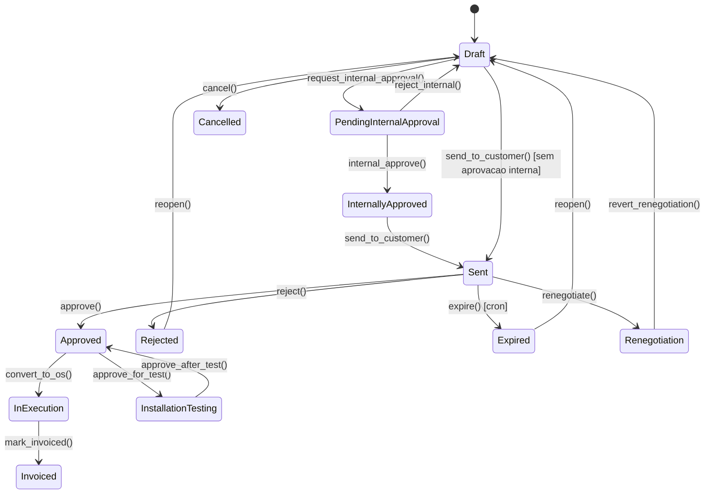
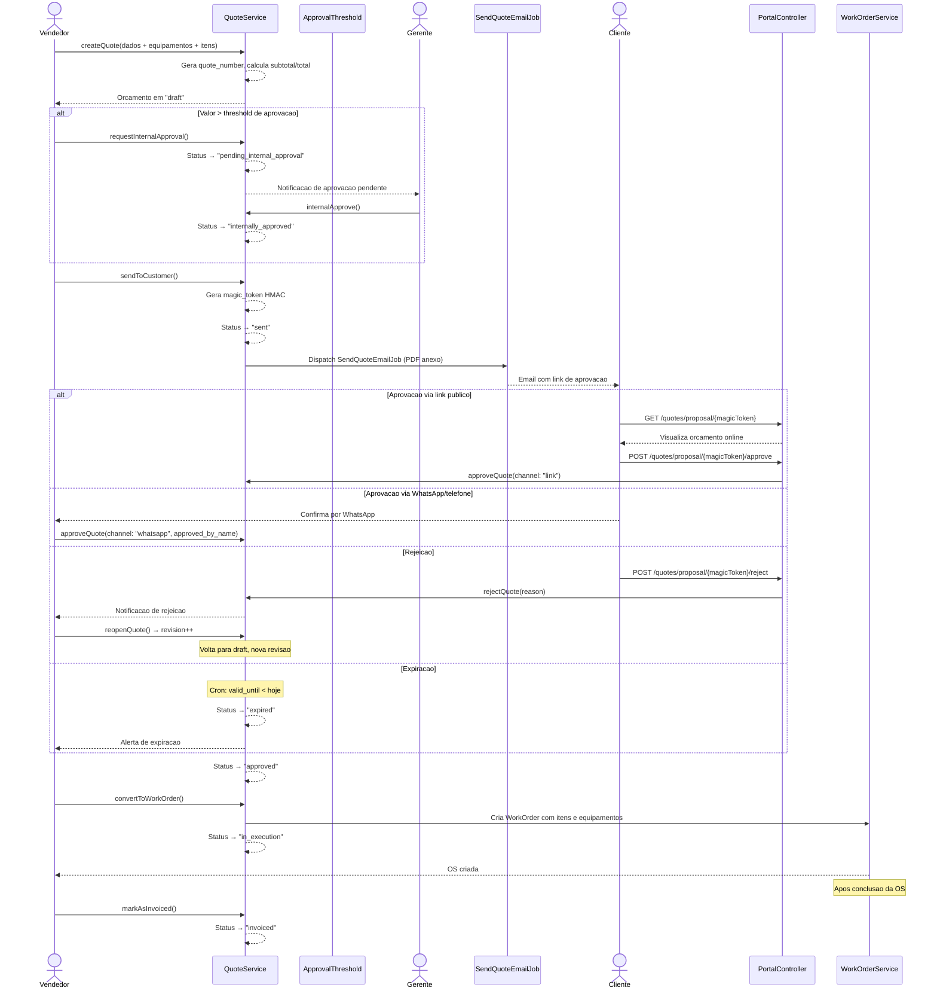

# Modulo: Orcamentos (Quotes)

## 1. Visao Geral e State Machine

> **[AI_RULE]** A IA DEVE seguir o fluxo da Maquina de Estados abaixo ao codificar Controllers e Services envolvendo Orcamentos.



### Enum: QuoteStatus (11 estados)

| Valor | Label | Editavel | Convertivel |
|---|---|:---:|:---:|
| `draft` | Rascunho | x | - |
| `pending_internal_approval` | Aguard. Aprovacao Interna | x | - |
| `internally_approved` | Aprovado Internamente | - | x |
| `sent` | Enviado | - | - |
| `approved` | Aprovado | - | x |
| `rejected` | Rejeitado | x | - |
| `expired` | Expirado | - | - |
| `in_execution` | Em Execucao | - | - |
| `installation_testing` | Instalacao p/ Teste | - | - |
| `renegotiation` | Em Renegociacao | x | - |
| `invoiced` | Faturado | - | - |

---

## 2. Entidades (Models) e Campos

### Quote (Orcamento)

| Campo | Tipo | Descricao |
|---|---|---|
| `id` | bigint | PK |
| `tenant_id` | bigint | FK → tenants |
| `quote_number` | string | Numero sequencial unico por tenant (ex: ORC-2026-0042) |
| `revision` | integer | Versao/revisao atual (inicia em 1) |
| `customer_id` | bigint | FK → customers |
| `seller_id` | bigint | FK → users (vendedor responsavel) |
| `created_by` | bigint | FK → users (quem criou) |
| `status` | enum(QuoteStatus) | Estado atual do orcamento |
| `source` | string | Origem (prospeccao, retorno, contato_direto, indicacao) |
| `valid_until` | date | Data limite de validade |
| `validity_days` | integer | Dias de validade (padrao: 30) |
| `discount_percentage` | decimal(5,2) | Percentual de desconto global |
| `discount_amount` | decimal(12,2) | Valor absoluto de desconto |
| `displacement_value` | decimal(12,2) | Valor de deslocamento |
| `subtotal` | decimal(12,2) | Soma dos itens antes de descontos |
| `total` | decimal(12,2) | Valor final apos descontos |
| `currency` | string | Moeda (padrao: BRL) |
| `observations` | text | Observacoes internas |
| `internal_notes` | text | Notas internas (nao visivel ao cliente) |
| `payment_terms` | string | Condicoes de pagamento (enum PaymentTerms) |
| `payment_terms_detail` | string | Detalhamento das condicoes |
| `template_id` | bigint | FK → quote_templates |
| `is_template` | boolean | Se e um template reutilizavel |
| `general_conditions` | text | Condicoes gerais (termos, garantias, prazos) |
| `opportunity_id` | bigint | FK → crm_deals (vinculo com oportunidade CRM) |
| `custom_fields` | json | Campos personalizados |
| `internal_approved_by` | bigint | FK → users (quem aprovou internamente) |
| `internal_approved_at` | datetime | Data/hora aprovacao interna |
| `level2_approved_by` | bigint | FK → users (aprovacao nivel 2) |
| `level2_approved_at` | datetime | Data/hora aprovacao nivel 2 |
| `sent_at` | datetime | Data/hora do envio ao cliente |
| `approved_at` | datetime | Data/hora da aprovacao pelo cliente |
| `rejected_at` | datetime | Data/hora da rejeicao |
| `rejection_reason` | text | Motivo da rejeicao |
| `last_followup_at` | datetime | Ultimo follow-up enviado |
| `followup_count` | integer | Numero de follow-ups enviados |
| `client_viewed_at` | datetime | Primeira visualizacao pelo cliente |
| `client_view_count` | integer | Total de visualizacoes |
| `magic_token` | string | Token HMAC para aprovacao publica |
| `client_ip_approval` | string | IP do cliente na aprovacao |
| `term_accepted_at` | datetime | Data de aceite dos termos |
| `is_installation_testing` | boolean | Se esta em fase de teste |
| `approval_channel` | string | Canal de aprovacao (link, whatsapp, phone, presencial) |
| `approval_notes` | text | Notas da aprovacao |
| `approved_by_name` | string | Nome de quem aprovou (externo) |

### QuoteItem (Item do Orcamento)

| Campo | Tipo | Descricao |
|---|---|---|
| `id` | bigint | PK |
| `tenant_id` | bigint | FK → tenants |
| `quote_id` | bigint | FK → quotes |
| `quote_equipment_id` | bigint | FK → quote_equipments (grupo) |
| `type` | string | Tipo (product, service) |
| `product_id` | bigint | FK → products (opcional) |
| `service_id` | bigint | FK → services (opcional) |
| `custom_description` | string | Descricao personalizada |
| `quantity` | decimal(10,2) | Quantidade |
| `original_price` | decimal(12,2) | Preco original (tabela) |
| `cost_price` | decimal(12,2) | Preco de custo |
| `unit_price` | decimal(12,2) | Preco unitario final |
| `discount_percentage` | decimal(5,2) | Desconto por item (%) |
| `subtotal` | decimal(12,2) | Total do item (qty * unit_price - discount) |
| `sort_order` | integer | Ordem de exibicao |
| `internal_note` | text | Nota interna sobre o item |

**Computed:** `marginPercentage()` = `((subtotal - cost_price * quantity) / subtotal) * 100`

### QuoteEquipment (Equipamento do Orcamento)

| Campo | Tipo | Descricao |
|---|---|---|
| `id` | bigint | PK |
| `tenant_id` | bigint | FK → tenants |
| `quote_id` | bigint | FK → quotes |
| `equipment_id` | bigint | FK → equipments (opcional) |
| `description` | string | Descricao do equipamento |
| `sort_order` | integer | Ordem de exibicao |

**Relacionamentos:** `items()` → HasMany QuoteItem, `photos()` → HasMany QuotePhoto

### QuotePhoto (Foto do Orcamento)

| Campo | Tipo | Descricao |
|---|---|---|
| `id` | bigint | PK |
| `tenant_id` | bigint | FK → tenants |
| `quote_equipment_id` | bigint | FK → quote_equipments |
| `quote_item_id` | bigint | FK → quote_items |
| `path` | string | Caminho no storage |
| `caption` | string | Legenda |
| `sort_order` | integer | Ordem |

### QuoteEmail (Log de Envio de Email)

| Campo | Tipo | Descricao |
|---|---|---|
| `id` | bigint | PK |
| `tenant_id` | bigint | FK → tenants |
| `quote_id` | bigint | FK → quotes |
| `sent_by` | bigint | FK → users |
| `recipient_email` | string | Email do destinatario |
| `recipient_name` | string | Nome do destinatario |
| `subject` | string | Assunto do email |
| `status` | string | queued, sent, failed |
| `message_body` | text | Corpo personalizado |
| `pdf_attached` | boolean | Se o PDF foi anexado |
| `queued_at` | datetime | Data de enfileiramento |
| `sent_at` | datetime | Data de envio |
| `failed_at` | datetime | Data de falha |
| `error_message` | text | Mensagem de erro |

### QuoteApprovalThreshold (Limiar de Aprovacao)

| Campo | Tipo | Descricao |
|---|---|---|
| `id` | bigint | PK |
| `tenant_id` | bigint | FK → tenants |
| `min_value` | decimal(12,2) | Valor minimo |
| `max_value` | decimal(12,2) | Valor maximo |
| `required_level` | string | Nivel requerido (level1, level2) |
| `approver_role` | string | Role do aprovador |
| `is_active` | boolean | Ativo |

### QuoteTag (Tag)

| Campo | Tipo | Descricao |
|---|---|---|
| `id` | bigint | PK |
| `tenant_id` | bigint | FK → tenants |
| `name` | string | Nome da tag |
| `color` | string | Cor hexadecimal |

**Relacionamento:** `quotes()` → BelongsToMany via `quote_quote_tag`

### QuoteTemplate (Template de Orcamento)

| Campo | Tipo | Descricao |
|---|---|---|
| `id` | bigint | PK |
| `tenant_id` | bigint | FK → tenants |
| `name` | string | Nome do template |
| `warranty_terms` | text | Termos de garantia |
| `payment_terms_text` | text | Texto de condicoes de pagamento |
| `general_conditions` | text | Condicoes gerais padrao |
| `delivery_terms` | text | Termos de entrega |

---

## 3. Services

### QuoteService (metodos principais)

| Metodo | Descricao |
|---|---|
| `createQuote(array $data, int $tenantId, int $userId): Quote` | Cria orcamento com equipamentos e itens em transacao |
| `updateQuote(Quote $quote, array $data): Quote` | Atualiza orcamento (somente status mutavel) |
| `duplicateQuote(Quote $quote): Quote` | Duplica orcamento com novo numero e status draft |
| `reopenQuote(Quote $quote): Quote` | Reabre orcamento rejeitado/expirado, incrementa revisao |
| `requestInternalApproval(Quote $quote, int $userId): Quote` | Solicita aprovacao interna |
| `internalApprove(Quote $quote, int $userId): Quote` | Aprovacao interna nivel 1 |
| `approveLevel2(Quote $quote, int $userId): Quote` | Aprovacao interna nivel 2 |
| `sendToCustomer(Quote $quote, int $userId): Quote` | Envia ao cliente, gera magic_token HMAC |
| `approveQuote(Quote $quote, ...): Quote` | Aprovacao pelo cliente (multi-canal) |
| `rejectQuote(Quote $quote, string $reason): Quote` | Rejeicao com motivo, notifica vendedor |
| `convertToWorkOrder(Quote $quote, int $userId, bool $isTest): WorkOrder` | Converte em OS |
| `convertToServiceCall(Quote $quote, int $userId): ServiceCall` | Converte em chamado tecnico |
| `sendEmail(Quote $quote, string $email, ...): QuoteEmail` | Envia email com PDF anexo |
| `generatePdf(Quote $quote): string` | Gera PDF via DomPDF |
| `sendToRenegotiation(Quote $quote): Quote` | Move para renegociacao |
| `revertFromRenegotiation(Quote $quote): Quote` | Volta de renegociacao para draft |
| `markAsInvoiced(Quote $quote): Quote` | Marca como faturado |
| `approveAfterTest(Quote $quote): Quote` | Aprova apos teste de instalacao |

---

## 4. Guard Rails de Negocio `[AI_RULE]`

> **[AI_RULE_CRITICAL] Imutabilidade de Versoes**
> Ao reabrir um orcamento (`reopenQuote`), o campo `revision` DEVE ser incrementado. O snapshot da versao anterior e salvo. E PROIBIDO alterar snapshots de versoes anteriores. Historico e append-only.

> **[AI_RULE_CRITICAL] Fluxo de Aprovacao Obrigatorio**
> Se `QuoteApprovalThreshold` esta configurado para o valor do orcamento, a transicao `draft → sent` DEVE passar por `pending_internal_approval → internally_approved` primeiro. O sistema NAO PODE pular a aprovacao interna.

> **[AI_RULE] Calculo de Precos**
> `subtotal` do QuoteItem e calculado automaticamente: `quantity * unit_price * (1 - discount_percentage/100)`. O `total` do Quote e: `SUM(items.subtotal) - discount_amount - (SUM(items.subtotal) * discount_percentage/100) + displacement_value`. O calculo ocorre no hook `saving` do model.

> **[AI_RULE] Magic Token HMAC**
> Ao enviar orcamento ao cliente (`sendToCustomer`), gerar `magic_token` via HMAC-SHA256 para link de aprovacao publica. Token deve ser unico e nao reutilizavel apos aprovacao/rejeicao.

> **[AI_RULE] Conversao Unica**
> Um orcamento aprovado gera no maximo UMA OS ou UM chamado. `convertToWorkOrder` verifica se ja existe `WorkOrder` ou `ServiceCall` com `quote_id` e lanca `QuoteAlreadyConvertedException` se existir.

> **[AI_RULE] Expiracoes Automaticas**
> Cron job diario (`QuoteExpirationAlertJob`) verifica orcamentos `sent` com `valid_until` vencido e transita para `expired`. `QuoteFollowUpJob` envia follow-ups automaticos para orcamentos sem resposta.

> **[AI_RULE_CRITICAL] Eternal Lead (CRM Feedback Loop)**
> Todo Orçamento que atingir o status `expired` ou `rejected` DEVE disparar um evento `QuoteLost`. O CRM escuta este evento e cria automaticamente um `CrmLead` (pipeline de Recorrencia/Win-back) associado ao cliente, contendo o motivo da perda, garantindo que nenhum cliente ou negócio perdido fique fora do funil comercial (regra Eternal Lead).

> **[AI_RULE] Margem Minima**
> `QuoteItem.marginPercentage()` calcula margem real. Se configurado pelo tenant, o sistema DEVE alertar quando margem ficar abaixo do limite minimo.

### 4.1 Fluxo de Aprovacao Interna — Detalhamento

O fluxo de aprovacao e controlado por `QuoteApprovalThreshold`:

**Niveis de aprovacao:**

| Nivel | Faixa de Valor | Aprovador | Acao |
|---|---|---|---|
| Sem aprovacao | total < threshold minimo ou sem thresholds configurados | N/A | `draft → sent` direto |
| Level 1 | `min_value <= total <= max_value` com `required_level = "level1"` | Usuario com permissao `quotes.quote.internal_approve` (role: `sales_manager`, `admin`) | `internalApprove()` — define `internal_approved_by`, `internal_approved_at` |
| Level 2 | `min_value <= total <= max_value` com `required_level = "level2"` | Usuario com permissao `quotes.quote.approve` E role `admin` ou `super_admin` | `approveLevel2()` — define `level2_approved_by`, `level2_approved_at` |

**[AI_RULE]** Ao chamar `sendToCustomer()`, o `QuoteService` verifica se existe `QuoteApprovalThreshold` ativo cujo range (`min_value`-`max_value`) engloba o `total` do orcamento. Se existir e `required_level = "level1"`, o status DEVE ser `internally_approved` antes do envio. Se `required_level = "level2"`, AMBAS aprovacoes (level1 + level2) DEVEM ter sido realizadas. O sistema retorna 422 com mensagem especifica se a aprovacao estiver pendente.

### 4.2 Regras de Desconto

**Limites de desconto por role:**

| Role | Desconto Maximo (%) | Desconto Maximo (R$) | Autorizacao |
|---|---|---|---|
| `sales_rep` (vendedor) | 10% | R$ 5.000,00 | Automatico |
| `sales_manager` (gerente) | 25% | R$ 25.000,00 | Automatico |
| `admin` | 100% (sem limite) | Sem limite | Automatico |

**Formula de calculo de desconto:**

```
desconto_percentual = quote.discount_percentage  // 0-100
desconto_absoluto = quote.discount_amount        // valor fixo em BRL

subtotal = SUM(item.quantity * item.unit_price * (1 - item.discount_percentage / 100))
total = subtotal - desconto_absoluto - (subtotal * desconto_percentual / 100) + displacement_value
```

**[AI_RULE]** O sistema aplica descontos em cascata: primeiro desconto por item (`QuoteItem.discount_percentage`), depois desconto global percentual (`Quote.discount_percentage`), e por ultimo desconto absoluto (`Quote.discount_amount`). O `displacement_value` e SOMADO ao total (valor de deslocamento cobrado). Se o usuario tenta aplicar desconto acima do limite do seu role, o sistema retorna 403 com `max_discount_allowed`.

**[AI_RULE]** Desconto por item NAO possui limite por role — apenas o desconto global do orcamento e restrito. Isso permite que um vendedor aplique descontos pontuais em itens especificos sem ultrapassar seu limite de desconto global.

### 4.3 Validade e Renovacao

**Regras de validade:**

- `validity_days` define o numero de dias de validade (default: 30, min: 1, max: 365)
- `valid_until` e calculado automaticamente: `created_at + validity_days` (se nao informado)
- Se `valid_until` e informado diretamente, prevalece sobre `validity_days`

**Expiracoes automaticas (`QuoteExpirationAlertJob`):**

- Executa diariamente via scheduler (`daily`)
- Busca orcamentos com `status = sent` E `valid_until < today`
- Transiciona automaticamente para `expired`
- Envia notificacao ao `seller_id` com dados do orcamento expirado

**Follow-up automatico (`QuoteFollowUpJob`):**

- Executa diariamente via scheduler
- Busca orcamentos com `status = sent` E sem atividade por N dias (configuravel por tenant)
- Envia email de follow-up ao cliente
- Incrementa `followup_count`, atualiza `last_followup_at`
- Maximo de follow-ups configuravel (default: 3)

**Renovacao:**

- Orcamento `expired` pode ser reaberto via `reopenQuote()`
- Ao reabrir, `revision` e incrementado e `valid_until` pode ser atualizado
- O vendedor deve definir nova `valid_until` ao reabrir

### 4.4 Conversao Quote → WorkOrder — Detalhamento

**Fluxo de conversao (`convertToWorkOrder`):**

1. Verifica se `quote.status` e `approved` ou `internally_approved` (se convertivel)
2. Verifica se NAO existe `WorkOrder` com `quote_id` (previne duplicidade — 409)
3. Cria `WorkOrder` em transacao DB:
   - `tenant_id` = quote.tenant_id
   - `customer_id` = quote.customer_id
   - `quote_id` = quote.id
   - `origin_type` = `'quote'`
   - `status` = `'pending'`
   - `os_number` = proximo numero sequencial
4. Para cada `QuoteEquipment`:
   - Vincula equipamento a OS (se `equipment_id` presente)
5. Para cada `QuoteItem`:
   - Cria `WorkOrderItem` com `type`, `product_id`/`service_id`, `quantity`, `unit_price`, `discount_percentage`
6. Atualiza `quote.status` para `in_execution`
7. Se `is_installation_testing = true`, status vai para `installation_testing` ao inves de `in_execution`

**[AI_RULE]** A conversao e atomica (transacao DB). Se qualquer etapa falhar, tudo e revertido. O campo `Quote.is_installation_testing` determina se a OS e criada em modo teste — nesse caso, o orcamento fica em `installation_testing` ate `approveAfterTest()`.

---

## 5. Comportamento Integrado (Cross-Domain)

| Direcao | Modulo | Integracao |
|---|---|---|
| **Quotes → WorkOrders** | WorkOrders | `convertToWorkOrder()` cria OS com itens, cliente, equipamentos. Vinculo via `work_order.quote_id`. |
| **Quotes → ServiceCalls** | ServiceCalls | `convertToServiceCall()` cria chamado tecnico. Vinculo via `service_call.quote_id`. |
| **CRM → Quotes** | CRM | Deal CRM pode gerar orcamento via `POST /crm/deals/{deal}/convert-to-quote`. `quote.opportunity_id` = deal.id. |
| **Quotes → Finance** | Finance | Orcamento aprovado e faturado (`invoiced`) gera `FiscalNote` com `quote_id`. |
| **Pricing → Quotes** | Pricing | Precos vem de `PriceList` vinculada ao cliente/categoria. `original_price` do item registra preco de tabela. |
| **Quotes → Email** | Email | `SendQuoteEmailJob` envia PDF por email. Tracking via `QuoteEmail`. |
| **Portal → Quotes** | Portal | Cliente visualiza orcamentos no portal (`GET /portal/quotes`). Aprova/rejeita via `POST /portal/quotes/{id}/status`. |
| **Quotes ← Templates** | Quotes | `QuoteTemplate` fornece condicoes gerais, garantia, pagamento padrao ao criar orcamento. |

---

## 6. Contratos JSON (API)

### POST /api/v1/quotes

```json
{
  "request": {
    "customer_id": 15,
    "seller_id": 5,
    "source": "prospeccao",
    "valid_until": "2026-04-23",
    "discount_percentage": 5.00,
    "displacement_value": 150.00,
    "payment_terms": "a_vista",
    "observations": "Cliente solicita urgencia",
    "general_conditions": "Garantia de 90 dias para calibracao",
    "equipments": [
      {
        "equipment_id": 10,
        "description": "Manometro Digital XPT-500",
        "items": [
          {
            "type": "service",
            "service_id": 3,
            "custom_description": "Calibracao RBC",
            "quantity": 1,
            "unit_price": 1750.00,
            "cost_price": 800.00
          }
        ]
      }
    ]
  },
  "response_201": {
    "data": {
      "id": 42,
      "quote_number": "ORC-2026-0042",
      "revision": 1,
      "status": "draft",
      "customer_id": 15,
      "seller_id": 5,
      "subtotal": 1750.00,
      "discount_percentage": 5.00,
      "displacement_value": 150.00,
      "total": 1812.50,
      "valid_until": "2026-04-23",
      "equipments": [
        {
          "id": 1,
          "equipment_id": 10,
          "description": "Manometro Digital XPT-500",
          "items": [
            {
              "id": 1,
              "type": "service",
              "service_id": 3,
              "description": "Calibracao RBC",
              "quantity": 1,
              "unit_price": 1750.00,
              "subtotal": 1750.00,
              "margin_percentage": 54.3
            }
          ]
        }
      ]
    }
  }
}
```

### POST /api/v1/quotes/{id}/send

```json
{
  "request": {},
  "response_200": {
    "data": {
      "id": 42,
      "status": "sent",
      "sent_at": "2026-03-24T14:30:00Z",
      "magic_token": "abc123def456...",
      "valid_until": "2026-04-23"
    },
    "message": "Orcamento enviado ao cliente com sucesso"
  }
}
```

### POST /api/v1/quotes/{id}/approve

```json
{
  "request": {
    "approval_channel": "link",
    "approval_notes": "Aprovado conforme negociacao",
    "approved_by_name": "Joao da Silva"
  },
  "response_200": {
    "data": {
      "id": 42,
      "status": "approved",
      "approved_at": "2026-03-25T09:00:00Z",
      "approval_channel": "link",
      "approved_by_name": "Joao da Silva"
    }
  }
}
```

### POST /api/v1/quotes/{id}/reject

```json
{
  "request": {
    "rejection_reason": "Preco acima do orcamento disponivel"
  },
  "response_200": {
    "data": {
      "id": 42,
      "status": "rejected",
      "rejected_at": "2026-03-25T09:00:00Z",
      "rejection_reason": "Preco acima do orcamento disponivel"
    }
  }
}
```

### POST /api/v1/quotes/{id}/convert-to-os

```json
{
  "request": {
    "is_installation_testing": false
  },
  "response_200": {
    "data": {
      "quote_id": 42,
      "quote_status": "in_execution",
      "work_order": {
        "id": 88,
        "os_number": "OS-2026-0088",
        "status": "pending",
        "customer_id": 15,
        "quote_id": 42
      }
    },
    "message": "Orcamento convertido em OS com sucesso"
  }
}
```

### POST /api/v1/quotes/proposal/{magicToken}/approve (publico)

```json
{
  "request": {
    "approved_by_name": "Maria Souza",
    "approval_notes": "Conforme alinhado por telefone"
  },
  "response_200": {
    "message": "Orcamento aprovado com sucesso",
    "data": {
      "quote_number": "ORC-2026-0042",
      "status": "approved"
    }
  }
}
```

---

## 7. Regras de Validacao (FormRequests)

### StoreQuoteRequest

```php
'customer_id'         => 'required|exists:customers,id',
'seller_id'           => 'nullable|exists:users,id',
'source'              => 'nullable|in:prospeccao,retorno,contato_direto,indicacao',
'valid_until'         => 'nullable|date|after:today',
'validity_days'       => 'nullable|integer|min:1|max:365',
'discount_percentage' => 'nullable|numeric|min:0|max:100',
'discount_amount'     => 'nullable|numeric|min:0',
'displacement_value'  => 'nullable|numeric|min:0',
'payment_terms'       => 'nullable|string',
'observations'        => 'nullable|string|max:5000',
'general_conditions'  => 'nullable|string|max:10000',
'template_id'         => 'nullable|exists:quote_templates,id',
'custom_fields'       => 'nullable|array',
'equipments'          => 'required|array|min:1',
'equipments.*.equipment_id'   => 'nullable|exists:equipments,id',
'equipments.*.description'    => 'nullable|string|max:255',
'equipments.*.items'          => 'required|array|min:1',
'equipments.*.items.*.type'           => 'required|in:product,service',
'equipments.*.items.*.product_id'     => 'required_if:type,product|exists:products,id',
'equipments.*.items.*.service_id'     => 'required_if:type,service|exists:services,id',
'equipments.*.items.*.quantity'       => 'required|numeric|min:0.01',
'equipments.*.items.*.unit_price'     => 'required|numeric|min:0',
'equipments.*.items.*.cost_price'     => 'nullable|numeric|min:0',
'equipments.*.items.*.discount_percentage' => 'nullable|numeric|min:0|max:100',
```

### SendEmailRequest

```php
'recipient_email' => 'required|email',
'recipient_name'  => 'nullable|string|max:255',
'message'         => 'nullable|string|max:5000',
```

### ApproveRequest (publico)

```php
'approved_by_name' => 'required|string|max:255',
'approval_notes'   => 'nullable|string|max:5000',
```

### RejectRequest

```php
'rejection_reason' => 'required|string|max:5000',
```

---

## 8. Permissoes (RBAC)

| Permissao | sales_rep | sales_manager | admin | client (portal) |
|---|:---:|:---:|:---:|:---:|
| `quotes.quote.view` | x | x | x | - |
| `quotes.quote.create` | x | x | x | - |
| `quotes.quote.update` | x | x | x | - |
| `quotes.quote.delete` | - | x | x | - |
| `quotes.quote.send` | x | x | x | - |
| `quotes.quote.approve` | - | x | x | - |
| `quotes.quote.internal_approve` | - | x | x | - |
| `quotes.quote.convert` | - | x | x | - |
| `quotes.quote.apply_discount` | x (ate 10%) | x (ate 25%) | x (sem limite) | - |
| Portal: visualizar orcamento | - | - | - | x |
| Portal: aprovar/rejeitar | - | - | - | x |
| Publico: aprovacao via magic_token | - | - | - | via link |

---

## 9. Diagrama de Sequencia: Ciclo Completo do Orcamento



---

## 10. Exemplos de Codigo

### PHP: QuoteService.createQuote (trecho)

```php
class QuoteService
{
    public function createQuote(array $data, int $tenantId, int $userId): Quote
    {
        return DB::transaction(function () use ($data, $tenantId, $userId) {
            $equipments = $data['equipments'] ?? [];

            $quote = Quote::create([
                'tenant_id'           => $tenantId,
                'quote_number'        => Quote::nextNumber($tenantId),
                'customer_id'         => $data['customer_id'],
                'seller_id'           => $data['seller_id'] ?? $userId,
                'created_by'          => $userId,
                'status'              => QuoteStatus::DRAFT->value,
                'source'              => $data['source'] ?? null,
                'valid_until'         => $data['valid_until'] ?? null,
                'discount_percentage' => $data['discount_percentage'] ?? 0,
                'discount_amount'     => $data['discount_amount'] ?? 0,
                'displacement_value'  => $data['displacement_value'] ?? 0,
                'currency'            => $data['currency'] ?? 'BRL',
                'general_conditions'  => $data['general_conditions'] ?? null,
                'payment_terms'       => $data['payment_terms'] ?? null,
                // ... demais campos
            ]);

            foreach ($equipments as $eqData) {
                $equipment = QuoteEquipment::create([
                    'tenant_id'    => $tenantId,
                    'quote_id'     => $quote->id,
                    'equipment_id' => $eqData['equipment_id'] ?? null,
                    'description'  => $eqData['description'] ?? null,
                ]);
                foreach ($eqData['items'] ?? [] as $itemData) {
                    QuoteItem::create([
                        'tenant_id'          => $tenantId,
                        'quote_id'           => $quote->id,
                        'quote_equipment_id' => $equipment->id,
                        'type'               => $itemData['type'],
                        'product_id'         => $itemData['product_id'] ?? null,
                        'service_id'         => $itemData['service_id'] ?? null,
                        'quantity'           => $itemData['quantity'],
                        'unit_price'         => $itemData['unit_price'],
                        'cost_price'         => $itemData['cost_price'] ?? 0,
                    ]);
                }
            }

            $quote->recalculateTotals();
            return $quote->fresh(['equipments.items', 'customer']);
        });
    }
}
```

### React Hook: useQuotes (exemplo de contrato)

```tsx
interface QuoteItem {
  id: number;
  type: 'product' | 'service';
  product_id?: number;
  service_id?: number;
  description: string;
  quantity: number;
  unit_price: number;
  cost_price: number;
  subtotal: number;
  discount_percentage: number;
  margin_percentage: number;
}

interface QuoteEquipment {
  id: number;
  equipment_id?: number;
  description: string;
  items: QuoteItem[];
}

interface Quote {
  id: number;
  quote_number: string;
  revision: number;
  status: QuoteStatus;
  customer_id: number;
  seller_id: number;
  subtotal: number;
  total: number;
  discount_percentage: number;
  displacement_value: number;
  valid_until: string;
  equipments: QuoteEquipment[];
}

type QuoteStatus =
  | 'draft' | 'pending_internal_approval' | 'internally_approved'
  | 'sent' | 'approved' | 'rejected' | 'expired'
  | 'in_execution' | 'installation_testing' | 'renegotiation' | 'invoiced';

function useQuotes() {
  const list = useQuery<Quote[]>({
    queryKey: ['quotes'],
    queryFn: () => api.get('/quotes').then(r => r.data.data),
  });

  const create = useMutation({
    mutationFn: (data: CreateQuotePayload) => api.post('/quotes', data),
    onSuccess: () => queryClient.invalidateQueries({ queryKey: ['quotes'] }),
  });

  const send = useMutation({
    mutationFn: (id: number) => api.post(`/quotes/${id}/send`),
    onSuccess: () => queryClient.invalidateQueries({ queryKey: ['quotes'] }),
  });

  const approve = useMutation({
    mutationFn: ({ id, ...data }: ApprovePayload) => api.post(`/quotes/${id}/approve`, data),
  });

  const convertToOS = useMutation({
    mutationFn: (id: number) => api.post(`/quotes/${id}/convert-to-os`),
  });

  return { quotes: list.data, create, send, approve, convertToOS };
}
```

---

### Endpoints Rest (Extraídos do Backend)

| Método | Rota | Controller | Ação |
|--------|------|------------|------|
| `GET` | `/api/items` | `QuoteController@items` | Listar |

## 11. Cenarios BDD

### Cenario: Criar orcamento com equipamentos e itens

```gherkin
Given um vendedor autenticado com permissao "quotes.quote.create"
  And um customer_id=15 ativo
When o vendedor envia POST /quotes com 1 equipamento e 2 itens (servico R$1750 + produto R$500)
Then o sistema cria o orcamento com status "draft"
  And quote_number e gerado automaticamente (ORC-2026-XXXX)
  And revision = 1
  And subtotal = 2250.00
  And total = subtotal - descontos + deslocamento
  And cada item tem subtotal calculado automaticamente
```

### Cenario: Versionamento ao reabrir orcamento rejeitado

```gherkin
Given um orcamento #42 com status "rejected" e revision=1
When o vendedor chama POST /quotes/42/reopen
Then o status volta para "draft"
  And revision incrementa para 2
  And um snapshot JSON da versao 1 e salvo no historico
  And o snapshot NAO pode ser alterado posteriormente
```

### Cenario: Envio ao cliente com magic token

```gherkin
Given um orcamento #42 com status "draft" (ou "internally_approved")
When o vendedor chama POST /quotes/42/send
Then o status muda para "sent"
  And sent_at e preenchido com a data atual
  And magic_token HMAC e gerado
  And SendQuoteEmailJob e despachado com PDF anexo
  And o cliente recebe email com link /quotes/proposal/{magicToken}
```

### Cenario: Aprovacao publica via link

```gherkin
Given um orcamento #42 com status "sent" e magic_token valido
When o cliente acessa GET /quotes/proposal/{magicToken}
Then o sistema retorna os dados do orcamento para visualizacao
  And client_viewed_at e preenchido na primeira visita
  And client_view_count e incrementado

When o cliente envia POST /quotes/proposal/{magicToken}/approve com approved_by_name="Joao"
Then o status muda para "approved"
  And approved_at e preenchido
  And approval_channel = "link"
  And client_ip_approval registra o IP do cliente
  And term_accepted_at e preenchido
  And o vendedor recebe notificacao de aprovacao
```

### Cenario: Rejeicao com motivo

```gherkin
Given um orcamento #42 com status "sent"
When o cliente envia POST /quotes/proposal/{magicToken}/reject com reason="Preco alto"
Then o status muda para "rejected"
  And rejected_at e preenchido
  And rejection_reason = "Preco alto"
  And o vendedor recebe notificacao com o motivo
```

### Cenario: Conversao em OS

```gherkin
Given um orcamento #42 com status "approved"
  And NAO existe WorkOrder com quote_id=42
When o gerente chama POST /quotes/42/convert-to-os
Then o sistema cria uma WorkOrder com os itens do orcamento
  And a WorkOrder.quote_id = 42
  And o status do orcamento muda para "in_execution"
  And o cliente, equipamentos e itens sao copiados para a OS
```

### Cenario: Conversao duplicada e bloqueada

```gherkin
Given um orcamento #42 com status "approved"
  And ja existe WorkOrder #88 com quote_id=42
When o gerente tenta POST /quotes/42/convert-to-os
Then o sistema lanca QuoteAlreadyConvertedException
  And retorna HTTP 409 com referencia a OS #88 existente
```

### Cenario: Expiracao automatica

```gherkin
Given um orcamento #42 com status "sent" e valid_until = "2026-03-23"
  And a data atual e "2026-03-24"
When o cron job QuoteExpirationAlertJob e executado
Then o status muda para "expired"
  And o vendedor recebe notificacao de expiracao
```

### Cenario: Aprovacao interna obrigatoria por threshold

```gherkin
Given um QuoteApprovalThreshold com min_value=0, max_value=50000, required_level="level1"
  And um orcamento #42 com total=30000.00 e status "draft"
When o vendedor tenta POST /quotes/42/send
Then o sistema exige aprovacao interna primeiro
  And o vendedor deve chamar POST /quotes/42/request-internal-approval
  And o gerente deve chamar POST /quotes/42/internal-approve
  And somente entao o envio ao cliente e permitido
```

---

## Edge Cases e Tratamento de Erros

> **[AI_RULE_CRITICAL]** Todo cenário abaixo DEVE ser implementado. A IA não pode ignorar ou postergar nenhum tratamento.

| Cenário | Tratamento | Código Esperado |
|---------|------------|-----------------|
| Conversão em OS quando já existe `WorkOrder` com `quote_id` igual | `QuoteService::convertToWorkOrder()` verifica existência. Lança `QuoteAlreadyConvertedException`. Retorna 409 Conflict com referência à OS existente | `409 Conflict` |
| Magic token HMAC inválido ou adulterado na aprovação pública | Controller valida HMAC contra secret do tenant. Token inválido retorna 404 genérico (não revelar existência). Rate limit 30/min no endpoint público | `404 Not Found` |
| Orçamento expirado (`valid_until < today`) — tentativa de aprovação | `QuoteService::approveQuote()` verifica `valid_until`. Se expirado, retorna 422. Job `QuoteExpirationAlertJob` marca como `expired` proativamente | `422 Unprocessable` |
| Envio ao cliente sem aprovação interna (valor > threshold) | `QuoteService::sendToCustomer()` verifica `QuoteApprovalThreshold`. Se valor > threshold e status != `internally_approved`, retorna 422. Força fluxo `request-internal-approval → internal-approve → send` | `422 Unprocessable` |
| Desconto além do limite por role (vendedor > 10%, gerente > 25%) | `QuotePolicy` valida `discount_percentage` contra limites por role. Admin sem limite. Vendedor limitado a 10%. Gerente limitado a 25% | `403 Forbidden` |
| Reabrir orçamento rejected — snapshot da versão anterior | `QuoteService::reopenQuote()` gera snapshot JSON da versão atual antes de incrementar `revision`. Snapshot salvo em `quote_history` (append-only, imutável) | `200 OK` |
| Expiração automática — orçamento enviado há mais de `validity_days` | Job diário `CheckExpiredQuotes` marca `sent` → `expired` se `valid_until < today`. Vendedor recebe notificação. Cliente NÃO recebe (evitar spam) | Via Job |
| Geração de PDF com equipamento sem itens (array vazio) | `QuoteService::generatePdf()` valida `min:1` item por equipamento. Se vazio, exclui equipamento do PDF ou retorna 422 na criação | `422 Unprocessable` |
| Cross-validation: `equipment_id` pertence a outro `customer_id` | `StoreQuoteRequest` valida `exists:equipments,id` com scope de `customer_id`. Rejeita se equipamento não pertence ao cliente do orçamento | `422 Unprocessable` |
| Orçamento com `currency != 'BRL'` (multi-moeda) | `QuoteService` aceita moedas configuradas no tenant (`SystemSetting.allowed_currencies`). Conversão cambial via `ExchangeRateService` com cache de 24h. Se serviço offline, usa última taxa válida | `200 OK` |

---

## 12. Checklist de Implementacao

- [x] Model: Quote com 40+ campos, QuoteStatus enum (11 estados)
- [x] Model: QuoteItem com calculo automatico de subtotal e margem
- [x] Model: QuoteEquipment agrupando itens por equipamento
- [x] Model: QuotePhoto para fotos de equipamentos
- [x] Model: QuoteEmail para log de envios
- [x] Model: QuoteApprovalThreshold para aprovacao por faixa de valor
- [x] Model: QuoteTag com relacao many-to-many
- [x] Model: QuoteTemplate com condicoes gerais padrao
- [x] Service: QuoteService com 18+ metodos (create, update, duplicate, send, approve, reject, convert, etc.)
- [x] Controller: QuoteController com CRUD completo + acoes de status
- [x] Controller: QuotePublicApprovalController para aprovacao via magic token
- [x] Routes: CRUD /quotes + /quotes/{id}/send + approve + reject + reopen
- [x] Routes: /quotes/{id}/convert-to-os + /quotes/{id}/convert-to-chamado
- [x] Routes: /quotes/{id}/request-internal-approval + /quotes/{id}/internal-approve + /quotes/{id}/approve-level2
- [x] Routes: /quotes/{id}/email + /quotes/{id}/pdf + /quotes/{id}/timeline
- [x] Routes: /quotes/{id}/duplicate + /quotes/{id}/renegotiate + /quotes/{id}/invoice
- [x] Routes: /quote-tags CRUD + /quote-templates CRUD + /quotes/compare
- [x] Routes: Public /quotes/proposal/{magicToken} (view, approve, reject)
- [x] Routes: Public /quotes/{quote}/public-view + public-pdf + public-approve
- [x] Jobs: SendQuoteEmailJob, QuoteExpirationAlertJob, QuoteFollowUpJob
- [x] Permissions: quotes.quote.view/create/update/delete/send/approve/internal_approve/convert/apply_discount
- [x] Geracao de PDF (DomPDF) com logo, itens, totais, condicoes, assinatura
- [x] Versionamento: revision++ ao reabrir, snapshot de versao anterior
- [x] Aprovacao multi-canal: link HMAC, WhatsApp, telefone, presencial
- [x] Migrations: quotes, quote_items, quote_equipments, quote_photos, quote_emails, quote_approval_thresholds, quote_tags, quote_templates
- [ ] Frontend: Hook useQuotes com listagem, filtros por status, busca
- [ ] Frontend: Formulario de criacao com equipamentos e itens dinamicos
- [ ] Frontend: Visualizacao de PDF inline
- [ ] Frontend: Drag-and-drop de status (Kanban de orcamentos)
- [ ] Frontend: Comparacao de revisoes lado a lado
- [ ] Testes: Feature tests para ciclo completo (create → send → approve → convert)
- [ ] Testes: Unit tests para QuoteService (calculo de totais, margem, versionamento)
- [ ] Testes: Unit tests para aprovacao publica via magic token
- [ ] Testes: Feature tests para QuoteExpirationAlertJob e QuoteFollowUpJob

---

## Fluxos Relacionados

| Fluxo | Descrição |
|-------|-----------|
| [Ciclo Comercial](file:///c:/PROJETOS/sistema/docs/fluxos/CICLO-COMERCIAL.md) | Processo documentado em `docs/fluxos/CICLO-COMERCIAL.md` |
| [Portal do Cliente](file:///c:/PROJETOS/sistema/docs/fluxos/PORTAL-CLIENTE.md) | Processo documentado em `docs/fluxos/PORTAL-CLIENTE.md` |

---

## Inventario Completo do Codigo

### Models

| Arquivo | Model |
|---------|-------|
| `backend/app/Models/Quote.php` | Quote — orcamento principal |
| `backend/app/Models/QuoteItem.php` | QuoteItem — item do orcamento |
| `backend/app/Models/QuoteEquipment.php` | QuoteEquipment — equipamento vinculado |
| `backend/app/Models/QuotePhoto.php` | QuotePhoto — foto do orcamento |
| `backend/app/Models/QuoteTag.php` | QuoteTag — tag/etiqueta |
| `backend/app/Models/QuoteTemplate.php` | QuoteTemplate — template reutilizavel |
| `backend/app/Models/QuoteEmail.php` | QuoteEmail — registro de envio de email |
| `backend/app/Models/QuoteApprovalThreshold.php` | QuoteApprovalThreshold — limites de aprovacao |
| `backend/app/Models/PurchaseQuote.php` | PurchaseQuote — cotacao de compra (fornecedores) |
| `backend/app/Models/PurchaseQuoteItem.php` | PurchaseQuoteItem — item da cotacao de compra |
| `backend/app/Models/PurchaseQuoteSupplier.php` | PurchaseQuoteSupplier — fornecedor da cotacao |
| `backend/app/Models/Lookups/QuoteSource.php` | QuoteSource — lookup de fonte do orcamento |

### Enums

| Arquivo | Enum |
|---------|------|
| `backend/app/Enums/QuoteStatus.php` | QuoteStatus — status do orcamento |

### Observer

| Arquivo | Observer |
|---------|----------|
| `backend/app/Observers/QuoteObserver.php` | QuoteObserver — escuta criacao/atualizacao para auditoria, numeracao e notificacoes |

### Events

| Arquivo | Event |
|---------|-------|
| `backend/app/Events/QuoteApproved.php` | QuoteApproved — disparado quando orcamento e aprovado |

### Listeners

| Arquivo | Listener |
|---------|----------|
| `backend/app/Listeners/HandleQuoteApproval.php` | HandleQuoteApproval — processa aprovacao |
| `backend/app/Listeners/CreateAgendaItemOnQuote.php` | CreateAgendaItemOnQuote — cria item de agenda ao criar orcamento |
| `backend/app/Listeners/GenerateCorrectiveQuoteOnCalibrationFailure.php` | GenerateCorrectiveQuoteOnCalibrationFailure — gera orcamento corretivo |

### Exceptions

| Arquivo | Exception |
|---------|-----------|
| `backend/app/Exceptions/QuoteAlreadyConvertedException.php` | QuoteAlreadyConvertedException |

### Jobs

| Arquivo | Job |
|---------|-----|
| `backend/app/Jobs/QuoteExpirationAlertJob.php` | QuoteExpirationAlertJob — alerta de orcamentos expirando |
| `backend/app/Jobs/QuoteFollowUpJob.php` | QuoteFollowUpJob — follow-up automatico de orcamentos |
| `backend/app/Jobs/SendQuoteEmailJob.php` | SendQuoteEmailJob — envio assincrono de email do orcamento |

### Console Commands

| Arquivo | Command |
|---------|---------|
| `backend/app/Console/Commands/CheckExpiredQuotes.php` | CheckExpiredQuotes — verifica orcamentos vencidos |
| `backend/app/Console/Commands/ImportAuvoQuotes.php` | ImportAuvoQuotes — importa orcamentos do Auvo |

### Mail

| Arquivo | Mailable |
|---------|----------|
| `backend/app/Mail/QuoteReadyMail.php` | QuoteReadyMail — email de orcamento pronto |

### Notifications

| Arquivo | Notification |
|---------|--------------|
| `backend/app/Notifications/QuoteStatusNotification.php` | QuoteStatusNotification — notificacao de mudanca de status |

### Policies

| Arquivo | Policy |
|---------|--------|
| `backend/app/Policies/QuotePolicy.php` | QuotePolicy — autorizacao de acoes no orcamento |

### Services

| Arquivo | Service |
|---------|---------|
| `backend/app/Services/QuoteService.php` | QuoteService — logica de negocio do orcamento |

### Support

| Arquivo | Classe |
|---------|--------|
| `backend/app/Support/QuotePaymentSummary.php` | QuotePaymentSummary — calculo de resumo financeiro |

### Resources

| Arquivo | Resource |
|---------|----------|
| `backend/app/Http/Resources/QuoteResource.php` | QuoteResource — transformacao para API |

### Controllers

| Arquivo | Controller |
|---------|------------|
| `backend/app/Http/Controllers/Api/V1/QuoteController.php` | QuoteController — CRUD principal |
| `backend/app/Http/Controllers/Api/V1/QuotePublicApprovalController.php` | QuotePublicApprovalController — aprovacao publica via magic token |
| `backend/app/Http/Controllers/Api/V1/Portal/PortalQuickQuoteApprovalController.php` | PortalQuickQuoteApprovalController — aprovacao rapida no portal |
| `backend/app/Http/Controllers/Api/V1/Technician/TechQuickQuoteController.php` | TechQuickQuoteController — orcamento rapido pelo tecnico |

### FormRequests (23 arquivos)

| Arquivo | FormRequest |
|---------|-------------|
| `backend/app/Http/Requests/Quote/StoreQuoteRequest.php` | StoreQuoteRequest |
| `backend/app/Http/Requests/Quote/UpdateQuoteRequest.php` | UpdateQuoteRequest |
| `backend/app/Http/Requests/Quote/ListQuotesRequest.php` | ListQuotesRequest |
| `backend/app/Http/Requests/Quote/AddQuoteItemRequest.php` | AddQuoteItemRequest |
| `backend/app/Http/Requests/Quote/UpdateQuoteItemRequest.php` | UpdateQuoteItemRequest |
| `backend/app/Http/Requests/Quote/AddQuoteEquipmentRequest.php` | AddQuoteEquipmentRequest |
| `backend/app/Http/Requests/Quote/UpdateQuoteEquipmentRequest.php` | UpdateQuoteEquipmentRequest |
| `backend/app/Http/Requests/Quote/StoreQuoteNestedItemRequest.php` | StoreQuoteNestedItemRequest |
| `backend/app/Http/Requests/Quote/ApproveQuoteRequest.php` | ApproveQuoteRequest |
| `backend/app/Http/Requests/Quote/ApproveQuotePublicRequest.php` | ApproveQuotePublicRequest |
| `backend/app/Http/Requests/Quote/RejectQuoteRequest.php` | RejectQuoteRequest |
| `backend/app/Http/Requests/Quote/RejectQuotePublicRequest.php` | RejectQuotePublicRequest |
| `backend/app/Http/Requests/Quote/ConvertQuoteRequest.php` | ConvertQuoteRequest |
| `backend/app/Http/Requests/Quote/SendQuoteEmailRequest.php` | SendQuoteEmailRequest |
| `backend/app/Http/Requests/Quote/BulkQuoteActionRequest.php` | BulkQuoteActionRequest |
| `backend/app/Http/Requests/Quote/CompareQuotesRequest.php` | CompareQuotesRequest |
| `backend/app/Http/Requests/Quote/StoreQuoteTagRequest.php` | StoreQuoteTagRequest |
| `backend/app/Http/Requests/Quote/SyncQuoteTagsRequest.php` | SyncQuoteTagsRequest |
| `backend/app/Http/Requests/Quote/StoreQuoteTemplateRequest.php` | StoreQuoteTemplateRequest |
| `backend/app/Http/Requests/Quote/UpdateQuoteTemplateRequest.php` | UpdateQuoteTemplateRequest |
| `backend/app/Http/Requests/Quote/UploadQuotePhotoRequest.php` | UploadQuotePhotoRequest |
| `backend/app/Http/Requests/Quote/CreateFromTemplateRequest.php` | CreateFromTemplateRequest |
| `backend/app/Http/Requests/Quote/RevertFromRenegotiationRequest.php` | RevertFromRenegotiationRequest |
| `backend/app/Http/Requests/Crm/SignQuoteRequest.php` | SignQuoteRequest |
| `backend/app/Http/Requests/Portal/UpdateQuoteStatusRequest.php` | UpdateQuoteStatusRequest |
| `backend/app/Http/Requests/Report/QuotesReportRequest.php` | QuotesReportRequest |
| `backend/app/Http/Requests/Technician/StoreTechQuickQuoteRequest.php` | StoreTechQuickQuoteRequest |

### Frontend Pages

| Arquivo | Pagina |
|---------|--------|
| `frontend/src/pages/orcamentos/QuoteCreatePage.tsx` | QuoteCreatePage |
| `frontend/src/pages/orcamentos/QuoteDetailPage.tsx` | QuoteDetailPage |
| `frontend/src/pages/orcamentos/QuoteEditPage.tsx` | QuoteEditPage |
| `frontend/src/pages/orcamentos/QuotesListPage.tsx` | QuotesListPage |
| `frontend/src/pages/orcamentos/QuotesDashboardPage.tsx` | QuotesDashboardPage |
| `frontend/src/pages/orcamentos/QuotePublicApprovalPage.tsx` | QuotePublicApprovalPage |
| `frontend/src/pages/portal/PortalQuotesPage.tsx` | PortalQuotesPage |
| `frontend/src/pages/tech/TechQuickQuotePage.tsx` | TechQuickQuotePage |
| `frontend/src/pages/relatorios/tabs/QuotesReportTab.tsx` | QuotesReportTab |

### Frontend Features

| Arquivo | Feature |
|---------|---------|
| `frontend/src/features/quotes/constants.ts` | Constantes de orcamento |
| `frontend/src/features/quotes/payment-summary.ts` | Calculo de resumo de pagamento |
| `frontend/src/features/quotes/portal.ts` | Funcoes do portal |
| `frontend/src/features/quotes/templates.ts` | Funcoes de templates |

### Frontend Lib

| Arquivo | Modulo |
|---------|--------|
| `frontend/src/lib/quote-api.ts` | API client para orcamentos |

### Frontend Types

| Arquivo | Tipo |
|---------|------|
| `frontend/src/types/quote.ts` | Interfaces TypeScript de orcamento |

### Frontend Testes

| Arquivo | Teste |
|---------|-------|
| `frontend/src/__tests__/features/quote-payment-summary.test.ts` | Teste de calculo de pagamento |
| `frontend/src/__tests__/features/quotes-constants.test.ts` | Teste de constantes |
| `frontend/src/__tests__/features/quotes-portal.test.ts` | Teste de portal |
| `frontend/src/__tests__/features/quote-templates.test.ts` | Teste de templates |
| `frontend/src/__tests__/integration/quote-flow.test.ts` | Teste de fluxo completo |
| `frontend/src/__tests__/logic/quote-financial-crm-logic.test.ts` | Teste de logica financeira/CRM |
| `frontend/src/__tests__/pages/QuoteCreatePage.test.tsx` | Teste de criacao |
| `frontend/src/__tests__/pages/QuoteDetailPage.test.tsx` | Teste de detalhe |
| `frontend/src/__tests__/pages/QuoteEditPage.test.tsx` | Teste de edicao |
| `frontend/src/__tests__/pages/QuotesListPage.test.tsx` | Teste de listagem |
| `frontend/src/__tests__/pages/QuotesDashboardPage.test.tsx` | Teste de dashboard |
| `frontend/src/__tests__/pages/QuotePublicApprovalPage.test.tsx` | Teste de aprovacao publica |
| `frontend/src/__tests__/pages/PortalQuotesPage.test.tsx` | Teste de portal |
| `frontend/src/__tests__/mocks/handlers/quote-handlers.ts` | Mock handlers para testes |

### Rotas Completas (extraidas do codigo)

#### `routes/api/quotes-service-calls.php` (autenticado)

| Metodo | Rota | Controller | Permissao |
|--------|------|------------|-----------|
| `GET` | `/api/v1/quotes` | `QuoteController@index` | `quotes.quote.view` |
| `GET` | `/api/v1/quotes-summary` | `QuoteController@summary` | `quotes.quote.view` |
| `GET` | `/api/v1/quotes-export` | `QuoteController@exportCsv` | `quotes.quote.view` |
| `GET` | `/api/v1/quotes/{quote}` | `QuoteController@show` | `quotes.quote.view` |
| `GET` | `/api/v1/quotes/{quote}/timeline` | `QuoteController@timeline` | `quotes.quote.view` |
| `GET` | `/api/v1/quotes/{quote}/pdf` | `QuoteController@pdf` | `quotes.quote.view` |
| `POST` | `/api/v1/quotes` | `QuoteController@store` | `quotes.quote.create` |
| `POST` | `/api/v1/quotes/{quote}/duplicate` | `QuoteController@duplicate` | `quotes.quote.create` |
| `PUT` | `/api/v1/quotes/{quote}` | `QuoteController@update` | `quotes.quote.update` |
| `POST` | `/api/v1/quotes/bulk-action` | `QuoteController@bulkAction` | `quotes.quote.update` |

#### Rotas publicas (sem autenticacao, com token)

| Metodo | Rota | Controller | Throttle |
|--------|------|------------|----------|
| `GET` | `/api/quotes/{quote}/public-view` | `QuoteController@publicView` | 120/min |
| `GET` | `/api/quotes/{quote}/public-pdf` | `QuoteController@publicPdf` | 120/min |
| `POST` | `/api/quotes/{quote}/public-approve` | `QuoteController@publicApprove` | 30/min |
| `GET` | `/api/quotes/proposal/{magicToken}` | `QuotePublicApprovalController@show` | 120/min |
| `POST` | `/api/quotes/proposal/{magicToken}/approve` | `QuotePublicApprovalController@approve` | 30/min |
| `POST` | `/api/quotes/proposal/{magicToken}/reject` | `QuotePublicApprovalController@reject` | 30/min |
| `POST` | `/api/v1/crm/quotes/sign/{token}` | `CrmAdvancedController@signQuote` | 30/min |

#### Rotas nested (extraidas de `routes/api/missing-routes.php`)

| Metodo | Rota | Controller | Permissao |
|--------|------|------------|-----------|
| `GET` | `/api/v1/quotes/{quote}/items` | `QuoteController@items` | `quotes.quote.view` |
| `POST` | `/api/v1/quotes/{quote}/items` | `QuoteController@storeNestedItem` | `quotes.quote.update` |

### Route Files

| Arquivo | Escopo |
|---------|--------|
| `backend/routes/api/quotes-service-calls.php` | Rotas principais de orcamentos |
| `backend/routes/api/missing-routes.php` | Rotas nested de orcamentos |
| `backend/routes/api/analytics-features.php` | Rentabilidade de orcamento |
| `backend/routes/api/advanced-lots.php` | Assinatura digital de orcamento |
| `backend/routes/api.php` | Rotas publicas (aprovacao, PDF, magic token) |
