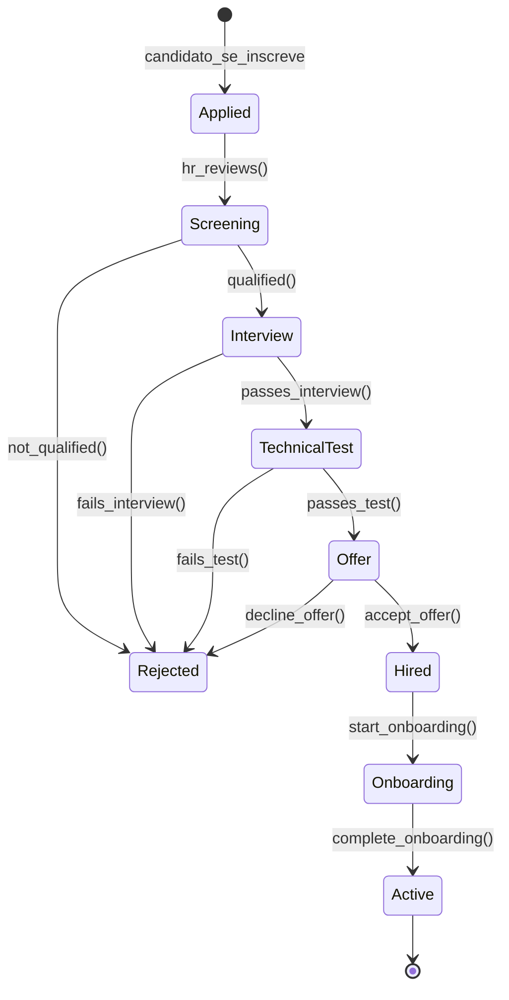
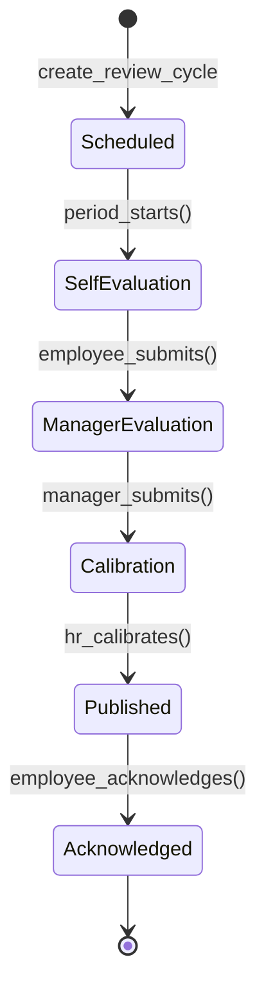
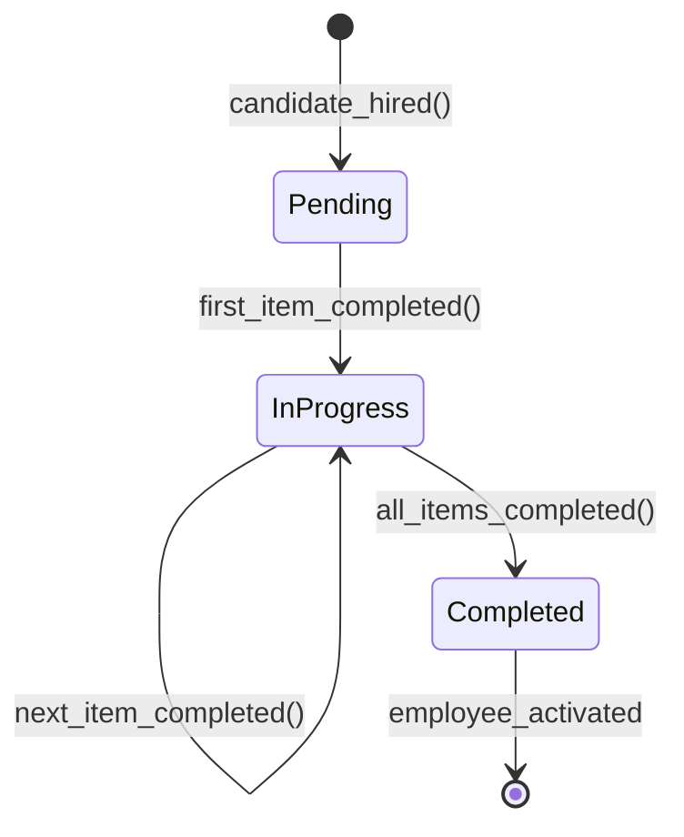
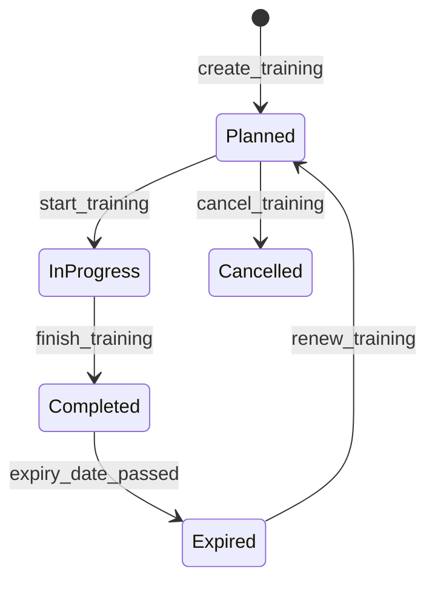
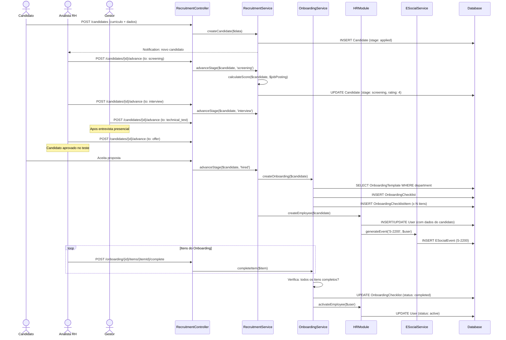
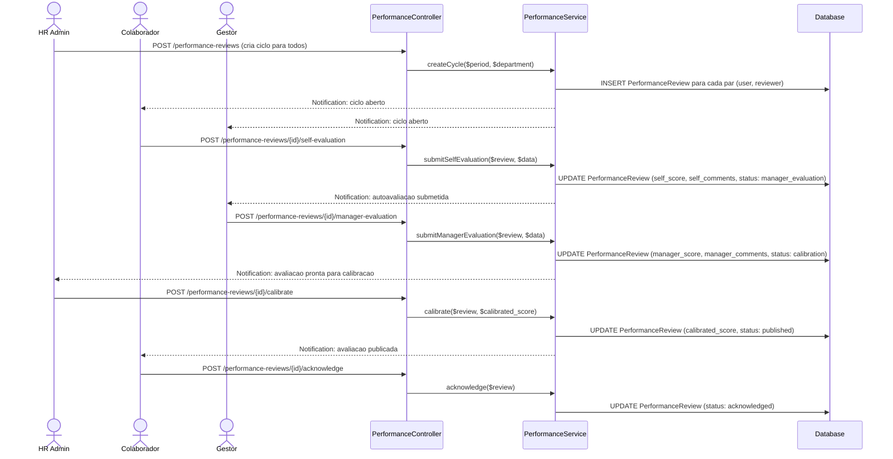

# Modulo: Recrutamento, Selecao & Desenvolvimento

> Modulo completo de gestao de talentos: pipeline de candidatos, vagas, entrevistas, scoring, onboarding programatico, avaliacoes de desempenho, feedback continuo, gamificacao, treinamentos e matriz de competencias.

---

## 1. Visao Geral

O modulo Recruitment do Kalibrium ERP gerencia o ciclo completo de talentos, desde a publicacao de vagas ate o desenvolvimento continuo dos colaboradores. Inclui pipeline de selecao, onboarding automatizado, avaliacoes de desempenho 360, gamificacao baseada em evidencias e gestao de treinamentos.

### 1.1 Responsabilidades do Modulo

- Publicacao e gestao de vagas (`JobPosting`)
- Pipeline de candidatos com scoring e etapas configuraveis
- Entrevistas e testes tecnicos rastreados
- Onboarding programatico com checklists por departamento
- Avaliacoes de desempenho com autoavaliacao + gestor + calibracao
- Feedback continuo (anonimo ou identificado)
- Gamificacao com badges baseadas em eventos mensuraveis
- Gestao de treinamentos e certificacoes
- Matriz de competencias (skills) por cargo

### 1.2 Services Relacionados

| Service | Responsabilidade |
|---------|-----------------|
| `RecruitmentService` | Pipeline de candidatos, scoring, transicoes de etapa |
| `OnboardingService` | Instanciacao automatica de checklists, acompanhamento |
| `PerformanceService` | Ciclo de avaliacao, calibracao |
| `GamificationService` | Concessao automatica de badges, calculo de scores |

---

## 2. Entidades (Models)

### 2.1 `JobPosting` — Vaga

| Campo | Tipo | Descricao |
|-------|------|-----------|
| `id` | bigint PK | Identificador unico |
| `tenant_id` | bigint FK | Tenant |
| `title` | string | Titulo da vaga |
| `description` | text | Descricao completa |
| `department` | string | Departamento |
| `location` | string | Local de trabalho |
| `employment_type` | string | Tipo: `full_time`, `part_time`, `temporary`, `intern` |
| `salary_min` | decimal(10,2) | Salario minimo da faixa |
| `salary_max` | decimal(10,2) | Salario maximo da faixa |
| `requirements` | text | Requisitos da vaga |
| `benefits` | text | Beneficios oferecidos |
| `status` | string | Status: `draft`, `open`, `closed`, `cancelled` |
| `positions_count` | integer | Quantidade de vagas |
| `published_at` | datetime | Data de publicacao |
| `closes_at` | datetime | Data de encerramento |
| `created_by` | bigint FK | Quem criou a vaga |

**Relationships:**

- `hasMany(Candidate)` — candidatos da vaga
- `hasMany(SkillRequirement)` — competencias exigidas
- `belongsTo(User, 'created_by')` — criador

**Traits:** `BelongsToTenant`, `HasFactory`

---

### 2.2 `Candidate` — Candidato

| Campo | Tipo | Descricao |
|-------|------|-----------|
| `id` | bigint PK | Identificador unico |
| `tenant_id` | bigint FK | Tenant |
| `job_posting_id` | bigint FK | Vaga a que se candidatou |
| `name` | string | Nome completo |
| `email` | string | E-mail |
| `phone` | string | Telefone |
| `resume_path` | string | Caminho do curriculo (storage) |
| `stage` | string | Etapa atual no pipeline (ver estados) |
| `notes` | text | Observacoes internas do RH |
| `rating` | integer | Nota/score do candidato (1-5) |
| `rejected_reason` | string | Motivo da rejeicao (se aplicavel) |

**Stages (Pipeline):**

```
applied -> screening -> interview -> technical_test -> offer -> hired -> onboarding -> active
                  \          \            \            \
                   \-> rejected  \-> rejected  \-> rejected  \-> rejected (decline_offer)
```

**Relationships:**

- `belongsTo(JobPosting)` — vaga

**Traits:** `BelongsToTenant`, `HasFactory`

> **[AI_RULE_CRITICAL] LGPD**: Dados de candidato nao contratado DEVEM ser anonimizados ou excluidos apos 6 meses da ultima interacao.

---

### 2.3 `Skill` — Competencia

| Campo | Tipo | Descricao |
|-------|------|-----------|
| `id` | bigint PK | Identificador unico |
| `tenant_id` | bigint FK | Tenant |
| `name` | string | Nome da competencia (ex: "Laravel", "Soldagem TIG") |
| `category` | string | Categoria: `technical`, `behavioral`, `management`, `safety` |
| `description` | text | Descricao da competencia |

**Relationships:**

- `hasMany(SkillRequirement)` — requisitos que usam esta skill

**Traits:** `BelongsToTenant`, `HasFactory`

---

### 2.4 `SkillRequirement` — Requisito de Competencia por Cargo

| Campo | Tipo | Descricao |
|-------|------|-----------|
| `id` | bigint PK | Identificador unico |
| `tenant_id` | bigint FK | Tenant |
| `position_id` | bigint FK | Cargo/posicao (ou job_posting_id) |
| `skill_id` | bigint FK | Competencia exigida |
| `required_level` | integer | Nivel minimo exigido (1-5) |

**Relationships:**

- `belongsTo(Position)` — cargo
- `belongsTo(Skill)` — competencia

**Traits:** `BelongsToTenant`, `HasFactory`

---

### 2.5 `OnboardingTemplate` — Template de Onboarding

| Campo | Tipo | Descricao |
|-------|------|-----------|
| `id` | bigint PK | Identificador unico |
| `tenant_id` | bigint FK | Tenant |
| `name` | string | Nome do template (ex: "Onboarding Tecnico") |
| `type` | string | Tipo: `admission`, `role_change`, `department_transfer` |
| `default_tasks` | json | Array de tarefas padrao |
| `is_active` | boolean | Se esta ativo |

**Relationships:**

- `hasMany(OnboardingChecklist)` — checklists instanciados

**Scopes:** `scopeActive`

**Traits:** `BelongsToTenant`, `HasFactory`

---

### 2.6 `OnboardingChecklist` — Checklist de Onboarding (Instancia)

| Campo | Tipo | Descricao |
|-------|------|-----------|
| `id` | bigint PK | Identificador unico |
| `tenant_id` | bigint FK | Tenant |
| `onboarding_template_id` | bigint FK | Template de origem |
| `user_id` | bigint FK | Colaborador em onboarding |
| `status` | string | Status: `pending`, `in_progress`, `completed` |
| `completed_at` | datetime | Quando foi finalizado |
| `due_date` | date | Prazo para conclusao |

**Relationships:**

- `belongsTo(OnboardingTemplate)` — template de origem
- `belongsTo(User)` — colaborador
- `hasMany(OnboardingChecklistItem)` — itens do checklist

**Traits:** `BelongsToTenant`, `HasFactory`

---

### 2.7 `OnboardingChecklistItem` — Item do Checklist

| Campo | Tipo | Descricao |
|-------|------|-----------|
| `id` | bigint PK | Identificador unico |
| `onboarding_checklist_id` | bigint FK | Checklist pai |
| `title` | string | Titulo do item |
| `description` | text | Descricao detalhada |
| `category` | string | Categoria: `documentation`, `training`, `access`, `equipment`, `introduction` |
| `is_completed` | boolean | Se foi concluido |
| `completed_at` | datetime | Quando foi concluido |
| `completed_by` | bigint FK | Quem concluiu |
| `responsible_id` | bigint FK | Responsavel pelo item |
| `order` | integer | Ordem de exibicao |

**Relationships:**

- `belongsTo(OnboardingChecklist)` — checklist pai
- `belongsTo(User, 'responsible_id')` — responsavel
- `belongsTo(User, 'completed_by')` — quem concluiu

---

### 2.8 `PerformanceReview` — Avaliacao de Desempenho

| Campo | Tipo | Descricao |
|-------|------|-----------|
| `id` | bigint PK | Identificador unico |
| `tenant_id` | bigint FK | Tenant |
| `user_id` | bigint FK | Colaborador avaliado |
| `reviewer_id` | bigint FK | Gestor avaliador |
| `title` | string | Titulo do ciclo (ex: "Avaliacao 2026-Q1") |
| `period_start` | date | Inicio do periodo avaliativo |
| `period_end` | date | Fim do periodo avaliativo |
| `self_score` | decimal(3,1) | Nota da autoavaliacao (0-10) |
| `self_comments` | text | Comentarios da autoavaliacao |
| `manager_score` | decimal(3,1) | Nota do gestor (0-10) |
| `manager_comments` | text | Comentarios do gestor |
| `calibrated_score` | decimal(3,1) | Nota apos calibracao RH (0-10) |
| `status` | string | Status (ver ciclo de estados) |
| `goals` | json | Metas definidas para o periodo |
| `strengths` | json | Pontos fortes identificados |
| `improvements` | json | Pontos de melhoria |
| `development_plan` | json | Plano de desenvolvimento |

**Relationships:**

- `belongsTo(User)` — colaborador avaliado
- `belongsTo(User, 'reviewer_id')` — gestor avaliador

**Traits:** `BelongsToTenant`, `HasFactory`

---

### 2.9 `ContinuousFeedback` — Feedback Continuo

| Campo | Tipo | Descricao |
|-------|------|-----------|
| `id` | bigint PK | Identificador unico |
| `tenant_id` | bigint FK | Tenant |
| `from_user_id` | bigint FK | Quem enviou |
| `to_user_id` | bigint FK | Quem recebeu |
| `type` | string | Tipo: `praise`, `constructive`, `suggestion`, `recognition` |
| `content` | text | Conteudo do feedback |
| `attachment_path` | string | Anexo opcional |
| `is_anonymous` | boolean | Se e anonimo |
| `visibility` | string | Visibilidade: `private`, `manager_only`, `public` |

**Relationships:**

- `belongsTo(User, 'from_user_id')` — remetente
- `belongsTo(User, 'to_user_id')` — destinatario

**Traits:** `BelongsToTenant`, `HasFactory`

---

### 2.10 `GamificationBadge` — Badge de Gamificacao

| Campo | Tipo | Descricao |
|-------|------|-----------|
| `id` | bigint PK | Identificador unico |
| `tenant_id` | bigint FK | Tenant |
| `name` | string | Nome do badge (ex: "Tecnico Sem Retrabalho") |
| `description` | text | Descricao do criterio |
| `icon` | string | Icone/imagem do badge |
| `category` | string | Categoria: `quality`, `productivity`, `customer`, `safety`, `teamwork` |
| `trigger_event` | string | Evento que dispara a concessao |
| `trigger_criteria` | json | Criterios mensuraveis (ex: `{"nps_min": 9, "consecutive": 3}`) |
| `points` | integer | Pontos concedidos |
| `is_active` | boolean | Se esta ativo |

**Traits:** `BelongsToTenant`, `HasFactory`

> **[AI_RULE]** Badges sao concedidos AUTOMATICAMENTE por eventos mensuraveis. A IA NAO deve implementar badges concedidos manualmente.

---

### 2.11 `GamificationScore` — Score de Gamificacao

| Campo | Tipo | Descricao |
|-------|------|-----------|
| `id` | bigint PK | Identificador unico |
| `tenant_id` | bigint FK | Tenant |
| `user_id` | bigint FK | Colaborador |
| `gamification_badge_id` | bigint FK | Badge conquistado |
| `points` | integer | Pontos recebidos |
| `earned_at` | datetime | Quando foi concedido |
| `reference_type` | string | Tipo do evento de referencia (morph) |
| `reference_id` | bigint | ID do evento de referencia |

**Relationships:**

- `belongsTo(User)` — colaborador
- `belongsTo(GamificationBadge)` — badge

**Traits:** `BelongsToTenant`, `HasFactory`

---

### 2.12 `Training` — Treinamento/Certificacao

| Campo | Tipo | Descricao |
|-------|------|-----------|
| `id` | bigint PK | Identificador unico |
| `tenant_id` | bigint FK | Tenant |
| `user_id` | bigint FK | Colaborador |
| `title` | string | Titulo do treinamento |
| `institution` | string | Instituicao realizadora |
| `certificate_number` | string | Numero do certificado |
| `completion_date` | date | Data de conclusao |
| `expiry_date` | date | Data de vencimento |
| `category` | string | Categoria: `safety`, `technical`, `regulatory`, `soft_skills`, `leadership` |
| `hours` | integer | Carga horaria |
| `status` | string | Status: `planned`, `in_progress`, `completed`, `expired`, `cancelled` |
| `notes` | text | Observacoes |
| `is_mandatory` | boolean | Se e obrigatorio para o cargo |
| `skill_area` | string | Area de competencia vinculada |
| `level` | string | Nivel: `basic`, `intermediate`, `advanced` |
| `cost` | decimal(10,2) | Custo do treinamento |
| `instructor` | string | Nome do instrutor |

**Relationships:**

- `belongsTo(User)` — colaborador

**Traits:** `BelongsToTenant`

---

## 3. Maquinas de Estado

### 3.1 Pipeline de Candidato



### 3.2 Ciclo de Avaliacao de Desempenho



### 3.3 Ciclo de Onboarding



### 3.4 Ciclo de Treinamento



---

## 4. Regras de Negocio (Guard Rails) `[AI_RULE]`

### 4.1 LGPD em Dados de Candidato `[AI_RULE_CRITICAL]`

> **[AI_RULE_CRITICAL]** Dados de `Candidate` nao contratado DEVEM ser anonimizados ou excluidos apos 6 meses da ultima interacao. Job agendado verifica mensalmente e aplica soft-delete + anonimizacao de PII (nome, CPF, telefone, email). Candidatos contratados (`Hired`) sao migrados para o modulo HR e seus dados sao preservados.

### 4.2 Avaliacao Dual Obrigatoria `[AI_RULE]`

> **[AI_RULE]** `PerformanceReview` DEVE ter autoavaliacao (`self_score` + `self_comments`) e avaliacao do gestor (`manager_score` + `manager_comments`) preenchidas antes de prosseguir para `Calibration`. A IA nao pode permitir publicacao de avaliacao unilateral. Status so avanca para `Calibration` quando ambos estao preenchidos.

### 4.3 Gamificacao Baseada em Evidencias `[AI_RULE]`

> **[AI_RULE]** `GamificationBadge` e concedida automaticamente por eventos mensuraveis:
>
> - OS concluida sem retrabalho
> - NPS do cliente > 9 em 3 avaliacoes consecutivas
> - Treinamento obrigatorio concluido antes do prazo
> - Zero violacoes CLT no mes
> - 100% de pontualidade no mes
>
> A IA NAO deve implementar badges concedidos manualmente. O campo `trigger_event` e `trigger_criteria` definem os criterios programaticos.

### 4.4 Onboarding Programatico `[AI_RULE]`

> **[AI_RULE]** Ao criar `Candidate` com status `Hired`, o `OnboardingTemplate` do departamento DEVE ser instanciado automaticamente como `OnboardingChecklist` com itens (`OnboardingChecklistItem`) predefinidos. O colaborador so e ativado (status `Active`) quando TODOS os itens do onboarding estao concluidos.

### 4.5 Scoring de Candidato `[AI_RULE]`

> **[AI_RULE]** O campo `rating` do `Candidate` e calculado com base em:
>
> - Aderencia as `SkillRequirement` da vaga (match de competencias)
> - Performance nas entrevistas (notas registradas)
> - Resultado do teste tecnico
> - Experiencia relevante (analise do curriculo)
>
> O score final influencia a ordenacao no pipeline mas NAO e criterio unico de decisao.

**Formula de scoring detalhada:**

O `RecruitmentService::calculateScore()` calcula um rating de 1 a 5 usando pesos ponderados:

| Componente | Peso | Calculo |
|---|---|---|
| Skill Match | 40% | `SUM(min(candidateLevel, requiredLevel)) / SUM(requiredLevel * 5) * 5` |
| Entrevista | 25% | Nota da entrevista normalizada para escala 1-5 |
| Teste Tecnico | 25% | Nota do teste normalizada para escala 1-5 |
| Experiencia | 10% | Anos de experiencia relevante / anos exigidos * 5 (cap em 5) |

```
rating = round(skillMatch * 0.40 + interviewScore * 0.25 + testScore * 0.25 + experienceScore * 0.10)
```

**[AI_RULE]** O rating e recalculado automaticamente a cada avanco de etapa. Nas etapas iniciais (`applied`, `screening`), apenas o skill match e considerado (os demais componentes sao zero). A medida que o candidato avanca, os scores de entrevista e teste sao incorporados.

### 4.6 Hiring Lifecycle Completo `[AI_RULE]`

> **[AI_RULE]** O ciclo completo de contratacao segue estas etapas com validacoes obrigatorias:

| Etapa | Validacao Obrigatoria | Acao do Sistema |
|---|---|---|
| `applied` → `screening` | Curriculo anexado (`resume_path` nao nulo) | Calcula rating inicial via skill match |
| `screening` → `interview` | `rating >= 2` (threshold configuravel) | Notifica gestor da area para agendar entrevista |
| `interview` → `technical_test` | Nota de entrevista registrada | Recalcula rating com peso de entrevista |
| `technical_test` → `offer` | Nota de teste >= threshold minimo | Recalcula rating final completo |
| `offer` → `hired` | Aprovacao do gestor + RH | Dispara `hireCandidate()` — cria User, OnboardingChecklist, evento S-2200 |
| `hired` → `onboarding` | OnboardingChecklist instanciado | Atualiza status do candidato automaticamente |
| `onboarding` → `active` | Todos os OnboardingChecklistItems completos | Ativa colaborador no HR, concede permissoes do cargo |

**Rejeicao em qualquer etapa:**

- Qualquer etapa (exceto `hired`, `onboarding`, `active`) pode transicionar para `rejected`
- `rejected_reason` e obrigatorio ao rejeitar
- Candidato rejeitado NAO pode ser reativado — deve criar nova candidatura

### 4.7 Onboarding Checklist — Itens Padrao por Categoria `[AI_RULE]`

> **[AI_RULE]** O `OnboardingTemplate.default_tasks` define os itens padrao. Cada tenant configura seus templates por departamento. Categorias de itens e responsaveis tipicos:

| Categoria | Itens Tipicos | Responsavel | Prazo Sugerido |
|---|---|---|---|
| `documentation` | Coletar documentos pessoais, CTPS, exame admissional, foto 3x4, dados bancarios | RH | D+3 |
| `access` | Criar usuario no sistema, email corporativo, acesso VPN, badge de acesso | TI | D+2 |
| `training` | NR-10, NR-35, treinamento do sistema ERP, procedimentos internos | Coord. Seguranca / RH | D+14 |
| `equipment` | Entrega de EPI, uniformes, ferramentas, veiculo, celular corporativo | Almoxarifado / Frota | D+5 |
| `introduction` | Apresentacao ao time, tour pelas instalacoes, mentoria com buddy | Gestor direto | D+7 |

**[AI_RULE]** O prazo do `OnboardingChecklist.due_date` e calculado como `hire_date + max(prazo de todos os itens)`. Se algum item tem prazo D+14, o due_date e 14 dias apos a contratacao. O sistema envia alertas diarios para itens vencidos e notifica o gestor quando o onboarding atinge 80% de conclusao.

### 4.8 Link HR → Recruitment (Fluxo ADMISSAO-FUNCIONARIO) `[AI_RULE]`

> **[AI_RULE]** A contratacao no Recruitment dispara o fluxo de admissao no modulo HR:

```
1. Candidate.stage = 'hired'
   ↓
2. RecruitmentService::hireCandidate()
   ├─ Cria/atualiza User com dados do candidato (name, email, phone)
   ├─ Define User.current_tenant_id = tenant_id
   ├─ Define User.position_id (cargo da vaga)
   ├─ Define User.department (departamento da vaga)
   ├─ Define User.hire_date = now()
   ├─ Define User.status = 'onboarding'
   ↓
3. OnboardingService::createOnboarding()
   ├─ Busca OnboardingTemplate do departamento
   ├─ Cria OnboardingChecklist com due_date
   ├─ Cria OnboardingChecklistItems a partir de default_tasks
   ↓
4. ESocialService::generateEvent('S-2200', $user)
   ├─ Gera evento de cadastramento inicial
   ├─ Inclui dados de admissao (cargo, salario, vinculo)
   ↓
5. OnboardingChecklist.status = 'completed' (quando todos itens concluidos)
   ├─ User.status = 'active'
   ├─ Permissoes do cargo sao concedidas
   ├─ Notificacao ao gestor: "Colaborador ativado"
```

### 4.9 Treinamentos Obrigatorios `[AI_RULE]`

> **[AI_RULE]** Treinamentos com `is_mandatory = true` que vencem (`expiry_date`) geram alerta ao gestor e ao RH. O colaborador NAO pode ser escalado para atividades que exigem o treinamento vencido (ex: NR-10, NR-35).

---

## 5. Integracao Cross-Domain

### 5.1 Recruitment -> HR

| Trigger Recruitment | Acao HR |
|--------------------|--------|
| `Candidate` com status `Hired` | Cria registro de colaborador no User model com dados do candidato |
| `OnboardingChecklist` completo | Colaborador ativado (status `Active`) no modulo HR |
| Documentos coletados no onboarding | Criados como `EmployeeDocument` no modulo HR |

### 5.2 Recruitment -> ESocial

| Trigger Recruitment | Evento eSocial |
|--------------------|----------------|
| Admissao concluida (`Hired`) | S-2200 (Cadastramento Inicial) |

### 5.3 Recruitment -> Core

| Trigger Recruitment | Acao Core |
|--------------------|-----------|
| `OnboardingChecklist` completo | `User` e criado/ativado com permissoes do cargo |
| Avaliacao publicada | `Notification` para colaborador e gestor |
| Badge conquistado | `Notification` de reconhecimento |

### 5.4 WorkOrders -> Recruitment (Gamificacao)

| Trigger OS | Acao Recruitment |
|-----------|-----------------|
| OS concluida sem retrabalho | Verifica criterio de badge "Qualidade" |
| NPS do cliente registrado | Verifica criterio de badge "Satisfacao" |
| Tecnico completou treinamento | Atualiza matriz de competencias |

### 5.5 HR -> Recruitment (Competencias)

| Trigger HR | Acao Recruitment |
|-----------|-----------------|
| Colaborador desligado | Pode gerar nova `JobPosting` automatica para reposicao |
| `Training` concluido | Atualiza `Skill` level do colaborador na matriz |
| Violacao CLT recorrente | Flag na `PerformanceReview` |

---

## 6. Contratos de API (JSON)

### 6.1 Criar Vaga

**POST** `/api/v1/recruitment/job-postings`

**Request:**

```json
{
  "title": "Tecnico de Calibracao Senior",
  "description": "Responsavel por calibracoes de equipamentos...",
  "department": "Tecnico",
  "location": "Sao Paulo - SP",
  "employment_type": "full_time",
  "salary_min": 5000.00,
  "salary_max": 8000.00,
  "requirements": "Experiencia minima de 5 anos em metrologia...",
  "benefits": "VR, VT, Plano de Saude, PLR",
  "positions_count": 2,
  "closes_at": "2026-04-30",
  "skill_requirements": [
    {"skill_id": 1, "required_level": 4},
    {"skill_id": 5, "required_level": 3}
  ]
}
```

**Response 201:**

```json
{
  "data": {
    "id": 10,
    "title": "Tecnico de Calibracao Senior",
    "status": "draft",
    "positions_count": 2,
    "candidates_count": 0,
    "skill_requirements": [
      {"skill_id": 1, "skill_name": "Metrologia", "required_level": 4},
      {"skill_id": 5, "skill_name": "ISO 17025", "required_level": 3}
    ]
  }
}
```

### 6.2 Registrar Candidato

**POST** `/api/v1/recruitment/candidates`

**Request (multipart/form-data):**

```
job_posting_id: 10
name: "Maria Santos"
email: "maria@email.com"
phone: "(11) 99999-8888"
resume: (arquivo PDF)
notes: "Indicacao do gerente tecnico"
```

**Response 201:**

```json
{
  "data": {
    "id": 50,
    "name": "Maria Santos",
    "stage": "applied",
    "job_posting_id": 10,
    "rating": null
  }
}
```

### 6.3 Avancar Candidato no Pipeline

**POST** `/api/v1/recruitment/candidates/{id}/advance`

**Request:**

```json
{
  "to_stage": "interview",
  "notes": "Curriculo aprovado. Agendar entrevista tecnica.",
  "interview_date": "2026-04-05T14:00:00Z",
  "interviewer_id": 15
}
```

**Response 200:**

```json
{
  "data": {
    "id": 50,
    "stage": "interview",
    "rating": 4,
    "timeline": [
      {"stage": "applied", "date": "2026-03-20", "by": "Sistema"},
      {"stage": "screening", "date": "2026-03-22", "by": "Ana RH"},
      {"stage": "interview", "date": "2026-03-24", "by": "Ana RH"}
    ]
  }
}
```

### 6.4 Rejeitar Candidato

**POST** `/api/v1/recruitment/candidates/{id}/reject`

**Request:**

```json
{
  "reason": "Nao atende requisito minimo de experiencia em metrologia."
}
```

### 6.5 Onboarding — Listar Checklist

**GET** `/api/v1/recruitment/onboarding/{userId}/checklist`

**Response 200:**

```json
{
  "data": {
    "id": 25,
    "user_id": 42,
    "status": "in_progress",
    "due_date": "2026-04-07",
    "progress": 60,
    "items": [
      {
        "id": 1,
        "title": "Coletar documentos pessoais",
        "category": "documentation",
        "is_completed": true,
        "completed_at": "2026-03-25",
        "responsible": "Ana RH"
      },
      {
        "id": 2,
        "title": "Configurar acesso ao sistema",
        "category": "access",
        "is_completed": true,
        "completed_at": "2026-03-25",
        "responsible": "TI"
      },
      {
        "id": 3,
        "title": "Treinamento de seguranca (NR-10)",
        "category": "training",
        "is_completed": false,
        "responsible": "Coord. Seguranca"
      },
      {
        "id": 4,
        "title": "Apresentacao aos colegas",
        "category": "introduction",
        "is_completed": false,
        "responsible": "Gestor direto"
      },
      {
        "id": 5,
        "title": "Entrega de EPI e uniformes",
        "category": "equipment",
        "is_completed": true,
        "completed_at": "2026-03-25",
        "responsible": "Almoxarifado"
      }
    ]
  }
}
```

### 6.6 Avaliacao de Desempenho — Submeter Autoavaliacao

**POST** `/api/v1/recruitment/performance-reviews/{id}/self-evaluation`

**Request:**

```json
{
  "self_score": 8.5,
  "self_comments": "Atingi 95% das metas do trimestre...",
  "goals_achieved": [
    {"goal": "Realizar 50 calibracoes/mes", "achieved": true, "comments": "Media de 55/mes"},
    {"goal": "Reduzir retrabalho em 20%", "achieved": true, "comments": "Reducao de 25%"}
  ],
  "strengths": ["Precisao tecnica", "Pontualidade"],
  "improvements": ["Comunicacao com clientes"]
}
```

### 6.7 Ranking de Gamificacao

**GET** `/api/v1/recruitment/gamification/ranking?period=2026-03`

**Response 200:**

```json
{
  "data": [
    {
      "user_id": 42,
      "user_name": "Joao Silva",
      "total_points": 450,
      "badges": [
        {"name": "Tecnico Sem Retrabalho", "icon": "star", "earned_at": "2026-03-15"},
        {"name": "Pontualidade Ouro", "icon": "clock", "earned_at": "2026-03-20"}
      ],
      "rank": 1
    },
    {
      "user_id": 38,
      "user_name": "Maria Santos",
      "total_points": 380,
      "badges": [
        {"name": "NPS Champion", "icon": "trophy", "earned_at": "2026-03-18"}
      ],
      "rank": 2
    }
  ]
}
```

---

## 7. Validacao (FormRequests)

### 7.1 JobPostingRequest

```php
public function rules(): array
{
    return [
        'title'            => 'required|string|max:255',
        'description'      => 'required|string|min:50',
        'department'       => 'required|string|max:100',
        'location'         => 'required|string|max:255',
        'employment_type'  => 'required|in:full_time,part_time,temporary,intern',
        'salary_min'       => 'nullable|numeric|min:0',
        'salary_max'       => 'nullable|numeric|gte:salary_min',
        'requirements'     => 'nullable|string',
        'benefits'         => 'nullable|string',
        'positions_count'  => 'required|integer|min:1',
        'closes_at'        => 'nullable|date|after:today',
        'skill_requirements'            => 'nullable|array',
        'skill_requirements.*.skill_id' => 'required|exists:skills,id',
        'skill_requirements.*.required_level' => 'required|integer|between:1,5',
    ];
}
```

### 7.2 CandidateRequest

```php
public function rules(): array
{
    return [
        'job_posting_id'  => 'required|exists:job_postings,id',
        'name'            => 'required|string|max:255',
        'email'           => 'required|email|max:255',
        'phone'           => 'nullable|string|max:20',
        'resume'          => 'required|file|mimes:pdf,doc,docx|max:10240',
        'notes'           => 'nullable|string|max:2000',
    ];
}
```

### 7.3 PerformanceReviewSelfRequest

```php
public function rules(): array
{
    return [
        'self_score'       => 'required|numeric|between:0,10',
        'self_comments'    => 'required|string|min:20|max:5000',
        'goals_achieved'   => 'nullable|array',
        'strengths'        => 'nullable|array',
        'improvements'     => 'nullable|array',
    ];
}
```

### 7.4 ContinuousFeedbackRequest

```php
public function rules(): array
{
    return [
        'to_user_id'  => 'required|exists:users,id',
        'type'        => 'required|in:praise,constructive,suggestion,recognition',
        'content'     => 'required|string|min:10|max:2000',
        'attachment'  => 'nullable|file|max:5120',
        'is_anonymous'=> 'nullable|boolean',
        'visibility'  => 'required|in:private,manager_only,public',
    ];
}
```

---

## 8. Permissoes e Papeis

### 8.1 Permissoes do Modulo Recruitment

| Permissao | Descricao |
|-----------|-----------|
| `recruitment.postings.view` | Visualizar vagas |
| `recruitment.postings.manage` | Criar e gerenciar vagas |
| `recruitment.candidates.view` | Visualizar candidatos |
| `recruitment.candidates.manage` | Gerenciar candidatos no pipeline |
| `recruitment.onboarding.view` | Visualizar checklists de onboarding |
| `recruitment.onboarding.manage` | Gerenciar onboarding |
| `recruitment.performance.view` | Visualizar avaliacoes (proprias) |
| `recruitment.performance.manage` | Gerenciar ciclos de avaliacao |
| `recruitment.performance.calibrate` | Calibrar avaliacoes |
| `recruitment.feedback.send` | Enviar feedback |
| `recruitment.feedback.view_all` | Ver todos os feedbacks (gestor) |
| `recruitment.gamification.view` | Ver ranking e badges |
| `recruitment.gamification.manage` | Gerenciar badges e criterios |
| `recruitment.training.view` | Visualizar treinamentos (proprios) |
| `recruitment.training.manage` | Gerenciar treinamentos |

### 8.2 Matriz de Papeis

| Acao | employee | manager | hr_admin |
|------|----------|---------|----------|
| Ver vagas abertas | X | X | X |
| Criar/editar vagas | - | X | X |
| Ver candidatos | - | X | X |
| Avancar/rejeitar candidato | - | X | X |
| Ver proprio onboarding | X | X | X |
| Gerenciar onboarding do time | - | X | X |
| Fazer autoavaliacao | X | X | X |
| Avaliar subordinado | - | X | X |
| Calibrar avaliacoes | - | - | X |
| Enviar feedback | X | X | X |
| Ver todos os feedbacks | - | X | X |
| Ver ranking gamificacao | X | X | X |
| Configurar badges | - | - | X |
| Ver proprios treinamentos | X | X | X |
| Gerenciar treinamentos | - | X | X |

---

## 9. Diagramas de Sequencia

### 9.1 Pipeline Completo de Candidato ate Onboarding



### 9.2 Ciclo de Avaliacao de Desempenho



---

## 10. Implementacao de Referencia

### 10.1 Onboarding Automatico (PHP)

```php
// Ao contratar candidato, instanciar onboarding automaticamente

public function hireCandidate(Candidate $candidate): void
{
    $candidate->update(['stage' => 'hired']);

    // 1. Busca template de onboarding do departamento
    $template = OnboardingTemplate::where('tenant_id', $candidate->tenant_id)
        ->where('type', 'admission')
        ->active()
        ->first();

    if (!$template) {
        throw new \DomainException('Nenhum template de onboarding ativo.');
    }

    // 2. Cria checklist
    $checklist = OnboardingChecklist::create([
        'tenant_id' => $candidate->tenant_id,
        'onboarding_template_id' => $template->id,
        'user_id' => $candidate->user_id,
        'status' => 'pending',
        'due_date' => now()->addDays(14),
    ]);

    // 3. Instancia itens do template
    foreach ($template->default_tasks as $i => $task) {
        OnboardingChecklistItem::create([
            'onboarding_checklist_id' => $checklist->id,
            'title' => $task['title'],
            'description' => $task['description'] ?? null,
            'category' => $task['category'] ?? 'other',
            'responsible_id' => $task['responsible_id'] ?? null,
            'order' => $i + 1,
            'is_completed' => false,
        ]);
    }
}
```

### 10.2 Scoring de Candidato (PHP)

```php
// Calculo automatico de score baseado em skill match

public function calculateScore(Candidate $candidate, JobPosting $posting): int
{
    $requirements = SkillRequirement::where('position_id', $posting->id)->get();

    if ($requirements->isEmpty()) {
        return 0;
    }

    $totalMatch = 0;
    $totalPossible = $requirements->count() * 5; // max level = 5

    foreach ($requirements as $req) {
        // Verifica se candidato tem a skill (via curriculo/testes)
        $candidateLevel = $this->assessCandidateSkill($candidate, $req->skill_id);
        $match = min($candidateLevel, $req->required_level);
        $totalMatch += $match;
    }

    // Score de 1 a 5
    return (int) round(($totalMatch / $totalPossible) * 5);
}
```

### 10.3 Frontend — useCandidatePipeline Hook (TypeScript)

```typescript
// frontend/src/hooks/useCandidatePipeline.ts

interface Candidate {
  id: number;
  name: string;
  email: string;
  phone: string | null;
  stage: 'applied' | 'screening' | 'interview' | 'technical_test' | 'offer' | 'hired' | 'onboarding' | 'active' | 'rejected';
  rating: number | null;
  job_posting_id: number;
  resume_path: string | null;
  rejected_reason: string | null;
}

interface JobPosting {
  id: number;
  title: string;
  status: 'draft' | 'open' | 'closed' | 'cancelled';
  positions_count: number;
  candidates_count: number;
  skill_requirements: Array<{
    skill_id: number;
    skill_name: string;
    required_level: number;
  }>;
}

export function useCandidatePipeline(jobPostingId: number) {
  const advanceCandidate = async (candidateId: number, toStage: string, notes?: string) => {
    const response = await api.post(`/recruitment/candidates/${candidateId}/advance`, {
      to_stage: toStage,
      notes,
    });
    return response.data.data;
  };

  const rejectCandidate = async (candidateId: number, reason: string) => {
    const response = await api.post(`/recruitment/candidates/${candidateId}/reject`, {
      reason,
    });
    return response.data.data;
  };

  const getCandidatesByStage = async () => {
    const response = await api.get(`/recruitment/job-postings/${jobPostingId}/candidates`);
    return response.data.data;
  };

  return { advanceCandidate, rejectCandidate, getCandidatesByStage };
}
```

---

### Endpoints Rest (Extraídos do Backend)

| Método | Rota | Controller | Ação |
|--------|------|------------|------|
| `GET` | `/api/v1/recruitment` | `RecruitmentController@index` | Listar |
| `GET` | `/api/v1/recruitment/{id}` | `RecruitmentController@show` | Detalhes |
| `POST` | `/api/v1/recruitment` | `RecruitmentController@store` | Criar |
| `PUT` | `/api/v1/recruitment/{id}` | `RecruitmentController@update` | Atualizar |
| `DELETE` | `/api/v1/recruitment/{id}` | `RecruitmentController@destroy` | Excluir |

## 11. Cenarios BDD

### 11.1 Pipeline de Candidato

```gherkin
Funcionalidade: Pipeline de Recrutamento e Selecao

  Cenario: Candidato percorre pipeline completo ate contratacao
    Dado que existe uma vaga "Tecnico de Calibracao" aberta com 2 posicoes
    E que "Maria Santos" se candidatou com curriculo PDF
    Quando o RH avanca Maria para "screening"
    Entao o stage de Maria deve ser "screening"
    E o rating deve ser calculado automaticamente

    Quando o RH avanca Maria para "interview"
    E o gestor registra nota 8.5 na entrevista
    E o RH avanca Maria para "technical_test"
    E Maria atinge nota 9.0 no teste tecnico
    E o RH avanca Maria para "offer"
    E Maria aceita a proposta
    Entao o stage de Maria deve ser "hired"
    E um OnboardingChecklist deve ser criado automaticamente
    E um evento eSocial S-2200 deve ser gerado

  Cenario: Candidato rejeitado na triagem
    Dado que "Pedro Souza" se candidatou para "Tecnico Senior"
    Quando o RH rejeita Pedro com motivo "Experiencia insuficiente"
    Entao o stage de Pedro deve ser "rejected"
    E rejected_reason deve ser "Experiencia insuficiente"
```

### 11.2 Onboarding Programatico

```gherkin
Funcionalidade: Onboarding Programatico com Checklist

  Cenario: Onboarding completo ativa colaborador
    Dado que "Maria" foi contratada e tem OnboardingChecklist com 5 itens
    E que os itens sao: documentos, acesso, treinamento NR-10, apresentacao, EPI
    Quando o RH marca "documentos" como concluido
    E o TI marca "acesso" como concluido
    E o Coord. Seguranca marca "treinamento NR-10" como concluido
    E o gestor marca "apresentacao" como concluido
    E o almoxarifado marca "EPI" como concluido
    Entao o OnboardingChecklist deve ter status "completed"
    E o colaborador Maria deve ter status "active" no modulo HR

  Cenario: Onboarding incompleto bloqueia ativacao
    Dado que "Joao" tem 3 de 5 itens completos
    Quando o sistema verifica o onboarding
    Entao o status deve ser "in_progress"
    E Joao NAO pode ser ativado como colaborador ativo
```

### 11.3 Avaliacao de Desempenho

```gherkin
Funcionalidade: Ciclo de Avaliacao de Desempenho

  Cenario: Avaliacao dual obrigatoria
    Dado que existe um ciclo de avaliacao Q1/2026
    E que "Joao" submeteu autoavaliacao com score 8.5
    Quando o gestor "Ana" tenta calibrar sem ter submetido a avaliacao dela
    Entao o sistema deve bloquear com erro "Avaliacao do gestor pendente"

  Cenario: Ciclo completo de avaliacao
    Dado que "Joao" submeteu autoavaliacao (score: 8.5)
    E que o gestor "Ana" submeteu avaliacao (score: 7.0)
    Quando o RH calibra para score 7.5
    E publica a avaliacao
    Entao "Joao" deve receber notificacao
    E o status deve ser "published"
    E quando Joao reconhece, o status deve ser "acknowledged"
```

### 11.4 Gamificacao

```gherkin
Funcionalidade: Gamificacao Baseada em Evidencias

  Cenario: Badge automatico por OS sem retrabalho
    Dado que existe o badge "Tecnico Sem Retrabalho" com criterio: 10 OS consecutivas sem retrabalho
    E que "Joao" completou 10 OS seguidas com status "approved"
    Quando o GamificationService verifica os criterios
    Entao Joao deve receber o badge automaticamente
    E um GamificationScore deve ser criado com os pontos do badge
    E Joao deve receber notificacao de reconhecimento

  Cenario: Badge NAO pode ser concedido manualmente
    Dado que o gestor "Ana" tenta conceder badge manualmente para "Pedro"
    Quando ela envia a requisicao
    Entao o sistema deve bloquear com erro "Badges sao concedidos automaticamente"
```

### 11.5 LGPD — Anonimizacao de Candidato

```gherkin
Funcionalidade: Conformidade LGPD para Dados de Candidatos

  Cenario: Anonimizar candidato nao contratado apos 6 meses
    Dado que "Carlos" foi rejeitado ha 7 meses
    E que nenhuma interacao ocorreu desde a rejeicao
    Quando o job mensal de anonimizacao LGPD executa
    Entao o nome de Carlos deve ser substituido por "Anonimizado"
    E o email deve ser substituido por hash
    E o telefone deve ser removido
    E o curriculo deve ser excluido do storage

  Cenario: Candidato contratado preserva dados
    Dado que "Maria" foi contratada ha 8 meses
    Quando o job mensal de anonimizacao executa
    Entao os dados de Maria NAO devem ser anonimizados
    E seus dados devem estar preservados no modulo HR
```

---

## Edge Cases e Tratamento de Erros `[AI_RULE_CRITICAL]`

> **[AI_RULE_CRITICAL]** Ao implementar o módulo **Recruitment**, a IA DEVE testar os cenários de falha abaixo e garantir que o sistema não permita violações de compliance (LGPD, ISO) ou corrupção do pipeline.

| Cenário de Borda | Tratamento Obrigatório (Guard Rail) | Código / Validação Esperada |
|-----------------|--------------------------------------|---------------------------|
| **Candidato movido em paralelo (Race Condition)** | Dois recrutadores avançam candidato ao mesmo tempo. Pode gerar duplicação de emails ou stages pulados. | Usar _Optimistic Locking_ na tabela `candidates` ou validar stage atual estrito antes da transição. |
| **Gamification Exploit (Loop de badges)** | Manipulação de OS para forçar ganho artificial do badge "Sem Retrabalho". | O `GamificationService` deve agregar logs em background via Queue diária, ignorando atualizações em massa repetidas no mesmo timestamp. |
| **Avaliação Dual Incompleta** | Calibrador tenta aprovar avaliação onde Gestor ou Colaborador não submeteram notas. | O status da `PerformanceReview` DEVE obrigatoriamente estar em `calibration` para sofrer a ação. |
| **Atraso na Anonimização LGPD** | Candidato pede deleção manual antes do cron de 6 meses rodar. | Implementar botão `GDPR Forget` que ativa o `AnonymizeCandidateJob` de imediato com soft-delete forçado. |
| **Duplicidade de Candidato** | Mesmo candidato se inscreve em 5 vagas usando emails parecidos. | Matcher de CPF obrigatorio na triagem avançada para clusterizar o entity `User` candidato. |
| **Onboarding Bloqueador (NR-10)** | Técnico não fez treinamento de risco mas onboarding é dado como "concluído". | `OnboardingService` deve barrar status `completed` se houver tasks críticas (tagged com `safety_critical:true`) pendentes. |

---

## 12. Checklist de Completude

### 12.1 Backend

- [x] `JobPosting` model com status e skill requirements
- [x] `Candidate` model com pipeline de stages
- [x] `Skill` model com categorias
- [x] `SkillRequirement` model vinculando skill a cargo
- [x] `OnboardingTemplate` model com default_tasks (JSON)
- [x] `OnboardingChecklist` model com status tracking
- [x] `OnboardingChecklistItem` model com responsavel e conclusao
- [x] `PerformanceReview` model com dual evaluation
- [x] `ContinuousFeedback` model com anonimato e visibilidade
- [x] `GamificationBadge` model com trigger automatico
- [x] `GamificationScore` model com morph reference
- [x] `Training` model com vencimento e obrigatoriedade
- [x] Rotas API com middleware de permissao
- [x] FormRequests com validacao completa
- [x] Job LGPD de anonimizacao mensal

### 12.2 Frontend

- [x] Kanban board de pipeline de candidatos
- [x] Formulario de criacao de vagas com skill requirements
- [x] Tela de onboarding com progress tracker
- [x] Formulario de autoavaliacao/avaliacao do gestor
- [x] Feed de feedback continuo
- [x] Dashboard de gamificacao com ranking
- [x] Gestao de treinamentos e certificacoes

### 12.3 Testes

- [x] Teste de pipeline completo (applied -> active)
- [x] Teste de onboarding automatico
- [x] Teste de avaliacao dual obrigatoria
- [x] Teste de gamificacao automatica (nao manual)
- [x] Teste de anonimizacao LGPD
- [x] Teste de scoring de candidato
- [x] Teste de treinamento obrigatorio expirado

### 12.4 Compliance

- [x] LGPD — anonimizacao de candidatos nao contratados (6 meses)
- [x] Avaliacao dual obrigatoria (auto + gestor)
- [x] Gamificacao baseada em evidencias (nao manual)
- [x] Onboarding programatico (template -> checklist automatico)
- [x] Integracao eSocial S-2200 na admissao
- [x] Treinamentos obrigatorios com vencimento rastreado

### 12.5 Pendentes de Implementacao

#### Backend
- [ ] Models com `BelongsToTenant`, `$fillable`, `$casts`, relationships
- [ ] Migrations com `tenant_id`, indexes, foreign keys
- [ ] Controllers seguem padrão Resource (index/store/show/update/destroy)
- [ ] FormRequests com validação completa (required, tipos, exists)
- [ ] Services encapsulam lógica de negócio e transições de estado
- [ ] Policies com permissões Spatie registradas
- [ ] Routes registradas em `routes/api/`
- [ ] Events/Listeners para integrações cross-domain
- [ ] RecruitmentService com pipeline de candidatos e scoring automático
- [ ] Transições de etapa do pipeline (applied → screening → interview → offer → hired/rejected) com validação
- [ ] OnboardingService com instanciação automática de checklists por departamento
- [ ] PerformanceService com ciclo de avaliação 360 (autoavaliação + gestor + calibração)
- [ ] GamificationService com concessão automática de badges por eventos mensuráveis
- [ ] Gestão de treinamentos e certificações com controle de validade
- [ ] Matriz de competências (skills) por cargo com gap analysis

#### Frontend
- [ ] Páginas de listagem, criação, edição
- [ ] Tipos TypeScript espelhando response da API
- [ ] Componentes seguem Design System (tokens, componentes)
- [ ] Kanban board para pipeline de candidatos com drag-and-drop
- [ ] Formulário de avaliação de desempenho 360
- [ ] Dashboard de People Analytics com métricas de recrutamento
- [ ] Página de onboarding com checklist interativo

#### Testes
- [ ] Feature tests para cada endpoint (happy path + error + validation + auth)
- [ ] Unit tests para Services (lógica de negócio, state machine)
- [ ] Tenant isolation verificado em todos os endpoints
- [ ] Testes de transição de pipeline (etapas válidas e inválidas)
- [ ] Testes de scoring de candidatos (cálculo, ranking, desempate)
- [ ] Testes de onboarding automático (criação de checklists por departamento)
- [ ] Testes de avaliação 360 (ciclo completo, calibração)

#### Qualidade
- [ ] Zero `TODO` / `FIXME` no código
- [ ] Guard Rails `[AI_RULE]` implementados e testados
- [ ] Cross-domain integrations conectadas e funcionais (HR ↔ Recruitment ↔ Gamification)

---

## Fluxos Relacionados

| Fluxo | Descrição |
|-------|-----------|
| [Recrutamento e Seleção](file:///c:/PROJETOS/sistema/docs/fluxos/RECRUTAMENTO-SELECAO.md) | Processo documentado em `docs/fluxos/RECRUTAMENTO-SELECAO.md` |

---

## Inventario Completo do Codigo

### Models

| Arquivo | Model |
|---------|-------|
| `backend/app/Models/Candidate.php` | Candidate — candidato a vaga |
| `backend/app/Models/JobPosting.php` | JobPosting — vaga de emprego |

#### Candidate — Campos Reais do Codigo

| Campo | Tipo | Descricao |
|-------|------|-----------|
| `tenant_id` | bigint FK | Tenant |
| `job_posting_id` | bigint FK | Vaga vinculada |
| `name` | string | Nome do candidato |
| `email` | string | Email |
| `phone` | string | Telefone |
| `resume_path` | string | Caminho do curriculo |
| `stage` | string | Estagio do pipeline |
| `notes` | text | Observacoes |
| `rating` | integer | Avaliacao (1-5) |
| `rejected_reason` | string | Motivo de rejeicao |

**Traits:** `BelongsToTenant`, `HasFactory`
**Relationships:** `jobPosting(): BelongsTo → JobPosting`

#### JobPosting — Campos Reais do Codigo

| Campo | Tipo | Descricao |
|-------|------|-----------|
| `tenant_id` | bigint FK | Tenant |
| `title` | string | Titulo da vaga |
| `department_id` | bigint FK | Departamento |
| `position_id` | bigint FK | Cargo |
| `description` | text | Descricao |
| `requirements` | text | Requisitos |
| `salary_range_min` | decimal(10,2) | Salario minimo |
| `salary_range_max` | decimal(10,2) | Salario maximo |
| `status` | string | Status da vaga |
| `opened_at` | datetime | Data de abertura |
| `closed_at` | datetime | Data de fechamento |

**Traits:** `BelongsToTenant`, `HasFactory`
**Relationships:** `department(): BelongsTo → Department`, `position(): BelongsTo → Position`, `candidates(): HasMany → Candidate`

### Controllers

| Arquivo | Controller |
|---------|------------|
| `backend/app/Http/Controllers/Api/V1/RecruitmentController.php` | RecruitmentController — CRUD de vagas e candidatos |
| `backend/app/Http/Controllers/Api/V1/JobPostingController.php` | JobPostingController — rotas legadas de candidatos |

### FormRequests

| Arquivo | FormRequest |
|---------|-------------|
| `backend/app/Http/Requests/HR/StoreCandidateRequest.php` | StoreCandidateRequest |
| `backend/app/Http/Requests/HR/UpdateCandidateRequest.php` | UpdateCandidateRequest |
| `backend/app/Http/Requests/HR/StoreJobPostingRequest.php` | StoreJobPostingRequest |
| `backend/app/Http/Requests/HR/UpdateJobPostingRequest.php` | UpdateJobPostingRequest |

### Resources

| Arquivo | Resource |
|---------|----------|
| `backend/app/Http/Resources/CandidateResource.php` | CandidateResource |
| `backend/app/Http/Resources/JobPostingResource.php` | JobPostingResource |

### Policies

| Arquivo | Policy |
|---------|--------|
| `backend/app/Policies/JobPostingPolicy.php` | JobPostingPolicy |

### Frontend Hooks

| Arquivo | Hook |
|---------|------|
| `frontend/src/hooks/useRecruitment.ts` | useRecruitment — CRUD de vagas e candidatos |
| `frontend/src/hooks/useSkills.ts` | useSkills — matriz de competencias |

### Frontend Pages

| Arquivo | Pagina |
|---------|--------|
| `frontend/src/pages/rh/RecruitmentPage.tsx` | RecruitmentPage — lista de vagas |
| `frontend/src/pages/rh/RecruitmentKanbanPage.tsx` | RecruitmentKanbanPage — pipeline kanban de candidatos |

### Paginas RH Relacionadas (33 paginas em `frontend/src/pages/rh/`)

| Pagina | Descricao |
|--------|-----------|
| `HRPage.tsx` | Dashboard principal RH |
| `OnboardingPage.tsx` | Onboarding de novos funcionarios |
| `PerformancePage.tsx` | Avaliacoes de desempenho |
| `PerformanceReviewDetailPage.tsx` | Detalhe da avaliacao |
| `SkillsMatrixPage.tsx` | Matriz de competencias |
| `BenefitsPage.tsx` | Gestao de beneficios |
| `PayrollPage.tsx` | Folha de pagamento |
| `PayslipPage.tsx` | Contracheque |
| `LeavesPage.tsx` | Ferias e licencas |
| `LeavesManagementPage.tsx` | Gestao de ferias |
| `VacationBalancePage.tsx` | Saldo de ferias |
| `ClockInPage.tsx` | Registro de ponto |
| `ClockAdjustmentsPage.tsx` | Ajustes de ponto |
| `EspelhoPontoPage.tsx` | Espelho de ponto |
| `JourneyPage.tsx` | Jornadas de trabalho |
| `JourneyRulesPage.tsx` | Regras de jornada |
| `WorkSchedulesPage.tsx` | Escalas de trabalho |
| `HourBankPage.tsx` | Banco de horas |
| `HourBankDetailPage.tsx` | Detalhe banco de horas |
| `HolidaysPage.tsx` | Feriados |
| `OrgChartPage.tsx` | Organograma |
| `EmployeeDocumentsPage.tsx` | Documentos do funcionario |
| `ESocialPage.tsx` | eSocial |
| `CltViolationsPage.tsx` | Violacoes CLT |
| `FiscalCompliancePage.tsx` | Compliance fiscal |
| `GeofenceLocationsPage.tsx` | Locais de geofence |
| `TaxTablesPage.tsx` | Tabelas de impostos |
| `AccountingReportsPage.tsx` | Relatorios contabeis |
| `AuditTrailPage.tsx` | Trilha de auditoria |
| `PeopleAnalyticsPage.tsx` | People Analytics |
| `RescissionPage.tsx` | Rescisao contratual |
| `RecruitmentPage.tsx` | Recrutamento |
| `RecruitmentKanbanPage.tsx` | Kanban de recrutamento |

### Rotas Completas (extraidas do codigo)

#### `routes/api/hr-quality-automation.php` (permissao: `hr.recruitment.view` / `hr.recruitment.manage`)

| Metodo | Rota | Controller | Acao |
|--------|------|------------|------|
| `GET` | `/api/v1/job-postings` | `RecruitmentController@index` | Listar vagas |
| `GET` | `/api/v1/job-postings/{jobPosting}` | `RecruitmentController@show` | Detalhe da vaga |
| `POST` | `/api/v1/job-postings` | `RecruitmentController@store` | Criar vaga |
| `PUT` | `/api/v1/job-postings/{jobPosting}` | `RecruitmentController@update` | Atualizar vaga |
| `DELETE` | `/api/v1/job-postings/{jobPosting}` | `RecruitmentController@destroy` | Excluir vaga |
| `POST` | `/api/v1/job-postings/{jobPosting}/candidates` | `RecruitmentController@storeCandidate` | Adicionar candidato |
| `PUT` | `/api/v1/job-postings/{jobPosting}/candidates/{candidate}` | `RecruitmentController@updateCandidate` | Atualizar candidato |
| `DELETE` | `/api/v1/job-postings/{jobPosting}/candidates/{candidate}` | `RecruitmentController@destroyCandidate` | Remover candidato |

#### `routes/api/advanced-features.php` (rotas legadas)

| Metodo | Rota | Controller | Acao |
|--------|------|------------|------|
| `GET` | `/api/v1/hr/job-postings/{jobPosting}/candidates` | `JobPostingController@candidates` | Listar candidatos (legado) |
| `PUT` | `/api/v1/hr/candidates/{candidate}` | `JobPostingController@updateCandidate` | Atualizar candidato (legado) |
| `DELETE` | `/api/v1/hr/candidates/{candidate}` | `JobPostingController@destroyCandidate` | Remover candidato (legado) |

### Route Files

| Arquivo | Escopo |
|---------|--------|
| `backend/routes/api/hr-quality-automation.php` | Rotas principais de recrutamento |
| `backend/routes/api/advanced-features.php` | Rotas legadas de candidatos |
