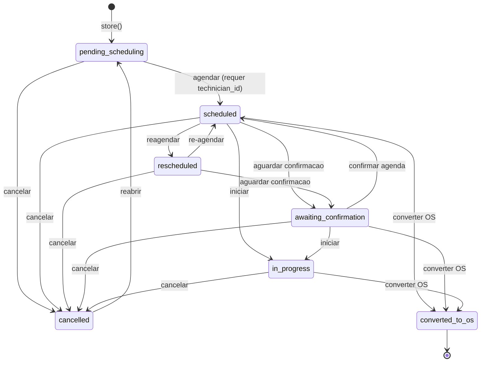

# Modulo: Chamados Tecnicos (Service Calls)

> **[AI_RULE]** A IA DEVE respeitar estritamente a maquina de estados, regras de SLA, e permissoes documentadas neste arquivo. Qualquer codigo gerado para este dominio DEVE ser validado contra estas especificacoes.

---

## 1. Visao Geral

O modulo de **Chamados Tecnicos**gerencia todo o ciclo de vida de solicitacoes de atendimento tecnico: abertura (manual, portal do cliente, webhook externo), triagem e priorizacao, atribuicao de tecnico (manual ou inteligente), agendamento, execucao, conversao em Ordem de Servico (OS) e fechamento.**Responsabilidades principais:**

- Abertura de chamados com numero sequencial automatico (`CT-00001`)
- Calculo automatico de SLA baseado em prioridade e politica contratual (`SlaPolicy`)
- Atribuicao inteligente de tecnicos (contrato → historico → menor carga)
- Reagendamento com historico e motivo obrigatorio
- Conversao direta em Ordem de Servico (`WorkOrder`)
- Sincronizacao automatica com Agenda Central (`SyncsWithAgenda`)
- Dashboard com KPIs, mapa geografico, kanban e exportacao CSV
- Trilha de auditoria completa (`Auditable`)
- Templates reutilizaveis para chamados recorrentes

**Arquivos-chave:**

- Model: `backend/app/Models/ServiceCall.php`
- Model: `backend/app/Models/ServiceCallComment.php`
- Model: `backend/app/Models/ServiceCallTemplate.php`
- Enum: `backend/app/Enums/ServiceCallStatus.php`
- Service: `backend/app/Services/ServiceCallService.php`
- Controller: `backend/app/Http/Controllers/Api/V1/ServiceCallController.php`
- Controller: `backend/app/Http/Controllers/Api/V1/ServiceCallTemplateController.php`
- Rotas: `backend/routes/api/quotes-service-calls.php`
- Frontend API: `frontend/src/lib/service-call-api.ts`

---

## 2. Entidades

### 2.1 ServiceCall (Chamado Tecnico)

| Campo | Tipo | Descricao |
|---|---|---|
| `id` | bigint | PK auto-increment |
| `tenant_id` | bigint | FK → tenants (multi-tenant obrigatorio) |
| `call_number` | string | Numero sequencial unico por tenant (`CT-00001`) |
| `customer_id` | bigint | FK → customers (obrigatorio) |
| `quote_id` | bigint? | FK → quotes (orcamento de origem) |
| `contract_id` | bigint? | FK → contracts (contrato vinculado para SLA) |
| `sla_policy_id` | bigint? | FK → sla_policies (politica de SLA especifica) |
| `template_id` | bigint? | FK → service_call_templates |
| `technician_id` | bigint? | FK → users (tecnico atribuido) |
| `driver_id` | bigint? | FK → users (motorista atribuido) |
| `created_by` | bigint | FK → users (quem abriu o chamado) |
| `status` | enum(ServiceCallStatus) | Status atual — cast para `ServiceCallStatus` enum |
| `priority` | string | `low`, `normal`, `high`, `urgent` |
| `source` | string? | Origem: `manual`, `portal`, `webhook`, `quote` |
| `source_id` | string? | ID externo da origem |
| `scheduled_date` | datetime? | Data/hora agendada para atendimento |
| `started_at` | datetime? | Inicio real do atendimento |
| `completed_at` | datetime? | Conclusao/cancelamento |
| `sla_due_at` | datetime? | Prazo limite do SLA calculado |
| `latitude` | decimal(7)? | Coordenada GPS |
| `longitude` | decimal(7)? | Coordenada GPS |
| `address` | string? | Endereco do atendimento |
| `city` | string? | Cidade |
| `state` | string(2)? | UF |
| `google_maps_link` | string? | Link direto Google Maps |
| `observations` | text? | Descricao/observacoes do chamado |
| `resolution_notes` | text? | Notas de resolucao |
| `reschedule_count` | int | Contador de reagendamentos (default 0) |
| `reschedule_reason` | string? | Motivo do ultimo reagendamento |
| `reschedule_history` | json? | Array historico de reagendamentos |
| `created_at` | datetime | Timestamp criacao |
| `updated_at` | datetime | Timestamp atualizacao |
| `deleted_at` | datetime? | Soft delete |

**Atributos computados (appends):**

| Atributo | Tipo | Logica |
|---|---|---|
| `sla_breached` | bool | `true` se horas decorridas > `SLA_HOURS[priority]` |
| `response_time_minutes` | int? | Minutos entre `created_at` e `started_at` |
| `resolution_time_minutes` | int? | Minutos entre `created_at` e `completed_at` |
| `sla_remaining_minutes` | int? | Minutos restantes ate estouro do SLA |
| `sla_limit_hours` | int | Horas do SLA (policy > default por prioridade) |

**Relacionamentos:**

| Relacao | Tipo | Destino |
|---|---|---|
| `customer` | BelongsTo | Customer |
| `quote` | BelongsTo | Quote |
| `contract` | BelongsTo | Contract |
| `slaPolicy` | BelongsTo | SlaPolicy |
| `template` | BelongsTo | ServiceCallTemplate |
| `technician` | BelongsTo | User |
| `driver` | BelongsTo | User |
| `createdBy` | BelongsTo | User |
| `equipments` | BelongsToMany | Equipment (pivot: `service_call_equipments`, pivot fields: `observations`) |
| `comments` | HasMany | ServiceCallComment (ordenado por `created_at` DESC) |
| `workOrders` | HasMany | WorkOrder |

**Traits:** `BelongsToTenant`, `SoftDeletes`, `Auditable`, `SyncsWithAgenda`, `HasFactory`

### 2.2 ServiceCallComment (Comentario)

| Campo | Tipo | Descricao |
|---|---|---|
| `id` | bigint | PK |
| `tenant_id` | bigint | FK → tenants |
| `service_call_id` | bigint | FK → service_calls |
| `user_id` | bigint | FK → users (autor) |
| `content` | text | Conteudo do comentario |
| `created_at` | datetime | Timestamp |
| `updated_at` | datetime | Timestamp |

### 2.3 ServiceCallTemplate (Template Reutilizavel)

| Campo | Tipo | Descricao |
|---|---|---|
| `id` | bigint | PK |
| `tenant_id` | bigint | FK → tenants |
| `name` | string | Nome do template |
| `priority` | string? | Prioridade padrao |
| `observations` | text? | Observacoes padrao |
| `equipment_ids` | json? | Array de IDs de equipamentos pre-selecionados |
| `is_active` | boolean | Template ativo/inativo |

---

## 3. Maquina de Estados



**Enum `ServiceCallStatus`** (`backend/app/Enums/ServiceCallStatus.php`):

| Valor | Label | Cor | Ativo? |
|---|---|---|---|
| `pending_scheduling` | Pendente de Agendamento | `bg-blue-100 text-blue-700` | Sim |
| `scheduled` | Agendado | `bg-amber-100 text-amber-700` | Sim |
| `rescheduled` | Reagendado | `bg-orange-100 text-orange-700` | Sim |
| `awaiting_confirmation` | Aguardando Confirmacao | `bg-cyan-100 text-cyan-700` | Sim |
| `in_progress` | Em Andamento | `bg-purple-100 text-purple-700` | Sim |
| `converted_to_os` | Convertido em OS | `bg-emerald-100 text-emerald-700` | Nao |
| `cancelled` | Cancelado | `bg-red-100 text-red-700` | Nao |

**[AI_RULE]**Transicoes sao validadas por `ServiceCallStatus::canTransitionTo()`. O controller retorna 422 com `allowed_transitions` se a transicao for invalida.**[AI_RULE]**`converted_to_os` e estado terminal — sem transicoes de saida. `cancelled` so pode voltar para `pending_scheduling` (reabrir).**Efeitos colaterais por transicao:**

| Transicao | Efeito |
|---|---|
| → `pending_scheduling` (reabrir) | Limpa `started_at` e `completed_at` |
| → `in_progress` | Define `started_at = now()` (se null) |
| → `converted_to_os` | Define `completed_at = now()` (se null) |
| → `cancelled` | Define `completed_at = now()` (se null) |
| → `rescheduled` | Incrementa `reschedule_count`, salva `reschedule_reason` |

---

## 4. Regras de Negocio [AI_RULE]

### 4.1 SLA por Prioridade

| Prioridade | Label | SLA Padrao (horas) | Cor |
|---|---|---|---|
| `urgent` | Urgente | 4h | `text-red-500` |
| `high` | Alta | 8h | `text-amber-500` |
| `normal` | Normal | 24h | `text-blue-500` |
| `low` | Baixa | 48h | `text-surface-500` |

**[AI_RULE]**Se o chamado tem `sla_policy_id`, o SLA vem de `SlaPolicy.resolution_time_minutes`. Caso contrario, aplica `SLA_HOURS[priority]`.**[AI_RULE]**Para SLA com policy + prioridade `urgent`, o tempo e reduzido em 50%. Para `high`, reducao de 20%. Calculo usa `HolidayService::addBusinessMinutes()` (horario comercial).**[AI_RULE]** O atributo `sla_breached` e computado dinamicamente — compara horas decorridas contra o limite. Nao e flag persistida.

### 4.2 Atribuicao Inteligente de Tecnicos (`ServiceCallService::autoAssign`)

Prioridade de atribuicao:

1. **Tecnico do contrato** — se o chamado tem `contract_id` e o contrato tem `technician_id`
2. **Historico do cliente** — ultimo tecnico que atendeu o mesmo `customer_id`
3. **Menor carga**— tecnico ativo com role `tecnico` e menos chamados abertos**[AI_RULE]** Ao atribuir, o sistema envia `Notification::notify()` tipo `service_call_assigned` ao tecnico.

### 4.3 Reagendamento

**[AI_RULE]** Reagendamento EXIGE `reason` (motivo obrigatorio) e `scheduled_date` futura. O sistema incrementa `reschedule_count` e armazena historico em `reschedule_history` (JSON).

### 4.4 Conversao em OS

**[AI_RULE]** Apenas chamados nos status `scheduled`, `rescheduled`, `awaiting_confirmation` ou `in_progress` podem ser convertidos. A conversao:

- Cria `WorkOrder` com `origin_type = 'service_call'`
- Copia `customer_id`, `quote_id`, `technician_id`, `driver_id`, equipamentos
- Vincula tecnicos e motorista na OS (`technicians` pivot)
- Transiciona o chamado para `converted_to_os`
- Um chamado so pode gerar UMA OS (verificacao de duplicidade)

### 4.5 Exclusao

**[AI_RULE]** Chamado com OS vinculada NAO pode ser excluido (retorna 409). Usa SoftDeletes.

### 4.6 Numeracao

**[AI_RULE]** Formato `CT-XXXXX` (5 digitos, zero-padded). Sequencial por tenant com cache lock para concorrencia.

### 4.7 Sincronizacao de Localizacao

**[AI_RULE]** Ao criar/atualizar chamado com dados de localizacao (`latitude`, `longitude`, `google_maps_link`, `city`, `state`, `address`), o sistema sincroniza esses dados para o cadastro do `Customer` se os campos estiverem vazios no cliente.

### 4.8 Eternal Lead (CRM Feedback Loop)

**[AI_RULE_CRITICAL]** Todo Chamado Técnico que for cancelado (`cancelled`) com motivo de insatisfação do cliente, ou concluído de forma que apresente oportunidade clara de upsell/cross-sell (ex: equipamento condenado), DEVE acionar o CRM. Um `CrmLead` deve ser gerado automaticamente (pipeline Win-back ou Upsell) conectado ao cliente. Nenhuma oportunidade gerada em campo pode ser perdida (regra Eternal Lead).

---

## 5. Cross-Domain (Integracao entre Modulos)

| Direcao | Modulo | Integracao |
|---|---|---|
| → | **WorkOrders** | `convertToWorkOrder()` — gera OS a partir do chamado |
| → | **Agenda** | `SyncsWithAgenda` trait — sincroniza automaticamente com agenda central |
| ← | **Quotes** | Chamado pode ser criado a partir de orcamento (`quote_id`). Rota: `POST quotes/{quote}/convert-to-chamado` |
| ← | **Portal Cliente** | Abertura via portal: `POST portal/service-calls` (PortalController) |
| ← | **Client Portal** | Abertura + rastreamento: `POST/GET service-calls` (ClientPortalController) |
| ← | **Contracts** | SLA vinculado via `contract_id` → `SlaPolicy`; tecnico preferencial do contrato |
| ← | **Webhook** | Criacao externa: `POST service-calls/webhook` (WebhookCreateServiceCallRequest) |
| → | **Notifications** | Notificacao push ao tecnico na atribuicao |
| → | **AuditLog** | Registro de todas as acoes (created, updated, status_changed, commented, deleted) |
| → | **Events** | `ServiceCallCreated`, `ServiceCallStatusChanged` — broadcasting |
| → | **Customers** | Sync de localizacao do chamado para cadastro do cliente |

---

## 6. Contratos JSON (API Endpoints)

### 6.1 POST /api/v1/service-calls — Criar chamado

```jsonc
// Request
{
  "customer_id": 42,                    // required
  "quote_id": null,                     // optional
  "contract_id": null,                  // optional
  "sla_policy_id": null,               // optional
  "template_id": null,                  // optional
  "technician_id": 5,                  // optional (requer permissao assign)
  "driver_id": 8,                      // optional (requer permissao assign)
  "priority": "high",                  // "low"|"normal"|"high"|"urgent"
  "scheduled_date": "2026-03-25T09:00:00",  // optional (requer permissao assign)
  "observations": "Equipamento com defeito",
  "address": "Rua Exemplo, 123",
  "city": "Sao Paulo",
  "state": "SP",
  "latitude": -23.5505199,
  "longitude": -46.6333094,
  "google_maps_link": "https://maps.google.com/...",
  "equipment_ids": [10, 22]            // optional
}
// Response 201
{
  "data": { /* ServiceCallResource */ }
}
```

### 6.2 PUT /api/v1/service-calls/{id} — Atualizar chamado

```jsonc
// Request (todos campos opcionais)
{
  "customer_id": 42,
  "priority": "urgent",
  "observations": "Atualizado",
  "resolution_notes": "Nota tecnica",
  "equipment_ids": [10, 22, 35]
}
// Response 200
{ "data": { /* ServiceCallResource */ } }
```

### 6.3 PUT /api/v1/service-calls/{id}/status — Transicao de status

```jsonc
// Request
{
  "status": "scheduled",              // required — validado contra transicoes permitidas
  "resolution_notes": "Nota opcional"  // optional
}
// Response 200
{ "data": { /* ServiceCallResource */ } }
// Response 422 (transicao invalida)
{
  "data": {
    "message": "Transicao de status nao permitida: pending_scheduling → converted_to_os",
    "allowed_transitions": ["scheduled", "cancelled"]
  }
}
```

### 6.4 PUT /api/v1/service-calls/{id}/assign — Atribuir tecnico

```jsonc
// Request
{
  "technician_id": 5,           // required
  "driver_id": 8,               // optional
  "scheduled_date": "2026-03-25T09:00:00"  // optional — se presente e status=pending, transiciona para scheduled
}
// Response 200
{ "data": { /* ServiceCallResource com technician e driver */ } }
```

### 6.5 POST /api/v1/service-calls/{id}/convert-to-os — Converter em OS

```jsonc
// Request: vazio (sem body)
// Response 201
{ "data": { /* WorkOrder resource */ } }
// Response 422 (status invalido)
{ "data": { "message": "Chamado precisa estar agendado...", "allowed_statuses": [...] } }
// Response 409 (ja convertido)
{ "data": { "message": "Este chamado ja foi convertido em OS", "work_order": { "id": 1, "number": "...", ... } } }
```

### 6.6 POST /api/v1/service-calls/{id}/reschedule — Reagendar

```jsonc
// Request
{
  "scheduled_date": "2026-03-28T14:00:00",  // required, futuro
  "reason": "Cliente indisponivel"           // required, max 500 chars
}
// Response 200
{ "data": { /* ServiceCallResource */ } }
```

### 6.7 GET /api/v1/service-calls — Listar com filtros

```text
GET /service-calls?status=scheduled&priority=high&technician_id=5&date_from=2026-03-01&date_to=2026-03-31&search=CT-00&my=1&per_page=30
```

### 6.8 Endpoints adicionais

| Metodo | Rota | Descricao |
|---|---|---|
| GET | `/service-calls/{id}` | Detalhe completo com relacionamentos |
| GET | `/service-calls/{id}/comments` | Listar comentarios |
| POST | `/service-calls/{id}/comments` | Adicionar comentario (`content` required) |
| GET | `/service-calls/{id}/audit-trail` | Trilha de auditoria |
| GET | `/service-calls-summary` | Resumo por status (dashboard) |
| GET | `/service-calls-kpi` | KPIs: SLA breach rate, tempo medio, etc. |
| GET | `/service-calls-map` | Dados para mapa geografico |
| GET | `/service-calls-agenda` | Dados para visualizacao de agenda |
| GET | `/service-calls-assignees` | Tecnicos e motoristas disponiveis |
| GET | `/service-calls-export` | Exportacao CSV com filtros |
| GET | `/service-calls/check-duplicate` | Verifica chamados duplicados por customer_id |
| POST | `/service-calls/bulk-action` | Acao em massa (atribuir, alterar prioridade) |
| POST | `/service-calls/webhook` | Criacao via webhook externo |
| DELETE | `/service-calls/{id}` | Soft delete (bloqueia se tem OS) |

---

## 7. Validacao (FormRequests)

### StoreServiceCallRequest

| Campo | Regras |
|---|---|
| `customer_id` | required, exists:customers (mesmo tenant) |
| `quote_id` | nullable, exists:quotes (mesmo tenant) |
| `contract_id` | nullable, exists:contracts (mesmo tenant) |
| `sla_policy_id` | nullable, exists:sla_policies (mesmo tenant) |
| `template_id` | nullable, exists:service_call_templates (mesmo tenant) |
| `technician_id` | nullable, integer, usuario ativo do tenant |
| `driver_id` | nullable, integer, usuario ativo do tenant |
| `priority` | nullable, in:low,normal,high,urgent |
| `scheduled_date` | nullable, date |
| `address` | nullable, string |
| `city` | nullable, string |
| `state` | nullable, string, max:2 |
| `latitude` | nullable, numeric |
| `longitude` | nullable, numeric |
| `google_maps_link` | nullable, string, max:500 |
| `observations` | nullable, string (normalizado de description/subject/title) |
| `equipment_ids` | nullable, array — cada item exists:equipments (mesmo tenant) |

**Normalizacao:** campos `description`, `subject`, `title` sao mapeados para `observations` automaticamente. Prioridade `medium` e normalizada para `normal`.

### UpdateServiceCallStatusRequest

| Campo | Regras |
|---|---|
| `status` | required, in: todos os valores de ServiceCallStatus |
| `resolution_notes` | nullable, string |

### AssignServiceCallTechnicianRequest

| Campo | Regras |
|---|---|
| `technician_id` | required, integer, usuario ativo do tenant |
| `driver_id` | nullable, integer, usuario ativo do tenant |
| `scheduled_date` | nullable, date |

### RescheduleServiceCallRequest

| Campo | Regras |
|---|---|
| `scheduled_date` | required, date, after:now |
| `reason` | required, string, max:500 |

---

## 8. Permissoes

**Permissoes registradas** (`PermissionsSeeder`):

| Permissao | Descricao |
|---|---|
| `service_calls.service_call.view` | Visualizar chamados |
| `service_calls.service_call.create` | Criar chamados |
| `service_calls.service_call.update` | Atualizar chamados e transicionar status |
| `service_calls.service_call.delete` | Excluir chamados (soft delete) |
| `service_calls.service_call.assign` | Atribuir tecnico/motorista/agenda |

**Acesso por role:**

| Role | view | create | update | delete | assign |
|---|---|---|---|---|---|
| super_admin | Sim | Sim | Sim | Sim | Sim |
| admin | Sim | Sim | Sim | Sim | Sim |
| coordenador | Sim | Sim | Sim | - | Sim |
| tecnico | Sim (proprios) | Sim | Sim (proprios) | - | - |
| motorista | Sim (proprios) | - | - | - | - |
| monitor | Sim | - | - | - | - |
| portal_cliente | Sim (proprios) | Sim | - | - | - |

**[AI_RULE]** Tecnicos e motoristas veem apenas chamados onde `technician_id`, `driver_id` ou `created_by` = seu user ID (filtro `ScopesByRole`). Atribuicao de tecnico/motorista/agenda requer permissao `service_calls.service_call.assign` ou role `super_admin`.

---

## 9. Diagramas de Sequencia

### 9.1 Fluxo Principal: Abertura → Conversao em OS

```text
Cliente/Coordenador          Sistema                    Tecnico
       |                        |                          |
       |-- POST /service-calls->|                          |
       |                        |-- Gera call_number       |
       |                        |-- Calcula SLA            |
       |                        |-- SyncLocationToCustomer |
       |                        |-- Event: ServiceCallCreated
       |<-- 201 ServiceCall ----|                          |
       |                        |                          |
       |-- PUT /assign -------->|                          |
       |                        |-- Valida tenant user     |
       |                        |-- Auto-transition →      |
       |                        |   scheduled (se tem data)|
       |                        |-- Notification::notify --|
       |                        |                          |<-- Push "Chamado Atribuido"
       |<-- 200 ServiceCall ----|                          |
       |                        |                          |
       |-- PUT /status -------->|                          |
       |  {status:"in_progress"}|                          |
       |                        |-- canTransitionTo()      |
       |                        |-- started_at = now()     |
       |                        |-- Event: StatusChanged   |
       |<-- 200 ServiceCall ----|                          |
       |                        |                          |
       |-- POST /convert-to-os->|                          |
       |                        |-- Cria WorkOrder         |
       |                        |-- Copia equipamentos     |
       |                        |-- Vincula tecnicos       |
       |                        |-- status → converted_to_os
       |                        |-- completed_at = now()   |
       |<-- 201 WorkOrder ------|                          |
```

### 9.2 Fluxo: Reagendamento

```text
Coordenador                  Sistema
     |                          |
     |-- POST /reschedule ----->|
     |  {scheduled_date, reason}|
     |                          |-- Valida data futura
     |                          |-- reschedule_count++
     |                          |-- Salva reschedule_history
     |                          |-- status → rescheduled
     |                          |-- AuditLog
     |<-- 200 ServiceCall ------|
```

### 9.3 Fluxo: Portal do Cliente

```text
Cliente (Portal)             Sistema
     |                          |
     |-- POST portal/          |
     |   service-calls ------->|
     |                          |-- Valida cliente do portal
     |                          |-- Cria chamado pending_scheduling
     |                          |-- Notifica coordenadores
     |<-- 201 ServiceCall ------|
     |                          |
     |-- GET portal/           |
     |   service-calls/track ->|
     |                          |-- Filtra por customer_id
     |<-- Lista chamados ------|
```

---

## 10. Codigo de Referencia

### 10.1 ServiceCallService — Metodos Principais

```php
class ServiceCallService
{
    // Calcula e aplica SLA: policy > busca por prioridade > defaults
    public function calculateSla(ServiceCall $call): void;

    // Atribuicao inteligente: contrato → historico → menor carga
    public function autoAssign(ServiceCall $call): ?User;

    // Chamados com SLA estourando (proximas 2h) — usado pelo scheduler
    public function checkSlaDeadlines(int $tenantId): Collection;
}
```

### 10.2 ServiceCallController — Acoes de Negocio

```php
class ServiceCallController
{
    public function index(Request $request): JsonResponse;        // Listar com filtros e paginacao
    public function store(StoreServiceCallRequest): JsonResponse;  // Criar + SLA + auditoria
    public function show(ServiceCall): JsonResponse;               // Detalhe com eager loading
    public function update(UpdateServiceCallRequest): JsonResponse; // Atualizar dados
    public function destroy(ServiceCall): JsonResponse;            // Soft delete (bloqueia se tem OS)
    public function updateStatus(UpdateServiceCallStatusRequest): JsonResponse;  // Transicao validada
    public function assignTechnician(AssignServiceCallTechnicianRequest): JsonResponse;  // Atribuir + auto-transition
    public function convertToWorkOrder(ServiceCall): JsonResponse; // Gera OS completa
    public function reschedule(RescheduleServiceCallRequest): JsonResponse;  // Reagendar com motivo
    public function comments(ServiceCall): JsonResponse;           // Listar comentarios
    public function addComment(StoreServiceCallCommentRequest): JsonResponse;  // Novo comentario
    public function summary(): JsonResponse;                       // Resumo dashboard
    public function dashboardKpi(): JsonResponse;                  // KPIs com metricas
    public function mapData(): JsonResponse;                       // Dados mapa
    public function agenda(): JsonResponse;                        // Dados agenda
    public function assignees(): JsonResponse;                     // Tecnicos/motoristas disponiveis
    public function exportCsv(): JsonResponse;                     // Exportacao CSV
    public function checkDuplicate(): JsonResponse;                // Verifica duplicidade
    public function bulkAction(BulkServiceCallActionRequest): JsonResponse;  // Acoes em massa
    public function webhookCreate(WebhookCreateServiceCallRequest): JsonResponse;  // Webhook externo
    public function auditTrail(ServiceCall): JsonResponse;         // Trilha auditoria
}
```

### 10.3 Frontend — serviceCallApi

```typescript
// frontend/src/lib/service-call-api.ts
export const serviceCallApi = {
  list(params?)           // GET /service-calls — paginado
  detail(id)              // GET /service-calls/{id}
  summary()               // GET /service-calls-summary
  kpi(params?)            // GET /service-calls-kpi
  map(params?)            // GET /service-calls-map
  assignees()             // GET /service-calls-assignees
  create(data)            // POST /service-calls
  update(id, data)        // PUT /service-calls/{id}
  updateStatus(id, data)  // PUT /service-calls/{id}/status
  destroy(id)             // DELETE /service-calls/{id}
  assign(id, data)        // PUT /service-calls/{id}/assign
  convertToOs(id)         // POST /service-calls/{id}/convert-to-os
  reschedule(id, data)    // POST /service-calls/{id}/reschedule
  bulkAction(data)        // POST /service-calls/bulk-action
  checkDuplicate(params)  // GET /service-calls/check-duplicate
  agenda(params?)         // GET /service-calls-agenda
  auditTrail(id)          // GET /service-calls/{id}/audit-trail
  export(params?)         // GET /service-calls-export
  comments.list(id)       // GET /service-calls/{id}/comments
  comments.create(id, d)  // POST /service-calls/{id}/comments
  templates.list()        // GET /service-call-templates
  templates.active()      // GET /service-call-templates/active
  templates.create(data)  // POST /service-call-templates
  templates.update(id, d) // PUT /service-call-templates/{id}
  templates.destroy(id)   // DELETE /service-call-templates/{id}
}
```

### 10.4 Paginas Frontend

| Pagina | Arquivo |
|---|---|
| Lista/Tabela | `frontend/src/pages/chamados/ServiceCallsPage.tsx` |
| Dashboard | `frontend/src/pages/chamados/ServiceCallDashboardPage.tsx` |
| Kanban | `frontend/src/pages/chamados/ServiceCallKanbanPage.tsx` |
| Mapa | `frontend/src/pages/chamados/ServiceCallMapPage.tsx` |
| Detalhe | `frontend/src/pages/chamados/ServiceCallDetailPage.tsx` |
| Criar | `frontend/src/pages/chamados/ServiceCallCreatePage.tsx` |
| Editar | `frontend/src/pages/chamados/ServiceCallEditPage.tsx` |
| Visao Tecnico | `frontend/src/pages/tech/TechServiceCallsPage.tsx` |
| Portal Cliente | `frontend/src/pages/portal/PortalServiceCallPage.tsx` |
| Relatorio | `frontend/src/pages/relatorios/tabs/ServiceCallsReportTab.tsx` |

---

## 11. Cenarios BDD

### Cenario 1: Criar chamado com SLA automatico

```gherkin
Given um usuario com permissao "service_calls.service_call.create"
  And um customer_id valido do mesmo tenant
When POST /api/v1/service-calls com { customer_id: 42, priority: "high" }
Then status 201
  And call_number segue formato "CT-XXXXX"
  And status = "pending_scheduling"
  And sla_limit_hours = 8
  And created_by = usuario autenticado
  And AuditLog registra acao "created"
  And Event ServiceCallCreated e disparado
```

### Cenario 2: Transicao de status invalida

```gherkin
Given um chamado com status "pending_scheduling"
When PUT /api/v1/service-calls/{id}/status com { status: "converted_to_os" }
Then status 422
  And response contem "allowed_transitions": ["scheduled", "cancelled"]
```

### Cenario 3: Agendar requer tecnico

```gherkin
Given um chamado com status "pending_scheduling" e technician_id = null
When PUT /api/v1/service-calls/{id}/status com { status: "scheduled" }
Then status 422
  And message = "Nao e possivel agendar um chamado sem tecnico atribuido."
```

### Cenario 4: Atribuicao com auto-transition

```gherkin
Given um chamado com status "pending_scheduling"
When PUT /api/v1/service-calls/{id}/assign com { technician_id: 5, scheduled_date: "2026-03-25T09:00" }
Then status 200
  And technician_id = 5
  And status automaticamente transiciona para "scheduled"
```

### Cenario 5: Converter em OS

```gherkin
Given um chamado com status "scheduled" e technician_id = 5 e 2 equipamentos
When POST /api/v1/service-calls/{id}/convert-to-os
Then status 201
  And WorkOrder criada com origin_type = "service_call"
  And WorkOrder.customer_id = chamado.customer_id
  And WorkOrder.assigned_to = chamado.technician_id
  And WorkOrder tem os 2 equipamentos vinculados
  And chamado.status = "converted_to_os"
  And chamado.completed_at definido
```

### Cenario 6: Impedir conversao duplicada

```gherkin
Given um chamado que ja foi convertido em OS (status "converted_to_os")
When POST /api/v1/service-calls/{id}/convert-to-os
Then status 409
  And response contem dados da OS existente
```

### Cenario 7: Reagendamento com motivo

```gherkin
Given um chamado com status "scheduled"
When POST /api/v1/service-calls/{id}/reschedule com { scheduled_date: "2026-03-28T14:00", reason: "Cliente viajou" }
Then status 200
  And status = "rescheduled"
  And reschedule_count incrementado
  And reschedule_reason = "Cliente viajou"
```

### Cenario 8: Exclusao bloqueada com OS

```gherkin
Given um chamado com WorkOrder vinculada
When DELETE /api/v1/service-calls/{id}
Then status 409
  And message = "Nao e possivel excluir — chamado possui OS vinculada"
```

### Cenario 9: Tecnico ve apenas seus chamados

```gherkin
Given um usuario com role "tecnico" e id = 10
When GET /api/v1/service-calls
Then retorna apenas chamados onde technician_id = 10 OR driver_id = 10 OR created_by = 10
```

### Cenario 10: SLA breach detection

```gherkin
Given um chamado com priority = "urgent" criado ha 5 horas e status = "scheduled"
When o sistema calcula sla_breached
Then sla_breached = true
  And sla_remaining_minutes < 0
```

---

---

## Edge Cases e Tratamento de Erros

| Cenário | Comportamento Esperado | Regra |
| --------- | ---------------------- | ------- |
| **Chamado sem contrato ativo** (cliente sem contrato vigente abre chamado) | Permitir abertura com flag `out_of_contract = true`. Calcular valor avulso pela tabela de preços padrão. Alertar atendente sobre ausência de contrato. Exigir aprovação de orçamento antes do despacho técnico. | `[AI_RULE]` |
| **SLA estourado** (tempo de atendimento excede meta do contrato) | Registrar `sla_breach` com timestamp e delta. Disparar alerta automático para supervisor e gerente do contrato. Calcular multa contratual se aplicável. Não bloquear operação — chamado continua normalmente. Logar para relatório de SLA. | `[AI_RULE_CRITICAL]` |
| **Técnico indisponível** (nenhum técnico qualificado disponível para o chamado) | Marcar chamado como `awaiting_assignment`. Disparar alerta para coordenação. Sugerir técnicos com skills parcialmente compatíveis. Se urgência = `critical`: escalar automaticamente para supervisor após 30min sem atribuição. | `[AI_RULE]` |
| **Reabertura de chamado fechado** (cliente reporta mesmo problema após conclusão) | Permitir reabertura dentro de 72h da conclusão. Criar `ReopenEvent` com motivo obrigatório. Vincular ao chamado original via `parent_service_call_id`. Após 72h: abrir novo chamado com referência ao anterior. Contar reaberturas para análise de qualidade. | `[AI_RULE]` |
| **Peça em falta no estoque** (técnico precisa de item sem estoque disponível) | Marcar chamado como `awaiting_parts`. Criar `StockRequisition` automática para o item necessário. Notificar estoque e compras. Recalcular SLA adicionando tempo de espera de peça. Logar `parts_delay` para análise de impacto. | `[AI_RULE]` |
| **Chamado duplicado** (mesmo equipamento + mesmo defeito em < 24h) | Ao criar: verificar chamados abertos para mesmo `equipment_id` com `symptom` similar (Levenshtein > 80%) nas últimas 24h. Se match: alertar com sugestão de vincular ao chamado existente. Não bloquear — permitir criação com flag `possible_duplicate`. | `[AI_RULE]` |
| **Escalação sem nível superior** (tentativa de escalar sem supervisor definido) | Retornar 422 `no_escalation_target`. Verificar hierarquia: chamado → coordenador → gerente → diretor. Se nível atual é o máximo: logar `escalation_ceiling_reached` e notificar admin do tenant. Nunca escalar para o mesmo nível. | `[AI_RULE]` |

---

## 12. Checklist de Implementacao

### Backend

- [x] Model ServiceCall com todos os campos, casts, relacionamentos e atributos computados
- [x] Model ServiceCallComment com BelongsToTenant
- [x] Model ServiceCallTemplate com fields e casts
- [x] Enum ServiceCallStatus com 7 estados, labels, cores e transicoes
- [x] ServiceCallService com calculateSla, autoAssign, checkSlaDeadlines
- [x] ServiceCallController CRUD completo
- [x] Transicao de status validada com canTransitionTo()
- [x] Atribuicao de tecnico com auto-transition para scheduled
- [x] Conversao em OS completa (WorkOrder + equipamentos + tecnicos)
- [x] Reagendamento com historico e motivo obrigatorio
- [x] Comentarios internos com trilha de auditoria
- [x] Dashboard KPI, summary, mapa, agenda
- [x] Exportacao CSV com filtros
- [x] Verificacao de duplicidade
- [x] Acoes em massa (bulk-action)
- [x] Webhook de criacao externa
- [x] FormRequests: Store, Update, UpdateStatus, Assign, Reschedule, Bulk, Webhook, Comment
- [x] Permissoes no PermissionsSeeder (5 permissoes)
- [x] ScopesByRole para tecnicos/motoristas
- [x] Soft delete com bloqueio se tem OS
- [x] AuditLog em todas as acoes
- [x] Events: ServiceCallCreated, ServiceCallStatusChanged
- [x] SyncsWithAgenda trait para agenda central
- [x] Numeracao sequencial com cache lock

### Frontend

- [x] serviceCallApi com todos os endpoints
- [x] ServiceCallsPage (lista/tabela)
- [x] ServiceCallDashboardPage
- [x] ServiceCallKanbanPage
- [x] ServiceCallMapPage
- [x] ServiceCallDetailPage
- [x] ServiceCallCreatePage
- [x] ServiceCallEditPage
- [x] TechServiceCallsPage (visao tecnico)
- [x] PortalServiceCallPage (portal cliente)
- [x] ServiceCallsReportTab (relatorio)
- [x] Templates CRUD (via serviceCallApi.templates)

### Testes

- [ ] Feature test: CRUD completo com permissoes
- [ ] Feature test: transicoes de estado validas e invalidas
- [ ] Feature test: conversao em OS com verificacao de dados
- [ ] Feature test: reagendamento com validacao
- [ ] Unit test: ServiceCallService (SLA, autoAssign, deadlines)
- [ ] Unit test: ServiceCallStatus transicoes
- [ ] Frontend test: ServiceCallsPage (existente em `__tests__`)

---

## Fluxos Relacionados

| Fluxo | Descrição |
|-------|-----------|
| [Chamado de Emergência](file:///c:/PROJETOS/sistema/docs/fluxos/CHAMADO-EMERGENCIA.md) | Processo documentado em `docs/fluxos/CHAMADO-EMERGENCIA.md` |
| [Ciclo Comercial](file:///c:/PROJETOS/sistema/docs/fluxos/CICLO-COMERCIAL.md) | Processo documentado em `docs/fluxos/CICLO-COMERCIAL.md` |
| [Despacho e Atribuição](file:///c:/PROJETOS/sistema/docs/fluxos/DESPACHO-ATRIBUICAO.md) | Processo documentado em `docs/fluxos/DESPACHO-ATRIBUICAO.md` |

---

## Inventario Completo do Codigo

> **[AI_RULE]** Secao gerada a partir do codigo-fonte real. Toda referencia abaixo corresponde a arquivo existente no repositorio.

### Controllers (2 — namespace `App\Http\Controllers\Api\V1`)

| Controller | Arquivo | Metodos Publicos |
|------------|---------|-----------------|
| **ServiceCallController** | `ServiceCallController.php` | `index`, `store`, `show`, `update`, `destroy`, `updateStatus`, `assignTechnician`, `convertToWorkOrder`, `comments`, `addComment`, `exportCsv`, `mapData`, `agenda`, `auditTrail`, `summary`, `dashboardKpi`, `bulkAction`, `reschedule` |
| **ServiceCallTemplateController** | `ServiceCallTemplateController.php` | `index`, `activeList`, `store`, `update`, `destroy` |

### Events (2 — namespace `App\Events`)

| Evento | Propriedades | Descricao |
|--------|-------------|-----------|
| `ServiceCallCreated` | `serviceCall` | Disparado quando um chamado tecnico e criado |
| `ServiceCallStatusChanged` | `serviceCall`, `fromStatus`, `toStatus` | Disparado em qualquer transicao de status do chamado |

### Listeners (2 — namespace `App\Listeners`)

| Listener | Evento(s) | Descricao |
|----------|-----------|-----------|
| `HandleServiceCallCreated` | `ServiceCallCreated` | Processa criacao do chamado: calcula SLA, tenta auto-assign, notifica |
| `CreateAgendaItemOnServiceCall` | Criacao de chamado | Sincroniza chamado com a Agenda Central |

### Services (3 — namespace `App\Services`)

| Service | Arquivo | Metodos Publicos |
|---------|---------|-----------------|
| `ServiceCallService` | `Services/ServiceCallService.php` | `calculateSla()` — calcula prazo SLA baseado em prioridade/politica; `autoAssign()` — atribui tecnico automaticamente; `checkSlaDeadlines()` — verifica prazos de SLA por tenant |
| `SlaEscalationService` | `Services/SlaEscalationService.php` | `runSlaChecks()` — verifica todos os SLAs do tenant; `evaluateServiceCallSla()` — avalia SLA de chamado individual; `getDashboard()` — dados do dashboard de SLA |
| `AutoAssignmentService` | `Services/AutoAssignmentService.php` | `assignServiceCall()` — atribui tecnico por regras (round-robin, menor carga, skill match, proximidade) |

### Models (3 — namespace `App\Models`)

| Model | Tabela | Descricao |
|-------|--------|-----------|
| `ServiceCall` | `service_calls` | Entidade principal do chamado tecnico |
| `ServiceCallComment` | `service_call_comments` | Comentarios/mensagens do chamado |
| `ServiceCallTemplate` | `service_call_templates` | Templates reutilizaveis para chamados recorrentes |

### FormRequests (15 — namespace `App\Http\Requests\ServiceCall` + `Portal` + `Report`)

| FormRequest | Namespace | Descricao |
|-------------|-----------|-----------|
| `AssignServiceCallTechnicianRequest` | ServiceCall | Atribuir tecnico ao chamado |
| `BulkServiceCallActionRequest` | ServiceCall | Acoes em lote |
| `CheckDuplicateServiceCallsRequest` | ServiceCall | Verificar chamados duplicados |
| `IndexServiceCallsRequest` | ServiceCall | Filtros de listagem |
| `RescheduleServiceCallRequest` | ServiceCall | Reagendar chamado |
| `StoreServiceCallCommentRequest` | ServiceCall | Adicionar comentario |
| `StoreServiceCallRequest` | ServiceCall | Criar chamado |
| `StoreServiceCallTemplateRequest` | ServiceCall | Criar template |
| `UpdateServiceCallRequest` | ServiceCall | Atualizar chamado |
| `UpdateServiceCallStatusRequest` | ServiceCall | Atualizar status |
| `UpdateServiceCallTemplateRequest` | ServiceCall | Atualizar template |
| `WebhookCreateServiceCallRequest` | ServiceCall | Criar chamado via webhook externo |
| `CreateServiceCallFromPortalRequest` | Portal | Criar chamado pelo portal do cliente |
| `NewServiceCallRequest` | Portal | Novo chamado simplificado pelo portal |
| `ServiceCallsReportRequest` | Report | Filtros para relatorio de chamados |
