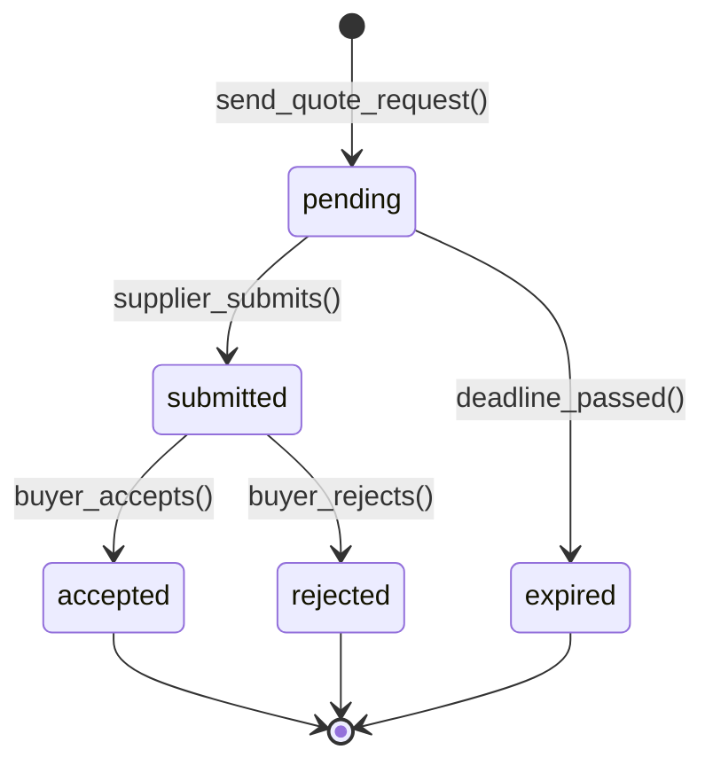
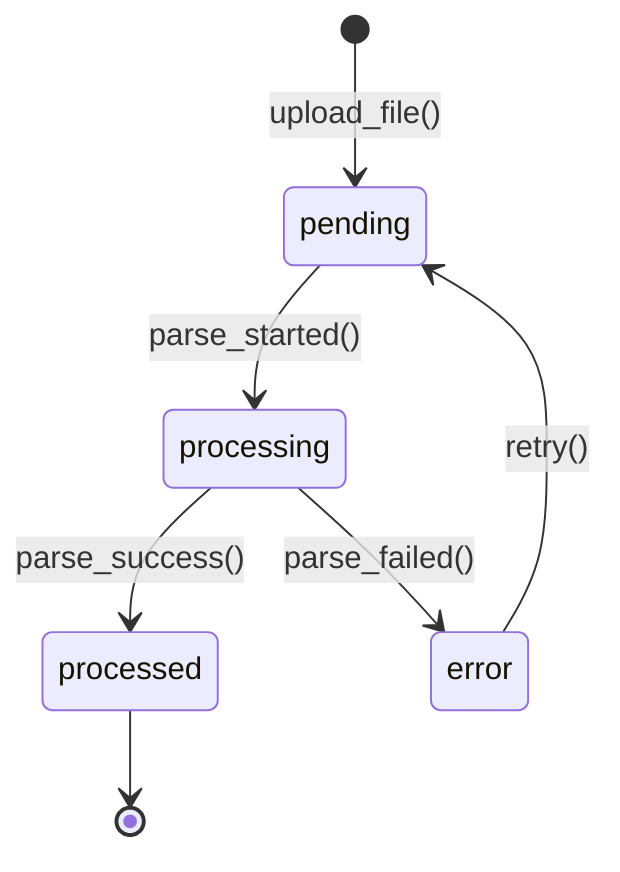
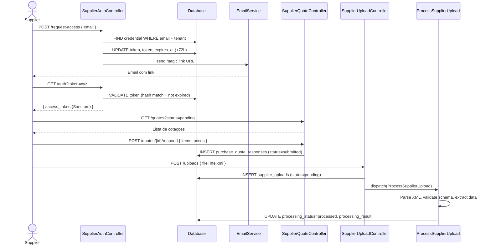

# Modulo: SupplierPortal (Portal B2B do Fornecedor)

> **[AI_RULE]** Especificações arquiteturais da fase de Expansão. Módulo SupplierPortal.

---

## 1. Visão Geral

Ambiente B2B de acesso self-service para fornecedores. Permite que terceiros respondam rapidamente às Requisições e Cotações (`PurchaseQuote`), façam o upload direto de CTE e XML, e consultem previsões de recebíveis.

**Escopo Funcional:**

- Acesso via Magic Link (TTL expiratório, sem login complexo)
- Visualização de cotações pendentes e histórico de lances
- Preenchimento de respostas a cotações com preços e prazos
- Upload de XMLs (CTe, NFe) diretamente pelo fornecedor
- Consulta de previsão de pagamentos (recebíveis)
- Dashboard do fornecedor com status de pedidos e pagamentos

---

## 2. Entidades (Models)

### 2.1 SupplierPortalCredential

| Campo | Tipo | Regra |
|-------|------|-------|
| `id` | bigint (PK) | Auto-increment |
| `tenant_id` | bigint (FK) | Obrigatório |
| `contact_id` | bigint (FK → contacts) | Fornecedor |
| `access_type` | enum | `magic_link`, `password` |
| `token` | string(128) null | Token do Magic Link (hashed) |
| `token_expires_at` | timestamp null | Expiração do token |
| `password_hash` | string(255) null | Senha (se access_type=password) |
| `email` | string(255) | Email de acesso |
| `last_access_at` | timestamp null | Último acesso |
| `is_active` | boolean | Default true |
| `created_at` / `updated_at` | timestamp | — |

### 2.2 PurchaseQuoteResponse

| Campo | Tipo | Regra |
|-------|------|-------|
| `id` | bigint (PK) | Auto-increment |
| `tenant_id` | bigint (FK) | Obrigatório |
| `purchase_quote_id` | bigint (FK → purchase_quotes) | Cotação sendo respondida |
| `contact_id` | bigint (FK → contacts) | Fornecedor respondendo |
| `status` | enum | `pending`, `submitted`, `accepted`, `rejected`, `expired` |
| `items` | json | `[{"product_id":5,"unit_price":150.00,"quantity":100,"delivery_days":7}]` |
| `total_value` | decimal(15,2) null | Valor total calculado |
| `payment_conditions` | string(255) null | Condições: "30/60/90 dias" |
| `valid_until` | date null | Validade da proposta |
| `notes` | text null | Observações do fornecedor |
| `submitted_at` | timestamp null | Data de submissão |
| `created_at` / `updated_at` | timestamp | — |

### 2.3 SupplierUpload

| Campo | Tipo | Regra |
|-------|------|-------|
| `id` | bigint (PK) | Auto-increment |
| `tenant_id` | bigint (FK) | Obrigatório |
| `contact_id` | bigint (FK → contacts) | Fornecedor |
| `document_type` | enum | `cte_xml`, `nfe_xml`, `boleto_pdf`, `comprovante`, `other` |
| `original_filename` | string(500) | Nome original do arquivo |
| `storage_path` | string(500) | Caminho no Storage |
| `file_size_bytes` | bigint | Tamanho |
| `mime_type` | string(100) | MIME type |
| `processing_status` | enum | `pending`, `processing`, `processed`, `error` |
| `processing_result` | json null | Resultado do parse: `{"nfe_number":"123","cnpj":"...","total":5000}` |
| `error_message` | text null | Erro de processamento |
| `purchase_order_id` | bigint (FK) null | Pedido vinculado |
| `created_at` / `updated_at` | timestamp | — |

---

## 3. State Machines

### 3.1 Ciclo da Resposta de Cotação



### 3.2 Ciclo do Upload



---

## 4. Guard Rails `[AI_RULE]`

> **[AI_RULE_CRITICAL] Magic Link Security** — Token gerado com `Str::random(128)`, armazenado como hash bcrypt. TTL padrão: 72h. Após expiração, fornecedor deve solicitar novo link. O sistema NUNCA envia a URL do portal sem token válido.

> **[AI_RULE_CRITICAL] Isolamento por Tenant + Fornecedor** — Fornecedor autenticado via Magic Link vê APENAS cotações e pedidos endereçados ao seu `contact_id` dentro do `tenant_id` do link. Nunca dados de outros fornecedores.

> **[AI_RULE_CRITICAL] XML Processing Assíncrono** — Upload de XMLs dispara Job `ProcessSupplierUpload` na fila. O parser extrai dados fiscais (número NF, CNPJ, itens, valores) e vincula automaticamente ao `PurchaseOrder` correspondente via matching de CNPJ + número NF.

> **[AI_RULE] Cotação Expirada** — Job `ExpireQuoteResponses` roda daily. Cotações com `valid_until < today` e status `pending` mudam para `expired`.

> **[AI_RULE] Validação de XML** — O parser DEVE validar o schema do XML (CTe/NFe) contra o XSD oficial da SEFAZ. XMLs inválidos são rejeitados com `processing_status=error` e mensagem descritiva.

> **[AI_RULE] Rate Limiting de Uploads** — Máximo 20 uploads por hora por fornecedor para prevenir abuso.

---

## 5. Cross-Domain

| Direção | Módulo | Integração |
|---------|--------|------------|
| ← | **Procurement** | Cotações (PurchaseQuote) são enviadas ao portal para resposta |
| → | **Fiscal** | XMLs processados ativam intake fiscal automaticamente |
| → | **Finance** | Fornecedor consulta previsão de recebíveis (contas a pagar) |
| ← | **Integrations** | Magic Link enviado via Email/WhatsApp |

---

## 6. Contratos de API

### 6.1 Solicitar Magic Link

```http
POST /api/v1/supplier-portal/request-access
Content-Type: application/json
```

**Request:** `{ "email": "contato@fornecedor.com", "tenant_slug": "empresa-xpto" }`
**Response (200):** `{ "success": true, "message": "Link de acesso enviado para o email." }`

### 6.2 Autenticar via Magic Link

```http
GET /api/v1/supplier-portal/auth?token={magic-link-token}
```

**Response (200):** `{ "success": true, "data": { "access_token": "bearer-token", "supplier": { "name": "Fornecedor ABC" }, "expires_at": "..." } }`

### 6.3 Listar Cotações Pendentes

```http
GET /api/v1/supplier-portal/quotes?status=pending
Authorization: Bearer {supplier-token}
```

### 6.4 Submeter Resposta de Cotação

```http
POST /api/v1/supplier-portal/quotes/{quoteId}/respond
Authorization: Bearer {supplier-token}
Content-Type: application/json
```

**Request:**

```json
{
  "items": [{"product_id": 5, "unit_price": 150.00, "quantity": 100, "delivery_days": 7}],
  "payment_conditions": "30/60/90 dias",
  "valid_until": "2026-04-15",
  "notes": "Frete incluso para capital"
}
```

### 6.5 Upload de XML

```http
POST /api/v1/supplier-portal/uploads
Authorization: Bearer {supplier-token}
Content-Type: multipart/form-data
```

**FormData:** `file` (arquivo XML), `document_type` (cte_xml/nfe_xml), `purchase_order_id` (opcional)

### 6.6 Consultar Recebíveis

```http
GET /api/v1/supplier-portal/receivables
Authorization: Bearer {supplier-token}
```

### 6.7 Dashboard do Fornecedor

```http
GET /api/v1/supplier-portal/dashboard
Authorization: Bearer {supplier-token}
```

---

## 7. Permissões (RBAC)

| Permissão | Descrição |
|-----------|-----------|
| `supplier_portal.manage` | Gerenciar credenciais e acessos de fornecedores (admin) |
| `supplier_portal.quotes.view` | Visualizar cotações (fornecedor via token) |
| `supplier_portal.quotes.respond` | Responder cotações |
| `supplier_portal.uploads.create` | Fazer upload de XMLs |
| `supplier_portal.receivables.view` | Consultar recebíveis |

---

## 8. Rotas da API

### Admin (`auth:sanctum` + `check.tenant`)

| Método | Rota | Controller | Ação |
|--------|------|------------|------|
| `GET` | `/api/v1/supplier-portal/credentials` | `SupplierCredentialController@index` | Listar credenciais |
| `POST` | `/api/v1/supplier-portal/credentials` | `SupplierCredentialController@store` | Criar acesso |
| `POST` | `/api/v1/supplier-portal/credentials/{id}/regenerate` | `SupplierCredentialController@regenerate` | Novo Magic Link |
| `DELETE` | `/api/v1/supplier-portal/credentials/{id}` | `SupplierCredentialController@destroy` | Revogar acesso |

### Portal do Fornecedor (`auth:supplier-token`)

| Método | Rota | Controller | Ação |
|--------|------|------------|------|
| `POST` | `/api/v1/supplier-portal/request-access` | `SupplierAuthController@requestAccess` | Solicitar link |
| `GET` | `/api/v1/supplier-portal/auth` | `SupplierAuthController@authenticate` | Autenticar via token |
| `GET` | `/api/v1/supplier-portal/quotes` | `SupplierQuoteController@index` | Cotações |
| `GET` | `/api/v1/supplier-portal/quotes/{id}` | `SupplierQuoteController@show` | Detalhes |
| `POST` | `/api/v1/supplier-portal/quotes/{id}/respond` | `SupplierQuoteController@respond` | Responder |
| `POST` | `/api/v1/supplier-portal/uploads` | `SupplierUploadController@store` | Upload XML |
| `GET` | `/api/v1/supplier-portal/uploads` | `SupplierUploadController@index` | Listar uploads |
| `GET` | `/api/v1/supplier-portal/receivables` | `SupplierReceivableController@index` | Recebíveis |
| `GET` | `/api/v1/supplier-portal/dashboard` | `SupplierDashboardController@index` | Dashboard |

---

## 9. Form Requests

### StoreSupplierQuoteResponseRequest

```php
'items' => ['required','array','min:1'],
'items.*.product_id' => ['required','integer','exists:products,id'],
'items.*.unit_price' => ['required','numeric','min:0.01'],
'items.*.quantity' => ['required','integer','min:1'],
'items.*.delivery_days' => ['required','integer','min:1'],
'payment_conditions' => ['nullable','string','max:255'],
'valid_until' => ['required','date','after:today'],
'notes' => ['nullable','string','max:2000'],
```

### StoreSupplierUploadRequest

```php
'file' => ['required','file','mimes:xml','max:10240'],
'document_type' => ['required','string','in:cte_xml,nfe_xml,boleto_pdf,comprovante,other'],
'purchase_order_id' => ['nullable','integer','exists:purchase_orders,id'],
```

### StoreSupplierCredentialRequest

```php
'contact_id' => ['required','integer','exists:contacts,id'],
'email' => ['required','email','max:255'],
'access_type' => ['required','string','in:magic_link,password'],
```

---

## 10. Diagrama de Sequência

### 10.1 Fluxo: Magic Link → Cotação → Upload



---

## 11. Testes BDD

```gherkin
Funcionalidade: Portal B2B do Fornecedor

  Cenário: Magic Link válido autentica fornecedor
    Dado que existe credencial com token válido (não expirado)
    Quando envio GET /auth?token=valid
    Então recebo access_token Sanctum

  Cenário: Magic Link expirado é rejeitado
    Dado que token expirou há 1 hora
    Quando envio GET /auth?token=expired
    Então recebo status 401

  Cenário: Fornecedor vê apenas suas cotações
    Dado que existem cotações para fornecedor A e B
    Quando fornecedor A lista cotações
    Então vê apenas cotações endereçadas a ele

  Cenário: Submeter resposta de cotação
    Dado que tenho cotação pendente
    Quando envio POST /quotes/{id}/respond com itens e preços
    Então resposta é criada com status "submitted"

  Cenário: Upload de XML processa assincronamente
    Quando envio POST /uploads com arquivo NFe XML válido
    Então upload é salvo com status "pending"
    E Job ProcessSupplierUpload é despachado

  Cenário: XML inválido gera erro
    Quando Job processa XML com schema inválido
    Então processing_status = "error" com mensagem descritiva

  Cenário: Cotação expirada automaticamente
    Dado que cotação tem valid_until = ontem
    Quando Job ExpireQuoteResponses executa
    Então status muda para "expired"
```

---

## 12. Inventário do Código

### Controllers (5 — `App\Http\Controllers\Api\V1`)

| Controller | Métodos |
|------------|---------|
| `SupplierAuthController` | requestAccess, authenticate |
| `SupplierCredentialController` | index, store, regenerate, destroy |
| `SupplierQuoteController` | index, show, respond |
| `SupplierUploadController` | index, store |
| `SupplierDashboardController` | index |

### Models (3)

| Model | Relationships | Fillable Highlights | Casts/Hidden |
|-------|---------------|---------------------|--------------|
| `SupplierPortalCredential` | belongsTo(Contact) | contact_id, email, access_type, token, token_expires_at, is_active | hidden: `token`, `password_hash`; cast: `token_expires_at` → datetime, `is_active` → boolean |
| `PurchaseQuoteResponse` | belongsTo(PurchaseQuote, Contact) | purchase_quote_id, contact_id, status, items, total_value, payment_conditions, valid_until | cast: `items` → array, `total_value` → decimal, `valid_until` → date |
| `SupplierUpload` | belongsTo(Contact, PurchaseOrder?) | contact_id, document_type, original_filename, storage_path, processing_status, processing_result, purchase_order_id | cast: `processing_result` → array, `file_size_bytes` → integer |

### Services (2)

| Service | Método | Assinatura | Lógica |
|---------|--------|------------|--------|
| `SupplierAuthService` | `generateMagicLink` | `(SupplierPortalCredential $cred): string` | Gera `Str::random(128)`, salva hash bcrypt, define `token_expires_at = now()+72h`, retorna URL com token raw |
| | `authenticate` | `(string $rawToken): PersonalAccessToken` | Busca credentials não-expiradas, verifica bcrypt(rawToken, hash), cria token Sanctum com abilities limitadas, atualiza `last_access_at` |
| | `validateToken` | `(string $rawToken): ?SupplierPortalCredential` | Busca por hash match + `token_expires_at > now()` + `is_active = true`. Retorna null se inválido |
| `XmlParserService` | `parseNfe` | `(string $xmlContent): array` | Extrai: número NF, série, CNPJ emitente, CNPJ destinatário, itens (código, qty, valor), total, chave acesso |
| | `parseCte` | `(string $xmlContent): array` | Extrai: número CTe, CNPJ tomador, valor frete, peso, volumes, chave acesso |
| | `validateSchema` | `(string $xmlContent, string $type): bool` | Valida XML contra XSD oficial da SEFAZ (NFe v4.00 / CTe v3.00). Lança `XmlValidationException` se inválido |

### Jobs (2)

| Job | Fila | Schedule | Lógica |
|-----|------|----------|--------|
| `ProcessSupplierUpload` | `xml-processing` | Dispatch on upload | 1) Busca `SupplierUpload` pending → status=processing; 2) Lê arquivo do Storage; 3) `XmlParserService::validateSchema()`; 4) `parseNfe/parseCte()` conforme `document_type`; 5) Match automático com `PurchaseOrder` via CNPJ + número NF; 6) Salva `processing_result` JSON; 7) status=processed OU status=error com `error_message` |
| `ExpireQuoteResponses` | `default` | Daily 00:00 | `PurchaseQuoteResponse::where('status','pending')->where('valid_until','<',today())->update(['status'=>'expired'])` |

### Middleware (1): `SupplierTokenMiddleware`

**Lógica:** Intercepta requests nas rotas `supplier-portal/*` (exceto `/request-access` e `/auth`). Valida Bearer token Sanctum. Extrai `contact_id` do token e injeta em `$request->merge(['supplier_contact_id' => $contactId])`. Rejeita com 401 se token inválido, expirado ou credential `is_active = false`.

### Form Requests (3)

| Request | Referência |
|---------|------------|
| `StoreSupplierQuoteResponseRequest` | Ver seção 9 — items(array), unit_price, quantity, delivery_days, valid_until(after:today) |
| `StoreSupplierUploadRequest` | Ver seção 9 — file(xml, max:10MB), document_type(enum), purchase_order_id(optional) |
| `StoreSupplierCredentialRequest` | Ver seção 9 — contact_id(exists:contacts), email, access_type(enum) |

---

## 10. Edge Cases e Tratamento de Erros

| Cenário | Comportamento Esperado | Regra |
| --------- | ---------------------- | ------- |
| **XML de CTe/NFe Fora do Padrão (XSD)** | O Job `ProcessSupplierUpload` roda o schema validation contra os arquivos XSD oficiais da SEFAZ. Se falhar, `processing_status` vira `error` e o XML **não** é importado para o Fiscal. Uma notificação é mostrada no dashboard do Fornecedor na próxima vez que ele entrar no portal. | `[AI_RULE_CRITICAL]` |
| **Magic Link Expirado** | O fornecedor clica no link após 72h. O middleware percebe que `token_expires_at < now()`. O acesso é revogado imediatamente e o usuário recebe um HTTP 401 com recomendação na tela de "Solicitar Novo Acesso". Nenhum dado é vazado. | `[AI_RULE_CRITICAL]` |
| **Responder Cotação Fora do Prazo** | O fornecedor loga e tenta responder uma `PurchaseQuoteResponse` que deveria ser entregue até ontem. A API checa `valid_until < today()`. Lança HTTP 422 ("Deadline passed para esta cotação"). O status da cotação já deve ter virado `expired` via Job e a interface a lista como fechada. | `[AI_RULE]` |
| **Upload Massivo / Abuse (Rate Limiting)** | O fornecedor faz um script pra subir 50 XMLs por minuto. O `SupplierUploadController` deve ter Throttle (ex: `throttle:20,60`). O excesso retorna HTTP 429 Too Many Requests para preservar a fila de processamento JSON dos XMLs pesados. | `[AI_RULE]` |
| **Dois fornecedores, mesmo CNPJ/Filial** | Se o contato de matriz tentar responder pela filial, o login via Magic Link restringe a submissão estritamente ao `contact_id` embutido no token. Submeter ID alheio é reescrito silenciosamente pelo Controller para o dono do token. | `[AI_RULE_CRITICAL]` |

---

## 11. Checklist de Implementação

- [ ] Migration `create_supplier_portal_credentials_table`
- [ ] Migration `create_purchase_quote_responses_table`
- [ ] Migration `create_supplier_uploads_table`
- [ ] Models com fillable, casts (json), hidden (token/password_hash), relationships
- [ ] `SupplierAuthService` com Magic Link (bcrypt hash, TTL, validação)
- [ ] `XmlParserService` com parse de NFe/CTe e validação contra XSD SEFAZ
- [ ] `SupplierTokenMiddleware` para autenticação do portal
- [ ] Job `ProcessSupplierUpload` — parse assíncrono de XMLs
- [ ] Job `ExpireQuoteResponses` — expiração diária
- [ ] Controllers completos conforme inventário
- [ ] 3 Form Requests conforme especificação
- [ ] Rotas em `routes/api.php` com middlewares
- [ ] Permissões RBAC no seeder
- [ ] Rate Limiting (20 uploads/hora por fornecedor)
- [ ] Testes Feature: magic link, auth, cotação, upload XML, expiração, isolamento
- [ ] Frontend React: Tela de login Magic Link, inbox de cotações, upload, dashboard
