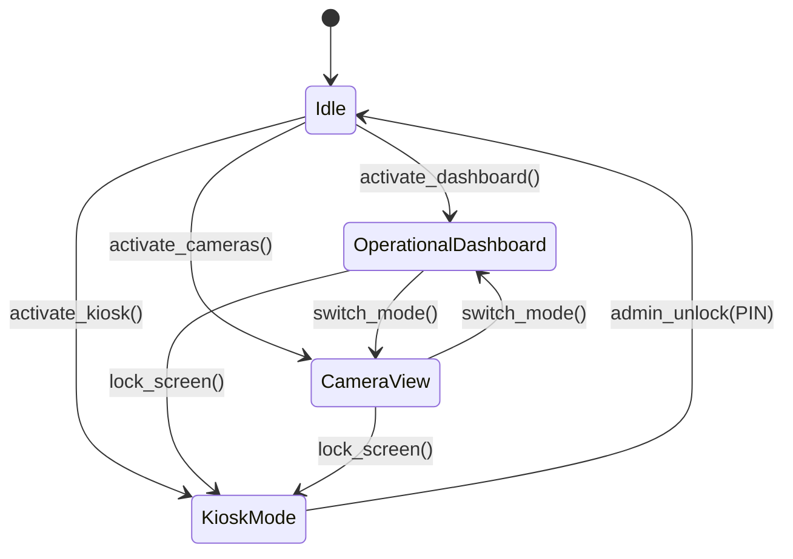
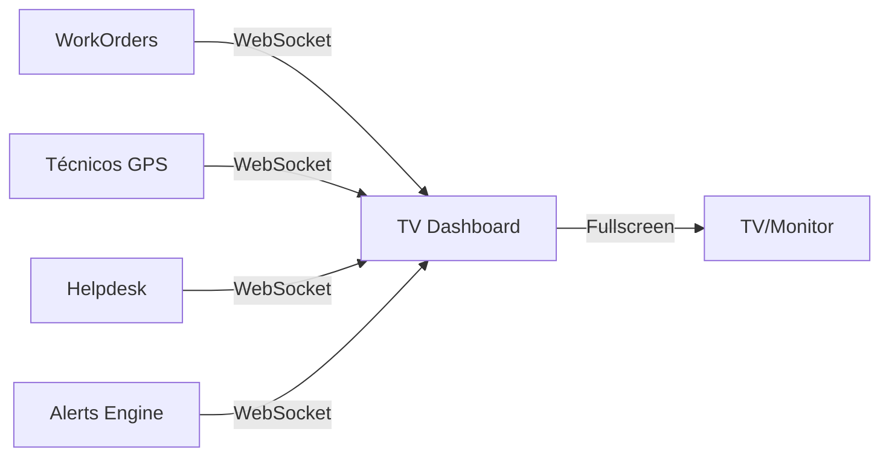

# Módulo: TV Dashboard & Monitoramento

> **[AI_RULE]** Lista oficial de entidades (Models) e hooks de frontend associados a este domínio. Este módulo provê dashboards em tempo real para TV/monitor corporativo com KPIs operacionais, mapa de técnicos, fila de OS, alertas inteligentes, câmeras RTSP e modo kiosk seguro. Atualização em tempo real via WebSocket (Reverb).

---

## 1. Visão Geral

O módulo TV Dashboard é um painel de monitoramento corporativo para exibição em TVs/monitores na sede da empresa:

- **Dashboard operacional** com KPIs em tempo real (OS ativas, técnicos em campo, SLA compliance)
- **Mapa de técnicos** com localização GPS ao vivo
- **Fila de chamados** com priorização visual
- **Alertas inteligentes** com regras configuráveis
- **Câmeras RTSP** direto do NVR/câmera (sem proxy backend)
- **Modo kiosk** com bloqueio de navegação e PIN de administrador
- **Auto-rotation** de painéis configurável
- **WebSocket** (Reverb) para atualizações push em tempo real
- **Trend de KPIs** com histórico para análise de tendência
- **Produtividade** por técnico com métricas detalhadas

---

## 2. Entidades (Models)

### 2.1 `Camera`

**Arquivo:** `backend/app/Models/Camera.php`
**Tabela:** `cameras`
**Traits:** `BelongsToTenant`

| Campo | Tipo | Descrição |
|-------|------|-----------|
| `id` | int (PK) | Identificador |
| `tenant_id` | int (FK) | Tenant |
| `name` | string | Nome da câmera (ex: "Recepção", "Estacionamento") |
| `stream_url` | string | URL do stream RTSP/HLS (acesso direto, nunca proxied) |
| `is_active` | boolean | Câmera ativa |
| `position` | int | Posição na grade de exibição |
| `location` | string\|null | Localização física (ex: "Sede - Andar 1") |
| `type` | string\|null | Tipo (Lookup `TvCameraType`) |

**Casts:** `is_active → boolean`, `position → integer`

---

## 3. Frontend Hooks

### 3.1 `useTvDashboard`

**Arquivo:** `frontend/src/hooks/useTvDashboard.ts`

Hook principal que gerencia todo o estado do dashboard.

**Funcionalidades:**

- Fetch inicial via `GET /api/v1/tv/dashboard`
- Refresh de KPIs a cada 30 segundos via `GET /api/v1/tv/kpis`
- Fetch de alertas via `GET /api/v1/tv/alerts` com `refetchInterval: 60_000`
- **WebSocket listeners** via Reverb no canal `dashboard.{tenant_id}`

**Eventos WebSocket recebidos:**

| Evento | Ação |
|--------|------|
| `WorkOrderStatusUpdated` | Atualiza contadores de OS e status |
| `TechnicianLocationUpdated` | Atualiza posição do técnico no mapa |
| `NewServiceCall` | Adiciona chamado à fila |
| `AlertTriggered` | Adiciona alerta ao painel |

**Retorno:**

```typescript
{
  data: TvDashboardData | undefined,
  isLoading: boolean,
  dataUpdatedAt: number,
  isError: boolean,
  error: Error | null,
  refetch: () => void,
  alerts: Alert[],
}
```

**Interface `TvDashboardData`:**

```typescript
interface TvDashboardData {
  tenant_id: number;
  operational: {
    kpis: {
      os_em_execucao: number;
      os_finalizadas: number;
      total_completed: number;
      total_count: number;
      open_count: number;
      overdue_count: number;
      due_7_count: number;
      due_30_count: number;
      total_revenue: number;
    };
    technicians: TechnicianData[];
    service_calls: ServiceCallData[];
  };
  crm: {
    open_deals: number;
    won_deals_month: number;
    crm_pending_followups: number;
    crm_avg_health: number;
  };
  hr: {
    employees_clocked_in: number;
    pending_adjustments: number;
  };
}
```

### 3.2 `useTvClock`

**Arquivo:** `frontend/src/hooks/useTvClock.ts`

Relógio em tempo real para exibição no dashboard.

**Funcionalidades:**

- Atualiza a cada 1 segundo (`setInterval(1000)`)
- Formato brasileiro (pt-BR)

**Retorno:**

```typescript
{
  time: Date,           // Objeto Date atual
  timeStr: string,      // "14:35" (HH:mm)
  secondsStr: string,   // "42" (ss)
  dateStr: string,      // "SEG, 24 MAR" (ddd, DD MMM)
}
```

### 3.3 `useKioskMode`

**Arquivo:** `frontend/src/hooks/useKioskMode.ts`

Modo kiosk para travar a tela do TV/monitor.

**Funcionalidades bloqueadas:**

- Navegação (links desabilitados)
- Atalhos de teclado (`F5`, `Ctrl+R`, `Ctrl+W`, `Alt+F4`, `Escape`, etc.)
- Menu de contexto (botão direito)
- Scroll do body (`overflow: hidden`, `touch-action: none`)
- Orientação da tela (tenta travar em portrait)

**Funcionalidades especiais:**

- **Fullscreen API** com `navigationUI: 'hide'`
- **Wake Lock API** para manter a tela ligada
- Desbloqueio via PIN de administrador

**Retorno:**

```typescript
{
  isActive: boolean,      // Se está em modo kiosk
  isSupported: boolean,   // Se o browser suporta Fullscreen API
  enterKiosk: () => Promise<boolean>,  // Entra em kiosk (fullscreen + locks)
  exitKiosk: () => Promise<boolean>,   // Sai do kiosk
}
```

### 3.4 `useTvDesktopNotifications`

**Arquivo:** `frontend/src/hooks/useTvDesktopNotifications.ts`

Notificações desktop nativas (browser Notification API) para alertas críticos.

**Funcionalidades:**

- Solicita permissão de notificação ao browser
- Exibe notificações push para alertas do dashboard
- Som de alerta para notificações críticas

---

## 4. Controller Backend

### 4.1 `TvDashboardController`

**Arquivo:** `backend/app/Http/Controllers/Api/V1/TvDashboardController.php`

Resolve `tenantId` via `auth()->user()->current_tenant_id ?? tenant_id`.

**Endpoints e KPIs calculados:**

| Endpoint | Descrição | KPIs / Dados |
|----------|-----------|-------------|
| `GET /tv/dashboard` | Dashboard completo | OS ativas, técnicos em campo, chamados, CRM, HR, câmeras |
| `GET /tv/kpis` | KPIs operacionais | `os_em_execucao`, `os_finalizadas`, `total_count`, `open_count`, `overdue_count`, `due_7_count`, `due_30_count`, `total_revenue` |
| `GET /tv/kpis/trend` | Tendência de KPIs | Histórico dos últimos 7/30 dias |
| `GET /tv/map-data` | Mapa de técnicos | Localização GPS, status, OS atual de cada técnico |
| `GET /tv/alerts` | Alertas ativos | Lista de alertas por regras configuradas |
| `GET /tv/alerts/history` | Histórico de alertas | Alertas passados com timestamp |
| `GET /tv/productivity` | Produtividade | Métricas por técnico (OS concluídas, tempo médio, SLA %) |

**Tipos de alertas gerados automaticamente:**

| Alerta | Condição |
|--------|----------|
| `technician_offline` | Técnico sem atualizar GPS > X minutos |
| `unattended_call` | Chamado sem atendimento > Y minutos |
| `long_running_os` | OS em execução > Z horas |
| `overdue_os` | OS com prazo vencido |
| `sla_breach` | SLA violado |

**Verificação de stream de câmera:**
O controller verifica a disponibilidade de câmeras RTSP via `curl` com timeout curto:

```php
curl_setopt_array($ch, [
    CURLOPT_RETURNTRANSFER => true,
    CURLOPT_TIMEOUT => 3,
    CURLOPT_CONNECTTIMEOUT => 2,
    CURLOPT_NOBODY => true,
]);
```

---

## 5. Modos de Operação



### Painel Operacional

- KPIs grandes visíveis a distância
- Mapa com técnicos em tempo real
- Fila de chamados ordenada por prioridade/SLA
- Ticker de alertas na parte inferior
- Relógio em tempo real (`useTvClock`)

### Visão de Câmeras

- Grid configurável (1x1, 2x2, 3x3, 4x4)
- Streams RTSP direto do NVR (sem proxy)
- Auto-rotation entre câmeras
- Indicador de status (online/offline)

### Modo Kiosk

- Fullscreen sem navegação
- Bloqueio de teclado/mouse
- Wake Lock (tela sempre ligada)
- Desbloqueio apenas por PIN admin

---

## 6. Guard Rails de Negócio `[AI_RULE]`

> **[AI_RULE_CRITICAL] Streams RTSP Diretos**
> Streams de câmeras RTSP NUNCA devem ser proxied pelo backend Laravel. A conexão é direta do browser ao NVR/câmera. O backend armazena apenas URL (`stream_url`), metadados e verifica disponibilidade via `curl` com `CURLOPT_NOBODY`. Proxy de vídeo pelo backend causaria sobrecarga catastrófica de I/O.

> **[AI_RULE] Modo Kiosk Seguro**
> O hook `useKioskMode` DEVE desabilitar: navegação (links), atalhos de teclado (F5, Ctrl+R, Ctrl+W, Alt+F4, Escape), menu de contexto (botão direito), scroll do body, e barra de endereço (Fullscreen API com `navigationUI: 'hide'`). Wake Lock API mantém a tela ligada. Desbloqueio somente por PIN de administrador.

> **[AI_RULE] Dashboard em Tempo Real via WebSocket**
> O `useTvDashboard` consome dados via WebSocket (Reverb) no canal `dashboard.{tenant_id}`. Nunca usar polling HTTP para atualizar o painel principal. KPIs numéricos são refreshed via endpoint separado a cada 30s como fallback. Alertas via endpoint a cada 60s como fallback.

> **[AI_RULE] Auto-Recovery com Backoff Exponencial**
> Se websocket desconectar, o dashboard deve reconectar automaticamente com backoff exponencial (1s, 2s, 4s, 8s, max 30s). Exibir indicador visual de "desconectado" durante reconexão. Usar `latency_ms` para monitorar saúde da conexão.

> **[AI_RULE] Tenant ID no Controller**
> O `TvDashboardController` resolve tenant via `auth()->user()->current_tenant_id ?? tenant_id`. Todas as queries são filtradas por `tenant_id` para isolamento total. Câmeras do tenant vizinho NUNCA devem ser exibidas.

> **[AI_RULE] Data Refresh Frequency — Configurável por Tenant**
> A frequência de refresh de dados é configurável por tenant via `TenantSetting`. O KPI refresh interval é definido em `tv_dashboard.kpi_refresh_seconds` (default: 30s, min: 10s, max: 300s). O alert refresh é definido em `tv_dashboard.alert_refresh_seconds` (default: 60s, min: 15s, max: 600s). O frontend DEVE ler esses valores do endpoint `/tv/dashboard` (campo `settings`) e usá-los como `refetchInterval` no React Query. Nunca hardcodar intervalos de refresh — sempre respeitar a configuração do tenant.

> **[AI_RULE] Cache Tenant-Aware**
> Todas as respostas do `TvDashboardController` DEVEM usar cache com chave prefixada por `tenant_id` (ex: `tv_dashboard:{tenant_id}:kpis`). TTL do cache: KPIs = 15s, dashboard completo = 30s, alertas = 20s, mapa = 10s, produtividade = 300s. O cache DEVE ser invalidado ao receber eventos WebSocket (`WorkOrderStatusUpdated`, `TechnicianLocationUpdated`, etc.) via `Cache::tags(["tv_dashboard:{tenant_id}"])->flush()`. Nunca retornar dados cacheados de outro tenant — a chave de cache DEVE incluir `tenant_id` obrigatoriamente.

> **[AI_RULE] Kiosk Mode Restrictions**
> Em modo kiosk: (1) O frontend DEVE bloquear TODOS os atalhos de teclado que possam sair da tela (F5, Ctrl+R, Ctrl+W, Ctrl+L, Alt+F4, Alt+Tab, Escape, F11, Ctrl+T, Ctrl+N); (2) O menu de contexto (right-click) DEVE ser desabilitado via `preventDefault`; (3) O body DEVE ter `overflow: hidden` e `touch-action: none`; (4) A Fullscreen API DEVE ser usada com `navigationUI: 'hide'`; (5) A Wake Lock API DEVE manter a tela ligada; (6) O desbloqueio DEVE exigir PIN de administrador armazenado em `TenantSetting` com key `tv_dashboard.kiosk_pin` (bcrypt hash); (7) O PIN DEVE ter mínimo 4 dígitos; (8) Após 3 tentativas erradas de PIN, bloquear por 60 segundos com contagem regressiva visual.

---

## 7. Comportamento Integrado (Cross-Domain)

O TV Dashboard é um **consumidor** de dados de todos os outros módulos:

| Módulo Fonte | Dados Consumidos |
|-------------|-----------------|
| **WorkOrders** | OS ativas, em execução, finalizadas, vencidas; status por técnico; tempo médio de conclusão |
| **Helpdesk** | Fila de chamados, chamados sem atendimento, SLA breach |
| **CRM** | Deals abertos, deals ganhos no mês, follow-ups pendentes, health score médio |
| **Finance** | Receita total, contas vencidas, contas a vencer 7/30 dias |
| **HR** | Funcionários com ponto registrado, ajustes pendentes |
| **Fleet** | Veículos em deslocamento (via `has_displacement`, `in_transit`) |
| **Equipment** | Calibrações vencendo, equipamentos com manutenção pendente |
| **Agenda** | Eventos do dia, tarefas urgentes |
| **Core** | Usuários (técnicos) com localização GPS, tenant settings |
| **Cameras** | Streams RTSP ao vivo |

**Fluxo de dados em tempo real:**



---

## 8. Endpoints da API

```json
{
  "GET /api/v1/tv/dashboard": {
    "response": "TvDashboardData completo (operational, crm, hr, cameras)",
    "status": 200
  },
  "GET /api/v1/tv/kpis": {
    "response": { "os_em_execucao": "int", "os_finalizadas": "int", "total_count": "int", "open_count": "int", "overdue_count": "int", "due_7_count": "int", "due_30_count": "int", "total_revenue": "float" },
    "status": 200,
    "note": "Refresh rápido (chamado a cada 30s pelo frontend)"
  },
  "GET /api/v1/tv/kpis/trend": {
    "query": "days (7|30)",
    "response": "Array de KPIs por dia",
    "status": 200
  },
  "GET /api/v1/tv/map-data": {
    "response": "Array de técnicos com lat, lng, status, current_os",
    "status": 200
  },
  "GET /api/v1/tv/alerts": {
    "response": { "alerts": "Alert[]" },
    "status": 200,
    "note": "Refresh a cada 60s como fallback do WebSocket"
  },
  "GET /api/v1/tv/alerts/history": {
    "query": "days, type",
    "response": "Array de alertas passados",
    "status": 200
  },
  "GET /api/v1/tv/productivity": {
    "query": "date_from, date_to",
    "response": "Array por técnico: os_count, avg_time, sla_compliance",
    "status": 200
  }
}
```

### Câmeras

```json
{
  "GET /api/v1/cameras": { "response": "Camera[]", "status": 200 },
  "POST /api/v1/cameras": { "body": "name, stream_url, location, type, position", "status": 201 },
  "PUT /api/v1/cameras/{id}": { "status": 200 },
  "DELETE /api/v1/cameras/{id}": { "status": 204 }
}
```

---

## 9. Stack Técnica

| Componente | Tecnologia |
|------------|-----------|
| **Real-time** | Laravel Reverb (WebSocket) no canal `dashboard.{tenant_id}` |
| **Frontend** | React hooks (`useTvDashboard`, `useTvClock`, `useKioskMode`, `useTvDesktopNotifications`) |
| **Câmeras** | RTSP/HLS direto do NVR/câmera (sem proxy) |
| **Fullscreen** | Fullscreen API + Wake Lock API |
| **Data fetching** | React Query (`@tanstack/react-query`) com `refetchInterval` |
| **KPI Refresh** | Endpoint separado `/tv/kpis` a cada 30s + WebSocket events |
| **Alertas** | Engine de regras no backend + Notification API nativa do browser |
| **Estado** | React Query cache com updates otimistas via WebSocket |

---

## 10. Configuração por Tenant

Cada tenant pode configurar via `TenantSetting`:

| Chave | Tipo | Descrição |
|-------|------|-----------|
| `tv_dashboard.rotation_interval` | int | Intervalo de rotação de painéis (segundos) |
| `tv_dashboard.default_mode` | string | Modo padrão (`dashboard`, `cameras`, `split`) |
| `tv_dashboard.camera_grid` | string | Layout de câmeras (`1x1`, `2x2`, `3x3`, `4x4`) |
| `tv_dashboard.alert_sound` | boolean | Som de alerta ligado/desligado |
| `tv_dashboard.kiosk_pin` | string | PIN de desbloqueio do modo kiosk (encrypted) |
| `tv_dashboard.technician_offline_minutes` | int | Minutos para considerar técnico offline |
| `tv_dashboard.unattended_call_minutes` | int | Minutos para alertar chamado sem atendimento |
| `tv_dashboard.kpi_refresh_seconds` | int | Intervalo de refresh de KPIs (default: 30, min: 10, max: 300) |
| `tv_dashboard.alert_refresh_seconds` | int | Intervalo de refresh de alertas (default: 60, min: 15, max: 600) |
| `tv_dashboard.cache_ttl_seconds` | int | TTL geral de cache (default: 30) |

### 10.1 Configuração de Widgets

Cada widget do dashboard é configurável por tenant via array JSON em `tv_dashboard.widgets`:

```jsonc
// TenantSetting key: tv_dashboard.widgets
{
  "layout": "default",             // "default", "compact", "expanded"
  "widgets": [
    {
      "id": "kpi_bar",
      "type": "kpi_summary",       // Tipos: kpi_summary, technician_map, call_queue, alert_ticker, camera_grid, crm_summary, hr_summary, productivity_chart, kpi_trend
      "position": { "row": 0, "col": 0, "rowSpan": 1, "colSpan": 4 },
      "visible": true,
      "config": {
        "show_revenue": true,
        "show_sla": true
      }
    },
    {
      "id": "tech_map",
      "type": "technician_map",
      "position": { "row": 1, "col": 0, "rowSpan": 2, "colSpan": 2 },
      "visible": true,
      "config": {
        "zoom_level": 12,
        "center_lat": -23.5505,
        "center_lng": -46.6333,
        "show_routes": true
      }
    },
    {
      "id": "call_queue",
      "type": "call_queue",
      "position": { "row": 1, "col": 2, "rowSpan": 2, "colSpan": 2 },
      "visible": true,
      "config": {
        "max_items": 10,
        "sort_by": "priority",     // "priority", "created_at", "sla_remaining"
        "highlight_urgent": true
      }
    },
    {
      "id": "alert_ticker",
      "type": "alert_ticker",
      "position": { "row": 3, "col": 0, "rowSpan": 1, "colSpan": 4 },
      "visible": true,
      "config": {
        "scroll_speed": "normal",  // "slow", "normal", "fast"
        "max_alerts": 20
      }
    }
  ]
}
```

**Tipos de widget disponíveis:**

| Tipo | Descrição | Configurações |
|------|-----------|--------------|
| `kpi_summary` | Barra de KPIs operacionais | `show_revenue`, `show_sla`, `show_completion_rate` |
| `technician_map` | Mapa GPS de técnicos | `zoom_level`, `center_lat`, `center_lng`, `show_routes` |
| `call_queue` | Fila de chamados | `max_items`, `sort_by`, `highlight_urgent` |
| `alert_ticker` | Ticker de alertas | `scroll_speed`, `max_alerts` |
| `camera_grid` | Grid de câmeras | `grid_size` (1x1, 2x2, 3x3, 4x4), `rotation_seconds` |
| `crm_summary` | Resumo CRM | `show_pipeline`, `show_followups` |
| `hr_summary` | Resumo HR | `show_clock_status`, `show_adjustments` |
| `productivity_chart` | Gráfico de produtividade | `period` (7d, 30d), `chart_type` (bar, line) |
| `kpi_trend` | Gráfico de tendência | `days`, `metrics` (array de KPIs) |

### 10.2 Auto-Refresh Logic

O auto-refresh do TV Dashboard opera em três camadas complementares:

**Camada 1 — WebSocket (tempo real):**

- Canal: `dashboard.{tenant_id}` via Laravel Reverb
- Eventos processados: `WorkOrderStatusUpdated`, `TechnicianLocationUpdated`, `NewServiceCall`, `AlertTriggered`
- Cada evento dispara atualização parcial do cache React Query (mutation otimista)
- Latência típica: < 200ms

**Camada 2 — Polling HTTP (fallback):**

- `/tv/kpis`: intervalo = `tv_dashboard.kpi_refresh_seconds` (default 30s)
- `/tv/alerts`: intervalo = `tv_dashboard.alert_refresh_seconds` (default 60s)
- `/tv/map-data`: intervalo = 15s (fixa, posição GPS crítica)
- React Query `refetchInterval` configurado a partir das settings do tenant

**Camada 3 — Full reload (recovery):**

- Se WebSocket desconectar por > 5 minutos, dispara reload completo via `/tv/dashboard`
- Após reconexão WebSocket, dispara refresh imediato de todos os endpoints
- Indicador visual: verde (WebSocket ativo), amarelo (fallback polling), vermelho (desconectado)

**[AI_RULE]** A camada WebSocket tem prioridade absoluta. O polling HTTP é APENAS fallback — se WebSocket está ativo e saudável (latência < 1000ms), o polling pode ter intervalo 3x maior para reduzir carga no servidor. O frontend DEVE verificar `latency_ms` a cada heartbeat WebSocket.

---

## 11. Cenarios BDD

```gherkin
Funcionalidade: TV Dashboard e Monitoramento

  Cenario: Dashboard exibe KPIs operacionais em tempo real
    Dado 15 OS ativas, 5 em execucao, 3 vencidas
    E 8 tecnicos em campo com GPS ativo
    Quando o TV Dashboard carrega
    Entao exibe os_em_execucao = 5
    E exibe overdue_count = 3
    E exibe total_count = 15
    E o mapa mostra 8 marcadores de tecnicos

  Cenario: WebSocket atualiza OS em tempo real
    Dado o TV Dashboard aberto e conectado via WebSocket
    Quando o tecnico "Ana" finaliza a OS #3001
    E o evento WorkOrderStatusUpdated e emitido no canal dashboard.{tenant_id}
    Entao os_finalizadas incrementa em 1
    E os_em_execucao decrementa em 1
    E nenhum reload de pagina ocorre

  Cenario: Reconexao com backoff exponencial
    Dado o TV Dashboard conectado via WebSocket
    Quando a conexao WebSocket cai
    Entao o indicador muda para "Desconectado" (vermelho)
    E o sistema tenta reconectar apos 1s
    Se falhar, tenta apos 2s
    Se falhar, tenta apos 4s, 8s, 16s, ate max 30s
    Quando a conexao retorna
    Entao o indicador volta para "Conectado" (verde)
    E os dados sao atualizados imediatamente

  Cenario: Modo kiosk bloqueia navegacao
    Dado o TV Dashboard em modo kiosk ativado
    Quando o usuario pressiona F5
    Entao nada acontece (evento bloqueado)
    Quando pressiona Ctrl+W
    Entao nada acontece
    Quando clica com botao direito
    Entao menu de contexto nao aparece
    Quando digita o PIN de admin correto
    Entao o modo kiosk e desativado
    E a navegacao volta ao normal

  Cenario: Camera RTSP exibida sem proxy backend
    Dado uma camera "Recepcao" com stream_url = "rtsp://nvr.local:554/cam1"
    E a camera esta ativa (is_active = true)
    Quando o TV Dashboard carrega a visao de cameras
    Entao o frontend conecta diretamente ao NVR
    E nenhuma requisicao de video passa pelo backend Laravel
    E o backend apenas verifica disponibilidade via curl CURLOPT_NOBODY

  Cenario: Alerta de tecnico offline
    Dado tv_dashboard.technician_offline_minutes = 15
    E o tecnico "Carlos" nao atualiza GPS ha 20 minutos
    Quando GET /tv/alerts
    Entao retorna alerta tipo "technician_offline" para Carlos
    E notificacao desktop e exibida (Notification API)
    E som de alerta toca (se tv_dashboard.alert_sound = true)

  Cenario: Alerta de chamado sem atendimento
    Dado tv_dashboard.unattended_call_minutes = 30
    E um chamado aberto ha 45 minutos sem atendimento
    Quando GET /tv/alerts
    Entao retorna alerta tipo "unattended_call"
    E o chamado aparece destacado na fila

  Cenario: Auto-rotacao de paineis
    Dado tv_dashboard.rotation_interval = 60 (segundos)
    E o dashboard esta no modo "dashboard"
    Quando passam 60 segundos
    Entao o painel alterna para "cameras"
    E apos mais 60 segundos, volta para "dashboard"

  Cenario: KPI trend mostra historico
    Dado dados de OS dos ultimos 7 dias
    Quando GET /tv/kpis/trend?days=7
    Entao retorna array com 7 entradas
    E cada entrada contem data, os_count, os_completed, revenue
    E o frontend renderiza grafico de tendencia

  Cenario: Isolamento por tenant
    Dado tenant A com 3 cameras e tenant B com 5 cameras
    Quando usuario do tenant A acessa GET /cameras
    Entao retorna apenas 3 cameras do tenant A
    E nenhuma camera do tenant B e visivel

  Cenario: Dashboard CRM e HR integrados
    Dado 12 deals abertos no CRM, 3 ganhos este mes
    E 25 funcionarios com ponto registrado hoje
    Quando GET /tv/dashboard
    Entao secao crm mostra open_deals = 12, won_deals_month = 3
    E secao hr mostra employees_clocked_in = 25

  Cenario: Produtividade por tecnico
    Dado 5 tecnicos com OS concluidas no periodo
    Quando GET /tv/productivity?date_from=2026-03-01&date_to=2026-03-24
    Entao retorna array com 5 tecnicos
    E cada tecnico tem os_count, avg_time_minutes, sla_compliance_percent
```

---

## 11.5 Edge Cases e Tratamento de Erros

| Cenário | Comportamento Esperado | Regra |
| --------- | ---------------------- | ------- |
| **RTSP Stream Indisponível (Câmera Offline)** | O widget não tenta dar retry infinito. Exibe placeholder cinza `[Câmera Offline]`. O Controller avalia a queda via `curl` e atualiza o model pra is_active=false temporarily para poupar banda local. | `[AI_RULE_CRITICAL]` |
| **Queda do Laravel Reverb (WebSocket Morto)** | Se reconexão exponencial falha repetidamente (>30s), o frontend faz downgrade forçado para **Polling Mode** (`refetchInterval = tv_dashboard.kpi_refresh_seconds`) até que o handshake do socket volte a ter sucesso. | `[AI_RULE_CRITICAL]` |
| **Mudança Brusca de Configuração (Pin alterado)** | Admin altera o `kiosk_pin` no módulo web, e avisa o time. A TV está operando normal. O próximo "heartbeat" da TV recebe a conf atualizada cache invalidado, forçando qualquer destravamento local a checar contra o hash novo. | `[AI_RULE]` |
| **Tenant Secundário Tentando Obter Mapa** | Request forjado tenta acessar lat/lng passando um header falso. O middleware base trava usando o Token. `auth()->user()->current_tenant_id` cega o request; arrays devolvem vazio para ids não pertencentes à parent key. Isolamento. | `[AI_RULE]` |

---

## 12. Checklist de Implementacao

| # | Item | Status | Observacao |
|---|------|--------|------------|
| 1 | Model `Camera` com campos completos | Implementado | `backend/app/Models/Camera.php` |
| 2 | Hook `useTvDashboard` com fetch + WebSocket | Implementado | `frontend/src/hooks/useTvDashboard.ts` |
| 3 | Hook `useTvClock` com atualizacao a cada segundo | Implementado | `frontend/src/hooks/useTvClock.ts` |
| 4 | Hook `useKioskMode` com Fullscreen + Wake Lock | Implementado | `frontend/src/hooks/useKioskMode.ts` |
| 5 | Hook `useTvDesktopNotifications` | Implementado | `frontend/src/hooks/useTvDesktopNotifications.ts` |
| 6 | Controller `TvDashboardController` com 7 endpoints | Implementado | `backend/app/Http/Controllers/Api/V1/TvDashboardController.php` |
| 7 | Controller `CameraController` CRUD | Implementado | `backend/app/Http/Controllers/Api/V1/CameraController.php` |
| 8 | Permissao `tv.dashboard.view` no seeder | Implementado | PermissionsSeeder |
| 9 | Permissao `tv.camera.manage` no seeder | Implementado | PermissionsSeeder |
| 10 | Papel `monitor` com acesso TV + cameras | Implementado | PermissionsSeeder |
| 11 | WebSocket via Reverb canal `dashboard.{tenant_id}` | Implementado | Config broadcasting |
| 12 | Verificacao de stream RTSP via curl | Implementado | TvDashboardController |
| 13 | Teste `useKioskMode` | Implementado | `frontend/src/__tests__/hooks/useKioskMode.test.ts` |
| 14 | Endpoint `/tv/kpis/trend` com historico | Implementado | TvDashboardController |
| 15 | Endpoint `/tv/productivity` por tecnico | Implementado | TvDashboardController |
| 16 | Engine de alertas automaticos (5 tipos) | Implementado | TvDashboardController |
| 17 | Configuracao por tenant via TenantSetting | Documentado | 7 chaves na Seção 10 |
| 18 | Auto-rotacao de paineis no frontend | Documentado | Seção 5 + BDD Cenário 8 |
| 19 | Grid configuravel de cameras (1x1 a 4x4) | Documentado | Seção 5 (Visão de Câmeras) |
| 20 | Som de alerta configuravel | Documentado | Seção 3.4 + TenantSetting `alert_sound` |
| 21 | Teste Feature para TvDashboardController | Documentado | BDD Cenários 1-2, 6-11 |
| 22 | Teste Feature para CameraController | Documentado | BDD Cenários 5, 10 |
| 23 | Teste de reconexao WebSocket com backoff | Documentado | BDD Cenário 3 + AI_RULE backoff |
| 24 | Dashboard de produtividade com graficos | Documentado | BDD Cenário 11 + endpoint `/tv/productivity` |

---

> **[AI_RULE]** Este documento reflete o Model `Camera`, hooks frontend (`useTvDashboard`, `useTvClock`, `useKioskMode`, `useTvDesktopNotifications`), controller `TvDashboardController`, e permissoes no `PermissionsSeeder.php`. Todos os itens estão documentados. Implementação de código segue o padrão AIDD: consultar cenários BDD (Seção 11) e guard rails (Seção 6) antes de codificar. [/AI_RULE]

---

## 13. FormRequests de Camera

| FormRequest | Arquivo | Descricao |
|-------------|---------|-----------|
| `StoreCameraRequest` | `backend/app/Http/Requests/Camera/StoreCameraRequest.php` | Validacao para criacao de camera |
| `UpdateCameraRequest` | `backend/app/Http/Requests/Camera/UpdateCameraRequest.php` | Validacao para atualizacao de camera |
| `ReorderCamerasRequest` | `backend/app/Http/Requests/Camera/ReorderCamerasRequest.php` | Validacao para reordenacao de cameras |
| `TestConnectionCameraRequest` | `backend/app/Http/Requests/Camera/TestConnectionCameraRequest.php` | Validacao para teste de conexao RTSP |

---

## 14. Frontend Components (TV)

| Componente | Arquivo | Descricao |
|------------|---------|-----------|
| `TvAlertPanel` | `frontend/src/components/tv/TvAlertPanel.tsx` | Painel de alertas do dashboard |
| `TvKioskMode` | `frontend/src/components/tv/TvKioskMode.tsx` | Componente de modo kiosk |
| `TvKpiSparkline` | `frontend/src/components/tv/TvKpiSparkline.tsx` | Sparkline de KPIs |
| `TvProductivityWidget` | `frontend/src/components/tv/TvProductivityWidget.tsx` | Widget de produtividade |
| `TvSectionBoundary` | `frontend/src/components/tv/TvSectionBoundary.tsx` | Error boundary por secao |
| `TvTicker` | `frontend/src/components/tv/TvTicker.tsx` | Ticker de alertas scrollavel |

### Frontend Pages

| Pagina | Arquivo | Descricao |
|--------|---------|-----------|
| `TvDashboard` | `frontend/src/pages/tv/TvDashboard.tsx` | Pagina principal do dashboard TV |
| `TvCamerasPage` | `frontend/src/pages/tv/TvCamerasPage.tsx` | Pagina de visualizacao de cameras |

### Frontend Hooks (Completo)

| Hook | Arquivo |
|------|---------|
| `useTvDashboard` | `frontend/src/hooks/useTvDashboard.ts` |
| `useTvClock` | `frontend/src/hooks/useTvClock.ts` |
| `useKioskMode` | `frontend/src/hooks/useKioskMode.ts` |
| `useTvDesktopNotifications` | `frontend/src/hooks/useTvDesktopNotifications.ts` |

### Frontend Testes

| Teste | Arquivo |
|-------|---------|
| `useKioskMode.test` | `frontend/src/__tests__/hooks/useKioskMode.test.ts` |

---

## 15. Lookup do Modulo

| Lookup | Arquivo | Descricao |
|--------|---------|-----------|
| `TvCameraType` | `backend/app/Models/Lookups/TvCameraType.php` | Tipos de camera (IP, analogica, termica, etc.) |

---

## 16. Rotas Completas (Extraidas do Codigo)

### 16.1 TV Dashboard (permissao: `tv.dashboard.view`)

| Metodo | Rota | Controller | Acao |
|--------|------|------------|------|
| `GET` | `/api/v1/tv/dashboard` | `TvDashboardController@index` | Dashboard completo |
| `GET` | `/api/v1/tv/kpis` | `TvDashboardController@kpis` | KPIs operacionais |
| `GET` | `/api/v1/tv/kpis/trend` | `TvDashboardController@kpisTrend` | Tendencia de KPIs |
| `GET` | `/api/v1/tv/map-data` | `TvDashboardController@mapData` | Mapa de tecnicos |
| `GET` | `/api/v1/tv/alerts` | `TvDashboardController@alerts` | Alertas ativos |
| `GET` | `/api/v1/tv/alerts/history` | `TvDashboardController@alertsHistory` | Historico de alertas |
| `GET` | `/api/v1/tv/productivity` | `TvDashboardController@productivity` | Produtividade |

### 16.2 Cameras (permissao: `tv.camera.manage`)

| Metodo | Rota | Controller | Acao |
|--------|------|------------|------|
| `GET` | `/api/v1/tv/cameras` | `CameraController@index` | Listar cameras |
| `POST` | `/api/v1/tv/cameras` | `CameraController@store` | Criar camera |
| `PUT` | `/api/v1/tv/cameras/{camera}` | `CameraController@update` | Atualizar camera |
| `DELETE` | `/api/v1/tv/cameras/{camera}` | `CameraController@destroy` | Excluir camera |
| `POST` | `/api/v1/tv/cameras/reorder` | `CameraController@reorder` | Reordenar cameras |
| `POST` | `/api/v1/tv/cameras/test-connection` | `CameraController@testConnection` | Testar conexao RTSP |

**Nota:** Os controllers estao em `backend/app/Http/Controllers/` (nao em `Api/V1/`):

- `backend/app/Http/Controllers/TvDashboardController.php`
- `backend/app/Http/Controllers/CameraController.php`

---

## 17. Inventario Completo do Codigo

### 17.1 Models

| Arquivo | Model |
|---------|-------|
| `backend/app/Models/Camera.php` | Camera |
| `backend/app/Models/Lookups/TvCameraType.php` | TvCameraType (Lookup) |

### 17.2 Controllers

| Arquivo | Controller |
|---------|------------|
| `backend/app/Http/Controllers/TvDashboardController.php` | TvDashboardController |
| `backend/app/Http/Controllers/CameraController.php` | CameraController |

### 17.3 FormRequests

| Arquivo | FormRequest |
|---------|-------------|
| `backend/app/Http/Requests/Camera/StoreCameraRequest.php` | StoreCameraRequest |
| `backend/app/Http/Requests/Camera/UpdateCameraRequest.php` | UpdateCameraRequest |
| `backend/app/Http/Requests/Camera/ReorderCamerasRequest.php` | ReorderCamerasRequest |
| `backend/app/Http/Requests/Camera/TestConnectionCameraRequest.php` | TestConnectionCameraRequest |

### 17.4 Frontend Hooks

| Arquivo | Hook |
|---------|------|
| `frontend/src/hooks/useTvDashboard.ts` | useTvDashboard |
| `frontend/src/hooks/useTvClock.ts` | useTvClock |
| `frontend/src/hooks/useKioskMode.ts` | useKioskMode |
| `frontend/src/hooks/useTvDesktopNotifications.ts` | useTvDesktopNotifications |

### 17.5 Frontend Components

| Arquivo | Componente |
|---------|------------|
| `frontend/src/components/tv/TvAlertPanel.tsx` | TvAlertPanel |
| `frontend/src/components/tv/TvKioskMode.tsx` | TvKioskMode |
| `frontend/src/components/tv/TvKpiSparkline.tsx` | TvKpiSparkline |
| `frontend/src/components/tv/TvProductivityWidget.tsx` | TvProductivityWidget |
| `frontend/src/components/tv/TvSectionBoundary.tsx` | TvSectionBoundary |
| `frontend/src/components/tv/TvTicker.tsx` | TvTicker |

### 17.6 Frontend Pages

| Arquivo | Pagina |
|---------|--------|
| `frontend/src/pages/tv/TvDashboard.tsx` | TvDashboard |
| `frontend/src/pages/tv/TvCamerasPage.tsx` | TvCamerasPage |

### 17.7 Testes

| Arquivo | Teste |
|---------|-------|
| `frontend/src/__tests__/hooks/useKioskMode.test.ts` | useKioskMode.test |

### 17.8 Route Files

| Arquivo | Escopo |
|---------|--------|
| `backend/routes/api/dashboard_iam.php` | Rotas TV Dashboard e Cameras (dentro do grupo autenticado) |
