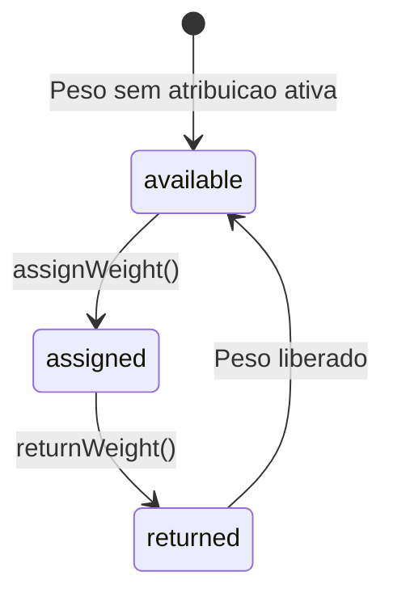
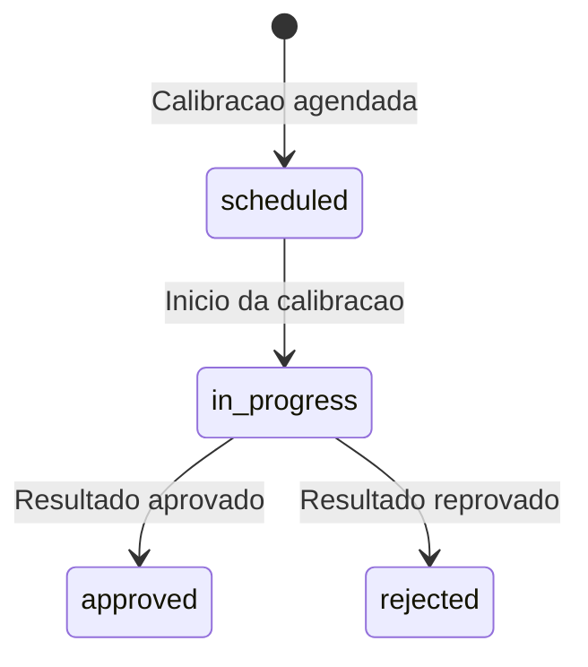

# Modulo: Pesos Padrao & Ferramentas de Calibracao

> **[AI_RULE]** Documentacao oficial do modulo WeightTool. Toda entidade, campo, estado e regra aqui descritos sao extraidos diretamente do codigo-fonte e devem ser respeitados por qualquer agente de IA.

---

## 1. Visao Geral

O modulo WeightTool gerencia a atribuicao de pesos padrao a tecnicos/veiculos e o controle de calibracao de ferramentas de medicao. E parte fundamental da rastreabilidade metrologica ISO 17025, garantindo que instrumentos e padroes estejam dentro da validade de calibracao antes de serem utilizados em campo.

### Principios Fundamentais

- **Rastreabilidade ISO 17025**: todo peso padrao e ferramenta devem ter calibracao valida
- **Atribuicao exclusiva**: ao atribuir um peso, atribuicoes anteriores sao automaticamente encerradas
- **Alertas de vencimento**: endpoint dedicado para calibracoes vencendo em N dias
- **Multi-tenant isolado**: toda query filtra por `tenant_id`

---

## 2. Entidades (Models) — Campos Completos

### 2.1 `WeightAssignment`

Atribuicao de peso padrao a tecnico ou veiculo.

| Campo | Tipo | Descricao |
|---|---|---|
| `tenant_id` | bigint | Tenant |
| `standard_weight_id` | bigint FK | Peso padrao atribuido |
| `assigned_to_user_id` | bigint FK | Tecnico responsavel (nullable) |
| `assigned_to_vehicle_id` | bigint FK | Veiculo (nullable) |
| `assignment_type` | string | Tipo: `field`, `lab`, `storage` |
| `assigned_at` | datetime | Data/hora da atribuicao |
| `assigned_by` | bigint FK | Usuario que atribuiu |
| `returned_at` | datetime | Data/hora da devolucao (null = em uso) |
| `notes` | text | Observacoes |

**Relacionamentos:**

- `belongsTo` StandardWeight (standard_weight_id) — alias `weight`
- `belongsTo` User (assigned_to_user_id) — alias `user`
- `belongsTo` Vehicle (assigned_to_vehicle_id) — alias `vehicle`

### 2.2 `ToolCalibration`

Registro de calibracao de ferramenta/instrumento.

| Campo | Tipo | Descricao |
|---|---|---|
| `tenant_id` | bigint | Tenant |
| `tool_id` | bigint FK | Ferramenta/instrumento calibrado |
| `calibration_date` | date | Data da calibracao |
| `next_due_date` | date | Proxima calibracao prevista |
| `result` | string | Resultado (`approved`, `rejected`, `conditional`) |
| `status` | string | `scheduled`, `in_progress`, `approved`, `rejected` |
| `certificate_number` | string | Numero do certificado |
| `laboratory` | string | Laboratorio que calibrou |
| `uncertainty` | decimal | Incerteza de medicao |
| `notes` | text | Observacoes |

**Relacionamentos:**

- `belongsTo` Tool/Equipment (tool_id) — alias `tool`

**Scopes:** `expiring($days)` — calibracoes com `next_due_date` nos proximos N dias

### 2.3 `StandardWeight`

Peso padrao de referencia metrologica. Model completo com SoftDeletes e Auditable.

| Campo | Tipo | Descricao |
|---|---|---|
| `tenant_id` | bigint | Tenant |
| `code` | string | Codigo identificador (ex: `PP-0001`, gerado via NumberingSequence) |
| `nominal_value` | decimal:4 | Valor nominal |
| `unit` | string | Unidade: `kg`, `g`, `mg` |
| `serial_number` | string | Numero de serie do fabricante |
| `manufacturer` | string | Fabricante |
| `precision_class` | string | Classe OIML: `E1`, `E2`, `F1`, `F2`, `M1`, `M2`, `M3` (Ordinaria) |
| `material` | string | Material (inox, latao, ferro fundido) |
| `shape` | string | Formato: `cilindrico`, `retangular`, `disco`, `paralelepipedo`, `outro` |
| `certificate_number` | string | Numero do certificado de calibracao |
| `certificate_date` | date | Data do certificado |
| `certificate_expiry` | date | Data de vencimento do certificado |
| `certificate_file` | string | Arquivo do certificado |
| `laboratory` | string | Laboratorio que calibrou |
| `status` | string | `active`, `in_calibration`, `out_of_service`, `discarded` |
| `notes` | text | Observacoes |
| `wear_rate_percentage` | decimal:2 | Taxa de desgaste (%) — calculada por `WeightWearPredictorService` |
| `expected_failure_date` | date | Data prevista de falha (predicao) |

**Traits:** `BelongsToTenant`, `HasFactory`, `SoftDeletes`, `Auditable`

**Constants:**

- `STATUS_ACTIVE`, `STATUS_IN_CALIBRATION`, `STATUS_OUT_OF_SERVICE`, `STATUS_DISCARDED`
- `PRECISION_CLASSES`: E1, E2, F1, F2, M1, M2, M3
- `UNITS`: kg, g, mg
- `SHAPES`: cilindrico, retangular, disco, paralelepipedo, outro

**Accessors:**

- `certificate_status` — retorna `em_dia`, `vence_em_breve`, `vencido`, `sem_data`
- `display_name` — retorna `"PP-0001 — 10.0000 kg"`

**Scopes:** `active()`, `expiringSoon()`

**Relacionamentos:**

- `belongsToMany` EquipmentCalibration (pivot: `calibration_standard_weight`)
- `hasMany` WeightAssignment

**Metodo:** `generateCode($tenantId)` — gera codigo via `NumberingSequence` (prefixo `PP-`, padding 4)

---

## 2.4 Services

### `WeightWearPredictorService`

**Classe:** `App\Services\Metrology\WeightWearPredictorService`

Predicao de desgaste de pesos padrao baseada em historico de calibracoes:

- Le calibracoes reais via `$weight->calibrations()` com leituras
- Calcula `wear_rate_percentage` por regressao linear sobre medicoes historicas
- Calcula `expected_failure_date` projetando quando o peso saira do EMA da sua classe OIML
- Metodo `getMaximumPermissibleError($weight)` retorna EMA da classe de precisao
- Metodo principal: `updateWearPrediction(StandardWeight $weight): void`

---

## 3. Maquinas de Estado

### 3.1 WeightAssignment — Ciclo de Atribuicao

> **[AI_RULE]** Ao atribuir peso, atribuicoes anteriores do mesmo `standard_weight_id` sao automaticamente encerradas (`returned_at = now()`).



| De | Para | Acao | Regra |
|---|---|---|---|
| `available` | `assigned` | `assignWeight()` | Encerra atribuicoes anteriores; atualiza `StandardWeight.assigned_to_*` |
| `assigned` | `returned` | `returnWeight()` | Define `returned_at = now()`; limpa `StandardWeight.assigned_to_*` |

### 3.2 ToolCalibration — Ciclo de Calibracao



| De | Para | Acao | Regra |
|---|---|---|---|
| `scheduled` | `in_progress` | Inicio do processo | Laboratorio inicia calibracao |
| `in_progress` | `approved` | Resultado conforme | Certificado emitido, `next_due_date` definido |
| `in_progress` | `rejected` | Resultado nao conforme | Ferramenta retirada de uso, CAPA pode ser aberta |

---

## 4. Endpoints

> **[AI_RULE]** Todos os endpoints requerem autenticacao. Tenant isolado via `$request->user()->current_tenant_id`.

### 4.1 Atribuicao de Pesos

| Metodo | Rota | Controller | Descricao |
|---|---|---|---|
| `GET` | `/api/v1/weight-tool/assignments` | `WeightToolController@indexWeightAssignments` | Listar atribuicoes com eager loading (weight, user, vehicle) |
| `POST` | `/api/v1/weight-tool/assignments` | `WeightToolController@assignWeight` | Atribuir peso a tecnico/veiculo (encerra atribuicoes anteriores) |
| `POST` | `/api/v1/weight-tool/assignments/{assignment}/return` | `WeightToolController@returnWeight` | Registrar devolucao do peso |

#### POST /api/v1/weight-tool/assignments — Atribuir peso

```jsonc
// Request
{
  "standard_weight_id": 12,              // required — exists:standard_weights (mesmo tenant)
  "assigned_to_user_id": 5,              // nullable — exists:users (mesmo tenant). Um dos dois obrigatorio.
  "assigned_to_vehicle_id": null,         // nullable — exists:fleet_vehicles (mesmo tenant)
  "assignment_type": "field",             // required — in: field, lab, storage
  "notes": "Atribuido para calibracao em campo" // nullable
}
// Response 201
{
  "data": {
    "id": 45,
    "standard_weight_id": 12,
    "assigned_to_user_id": 5,
    "assigned_to_vehicle_id": null,
    "assignment_type": "field",
    "assigned_at": "2026-03-25T10:30:00Z",
    "assigned_by": 1,
    "returned_at": null,
    "notes": "Atribuido para calibracao em campo",
    "weight": { "id": 12, "code": "PP-001", "nominal_value": 10.0, "unit": "kg", "precision_class": "F1" },
    "user": { "id": 5, "name": "Joao Tecnico" },
    "vehicle": null
  }
}
```

#### POST /api/v1/weight-tool/assignments/{assignment}/return — Devolver peso

```jsonc
// Request
{
  "notes": "Devolvido apos servico em campo" // nullable
}
// Response 200
{
  "data": {
    "id": 45,
    "returned_at": "2026-03-25T17:00:00Z",
    "notes": "Devolvido apos servico em campo"
  }
}
```

### 4.2 Calibracao de Ferramentas

| Metodo | Rota | Controller | Descricao |
|---|---|---|---|
| `GET` | `/api/v1/weight-tool/calibrations` | `WeightToolController@indexToolCalibrations` | Listar calibracoes com eager loading (tool) |
| `POST` | `/api/v1/weight-tool/calibrations` | `WeightToolController@storeToolCalibration` | Registrar nova calibracao |
| `PUT` | `/api/v1/weight-tool/calibrations/{calibration}` | `WeightToolController@updateToolCalibration` | Atualizar calibracao existente |
| `DELETE` | `/api/v1/weight-tool/calibrations/{calibration}` | `WeightToolController@destroyToolCalibration` | Remover calibracao |
| `GET` | `/api/v1/weight-tool/calibrations/expiring` | `WeightToolController@expiringToolCalibrations` | Listar calibracoes vencendo em N dias (default: 30) |

#### POST /api/v1/weight-tool/calibrations — Registrar calibracao

```jsonc
// Request
{
  "tool_id": 8,                           // required — exists:equipments (mesmo tenant)
  "calibration_date": "2026-03-20",       // required — date
  "next_due_date": "2027-03-20",          // required — date, after:calibration_date
  "result": "approved",                   // required — in: approved, rejected, conditional
  "status": "approved",                   // required — in: scheduled, in_progress, approved, rejected
  "certificate_number": "CERT-2026-0042", // nullable — string
  "laboratory": "Lab Nacional de Metrologia", // nullable — string
  "uncertainty": 0.0015,                  // nullable — numeric, min:0
  "notes": "Calibracao dentro da tolerancia" // nullable
}
// Response 201
{
  "data": {
    "id": 22,
    "tool_id": 8,
    "calibration_date": "2026-03-20",
    "next_due_date": "2027-03-20",
    "result": "approved",
    "status": "approved",
    "certificate_number": "CERT-2026-0042",
    "laboratory": "Lab Nacional de Metrologia",
    "uncertainty": 0.0015,
    "notes": "Calibracao dentro da tolerancia",
    "tool": { "id": 8, "name": "Balanca Analitica BX-200", "serial_number": "SN-12345" }
  }
}
```

#### GET /api/v1/weight-tool/calibrations/expiring — Calibracoes vencendo

```jsonc
// Request: GET /api/v1/weight-tool/calibrations/expiring?days=30
// Response 200
{
  "data": [
    {
      "id": 22,
      "tool_id": 8,
      "next_due_date": "2026-04-15",
      "result": "approved",
      "status": "approved",
      "certificate_number": "CERT-2026-0042",
      "days_remaining": 21,
      "tool": { "id": 8, "name": "Balanca Analitica BX-200" }
    }
  ]
}

---

## 4.3 Mapeamento de Produtos a Pesos Padrao

O sistema permite vincular `StandardWeight` a produtos/servicos para rastreabilidade em certificados. O mapeamento e feito via tabela pivot `standard_weight_products`:

| Campo | Tipo | Descricao |
|---|---|---|
| `standard_weight_id` | bigint FK | Peso padrao |
| `product_id` | bigint FK | Produto/servico vinculado |
| `usage_context` | string | Contexto de uso: `calibration`, `verification`, `test` |
| `is_primary` | boolean | Se e o peso principal para este produto |

**[AI_RULE]** Ao emitir certificado de calibracao (modulo Lab), o sistema DEVE verificar que todos os pesos padrao referenciados possuem calibracao valida (`certificate_expiry >= today`). Se algum peso estiver vencido, o certificado NAO pode ser emitido — retorna erro 422 com lista dos pesos vencidos.

### Classe de Precisao e Aplicacao

| Classe | Aplicacao | Tolerancia Tipica |
|---|---|---|
| `E1` | Referencia primaria, calibracao de pesos E2 | ±0.5 mg (1 kg) |
| `E2` | Referencia secundaria, calibracao de pesos F1 | ±1.6 mg (1 kg) |
| `F1` | Calibracao de balancas de alta precisao | ±5 mg (1 kg) |
| `F2` | Calibracao de balancas comerciais | ±16 mg (1 kg) |
| `M1` | Uso geral em campo, verificacao de balancas | ±50 mg (1 kg) |
| `M2` | Verificacao de balancas de baixa precisao | ±160 mg (1 kg) |
| `M3` | Uso industrial, pesagem grosseira | ±500 mg (1 kg) |

**[AI_RULE]** A classe de precisao do peso DEVE ser compativel com o instrumento sendo calibrado. Peso de classe M1 NAO pode ser usado para calibrar balanca que requer classe F1 ou superior.

---

## 5. Regras Cross-Domain

> **[AI_RULE]** Rastreabilidade metrologica e obrigatoria para certificados ISO 17025.

| Modulo Destino | Integracao | Descricao |
|---|---|---|
| Lab | ISO 17025 traceability | Certificados de calibracao referenciam pesos padrao utilizados |
| Equipment | Ferramenta vinculada | `ToolCalibration.tool_id` referencia equipamento do cadastro |
| Fleet | Veiculo com pesos | `WeightAssignment.assigned_to_vehicle_id` rastreia pesos em veiculos |
| Quality | CAPA por rejeicao | Calibracao `rejected` pode gerar CAPA automatica no modulo Quality |
| Alerts | Vencimento | Calibracoes vencendo disparam alertas via `AlertEngineService` |

---

## 6. Observabilidade

### Metricas

| Metrica | Descricao | Threshold |
|---|---|---|
| `weight_tool.assignments_active` | Atribuicoes ativas (sem devolucao) | Metrica de utilizacao |
| `weight_tool.calibrations_expiring_30d` | Calibracoes vencendo em 30 dias | > 5 → planejar recalibracao |
| `weight_tool.calibrations_rejected` | Calibracoes rejeitadas no periodo | > 0 → investigar causa |

---

## 7. Cenarios BDD

### Cenario 1: Atribuir peso padrao a tecnico

```gherkin
Given um usuario com permissao "weight_tool.assign"
  And um StandardWeight id=12 com status "active" e calibracao valida
  And um tecnico id=5 do mesmo tenant
When POST /api/v1/weight-tool/assignments com { standard_weight_id: 12, assigned_to_user_id: 5, assignment_type: "field" }
Then status 201
  And WeightAssignment criada com assigned_at = now()
  And assigned_by = usuario autenticado
  And returned_at = null
  And atribuicoes anteriores do peso 12 recebem returned_at = now()
```

### Cenario 2: Bloquear atribuicao de peso com calibracao vencida

```gherkin
Given um StandardWeight id=15 com certificate_expiry = "2025-12-31" (vencido)
When POST /api/v1/weight-tool/assignments com { standard_weight_id: 15, assigned_to_user_id: 5, assignment_type: "field" }
Then status 422
  And message contem "Peso padrao com calibracao vencida"
  And atribuicao NAO e criada
```

### Cenario 3: Devolver peso atribuido

```gherkin
Given uma WeightAssignment id=45 ativa (returned_at = null) do peso id=12
When POST /api/v1/weight-tool/assignments/45/return com { notes: "Devolvido" }
Then status 200
  And returned_at definido como now()
  And StandardWeight.assigned_to_user_id = null
```

### Cenario 4: Registrar calibracao aprovada

```gherkin
Given um usuario com permissao "weight_tool.calibration.create"
  And um equipamento id=8 do mesmo tenant
When POST /api/v1/weight-tool/calibrations com { tool_id: 8, calibration_date: "2026-03-20", next_due_date: "2027-03-20", result: "approved", status: "approved", certificate_number: "CERT-2026-0042" }
Then status 201
  And ToolCalibration criada com todos os campos
  And equipamento id=8 atualiza last_calibration_date = "2026-03-20"
```

### Cenario 5: Listar calibracoes vencendo em 30 dias

```gherkin
Given 3 calibracoes no tenant:
  | id | next_due_date | status   |
  | 1  | 2026-04-10    | approved |
  | 2  | 2026-04-20    | approved |
  | 3  | 2026-12-01    | approved |
When GET /api/v1/weight-tool/calibrations/expiring?days=30
Then status 200
  And retorna 2 calibracoes (ids 1 e 2)
  And cada item contem days_remaining calculado
  And calibracao id=3 NAO aparece (fora do intervalo)
```

### Cenario 6: Calibracao rejeitada dispara CAPA

```gherkin
Given uma calibracao id=22 com status "in_progress"
When PUT /api/v1/weight-tool/calibrations/22 com { result: "rejected", status: "rejected" }
Then status 200
  And calibracao.status = "rejected"
  And ferramenta vinculada e marcada como "out_of_service"
  And CorrectiveAction (CAPA) e criada automaticamente no modulo Quality
```

### Cenario 7: Isolamento multi-tenant

```gherkin
Given um usuario do tenant_id = 1
  And um StandardWeight id=99 do tenant_id = 2
When POST /api/v1/weight-tool/assignments com { standard_weight_id: 99, assigned_to_user_id: 5, assignment_type: "lab" }
Then status 422
  And message contem "standard_weight_id invalido"
  And peso do tenant 2 NAO e acessivel
```

---

## 8. Endpoints Adicionais (StandardWeight CRUD)

Alem dos endpoints do `WeightToolController` (secao 4), existem controllers dedicados:

### StandardWeightController

| Metodo | Rota | Acao |
|--------|------|------|
| `GET` | `/api/v1/standard-weights` | `index` — Listar pesos padrao com filtros |
| `GET` | `/api/v1/standard-weights/{id}` | `show` — Detalhes do peso |
| `POST` | `/api/v1/standard-weights` | `store` — Criar peso padrao |
| `PUT` | `/api/v1/standard-weights/{id}` | `update` — Atualizar peso |
| `DELETE` | `/api/v1/standard-weights/{id}` | `destroy` — Remover peso |
| `GET` | `/api/v1/standard-weights/expiring` | `expiring` — Pesos com certificado vencendo |
| `GET` | `/api/v1/standard-weights/constants` | `constants` — Constantes (classes, unidades, shapes) |
| `GET` | `/api/v1/standard-weights/export` | `exportCsv` — Exportar CSV |

### StandardWeightWearController

| Metodo | Rota | Acao |
|--------|------|------|
| `POST` | `/api/v1/standard-weights/{id}/predict-wear` | `predict` — Disparar predicao de desgaste |

### WeightAssignmentController (CRUD alternativo)

| Metodo | Rota | Acao |
|--------|------|------|
| `GET` | `/api/v1/weight-assignments` | `index` — Listar atribuicoes |
| `POST` | `/api/v1/weight-assignments` | `store` — Criar atribuicao |
| `PUT` | `/api/v1/weight-assignments/{id}` | `update` — Atualizar atribuicao |
| `DELETE` | `/api/v1/weight-assignments/{id}` | `destroy` — Remover atribuicao |

---

## 8.5 Edge Cases e Tratamento de Erros

| Cenário | Comportamento Esperado | Regra |
| --------- | ---------------------- | ------- |
| **Tentativa de Atribuir Peso Já no Campo (mesmo tenant)** | A API detecta a atribuição pendente (`returned_at=null`). Ela não bloqueia: encerra automaticamente a atribuição atual (marca a devolução agora) e realoca o peso pro novo técnico. | `[AI_RULE_CRITICAL]` |
| **Referenciar Peso com Calibração Vencida em um Certificado** | O módulo **Lab** intercepta durante a fase `quality_check` (Assinatura do Certificado). A validação trava e alerta: "Rastreabilidade inválida: Peso PP-001 excede o vencimento do certificado (cert_expiry < emissão do doc)". | `[AI_RULE_CRITICAL]` |
| **Classe de Precisão Incompatível Abaixo do Recomendado** | Técnico tenta calibrar `Balança F1` referenciando no formulário o peso de classe `M1`. A view rejeita, forçando a seleção de matriz com `F1`, `E2` ou `E1`. Impede Não Conformidade automática. | `[AI_RULE]` |
| **Falha de Predição de Vida Útil** | `WeightWearPredictorService` encontra só 1 medição (sem tendência ainda). A feature bypass calculation e retorna `expected_failure_date = null` ou o valor original do expiry do fornecedor sem quebrar o view. | `[AI_RULE]` |

---

## 9. Checklist de Implementacao

### Backend

- [x] Model StandardWeight com status, precision_class, constants, SoftDeletes, Auditable
- [x] Model WeightAssignment com scope active, relacionamentos (weight, user, vehicle, assignedBy)
- [x] Model ToolCalibration com scope expiring
- [x] WeightToolController com CRUD completo (assignments + calibrations)
- [x] StandardWeightController com CRUD + expiring + constants + export
- [x] StandardWeightWearController com predict (WeightWearPredictorService)
- [x] WeightAssignmentController com CRUD alternativo
- [x] Encerramento automatico de atribuicoes anteriores ao atribuir peso
- [x] Endpoint de calibracoes vencendo com parametro days
- [x] BelongsToTenant em todas as entidades
- [x] WeightWearPredictorService — predicao de desgaste via regressao linear
- [ ] Validacao de calibracao valida ao atribuir peso
- [ ] Integracao CAPA ao rejeitar calibracao
- [ ] Mapeamento standard_weight_products (pivot)

### Frontend

- [x] `StandardWeightsPage.tsx` — Pagina de gestao de pesos padrao
- [x] `WeightAssignmentsPage.tsx` — Pagina de atribuicoes de pesos
- [x] `standard-weight-utils.ts` — Utilitarios (normalização, status labels)
- [x] `standard-weight-utils.test.ts` — Testes unitarios dos utilitarios
- [ ] Dashboard de calibracoes vencendo (widget)

### Testes

- [ ] Feature test: atribuicao de peso com encerramento automatico
- [ ] Feature test: devolucao de peso
- [ ] Feature test: CRUD calibracoes
- [ ] Feature test: calibracoes vencendo (scope expiring)
- [ ] Feature test: isolamento multi-tenant
- [ ] Unit test: validacao de classe de precisao vs instrumento

---

## 10. Inventario Completo do Codigo

### Models

| Model | Arquivo |
|-------|---------|
| `StandardWeight` | `backend/app/Models/StandardWeight.php` |
| `WeightAssignment` | `backend/app/Models/WeightAssignment.php` |
| `ToolCalibration` | `backend/app/Models/ToolCalibration.php` |
| `ToolInventory` | `backend/app/Models/ToolInventory.php` |

### Services

| Service | Arquivo |
|---------|---------|
| `WeightWearPredictorService` | `backend/app/Services/Metrology/WeightWearPredictorService.php` |

### Controllers

| Controller | Arquivo |
|------------|---------|
| `WeightToolController` | `backend/app/Http/Controllers/Api/V1/WeightToolController.php` |
| `StandardWeightController` | `backend/app/Http/Controllers/Api/V1/StandardWeightController.php` |
| `StandardWeightWearController` | `backend/app/Http/Controllers/Api/V1/Metrology/StandardWeightWearController.php` |
| `WeightAssignmentController` | `backend/app/Http/Controllers/Api/V1/Equipment/WeightAssignmentController.php` |

### Form Requests

| FormRequest | Arquivo |
|-------------|---------|
| `StoreStandardWeightRequest` | `backend/app/Http/Requests/Equipment/StoreStandardWeightRequest.php` |
| `UpdateStandardWeightRequest` | `backend/app/Http/Requests/Equipment/UpdateStandardWeightRequest.php` |
| `StoreWeightAssignmentRequest` | `backend/app/Http/Requests/Equipment/StoreWeightAssignmentRequest.php` |
| `UpdateWeightAssignmentRequest` | `backend/app/Http/Requests/Equipment/UpdateWeightAssignmentRequest.php` |
| `AssignWeightRequest` | `backend/app/Http/Requests/Features/AssignWeightRequest.php` |
| `StoreToolCalibrationRequest` | `backend/app/Http/Requests/Features/StoreToolCalibrationRequest.php` |
| `UpdateToolCalibrationRequest` | `backend/app/Http/Requests/Features/UpdateToolCalibrationRequest.php` |
| `SyncCalibrationWeightsRequest` | `backend/app/Http/Requests/Features/SyncCalibrationWeightsRequest.php` |
| `StoreToolCalibrationRequest` (Stock) | `backend/app/Http/Requests/Stock/StoreToolCalibrationRequest.php` |
| `UpdateToolCalibrationRequest` (Stock) | `backend/app/Http/Requests/Stock/UpdateToolCalibrationRequest.php` |

### Frontend

| Arquivo | Descricao |
|---------|-----------|
| `frontend/src/pages/equipamentos/StandardWeightsPage.tsx` | Pagina de gestao de pesos padrao |
| `frontend/src/pages/equipamentos/WeightAssignmentsPage.tsx` | Pagina de atribuicoes |
| `frontend/src/lib/standard-weight-utils.ts` | Utilitarios: `getStandardWeightStatusLabel()`, `normalizeStandardWeightsPage()`, `normalizeStandardWeightSummary()` |
| `frontend/src/lib/standard-weight-utils.test.ts` | Testes unitarios |

---

## Fluxos Relacionados

| Fluxo | Descricao |
|-------|-----------|
| [Tecnico em Campo](file:///c:/PROJETOS/sistema/docs/fluxos/TECNICO-EM-CAMPO.md) | Processo documentado em `docs/fluxos/TECNICO-EM-CAMPO.md` |
| [Gestao de Frota](file:///c:/PROJETOS/sistema/docs/fluxos/GESTAO-FROTA.md) | Processo documentado em `docs/fluxos/GESTAO-FROTA.md` |
