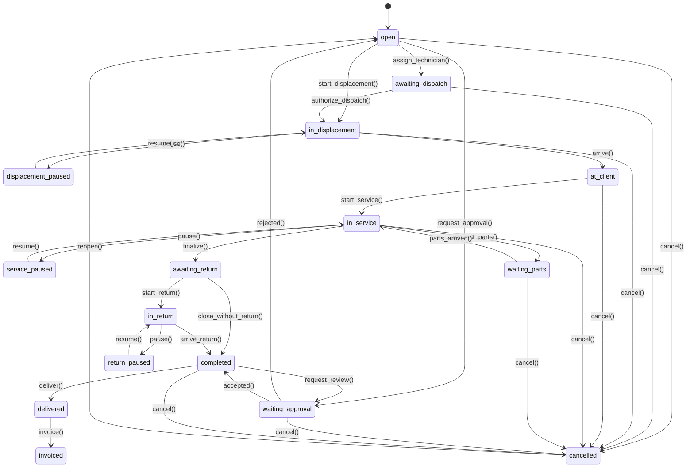
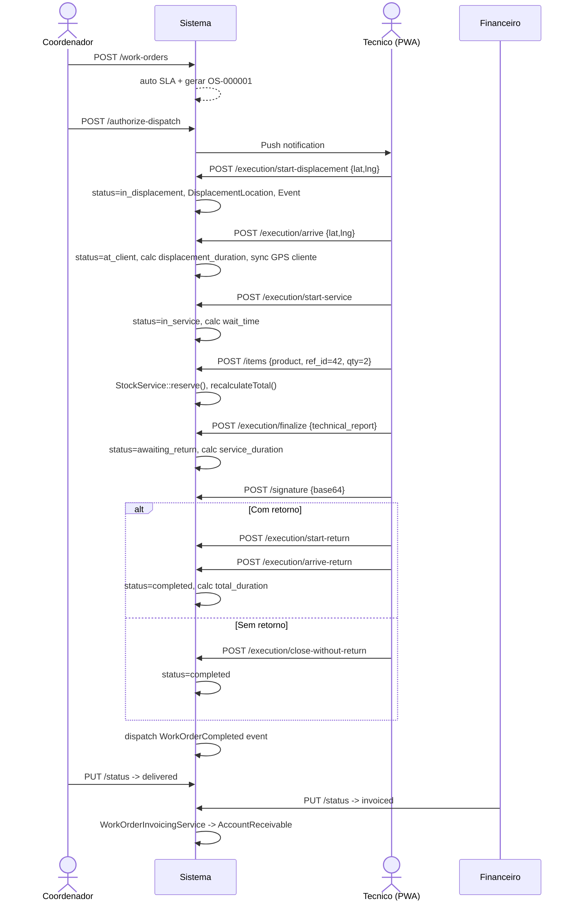

# Modulo: Ordens de Servico (Work Orders)

## 1. Visao Geral

O modulo de Ordens de Servico (OS) e o nucleo operacional do sistema, responsavel por gerenciar todo o ciclo de vida de um atendimento tecnico em campo — desde a abertura ate o faturamento. Utilizado por **coordenadores** (criacao/despacho), **tecnicos** (execucao via PWA), **administradores** (supervisao/faturamento) e **clientes** (portal).

**Responsabilidades:** Criacao de OS (manual, orcamento, chamado, contrato recorrente, CRM deal) | Despacho com rastreamento GPS | Fluxo de campo (deslocamento > chegada > servico > retorno) | Consumo de materiais com estoque automatico | Assinatura digital + checklist | SLA com multas | Faturamento com contas a receber | Hierarquia sub-OS (3 niveis) | Chat, anexos, timeline, audit trail

**Entidades:** `WorkOrder`, `WorkOrderItem`, `WorkOrderEvent`, `WorkOrderStatusHistory`, `WorkOrderSignature`, `WorkOrderAttachment`, `WorkOrderChat`, `WorkOrderChecklistResponse`, `WorkOrderDisplacementLocation`, `WorkOrderDisplacementStop`, `WorkOrderTimeLog`, `WorkOrderRating`, `WorkOrderRecurrence`, `WorkOrderTemplate`

---

## 2. Entidades (Models)

### 2.1 WorkOrder (tabela: `work_orders`)

**FKs:** tenant_id, customer_id (req), equipment_id, quote_id, service_call_id, recurring_contract_id, seller_id, driver_id, branch_id, created_by, assigned_to, parent_id (max 3 niveis), checklist_id, sla_policy_id, dispatch_authorized_by

**Campos de identidade:** os_number (string 30), number (auto OS-000001)

**Status/classificacao:** status (enum WorkOrderStatus, req), priority (`low|normal|high|urgent`, req), origin_type (`quote|service_call|recurring_contract|manual`), lead_source (`prospeccao|retorno|contato_direto|indicacao`), service_type (lookup dinamico)

**Texto:** description (req), internal_notes, technical_report, manual_justification (1000), cancellation_reason

**Assinatura legada:** signature_path, signature_signer, signature_ip, signature_at (datetime)

**Pagamento:** agreed_payment_method (50), agreed_payment_notes (500)

**Financeiro (decimal 10,2):** discount, discount_percentage (5,2), discount_amount, displacement_value, total

**GPS (float):** arrival_latitude/longitude, checkin_lat/lng, checkout_lat/lng, auto_km_calculated (decimal), displacement_distance, displacement_time, return_distance, return_time

**Tempos (int minutos):** displacement_duration_minutes, wait_time_minutes, service_duration_minutes, total_duration_minutes, return_duration_minutes

**Timestamps (datetime):** scheduled_date, received_at, started_at, completed_at, delivered_at, sla_due_at, sla_responded_at, dispatch_authorized_at, displacement_started_at, displacement_arrived_at, displacement_paused_at, return_started_at, return_arrived_at, return_paused_at, service_started_at, checkin_at, checkout_at, cancelled_at, created_at, updated_at, deleted_at (soft delete)

**Flags:** is_master (bool), is_warranty (bool)

**JSON:** tags (array), photo_checklist (array: before/during/after)

**Endereco:** address (255), city (100), state (2), zip_code (10), contact_phone (20)

**Extras:** return_destination, delivery_forecast (date)

**Relationships:** customer, creator, assignee, seller, driver, equipment, quote, serviceCall, parent, children, branch, technicians (M2M), items, statusHistory, attachments, chats, invoices, accountsPayable, accountsReceivable, signatures, events, displacementLocations, displacementStops, checklistResponses, timeLogs, ratings

**Traits:** BelongsToTenant, HasFactory, SoftDeletes, Auditable, SyncsWithAgenda

### 2.2 WorkOrderItem (tabela: `work_order_items`)

| Campo | Tipo | Descricao |
|-------|------|-----------|
| tenant_id, work_order_id | bigint FK | |
| type | string (req) | `product` ou `service` |
| reference_id | bigint FK | FK para products ou services |
| description | string (req) | Descricao do item |
| quantity | decimal(10,2) | Quantidade |
| unit_price | decimal(10,2) | Preco unitario |
| cost_price | decimal(10,2) | Auto-preenchido do Product |
| discount | decimal(10,2) | Desconto por item |
| total | decimal(10,2) | Auto: (qty * unit_price) - discount |
| warehouse_id | bigint FK | Armazem de origem |

> **[AI_RULE]** Total auto-calculado no hook `saving`. Ao criar/atualizar/deletar items, `WorkOrder.recalculateTotal()` e chamado. Items tipo `product` com `track_stock=true` disparam `StockService::reserve/returnStock()`. Armazem de tecnico gera `UsedStockItem` automaticamente.

### 2.3 Demais Entidades

| Model | Campos Chave |
|-------|-------------|
| **WorkOrderEvent** | event_type (16 tipos), user_id, latitude, longitude, metadata (json) |
| **WorkOrderSignature** | signer_name, signer_document, signer_type, signature_data (base64), signed_at, ip_address, user_agent |
| **WorkOrderStatusHistory** | from_status, to_status (enum cast), user_id, notes |
| **WorkOrderDisplacementLocation** | user_id, latitude, longitude, recorded_at |
| **WorkOrderDisplacementStop** | type (`lunch|hotel|br_stop|other`), started_at, ended_at, notes, location_lat/lng |
| **WorkOrderChat** | user_id, message, type, file_path, read_at |
| **WorkOrderAttachment** | uploaded_by, file_name, file_path, file_type, file_size, description |
| **WorkOrderTimeLog** | user_id, started_at, ended_at, duration_seconds, activity_type, description, lat/lng |
| **WorkOrderRating** | customer_id, overall_rating, quality_rating, punctuality_rating, comment, channel |
| **WorkOrderChecklistResponse** | checklist_item_id, value, notes |
| **WorkOrderRecurrence** | customer_id, service_id, name, frequency, interval, day_of_month/week, start/end_date, next_generation_date, is_active, metadata |
| **WorkOrderTemplate** | name, description, default_items (json), checklist_id, priority, created_by |

**Event types:** `displacement_started`, `displacement_paused`, `displacement_resumed`, `arrived_at_client`, `service_started`, `service_paused`, `service_resumed`, `service_completed`, `return_started`, `return_paused`, `return_resumed`, `return_arrived`, `closed_no_return`, `checkin_registered`, `checkout_registered`, `status_changed`

---

## 3. Maquina de Estados



> **[AI_RULE_CRITICAL]** Toda transicao DEVE passar por `WorkOrderStatus::canTransitionTo()`. O enum `WorkOrderStatus` e a unica fonte de verdade. Transicoes invalidas retornam HTTP 422. Status `in_progress` existe apenas para backward compat.

---

## 4. Regras de Negocio [AI_RULE]

> **[AI_RULE_CRITICAL] R1 — Tenant Isolation:** Toda query usa scope `BelongsToTenant`. Nunca filtrar tenant_id manualmente.

> **[AI_RULE_CRITICAL] R2 — Check-in GPS:** Transicao `in_displacement -> at_client` registra `arrival_latitude/longitude`, cria `WorkOrderDisplacementLocation` e sincroniza GPS com cadastro do cliente via `syncGpsToCustomer()`.

> **[AI_RULE_CRITICAL] R3 — Assinatura Digital:** `WorkOrderSignature` deve conter `signature_data` (base64), `signer_name`, `signed_at`, `ip_address`. Sem assinatura a OS pode finalizar mas nao deve ser faturada.

> **[AI_RULE] R4 — Estoque Automatico:** `WorkOrderItem` tipo `product` com `track_stock=true` dispara `StockService::reserve()` ao criar, `returnStock()` ao deletar, ajuste de diferenca ao alterar quantidade.

> **[AI_RULE] R5 — UsedStockItem:** Se warehouse e de tecnico (`Warehouse.isTechnician()`), cria `UsedStockItem` com status `pending_return`.

> **[AI_RULE] R6 — SLA Automatico:** Ao criar OS sem `sla_policy_id`, busca `SlaPolicy` ativa do tenant para a prioridade e preenche `sla_policy_id` + `sla_due_at`.
>
> **Formula de calculo SLA:**
>
> ```
> sla_due_at = HolidayService::addBusinessMinutes(created_at, resolution_time_minutes)
> ```
>
> Onde `resolution_time_minutes` vem de `SlaPolicy` ou dos defaults por prioridade:
>
> - `urgent`: 240 min (4h)
> - `high`: 480 min (8h)
> - `normal`: 1440 min (24h)
> - `low`: 2880 min (48h)
>
> **Pausa de SLA:** Quando status transiciona para `waiting_parts` ou `service_paused`, o timer de SLA e pausado. O sistema registra `sla_paused_at` e ao retomar (`parts_arrived` ou `resume_service`), calcula o tempo pausado e estende `sla_due_at` proporcionalmente:
>
> ```
> paused_minutes = diff(sla_paused_at, now)
> sla_due_at = sla_due_at + paused_minutes (apenas business minutes)
> ```
>
> **SLA breach:** Atributo computado `sla_breached = now() > sla_due_at AND status NOT IN (completed, delivered, invoiced, cancelled)`. Job agendado `CheckSlaBreach` executa a cada 15 min e envia alertas para OSs proximas do vencimento (< 1h restante).

> **[AI_RULE] R7 — Recalculo Total:** Ordem: subtotal bruto itens -> desconto por item -> subtotal liquido -> desconto global (% ou fixo, mutuamente exclusivos) -> + displacement_value -> piso zero.

> **[AI_RULE] R8 — Gate de Desconto:** Somente `os.work_order.apply_discount` pode aplicar descontos. discount_percentage > 0 zera discount fixo e vice-versa.

> **[AI_RULE] R9 — Numero Sequencial:** `nextNumber()` gera `OS-000001` com `Cache::lock` para concorrencia.

> **[AI_RULE] R10 — Sub-OS:** `parent_id` com profundidade max 3 niveis. Referencia circular validada no FormRequest.

> **[AI_RULE] R11 — Validacao Cruzada:** quote_id, service_call_id, equipment_id devem pertencer ao mesmo customer_id.

> **[AI_RULE] R12 — Calculo de Tempos:** Finalizar servico calcula `service_duration_minutes` descontando pausas. Retorno calcula `return_duration_minutes` e `total_duration_minutes`.

> **[AI_RULE_CRITICAL] R14 — Selo e Lacre Obrigatorios em OS de Calibracao/Reparo:** Transicao para status `completed` em OS de calibracao ou reparo de balancas EXIGE que pelo menos **1 selo de reparo** (`InmetroSeal` tipo `seal_reparo`) e **1 lacre** (`InmetroSeal` tipo `seal`) estejam vinculados a OS via `work_order_id`. Sem esses vinculos, a transicao e bloqueada com erro 422: "Vincule selo de reparo e lacre antes de concluir a OS." O tecnico registra o uso dos selos via `POST /api/v1/repair-seals/use` durante a execucao do servico. Cada selo/lacre exige foto obrigatoria da aplicacao. Apos o uso, selos de reparo sao automaticamente enviados ao portal PSEI do Inmetro com prazo maximo de 5 dias uteis. Ver modulo **RepairSeals** (`docs/modules/RepairSeals.md`) para detalhes completos.

> **[AI_RULE] R13 — Faturamento (WorkOrder → Invoice):**
> `WorkOrderInvoicingService` cria `AccountReceivable` com lock otimista (TOCTOU). Vencimento = `SystemSetting.default_payment_days` (padrao 30).
>
> **Fluxo completo de faturamento:**
>
> ```
> 1. OS status → delivered (coordenador confirma entrega)
>    ↓
> 2. OS status → invoiced (financeiro fatura)
>    ↓
> 3. WorkOrderObserver detecta transicao para 'invoiced'
>    ├─ WorkOrderInvoicingService::generateReceivableOnInvoice()
>    │   ├─ lockForUpdate() — previne duplicidade (TOCTOU)
>    │   ├─ Verifica se AR ja existe para work_order_id
>    │   ├─ Verifica se total > 0 e customer_id existe
>    │   ├─ Cria AccountReceivable (amount, due_date, status=pending)
>    │   └─ due_date = now() + SystemSetting.default_payment_days
>    ├─ CommissionService::calculateAndGenerate($wo, 'os_invoiced')
>    │   └─ Calcula comissoes para seller_id e assigned_to
>    └─ FiscalNoteService::generateFromWorkOrder($wo)
>        └─ Gera NF-e automatica (se configurado pelo tenant)
> ```
>
> OS com `is_warranty = true` ou `total <= 0` NAO geram AccountReceivable.
> OS faturada pode ser desfaturada via `POST /work-orders/{id}/uninvoice` (requer permissao).

> **[AI_RULE] R16 — Fluxo de Aprovacao:**
> O status `waiting_approval` e usado para revisoes de qualidade ou aprovacao gerencial:
>
> **Tipos de aprovacao:**
>
> - `request_approval` (open → waiting_approval): Tecnico solicita aprovacao do coordenador antes de prosseguir
> - `request_review` (completed → waiting_approval): Coordenador solicita revisao de qualidade pelo gerente
>
> **Quem aprova:**
>
> - Usuarios com permissao `os.work_order.change_status` E role `admin`, `coordenador` ou `gerente`
> - O tecnico que criou a OS NAO pode aprovar a propria solicitacao
>
> **Fluxo de aprovacao:**
>
> ```
> 1. Tecnico/Coordenador → POST /work-orders/{id}/approvals/request
>    ├─ Status → waiting_approval
>    ├─ Notificacao enviada ao coordenador/gerente
>    └─ AuditLog registra solicitacao
> 2. Aprovador → PUT /work-orders/{id}/status { status: "completed" } (aceitar)
>    ├─ Status → completed (ou status anterior se rejeitado)
>    └─ AuditLog registra decisao
> 3. Aprovador → PUT /work-orders/{id}/status { status: "open" } (rejeitar)
>    ├─ Status → open (OS volta para revisao)
>    └─ Notificacao ao tecnico com motivo
> ```

> **[AI_RULE] R17 — Reagendamento de OS:**
> Quando cliente ou coordenador precisa remarcar uma visita técnica:
>
> **Transição de estado:** O reagendamento NÃO altera o status da OS. A OS permanece no status atual (`open`, `awaiting_dispatch`). Os campos atualizados são:
>
> - `scheduled_date` → nova data/hora
> - `assigned_to` → mesmo técnico ou novo (se indisponível)
> - `technician_ids` → recalculado se técnico mudar
>
> **Endpoint:** `PUT /api/v1/work-orders/{id}` com `{ "scheduled_date": "2026-04-10T09:00:00" }`
>
> **Regras:**
>
> - Reagendamento só é permitido nos status: `open`, `awaiting_dispatch`, `in_displacement` (cancelar deslocamento primeiro)
> - Se status é `in_displacement`, o sistema executa `cancel_displacement()` → volta para `open`, depois aplica a nova data
> - Limite de reagendamentos: configurável por tenant via `SystemSetting.max_reschedules` (padrão: 3). Ao exceder, exige aprovação gerencial (`os.work_order.authorize_dispatch`)
> - Cada reagendamento gera `WorkOrderEvent` com `event_type='rescheduled'` contendo `{ "old_date": "...", "new_date": "...", "reason": "..." }`
> - SLA: `sla_due_at` é recalculado com base na nova `scheduled_date` se a política SLA do tenant assim exigir (`SlaPolicy.recalculate_on_reschedule = true`)
> - `AgendaService::reSync($workOrder)` é chamado para atualizar o slot do técnico no calendário
> - Notificação push é enviada ao técnico e, se origem for `service_call`, ao cliente
>
> **Permissão:** `os.work_order.update` (coordenador) ou `os.work_order.change_status` (se status mudar de `in_displacement`)

> **[AI_RULE] R14 — Soft Delete:** Ao deletar, limpa arquivos de photo_checklist do Storage.

> **[AI_RULE] R15 — Scoped Users:** Tecnicos/motoristas so veem OSs onde sao assigned_to, created_by ou na relacao technicians.

---

## 5. Cross-Domain Rules

| Dominio | Integracao |
|---------|-----------|
| **Finance** | Faturar gera `AccountReceivable` via `WorkOrderInvoicingService`. `agreed_payment_method` define forma de pagamento. |
| **Inventory** | Items tipo product disparam `StockService::reserve/returnStock()`. Armazem de tecnico gera `UsedStockItem`. |
| **Quotes** | OS criada de Quote via `quote_id`. Orcamento deve ser do mesmo cliente. `origin_type='quote'`. |
| **Service Calls** | OS de ServiceCall via `service_call_id`. `origin_type='service_call'`. |
| **Contracts** | OS gerada por `RecurringContract` via command diario. `origin_type='recurring_contract'`. |
| **Equipment** | Equipamento principal (`equipment_id`) + multiplos via pivot. Devem pertencer ao mesmo cliente. |
| **CRM** | Deals convertidos em OS via `CrmController::dealsConvertToWorkOrder()`. |
| **HR/Technicians** | Tecnicos via M2M. `TechnicianRecommendation` sugere melhor tecnico. `Schedules` vinculam ao calendario. |
| **Quality** | `WorkOrderRating` (interna) + `SatisfactionSurvey` (NPS externa). `ServiceChecklist` + `ChecklistResponse`. |
| **Agenda** | Trait `SyncsWithAgenda` sincroniza com calendario. |

---

## 6. Contratos de API (JSON)

### POST /api/v1/work-orders — Criar

```json
// Request (campos obrigatorios: customer_id, description)
{
  "customer_id": 1, "description": "Manutencao preventiva",
  "equipment_id": 5, "assigned_to": 3, "priority": "high",
  "scheduled_date": "2026-03-25T09:00:00", "quote_id": 10,
  "seller_id": 2, "driver_id": 4, "origin_type": "manual",
  "lead_source": "prospeccao", "discount_percentage": 10,
  "displacement_value": 150.00, "is_warranty": false,
  "technician_ids": [3, 7], "equipment_ids": [5, 12],
  "tags": ["urgente"], "agreed_payment_method": "pix",
  "initial_status": "open",
  "items": [
    {"type": "service", "description": "Calibracao", "quantity": 1, "unit_price": 200},
    {"type": "product", "reference_id": 42, "description": "Sensor", "quantity": 2, "unit_price": 85}
  ]
}
// Response 201: { "data": WorkOrderResource, "message": "OS criada com sucesso." }
```

### 6.1 Contratos PWA de Execução (13 endpoints)

Todos os endpoints de execução usam a rota base: `POST /api/v1/work-orders/{id}/execution/{action}` e compartilham o payload base de localização (opcional dependendo do strictness do tenant):

```json
// Payload Base (WorkOrderLocationRequest)
{
  "latitude": -23.55,
  "longitude": -46.63,
  "recorded_at": "2026-03-25T08:00:00"
}
```

**Lista de Ações e Payloads Específicos:**

1. `start-displacement`: Payload base. Muda status para `in_displacement`.
2. `pause-displacement`: Payload base + `{"reason": "string"}`. Muda para `displacement_paused`.
3. `resume-displacement`: Payload base. Muda para `in_displacement`.
4. `arrive`: Payload base. Muda para `at_client`. Registra `arrival_latitude/longitude`.
5. `start-service`: Payload base. Muda para `in_service`.
6. `pause-service`: Payload base + `{"reason": "string"}`. Muda para `service_paused`.
7. `resume-service`: Payload base. Muda para `in_service`.
8. `finalize`: Payload base + `{"technical_report": "string", "resolution_notes": "string"}`. Muda para `awaiting_return`.
9. `start-return`: Payload base. Muda para `in_return`.
10. `pause-return`: Payload base + `{"reason": "string"}`. Muda para `return_paused`.
11. `resume-return`: Payload base. Muda para `in_return`.
12. `arrive-return`: Payload base. Muda para `completed`. Encerra OS.
13. `close-without-return`: Payload base. Muda para `completed` direto de `awaiting_return`. Encera OS.

### 6.2 Anexos e Assinatura Digital (PWA)

**POST /api/v1/work-orders/{id}/attachments**

```json
// Multipart/form-data
{
  "file": "(binary)",
  "type": "photo_checklist | report | general",
  "description": "Foto do equipamento reparado"
}
```

**POST /api/v1/work-orders/{id}/signature**

```json
{
  "signer_name": "João Silva",
  "signer_document": "123.456.789-00",
  "signature_data": "data:image/png;base64,iVBORw0KGgoAAAAN...",
  "ip_address": "192.168.1.1" // Preenchido automaticamente pelo backend
}
```

### GET /api/v1/work-orders — Listar

```
Params: search, status (csv), priority, assigned_to, customer_id, recurring_contract_id,
  equipment_id, origin_type, date_from/to, scheduled_from/to, has_schedule, pending_invoice, per_page
Response: { "data": WorkOrderResource[], "meta": pagination, "status_counts": {"open":12,...} }
```

### Endpoints Completos

| Metodo | Rota | Permissao |
|--------|------|-----------|
| GET | work-orders | os.work_order.view |
| GET | work-orders/{id} | os.work_order.view |
| POST | work-orders | os.work_order.create |
| PUT | work-orders/{id} | os.work_order.update |
| DELETE | work-orders/{id} | os.work_order.delete |
| POST | work-orders/{id}/restore | os.work_order.delete |
| PUT/POST/PATCH | work-orders/{id}/status | os.work_order.change_status |
| POST | work-orders/{id}/duplicate | os.work_order.create |
| POST | work-orders/{id}/reopen | os.work_order.change_status |
| POST | work-orders/{id}/uninvoice | os.work_order.change_status |
| POST | work-orders/{id}/authorize-dispatch | os.work_order.authorize_dispatch |
| POST | work-orders/{id}/items | os.work_order.update |
| PUT | work-orders/{id}/items/{item} | os.work_order.update |
| DELETE | work-orders/{id}/items/{item} | os.work_order.update |
| POST | work-orders/{id}/attachments | os.work_order.update |
| POST | work-orders/{id}/signature | os.work_order.update |
| GET/POST | work-orders/{id}/chats | os.work_order.view/update |
| GET/POST | work-orders/{id}/checklist-responses | os.work_order.view/update |
| GET | work-orders/{id}/audit-trail | os.work_order.view |
| GET | work-orders/{id}/execution/timeline | os.work_order.view |
| GET | work-orders/{id}/displacement | os.work_order.view |
| GET | work-orders/{id}/cost-estimate | os.work_order.view |
| GET | work-orders/{id}/pdf | os.work_order.view |
| POST | work-orders/{id}/approvals/request | os.work_order.update |
| POST | work-orders/{id}/equipments | os.work_order.update |
| POST | work-orders/{id}/apply-kit/{kit} | os.work_order.update |
| POST | work-orders/{id}/execution/{action} | os.work_order.change_status |

---

## 7. Regras de Validacao (FormRequest)

### StoreWorkOrderRequest

```
customer_id:          required, exists:customers (tenant)
description:          required, string
equipment_id:         nullable, exists:equipments (tenant)
assigned_to:          nullable, exists:users (tenant)
priority:             sometimes, in:low,normal,high,urgent
scheduled_date:       nullable, date, after_or_equal:today
discount:             nullable, numeric, min:0
discount_percentage:  nullable, numeric, min:0, max:100
quote_id:             nullable, exists:quotes (tenant)
service_call_id:      nullable, exists:service_calls (tenant)
seller_id/driver_id:  nullable, exists:users (tenant)
is_warranty:          sometimes, boolean
technician_ids:       nullable, array — .*: exists:users (tenant)
equipment_ids:        nullable, array — .*: exists:equipments (tenant)
items:                array
items.*.type:         required, in:product,service
items.*.description:  required, string
items.*.quantity:     sometimes, numeric, min:0.01
items.*.unit_price:   sometimes, numeric, min:0
parent_id:            nullable, exists:work_orders (tenant), max depth 3, no circular ref
tags:                 nullable, array — .*: string, max:50
initial_status:       sometimes, in:open,awaiting_dispatch,scheduled
address/city/state:   nullable, string, max:255/100/2
```

**Cross-validation:** quote_id, service_call_id, equipment_id devem pertencer ao mesmo customer_id.

### WorkOrderLocationRequest (Execucao)

```
recorded_at: nullable, date
latitude:    nullable, numeric, between:-90,90
longitude:   nullable, numeric, between:-180,180
```

---

## 8. Permissoes por Role

| Permissao | Admin | Coord | Tecnico | Motorista | Cliente |
|-----------|:-----:|:-----:|:-------:|:---------:|:-------:|
| os.work_order.view | sim | sim | scoped | scoped | portal |
| os.work_order.create | sim | sim | - | - | - |
| os.work_order.update | sim | sim | scoped | - | - |
| os.work_order.delete | sim | sim | - | - | - |
| os.work_order.change_status | sim | sim | scoped | scoped | - |
| os.work_order.authorize_dispatch | sim | sim | - | - | - |
| os.work_order.apply_discount | sim | sim | - | - | - |
| os.work_order.export | sim | sim | - | - | - |

> **[AI_RULE]** "scoped" = so OSs onde e assigned_to, created_by ou na relacao technicians. Implementado via `WorkOrderPolicy::isScopedFieldUser()` para roles `tecnico`, `tecnico_vendedor`, `motorista`.

---

## 9. Fluxos de Sequencia (Mermaid)



---

## 10. Exemplos de Codigo

### PHP: Transicao de Status (WorkOrderExecutionController)

```php
protected function transitionStatus(WorkOrder $wo, int $userId, string $newStatus, array $extra = [], string $notes = ''): void
{
    $oldStatus = $wo->status;
    $wo->update(array_merge(['status' => $newStatus], $extra));
    WorkOrderStatusHistory::create([
        'tenant_id' => $wo->tenant_id, 'work_order_id' => $wo->id,
        'user_id' => $userId, 'from_status' => $oldStatus,
        'to_status' => $newStatus, 'notes' => $notes,
    ]);
}
```

### PHP: Faturamento (WorkOrderInvoicingService)

```php
public function generateReceivableOnInvoice(WorkOrder $wo): ?AccountReceivable
{
    if (!$wo->customer_id || bccomp((string)($wo->total ?? 0), '0', 2) <= 0) return null;
    return DB::transaction(function () use ($wo) {
        WorkOrder::lockForUpdate()->find($wo->id); // TOCTOU prevention
        if (AccountReceivable::where('work_order_id', $wo->id)->exists()) return null;
        $days = (int)(SystemSetting::withoutGlobalScopes()->where('tenant_id', $wo->tenant_id)
            ->where('key', 'default_payment_days')->value('value') ?? 30);
        return AccountReceivable::create([
            'tenant_id' => $wo->tenant_id, 'customer_id' => $wo->customer_id,
            'work_order_id' => $wo->id, 'amount' => $wo->total,
            'due_date' => now()->addDays($days), 'status' => AccountReceivable::STATUS_PENDING,
        ]);
    });
}
```

### TypeScript: Interface + Hook

```typescript
type WorkOrderStatus = 'open' | 'awaiting_dispatch' | 'in_displacement' | 'displacement_paused'
  | 'at_client' | 'in_service' | 'service_paused' | 'awaiting_return' | 'in_return'
  | 'return_paused' | 'waiting_parts' | 'waiting_approval' | 'completed' | 'delivered'
  | 'invoiced' | 'cancelled';

interface WorkOrder {
  id: number; os_number: string; business_number: string;
  customer_id: number; status: WorkOrderStatus;
  priority: 'low' | 'normal' | 'high' | 'urgent';
  description: string; total: number;
  scheduled_date: string | null; assigned_to: number | null;
}

const useWorkOrders = (filters?: Filters) => useQuery({
  queryKey: ['work-orders', filters],
  queryFn: () => api.get('/work-orders', { params: filters }),
});
```

---

## 11. Cenários BDD

### Cenário 1: Criação e numeração automática

```gherkin
Funcionalidade: Criação de Ordem de Serviço

  Cenário: Criar OS manual com numeração automática
    Dado que o coordenador está autenticado no tenant 1
    E que existe Customer id=1 e Equipment id=5
    Quando faz POST /api/v1/work-orders com customer_id=1, description="Manutenção preventiva", equipment_id=5, priority="high"
    Então recebe status 201
    E OS criada com status="open" e número="OS-000001"
    E SLA é auto-atribuída baseada na priority="high"
    E AgendaItem é sincronizado via SyncsWithAgenda

  Cenário: Criar OS com items de produto reserva estoque
    Dado que existe Product id=42 com stock=10 no warehouse do técnico
    Quando OS é criada com item {type: "product", reference_id: 42, quantity: 2, unit_price: 85}
    Então StockService.reserve(42, 2) é chamado
    E stock disponível do Product 42 passa para 8
    E UsedStockItem é criado com status="pending_return"
    E total da OS inclui 2 × R$ 85.00 = R$ 170.00
```

### Cenário 2: Despacho com autorização

```gherkin
Funcionalidade: Despacho de OS

  Cenário: Autorizar despacho
    Dado que OS id=1 tem status="open" e assigned_to=3
    Quando coordenador faz POST /api/v1/work-orders/1/authorize-dispatch
    Então status muda para "awaiting_dispatch"
    E dispatch_authorized_by e dispatch_authorized_at são preenchidos
    E push notification é enviada ao técnico id=3
```

### Cenário 3: Fluxo de campo completo (PWA)

```gherkin
Funcionalidade: Execução em Campo via PWA

  Cenário: Deslocamento → Chegada → Serviço → Finalizar
    Dado que OS id=1 tem status="open" ou "awaiting_dispatch"
    Quando técnico faz POST /execution/start-displacement com latitude=-23.55, longitude=-46.63
    Então status muda para "in_displacement"
    E WorkOrderDisplacementLocation é criado com as coordenadas
    E WorkOrderEvent é registrado com event_type="displacement_started"

    Quando técnico faz POST /execution/arrive com latitude=-23.56, longitude=-46.64
    Então status muda para "at_client"
    E displacement_duration_minutes é calculado (descontando pausas)
    E arrival_latitude/longitude são gravados
    E GPS do cliente é sincronizado via syncGpsToCustomer()

    Quando técnico faz POST /execution/start-service
    Então status muda para "in_service"
    E wait_time_minutes é calculado (tempo entre arrive e start_service)

    Quando técnico faz POST /execution/finalize com technical_report="Sensor substituído"
    Então status muda para "awaiting_return"
    E service_duration_minutes é calculado
    E completed_at é preenchido

  Cenário: Retorno ao escritório
    Dado que OS id=1 tem status="awaiting_return"
    Quando técnico faz POST /execution/start-return
    Então status muda para "in_return"
    Quando técnico faz POST /execution/arrive-return
    Então status muda para "completed"
    E total_duration_minutes é calculado
    E WorkOrderCompleted event é disparado

  Cenário: Fechar sem retorno
    Dado que OS id=1 tem status="awaiting_return"
    Quando técnico faz POST /execution/close-without-return
    Então status muda para "completed"
    E total_duration_minutes é calculado sem retorno
```

### Cenário 4: Consumo de material com estoque

```gherkin
Funcionalidade: Consumo de Material em OS

  Cenário: Adicionar item produto com reserva de estoque
    Dado que OS id=1 está em status "in_service"
    E que Product id=42 tem stock=10 no warehouse_id=5 (técnico)
    Quando técnico faz POST /api/v1/work-orders/1/items com type="product", reference_id=42, quantity=2, unit_price=85
    Então WorkOrderItem é criado com total = 2 × 85 - 0 = R$ 170.00
    E StockService.reserve(produto=42, qty=2, warehouse=5) é chamado
    E UsedStockItem é criado com status="pending_return" (warehouse é de técnico)
    E WorkOrder.recalculateTotal() atualiza o total da OS

  Cenário: Remover item devolve estoque
    Dado que WorkOrderItem id=10 é product com quantity=2
    Quando técnico faz DELETE /api/v1/work-orders/1/items/10
    Então StockService.returnStock(produto=42, qty=2) é chamado
    E stock disponível volta para valor anterior + 2
    E WorkOrder.recalculateTotal() recalcula
```

### Cenário 5: Faturamento com lock anti-duplicidade

```gherkin
Funcionalidade: Faturamento de OS

  Cenário: Faturar OS gerando conta a receber
    Dado que OS id=1 tem status="delivered" e total=R$ 1500.00
    E que não existe AccountReceivable para work_order_id=1
    Quando status muda para "invoiced"
    Então WorkOrderInvoicingService.generateReceivableOnInvoice() é chamado
    E lockForUpdate() previne TOCTOU
    E AccountReceivable é criado com amount=1500.00
    E due_date = now + SystemSetting.default_payment_days (padrão 30)

  Cenário: Faturamento de OS warranty não gera AR
    Dado que OS id=2 tem is_warranty=true e total=0
    Quando status muda para "invoiced"
    Então nenhum AccountReceivable é criado (total <= 0)

  Cenário: Faturamento duplicado é bloqueado
    Dado que OS id=1 já tem AccountReceivable criado
    Quando tentativa de faturamento duplicado ocorre
    Então retorna null (verificação AR.exists() dentro do lock)
```

### Cenário 6: Cancelar e reabrir

```gherkin
Funcionalidade: Cancelamento e Reabertura

  Cenário: Cancelar OS devolve estoque e libera agenda
    Dado que OS id=1 tem status="in_service" com 3 items produto
    Quando coordenador cancela com cancellation_reason="Cliente desistiu"
    Então status muda para "cancelled"
    E StockService.returnStock() é chamado para os 3 items
    E AgendaService.releaseSlot() libera slot do técnico
    E AR pendente (se existir) é cancelado

  Cenário: Reabrir OS cancelada
    Dado que OS id=1 tem status="cancelled"
    Quando coordenador faz POST /api/v1/work-orders/1/reopen
    Então status muda para "open"
    E WorkOrderStatusHistory registra from="cancelled" to="open"
```

### Cenário 7: Desconto e recálculo de total

```gherkin
Funcionalidade: Desconto em OS

  Cenário: Desconto percentual recalcula total
    Dado que OS id=1 tem subtotal bruto de itens = R$ 1000.00 e displacement_value = R$ 150.00
    Quando usuario com permissão "os.work_order.apply_discount" aplica discount_percentage=10
    Então subtotal líquido = R$ 1000.00 - 10% = R$ 900.00
    E total = R$ 900.00 + R$ 150.00 = R$ 1050.00
    E discount_amount é zerado (mutuamente exclusivo)

  Cenário: Sem permissão de desconto
    Dado que usuario tem role "tecnico" sem permissão "os.work_order.apply_discount"
    Quando tenta aplicar desconto
    Então recebe status 403
```

### Cenário 8: Transição inválida rejeitada

```gherkin
Funcionalidade: Máquina de Estados Estrita

  Cenário: Transição inválida retorna 422
    Dado que OS id=1 tem status="open"
    Quando tenta mudar diretamente para status="completed"
    Então recebe status 422
    E a mensagem contém "transição de open para completed não é permitida"
    E WorkOrderStatus.canTransitionTo() retorna false

  Cenário: Técnico scoped só vê suas OSs
    Dado que tecnico id=3 é assigned_to nas OSs [1, 2, 3]
    E que existem 10 OSs no tenant
    Quando tecnico faz GET /api/v1/work-orders
    Então recebe apenas 3 OSs (filtro scoped via WorkOrderPolicy)
```

---

## Edge Cases e Tratamento de Erros

> **[AI_RULE_CRITICAL]** Todo cenário abaixo DEVE ser implementado. A IA não pode ignorar ou postergar nenhum tratamento.

| Cenário | Tratamento | Código Esperado |
|---------|------------|-----------------|
| Transição de status inválida (ex: `open` direto para `completed`) | `WorkOrderStatus::canTransitionTo()` retorna false. Controller retorna 422 com mapa de transições permitidas | `422 Unprocessable` |
| Faturamento duplicado (race condition TOCTOU) | `WorkOrderInvoicingService` usa `lockForUpdate()` + verificação `AccountReceivable::where('work_order_id')->exists()` dentro de `DB::transaction` | `null` (idempotente) |
| Estoque insuficiente ao adicionar item produto (`StockService::reserve` falha) | Controller retorna 422 com saldo disponível atual. Item NÃO é criado. Nenhuma reserva parcial — tudo ou nada | `422 Unprocessable` |
| GPS inválido ou fora do range (-90/90, -180/180) no PWA | `WorkOrderLocationRequest` valida `between:-90,90` e `between:-180,180`. Campos nullable — sistema aceita sem GPS mas registra flag `missing_gps` | `422 Unprocessable` (se fora do range) |
| `parent_id` causa referência circular (A → B → A) ou profundidade > 3 | `StoreWorkOrderRequest` valida `max depth 3` e `no circular ref` via query recursiva. Rejeita com mensagem descritiva | `422 Unprocessable` |
| SLA expiou (`sla_due_at < now()`) e OS ainda não completada | Sistema NÃO bloqueia transições. Registra `sla_breached = true` e alerta coordenador via notificação. `WorkOrderObserver` recalcula SLA se priority mudar | `200 OK` (com alerta) |
| Cancelamento de OS já faturada (`invoiced`) | Controller rejeita cancelamento direto. Fluxo correto: `uninvoice()` → cancela AR → status volta para `delivered` → então pode cancelar | `422 Unprocessable` |
| Assinatura digital com base64 corrompido ou tamanho > 5MB | `StoreWorkOrderSignatureRequest` valida formato `data:image/png;base64,...` e tamanho max. Backend salva hash SHA-256 para verificação de integridade | `422 Unprocessable` |
| Técnico tenta `arrive-return` sem ter feito `start-return` (deslocamento de retorno não iniciado) | State machine rejeita transição `awaiting_return → completed` sem passar por `in_return`. Exceção: `close-without-return` é a rota correta para pular retorno | `422 Unprocessable` |
| Reagendamento excede limite (`SystemSetting.max_reschedules`, padrão 3) | Controller exige aprovação gerencial (`os.work_order.authorize_dispatch`). Sem aprovação, retorna 403 com contagem de reagendamentos | `403 Forbidden` |
| Check-in duplicado (OS já tem checkin registrado) | `WorkOrderFieldController` verifica existência de `WorkOrderEvent(event_type='checkin_registered')`. Retorna 422 se já existe | `422 Unprocessable` |
| Checkout sem checkin prévio | Controller valida que existe `checkin_registered` antes de permitir `checkout_registered`. Retorna 422 com mensagem clara | `422 Unprocessable` |

---

## 12. Checklist de Implementacao

### Backend

- [ ] Models: WorkOrder (fillable, casts, relationships, traits), WorkOrderItem (hooks estoque), WorkOrderEvent, WorkOrderSignature, WorkOrderStatusHistory, WorkOrderChat, WorkOrderAttachment, WorkOrderChecklistResponse, WorkOrderTimeLog, WorkOrderRating, WorkOrderRecurrence, WorkOrderTemplate, WorkOrderDisplacementLocation, WorkOrderDisplacementStop
- [ ] Enum `WorkOrderStatus` com labels, colors, allowedTransitions, isActive, isCompleted
- [ ] `WorkOrderController` — CRUD + items + attachments + signature + status + export/import
- [ ] `WorkOrderExecutionController` — 13 endpoints de fluxo de campo
- [ ] `WorkOrderDisplacementController`, `WorkOrderApprovalController`, `WorkOrderChatController`
- [ ] `WorkOrderInvoicingService` — AccountReceivable com lock TOCTOU
- [ ] `StoreWorkOrderRequest` + `UpdateWorkOrderRequest` — validacao completa + cross-validation
- [ ] `WorkOrderLocationRequest`, `FinalizeWorkOrderRequest`, `PauseDisplacementRequest`, etc.
- [ ] `WorkOrderPolicy` — permissoes com scoped field users
- [ ] `WorkOrderResource` — serializacao API
- [ ] Routes em `routes/api/work-orders.php` (32+ rotas)
- [ ] Events: WorkOrderStarted, WorkOrderCompleted, WorkOrderInvoiced, WorkOrderCancelled
- [ ] Commands: `app:generate-recurring-work-orders` (diario), `work-orders:check-unbilled`
- [ ] Migrations para 14 tabelas + pivot work_order_equipment + work_order_user (technicians)

### Frontend

- [ ] Listagem com filtros + quick stats por status
- [ ] Formulario criacao/edicao (cliente, equipamento, tecnico, items)
- [ ] Detalhe com tabs: Info, Items, Timeline, Chat, Anexos, Checklist
- [ ] PWA tecnico: botoes de fluxo com GPS + assinatura digital (canvas)
- [ ] Dashboard OS com graficos
- [ ] Portal do cliente (acompanhamento + assinatura)

### Testes

- [ ] Feature: CRUD OS, items, status transitions, fluxo completo execucao (13 endpoints)
- [ ] Unit: recalculo total, calculo tempos, WorkOrderInvoicingService, StockService integracao
- [ ] Policy: scoped field users, permissoes por role

---

## 13. Observers `[AI_RULE]`

> **[AI_RULE]** O WorkOrderObserver propaga eventos de OS para 4 módulos dependentes. A ordem de execução das ações é determinística: Lab → Finance → Agenda → Inventory. Falhas em um módulo NÃO impedem propagação para os seguintes (fire-and-forget com log).

### 13.1 WorkOrderObserver — `updated` (status → `completed`)

| Ação | Módulo Destino | Dados Propagados | Tratamento de Falha |
| --- | --- | --- | --- |
| Atualizar status da calibração vinculada (`EquipmentCalibration.status = 'service_completed'`) | Lab | `work_order_id`, `equipment_id`, `completed_at` | Log `lab.calibration_sync_failed` + `SystemAlert` para gestor lab. OS continua como `completed`. |
| Gerar fatura via `WorkOrderInvoicingService::generateReceivableOnInvoice()` | Finance | `work_order_id`, `customer_id`, `total`, `is_warranty` | Log `finance.invoicing_failed`. OS permanece `completed` sem AR. Retry via command `work-orders:check-unbilled`. |
| Liberar slot na agenda via `AgendaService::releaseSlot($wo)` | Agenda | `work_order_id`, `assigned_to`, `scheduled_date` | Log `agenda.slot_release_failed`. Slot permanece ocupado (limpeza manual ou via cron). |
| Baixar peças reservadas via `StockService::deduct()` para items `product` | Inventory | `work_order_id`, `items[]`, `warehouse_id` | Log `inventory.stock_deduction_failed`. Reserva mantida. Job `ReconcileStockReservationsJob` corrige inconsistências diariamente. |

### 13.2 WorkOrderObserver — `updated` (status → `cancelled`)

| Ação | Módulo Destino | Dados Propagados | Tratamento de Falha |
| --- | --- | --- | --- |
| Devolver peças reservadas via `StockService::returnStock()` | Inventory | `work_order_id`, `items[]`, `warehouse_id` | Log + Job async de reconciliação. |
| Liberar slot na agenda | Agenda | `work_order_id`, `assigned_to`, `scheduled_date` | Log + limpeza via cron. |
| Cancelar AR pendente (se existir) | Finance | `work_order_id`, `account_receivable_id` | Log. AR permanece `pending` se falhar. |

### 13.3 WorkOrderObserver — `updated` (status → `invoiced`)

| Ação | Módulo Destino | Dados Propagados | Tratamento de Falha |
| --- | --- | --- | --- |
| Calcular comissões via `CommissionService::calculateAndGenerate($wo, 'os_invoiced')` | Finance (Commission) | `work_order_id`, `assigned_to`, `seller_id`, `total`, `items[]` | Log `commission.calculation_failed`. Job async retry. |
| Gerar NF-e via `FiscalNoteService::generateFromWorkOrder($wo)` | Fiscal | `work_order_id`, `invoice_id`, `customer_id`, `total` | Log `fiscal.nfe_auto_generation_failed`. NF-e pendente para geração manual. |

---

## Operacoes de Campo (Field Operations)

> **[AI_RULE]** Check-in e check-out requerem permissao `os.work_order.change_status`. Tecnicos so podem operar em OS atribuidas a eles, exceto admins/gerentes. Check-out calcula distancia automatica via Haversine.

### Entidades Adicionais

#### `WorkOrderEvent`

Evento geolocalizado na timeline da OS.

| Campo | Tipo | Descricao |
|---|---|---|
| `tenant_id` | bigint | Tenant |
| `work_order_id` | bigint FK | OS associada |
| `event_type` | string | Tipo: `checkin_registered`, `checkout_registered` |
| `user_id` | bigint FK | Usuario que gerou |
| `latitude` | decimal | Latitude GPS |
| `longitude` | decimal | Longitude GPS |
| `metadata` | json | Dados extras (ex: `auto_km`) |

#### `WorkOrderChat`

Mensagem no chat da OS (inclui mensagens de sistema).

| Campo | Tipo | Descricao |
|---|---|---|
| `tenant_id` | bigint | Tenant |
| `work_order_id` | bigint FK | OS associada |
| `user_id` | bigint FK | Usuario autor |
| `message` | text | Conteudo da mensagem |
| `type` | string | `user`, `system` |

#### `SatisfactionSurvey`

Pesquisa de satisfacao NPS pos-atendimento.

| Campo | Tipo | Descricao |
|---|---|---|
| `tenant_id` | bigint | Tenant |
| `work_order_id` | bigint FK | OS avaliada |
| `nps_score` | integer | Score NPS (0-10) |
| `service_rating` | decimal | Avaliacao do servico |
| `created_at` | datetime | Data da resposta |

### Endpoints — Field Operations

| Metodo | Rota | Controller | Descricao |
|---|---|---|---|
| `POST` | `/api/v1/work-orders/{workOrder}/checkin` | `WorkOrderFieldController@checkinWorkOrder` | Check-in geolocalizado (lat/lng). Rejeita se OS ja tem checkin ou esta encerrada |
| `POST` | `/api/v1/work-orders/{workOrder}/checkout` | `WorkOrderFieldController@checkoutWorkOrder` | Check-out geolocalizado. Calcula distancia (Haversine) automaticamente. Requer checkin previo |
| `GET` | `/api/v1/equipment-qr/{token}` | `WorkOrderFieldController@equipmentByQr` | Consulta publica de equipamento via QR code (retorna dados + ultima calibracao) |
| `POST` | `/api/v1/equipment/{equipment}/generate-qr` | `WorkOrderFieldController@generateEquipmentQr` | Gerar QR token para equipamento (cria se nao existir) |
| `GET` | `/api/v1/work-orders/nps-dashboard` | `WorkOrderFieldController@dashboardNps` | Dashboard NPS: score, promoters, detractors, media, total (ultimos 3 meses) |

### Regras de Check-in/Check-out

1. **Autorizacao em 2 niveis**:
   - Permissao `os.work_order.change_status` obrigatoria
   - Admins/Gerentes/SuperAdmins podem operar em qualquer OS
   - Tecnicos so podem operar em OS atribuidas a eles (`isTechnicianAuthorized`)

2. **Validacoes de estado**:
   - Check-in rejeitado se ja registrado (`422`)
   - Check-in rejeitado se OS em status final (`completed`, `delivered`, `invoiced`, `cancelled`)
   - Check-out requer check-in previo (`422`)
   - Check-out rejeitado se ja registrado (`422`)

3. **Efeitos colaterais** (dentro de DB transaction):
   - Cria `WorkOrderEvent` com tipo e geolocalizacao
   - Cria `WorkOrderChat` de sistema com mensagem automatica
   - Registra `AuditLog` com old/new values
   - Check-out calcula `auto_km_calculated` via formula Haversine

4. **QR Code publico**:
   - `equipmentByQr` nao requer autenticacao (acesso publico via token)
   - Retorna dados do equipamento, cliente, tenant e ultima calibracao
   - Token gerado com `Str::random(48)`

---

## Fluxos Relacionados

| Fluxo | Descrição |
|-------|-----------|
| [Ciclo Comercial](file:///c:/PROJETOS/sistema/docs/fluxos/CICLO-COMERCIAL.md) | Processo documentado em `docs/fluxos/CICLO-COMERCIAL.md` |
| [Garantia](file:///c:/PROJETOS/sistema/docs/fluxos/GARANTIA.md) | Processo documentado em `docs/fluxos/GARANTIA.md` |
| [Operação Diária](file:///c:/PROJETOS/sistema/docs/fluxos/OPERACAO-DIARIA.md) | Processo documentado em `docs/fluxos/OPERACAO-DIARIA.md` |
| [Portal do Cliente](file:///c:/PROJETOS/sistema/docs/fluxos/PORTAL-CLIENTE.md) | Processo documentado em `docs/fluxos/PORTAL-CLIENTE.md` |
| [Técnico em Campo](file:///c:/PROJETOS/sistema/docs/fluxos/TECNICO-EM-CAMPO.md) | Processo documentado em `docs/fluxos/TECNICO-EM-CAMPO.md` |

---

## Inventario Completo do Codigo

> **[AI_RULE]** Secao gerada a partir do codigo-fonte real. Toda referencia abaixo corresponde a arquivo existente no repositorio.

### Controllers (8 — namespace `App\Http\Controllers\Api\V1\Os`)

| Controller | Arquivo | Metodos Publicos |
|------------|---------|-----------------|
| **WorkOrderController** | `Os/WorkOrderController.php` | `index`, `store`, `show`, `update`, `destroy`, `restore`, `uninvoice`, `updateStatus`, `storeItem`, `updateItem`, `destroyItem`, `metadata`, `attachments`, `items`, `comments`, `storeComment`, `photos`, `statusHistoryAlias`, `uploadChecklistPhoto`, `storeAttachment`, `destroyAttachment`, `storeSignature`, `attachEquipment`, `detachEquipment`, `duplicate`, `exportCsv`, `importCsv`, `importCsvTemplate`, `dashboardStats`, `reopen`, `authorizeDispatch`, `auditTrail`, `satisfaction`, `costEstimate`, `downloadPdf` |
| **WorkOrderExecutionController** | `Os/WorkOrderExecutionController.php` | `startDisplacement`, `pauseDisplacement`, `resumeDisplacement`, `arrive`, `startService`, `pauseService`, `resumeService`, `finalize`, `startReturn`, `pauseReturn`, `resumeReturn`, `arriveReturn`, `closeWithoutReturn`, `timeline` |
| **WorkOrderApprovalController** | `Os/WorkOrderApprovalController.php` | `index`, `request`, `respond` |
| **WorkOrderChatController** | `Os/WorkOrderChatController.php` | `index`, `store`, `markAsRead` |
| **WorkOrderDisplacementController** | `Os/WorkOrderDisplacementController.php` | `index`, `start`, `arrive`, `recordLocation`, `addStop`, `endStop` |
| **WorkOrderTemplateController** | `Os/WorkOrderTemplateController.php` | `index`, `store`, `show`, `update`, `destroy` |
| **PartsKitController** | `Os/PartsKitController.php` | `index`, `show`, `store`, `update`, `destroy`, `applyToWorkOrder` |
| **RecurringContractController** | `Os/RecurringContractController.php` | `index`, `show`, `store`, `update`, `destroy`, `generate` |

### Observer — `WorkOrderObserver`

**Arquivo:** `backend/app/Observers/WorkOrderObserver.php`

| Metodo | Descricao |
|--------|-----------|
| `creating()` | Aplica SLA Policy automaticamente se `sla_policy_id` estiver definido |
| `updating()` | Re-aplica SLA se `sla_policy_id` ou `priority` mudou; rastreia `sla_responded_at` (primeiro tempo de resposta) |
| `updated()` | Dispara `handleAutoClockFromOS()` e `handleAutoCommission()` quando status muda |
| `handleAutoClockFromOS()` | Registra ponto automatico (TimeClockEntry) baseado em transicoes de status da OS |
| `handleAutoCommission()` | Calcula comissoes via `CommissionService` quando OS atinge status de trigger |
| `applySlaPolicy()` | Calcula `sla_due_at` baseado na SlaPolicy (horas uteis, feriados via HolidayService) |

### Events (5 — namespace `App\Events`)

| Evento | Propriedades | Descricao |
|--------|-------------|-----------|
| `WorkOrderStarted` | `workOrder`, `user`, `fromStatus` | Disparado quando OS inicia execucao |
| `WorkOrderCompleted` | `workOrder`, `user`, `fromStatus` | Disparado quando OS e concluida |
| `WorkOrderCancelled` | `workOrder`, `user`, `reason`, `fromStatus` | Disparado quando OS e cancelada |
| `WorkOrderInvoiced` | `workOrder`, `user`, `fromStatus` | Disparado quando OS e faturada |
| `WorkOrderStatusChanged` | `workOrder`, `user`, `fromStatus`, `toStatus` | Disparado em qualquer transicao de status |

### Listeners (8 — namespace `App\Listeners`)

| Listener | Evento(s) | Queue | Descricao |
|----------|-----------|-------|-----------|
| `HandleWorkOrderCancellation` | `WorkOrderCancelled` | ShouldQueue (3 tries, backoff 10/60/300s) | Reverte estoque, cancela invoices/contas a receber, reverte comissoes, notifica usuario |
| `HandleWorkOrderCompletion` | `WorkOrderCompleted` | ShouldQueue | Processa conclusao: calcula tempos, atualiza metricas |
| `HandleWorkOrderInvoicing` | `WorkOrderInvoiced` | ShouldQueue | Gera contas a receber, processa comissoes de faturamento |
| `HandleWorkOrderStatusChanged` | `WorkOrderStatusChanged` | ShouldQueue | Logica generica de transicao de status, notificacoes |
| `LogWorkOrderStartActivity` | `WorkOrderStarted` | — | Registra atividade de inicio na timeline |
| `CreateAgendaItemOnWorkOrder` | Criacao de OS | — | Sincroniza OS com a Agenda Central |
| `CreateWarrantyTrackingOnWorkOrderInvoiced` | `WorkOrderInvoiced` | ShouldQueue | Cria registros de garantia para itens (pecas e servicos) com base nos dias de garantia |
| `ReleaseWorkOrderOnFiscalNoteAuthorized` | `FiscalNoteAuthorized` | — | Libera OS quando nota fiscal e autorizada |

### Services Relacionados

| Service | Arquivo | Metodos Publicos |
|---------|---------|-----------------|
| `WorkOrderInvoicingService` | `Services/WorkOrderInvoicingService.php` | `generateReceivableOnInvoice()` |
| `CommissionService` | `Services/CommissionService.php` | `calculateAndGenerate()`, `calculateAndGenerateAnyTrigger()`, `simulate()`, `releaseByPayment()`, `reverseByPayment()` |

### Models (14 — namespace `App\Models`)

| Model | Descricao |
|-------|-----------|
| `WorkOrder` | Entidade principal da OS |
| `WorkOrderItem` | Itens (produto/servico) da OS |
| `WorkOrderEvent` | Eventos de timeline (16 tipos) |
| `WorkOrderStatusHistory` | Historico de transicoes de status |
| `WorkOrderSignature` | Assinaturas digitais |
| `WorkOrderAttachment` | Anexos/arquivos |
| `WorkOrderChat` | Mensagens de chat |
| `WorkOrderChecklistResponse` | Respostas de checklist |
| `WorkOrderDisplacementLocation` | Rastreamento GPS de deslocamento |
| `WorkOrderDisplacementStop` | Paradas durante deslocamento |
| `WorkOrderTimeLog` | Log de tempo por atividade |
| `WorkOrderRating` | Avaliacoes do cliente |
| `WorkOrderRecurrence` | Regras de recorrencia automatica |
| `WorkOrderTemplate` | Templates reutilizaveis |

### FormRequests (42 — namespace `App\Http\Requests\Os`)

| FormRequest | Endpoint |
|-------------|----------|
| `AddDisplacementStopRequest` | Adicionar parada no deslocamento |
| `ArriveDisplacementRequest` | Registrar chegada no deslocamento |
| `AttachWorkOrderEquipmentRequest` | Vincular equipamento a OS |
| `AuthorizeDispatchRequest` | Autorizar despacho da OS |
| `CloseWithoutReturnRequest` | Fechar OS sem retorno |
| `DuplicateWorkOrderRequest` | Duplicar OS |
| `ExportWorkOrderCsvRequest` | Exportar CSV de OS |
| `FinalizeWorkOrderRequest` | Finalizar servico da OS |
| `ImportWorkOrderCsvRequest` | Importar CSV de OS |
| `IndexWorkOrderSignatureRequest` | Listar assinaturas |
| `IndexWorkOrderTimeLogRequest` | Listar logs de tempo |
| `PauseDisplacementRequest` | Pausar deslocamento |
| `PauseServiceRequest` | Pausar servico |
| `RecordDisplacementLocationRequest` | Registrar localizacao GPS |
| `ReopenWorkOrderRequest` | Reabrir OS |
| `RequestWorkOrderApprovalRequest` | Solicitar aprovacao |
| `RespondWorkOrderApprovalRequest` | Responder aprovacao |
| `SendWorkOrderChatMessageRequest` | Enviar mensagem no chat |
| `StartDisplacementRequest` | Iniciar deslocamento |
| `StartReturnRequest` | Iniciar retorno |
| `StartWorkOrderTimeLogRequest` | Iniciar log de tempo |
| `StopWorkOrderTimeLogRequest` | Parar log de tempo |
| `StoreExpressWorkOrderRequest` | Criar OS expressa |
| `StorePartsKitRequest` | Criar kit de pecas |
| `StoreRecurringContractRequest` | Criar contrato recorrente |
| `StoreServiceChecklistRequest` | Criar checklist de servico |
| `StoreSlaPolicyRequest` | Criar politica de SLA |
| `StoreWorkOrderAttachmentRequest` | Enviar anexo |
| `StoreWorkOrderChecklistResponseRequest` | Salvar resposta de checklist |
| `StoreWorkOrderCommentRequest` | Adicionar comentario |
| `StoreWorkOrderItemRequest` | Adicionar item a OS |
| `StoreWorkOrderSignatureRequest` | Registrar assinatura |
| `StoreWorkOrderTemplateRequest` | Criar template de OS |
| `UpdatePartsKitRequest` | Atualizar kit de pecas |
| `UpdateRecurringContractRequest` | Atualizar contrato recorrente |
| `UpdateServiceChecklistRequest` | Atualizar checklist de servico |
| `UpdateSlaPolicyRequest` | Atualizar politica de SLA |
| `UpdateWorkOrderItemRequest` | Atualizar item da OS |
| `UpdateWorkOrderStatusRequest` | Atualizar status da OS |
| `UpdateWorkOrderTemplateRequest` | Atualizar template |
| `UploadChecklistPhotoRequest` | Upload de foto de checklist |
| `WorkOrderLocationRequest` | Registrar localizacao (usado em arrive/startDisplacement) |

---

## Integração OS ↔ Certificado de Calibração (ISO 17025 + ISO 9001)

> **Referência completa:** [Fluxo CERTIFICADO-CALIBRACAO.md](../fluxos/CERTIFICADO-CALIBRACAO.md)
> **Gap Analysis:** [GAP-ANALYSIS-ISO-17025-9001.md](../auditoria/GAP-ANALYSIS-ISO-17025-9001.md)

### Fluxo Integrado

```
OS (type: calibration) → Checklist de Recebimento → Wizard de Calibração → Certificado → Aprovação → Faturamento
```

### Vínculo Técnico

- FK `work_order_id` no `EquipmentCalibration` conecta certificado à OS
- Wizard auto-preenche dados do cliente e equipamento a partir da OS
- Status da OS atualiza automaticamente conforme progresso do certificado

### Novos Status da OS (tipo calibração)

| Status | Trigger | Descrição |
|--------|---------|-----------|
| `calibration_in_progress` | Wizard Step 1 aprovado | Técnico iniciou calibração |
| `calibration_complete` | Step 9 completo | Leituras finalizadas, pendente aprovação |
| `certificate_issued` | Dual sign-off completo | Certificado PDF gerado e emitido |

### Checklist de Recebimento (ISO 17025 §7.4)

OS do tipo calibração DEVE ter checklist obrigatório de recebimento:
- Equipamento identificado? (serial, tag)
- Condição visual + foto
- Acessórios recebidos
- Danos visíveis? + foto
- Equipamento funcional?
- Prazo acordado

### Eventos

| Evento | Listener | Ação |
|--------|----------|------|
| `CalibrationWizardStarted` | `LinkCalibrationToWorkOrder` | Vincula `work_order_id` |
| `CertificateIssued` | `CompleteWorkOrder` | OS → `completed` |
| `CertificateIssued` | `CreateAccountReceivable` | Gera fatura |
| `WorkOrderCompleted` | `SendSatisfactionSurvey` | Pesquisa NPS 24h depois |
