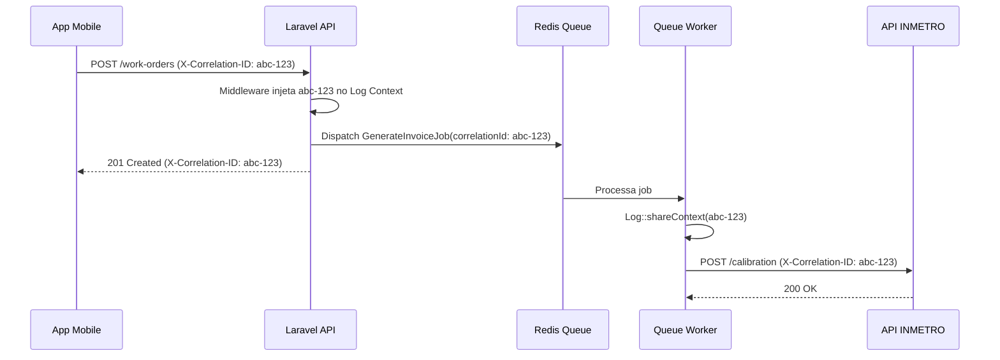

# 01. Escopo Arquitetural e Rastreabilidade (Trace IDs)

> **[AI_RULE]** Sistemas Modulares exigem rastreabilidade de ponta a ponta. Se um Webhook falha, precisamos achar todas as chamadas internas amarradas a ele.

## 1. Trace ID Propagation `[AI_RULE_CRITICAL]`

> **[AI_RULE_CRITICAL] A Lei do `x-request-id`**
> Toda requisição de entrada no sistema Laravel Kalibrium deve passar por um middleware que injeta um `x-request-id` (UUID) global e vincula ao Contexto do Log.
> **Comportamento da IA:** Quando uma IA gerar integrações de Jobs no Redis ou HTTP Clients (Guzzle) que conversam com microsserviços do INMETRO ou módulos distintos, o header `x-request-id` DEVE ser propagado no *Payload* do Job. Sem isso, os logs assíncronos quebram a trilha investigativa.

## 2. Padrão Global

O Header será nomeado `X-Correlation-ID`. O OpenTelemetry/Prometheus do servidor fará a garimpagem baseada estritamente nessa string. Cortar ela é cortar o cabo de vida da aplicação.

## 3. Implementação do Middleware de Correlação

O middleware `CorrelationIdMiddleware` intercepta toda requisição HTTP e:

```php
// app/Http/Middleware/CorrelationIdMiddleware.php
class CorrelationIdMiddleware
{
    public function handle(Request $request, Closure $next): Response
    {
        $correlationId = $request->header('X-Correlation-ID', (string) Str::uuid());

        // Injeta no contexto de log global
        Log::shareContext(['correlation_id' => $correlationId]);

        // Disponibiliza para Services e Jobs
        app()->instance('correlation_id', $correlationId);

        $response = $next($request);
        $response->headers->set('X-Correlation-ID', $correlationId);

        return $response;
    }
}
```

## 4. Propagação em Jobs e Eventos `[AI_RULE]`

> **[AI_RULE]** Todo Job despachado DEVE carregar o `correlation_id` do request original no seu construtor. Listeners que disparam sub-jobs propagam o mesmo ID em cascata.

```php
// Exemplo de propagação em Job
class GenerateInvoiceJob implements ShouldQueue
{
    public function __construct(
        public readonly int $workOrderId,
        public readonly string $correlationId,
    ) {}

    public function handle(): void
    {
        Log::shareContext(['correlation_id' => $this->correlationId]);
        // ... lógica do job
    }
}
```

## 5. Fluxo de Rastreabilidade Completo



## 6. Escopo de Auditoria por Tenant

Cada log estruturado inclui obrigatoriamente:

| Campo | Origem | Exemplo |
|-------|--------|---------|
| `correlation_id` | Middleware HTTP | `550e8400-e29b-41d4-a716-446655440000` |
| `tenant_id` | `$request->user()->current_tenant_id` | `42` |
| `user_id` | `$request->user()->id` | `15` |
| `module` | Namespace do Controller | `WorkOrders` |
| `action` | Método do Controller | `store` |

## 7. Consulta nos Logs

Para investigar uma falha completa de fluxo, basta filtrar pelo `correlation_id`:

```bash
# Buscar todos os logs de uma requisição específica
grep "abc-123" storage/logs/laravel-*.log
```

Isso retorna desde o request HTTP original, passando pelos jobs processados, até as chamadas a APIs externas -- tudo vinculado pela mesma string de correlação.
