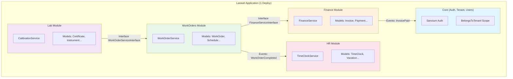

# 02. Por Que "Modular Monolith"?

> **[AI_RULE]** Sistemas começam puritanos e apodrecem para "Big Ball of Mud". O Modular Monolith é a nossa barreira de contenção.

## 1. Filosofia de Design `[AI_RULE_CRITICAL]`

> **[AI_RULE_CRITICAL] Jamais Quebrar para Microsserviços Prematuramente**
> É expressamente proibido para agentes de IA sugerirem ou tentarem criar infraestruturas de microsserviços (ex: `Finance-Service.zip` separado) gerando complexidade em rede não justificada.
> A ordem de arquitetura é: O código DEVE rodar nativamente sob 1 única base Git (Laravel Monolith), porém dividido em namespaces lacrados (ex: `App\Modules\Finance`). Comunicação externa entre eles no mesmo servidor acontece via métodos estritos (Contracts).

## 2. Vantagens Acatadas

- Simplificação Absoluta de Deploy (1 Pipeline, não dezenas).
- Refatoração Segável (Mover código de `Fleet` para `WorkOrders` continua sendo um cut-paste suportado pelo IDE em frações de segundo, o que API Requests físicas impediriam).
- Consistência Transacional Nativa sem "Two-Phase Commits" complexos.

## 3. Comparativo Arquitetural

| Critério | Monolito Clássico | Modular Monolith (Kalibrium) | Microsserviços |
|----------|-------------------|-------------------------------|----------------|
| Deploy | 1 artefato, tudo junto | 1 artefato, módulos isolados | N artefatos independentes |
| Transações | Simples (1 DB) | Simples (1 DB, scopes por tenant) | Complexas (Saga/2PC) |
| Comunicação | Chamadas diretas | Contracts + DTOs + Eventos | HTTP/gRPC entre serviços |
| Refatoração | Alto acoplamento | Fronteiras claras, movimentação fácil | Requer versionamento de APIs |
| Complexidade Ops | Baixa | Baixa | Alta (service mesh, discovery) |
| Escalabilidade | Vertical apenas | Vertical + horizontal por fila | Horizontal por serviço |

## 4. Quando Extrair um Módulo? `[AI_RULE]`

> **[AI_RULE]** A extração de um bounded context para microsserviço só é permitida quando TODAS as condições abaixo forem verdadeiras:
>
> 1. O módulo tem **throughput 10x maior** que os demais (ex: IoT de sensores de calibração)
> 2. O módulo requer **stack diferente** (ex: Python para ML de predição)
> 3. A equipe responsável é **geograficamente isolada** com ciclo de deploy próprio

Até lá, o código permanece no monolito modular com comunicação via interfaces.

## 5. Anatomia do Monolito Modular Kalibrium

## 6. Regras de Fronteira entre Módulos

1. **Sem imports cruzados de Models:** `Finance\Models\Invoice` nunca aparece em `use` dentro de `WorkOrders\Controllers\*`
2. **Comunicação síncrona:** Exclusivamente via `ServiceInterface` registrada no container IoC
3. **Comunicação assíncrona:** Via Laravel Events + Queue (Redis) com payloads DTO
4. **Dados compartilhados:** Passados como DTOs imutáveis, nunca como Eloquent Models
5. **Migrations:** Cada módulo é dono exclusivo das suas tabelas (prefixo lógico: `fin_`, `hr_`, `wo_`, etc.)
