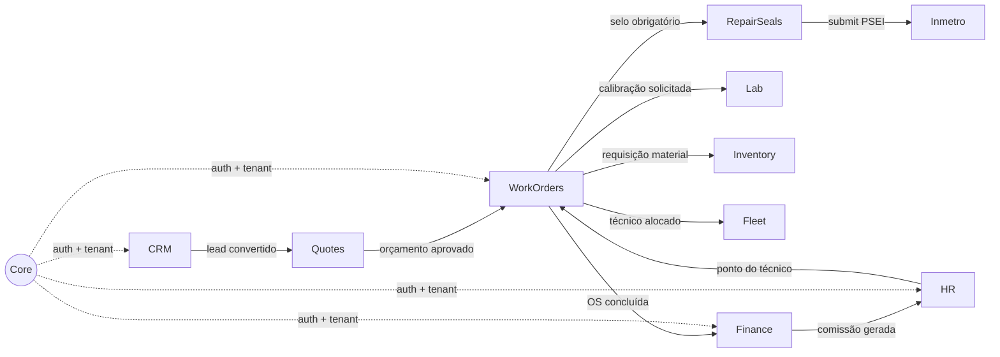

# 03. Bounded Contexts (Domínios)

> **[AI_RULE]** O pilar do Modular Monolith do Kalibrium SaaS repousa neste fato: Código que vive em "Módulo A" é cego e mudo sobre tabelas isoladas que vivem puramente no "Módulo B", exceto mediante Interfaces estritas.

## 1. Isolamento Direto `[AI_RULE_CRITICAL]`

> **[AI_RULE_CRITICAL] A Proibição de Eloquent Joins Cruzados**
> Um Repository ou Controller do módulo **Fleet** jamais pode incluir o trait `use App\Models\TaxCalculation` e executar lógicas profundas, pois ele quebrará o encapsulamento e as permissões de acesso da interface fiscal.
> **FORMA CORRETA:** Para o "Fleet" acessar dados de "Tributos", ele DEVE chamar via IoC (Inversion of Control) o Contrato/Interface exportado publicamente (`TaxServiceInterface->calculateDriverTaxes(DriverDTO $driver)`).

## 2. Nomes de Tabelas

- Padrão recomendado para as bases do sistema é o uso de Prefixos lógicos no MySql, ajudando visualmente a entender a qual Bounded Context uma tabela pertence (Ex: `fin_invoices`, `crm_deals`, `hr_time_clocks`).
- **NUNCA DELEGAR ON CASCADES SILENCIOSOS** numa FK de dois Bounded Contexts diferentes no MySQL; preferir disparar evento global de `AccountDeleted` para que os Módulos deletem passivamente.

## 3. Mapa Completo dos Bounded Contexts

O Kalibrium possui **27 bounded contexts** organizados em 5 macro-domínios:

### 3.1 Domínio Operacional (Core Business)

| Contexto | Prefixo DB | Responsabilidade |
|----------|-----------|-----------------|
| **WorkOrders** | `wo_` | Ordens de serviço, agendamentos, execução em campo |
| **Quotes** | `qt_` | Orçamentos, aprovações, conversão para OS |
| **Inventory** | `inv_` | Estoque, movimentações, requisições de material |
| **Fleet** | `flt_` | Veículos, manutenção, rastreamento GPS |
| **Scheduling** | `sch_` | Agenda de técnicos, disponibilidade, rotas |

### 3.2 Domínio Financeiro

| Contexto | Prefixo DB | Responsabilidade |
|----------|-----------|-----------------|
| **Finance** | `fin_` | Faturas, contas a receber/pagar, fluxo de caixa |
| **Commission** | `com_` | Comissões de técnicos e vendedores |
| **Tax** | `tax_` | Cálculos tributários, NF-e, integrações fiscais |
| **Billing** | `bil_` | Planos de assinatura, cobranças recorrentes |

### 3.3 Domínio de Pessoas

| Contexto | Prefixo DB | Responsabilidade |
|----------|-----------|-----------------|
| **HR** | `hr_` | Ponto digital (Portaria 671), férias, CLT compliance |
| **CRM** | `crm_` | Clientes, leads, pipeline de vendas |
| **Core** | - | Users, Tenants, Roles, Permissions (Spatie) |

### 3.4 Domínio Metrológico

| Contexto | Prefixo DB | Responsabilidade |
|----------|-----------|-----------------|
| **Lab** | `lab_` | Certificados de calibração, instrumentos |
| **Calibration** | `cal_` | Leituras, incertezas, rastreabilidade INMETRO |
| **Equipment** | `eq_` | Cadastro de equipamentos dos clientes |
| **Inmetro** | `inmetro_` | Inteligência metrológica, dados gov.br, prospecção, concorrentes |
| **RepairSeals** | `inmetro_` | Selos de reparo e lacres: ciclo de vida, inventário por técnico, prazo 5 dias, integração PSEI |

### 3.5 Domínio de Suporte

| Contexto | Prefixo DB | Responsabilidade |
|----------|-----------|-----------------|
| **Notifications** | `ntf_` | E-mails, SMS, push, WebSocket (Reverb) |
| **Reports** | `rpt_` | Relatórios gerenciais, dashboards |
| **Audit** | `aud_` | Logs de auditoria, trail de alterações |
| **PWA** | `pwa_` | Service workers, cache offline, sync |

## 4. Diagrama de Dependências entre Contextos

## 5. Regras de Acoplamento entre Contextos `[AI_RULE]`

> **[AI_RULE]** O acoplamento entre contextos segue uma hierarquia estrita:

1. **Core** pode ser referenciado por todos (via `User`, `Tenant`)
2. **Contextos operacionais** podem consumir interfaces de contextos financeiros
3. **Contextos financeiros** NUNCA importam de contextos operacionais -- recebem via eventos
4. **Contextos de suporte** (Notifications, Audit) escutam eventos passivamente, nunca são chamados diretamente por lógica de negócio
