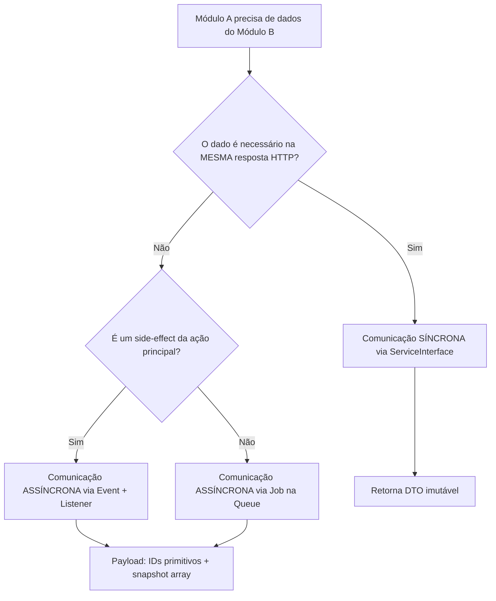

# 07. Comunicação Entre Módulos

> **[AI_RULE]** Sistemas Modelares viram uma "bola de lama orgânica" se os módulos conversarem errados. Acoplamento direto entre tabelas = Sistema Corrompido.

## 1. Comunicação Síncrona vs Assíncrona `[AI_RULE_CRITICAL]`

> **[AI_RULE_CRITICAL] Contratos de Comunicação Síncrona**
> Se no mesmo *Request HTTP* o módulo `WorkOrders` precisar da cotação de moedas no módulo `Finance`, a transação é **Síncrona**.
>
> - **Proibição:** A IA não pode chamar model direto (`FinanceQuote::first()`).
> - **Selo Perfeito:** Acesso DEVE OBRIGATORIAMENTE ocorrer via injeção de interface na camada de serviço: `$this->financeService->getLatestQuote()`. O `FinanceService` deve retornar um **DTO**, nunca o Model Eloquent de Finanças.

> **[AI_RULE] Comunicação Assíncrona Obrigatória (Side-Effects)**
> Se a ação original (ex: Deletar um Usuário do sistema) envolver limpezas não subjacentes (Cancelar Invoices secundárias em *Finance*, Revogar credenciais de Frota em *Fleet*), é PROIBIDO encapsular toda a lógica no Controller do Usuário. A AI DEVE Emitir evento global `UserDeletedEvent`, com tipagem estrita de payload. Os módulos devem Escutar (`Listener`) este evento passivamente via Laravel Queue local.

## 2. Diagrama de Decisão: Síncrono vs Assíncrono



## 3. Contratos de Interface (Service Contracts) `[AI_RULE]`

> **[AI_RULE]** Toda comunicação síncrona entre módulos DEVE ser mediada por uma Interface PHP no namespace `Contracts`.

```php
// app/Contracts/Finance/FinanceServiceInterface.php
interface FinanceServiceInterface
{
    public function getCustomerBalance(int $customerId): CustomerBalanceDTO;
    public function createInvoiceFromWorkOrder(WorkOrderInvoiceDTO $dto): int;
    public function getLatestQuote(string $currency): QuoteDTO;
}

// app/Modules/Finance/Services/FinanceService.php
class FinanceService implements FinanceServiceInterface
{
    public function getCustomerBalance(int $customerId): CustomerBalanceDTO
    {
        $balance = Invoice::where('customer_id', $customerId)
            ->selectRaw('SUM(total) as total, SUM(paid) as paid')
            ->first();

        return new CustomerBalanceDTO(
            total: $balance->total ?? 0,
            paid: $balance->paid ?? 0,
            pending: ($balance->total ?? 0) - ($balance->paid ?? 0),
        );
    }
}
```

## 4. Registro no Service Provider

```php
// app/Modules/Finance/Providers/FinanceServiceProvider.php
public function register(): void
{
    $this->app->bind(
        FinanceServiceInterface::class,
        FinanceService::class
    );
}
```

## 5. Comunicação Assíncrona: Padrão de Eventos

```php
// 1. Módulo WorkOrders emite o evento
class CompleteWorkOrderAction
{
    public function execute(WorkOrder $workOrder): void
    {
        $workOrder->update(['status' => 'completed']);

        event(new WorkOrderCompletedEvent(
            workOrderId: $workOrder->id,
            tenantId: $workOrder->tenant_id,
            technicianId: $workOrder->technician_id,
            totalAmount: $workOrder->total,
            completedAt: now()->toIso8601String(),
        ));
    }
}

// 2. Módulo Finance escuta
class GenerateInvoiceFromWorkOrder implements ShouldQueue
{
    public function handle(WorkOrderCompletedEvent $event): void
    {
        // Idempotência: verifica se já existe fatura para esta OS
        if (Invoice::where('work_order_id', $event->workOrderId)->exists()) {
            return;
        }
        // Gera fatura no contexto Finance
    }
}

// 3. Módulo HR escuta o mesmo evento
class RegisterTechnicianHoursFromWorkOrder implements ShouldQueue
{
    public function handle(WorkOrderCompletedEvent $event): void
    {
        // Registra horas trabalhadas para comissão
    }
}
```

## 6. Tabela de Fluxos Inter-Módulos

| Evento | Emissor | Consumidores | Tipo |
|--------|---------|-------------|------|
| `WorkOrderCompletedEvent` | WorkOrders | Finance, HR, Notifications | Async |
| `InvoicePaidEvent` | Finance | Commission, Notifications | Async |
| `CustomerCreatedEvent` | CRM | Notifications, Audit | Async |
| `CalibrationCompletedEvent` | Lab | WorkOrders, Notifications | Async |
| `StockBelowMinimumEvent` | Inventory | Notifications, Purchasing | Async |
| Consulta de saldo | WorkOrders | Finance (via Interface) | Sync |
| Consulta de estoque | WorkOrders | Inventory (via Interface) | Sync |
| Consulta de agenda | Scheduling | HR (via Interface) | Sync |

## 7. Anti-Padrões Proibidos `[AI_RULE_CRITICAL]`

> **[AI_RULE_CRITICAL]** Os seguintes padrões de comunicação são TERMINANTEMENTE PROIBIDOS:

1. **Import direto de Model:** `use App\Modules\Finance\Models\Invoice;` dentro de `WorkOrders\*`
2. **Join SQL cruzado:** `WorkOrder::join('fin_invoices', ...)` -- viola ownership
3. **Chamada de Controller:** Um controller chamando outro controller
4. **Acesso direto a tabela:** `DB::table('fin_invoices')` dentro de módulo que não é Finance
5. **Event sem Queue:** Side-effects pesados executados de forma síncrona no request principal
