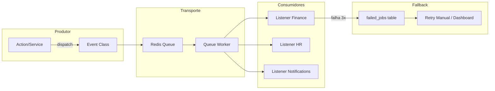

# 08. Semântica de Eventos e Mensageria

> **[AI_RULE]** O código não pode se acoplar passando Models entre contextos assincronamente. Payload sem contrato é um erro fatal num sistema inteligente.

## 1. Padrões de Payload (DTO/Array) `[AI_RULE_CRITICAL]`

> **[AI_RULE_CRITICAL] A Lei do DTO em Mensageria**
> É **EXTREMAMENTE PROIBIDO** para a IA instanciar eventos do Laravel ou despachar Jobs enviando instâncias completas de Eloquent Models no construtor. Isso corrompe quando o job roda muito depois e os dados já mudaram no banco, causando "race conditions" crônicos.
> **OBRIGATÓRIO:** A emissão de `InvoiceCreatedEvent(int $invoiceId, array $snapshot_payload)` passando o DTO imutável e IDs primitivos. O Listner recupera a entidade localmente re-hidratando-a.

## 2. Pub-Sub Interno

- Exemplo: Quando `WorkOrder` = `Completed`, se atira o Evento genérico do Domínio. O Listner em **Finance** (ex: `GenerateInvoiceFromWorkOrder`) intercepta isso invisivelmente.
- Fallback em Filas Redis/Database. Em caso de payload corrompida, as mensagens vão para `failed_jobs`. Nenhuma lógica destrutiva ou não idempotente deve morar nesses listeners (um listener que emite fatura DEVE checar se ela já não foi emitida).

## 3. Anatomia de um Evento Bem Tipado

```php
// app/Modules/WorkOrders/Events/WorkOrderCompletedEvent.php
class WorkOrderCompletedEvent implements ShouldBroadcast
{
    use Dispatchable, InteractsWithSockets, SerializesModels;

    public function __construct(
        public readonly int $workOrderId,
        public readonly int $tenantId,
        public readonly int $technicianId,
        public readonly float $totalAmount,
        public readonly string $completedAt,
        public readonly string $correlationId,
    ) {}

    // Canal WebSocket para notificação em tempo real (Reverb)
    public function broadcastOn(): array
    {
        return [
            new PrivateChannel("tenant.{$this->tenantId}"),
        ];
    }

    public function broadcastAs(): string
    {
        return 'work-order.completed';
    }
}
```

## 4. Regras de Idempotência `[AI_RULE]`

> **[AI_RULE]** Todo Listener que processa eventos assíncronos DEVE ser idempotente. Se o mesmo evento for entregue 2x, o resultado final deve ser idêntico.

Padrões aceitos para garantir idempotência:

```php
class GenerateInvoiceFromWorkOrder implements ShouldQueue
{
    public $tries = 3;
    public $backoff = [10, 60, 300]; // Retry exponencial

    public function handle(WorkOrderCompletedEvent $event): void
    {
        // 1. Verificação de idempotência
        if (Invoice::where('work_order_id', $event->workOrderId)->exists()) {
            Log::info('Invoice já existe, ignorando evento duplicado', [
                'work_order_id' => $event->workOrderId,
                'correlation_id' => $event->correlationId,
            ]);
            return;
        }

        // 2. Processamento com lock distribuído
        Cache::lock("invoice:wo:{$event->workOrderId}", 30)->block(5, function () use ($event) {
            // Re-check após obter lock
            if (Invoice::where('work_order_id', $event->workOrderId)->exists()) {
                return;
            }
            // Cria a invoice
        });
    }

    public function failed(WorkOrderCompletedEvent $event, Throwable $e): void
    {
        Log::error('Falha ao gerar invoice de OS', [
            'work_order_id' => $event->workOrderId,
            'error' => $e->getMessage(),
            'correlation_id' => $event->correlationId,
        ]);
        // Notifica admin via canal de alertas
    }
}
```

## 5. Fluxo de Mensageria no Kalibrium



## 6. Broadcasting em Tempo Real (Reverb)

Eventos marcados com `ShouldBroadcast` são transmitidos via Laravel Reverb para o frontend React:

| Evento | Canal | Uso no Frontend |
|--------|-------|-----------------|
| `WorkOrderCompletedEvent` | `tenant.{id}` | Atualiza dashboard em tempo real |
| `InvoicePaidEvent` | `tenant.{id}` | Notificação toast de pagamento |
| `StockAlertEvent` | `tenant.{id}` | Badge de alerta no menu de estoque |
| `TimeClockSyncedEvent` | `user.{id}` | Confirmação de ponto sincronizado |
| `CalibrationReadingEvent` | `lab.{instrumentId}` | Gráfico de leitura ao vivo |

## 7. Checklist para Criação de Eventos `[AI_RULE]`

> **[AI_RULE]** Antes de criar um novo evento, verificar:

- [ ] Payload contém APENAS primitivos e DTOs (nunca Models)
- [ ] `correlation_id` está presente para rastreabilidade
- [ ] `tenant_id` está presente para segurança multi-tenant
- [ ] Listeners implementam idempotência
- [ ] Retry policy definida (`$tries`, `$backoff`)
- [ ] Método `failed()` implementado para alertas
- [ ] Canal de broadcast definido se o frontend precisa ser notificado
