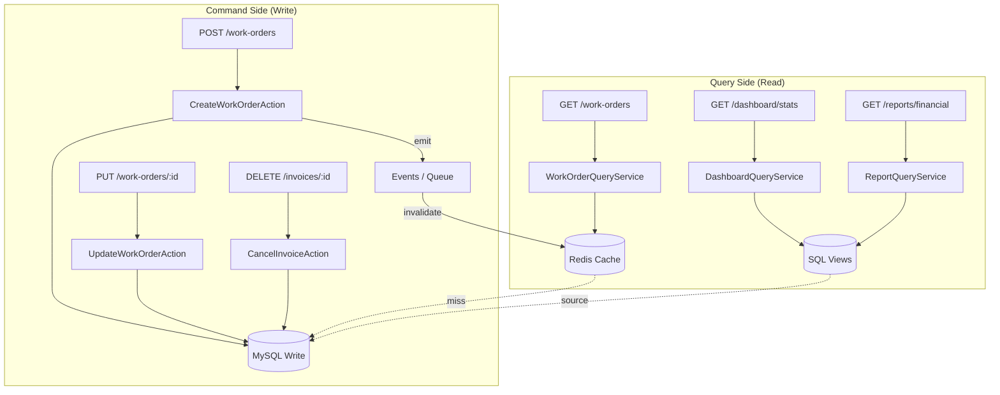

# 09. CQRS (Command Query Responsibility Segregation)

> **[AI_RULE]** Sistemas de alta performance morrem por lentidão no Read e deadlocks no Write. A separação estrita de caminhos protege o throughput.

## 1. Segregação de Fluxo `[AI_RULE_CRITICAL]`

> **[AI_RULE_CRITICAL] Isolamento de Read vs Write**
> A IA **JAMAIS** pode escrever um endpoint HTTP `GET` de listagem/pesquisa misturando processamento de negócio, cálculos pesados ou atualizações de registro disfarçadas (`Model->update()` em lógicas de get).
> Endpoints de Escrita (`POST`, `PUT`, `DELETE`) representam **Commands**, e não devem retornar o objeto hiper-hidratado, limitando-se ao status, ID e meta, para evitar travamento da thread de inserção em joins complexos.

## 2. Views e Materialização (Read Models)

- **Consultas Pesadas (Queries):** Quando um Dashboard precisa de dados de `WorkOrders`, `Invoices` e `StockMovements`, é **PROIBIDO** que a IA faça loopings de `n+1` com queries nested. O padrão correto é a subordinação ao uso de `Views` SQL nativas ou `Eager Loading` otimizado (`with()`) estritamente paginado.
- Em tabelas com >1 milhão de logs de sensor (`CalibrationReading`), a leitura de totais não faz uso de `COUNT(*)` transacional, mas do Redis Counter incrementado passivamente no command de gravação.

## 3. Arquitetura CQRS no Kalibrium



## 4. Padrão de Implementação: Commands (Write)

```php
// app/Modules/WorkOrders/Actions/CreateWorkOrderAction.php
class CreateWorkOrderAction
{
    public function execute(CreateWorkOrderDTO $dto): WorkOrder
    {
        return DB::transaction(function () use ($dto) {
            $workOrder = WorkOrder::create([
                'tenant_id' => $dto->tenantId,
                'customer_id' => $dto->customerId,
                'status' => 'pending',
                'scheduled_at' => $dto->scheduledAt,
            ]);

            event(new WorkOrderCreatedEvent(
                workOrderId: $workOrder->id,
                tenantId: $dto->tenantId,
            ));

            // Command retorna apenas o essencial
            return $workOrder;
        });
    }
}

// Controller de escrita: resposta enxuta
public function store(StoreWorkOrderRequest $request): JsonResponse
{
    $workOrder = $this->createAction->execute(
        CreateWorkOrderDTO::fromRequest($request)
    );

    return response()->json([
        'id' => $workOrder->id,
        'status' => $workOrder->status,
        'message' => 'Ordem de serviço criada com sucesso.',
    ], 201);
}
```

## 5. Padrão de Implementação: Queries (Read)

```php
// app/Modules/WorkOrders/Services/WorkOrderQueryService.php
class WorkOrderQueryService
{
    public function listForTenant(int $tenantId, array $filters): LengthAwarePaginator
    {
        return WorkOrder::query()
            ->with(['customer:id,name', 'technician:id,name']) // Eager loading seletivo
            ->when($filters['status'] ?? null, fn ($q, $s) => $q->where('status', $s))
            ->when($filters['date_from'] ?? null, fn ($q, $d) => $q->where('scheduled_at', '>=', $d))
            ->select(['id', 'customer_id', 'technician_id', 'status', 'scheduled_at', 'total'])
            ->orderByDesc('scheduled_at')
            ->paginate($filters['per_page'] ?? 20);
    }

    public function dashboardStats(int $tenantId): array
    {
        // Usa Redis cache com TTL curto para dashboard
        return Cache::remember("dashboard:wo:{$tenantId}", 60, function () use ($tenantId) {
            return DB::table('vw_work_order_stats')
                ->where('tenant_id', $tenantId)
                ->first()
                ?->toArray() ?? [];
        });
    }
}
```

## 6. Invalidação de Cache `[AI_RULE]`

> **[AI_RULE]** Quando um Command altera dados, os caches correspondentes DEVEM ser invalidados. Usar tags de cache ou keys previsíveis.

```php
// No Listener de eventos de escrita
class InvalidateWorkOrderCache
{
    public function handle(WorkOrderCreatedEvent|WorkOrderUpdatedEvent $event): void
    {
        Cache::forget("dashboard:wo:{$event->tenantId}");
        Cache::tags(["wo:tenant:{$event->tenantId}"])->flush();
    }
}
```

## 7. Views SQL do Sistema

O sistema utiliza views SQL para consultas complexas de dashboard. Estas views devem ser criadas via migrations.

| View | Descrição | Tabelas fonte |
|------|-----------|---------------|
| `vw_work_order_stats` | Estatísticas de OS por período/status/técnico | work_orders, users, customers |
| `vw_financial_summary` | Resumo financeiro por período/categoria | accounts_receivable, accounts_payable, payments |
| `vw_technician_performance` | Performance técnico (tempo médio, satisfação, retrabalho) | work_orders, checklist_submissions, nps_surveys |
| `vw_inventory_status` | Status atual do estoque por produto/warehouse | stock_items, stock_movements, warehouses |
| `vw_sla_compliance` | Compliance SLA por contrato/cliente | work_orders, sla_policies, contracts |
| `vw_customer_health` | Health score do cliente (NPS, inadimplência, tickets) | customers, nps_surveys, accounts_receivable, tickets |

**Migration:** Cada view deve ter migration própria (ex: `create_vw_work_order_stats_view`). Usar `DB::statement('CREATE OR REPLACE VIEW ...')` no `up()` e `DB::statement('DROP VIEW IF EXISTS ...')` no `down()`.

## 8. Regras de Performance por Tipo de Endpoint

| Tipo | Método HTTP | Tempo Max Resposta | Cache | Paginação |
|------|-----------|-------------------|-------|-----------|
| Listagem | GET | 200ms | Redis 60s | Obrigatória |
| Detalhe | GET | 100ms | Redis 300s | N/A |
| Dashboard | GET | 500ms | Redis 30s | N/A |
| Relatório | GET | 5000ms | Redis 600s | Obrigatória |
| Criação | POST | 300ms | Invalida | N/A |
| Atualização | PUT | 300ms | Invalida | N/A |
| Deleção | DELETE | 200ms | Invalida | N/A |
