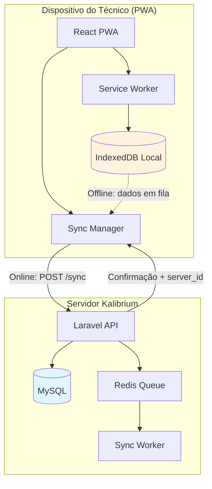
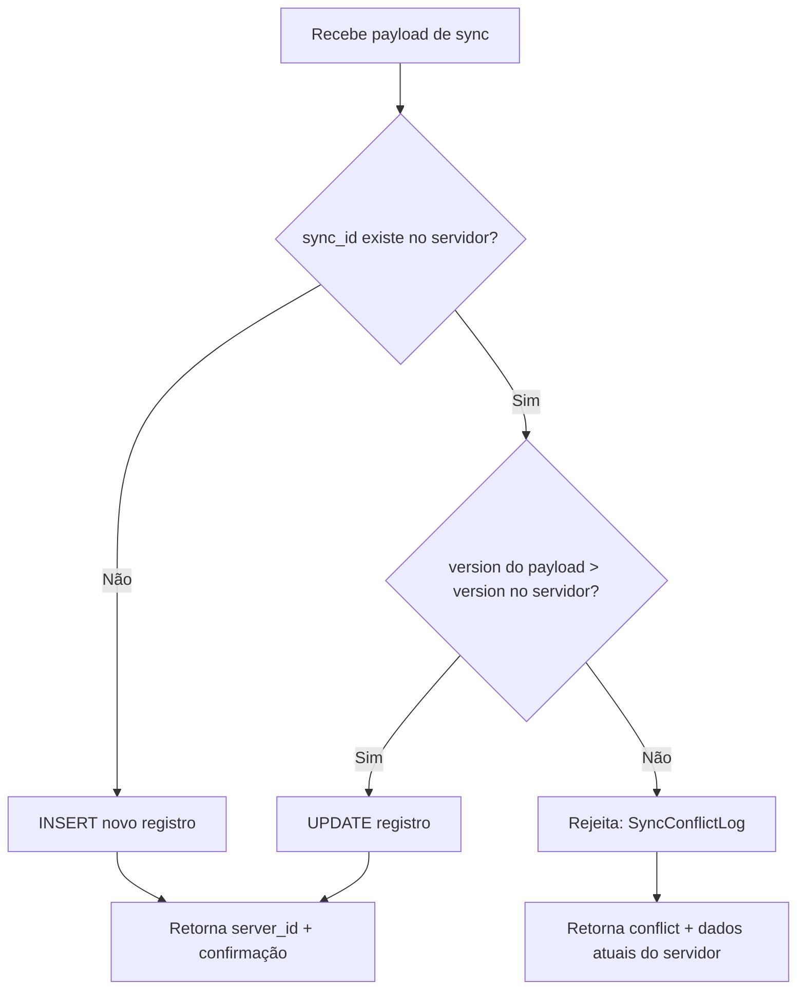

# 11. Arquitetura Mobile Offline e Sincronização

> **[AI_RULE]** Dispositivos de campo perdem área de cobertura. O sistema é moldado para **Offline First**.

## 1. Paradigma de Identificadores `[AI_RULE_CRITICAL]`

> **[AI_RULE_CRITICAL] A Lei do ULID Nativo**
> Para tabelas onde o aplicativo frontend mobile cria registros offline (ex: Ordens de Serviço preenchidas na fazenda, Entradas de Ponto, etc.), é **EXTREMAMENTE PROIBIDO** que a IA baseie os updates futuros num campo auto-increment (ID) no banco principal.
> Os registros DEVEM ser inseridos e atrelados no frontend utilizando gerar **ULIDs/UUIDs**. O banco central Laravel salva este UUID no campo `sync_id` string para conciliações, impedindo colisões quando submeter a fila da web.

## 2. Last-Write-Wins e Sincronização Assíncrona

- Jobs de Update baseados em timestamp (`updated_at` do dispositivo).
- Em conflitos, o server recusa silenciosamente o registro cujo snapshot de `version` seja inferior ao já retido, gerando um log de `SyncConflictLog` para a auditoria manual.

## 3. Arquitetura Offline-First no Kalibrium



## 4. Entidades com Suporte Offline

| Entidade | Módulo | Criação Offline | Sync Bidirecional |
|----------|--------|----------------|-------------------|
| `WorkOrder` (execução) | WorkOrders | Sim | Sim |
| `TimeClockEntry` | HR | Sim | Upload only |
| `ChecklistItem` | WorkOrders | Sim | Upload only |
| `Photo/Attachment` | WorkOrders | Sim | Upload only (queue) |
| `CalibrationReading` | Lab | Sim | Upload only |
| `StockMovement` (baixa) | Inventory | Sim | Upload only |
| `Signature` (assinatura) | WorkOrders | Sim | Upload only |

## 5. Formato do Payload de Sincronização `[AI_RULE]`

> **[AI_RULE]** O payload de sync DEVE seguir o formato abaixo. O `sync_id` (ULID) é a chave de reconciliação, NUNCA o `id` auto-increment do servidor.

```json
{
  "sync_batch_id": "01HXK4N2P5QRZG8Y7T3V6WFMC9",
  "device_id": "PWA-iPhone14-abc123",
  "timestamp": "2026-03-24T14:30:00-03:00",
  "operations": [
    {
      "sync_id": "01HXK4N2P5QRZG8Y7T3V6WFMC8",
      "entity": "time_clock_entries",
      "action": "create",
      "version": 1,
      "data": {
        "employee_id": 42,
        "clock_type": "clock_in",
        "registered_at": "2026-03-24T08:00:00-03:00",
        "latitude": -23.5505,
        "longitude": -46.6333,
        "selfie_base64": "..."
      }
    }
  ]
}
```

## 6. Resolução de Conflitos



### Estratégias por Tipo de Dado

| Tipo | Estratégia | Motivo |
|------|-----------|--------|
| Ponto digital | **Device Wins** | Registro no momento é verdade absoluta (Portaria 671) |
| Ordem de Serviço | **Last-Write-Wins** com version | Múltiplos editores possíveis |
| Fotos/Anexos | **Append Only** | Nunca deletar evidência |
| Leituras de calibração | **Device Wins** | Dados sensoriais imutáveis |
| Movimentação estoque | **Server Wins** com rejeição | Estoque requer consistência forte |

## 7. Service Worker e Cache Strategy

```javascript
// Estratégias de cache do PWA
const CACHE_STRATEGIES = {
  // API de listagem: Network First com fallback local
  '/api/v1/work-orders': 'NetworkFirst',

  // Assets estáticos: Cache First
  '/assets/*': 'CacheFirst',

  // API de sync: Network Only (nunca cachear)
  '/api/v1/sync': 'NetworkOnly',

  // Dados de referência (clientes, produtos): Stale While Revalidate
  '/api/v1/customers': 'StaleWhileRevalidate',
};
```

## 8. Sync Endpoint Specification

**Route:** `POST /api/v1/sync`
**Controller:** `App\Http\Controllers\Api\V1\Mobile\SyncController@sync`
**FormRequest:** `App\Http\Requests\Api\V1\Mobile\SyncRequest`
**Middleware:** `auth:sanctum, tenant`

**Request Body:**
```json
{
  "device_id": "uuid",
  "last_sync_at": "2026-03-25T10:00:00Z",
  "changes": [
    {
      "entity": "work_orders",
      "action": "update",
      "id": 123,
      "data": { "status": "completed", "completed_at": "2026-03-25T14:30:00Z" },
      "local_updated_at": "2026-03-25T14:30:00Z"
    }
  ]
}
```

**Response:**
```json
{
  "server_changes": [...],
  "conflicts": [
    {
      "entity": "work_orders",
      "id": 123,
      "server_version": {},
      "resolution": "server_wins"
    }
  ],
  "sync_token": "abc123",
  "synced_at": "2026-03-25T15:00:00Z"
}
```

**Conflict Resolution:** Server-wins por padrão. Cliente pode solicitar merge manual via `POST /api/v1/sync/resolve`.

### SyncConflictLog Model
- **Tabela:** `sync_conflict_logs`
- **Campos:**
  | Campo | Tipo | Descrição |
  |-------|------|-----------|
  | id | bigint unsigned | PK |
  | tenant_id | bigint unsigned | FK tenants |
  | device_id | uuid | Device que originou o conflito |
  | user_id | bigint unsigned | FK users |
  | entity_type | varchar(100) | Tipo da entidade (ex: work_orders) |
  | entity_id | bigint unsigned | ID da entidade |
  | client_data | json | Dados do cliente |
  | server_data | json | Dados do servidor |
  | resolution | enum('server_wins','client_wins','manual_merge') | Como foi resolvido |
  | resolved_at | timestamp nullable | Quando foi resolvido |
  | timestamps | | created_at, updated_at |

## 9. Fila de Upload de Mídia `[AI_RULE]`

> **[AI_RULE]** Fotos e anexos coletados em campo NUNCA são enviados inline no payload de sync. Eles entram numa fila separada de upload com retry automático para não bloquear a sincronização de dados estruturados.

O fluxo: dados estruturados sincronizam primeiro (rápido), depois a fila de mídia envia os binários em background com progress tracking no app.
