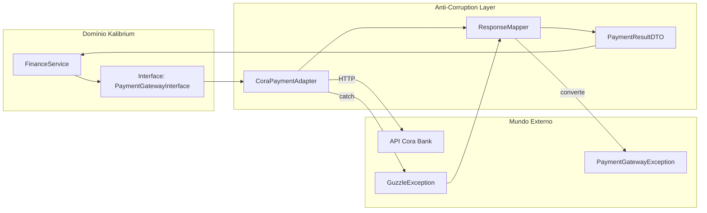

# 12. Anti-Corruption Layer (Integrações Externas)

> **[AI_RULE]** Sistemas de terceiros (Governo, Gateways, ERPs Legados) frequentemente falham ou mudam de contrato. Nunca deixe essas mudanças invadirem nossos domínios principais.

## 1. Barreiras de Isolamento (Interfaces & Adapters)

> **[AI_RULE_CRITICAL] O Padrão "Anti-Corruption Layer" (ACL)**
> Se a AI precisar montar uma requisição HTTP via `Http::post()` para um Terceiro, ela é rigidamente proibida de codificar isso dentro de um Controller Principal ou de um Service de Bounded Context (ex: `FinanceService`).
> **A IA DEVE:** Isolar a infraestrutura construindo uma Request Adapter no folder `Infrastructure/Adapters` que retorna objetos padronizados (`Responses / Value Objects`) neutros da biblioteca externa.

## 2. O Domínio Dita As Regras

- Sepeare as chaves: A API do banco Cora retorna `{ "customer_id": "cust_123" }`. Quando o Adapter entrega isso para o Laravel `User Model`, ele deve converter para as nossas constantes locais e nossas Exceptions (ex: `PaymentGatewayException`) nunca atirando a exception nativa Guzzle nas camadas acima.

## 3. Arquitetura da ACL no Kalibrium



## 4. Integrações Externas do Kalibrium

| Integração | Propósito | Adapter Location | Protocolo |
|-----------|-----------|-----------------|-----------|
| **INMETRO/RBMLQ** | Rastreabilidade metrológica | `Infrastructure/Adapters/InmetroAdapter` | REST/SOAP |
| **eSocial** | Eventos S-1000, S-2230 (RH) | `Infrastructure/Adapters/ESocialAdapter` | XML/REST |
| **NF-e/NFS-e** | Emissão fiscal | `Infrastructure/Adapters/FiscalAdapter` | XML/SOAP |
| **Cora/Asaas** | Gateway de pagamento | `Infrastructure/Adapters/PaymentAdapter` | REST |
| **WhatsApp (Baileys)** | Notificações ao cliente | `Infrastructure/Adapters/WhatsAppAdapter` | WebSocket |
| **Google Maps** | Geocoding, rotas | `Infrastructure/Adapters/MapsAdapter` | REST |
| **AWS S3** | Armazenamento de arquivos | `Infrastructure/Adapters/StorageAdapter` | SDK |
| **SMTP/Mailgun** | E-mails transacionais | Nativo Laravel Mail | SMTP |

## 5. Estrutura de um Adapter `[AI_RULE]`

> **[AI_RULE]** Todo Adapter externo segue a mesma estrutura tripartite: Interface, Adapter concreto e DTOs de resposta.

```php
// 1. Interface no domínio (o domínio NÃO conhece o terceiro)
// app/Contracts/External/PaymentGatewayInterface.php
interface PaymentGatewayInterface
{
    public function createCharge(ChargeDTO $charge): PaymentResultDTO;
    public function getPaymentStatus(string $externalId): PaymentStatusDTO;
    public function cancelCharge(string $externalId): bool;
}

// 2. Adapter concreto (ÚNICO lugar que conhece a API externa)
// app/Infrastructure/Adapters/CoraPaymentAdapter.php
class CoraPaymentAdapter implements PaymentGatewayInterface
{
    public function createCharge(ChargeDTO $charge): PaymentResultDTO
    {
        try {
            $response = Http::withToken($this->getToken())
                ->timeout(15)
                ->retry(3, 1000)
                ->post("{$this->baseUrl}/charges", [
                    'amount' => $charge->amountInCents,
                    'customer_id' => $charge->externalCustomerId,
                    'description' => $charge->description,
                ]);

            if ($response->failed()) {
                throw new PaymentGatewayException(
                    "Cora retornou status {$response->status()}",
                    $response->status()
                );
            }

            // 3. Mapeia resposta externa para DTO interno
            return new PaymentResultDTO(
                externalId: $response->json('id'),
                status: $this->mapStatus($response->json('status')),
                pixCode: $response->json('pix.qr_code'),
                boleto: $response->json('boleto.url'),
            );
        } catch (ConnectionException $e) {
            throw new PaymentGatewayException(
                'Falha de conexão com gateway de pagamento',
                previous: $e
            );
        }
    }

    private function mapStatus(string $externalStatus): string
    {
        return match ($externalStatus) {
            'PAID', 'CONFIRMED' => 'paid',
            'PENDING', 'PROCESSING' => 'pending',
            'CANCELLED', 'EXPIRED' => 'cancelled',
            default => 'unknown',
        };
    }
}
```

## 6. Binding no Container

```php
// app/Providers/ExternalServicesProvider.php
public function register(): void
{
    $this->app->bind(
        PaymentGatewayInterface::class,
        CoraPaymentAdapter::class
    );

    $this->app->bind(
        FiscalServiceInterface::class,
        NfeAdapter::class
    );

    $this->app->bind(
        MetrologyServiceInterface::class,
        InmetroAdapter::class
    );
}
```

## 7. Circuit Breaker para APIs Instáveis `[AI_RULE]`

> **[AI_RULE]** APIs governamentais (eSocial, SEFAZ, INMETRO) são notoriamente instáveis. Adapters para esses serviços DEVEM implementar Circuit Breaker com fallback graceful.

```php
// Padrão de resiliência
class ESocialAdapter implements ESocialInterface
{
    public function sendEvent(ESocialEventDTO $event): ESocialResultDTO
    {
        $circuitKey = "circuit:esocial:{$event->type}";

        // Se o circuito está aberto (muitas falhas recentes), enfileira para retry
        if (Cache::get($circuitKey) >= 5) {
            dispatch(new RetrySendESocialJob($event))->delay(now()->addMinutes(10));
            return ESocialResultDTO::queued('Circuit breaker ativo');
        }

        try {
            $result = $this->doSend($event);
            Cache::forget($circuitKey); // Reset em sucesso
            return $result;
        } catch (Throwable $e) {
            Cache::increment($circuitKey);
            Cache::put($circuitKey, Cache::get($circuitKey), now()->addMinutes(30));
            throw new ExternalServiceUnavailableException('eSocial', $e);
        }
    }
}
```

## 8. Testes de Adapters

Cada Adapter DEVE ter testes unitários com mock HTTP (via `Http::fake()`) e testes de integração opcionais (desligados por default via `@group integration`).
