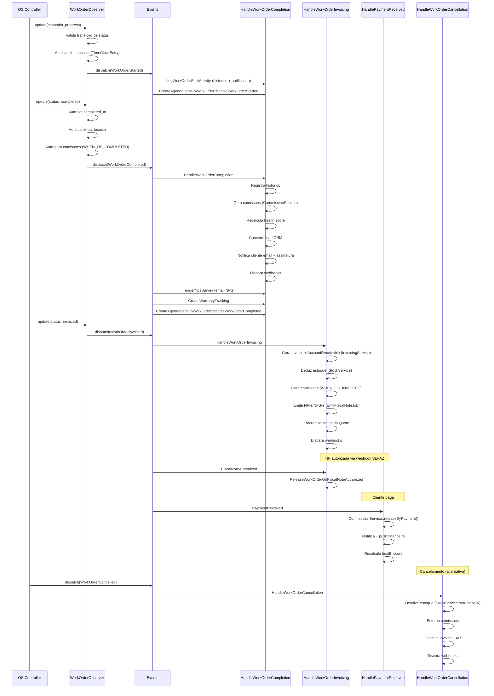
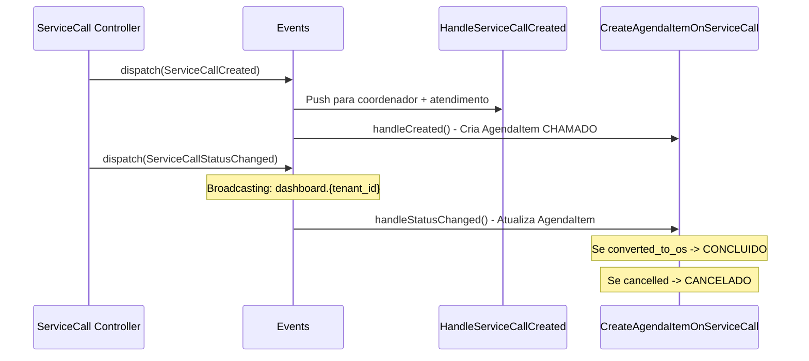
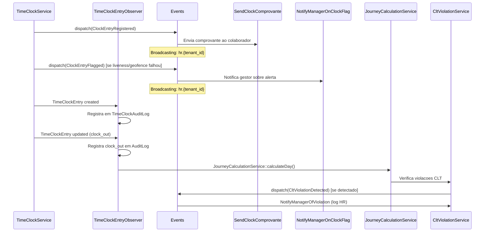
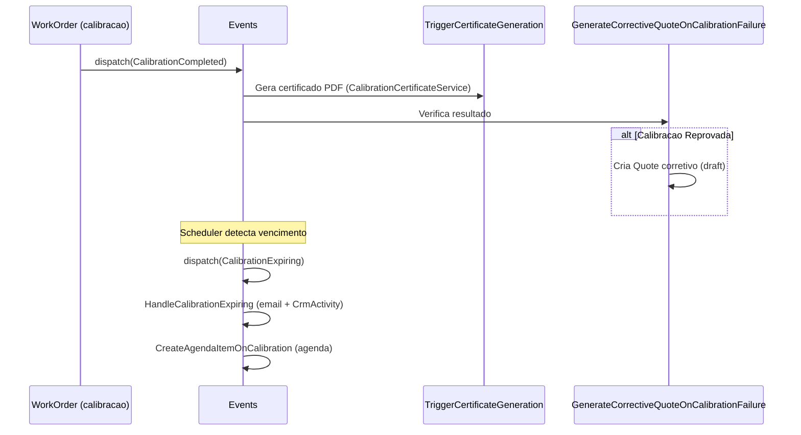

# 20. Arquitetura de Eventos, Listeners e Observers

## 1. Visao Geral

O sistema utiliza o mecanismo de eventos do Laravel para desacoplar modulos e orquestrar efeitos colaterais de forma explicita. Existem tres mecanismos distintos:

- **Events + Listeners**: Eventos de dominio disparados explicitamente via `event()` ou `::dispatch()`. Cada evento carrega um payload tipado e pode ter multiplos listeners (sync ou async via queue). Mapeados em `EventServiceProvider::$listen` e `$subscribe`.
- **Observers**: Hooks automaticos do Eloquent (`creating`, `created`, `updating`, `updated`, `saved`, `deleted`). Disparam implicitamente quando um model e salvo. Registrados em `AppServiceProvider` ou via atributo `ObservedBy`.
- **Broadcasting**: Alguns eventos implementam `ShouldBroadcast`/`ShouldBroadcastNow` para enviar dados em tempo real ao frontend via WebSocket (Pusher/Reverb).

### Riscos de Efeitos Colaterais Nao Documentados

1. **Cascata invisivel**: Um observer pode disparar um evento, que dispara listeners que alteram outros models, ativando mais observers.
2. **Duplicidade**: Observer e Listener podem executar a mesma acao (ex: `ExpenseObserver` e `GenerateAccountPayableFromExpense` ambos criam `AccountPayable`). O sistema usa guards de idempotencia (`reimbursement_ap_id`, markers em `notes`, cache locks).
3. **Ordem de execucao**: Listeners sao executados na ordem de registro em `$listen`. Subscribers (`$subscribe`) sao processados apos `$listen`.

---

## 2. Mapa Completo de Eventos

| Evento | Payload | Disparo | Broadcasting |
|--------|---------|---------|-------------|
| `CalibrationCompleted` | `WorkOrder $workOrder`, `int $equipmentId` | Ao concluir calibracao em OS | Nao |
| `CalibrationExpiring` | `EquipmentCalibration $calibration`, `int $daysUntilExpiry` | Scheduler/cron de verificacao de vencimento | Nao |
| `ClockAdjustmentDecided` | `TimeClockAdjustment $adjustment`, `string $decision` | Gestor aprova/rejeita ajuste de ponto | Nao |
| `ClockAdjustmentRequested` | `TimeClockAdjustment $adjustment` | Colaborador solicita ajuste de ponto | Nao |
| `ClockEntryFlagged` | `TimeClockEntry $entry`, `string $reason` | Registro de ponto com alerta (liveness/geofence) | `ShouldBroadcastNow` canal `hr.{tenant_id}` |
| `ClockEntryRegistered` | `TimeClockEntry $entry`, `string $type` | Registro de ponto (clock_in/clock_out/break) | `ShouldBroadcastNow` canal `hr.{tenant_id}` |
| `CltViolationDetected` | `CltViolation $violation` | `CltViolationService` detecta violacao CLT | Nao |
| `CommissionGenerated` | `CommissionEvent $commission` | `CommissionService::calculateAndGenerate()` | Nao |
| `ContractRenewing` | `RecurringContract $contract`, `int $daysUntilEnd` | Scheduler de verificacao de contratos | Nao |
| `CustomerCreated` | `Customer $customer` | `CustomerController::store()` / `CustomerObserver` | Nao |
| `DocumentExpiring` | `EmployeeDocument $document`, `int $daysUntilExpiry` | Scheduler de verificacao de documentos RH | Nao |
| `EspelhoConfirmed` | `EspelhoConfirmation $confirmation` | Colaborador confirma espelho de ponto | Nao |
| `ExpenseApproved` | `Expense $expense` | Aprovacao de despesa (nao registrado em `$listen`) | Nao |
| `ExpenseLimitExceeded` | `Expense $expense`, `float $limit`, `float $currentTotal` | Limite de despesa excedido (nao registrado em `$listen`) | Nao |
| `FiscalNoteAuthorized` | `FiscalNote $fiscalNote` | Webhook SEFAZ autoriza NF-e/NFS-e | Nao |
| `HourBankExpiring` | `User $user`, `float $hours`, `string $expiryDate` | Scheduler de banco de horas | Nao |
| `HrActionAudited` | `string $action`, `string $modelType`, `int $modelId`, `?array $oldValues`, `?array $newValues`, `int $userId` | Qualquer acao auditavel de RH | Nao |
| `LeaveDecided` | `LeaveRequest $leave`, `string $decision` | Gestor aprova/rejeita afastamento | Nao |
| `LeaveRequested` | `LeaveRequest $leave` | Colaborador solicita afastamento | Nao |
| `LocationSpoofingDetected` | `TimeClockEntry $entry`, `array $spoofingData` | `LocationValidationService` detecta spoofing GPS | Nao |
| `NotificationSent` | `array $notificationData`, `int $tenantId`, `?int $userId` | `NotificationService` envia notificacao | `ShouldBroadcast` canais `tenant.{id}.notifications`, `user.{id}.notifications` |
| `PaymentMade` | `AccountPayable $accountPayable`, `?Payment $payment` | Registro de pagamento de conta a pagar | Nao |
| `PaymentReceived` | `AccountReceivable $accountReceivable`, `?Payment $payment` | Registro de recebimento | Nao |
| `QuoteApproved` | `Quote $quote`, `User $user` | Aprovacao de orcamento (interno/portal/magic_link) | Nao |
| `ReconciliationUpdated` | `int $tenantId`, `string $action`, `array $summary` | Atualizacao de conciliacao bancaria | `ShouldBroadcast` canal `tenant.{id}.reconciliation` |
| `ServiceCallCreated` | `ServiceCall $serviceCall`, `?User $user` | Criacao de chamado tecnico | Nao |
| `ServiceCallStatusChanged` | `ServiceCall $serviceCall`, `?string $oldStatus`, `?string $newStatus`, `?User $user` | Mudanca de status de chamado | `ShouldBroadcastNow` canal `dashboard.{tenant_id}` |
| `StockEntryFromNF` | `StockMovement $movement`, `?string $nfNumber`, `?int $supplierId` | Entrada de estoque via NF (nao registrado em `$listen`) | Nao |
| `TechnicianLocationUpdated` | `User $user` (serializado como array) | `TechnicianLocationController` / `TimeEntryObserver` | `ShouldBroadcastNow` canal `dashboard.{tenant_id}` |
| `VacationDeadlineApproaching` | `VacationBalance $balance`, `int $daysUntilDeadline` | Scheduler de verificacao de ferias | Nao |
| `WorkOrderCancelled` | `WorkOrder $workOrder`, `User $user`, `string $reason`, `string $fromStatus` | Cancelamento de OS | Nao |
| `WorkOrderCompleted` | `WorkOrder $workOrder`, `User $user`, `string $fromStatus` | Conclusao de OS | Nao |
| `WorkOrderInvoiced` | `WorkOrder $workOrder`, `User $user`, `string $fromStatus` | Faturamento de OS | Nao |
| `WorkOrderStarted` | `WorkOrder $workOrder`, `User $user`, `string $fromStatus` | Inicio de OS | Nao |
| `WorkOrderStatusChanged` | `WorkOrder $workOrder` (serializado como array) | Qualquer mudanca de status de OS | `ShouldBroadcastNow` canal `dashboard.{tenant_id}` |

---

## 3. Mapa Completo de Listeners

| Listener | Evento(s) | O que faz | Efeitos Colaterais | Modulo | Queue |
|----------|-----------|-----------|---------------------|--------|-------|
| `AuditHrActionListener` | `HrActionAudited` | Insere registro em `audit_logs` | Escrita em tabela de auditoria | RH | Sync |
| `CreateAgendaItemOnCalibration` | `CalibrationExpiring` | Cria `AgendaItem` tipo CALIBRACAO | Agenda | Metrologia | Async |
| `CreateAgendaItemOnContract` | `ContractRenewing` | Cria `AgendaItem` tipo CONTRATO | Agenda | Contratos | Async |
| `CreateAgendaItemOnPayment` | `PaymentReceived` | Cria `AgendaItem` tipo FINANCEIRO | Agenda | Financeiro | Async |
| `CreateAgendaItemOnQuote` | `QuoteApproved` | Cria `AgendaItem` tipo ORCAMENTO | Agenda | Comercial | AsyncAfterCommit |
| `CreateAgendaItemOnServiceCall` | `ServiceCallCreated`, `ServiceCallStatusChanged` (subscriber) | Cria/atualiza `AgendaItem` tipo CHAMADO | Agenda | Atendimento | Async |
| `CreateAgendaItemOnWorkOrder` | `WorkOrderStarted`, `WorkOrderCompleted` (subscriber) | Cria/sincroniza `AgendaItem` tipo OS | Agenda | OS | Async |
| `CreateWarrantyTrackingOnWorkOrderInvoiced` | `WorkOrderCompleted`, `WorkOrderInvoiced` | Cria `WarrantyTracking` para cada item produto | Garantia de pecas | OS | Async |
| `GenerateAccountPayableFromExpense` | `ExpenseApproved` | Cria `AccountPayable` para reembolso | Financeiro (conta a pagar) | Despesas | Async |
| `GenerateAccountPayableFromStockEntry` | `StockEntryFromNF` | Cria `AccountPayable` para compra via NF | Financeiro (conta a pagar) | Estoque | Async |
| `GenerateCorrectiveQuoteOnCalibrationFailure` | `CalibrationCompleted` | Gera orcamento corretivo se calibracao reprovada | Cria `Quote` draft | Metrologia | Sync |
| `HandleCalibrationExpiring` | `CalibrationExpiring` | Notifica vendedor via email, cria `CrmActivity` follow-up, push para gerentes | Notificacao + CRM | Metrologia | Async |
| `HandleContractRenewing` | `ContractRenewing` | Cria `Notification` para responsavel do contrato | Notificacao | Contratos | Async |
| `HandleCustomerCreated` | `CustomerCreated` | Cria `CrmActivity` de boas-vindas + `Notification` para vendedor | CRM + Notificacao | CRM | Async |
| `HandlePaymentMade` | `PaymentMade` | Cria `Notification` para responsavel | Notificacao | Financeiro | Async |
| `HandlePaymentReceived` | `PaymentReceived` | Libera comissoes via `CommissionService::releaseByPayment()`, notifica, recalcula health score, push para financeiro | Comissao + Notificacao + CRM | Financeiro | Async |
| `HandleQuoteApproval` | `QuoteApproved` | Cria `CrmActivity`, `Notification`, envia email ao vendedor | CRM + Notificacao + Email | Comercial | AsyncAfterCommit |
| `HandleServiceCallCreated` | `ServiceCallCreated` | Push notification para coordenador e atendimento | Push | Atendimento | Async |
| `HandleWorkOrderCancellation` | `WorkOrderCancelled` | Registra historico, notifica, devolve estoque, estorna comissoes, cancela invoices/AR, dispara webhooks | Estoque + Financeiro + Comissao + Webhook | OS | Async (3 tentativas) |
| `HandleWorkOrderCompletion` | `WorkOrderCompleted` | Registra historico, notifica, gera comissoes, recalcula health score, converte lead CRM, notifica cliente email, solicita assinatura, webhooks | Comissao + CRM + Email + Webhook | OS | Async (3 tentativas) |
| `HandleWorkOrderInvoicing` | `WorkOrderInvoiced` | Registra historico, gera Invoice + AR via `InvoicingService`, deduz estoque, gera comissoes, emite NF-e/NFS-e, notifica, sync quote status, webhooks | Invoice + Estoque + Comissao + Fiscal + Webhook | OS | Async (3 tentativas) |
| `HandleWorkOrderStatusChanged` | `WorkOrderStatusChanged` | Push notification para tecnico | Push | OS | Async |
| `LogWorkOrderStartActivity` | `WorkOrderStarted` | Registra historico de status + notifica tecnico | Historico + Notificacao | OS | Async |
| `NotifyBeneficiaryOnCommission` | `CommissionGenerated` | Notificacao + push para beneficiario da comissao | Notificacao + Push | Comissao | Async |
| `NotifyEmployeeOnAdjustmentDecision` | `ClockAdjustmentDecided` | Notifica colaborador sobre decisao de ajuste | Notificacao | RH | Async |
| `NotifyEmployeeOnLeaveDecision` | `LeaveDecided` | Notifica colaborador sobre decisao de afastamento | Notificacao | RH | Async |
| `NotifyManagerOfViolation` | `CltViolationDetected` | Loga violacao CLT no canal `hr` | Log | RH | Async |
| `NotifyManagerOnAdjustment` | `ClockAdjustmentRequested` | Notifica gestor sobre solicitacao de ajuste | Notificacao | RH | Async |
| `NotifyManagerOnClockFlag` | `ClockEntryFlagged` | Notifica gestor sobre ponto com alerta | Notificacao | RH | Async |
| `NotifyManagerOnExpenseLimit` | `ExpenseLimitExceeded` | Notifica gestor + push sobre limite excedido | Notificacao + Push | Despesas | Async |
| `NotifyManagerOnLeave` | `LeaveRequested` | Notifica gestor sobre solicitacao de afastamento | Notificacao | RH | Async |
| `ReleaseWorkOrderOnFiscalNoteAuthorized` | `FiscalNoteAuthorized` | Atualiza OS para status INVOICED, registra historico | Status OS | Fiscal | Async |
| `SendClockComprovante` | `ClockEntryRegistered` | Envia comprovante de ponto ao colaborador | Notificacao | RH | Async |
| `SendDocumentExpiryAlert` | `DocumentExpiring` | Notifica colaborador + gestores RH sobre documento vencendo | Notificacao | RH | Async |
| `SendVacationDeadlineAlert` | `VacationDeadlineApproaching` | Notifica colaborador + gestores RH sobre prazo de ferias | Notificacao | RH | Async |
| `TriggerCertificateGeneration` | `CalibrationCompleted` | Gera certificado de calibracao via `CalibrationCertificateService` | Arquivo/PDF | Metrologia | Async |
| `TriggerNpsSurvey` | `WorkOrderCompleted` | Envia pesquisa NPS ao cliente por email | Email | OS | Async |

### Subscribers (Multiplos Eventos)

| Subscriber | Eventos | Metodos |
|------------|---------|---------|
| `CreateAgendaItemOnWorkOrder` | `WorkOrderStarted`, `WorkOrderCompleted` | `handleWorkOrderStarted()`, `handleWorkOrderCompleted()` |
| `CreateAgendaItemOnServiceCall` | `ServiceCallCreated`, `ServiceCallStatusChanged` | `handleCreated()`, `handleStatusChanged()` |

---

## 4. Mapa Completo de Observers

| Observer | Model | Hook(s) | O que faz | Efeitos Colaterais |
|----------|-------|---------|-----------|---------------------|
| `AccountReceivableObserver` | `AccountReceivable` | `updated` | Quando AR e cancelado: cancela comissoes pendentes/aprovadas, gera estorno para comissoes pagas | Altera `CommissionEvent` (status/valores) |
| `CrmDealAgendaObserver` | `CrmDeal` | `created`, `updated` | Cria `AgendaItem` ao criar deal; sincroniza status/etapa/responsavel ao atualizar | Agenda |
| `CrmObserver` | `WorkOrder`, `Quote` | `workOrderUpdated`, `quoteUpdated` (registrado manualmente) | WO: notifica, loga atividade CRM, agenda follow-up, atualiza health score. Quote: marca deal como won/lost, agenda follow-up de rejeicao | CRM + Notificacao |
| `CustomerObserver` | `Customer` | `created`, `saved` | Recalcula health score quando campos criticos mudam (`rating`, `type`, `segment`, `is_active`) | Atualiza `health_score` |
| `ExpenseObserver` | `Expense` | `updated` | Quando despesa aprovada: cria `AccountPayable` com guard de idempotencia (cache lock + marker `notes`) + notifica criador | Financeiro + Notificacao |
| `PriceTrackingObserver` | `Product`, `Service` | `updating` | Registra `PriceHistory` quando `cost_price` ou `sell_price`/`default_price` muda | Historico de precos |
| `QuoteObserver` | `Quote` | `creating`, `updated` | `creating`: auto-gera `quote_number`. `updated`: recalcula total se desconto mudou | Auto-numeracao + recalculo |
| `StockMovementObserver` | `StockMovement` | `created` | Se tipo Entry com `unit_cost > 0`: cria `AccountPayable` (lock + idempotencia) | Financeiro (conta a pagar) |
| `TenantObserver` | `Tenant` | `updated` | Invalida cache `tenant_status_{id}` quando status muda | Cache |
| `TimeClockAdjustmentObserver` | `TimeClockAdjustment` | `created`, `updated` | Registra em `TimeClockAuditLog` (solicitacao, aprovacao, rejeicao) | Auditoria Portaria 671 |
| `TimeClockEntryObserver` | `TimeClockEntry` | `created`, `updated` | `created`: loga em `TimeClockAuditLog`. `updated`: loga aprovacao/rejeicao, clock-out, confirmacao; calcula jornada via `JourneyCalculationService` apos clock-out | Auditoria + Calculo de jornada |
| `TimeEntryObserver` | `TimeEntry` | `created`, `updated`, `deleted` | Atualiza `User.status` (working/in_transit/available) e faz broadcast de `TechnicianLocationUpdated` | Status do tecnico + Broadcasting |
| `WorkOrderObserver` | `WorkOrder` | `creating`, `updating`, `updated` | `creating`: aplica SLA. `updating`: valida transicao de status, aplica SLA, rastreia first response, audit log. `updated`: auto-set timestamps, auto clock-in/out de tecnico, auto-gera comissoes | SLA + Validacao + Ponto + Comissao |

---

## 5. Cadeia de Eventos Criticos (Mermaid)

### 5.1. Fluxo de Ordem de Servico Completa



### 5.2. Fluxo de Chamado Tecnico



### 5.3. Fluxo de Ponto Digital (RH)



### 5.4. Fluxo de Calibracao



---

## 6. Regras de Seguranca para Eventos [AI_RULE_CRITICAL]

### 6.1. Nunca remover um evento sem verificar todos os consumers

Antes de deletar um evento, verificar:

- `EventServiceProvider::$listen` — listeners diretos
- `EventServiceProvider::$subscribe` — subscribers
- Observers que possam disparar o evento
- Broadcasting channels consumidos no frontend

### 6.2. Nunca alterar o payload de um evento sem atualizar todos os consumers

O payload e um contrato. Se `WorkOrderCompleted` muda de `public WorkOrder $workOrder` para outro tipo, todos os listeners que acessam `$event->workOrder` quebram silenciosamente em queue.

### 6.3. Observers devem ser idempotentes

Observers podem ser executados multiplas vezes (retry, race condition). Usar:

- `wasChanged()` para verificar mudancas reais
- Cache locks (`Cache::lock()`) para operacoes com efeitos colaterais
- Markers de idempotencia (ex: `notes` com `expense:{id}`, `reimbursement_ap_id`)
- `updateQuietly()` / `withoutEvents()` para evitar recursao

### 6.4. Listeners async devem ter tratamento de falha

Listeners criticos implementam:

- `$tries = 3` com `$backoff = [10, 60, 300]`
- Metodo `failed()` que notifica admins e reverte estado se necessario
- Exemplo: `HandleWorkOrderInvoicing::failed()` reverte OS para DELIVERED

### 6.5. Testar cadeias de eventos end-to-end

Cada cadeia critica (OS completa, faturamento, cancelamento, ponto digital) deve ter teste de integracao que verifica todos os efeitos colaterais.

### 6.6. Tenant isolation em listeners async

Todo listener async **deve** chamar `app()->instance('current_tenant_id', $model->tenant_id)` no inicio do `handle()`, pois o contexto de tenant nao e propagado automaticamente para jobs em queue.

### 6.7. Cuidado com Observer + Listener duplicando acao

O padrao atual para evitar duplicidade:

- `ExpenseObserver` e `GenerateAccountPayableFromExpense` ambos criam AP
- Guard: `reimbursement_ap_id` preenchido + marker em `notes`
- Se o observer cria primeiro, o listener detecta e pula

### 6.8. Decisao Arquitetural: Observer vs Listener (ADR-2026-03-25)

**Contexto:** O sistema apresenta casos onde Observer e Listener executam acoes sobrepostas (ex: `ExpenseObserver` e `GenerateAccountPayableFromExpense`). Esta ADR estabelece criterios claros de quando usar cada mecanismo.

**Decisao:**

| Mecanismo | Usar quando | Exemplo |
|-----------|-------------|---------|
| **Observer** | Efeito colateral no MESMO model (auditoria, timestamps, validacao, cache do proprio model) | `TimeClockEntryObserver` registra audit log, `QuoteObserver` gera quote_number, `PriceTrackingObserver` registra historico de preco |
| **Listener** | Efeito colateral em OUTRO model ou modulo (criar entidade financeira, notificar, disparar job) | `GenerateAccountPayableFromExpense` cria AP, `HandleWorkOrderCompletion` gera comissoes + notifica + recalcula health score |

**Resolucao do caso ExpenseObserver:**

O `ExpenseObserver` atualmente cria `AccountPayable` (acao em OUTRO model). Conforme esta ADR, a criacao de AP deve ficar SOMENTE no Listener `GenerateAccountPayableFromExpense`. O Observer deve manter apenas:

- Notificacao ao criador da despesa (efeito no mesmo contexto)
- Validacao e guards de idempotencia

> **[AI_RULE]** Para novas implementacoes: se o efeito colateral cruza fronteira de modulo, usar Listener. Se e interno ao model, usar Observer. Nunca duplicar a mesma acao nos dois.

### 6.9. Precedencia de Invalidacao de Cache

**Regra:** Event-driven e TTL coexistem, com papeis distintos.

| Mecanismo | Papel | Prioridade | Exemplo |
|-----------|-------|-----------|---------|
| **Event-driven** (Observer/Listener) | Invalidacao IMEDIATA quando dado muda | **PRIORITARIO** | `TenantObserver` invalida `tenant_status_{id}` no `updated` |
| **TTL** (Time-To-Live) | Safety net para dados que escaparam da invalidacao event-driven | **FALLBACK** | Cache com TTL de 3600s garante que dado stale nao persiste >1h |

**Regras:**

1. Todo cache de dado mutavel DEVE ter invalidacao event-driven (Observer ou Listener que chama `Cache::forget()`)
2. Todo cache DEVE ter TTL explicito como fallback (nunca `Cache::forever()` para dados de tenant)
3. Os dois mecanismos coexistem — event-driven garante frescor, TTL garante consistencia eventual em caso de falha
4. Se apenas TTL for possivel (dado externo, sem evento), documentar o motivo

### 6.10. Camadas de Multi-Tenancy

**Regra:** O sistema usa 3 camadas de protecao para isolamento de tenant, com niveis de obrigatoriedade diferentes.

| Camada | Nivel | Mecanismo | Descricao |
|--------|-------|-----------|-----------|
| **1. Enforcement** | OBRIGATORIO | Global Scope via trait `BelongsToTenant` | Todo model com `tenant_id` DEVE usar a trait. O scope filtra automaticamente todas as queries. Ver `ENFORCEMENT-RULES.md` Secao 1. |
| **2. Defense-in-depth** | RECOMENDADO | Validacao no Update | Antes de atualizar um registro, verificar que `$model->tenant_id === $request->user()->current_tenant_id`. Previne ataques IDOR mesmo se o scope falhar. |
| **3. Audit** | OPCIONAL | Raw Query Check | Verificar em queries raw (DB::select, DB::statement) que incluem `WHERE tenant_id = ?` com binding. Teste de arquitetura pode validar isso. |

**Fluxo de validacao:**

```
Request → Middleware check.tenant → Global Scope (automatico) → [Defense-in-depth] → Response
                                                                       ↓
                                                               [Audit Log se falha]
```

> **[AI_RULE_CRITICAL]** A camada 1 (Enforcement) e INVIOLAVEL. As camadas 2 e 3 sao defesas adicionais. Nunca confiar apenas em uma camada — o principio e defense-in-depth.

---

## 7. Checklist para Novos Eventos

### Antes de criar

- [ ] O evento representa uma acao de dominio significativa? (nao usar para logging trivial)
- [ ] O payload contem apenas dados necessarios e serializaveis? (models com `SerializesModels`)
- [ ] Precisa de broadcasting? Se sim, implementar `ShouldBroadcast`/`ShouldBroadcastNow` e definir canal
- [ ] O nome segue a convencao `{Entidade}{AcaoNoPastParticiple}` (ex: `WorkOrderCompleted`, nao `CompleteWorkOrder`)

### Ao criar

- [ ] Registrar em `EventServiceProvider::$listen` (ou `$subscribe` se listener escuta multiplos eventos)
- [ ] Criar listener em `app/Listeners/` seguindo padrao: `Handle{Evento}` ou `{Acao}On{Evento}`
- [ ] Se async (`ShouldQueue`): definir `$tries`, `$backoff`, metodo `failed()` para listeners criticos
- [ ] Chamar `app()->instance('current_tenant_id', ...)` no inicio do `handle()`
- [ ] Adicionar tratamento de erro com `try/catch` e `Log::error()`

### Apos criar

- [ ] Atualizar este documento com o novo evento, listeners e efeitos colaterais
- [ ] Escrever teste de integracao para a cadeia completa
- [ ] Verificar se nao ha conflito com observers existentes (duplicidade de acao)
- [ ] Documentar o canal de broadcasting no frontend se aplicavel

---

## 8. Eventos sem Listener Registrado

Os seguintes eventos existem no codigo mas **nao** possuem listener registrado em `EventServiceProvider`:

| Evento | Observacao |
|--------|-----------|
| `EspelhoConfirmed` | Evento criado, sem consumer. Candidato a listener de auditoria. |
| `ExpenseApproved` | Listener `GenerateAccountPayableFromExpense` existe mas nao registrado. `ExpenseObserver` cobre a funcionalidade. |
| `ExpenseLimitExceeded` | Listener `NotifyManagerOnExpenseLimit` existe mas nao registrado. Evento nunca disparado. |
| `HourBankExpiring` | Evento criado, sem consumer. Candidato a notificacao para RH. |
| `LocationSpoofingDetected` | Evento criado, sem consumer. Candidato a alerta de seguranca. |
| `StockEntryFromNF` | Listener `GenerateAccountPayableFromStockEntry` existe mas nao registrado. `StockMovementObserver` cobre a funcionalidade. |

---

## 9. Eventos Apenas de Broadcasting (Frontend)

Estes eventos nao possuem listeners server-side; sao consumidos apenas pelo frontend via WebSocket:

| Evento | Canal | Nome do Broadcast | Dados |
|--------|-------|-------------------|-------|
| `NotificationSent` | `tenant.{id}.notifications` / `user.{id}.notifications` | `notification.new` | `notification`, `timestamp` |
| `ReconciliationUpdated` | `tenant.{id}.reconciliation` | `reconciliation.updated` | `action`, `summary`, `timestamp` |
| `ServiceCallStatusChanged` | `dashboard.{tenant_id}` | `service_call.status.changed` | `serviceCall` (id, status, customer, technician) |
| `TechnicianLocationUpdated` | `dashboard.{tenant_id}` | `technician.location.updated` | `technician` (id, name, status, lat, lng) |
| `WorkOrderStatusChanged` | `dashboard.{tenant_id}` | `work_order.status.changed` | `workOrder` (id, os_number, status, customer, technician) |
| `ClockEntryRegistered` | `hr.{tenant_id}` | `clock.entry.registered` | `entryData` (id, user_id, clock_in/out, type) |
| `ClockEntryFlagged` | `hr.{tenant_id}` | `clock.entry.flagged` | `entryData` (id, user_id, reason) |
