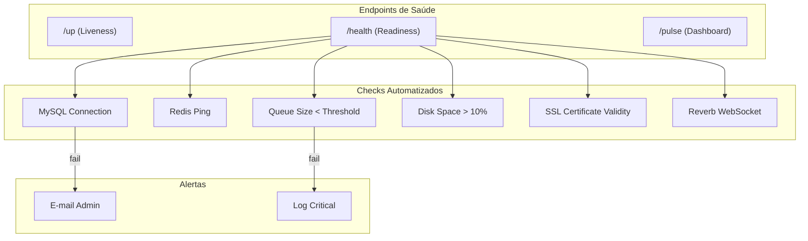

# Dashboard e Healthcheck (Observabilidade Ativa)

> **[AI_RULE]** O código deve gritar quando estiver doente antes que o usuário ligue reclamando na equipe de suporte do Kalibrium SaaS.

## 1. Endpoints de Liveness e Readiness `[AI_RULE_CRITICAL]`

> **[AI_RULE_CRITICAL] A Lei do Ping Monitorado**
> É **BARRADO** lançar qualquer novo microsserviço ou integração (ex: RabbitMQ, novo bucket S3, integração INMETRO) sem injetar o ping equivalente na rota mãe `/up` ou `/health`.
> Se a AI provisionar o Laravel Pulse ou spatie/laravel-health, cada recurso do container deve ser linkado imediatamente sob pena de cegueira operacional.

## 2. Métricas Customizadas de Negócio

- Além de CPU/RAM, nós monitoramos **Throbbing de Negócio**:
  1. Tempo médio de resposta da emissão de `FiscalNote`.
  2. Número de `TimeClockEntry` retidos em cache local vs sincados no servidor nas últimas 24 hrs.
  3. Fila de `Emails` / Faturas presas como "Failed" na queue `redis`.

## 3. Arquitetura de Healthcheck



## 4. Implementação dos Health Checks

```php
// Usando spatie/laravel-health
use Spatie\Health\Facades\Health;
use Spatie\Health\Checks\Checks\{
    DatabaseCheck,
    RedisCheck,
    CacheCheck,
    ScheduleCheck,
    UsedDiskSpaceCheck,
};

// app/Providers/HealthServiceProvider.php
Health::checks([
    DatabaseCheck::new()->name('MySQL'),
    RedisCheck::new()->name('Redis'),
    CacheCheck::new()->name('Cache Layer'),
    ScheduleCheck::new()->heartbeatMaxAgeInMinutes(5),
    UsedDiskSpaceCheck::new()
        ->warnWhenUsedSpaceIsAbovePercentage(80)
        ->failWhenUsedSpaceIsAbovePercentage(90),

    // Checks customizados de negócio
    // Namespace: App\Health\Checks\QueueSizeCheck
    QueueSizeCheck::new()
        ->failWhenQueueSizeIsAbove(1000)
        ->queue('default'),
    // Namespace: App\Health\Checks\FailedJobsCheck
    FailedJobsCheck::new()
        ->failWhenFailedJobsCountIsAbove(50),
]);

// Package: spatie/laravel-health (deve constar também no Bill of Materials em STACK-TECNOLOGICA.md)

// Notificação via Reverb WebSocket em caso de falha crítica:
// Canal: health-alerts
// Evento: App\Events\HealthAlertTriggered
```

## 5. Métricas de Negócio Monitoradas `[AI_RULE]`

> **[AI_RULE]** Todo novo módulo que processa dados críticos DEVE expor métricas para o dashboard de saúde.

| Métrica | Módulo | Threshold Warning | Threshold Critical |
|---------|--------|------------------|-------------------|
| Invoices não emitidas > 24h | Finance | > 10 | > 50 |
| Pontos não sincronizados | HR | > 20 | > 100 |
| Jobs na fila `failed_jobs` | Core | > 10 | > 50 |
| Tempo de resposta P95 | Core | > 500ms | > 2000ms |
| Certificados expirados | Lab | > 5 | > 20 |
| Ordens de serviço atrasadas | WorkOrders | > 10% | > 25% |
| Disco utilizado | Infra | > 80% | > 90% |
| Conexões Redis ativas | Infra | > 80% pool | > 95% pool |
| WebSocket connections | Reverb | > 500 | > 1000 |

## 6. Dashboard Operacional (Laravel Pulse)

O Laravel Pulse fornece visibilidade em tempo real:

- **Slow Queries:** Queries acima de 100ms são capturadas automaticamente
- **Slow Requests:** Endpoints com P95 > 500ms aparecem em destaque
- **Exceptions:** Top 10 exceptions por frequência nas últimas 24h
- **Queue Throughput:** Jobs processados/falhados por minuto
- **Cache Hit Rate:** Percentual de acertos no Redis
- **Servers:** CPU, memória e disco do servidor `203.0.113.10`

## 7. Alertas e Notificações

```php
// Scheduler de verificação (a cada 5 minutos)
// app/Console/Kernel.php
$schedule->command('health:check')->everyFiveMinutes();
$schedule->command('health:queue-check-heartbeat')->everyMinute();

// Notificação via canal configurável
// Em caso de falha, dispara:
// 1. Log::critical() para monitoramento
// 2. E-mail para admin@kalibrium.com.br
// 3. Notificação no dashboard admin (via Reverb)
```

## 8. Checklist para Novos Recursos `[AI_RULE]`

> **[AI_RULE]** Ao adicionar qualquer integração externa ou recurso de infraestrutura:

- [ ] Health check registrado em `HealthServiceProvider`
- [ ] Threshold de warning e critical definidos
- [ ] Endpoint `/health` retorna status do novo recurso
- [ ] Log de falha com `correlation_id` para rastreabilidade
- [ ] Alerta configurado para equipe de operações
