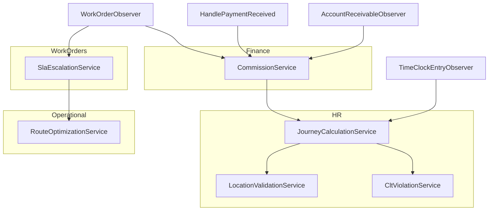

# Servicos Transversais (Cross-Cutting Services)

> **[AI_RULE]** Este documento descreve servicos que sao consumidos por multiplos modulos e fluxos. Cada servico tem interface definida, regras de negocio e localizacao no codebase.

---

## 1. RouteOptimizationService

### 1.1 Ficha Tecnica

| Campo | Valor |
|-------|-------|
| **Modulo** | Operational |
| **Referenciado em** | `TECNICO-EM-CAMPO.md`, Secao 4.4 |
| **Path esperado** | `app/Services/RouteOptimizationService.php` |
| **Controller** | `RouteOptimizationController` |
| **Endpoint** | `POST /api/v1/operational/route-optimization` |
| **Consumidores** | WorkOrders, Agenda, Fleet |

### 1.2 Interface

```php
// app/Contracts/RouteOptimizationContract.php

namespace App\Contracts;

interface RouteOptimizationContract
{
    /**
     * Otimiza a ordem de visita de um conjunto de ordens de servico.
     *
     * @param float $startLat Latitude de partida (posicao atual do tecnico)
     * @param float $startLng Longitude de partida
     * @param array $workOrders Lista de OS com 'id', 'latitude', 'longitude'
     * @param array $options Opcoes: 'algorithm' (nearest_neighbor|genetic), 'return_to_base' (bool)
     * @return array OS reordenadas com distancias e tempo estimado
     */
    public function optimize(
        float $startLat,
        float $startLng,
        array $workOrders,
        array $options = []
    ): array;

    /**
     * Calcula distancia entre dois pontos usando formula de Haversine.
     *
     * @return float Distancia em quilometros
     */
    public function haversineDistance(
        float $lat1,
        float $lng1,
        float $lat2,
        float $lng2
    ): float;
}
```

### 1.3 Regras de Negocio

| Regra | Descricao |
|-------|-----------|
| **Algoritmo padrao** | Nearest Neighbor (guloso) — O(n^2). Parte da posicao atual, seleciona a OS mais proxima, repete |
| **Calculo de distancia** | Formula de Haversine (distancia geodesica sobre esfera terrestre, raio = 6.371 km) |
| **Retorno a base** | Opcional. Se `return_to_base = true`, inclui distancia de retorno no custo total |
| **Velocidade media** | 40 km/h urbano (configuravel em `config/operational.php`) |
| **Limite de OS** | Maximo 20 OS por otimizacao (limitacao do Nearest Neighbor) |

> **[AI_RULE]** O Nearest Neighbor NAO garante solucao otima global. Para frotas com >15 veiculos, considerar algoritmo genetico ou integracao com Google Directions API.

---

## 2. LocationValidationService

### 2.1 Ficha Tecnica

| Campo | Valor |
|-------|-------|
| **Modulo** | HR (Ponto Digital) |
| **Referenciado em** | `PORTARIA-671.md` Secao 3.2, `TECNICO-EM-CAMPO.md` Secao 5.3 |
| **Path esperado** | `app/Services/LocationValidationService.php` |
| **Consumidores** | TimeClockService, WorkOrderExecutionController |

### 2.2 Interface

```php
// app/Contracts/LocationValidationContract.php

namespace App\Contracts;

interface LocationValidationContract
{
    /**
     * Verifica se coordenadas estao dentro do geofence de um local de trabalho.
     *
     * @param float $lat Latitude da batida
     * @param float $lng Longitude da batida
     * @param float $targetLat Latitude do local de trabalho
     * @param float $targetLng Longitude do local de trabalho
     * @param float $toleranceMeters Raio de tolerancia em metros (default: 150)
     * @return bool True se dentro do geofence
     */
    public function isWithinGeofence(
        float $lat,
        float $lng,
        float $targetLat,
        float $targetLng,
        float $toleranceMeters = 150.0
    ): bool;

    /**
     * Detecta possivel spoofing de GPS.
     * Verifica: velocidade impossivel entre batidas, coordenadas identicas repetidas,
     * precisao GPS anomala.
     *
     * @param float $lat Latitude atual
     * @param float $lng Longitude atual
     * @param float $accuracy Precisao GPS em metros
     * @param int $userId ID do colaborador
     * @return array{is_spoofing: bool, reason: ?string, confidence: float}
     */
    public function detectSpoofing(
        float $lat,
        float $lng,
        float $accuracy,
        int $userId
    ): array;

    /**
     * Valida localizacao completa para registro de ponto.
     * Combina isWithinGeofence + detectSpoofing.
     *
     * @return array{valid: bool, distance_meters: float, is_spoofing: bool, reason: ?string}
     */
    public function validate(
        float $lat,
        float $lng,
        float $accuracy,
        int $userId,
        ?int $workLocationId = null
    ): array;
}
```

### 2.3 Regras de Negocio

| Regra | Descricao |
|-------|-----------|
| **Formula** | Haversine: `d = 2r * arcsin(sqrt(sin^2((lat2-lat1)/2) + cos(lat1)*cos(lat2)*sin^2((lng2-lng1)/2)))` |
| **Tolerancia padrao** | 150 metros (configuravel em `config/hr.php` → `default_geofence_radius`) |
| **Spoofing: velocidade** | Se distancia entre duas batidas / tempo < 5 minutos implica >200 km/h, flag como spoofing |
| **Spoofing: repetição** | 3+ batidas consecutivas com coordenadas identicas (6 casas decimais) = flag |
| **Spoofing: precisao** | Precisao GPS reportada < 1 metro = flag (improvavel em dispositivos reais) |
| **Evento** | Spoofing detectado dispara `LocationSpoofingDetected` event |

> **[AI_RULE_CRITICAL]** A rejeicao de ponto por localizacao NAO pode impedir o registro (Art. 77, II Portaria 671). O ponto e registrado com `location_valid = false` e gera alerta ao gestor.

---

## 3. CltViolationService

### 3.1 Ficha Tecnica

| Campo | Valor |
|-------|-------|
| **Modulo** | HR (Compliance Trabalhista) |
| **Referenciado em** | `PORTARIA-671.md` Secao 4, `20-20-eventos-listeners-observers.md` |
| **Path esperado** | `app/Services/CltViolationService.php` |
| **Consumidores** | JourneyCalculationService, TimeClockEntryObserver, Dashboard HR |

### 3.2 Interface

```php
// app/Contracts/CltViolationContract.php

namespace App\Contracts;

use App\Models\Employee;
use Illuminate\Support\Collection;

interface CltViolationContract
{
    /**
     * Verifica todas as violacoes CLT para um colaborador em um dia.
     *
     * @param Employee $employee Colaborador
     * @param string $date Data no formato Y-m-d
     * @return Collection<CltViolation> Violacoes detectadas (pode ser vazia)
     */
    public function check(Employee $employee, string $date): Collection;

    /**
     * Verifica intervalo interjornada (Art. 66 CLT — minimo 11h).
     */
    public function checkInterJourney(Employee $employee, string $date): ?array;

    /**
     * Verifica intervalo intrajornada (Art. 71 CLT — 1h para jornada >6h).
     */
    public function checkIntraJourney(Employee $employee, string $date): ?array;

    /**
     * Verifica excesso de hora extra (Art. 59 CLT — max 2h/dia).
     */
    public function checkOvertimeExcess(Employee $employee, string $date): ?array;

    /**
     * Verifica hora extra de menor de idade (Art. 413 CLT — proibido).
     */
    public function checkMinorOvertime(Employee $employee, string $date): ?array;
}
```

### 3.3 Tabela de Violacoes

| Tipo | Artigo CLT | Descricao | Severidade | Deteccao |
|------|-----------|-----------|------------|----------|
| `inter_journey` | Art. 66 | Interjornada < 11h | `high` | `clock_out[dia] → clock_in[dia+1]` < 11h |
| `intra_journey` | Art. 71 | Intrajornada < 1h (jornada >6h) ou < 15min (jornada 4-6h) | `high` | Tempo entre saida e retorno do intervalo |
| `overtime_excess` | Art. 59 | Hora extra > 2h/dia | `medium` | Horas trabalhadas - jornada contratual > 2h |
| `minor_overtime` | Art. 413 | Hora extra para menor de 18 anos | `critical` | Idade do colaborador + horas extras > 0 |
| `night_work_irregular` | Art. 73 | Trabalho noturno sem adicional configurado | `medium` | Batidas entre 22h-05h sem flag de adicional |
| `weekly_excess` | TST 172 | Jornada semanal > 44h (sem acordo de compensacao) | `medium` | Soma semanal de horas trabalhadas |

> **[AI_RULE_CRITICAL]** Violacoes detectadas DEVEM ser salvas em `clt_violations` e gerar evento `CltViolationDetected`. A IA nunca deve silenciar ou ignorar uma violacao detectada.

---

## 4. JourneyCalculationService

### 4.1 Ficha Tecnica

| Campo | Valor |
|-------|-------|
| **Modulo** | HR (Calculo de Jornada) |
| **Referenciado em** | `PORTARIA-671.md` Secao 6, `20-20-eventos-listeners-observers.md` Secao 5.3 |
| **Path esperado** | `app/Services/JourneyCalculationService.php` |
| **Consumidores** | TimeClockEntryObserver, EspelhoController, PayrollService |

### 4.2 Interface

```php
// app/Contracts/JourneyCalculationContract.php

namespace App\Contracts;

use App\Models\Employee;

interface JourneyCalculationContract
{
    /**
     * Calcula jornada de um dia a partir das batidas de ponto.
     *
     * @return array{
     *   total_hours: float,
     *   normal_hours: float,
     *   overtime_50: float,
     *   overtime_100: float,
     *   night_hours: float,
     *   night_premium_hours: float,
     *   break_duration: float,
     *   is_holiday: bool,
     *   violations: array
     * }
     */
    public function calculateDay(Employee $employee, string $date): array;

    /**
     * Calcula jornada de um periodo (semana ou mes).
     * Inclui DSR (Descanso Semanal Remunerado) com reflexo.
     *
     * @return array{
     *   days: array,
     *   total_normal: float,
     *   total_overtime_50: float,
     *   total_overtime_100: float,
     *   total_night: float,
     *   dsr_value: float,
     *   dsr_overtime_reflex: float
     * }
     */
    public function calculatePeriod(Employee $employee, string $startDate, string $endDate): array;

    /**
     * Calcula adicional noturno.
     * Hora noturna = 52min30s (Art. 73 CLT).
     * Adicional = 20% sobre hora diurna.
     */
    public function calculateNightShift(Employee $employee, string $date): array;
}
```

### 4.3 Regras de Negocio

| Regra | Base Legal | Calculo |
|-------|-----------|---------|
| **Horas normais** | Art. 58 CLT | Ate 8h/dia ou conforme contrato |
| **Hora extra 50%** | Art. 59 CLT | Horas alem da jornada em dia util |
| **Hora extra 100%** | Art. 59 CLT | Horas em domingo/feriado |
| **Adicional noturno** | Art. 73 CLT | 20% sobre hora diurna, periodo 22h-05h |
| **Hora noturna reduzida** | Art. 73, §1 CLT | 1 hora noturna = 52min30s (fator 7/8) |
| **DSR** | Lei 605/49 | Remuneracao do repouso semanal |
| **DSR reflexo hora extra** | TST Sumula 172 | `(total_extras_semana / dias_uteis) * domingos_feriados` |
| **DSR reflexo OJ 60** | TST OJ 60 | DSR integra base de calculo de extras habituais |

> **[AI_RULE]** O calculo de jornada e a base para folha de pagamento (Payroll). Erros aqui impactam diretamente o eSocial (S-1200) e podem gerar autuacoes.

---

## 5. SlaEscalationService

### 5.1 Ficha Tecnica

| Campo | Valor |
|-------|-------|
| **Modulo** | WorkOrders / ServiceCalls |
| **Referenciado em** | `SLA-ESCALONAMENTO.md`, `WorkOrderObserver` |
| **Path esperado** | `app/Services/SlaEscalationService.php` |
| **Consumidores** | WorkOrderObserver, ServiceCallController, Dashboard |

### 5.2 Interface

```php
// app/Contracts/SlaEscalationContract.php

namespace App\Contracts;

use App\Models\WorkOrder;

interface SlaEscalationContract
{
    /**
     * Inicia timer de SLA para uma OS ou chamado.
     * O timer e pausado automaticamente em status de espera (awaiting_parts, on_hold).
     */
    public function startTimer(WorkOrder $workOrder): void;

    /**
     * Pausa o timer de SLA (ex: OS em espera de pecas).
     * Registra motivo e timestamp de pausa.
     */
    public function pauseTimer(WorkOrder $workOrder, string $reason): void;

    /**
     * Retoma o timer de SLA apos pausa.
     */
    public function resumeTimer(WorkOrder $workOrder): void;

    /**
     * Verifica SLAs vencidos ou proximos do vencimento e escala.
     * Chamado pelo scheduler a cada 5 minutos.
     *
     * @return array{escalated: int, warnings: int}
     */
    public function checkAndEscalate(): array;

    /**
     * Retorna dados de SLA para o dashboard.
     *
     * @return array{
     *   total_active: int,
     *   within_sla: int,
     *   warning: int,
     *   breached: int,
     *   avg_response_time: float,
     *   avg_resolution_time: float
     * }
     */
    public function getDashboard(int $tenantId): array;
}
```

### 5.3 Niveis de Escalonamento

| Nivel | Condicao | Acao | Notificados |
|-------|----------|------|-------------|
| **1 - Warning** | 75% do SLA consumido | Notificacao push ao tecnico | Tecnico atribuido |
| **2 - Escalation** | 90% do SLA consumido | Notificacao ao coordenador | Coordenador + Tecnico |
| **3 - Breach** | 100% do SLA atingido | Alerta critico + reatribuicao sugerida | Gerente + Coordenador + Tecnico |
| **4 - Critical** | >120% do SLA (vencido ha tempo) | Dashboard executivo + email ao gestor | Diretoria + Gerente |

### 5.4 Regras de Pausa

| Status da OS | Timer SLA | Motivo |
|-------------|-----------|--------|
| `scheduled` | Rodando | Aguardando inicio |
| `in_progress` | Rodando | Em execucao |
| `awaiting_parts` | **Pausado** | Depende de estoque |
| `on_hold` | **Pausado** | Bloqueio externo |
| `completed` | **Parado** | Concluido |
| `cancelled` | **Parado** | Cancelado |

> **[AI_RULE]** O SLA nunca deve ser manipulado manualmente. Pausas sao automaticas baseadas no status da OS. Qualquer alteracao manual deve ser auditada.

---

## 6. CommissionService

### 6.1 Ficha Tecnica

| Campo | Valor |
|-------|-------|
| **Modulo** | Finance / Commercial |
| **Referenciado em** | `20-20-eventos-listeners-observers.md`, `FATURAMENTO-POS-SERVICO.md` |
| **Path esperado** | `app/Services/CommissionService.php` |
| **Consumidores** | WorkOrderObserver, HandleWorkOrderCompletion, HandlePaymentReceived, AccountReceivableObserver |

### 6.2 Interface

```php
// app/Contracts/CommissionServiceContract.php

namespace App\Contracts;

use App\Models\WorkOrder;
use App\Models\AccountReceivable;
use App\Models\CommissionEvent;

interface CommissionServiceContract
{
    /**
     * Calcula e gera comissoes para uma OS.
     *
     * @param WorkOrder $workOrder OS concluida ou faturada
     * @param string $trigger Momento do calculo: 'wo_completed', 'wo_invoiced', 'payment_received'
     * @return array<CommissionEvent> Comissoes geradas
     */
    public function calculateAndGenerate(WorkOrder $workOrder, string $trigger): array;

    /**
     * Libera comissoes pendentes quando pagamento e recebido.
     * Calcula proporcionalidade se pagamento for parcial.
     *
     * @param AccountReceivable $ar Conta a receber com pagamento
     * @return array<CommissionEvent> Comissoes liberadas
     */
    public function releaseByPayment(AccountReceivable $ar): array;

    /**
     * Estorna comissoes quando OS e cancelada ou pagamento revertido.
     *
     * @param WorkOrder $workOrder OS cancelada
     * @param string $reason Motivo do estorno
     * @return array<CommissionEvent> Comissoes estornadas (status='reversed')
     */
    public function reverse(WorkOrder $workOrder, string $reason): array;
}
```

### 6.3 Triggers de Comissao

| Trigger | Quando | Comportamento |
|---------|--------|---------------|
| **`WHEN_OS_COMPLETED`** | OS muda para status `completed` | Gera comissao com status `pending`. Aguarda faturamento/pagamento para liberacao. |
| **`WHEN_OS_INVOICED`** | OS muda para status `invoiced` | Gera comissao com status `approved`. Aguarda pagamento para liberacao financeira. |
| **`WHEN_PAYMENT_RECEIVED`** | Pagamento registrado no AR | Libera comissao para pagamento. Se parcial, libera proporcionalmente ao valor pago. |

### 6.4 CommissionEvent Model

- **Tabela:** `fin_commission_events`
- **Campos:**
  | Campo | Tipo | Descrição |
  |-------|------|-----------|
  | id | bigint unsigned | PK |
  | tenant_id | bigint unsigned | FK tenants |
  | user_id | bigint unsigned | FK users (vendedor/técnico) |
  | work_order_id | bigint unsigned nullable | FK work_orders |
  | contract_id | bigint unsigned nullable | FK contracts |
  | type | enum('sale','renewal','upsell','referral') | Tipo da comissão |
  | base_value | decimal(15,2) | Valor base para cálculo |
  | rate | decimal(5,4) | Taxa de comissão (ex: 0.0500 = 5%) |
  | calculated_amount | decimal(15,2) | Valor calculado |
  | status | enum('pending','approved','released','paid') | Status do ciclo |
  | approved_by | bigint unsigned nullable | FK users |
  | approved_at | timestamp nullable | |
  | paid_at | timestamp nullable | |
  | timestamps | | created_at, updated_at |
- **Service:** `App\Services\Finance\CommissionService`

### 6.5 Regras de Negocio

| Regra | Descricao |
|-------|-----------|
| **Proporcionalidade** | Se pagamento parcial (ex: 50%), comissao liberada proporcionalmente (50% do valor) |
| **Estorno** | Cancelamento de OS reverte todas as comissoes. Status muda para `reversed` |
| **Idempotencia** | Guard: se ja existe `CommissionEvent` para mesma OS + trigger, nao duplicar |
| **Beneficiarios** | Tecnico (assigned_to), Vendedor (salesperson_id), Coordenador (se configurado) |
| **Base de calculo** | Valor total da OS (servicos + produtos) ou margem (configuravel por tenant) |
| **Ciclo de vida** | `pending → approved → released → paid` ou `pending → reversed` |

> **[AI_RULE]** O `AccountReceivableObserver` ja trata reversao de comissoes quando AR e cancelado. NAO duplicar essa logica em outros pontos.

---

## 7. Diagrama de Dependencias entre Servicos



---

> **[AI_RULE]** Ao criar um novo servico transversal, adicionar neste documento com: ficha tecnica, interface PHP, regras de negocio e dependencias.
