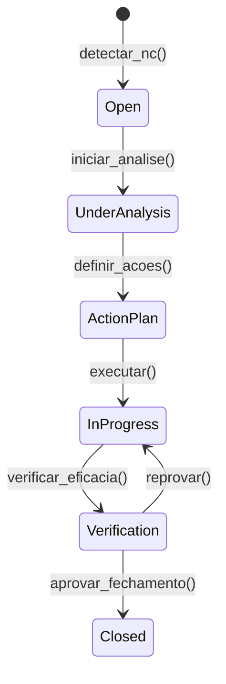
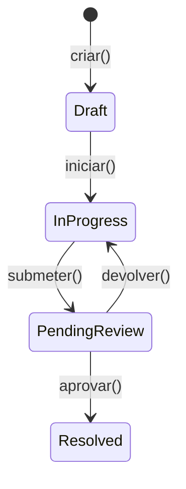

# Conformidade Legal - Norma ISO-9001 (Gestão da Qualidade)

> **[AI_RULE]** A ISO-9001 exige rastreabilidade total de Não Conformidades (RNC) e Auditorias.
> **[COMPLIANCE]** Ver documentação técnica do módulo: [Quality](../modules/Quality.md)

## 1. Feature Flag Condicional `[AI_RULE_CRITICAL]`

> **[AI_RULE_CRITICAL] Acionamento Dinâmico por Tenant**
> A obediência à ISO-9001 é **OPTATIVA E CONFIGURÁVEL** por Tenant (`TenantSetting::isFeatureEnabled('strict_iso_9001')`). Diferentes clientes escolhem ativar esse modo duro de trabalho mesmo se não possuírem a certificação final.

## 2. Regras de Não Conformidade (RNC)

Quando a feature estiver **Habilitada**, as seguintes regras se aplicam ao código gerado pela IA:

- **Fechamento de `QualityCorrectiveAction`:** Não pode transitar para `Resolved` sem ter os campos preenchidos de `root_cause_analysis` (Causa Raiz 5 Porquês) e `preventive_measure` (Ação Preventiva).
- Fluxos de reclamação (`WorkOrder` negado ou retrabalho) abrem automaticamente um `QualityCorrectiveAction` para investigação. Se a feature estiver **Desabilitada**, esse trigger é ignorado.

### 2.1 Entidades do Módulo Quality

| Model | Descrição | Campos Principais |
|---|---|---|
| `QualityNonConformance` | Registro de Não Conformidade (RNC) | `title`, `description`, `source` (interna/externa/cliente), `severity` (low/medium/high/critical), `status`, `detected_by`, `detected_at` |
| `QualityCorrectiveAction` | Ação Corretiva / Preventiva (CAPA) | `non_conformance_id`, `type` (corrective/preventive), `root_cause_analysis`, `immediate_action`, `preventive_measure`, `responsible_user_id`, `deadline`, `status` |
| `QualityAudit` | Auditoria Interna/Externa | `audit_type` (internal/external/supplier), `auditor_name`, `scope`, `findings`, `scheduled_date`, `completed_date`, `status` |
| `QualityDocument` | Controle de Documentos | `title`, `code`, `revision`, `category`, `content`, `approved_by`, `effective_date`, `expiry_date` |

### 2.2 Máquina de Estados da RNC



### 2.3 Máquina de Estados do CAPA



- Transição para `Resolved` exige `root_cause_analysis` e `preventive_measure` preenchidos.
- O campo `root_cause_analysis` deve seguir a metodologia dos 5 Porquês (mínimo 1, recomendado 5 níveis).

## 3. Auditorias Internas

- O sistema permite agendar auditorias internas com periodicidade configurável por tenant.
- Cada `QualityAudit` gera achados (`findings`) que podem ser vinculados a RNCs automaticamente.
- Auditorias possuem checklist configurável por processo/departamento.
- Relatório de auditoria é gerado em PDF com assinatura do auditor e do responsável pelo processo auditado.
- Histórico completo de auditorias fica disponível para consulta e exportação.

## 4. Controle de Documentos

- Todos os documentos do SGQ (Sistema de Gestão da Qualidade) são versionados via `QualityDocument`.
- Cada revisão mantém o documento anterior como histórico (`QualityDocumentRevision`).
- Fluxo de aprovação: `draft → pending_review → approved → obsolete`.
- Documentos aprovados são distribuídos automaticamente aos setores relevantes (notificação).
- Documentos obsoletos ficam marcados mas nunca são deletados (requisito de auditoria).

### 4.1 Exemplo de Código — Controle de Documentos `[AI_RULE_CRITICAL]`

```php
// QualityDocumentService::approve()
public function approve(QualityDocument $doc, int $approverId): void
{
    if ($doc->status !== 'pending_review') {
        throw new BusinessException('Apenas documentos em revisão podem ser aprovados.');
    }

    // Versão anterior se torna obsoleta
    QualityDocument::where('code', $doc->code)
        ->where('id', '!=', $doc->id)
        ->where('status', 'approved')
        ->update(['status' => 'obsolete']);

    $doc->update([
        'status' => 'approved',
        'approved_by' => $approverId,
        'effective_date' => now(),
    ]);

    // Notificar setores relevantes sobre nova versão
    DocumentDistributionJob::dispatch($doc);

    AuditLog::record('approve_document', $doc, [
        'approver' => $approverId,
        'revision' => $doc->revision,
    ]);
}
```

## 5. Análise Crítica pela Direção (Management Review)

- O sistema consolida indicadores de qualidade para a reunião de análise crítica:
  - Total de RNCs abertas/fechadas no período
  - Tempo médio de resolução de CAPAs
  - Resultados de auditorias internas
  - Indicadores de satisfação do cliente (via `CustomerSatisfactionSurvey`)
  - Reclamações de clientes vinculadas a `WorkOrder`
- Relatório consolidado exportável em PDF.

### 5.1 Fontes de Dados para KPIs da Análise Crítica

| KPI | Módulo Fonte | Model/Service | Fórmula/Query |
|---|---|---|---|
| Taxa de RNC por período | Quality | `QualityNonConformance` | `COUNT(WHERE created_at BETWEEN período)` agrupado por `source` |
| Tempo médio de resolução CAPA | Quality | `QualityCorrectiveAction` | `AVG(updated_at - created_at) WHERE status = 'resolved'` |
| Taxa de retrabalho | Service | `WorkOrder` | `COUNT(WHERE has_rework = true) / COUNT(total) * 100` |
| NPS (Net Promoter Score) | CRM | `CustomerSatisfactionSurvey` | `% Promotores (9-10) - % Detratores (0-6)` |
| Taxa de conformidade de entrega | Service | `WorkOrder` | `COUNT(completed_at <= deadline) / COUNT(total) * 100` |
| Eficácia de auditorias | Quality | `QualityAudit` | `COUNT(findings resolved) / COUNT(total findings) * 100` |
| Satisfação média do cliente | CRM | `CustomerSatisfactionSurvey` | `AVG(rating)` por período |
| Instrumentos com calibração vencida | Lab | `Instrument` | `COUNT(WHERE is_expired = true)` |
| Competências técnicas vencidas | HR | `UserCompetency` | `COUNT(WHERE expiry_date < now())` |
| Reclamações de clientes | CRM/Quality | `QualityNonConformance` | `COUNT(WHERE source = 'cliente')` |

## 6. Satisfação do Cliente

- Pesquisas de satisfação são disparadas automaticamente após fechamento de `WorkOrder` ou entrega de `CalibrationCertificate`.
- Respostas negativas (nota < 3 em escala 1-5) geram RNC automática quando `strict_iso_9001` está habilitado.
- Dashboard com NPS (Net Promoter Score) e tendência temporal.

### 6.1 CustomerSatisfactionSurvey Model

- **Tabela:** `qual_customer_satisfaction_surveys`
- **Campos:**

  | Campo | Tipo | Descrição |
  |-------|------|-----------|
  | id | bigint unsigned | PK |
  | tenant_id | bigint unsigned | FK tenants |
  | customer_id | bigint unsigned | FK customers |
  | work_order_id | bigint unsigned nullable | FK work_orders |
  | type | enum('nps','csat','ces') | Tipo de pesquisa |
  | score | integer nullable | Nota (NPS: 0-10, CSAT: 1-5, CES: 1-7) |
  | comment | text nullable | Comentário do cliente |
  | sent_at | timestamp | Data de envio |
  | responded_at | timestamp nullable | Data de resposta |
  | channel | enum('email','sms','portal','whatsapp') | Canal de envio |
  | is_anonymous | boolean default false | Se é anônima |
  | timestamps | | created_at, updated_at |

- **Trigger:** Listener `SendSatisfactionSurveyOnWorkOrderCompleted` ouve `WorkOrderCompleted`
- **Delay:** Enviar 24h após conclusão da OS (queued job `SendSurveyJob`)
- **Service:** `App\Services\Quality\SatisfactionSurveyService`
- **Endpoints:**
  - `GET /api/v1/quality/surveys` — listar pesquisas
  - `POST /api/v1/quality/surveys/{id}/respond` — registrar resposta (portal do cliente)
  - `GET /api/v1/quality/surveys/dashboard` — dashboard NPS/CSAT

## 7. Abordagem por Processos

- Cada módulo do sistema (Service Calls, Work Orders, Lab, Quotes) é mapeado como um processo do SGQ.
- Indicadores de processo (KPIs) são configuráveis por tenant: tempo de ciclo, taxa de retrabalho, conformidade de entrega.
- Não conformidades são rastreadas até o processo de origem para análise de tendência.

## 8. Trilha de Auditoria

- Todas as ações no módulo Quality são registradas em `audit_logs`.
- Registros imutáveis contendo: `user_id`, `action`, `model_type`, `model_id`, `old_values`, `new_values`, `timestamp`.
- Exportação em formato compatível com auditorias externas (CSV/PDF).

---

## 9. Mapeamento Completo: Cláusulas ISO 9001:2015 → Sistema

| Cláusula | Requisito | Módulo | Feature no Sistema | Status |
|---|---|---|---|---|
| §4.1 | Contexto da organização | Core | Dados do tenant, setor de atuação, partes interessadas cadastradas | Implementado |
| §4.2 | Necessidades das partes interessadas | CRM | `Customer`, `Supplier`, `CustomerSatisfactionSurvey` | Implementado |
| §4.3 | Escopo do SGQ | Quality | `QualityDocument` com escopo documentado | Implementado |
| §4.4 | SGQ e seus processos | Quality | Mapeamento de processos por módulo, KPIs por processo | Implementado |
| §5.1 | Liderança e comprometimento | Quality | Dashboard de análise crítica, indicadores visíveis à diretoria | Implementado |
| §5.2 | Política da qualidade | Quality | `QualityDocument` com política aprovada e distribuída | Implementado |
| §5.3 | Papéis organizacionais | Core | `Role`, `Permission`, organograma de responsabilidades | Implementado |
| §6.1 | Ações para abordar riscos | Quality | Análise de tendência de RNCs, CAPAs preventivos | Implementado |
| §6.2 | Objetivos da qualidade | Quality | KPIs configuráveis por tenant com metas | Implementado |
| §6.3 | Planejamento de mudanças | Quality | Controle de documentos com fluxo de revisão e aprovação | Implementado |
| §7.1 | Recursos | HR/Lab | `Employee`, `Instrument`, `UserCompetency` | Implementado |
| §7.2 | Competência | HR | `UserCompetency` com validade, tipo e evidência | Implementado |
| §7.3 | Conscientização | Quality | Distribuição automática de documentos aprovados | Implementado |
| §7.4 | Comunicação | Core | Notificações automáticas por email/push | Implementado |
| §7.5 | Informação documentada | Quality | `QualityDocument` + `QualityDocumentRevision` com versionamento | Implementado |
| §8.1 | Planejamento operacional | Service | `WorkOrder` com planejamento, prazo e recursos | Implementado |
| §8.2 | Requisitos de produtos/serviços | Service | `Quote`, `WorkOrder` com escopo definido e aprovado pelo cliente | Implementado |
| §8.4 | Controle de fornecedores | Quality | `QualityAudit` tipo `supplier`, avaliação de fornecedores | Implementado |
| §8.5 | Produção e provisão de serviço | Service/Lab | `WorkOrder`, `CalibrationCertificate` com rastreabilidade completa | Implementado |
| §8.7 | Controle de saídas não conformes | Quality | `QualityNonConformance` → `QualityCorrectiveAction` | Implementado |
| §9.1 | Monitoramento e medição | Quality | KPIs por processo, dashboard de indicadores | Implementado |
| §9.2 | Auditoria interna | Quality | `QualityAudit` com periodicidade e checklist configuráveis | Implementado |
| §9.3 | Análise crítica pela direção | Quality | Relatório consolidado com todos os KPIs (ver §5.1) | Implementado |
| §10.1 | Melhoria contínua | Quality | Ciclo PDCA via RNC → CAPA → verificação de eficácia | Implementado |
| §10.2 | Não conformidade e ação corretiva | Quality | `QualityNonConformance` + `QualityCorrectiveAction` com 5 Porquês | Implementado |
| §10.3 | Melhoria contínua (análise de dados) | Quality | Análise de tendência de RNCs, Pareto de causas | Implementado |

## 10. Mapeamento de Implementação (Implementation Mapping)

### 10.1 Revisão pela Direção (§9.3) `[AI_RULE]`

> **[AI_RULE]** Os dados da revisão pela direção DEVEM ser gerados automaticamente pelo sistema. Nunca depender de input manual para consolidação de indicadores — o sistema agrega de todas as fontes automaticamente.

| Camada | Artefato | Detalhes |
|---|---|---|
| Scheduled Job | `GenerateManagementReviewData` | Executa mensalmente via `schedule:run`. Consolida todos os KPIs, RNCs, CAPAs, auditorias e feedbacks do período em um snapshot persistido |
| Service | `ManagementReviewService::aggregate()` | Coleta dados de múltiplas fontes: `QualityNonConformance` (RNCs abertas/fechadas), `QualityCorrectiveAction` (CAPAs e tempo de resolução), `QualityAudit` (achados e eficácia), `CustomerSatisfactionSurvey` (NPS e satisfação média), `WorkOrder` (taxa de retrabalho e conformidade de entrega), `Instrument` (calibrações vencidas), `UserCompetency` (competências vencidas) |
| Endpoint | `GET /api/v1/quality/management-review?period=2026-Q1` | Retorna JSON com todos os indicadores consolidados do período. Aceita parâmetros: `period` (formato YYYY-QN ou YYYY-MM), `format` (json/pdf). Protegido por permission `quality.management-review.view` |
| Response | JSON estruturado | `{ period, generated_at, kpis: { rnc_summary, capa_summary, audit_summary, customer_satisfaction, operational_metrics, resource_status }, recommendations: [] }` |
| Teste | `ManagementReviewTest` | Valida: agregação correta de todas as fontes, filtragem por período, geração automática via job, exportação PDF, permissão de acesso |

### 10.2 KPIs Operacionais (§8.1)

| Camada | Artefato | Detalhes |
|---|---|---|
| Service | `OperationalKpiService::calculate()` | Calcula métricas operacionais em tempo real (com cache) para o tenant corrente |
| Métricas | Indicadores calculados | `lead_time` — tempo médio do pedido à entrega (dias), `rework_rate` — percentual de ordens com retrabalho, `capacity_utilization` — taxa de utilização da capacidade (técnicos/equipamentos), `process_compliance` — percentual de processos conformes vs. total |
| Cache | Tag-based caching | Tag: `quality:kpis:tenant_{id}`, TTL: 1 hora. Cache invalidado automaticamente ao fechar `WorkOrder`, criar `QualityNonConformance` ou concluir `QualityAudit` via `CacheInvalidationListener` |
| Endpoint | `GET /api/v1/quality/operational-kpis` | Retorna JSON com todas as métricas operacionais. Aceita parâmetros: `period` (YYYY-MM), `process` (filtro por módulo). Protegido por permission `quality.kpis.view` |
| Response | JSON estruturado | `{ period, tenant_id, metrics: { lead_time: { value, unit, trend }, rework_rate: { value, unit, trend }, capacity_utilization: { value, unit, trend }, process_compliance: { value, unit, trend } }, cached_at }` |
| Teste | `OperationalKpiTest` | Valida: cálculo correto de cada métrica, cache hit/miss, invalidação de cache, filtragem por período e processo, permissão de acesso |

---

## 11. Checklist de Auditoria Interna ISO 9001

### 11.1 Contexto e Liderança (Cláusulas 4–5)

- [ ] Escopo do SGQ documentado e aprovado — **Onde:** Menu Quality → Documentos → filtro "escopo"
- [ ] Política da qualidade comunicada a todos os colaboradores
- [ ] Responsabilidades e autoridades definidas — **Onde:** Menu Admin → Papéis e Permissões
- [ ] Riscos e oportunidades identificados com ações planejadas
- [ ] Objetivos da qualidade definidos com indicadores mensuráveis

### 11.2 Apoio (Cláusulas 6–7)

- [ ] Recursos adequados fornecidos (pessoal, infraestrutura, ambiente)
- [ ] Competências de pessoal registradas e válidas — **Onde:** Menu HR → Competências
- [ ] Informação documentada controlada (versionamento, aprovação) — **Onde:** Menu Quality → Documentos
- [ ] Documentos obsoletos identificados e inacessíveis para uso não intencional
- [ ] Comunicação interna e externa definida e eficaz

### 11.3 Operação (Cláusula 8)

- [ ] Processos de realização planejados e controlados — **Onde:** Menu Service → Ordens de Serviço
- [ ] Requisitos de produto/serviço determinados e revisados com o cliente
- [ ] Fornecedores avaliados e monitorados — **Onde:** Menu Quality → Auditorias → tipo "supplier"
- [ ] Rastreabilidade de produto/serviço garantida (do pedido à entrega)
- [ ] Saídas não conformes identificadas e controladas

### 11.4 Avaliação de Desempenho (Cláusula 9)

- [ ] Indicadores de processo monitorados — **Onde:** Dashboard Quality → KPIs
- [ ] Satisfação do cliente medida — **Onde:** Dashboard CRM → NPS
- [ ] Auditorias internas realizadas conforme programa — **Onde:** Menu Quality → Auditorias
- [ ] Análise crítica pela direção realizada com inputs obrigatórios — **Onde:** Dashboard Quality → Análise Crítica
- [ ] Saídas da análise crítica documentadas com ações definidas

### 11.5 Melhoria (Cláusula 10)

- [ ] Não conformidades registradas e tratadas — **Onde:** Menu Quality → Não Conformidades
- [ ] Ações corretivas implementadas com análise de causa raiz (5 Porquês)
- [ ] Eficácia das ações corretivas verificada antes do fechamento
- [ ] Dados analisados para identificar tendências e oportunidades de melhoria
- [ ] Evidência de melhoria contínua (redução de RNCs, melhoria de KPIs)

---

## 12. Gaps Identificados e Ações Corretivas (2026-03-26)

> **Referência:** [Gap Analysis completo](../auditoria/GAP-ANALYSIS-ISO-17025-9001.md)

### 12.1 Gaps no Contexto de Calibração

| # | Gap | Cláusula | Status | Ação |
|---|-----|----------|--------|------|
| G01 | `UserCompetency` inexistente | §7.2 | ❌ | Criar model para competência metrológica |
| G06 | OS desconectada do certificado | §8.1 | ⚠️ | FK `work_order_id` no `EquipmentCalibration` |
| G15 | Wizard sem guia contextual | §8.5 | ⚠️ | Redesenhar wizard com 10 steps guiados |

### 12.2 Integração Calibração ↔ Qualidade

| Requisito ISO 9001 | Integração com Calibração | Status |
|--------------------|--------------------------|--------|
| §8.7 Controle de saídas NC | Calibração não-conforme → RNC automática | ⚠️ Parcial (manual) → Automatizar |
| §10.2 Ação corretiva | Falha de padrão → CAPA com 5 Porquês | ⚠️ Parcial → Automatizar cascade |
| §9.1 Monitoramento | KPIs de calibração no dashboard gerencial | ✅ Implementado |
| §9.2 Auditoria interna | Checklist ISO 17025 no módulo Quality | ⚠️ Parcial → Criar checklist específico |

### 12.3 Fluxos Documentados

| Fluxo | Arquivo | Cobre |
|-------|---------|-------|
| Certificado de Calibração | [CERTIFICADO-CALIBRACAO.md](../fluxos/CERTIFICADO-CALIBRACAO.md) | §8.1, §8.5 |
| Controle de Padrões | [CONTROLE-PADROES-REFERENCIA.md](../fluxos/CONTROLE-PADROES-REFERENCIA.md) | §7.1 (recursos) |
| Competência Pessoal | [COMPETENCIA-PESSOAL-METROLOGIA.md](../fluxos/COMPETENCIA-PESSOAL-METROLOGIA.md) | §7.2 |

### 12.4 Estatísticas de Conformidade

| Seção | Conforme | Parcial | Não-conforme |
|-------|---------|---------|-------------|
| §4-6 Contexto/Liderança/Planejamento | 10 (100%) | 0 | 0 |
| §7 Apoio | 3 (60%) | 0 | 2 (40%) |
| §8 Operação | 3 (60%) | 2 (40%) | 0 |
| §9 Avaliação | 3 (100%) | 0 | 0 |
| §10 Melhoria | 3 (100%) | 0 | 0 |
| **TOTAL** | **22 (85%)** | **2 (8%)** | **2 (8%)** |

> **Meta:** 100% conforme após implementação do plano.
